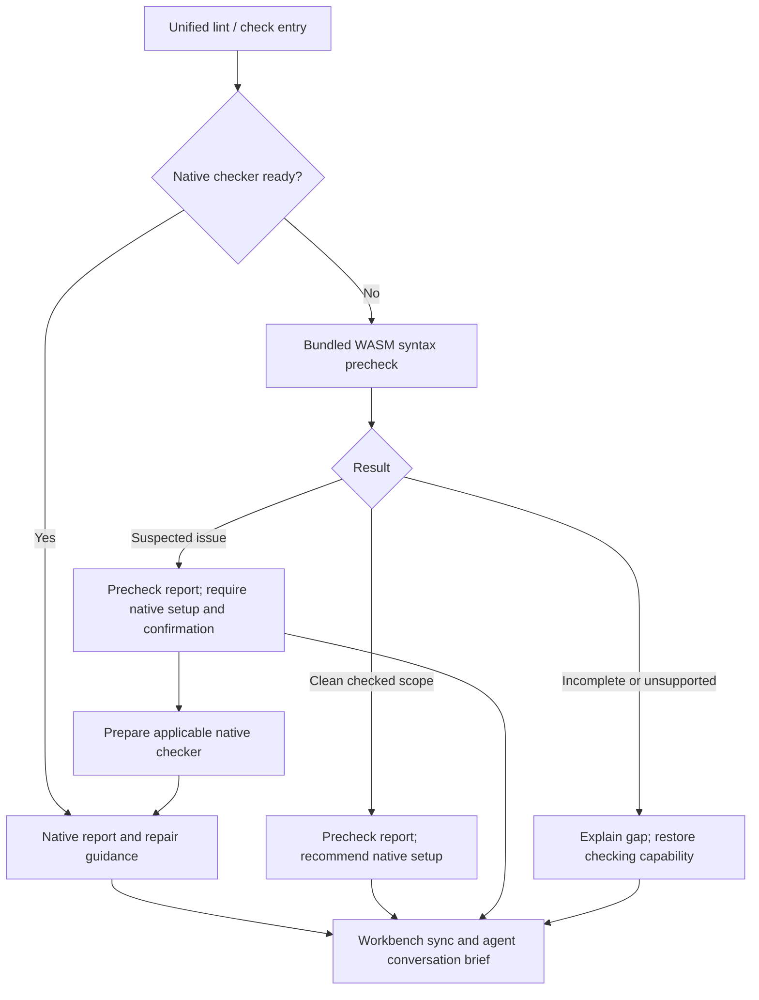

# Codeguard

[English](README.md) | [简体中文](README.zh-CN.md)

**A Rust CLI for native static checks and actionable repair workflows.**

Codeguard helps developers and coding agents discover existing quality configuration, run selected native checkers, and turn results into durable repair tasks. Rust owns orchestration and interpretation; Maven, P3C, Checkstyle, Javadoc, Ruff, Cargo, ESLint, and other native tools remain responsible for their checks.

> **Status:** early development, source `0.1.4`. Several native checks and local repair workflows work within explicitly bounded scopes. Full delivery gates, complete language coverage, automatic task closure, and host-plugin integration remain incomplete.
>
> **Baseline:** The current source and [implementation evidence](openspec/changes/introduce-rust-codeguard-cli/implementation-baseline.md) define callable behavior. Declared Rust minimum `1.85`, edition `2024`, Cargo resolver `2`. `@partme.ai/codeguard@0.1.4` is published for Apple Silicon macOS; no multi-platform binary release or crates.io availability is claimed.

```text
Project files + existing checker configuration
                    |
                    v
Codeguard: discover -> select -> native tools -> interpret
                    |                         |
                    v                         v
       Findings / environment blockers    Human / JSON / SARIF*
                    |
                    v
       Stable tasks -> agent repair -> original-tool recheck

* SARIF is supported by selected check output paths.
```

Source builds also support `codeguard task verify TASK_ID . --erl-tool /absolute/path/to/erl --format=json` for existing Erlang WASM confirmation tasks. Omitting the option uses the same invoking absolute-PATH selection as lint/check. `next` retains current native positions, concrete unresolved reasons and reusable tool argv; `repair_ready` shares the existing lease and attempt history. OTP 28 macro/preprocessor coverage remains unresolved, and zero diagnostics cannot close the task. These changes are absent from public npm 0.1.4. See [Erlang repair-loop acceptance](tests/acceptance/erlang-native-task-verification.md).

## 1. Purpose and boundaries

- Discover languages, build roots, declared versions, checker configuration, and statically observable module relationships.
- Unify code-style, documentation, dependency, vulnerability, security, and build checks as native adapters become available.
- Explain missing configuration and environment problems without misreporting them as source violations.
- Return findings and repair steps to the caller's conversation through human-readable or structured output.
- Preserve stable tasks and failed attempts; stop repeating actions that make no progress.
- Support precise false-positive dispositions. Current public allowlist commands inspect or propose decisions; they do not approve them.

The CLI contains no LLM or vector database. It does not reimplement P3C/Maven checks in Rust. Native tools may still require a JVM, Node.js, Python, Go, or Rust toolchain. Python reference fixtures are test material, not a second Codeguard runtime.

Source builds connect native P3C single-file lint to the nearest initialized workspace, or an explicit `--workspace ROOT`. Use `codeguard lint java FILE --checker p3c` with the existing explicit Maven/JDK/offline-repository arguments. Only the selected file and the nearest POM’s statically confirmed rule subset are checked; `check java` and `task verify` reuse the same stable task. Explicit P3C selection does not silently switch to WASM. This is local feedback, not complete P3C coverage or automatic task closure. See [workflow](docs/Codeguard-Native-Repair-Workflow.md#p3c-single-file-project-binding) and [acceptance](tests/acceptance/java-p3c-file-workbench.md). Public npm 0.1.4 is unchanged.

A failed P3C execution can still contribute validated, current diagnostics to stable source tasks while retaining its execution blocker. This does not increase completed-file counts or prove absence. See [partial-execution acceptance](tests/acceptance/java-p3c-partial-execution.md).

## 2. Capabilities and maturity

| Area | Current implementation | Boundary and evidence |
| :--- | :--- | :--- |
| Discovery / init | Multi-language observations, Maven/Cargo declarations, profiles, module graph, managed `AGENTS.md` | Static observations; architecture remains unknown without evidence. [Tests](crates/codeguard-cli/tests/init_command_contract.rs) |
| Python | Configuration-aware Ruff lint and `D###` documentation diagnostics; standard-pylock pip-audit observations | Partial scope/policy; distinguish simulated and real tool evidence. [Ruff](tests/acceptance/python-lint-scan.md), [CVE](tests/acceptance/python-cve-partial-native.md) |
| Rust | Clippy, Rustdoc, `cargo check`, cargo-audit; selected `check all` and repair integrations | Not every workspace/feature/target combination. [Clippy](tests/acceptance/check-all-partial-native.md), [Rustdoc](tests/acceptance/rustdoc-check-all.md), [build recheck](tests/acceptance/rust-build-task-verification.md) |
| Java | Maven configuration discovery; scoped P3C, JDK Javadoc, Checkstyle, dependency and OWASP observations | Explicit tool/configuration limits. [P3C](tests/acceptance/java-p3c-cli-native-local.md), [Javadoc](tests/acceptance/java-javadoc-cli-native-local.md), [Checkstyle](tests/acceptance/java-checkstyle-cli-local.md) |
| JavaScript / TypeScript | ESLint via `lint typescript` and source-built `check all`; npm audit via `cve typescript` and `check all` | Aggregate ESLint supports local 10.x and a unique flat config; not all package managers. [ESLint](tests/acceptance/eslint-public-lint-feedback.md), [npm](tests/acceptance/npm-partial-native.md) |
| Go | Scoped native Go vet observation | Not a full Go gate. [Evidence](tests/acceptance/go-vet-json-local-probe.md) |
| Repair workbench | Findings, task projections, sync, next, leases, attempts, selected rechecks | Formal task close/reopen remains pending. [Tests](crates/codeguard-cli/tests/task_verify_contract.rs) |
| Other languages | Capability inventory and explicit gaps | Registry presence is not an executable adapter. [Inventory](docs/CAPABILITIES.md) |

The six categories are `lint`, `comments`, `dependencies`, `cve`, `security`, and `build`. The registry defines 28 finer detection families; enumeration is not a coverage claim. See [capability dimensions](crates/codeguard-core/src/capability_dimensions.rs).

## 3. Architecture and layout

| Crate | Responsibility | Workspace dependencies |
| :--- | :--- | :--- |
| `codeguard-cli` | Binary, arguments, application orchestration, workspace files, feedback | core, runtime, adapters |
| `codeguard-core` | Findings, completion, obligations, gate calculation, allowlist matching, readiness | None |
| `codeguard-runtime` | Processes, snapshots, scheduling, cancellation, locks, artifact primitives | core |
| `codeguard-adapters` | Native command contracts, configuration observations, report parsing | core |

```text
codeguard/
├── Cargo.toml / Cargo.lock
├── crates/
│   ├── codeguard-cli/
│   ├── codeguard-core/
│   ├── codeguard-runtime/
│   └── codeguard-adapters/
├── rulepacks/          # preview candidates and legacy inventory
├── schemas/            # versioned data contracts
├── npm/                # thin Node command launcher
├── scripts/            # local npm packaging
├── docs/               # architecture, design, generated inventory
└── tests/              # acceptance records and shared fixtures
```

Repository: `codeguard`. Binary: `codeguard`. Cargo package: `codeguard-cli`. A checked project's generated `.codeguard/` data directory is separate from this source repository.

## 4. Build and first read-only run

Use a toolchain supporting Rust edition 2024. Declaring MSRV `1.85` does not prove every dependency/target combination on that version. Native execution and local coordination use Unix-specific code. Reviewed execution evidence is from macOS ARM64; the other candidate platforms are not a certified support matrix.

The WASM dependency is constrained to `tree-sitter-language=0.1.7` to preserve the declared Rust 1.85 baseline. The locked metadata regression and an explicit 1.85 CI check cover different evidence levels; full target/MSRV acceptance remains open. See [compatibility evidence](tests/acceptance/rust-msrv-dependency-compatibility.md).

```bash
git clone https://github.com/full-stack-plugins/codeguard.git
cd codeguard
cargo build --locked -p codeguard-cli
./target/debug/codeguard --version --format json
./target/debug/codeguard capabilities java --format json
./target/debug/codeguard detect . --format json
./target/debug/codeguard init . --dry-run --format json
```

Version output includes `cli_version`, `target`, and protocol information. Discovery and init preview return observations and unknowns. Dry-run creates neither `AGENTS.md` nor a project data directory. Add Cargo `--offline` only when dependencies are cached.

Source builds now support `codeguard lint erlang FILE --timeout 10s --format=json`, automatically selecting `erl` from absolute PATH directories. `--erl-tool /absolute/path/to/erl` overrides discovery. The 0.2 feedback records the selection source and canonical executable; native failures never silently select another tool or WASM. OTP 28 scanning/parsing takes priority and catches the pinned WASM's missing-period case; macro/preprocessor inputs stay unresolved. If no executable can be resolved, the optional WASM candidate remains available and retains its known limit. This single-file forms observation remains incomplete for project delivery; published npm 0.1.4 does not include this new command. See the [native-first evidence](tests/acceptance/erlang-native-first.md).

The workspace requires `std`. The opt-in `wasm-precheck` build feature uses a bounded Rust worker with thirty-two pinned grammar candidates: ArkTS, C, C++, C#, Go, Java, JavaScript, Lua, Luau, Objective-C, Python, Rust, Solidity, TypeScript, TSX, Zig, Nix, Terraform, R, Ruby, PHP, Kotlin, Dart, Erlang, Pascal, CFML, CFQuery, CFScript, COBOL, Scala, Swift and VB.NET. Java and TypeScript/TSX have narrow single-file fallback paths; `lint python` can provide bounded suspected syntax positions when Ruff is unavailable or no project Ruff configuration is declared. Native Ruff results take priority. The published npm `0.1.3` package includes the candidate feature; `0.1.2` did not. No `no_std`, completed project-wide WASM fallback, zero-unsafe, or fastest-runtime claim is made. Runtime OS calls require safety review; a comprehensive security audit is not claimed.

The current source-built CLI's `codeguard grammar status --format=json` reports the coverage gap without loading grammars or running lint: the pinned CodeGraph source has 30 vendored WASM files plus two distinct grammars resolved through its dependency; CodeGuard has thirty-two unqualified asset candidates (ArkTS, C, C++, C#, Go, Java, JavaScript, Lua, Luau, Objective-C, Python, Rust, Solidity, TypeScript, TSX, Zig, Nix, Terraform, R, Ruby, PHP, Kotlin, Dart, Erlang, Pascal, CFML, CFQuery, CFScript, COBOL, Scala, Swift, VB.NET) and zero released syntax capabilities. C, C++, C#, Go, JavaScript, Lua, Luau and Rust are byte-pinned CodeGraph assets that load in the Rust worker but have no language-qualified standalone lint route or release qualification. ArkTS, Nix and Terraform are also pinned Rust-loadable candidates with narrow valid/invalid fixtures and no language-qualified standalone lint route or release qualification; see the [limited acceptance record](tests/acceptance/arkts-nix-terraform-grammar-candidates.md). The two dependency grammars retain their source bytes and use a byte-pinned legacy `dylink` metadata conversion for Rust loading; they have no language-qualified standalone lint route or release qualification. Zig uses a byte-pinned import adaptation so the corrected CodeGraph grammar can load in Rust; it has a narrow `lint zig` native-first candidate route but no release qualification. [Zig's limited acceptance record](tests/acceptance/zig-grammar-candidate.md) distinguishes this from released syntax support. Python has an unqualified CLI fallback path; its report remains incomplete and cannot approve delivery. R, Ruby, PHP and Kotlin have pinned CodeGraph bytes, licenses, measured Rust ABI and narrow worker samples; PHP covers mixed HTML/PHP, and all four remain unqualified. The original CodeGraph Dart WASM cannot be instantiated by Rust, but CodeGuard now pins a reproducible Zig rebuild with the real scanner and a byte-pinned WASI import adaptation. Its narrow Rust and worker fixtures pass, while public lint and release remain unqualified; see the [Dart rebuild record](tests/acceptance/dart-grammar-rebuild-candidate.md). Erlang has pinned CodeGraph bytes, the upstream 0.19 license, ABI 14 and Rust worker tests. Current source builds also have an OTP 28 native comparison, an explicit native-first `lint erlang --erl-tool` command and task verification; the original WASM still misses function terminators. Those native extensions are absent from public npm 0.1.4, and full language/release qualification remains open. See the [native comparison](tests/acceptance/erlang-native-differential.md) and [task verification](tests/acceptance/erlang-native-task-verification.md). Pascal now has pinned CodeGraph bytes and its original Isopod dependency commit and license; ABI 14 and narrow worker tests pass, but native comparison and public lint remain open. See the [Pascal candidate record](tests/acceptance/pascal-grammar-candidate.md). The remaining CFML/CFQuery/CFScript/COBOL/Scala/Swift/VB.NET assets also load in the Rust worker, bringing the candidate inventory to 32/32 with zero released syntax capabilities. CFQuery misses `SELECT FROM`, VB.NET misparses a valid unindented method, and COBOL has a high load cost; see the [seven-asset acceptance record](tests/acceptance/final-seven-grammar-candidates.md). The separate [coverage inventory](grammars/codegraph-coverage.json) is not an approved asset manifest. COBOL's 16.4 MB asset now fits the bounded 20 MiB loader input, but its cold-load and memory budgets remain unqualified.

The source-built `grammar status` now includes each candidate's bounded `known_limitations`, including the [VB.NET false-positive reproduction](tests/acceptance/vbnet-unindented-method-false-positive.md). This is risk context for the agent, not a confirmed violation or a native compiler result.

### npm installation and one-off use

In a source build with `--features wasm-precheck`, `codeguard grammar probe <language> <file> --format=json` can explicitly run any of the 32 pinned candidates in an isolated worker. It always exits 3 with `status=incomplete`, `native.status=not_run`, and `delivery_decision=not_evaluated`; a completed parse also has `precheck.status=incomplete`. Input or worker failures use the same [closed JSON schema](schemas/grammar-probe-v0.1.schema.json). Recovery anchors are suspected observations only. This diagnostic command does not yet connect all grammars to language-qualified native-first `lint/check`; the published npm package includes it as an unqualified candidate.

Source-built `check all` now selects module-local ESLint 10 and a single flat config for discovered JS/TS/TSX files. It prefers `--node-tool`, otherwise resolving Node from PATH. Results appear under `native_results.node_lint`; initialized workspaces synchronize stable tasks and return `next`. Completed native files with matching source bytes skip duplicate WASM; missing configuration, ignored files and native failures retain their reasons and candidate fallback. The native path also works without the WASM feature. This wiring is included in npm 0.1.4 and does not cover pnpm symlink packages, older ESLint versions or every configuration combination. See [aggregate ESLint acceptance](tests/acceptance/check-all-eslint.md).

The same source build now runs a bounded candidate pass from `codeguard check all . --format=json` after existing native checks. Its `syntax_candidates` field in [check feedback 0.38.0](schemas/check-feedback-v0.38.schema.json) carries bounded known grammar limitations and distinguishes TSX, JavaScript, CFScript and explicitly embedded CFQuery, preserving native blockers and skipped work. Python files covered by a completed Ruff scan of identical source bytes skip duplicate WASM and count under `native_preferred_count`; files without matching native syntax evidence retain candidate prechecks. Four bounded integration fixtures collectively invoked all 32 pinned grammars through this command. Every observation remains unqualified and the command exits 3; 64 files/64 fragments/90 seconds bound the candidate pass. This is not yet a language-qualified native fallback; published npm `0.1.3` includes this candidate route, while the 0.35.0 known-limitation projection is included in 0.1.4. See [acceptance evidence](tests/acceptance/check-all-32-grammar-candidates.md). Narrow 13-case syntax differentials agree for [C11 against Apple Clang 21](tests/acceptance/c-native-differential.md), [Rust 2021 against rustfmt 1.9.0](tests/acceptance/rust-native-differential.md), and [Ruby 2.6.10](tests/acceptance/ruby-native-differential.md); none qualifies native lint. The [Swift 6.4 differential](tests/acceptance/swift-native-differential.md) now separates 12 decidable agreements from one hidden-error case reported as incomplete; Swift remains unqualified.

The source-build acceptance test also runs the 31-file mixed-language fixture as one project: at most two isolated candidate workers run concurrently, subject to `--jobs`, while report order, source rechecks, and the 90-second candidate deadline remain fixed. A local run observed all 32 candidates with no skipped fragments; the Linux WASM integration step for source commit `ff60184` passed the same one-project test; the complete CI run passed. This is still candidate coverage, not qualified lint.

Java now also has a narrow [javac 21 / Java 17 differential](tests/acceptance/java-native-differential.md): 8 valid and 5 invalid syntax samples agree with the pinned WASM. This does not qualify Java lint, other language versions, or project-wide native-first routing.

The [Kotlin 2.4.10 differential](tests/acceptance/kotlin-native-differential.md) now separates 11 decidable agreements from two hidden-error cases: native-rejected `fun f(x: ) = x` and native-valid `object C { val value = 1 }`. Both are incomplete rather than clean or confirmed violations; run the applicable native checker. Zero diagnostic counts cannot classify incomplete scans.

The source-built Unix CLI also has a narrow Zig route: `codeguard lint zig FILE --zig-tool /absolute/path/to/zig --format=json`. An explicitly supplied tool reporting Zig 0.16.0 and retaining the same byte digest runs native `ast-check` first; its source positions are retained without exposing source snippets. Without an explicit tool, the pinned Zig WASM provides an unqualified observation. Both paths remain incomplete because `ast-check` covers only local AST errors, not full lint, build or tests. See the [Zig feedback schema](schemas/zig-lint-feedback-v0.1.schema.json).

On Apple Silicon macOS, the published `0.1.4` candidate package was verified with a fresh npm cache:

```bash
npx --yes @partme.ai/codeguard@0.1.4 --version --format json
npx --yes @partme.ai/codeguard@0.1.4 grammar status --format=json
npx --yes @partme.ai/codeguard@0.1.4 check all . --format=json
```

For a project check, replace the arguments after the package name with the desired Codeguard command. The package is currently restricted to macOS arm64.

The Node entry point invokes the same Rust executable. From this checkout, build one host-native bundle and package it without npm lifecycle scripts:

```bash
cargo build --release --locked -p codeguard-cli
CODEGUARD_TARBALL="$(node scripts/pack-npm-local.mjs)"
npm install -g "$CODEGUARD_TARBALL" --ignore-scripts
codeguard --version --format json
```

For a one-off Node invocation without a global installation:

```bash
npm exec --yes --package "$CODEGUARD_TARBALL" -- codeguard detect . --format json
```

The packer currently supports macOS and Linux on x64/arm64 when a matching native binary is available. It requires Node 18+, npm, and an already built Rust binary for the current host. It checks the binary's reported target and version before packaging, and writes a platform-tagged tarball under ignored `release/npm/`. The default package is private and local-only. `node scripts/pack-npm-local.mjs --public` prepares the public `@partme.ai/codeguard` package with a README, full license, and host restrictions. Version `0.1.3` is published with all 32 WASM candidates; its registry-hosted `npx` entry and artifact hashes were verified on Apple Silicon macOS. The binary reports the candidate source commit, which is not a signed or reproducible-build attestation. Other platforms need their own verified binary packages. See the [distribution design](docs/Codeguard-Technical-Design.md) and [0.1.3 acceptance record](tests/acceptance/npm-0.1.3-wasm-candidate.md).

To prepare a **local** package with candidate WASM support, build with `cargo build --locked -p codeguard-cli --features wasm-precheck` and run `node scripts/pack-npm-local.mjs --require-wasm target/debug/codeguard`. The packer rejects a binary without the worker, checks all 32 pinned asset identities, and executes a bounded Zig candidate probe before writing the tarball. `--public` requires the same check and verified upstream licenses. The published `0.1.3` package carries all 32 candidates; local and registry installation do not qualify a language or certify a clean project.

## 5. Repair workflow

Make the built binary available as `codeguard` on `PATH`, or use its absolute path. In a target project:

```bash
codeguard init . --dry-run --format json
codeguard init . --apply --format json
codeguard check all . --format json
codeguard work sync . --format json
codeguard next . --format json
codeguard status . --format json
```

Current `init --apply` returns exit `3` and partial status even when files were created. `check all` also remains incomplete: inspect its findings and next actions. Do not convert exit `3` into CI success. Integrated checks already save/sync reports in initialized workspaces; explicit `work sync` supports recovery.

Set `TASK_ID` to an actual ID returned by `next`, then inspect and recheck after repair:

```bash
codeguard task show "$TASK_ID" . --format json
codeguard task verify "$TASK_ID" . --format json
```

Supply the original checker's required tool/configuration options to `task verify`. Missing tools require environment repair. Selected rechecks recognize native suppression or changed configuration; zero diagnostics alone do not close a task.

## 6. Command guide

`codeguard --help` provides current syntax. Source and acceptance records identify exact scopes; a few help descriptions remain conservative.

| Family | Value | Current boundary |
| :--- | :--- | :--- |
| `--version`, `capabilities`, `detect` | Binary, inventory, project observations | Current source `detect` 0.4.0 exposes local ESLint/Maven Wrapper candidates; no tool is run or approved |
| `init --dry-run / --apply` | Preview/create/refresh workbench | No implicit install, build, Hook takeover, or architecture certification |
| `config validate / explain`, `rules list` | Inspect configuration and rule origins | Candidates do not establish policy authority |
| `tools list / verify`, `doctor` | Inspect tools and limited environment probes | Explicit Ruff doctor probe; `tools install --apply` is blocked |
| `plan CATEGORY LANGUAGE` | Preview selections and gaps | Not a certified execution plan |
| `hook plan` | Route a versioned host event to a candidate check tier | Reads bounded JSON on stdin; exit 3, no check or host blocking |
| `hook execute` | Run read-only discovery, bounded Stop guidance, task-bound recheck, selected Python/Ruff, JS/TS/ESLint and optional WASM feedback, or a live pre-commit index safety preview | Explicit timeout; repair reuses `task verify` and never closes a task or approves delivery |
| `hook claude <session-start\|user-prompt-submit\|post-tool-use\|post-tool-use-failure\|stop>` | Map Claude Code lifecycle events to read-only discovery, constant prompt guidance, bounded edit feedback, no-check failure feedback, or local next-step guidance | Candidate soft Hooks; Stop offers one task continuation at most; default Hooks and delivery gates remain incomplete |
| `lint python / java / typescript / go` | Run selected native checks | Adapter-specific options and scope |
| `comments rust`, `build rust` | Documentation and type checking | Build does not run project tests |
| `cve rust / python / typescript` | Native advisory observations | Database identity/freshness and full coverage remain limited |
| `check all / <canonical-language-id>` | Aggregate integrated checks and repair feedback | Full project: `incomplete`; scoped request: `not_evaluated` |
| `work sync`, `status`, `next`, `task show` | Persist and inspect repair work | Task files are not a gate |
| `task claim / heartbeat / release`, `task attempt start / finish` | Local ownership and attempt history | Unix local coordination, not distributed locking |
| `task verify` | Repeat selected original checkers | Formal closure/reopening pending |
| `rules whitelist list / explain / propose` | Inspect/propose false-positive dispositions and corrections | No public approval or activation |
| `gate pre-commit` | Git-index path/object observation and narrow OpenSSH Ed25519 key detection | Incomplete preview; not a full content/security gate |

Current source `config validate/explain` returns version 0.3 static native configuration observations per build root, including source hashes, unresolved conditions and preparation steps. It never runs JS configuration or native checkers; effective rules and suppressions remain unresolved. See [configuration acceptance](tests/acceptance/config-native-observation.md). This extension is not included in public npm 0.1.4.

For Python edit feedback, run `codeguard lint python . --file src/changed.py --format json`. `--file` is repeatable with a limit of eight distinct paths, 512 bytes per path and 2 KiB combined. The response declares `scan_scope=selected_files` and observes only those files; it is not imported as a full workspace scan and cannot approve delivery. Without `--file`, the existing command still scans discovered Python files and synchronizes its local report.

Generic `dependencies`, generic `security`, arbitrary category/language combinations, `fix`, `gate pre-push`, `gate ci`, `mcp serve`, and the legacy compatibility dispatcher are target-design surfaces, not available commands in this baseline.

### Native-first entry points and syntax fallback — design target

**The published `0.1.3` includes bounded WASM candidate routing but not qualified fallback or automatic conversation delivery.** The existing commands remain the unified entry points; native adapter-specific prerequisites still apply today:

An opt-in source build with `--features codeguard-cli/wasm-precheck` has narrow TypeScript and Java single-file candidate paths. For TypeScript, a visible local ESLint 10 entry and one flat config take priority: when an executable Node is resolved from `PATH`, the CLI runs its existing bounded native probe; without Node it reports the setup gap. Only when the project-local ESLint package is not observed can the bundled TypeScript/TSX candidate provide suspected syntax positions; an untrusted entry, package identity or config returns a specific setup blocker. The Java candidate likewise remains incomplete. Python `lint` first preserves Ruff results, then can attach suspected positions for missing Ruff or undeclared project Ruff configuration; a broken Ruff configuration stays a setup blocker. For one checked file in an initialized workspace, the source-only path syncs one stable native-confirmation task; repeat candidate scans do not close it. No bundled grammar has an accepted language/dialect range. Native observations and prechecks never approve delivery. Default and published binaries keep their previous native-context behavior. [TypeScript acceptance](tests/acceptance/typescript-syntax-fallback-candidate.md) · [native-first acceptance](tests/acceptance/native-first-eslint-candidate.md) · [Java acceptance](tests/acceptance/java-syntax-fallback-candidate.md).

With an initialized `--workspace`, that TypeScript/TSX fallback now returns a real, stable native-confirmation task ID after sync; repeated WASM scans never close it. A versioned local report now preserves bounded suspected positions with source and grammar identities; capability-matched native closure still needs implementation. [Workbench acceptance](tests/acceptance/typescript-syntax-confirmation-task.md).

```bash
codeguard lint java .
codeguard lint typescript .
codeguard check all .
```

Target behavior selects per module/language/configuration, so a ready frontend checker and a Java module missing its JDK can take different paths:



Already-required native checks remain required even when precheck is clean. A native failure/violation cannot be erased by fallback. Installed tools with broken configuration need configuration repair. Suspected parser issues require native confirmation, not an automatic source edit; installation alone does not close a task. WASM syntax results do not cover type checks, style, Javadoc, CVE or security. See [architecture](docs/Codeguard-Architecture.md) section 8 and [technical design](docs/Codeguard-Technical-Design.md) sections 5.3–5.4.

## 7. Configuration and native tools

Native configuration controls native rule selection. Static discovery reports `configured`, `missing`, `invalid`, or `unknown`; it does not execute wrappers or JavaScript configuration to guess an effective build model.

Optional `.codeguard/runtime.json` controls scheduling only:

```json
{
  "schema_version": "1.1",
  "document_type": "codeguard_runtime_options",
  "timeout": "30m",
  "jobs": 4
}
```

For `check`: CLI → `CODEGUARD_TIMEOUT` / `CODEGUARD_JOBS` → project file → defaults. Default timeout is 30 minutes; default jobs is available CPU parallelism capped at four. Limits are 1 ms–24 hours and 1–64 jobs. Current hard deadlines cover native execution, not every discovery/persistence operation. Runtime options cannot disable rules or approve exceptions. See [schema](schemas/runtime-options-1.1.schema.json) and [selection code](crates/codeguard-cli/src/check_budget.rs).

Adapters use selected executables/configuration, not arbitrary command strings. Options include `--ruff-tool`, `--cargo-tool`, `--go-tool`, `--java-home`, explicit Maven repositories, and explicit Node/tool entry points. Prepare tools first; Codeguard does not silently install them. External checkers retain their own runtimes.

## 8. Results, exit codes, and false positives

| Code | Result-contract meaning |
| :--- | :--- |
| `0` | Query/operation success or a justified nonblocking result where implemented; not automatically delivery permission |
| `1` | Violations in a complete evaluated obligation set |
| `2` | Invalid/unsupported command or arguments |
| `3` | Incomplete configuration, execution, coverage, or policy context |
| `4` | Internal error |
| `130` | Cancellation |

These are [core semantics](crates/codeguard-core/src/verdict.rs), not a promise that partial scans produce all verdicts. Findings and completion are independent: timeout may retain valid findings; missing JDK is an environment blocker; damaged reports do not manufacture violations. Human/JSON are primary outputs; selected `check` paths support SARIF.

False-positive handling retains the native finding and matches a disposition to exact checker/rule/target/evidence identity. Expiry, revocation, and changed inputs require reevaluation. Public proposal/correction commands are partial workflows. Writing `approved: true` in a project file does not activate an exception. See [technical design](docs/Codeguard-Technical-Design.md).

### Conversation report examples — target presentation

These are illustrative report designs, not current CLI transcripts; the paths/task ID are synthetic, and English runtime localization is not claimed. Real messages must use actual scope, diagnostics and persisted task IDs.

```text
Codeguard: Java syntax precheck found 1 suspected issue

Method: bundled Tree-sitter WASM
Scope: 18 Java files selected and checked; 0 unresolved
Native check: not run; the project's required JDK is unavailable
Location: src/main/java/example/UserService.java:42
Observation: the parser recovered a missing syntax node here

Next steps (required):
1. Prepare the project's declared JDK and applicable native checker.
2. Run native verification covering this file and Java syntax.
3. Follow the native diagnostic, repair and recheck.

Task: CG-example-java-setup (illustrative; only after successful sync)
Recheck entry (after restoring original project tool/configuration context):
codeguard task verify CG-example-java-setup . --format json
This is not yet a confirmed code violation. Delivery is not evaluated.
```

A clean precheck with no existing native requirement should be shorter:

```text
Codeguard: no syntax anomaly observed in 18 checked Java files
Method: bundled Tree-sitter WASM; all 18 selected files checked.
Native lint: not run. Recommended: configure and prepare the native checker.
Not covered: types, project style rules and dependency security.
This is a syntax observation, not complete lint or delivery approval.
```

For a timeout, say “17 of 18 files checked; precheck incomplete”, identify the unresolved file and give the environment/parser recovery action. Do not say “all passed” or “source error”. For a native finding, show the actual checker/rule/location and original-tool recheck step. Do not guess missing tokens or promise a specific fix from a recovery node alone.

The plugin must deliver a bounded brief through the host's tool-result/context API; CLI JSON and files alone are not automatic conversation injection. Send initial results and meaningful changes, reuse stable tasks and avoid repeating unchanged installation requests. [Technical design](docs/Codeguard-Technical-Design.md) sections 7.3–7.4 include four complete scenarios, a proposed JSON example and review rules; none is a new supported report schema yet.

## 9. Data, security, and recovery

```text
.codeguard/                       # inside the checked project
├── .gitignore / README.md / workspace.json
├── project.json / module-graph.json / architecture.md
├── findings/                     # redacted facts and events
├── tasks/                        # readable repair projections
├── decisions/                    # intended decision references
├── reports/                      # ignored
├── runs/                         # ignored
├── cache/                        # ignored
├── worktrees/                    # ignored
└── state/                        # ignored
```

An existing `codeguard/src` remains user source and is still scanned. A previous `codeguard/workspace.json` is reported as a migration conflict; Codeguard does not move that directory automatically because it may also contain user code. Ignore rules are not a confidentiality boundary: do not commit secrets in records or share raw logs. Preserve the workspace before upgrading. Retry failed sync with `work sync`; changed inputs require a new scan.

Process groups, restricted environments, snapshots, and output limits are implemented building blocks, not a complete OS sandbox. Native builds can execute project plugins, scripts, and extensions. See [architecture](docs/Codeguard-Architecture.md).

## 10. Development and verification

```bash
cargo fmt --all --check
cargo clippy --workspace --all-targets --locked -- -D warnings
cargo test --workspace --locked
cargo run --locked -p codeguard-cli --example gen_capability_docs -- --check
```

The 2026-09-28 local source baseline passed 163 groups: 990 tests passed, zero failed, 101 ignored; format and Clippy also passed. Ignored tests are not passes. This is a dated local baseline, not remote CI, cross-platform acceptance, a false-positive benchmark, or full native-tool coverage.

The native corpus example needs prepared tools. Replace these illustrative paths:

```bash
cargo run --locked -p codeguard-cli --example validate_corpus -- \
  --verify-ruff /path/to/ruff --verify-maven /path/to/mvn
```

Read the relevant [acceptance record](tests/acceptance) before enabling ignored native tests. Preserve distinctions between parser fixtures, simulated processes, actual native tools, and host integration.

## 11. Troubleshooting

| Symptom | Next action |
| :--- | :--- |
| `init --apply` exits `3` | Inspect created files and partial status; full readiness is pending |
| Findings plus incomplete result | Address both confirmed findings and listed blockers |
| Zero findings, still incomplete | Check configuration, scope, tools, policy, and advisory-data state |
| Managed `AGENTS.md` conflict | Preserve human changes and reconcile the marked block |
| Recurring task | Read current evidence; checkbox edits do not close it |
| `needs_decision` | Inspect attempts and change the repair approach or request a specific decision |
| Listed language cannot run | Consult adapter gaps; inventory is not implementation |
| Offline Cargo build fails | Populate the dependency cache or omit `--offline` |

## 12. Documentation, contribution, and license

The [documentation index](docs/README.md) assigns ownership and status to the architecture, technical design and eight topic guides. See the [command reference](docs/Codeguard-Command-Reference.md) for command contracts and [legacy compatibility](docs/Codeguard-Legacy-Compatibility.md) for historical plugin behavior, which does not describe current Rust availability.

| Document | English | 简体中文 |
| :--- | :--- | :--- |
| Architecture | [Architecture](docs/Codeguard-Architecture.md) | [架构设计](docs/Codeguard-Architecture.zh_CN.md) |
| Technical design | [Design and roadmap](docs/Codeguard-Technical-Design.md) | [技术方案与路线](docs/Codeguard-Technical-Design.zh_CN.md) |
| Capabilities | [Generated inventory](docs/CAPABILITIES.md) | Shared IDs and statuses |
| Evidence | [Acceptance records](tests/acceptance) | Each record states scope and date |

The existing [OpenSpec change](openspec/changes/introduce-rust-codeguard-cli/proposal.md) now lives in this Rust repository and is the sole specification and task authority. Implemented slices and remaining work are tracked separately; these documents do not maintain a second task ledger.

Contributions should preserve native rule meaning, add positive/negative cases, separate environment failure from findings, and update bilingual documents and affected schemas. Use [GitHub Issues](https://github.com/full-stack-plugins/codeguard/issues) for non-sensitive bugs. A dedicated security reporting policy is not yet present.

Cargo declares `Apache-2.0`; this working tree now includes a repository-level `LICENSE` and `NOTICE`, both included in the published npm package. No unverified crates.io or CI badges are provided.

Source builds now provide native-first edit feedback through `hook execute` / `hook claude post-tool-use`: only explicit ordinary files are selected; Python uses Ruff and JS/TS uses module-local ESLint 10. Coherent same-byte native results avoid duplicate parsing. Uncovered files may use pinned WASM candidates; mixed scopes retain native results, unwired native scopes and failures. Recovery nodes require native-tool setup/repair and confirmation; complete zero-recovery candidates only recommend native lint, never full acceptance. One deadline bounds at most eight files and two WASM workers; builds without WASM report that gap. The outer feedback is 0.7.0 with local `hook_fast_feedback` 0.2.0. Candidate task synchronization is connected; default plugin Hooks, capability-matched closure and real-host acceptance remain incomplete. See [edit-feedback acceptance](tests/acceptance/hook-fast-native-wasm.md).

Source edit feedback now imports recovery-bearing pinned WASM candidates into the existing `.codeguard/` workbench. Confirmation identities remain stable per workspace/file/language; Python and JS/TS reuse existing confirmation/preparation identities. Reports bind the grammar, source SHA-256, known limitations and suspected byte positions; imports reject mismatched identities/coordinates and duplicate JSON keys. Task IDs appear only after successful synchronization. Complete zero-recovery observations create no new mandatory task; unlocated incomplete scans create check-recovery tasks. Neither closes existing tasks. Dialogue includes `task show` / `task verify`; missing native confirmation adapters report an explicit capability gap. Outer Hook feedback is 0.7.0, local feedback is 0.2.0, and generic `next` briefs use 0.3.0 while existing checkers retain 0.1.0. Default plugin Hooks, capability-matched closure and actual-host acceptance remain incomplete.


### Native verification of a Zig confirmation task

Source builds can now verify a persisted Zig WASM confirmation task with `codeguard task verify TASK_ID . --zig-tool /absolute/path/to/zig --format=json`. The same explicit tool option is accepted by `hook execute` for `repair_ready`, using the existing lease and finished-attempt binding. `lint zig` can run the native tool without building the optional WASM feature; fallback without that feature reports its absence.

The pinned Zig 0.16.0 probe runs `version` and `ast-check --color off` against the exact source bytes under one deadline. A current native diagnostic changes the brief to source repair; missing tools, unsupported versions and execution failures retain environment/decision guidance. Fresh `next` briefs carry the unchanged tool path in their recheck argv. Changes to source or tool bytes invalidate old diagnostic guidance. Reports and attempts are retained under the existing workbench instead of a second task store.

The native observation is `syntax_task_recheck` 0.1.0, wrapped by `task_verification_preview` 0.12.0. Generic repair briefs are 0.3.0; old 0.2.0 briefs and 0.11.0 verification schemas remain available unchanged. Zero native AST diagnostics are `candidate_absent_unverified_policy`: they end the pending local verification step, but do not close the task or certify project lint, build or delivery. Other generic languages still lack native confirmation adapters. See [the acceptance record](tests/acceptance/syntax-native-task-verification.md).

Briefs also expose the latest native report reference/digest and current diagnostic positions; stale inputs suppress those positions. Only immutable grammars compiled into the binary reuse validated asset identities within a process; external manifests, source and native tools still require current-byte checks.


### Source SDK: task closure after native verification

`verify_zig_task_resolution` lets a protected host verify a task-specific signed policy, compare the original counterexample and current bytes with the same Zig 0.16.0, and append resolution, investigation or recurrence events. Ordinary `task verify` can record recurrence with the matching tool and reopen the same task; existing leases and attempt receipts remain in use.

The default plugin and public CLI still lack the trusted policy provider, and the npm launcher does not expose this protected API. Editing task state or reading a local closure file cannot close an issue or approve delivery. See the [technical design](docs/Codeguard-Technical-Design.md) for the API, execution graph and full report, and [lifecycle acceptance](tests/acceptance/task-resolution-lifecycle.md) for its current scope.

The current source also passes an offline npm package edit/task-recheck flow through the installed Node launcher; [acceptance evidence](tests/acceptance/npm-repair-local-package.md) distinguishes this from the published 0.1.3 package and actual host automation.


### Current public candidate: 0.1.4

`@partme.ai/codeguard@0.1.4` is published for Apple Silicon macOS from clean source `1cd458f6e01a44a74388243e964e3f45290ac18e`. It includes all 32 runnable, unqualified grammars, bounded edited-file checks, stable native-confirmation tasks, native rechecks and `next` guidance. Registry hashes, a fresh-cache npx invocation, the actual public-package repair loop with Zig 0.16.0, and the source commit's Linux CI passed. Ordinary CLI clean output cannot close a task without trusted policy. The protected Zig SDK is a source integration API; npm does not expose a self-approval command. Plugin activation, installed-host acceptance, full precision, other platforms and complete gates remain open. Earlier 0.1.3 evidence is historical. See [0.1.4 acceptance](tests/acceptance/npm-0.1.4-candidate.md).

### Aggregate Erlang native-first checking (current source)

```bash
codeguard check all . --format=json
codeguard check all . --erl-tool /absolute/path/to/erl --timeout 30s --jobs 2 --format=json
```

The `erlang.lint` task selects explicit Erlang or the first executable `erl` from absolute PATH directories, then uses the existing controlled OTP 28 scanner/parser. It observes at most 64 ordinary UTF-8 files, each at most 1 MiB, under the request deadline and scheduler concurrency. `native_results.erlang_lint` carries current source hashes, positions, tool selection, per-file next actions and original-tool recheck argv with an absolute source path, reusable outside the project directory. Files beyond the native budget are counted as unobserved.

Only complete, non-preprocessed forms observations for matching source and tool bytes skip duplicate WASM. Missing tools retain candidate observations; selected-tool failures stay visible alongside any supplementary candidate observation. Macro/preprocessor coverage remains unresolved. Source or tool changes withdraw affected positions and reusable argv. Project-scope changes set `scope_stable: false` and retain still-current single-file diagnostics; whole-scope completeness is withdrawn. SIGINT remains exit 130; JSON, human and conservative SARIF retain native findings without claiming project success.

Initialized workspaces now persist native-first observations directly, without a preceding WASM error: current `check_feedback` **0.38.0** embeds scan **0.2.0** with actual per-file `task_id` or `task_sync_reason`. `lint erlang FILE` binds the nearest existing workbench and emits **0.3.0**. Repeated scans and historical WASM evidence reuse one task; missing tools and preprocessing produce environment tasks. Unbound aggregate checks also use 0.38.0 and historical protocols remain available; `check_aborted` remains **0.13.0**, and prior schema bytes are unchanged. Default-host trusted closure and complete project checks remain open; the source SDK extension is described below. Public npm 0.1.4 does not contain this batch. See [native repair workflow](docs/Codeguard-Native-Repair-Workflow.md) and [acceptance](tests/acceptance/erlang-native-first-workbench.md).

### Development evaluation of all 32 grammars

The Rust `evaluate_grammars` example replays 358 fixed cases through the existing isolated workers across 32 languages and 35 language×source cohorts, including 150 Dart upstream cases in their own cohort. Reports retain per-cohort TP/FP/FN, Wilson intervals, unknowns, pending labels and cold-worker timings; mixed-source language summaries do not pool precision/recall. Corpus/source/program identities are bound, and pending COBOL/CFQuery labels stay outside metrics. Legacy 0.1 inputs and reports remain readable. This does not run native oracles or an independent holdout, qualify a grammar or approve a release. See [grammar evaluation](docs/Codeguard-Grammar-Evaluation.md).


### Erlang task resolution and recurrence (current source SDK)

`verify_erlang_task_resolution` reuses Zig's signed-policy verification, shared deadline, lease, attempt handoff and append-only parent chain. The protected host independently fixes the trust root, workspace, policy revision, baseline and trusted clock; project files cannot grant approval. OTP 28 scans/parses the original counterexample and current bytes separately. Only an original native diagnostic, changed source and a complete clean current result can record `code_fixed`. Macros/includes, empty forms, truncation and execution failures require verification; an originally valid sample requires false-positive investigation.

Both WASM-first and native-first tasks are supported. Erlang policy 1.1.0/evidence 0.2.0 stay separate from Zig 1.0.0/0.1.0. Native-first evidence requires `grammar_sha256=null` and the original tool identity. The internal rule identity uses the actual approved policy-byte digest instead of inventing a grammar digest. History checks bind the language, source and grammar to the first report; rehashing local files cannot switch languages. Ordinary `task verify --erl-tool` can append recurrence with the matching tool, but cannot close a task without trusted policy.

This remains a source SDK without the default plugin's trusted policy provider. Public npm 0.1.4 lacks this extension; syntax receipts do not certify complete lint, security or project delivery. The tool digest binds the launcher; the host must independently protect the OTP environment. See [Erlang lifecycle acceptance](tests/acceptance/erlang-task-resolution-lifecycle.md) for the execution path and actual results.

### Cargo input and proxy boundaries (current source)

Normal Clippy scans and same-rule `--force-warn` comparisons use `cargo clippy --locked --offline --all-targets --message-format=json`. A missing root Cargo.lock returns `cargo_lock_unavailable` before native startup and does not create a lock. Source fingerprints come from a bounded pre-run snapshot. Changes to observed sources, the manifest, lock, root Clippy/Cargo/toolchain configuration or selected tool withdraw the current Clippy findings and retain preparation/recheck work. Valid partial diagnostics under stable inputs remain visible without claiming a complete report.

For Cargo proxies such as rustup that dispatch by entry-point name, Clippy, rustdoc and build checks execute the selected Cargo path while validating the resolved bytes and post-run target identity. A separate sequence prevents private Clippy directories from colliding at identical timestamps. This protects observed inputs only; it does not prove the complete effective Cargo model, every build combination or a process sandbox. Local zero diagnostics still cannot close tasks automatically. Tests, failures and actual output are in the [Cargo input acceptance record](tests/acceptance/rust-clippy-input-stability.md). Public npm 0.1.4 does not include this batch.


After native aggregation, current source uses non-cached Clippy `compiler-artifact` records, the original root-manifest identity and pre-run source hashes to avoid duplicate WASM for byte-matching Rust target entry points. Coverage stays in the current process and cannot be restored from editable reports. Failures, changed inputs/tools, duplicate JSON keys or events after the finish record grant no coverage. `all-targets` does not establish that the entire directory was parsed: unproven modules and conditionally excluded files retain prechecks. Native warnings, stable tasks and complete delivery obligations remain. Diagnostics repeated across library/test targets at the same file/rule/line/column project one finding, preferring error over warning; distinct positions remain separate and historical duplicate tasks are not automatically closed. See [Rust native-first acceptance](tests/acceptance/check-all-native-preferred-rust.md). Public npm 0.1.4 does not include this batch.


### Existing Cargo discovery (current source)

`check all`, `comments rust`, `build rust` and their Cargo task rechecks accept an optional `--cargo-tool`. Without it, they select the first regular executable `cargo` in an absolute invoking-PATH directory. Empty/relative directories and non-executable entries are skipped. An explicit invalid tool or selected native failure remains a concrete blocker; it never triggers a search for another Cargo. Aggregate Rust checks share the selected entry.

The final `cargo` entry name is retained for rustup proxy dispatch; resolved bytes and target identity still undergo the existing checks. The child inherits `RUSTUP_TOOLCHAIN` and always receives `RUSTUP_AUTO_INSTALL=0`, even if the caller set it to `1`. Cargo `--locked --offline` alone does not prevent rustup from installing a missing toolchain; [rustup documents the separate control](https://rust-lang.github.io/rustup/environment-variables.html). A missing toolchain stays an environment failure, without a source violation or automatic installation. This does not qualify the entire toolchain, effective Cargo configuration, complete project coverage or trusted task closure.

Controlled proxy/no-fallback cases and actual installed/missing-toolchain observations are recorded in [Cargo discovery acceptance](tests/acceptance/cargo-native-discovery.md). Public npm 0.1.4 does not include this source change.


### Project-root Ruff discovery (current source)

For a configured Python scan, `lint python`, `check all`, selected-edit Hook execution and same-root task rechecks select an explicit `--ruff-tool` first, then the checked root's `.venv/bin/ruff`, then an executable in an absolute invoking-PATH directory. They do not activate a shell environment, enumerate installed packages or install Ruff. A root-local entry is version-probed and byte-bound through the existing native scan. Missing local directories/entry permit PATH discovery; linked/non-directory parents, broken or non-executable entries produce `ruff_local_tool_invalid` instead of silently switching to global Ruff. A chosen tool's version/execution failure never tries a different tool.

An invalid local environment projects one stable preparation task with `.venv/bin/ruff` evidence, bounded environment repair, original Codeguard recheck, history and closure conditions. No applicable Ruff configuration means no tool startup. Ordinary local parents may contain an executable symlink: the resolved tool bytes are fixed and rechecked. Local success and repaired-source zero diagnostics still do not approve policy or close tasks automatically. This selection concerns the explicitly checked root; per-module virtual environments, uv/Poetry/Conda resolution, real host integration and complete coverage remain separate work. See [root-local Ruff acceptance](tests/acceptance/ruff-local-discovery.md). Public npm 0.1.4 does not include this source change.


### Recovery tasks for unlocated syntax observations (current source)

`check all/java` and confirmed-write Hooks share syntax-task synchronization. Visible recovery nodes require native confirmation. A tree error with an incomplete recovery scan and no locatable nodes creates a check-capability recovery task: it retains an empty recovery array and `syntax_recovery_incomplete`, without a confirmed source violation or invented edit position. Complete zero-recovery observations recommend native checking without creating this task.

The workspace/file/language identity remains stable across repeat checks, Hooks and later visible recoveries. `next` and task Markdown require restoring the checker, language version or grammar; source edits are forbidden before native confirmation. `task verify` records a missing native adapter while retaining the open task. Zero recoveries, installation and checkbox edits cannot close existing tasks. Persistence failures retain observations and per-file reasons without fabricated task IDs.

Aggregate feedback uses `check_feedback` 0.38.0 with `syntax_tasks`; unlocated local confirmation reports use 0.3.0. Existing located 0.1.0 and native-first Erlang 0.2.0 reports and their schemas remain unchanged. Claude Hook command replay distinguishes recovery-node counts from incomplete recovery scans; actual-host and full-language acceptance remain open. Public npm 0.1.4 does not contain this batch. See [acceptance and actual reports](tests/acceptance/unlocated-syntax-recovery-tasks.md).


### Automatic native Erlang discovery for task rechecks (current source)

`codeguard task verify "$TASK_ID" . --format=json` (with `TASK_ID` set to the actual `task_id` returned by `next`) reuses lint/check selection for existing Erlang syntax tasks: explicit `--erl-tool` takes priority; otherwise the first executable erl in an absolute invoking-PATH directory is fixed. Rechecks verify OTP 28, current source and tool bytes while retaining leases, budgets, events and existing report versions. Both candidate-origin and native-first tasks can be rechecked; repair-ready Hooks use the same entry.

Only an absent tool produces `erlang_tool_not_found_on_path`; empty/relative PATH entries and non-executable files are ignored. An invalid explicit tool, unsupported selected version or execution failure never selects a later tool or installs one. After a valid observation, `next` supplies explicit recheck argv for the actual tool so later PATH changes cannot replace that entry. Local zero diagnostics still do not close tasks automatically; preprocessing, trusted policy and complete project capability remain separate obligations. See [recheck discovery acceptance](tests/acceptance/erlang-recheck-discovery.md). Public npm 0.1.4 does not contain this batch.

### Native confirmation of unlocated Swift observations (current source)

An existing Swift confirmation task now accepts `codeguard task verify "$TASK_ID" . --swift-tool /absolute/path/to/swiftc --format=json`, where `TASK_ID` comes from actual `next` output. `hook execute` accepts the same option for `repair_ready`. The caller supplies an installed Apple Swift 6.4 compiler; this path does not install tools or execute editable paths from historical reports. Missing tools receive an existing-compiler recovery action; unsupported versions and execution failures retain the task.

Rust reads and rechecks bounded source bytes, then runs `swiftc -frontend -parse -diagnostic-style llvm -no-color-diagnostics -` with frozen stdin, `/` as cwd, a cleared environment and the shared deadline. Only native error rules and positions enter agent guidance; raw diagnostic text is not treated as an instruction. Columns are UTF-8 bytes and must fall on character boundaries. Unknown output, exit/diagnostic contradictions, timeout, invalid positions and tool changes remain incomplete. The tool digest binds the launcher, not the entire Swift installation.

Native errors make the same task actionable for source repair. Source or tool changes withdraw old positions. A clean parse records `candidate_absent_unverified_policy` without automatically closing the task or satisfying project lint, type checking, macro/conditional-compilation context, build, security or delivery obligations. Existing no-progress budgets still apply. Swift grammar qualification and the 32-language precision conclusions are unchanged; public npm 0.1.4 does not contain this extension.

New protocols are `syntax_task_recheck` 0.4.0, `task_verification_preview` 0.15.0, `repair_brief_preview` 0.6.0 and Hook feedback 0.9.0 (task summary 0.3.0). Aggregate `check` uses 0.39.0 when `next` contains a native Swift brief; other paths retain 0.38.0. Historical schemas remain unchanged. See [Swift native-confirmation acceptance](tests/acceptance/swift-native-task-confirmation.md) for actual reports and limits.


### Actual Claude lifecycle acceptance and fresh-task guidance

Claude Code 2.1.273 now has actual session-local plugin-source evidence for confirmed saves, repeated saves, an execution-time filesystem write failure, native Zig 0.16.0 rechecks before/after repair, stable task identity and one Stop continuation followed by a reentry guard. The locked public runtime remains 0.1.4, independently of current development source. Native diagnostics changed from one to zero; the task stayed open and delivery remained not evaluated. Edit argument validation failed before execution and produced no failure Hook in this host; the separate EACCES write exercised PostToolUseFailure. This is not marketplace installation, trusted closure, complete native-first coverage or multi-host acceptance. See [actual host evidence](tests/acceptance/claude-host-prepared-runtime.md).

The actual session exposed incorrect first-task guidance claiming the Zig adapter was unavailable although its native recheck worked. Development `next` / `task show` now distinguish implemented Zig 0.16.0, OTP 28 and Apple Swift 6.4 adapters from unverified local tool readiness, using the bound original report and explicit tool arguments. Read-only guidance does not execute or install a checker, trust executable paths in editable task records, authorize source repair before native confirmation, or close a task. Unsupported languages retain a concrete capability decision; existing native history keeps precedence. This correction is not in the locked public 0.1.4.

Fresh native-confirmation guidance uses `repair-brief-preview` 0.7.0 to bind the language, supported tool version, tool-selection option, and `tool_readiness: not_evaluated`. Aggregate checks use `check-feedback` 0.40.0; `task show` preserves the same recheck arguments in its outer action. The agent must replace the placeholder with a verified installed tool path. Preparation does not establish readiness or native execution. Historical schema definitions remain unchanged.

### Native-first Kotlin single-file checking (development source)

`codeguard lint kotlin FILE.kt [--kotlinc-tool ABS_PATH] [--timeout 30s] --format=json` selects an explicit tool first, otherwise the first `kotlinc` in absolute invoking PATH entries. The current adapter supports Kotlin/JVM 2.4.10. Only an absent tool uses bundled WASM; a selected native failure remains visible. Frozen ordinary `.kt` files are compiled privately, without `.kts`, project build scripts or compiler plugins.

Only `[SYNTAX]` becomes `kotlin.syntax`; other diagnostics retain project-context limitations. Verified UTF-16 columns are also mapped to UTF-8 byte columns. Unknown output, redirected launchers, changed input and interrupted budgets cannot produce success. Missing backends or incomplete native checks require further native confirmation; an observable, complete zero-recovery WASM scan recommends native installation without granting project approval. The feedback schema is `kotlin-lint-feedback` 0.1.0.

Existing stable tasks now support task verify and repair_ready; aggregate feedback projects their current guidance. Initial check/file_changed now selects Kotlin native compilation first and synchronizes stable tasks. Complete Kotlin lint/comments, compiler JAR/JDK identity, version coverage and release acceptance remain open. Public npm 0.1.4 excludes this increment. See [single-file acceptance](tests/acceptance/kotlin-native-single-file.md).

Development source also supports existing Kotlin confirmation tasks through `codeguard task verify TASK_ID . --kotlinc-tool ABS_PATH --format=json`. `repair_ready` accepts the same option and preserves the stable task/history. Mixed observations separate actionable syntax positions from unresolved context. See [task-recheck acceptance](tests/acceptance/kotlin-native-task-confirmation.md).

### Kotlin first native observation (development source)

`check all . --kotlinc-tool ABS_PATH` and confirmed `file_changed` accept the same explicit tool; omission discovers invoking PATH. A selected native failure stays visible and does not switch to WASM. Only an absent compiler uses the existing candidate fallback. At most 64 ordinary `.kt` files share the request deadline; `.kts` is not compiled by this path. Repeated observations update one stable task, and native zero diagnostics does not automatically close it.

New reports use aggregate0.42.0, file-changed Hook0.11.0, scan0.1/0.2, native origin0.4.0, native-origin recheck0.6.0/task preview0.17.0 and first-native brief0.10.0. Existing WASM-origin rechecks retain their previous protocols. See [first-native acceptance](tests/acceptance/kotlin-native-first.md). Full project lint, compiler/JDK identity, trusted closure and public release remain open.

### Native-first Swift single-file feedback (development source)

`codeguard lint swift FILE.swift [--swift-tool ABS_PATH] [--timeout 30s] --format=json` selects an explicit compiler first, otherwise the first executable `swiftc` in absolute invoking PATH entries. The current adapter supports Apple Swift 6.4 frontend parsing of frozen stdin. Only tool absence enables the bundled WASM candidate; a selected compiler's failure stays visible. Verified positions use UTF-8 byte columns. Source changes or entry redirection withdraw diagnostics, and timeout/cancellation remain incomplete/cancelled rather than source violations.

The `swift-lint-feedback`0.1.0 report distinguishes a required native confirmation for incomplete or hidden recovery from a recommendation after complete zero recovery. It never grants full lint or delivery approval: SwiftLint, comments, type checking, dependencies/security and project builds remain obligations. Compiler identity covers the selected entry, not the entire toolchain. Project-wide Swift native observation is now connected as described below; full language/release qualification remains open; initialized-workspace task connection is described below. Public npm0.1.4 excludes this increment. See [single-file acceptance](tests/acceptance/swift-native-single-file.md).

### Swift project native observation (development source)

`check all . [--swift-tool ABS_PATH] --format=json` parses at most 64 ordinary Swift files under one shared deadline and reports unobserved files. Selected native failure never changes into a WASM result; only tool absence keeps candidate fallback. `check-feedback`0.43.0 / `swift-parse-scan`0.1.0 preserve current byte locations, selection and recheck argv. Source/tool changes withdraw positions; zero diagnostics do not prove SwiftLint, types or builds. This historical protocol describes an uninitialized workspace with `not_connected` task references; initialized-workspace task connection is described below. See [project observation acceptance](tests/acceptance/swift-native-project.md).

Confirmed saves through `hook execute . --swift-tool ABS_PATH` reuse the Swift scanner for selected paths only. Missing tools keep candidates; selected failures do not switch. `hook-execution-feedback`0.12.0 / `hook_fast_feedback`0.4.0 expose current native positions and the unconnected task state. The CLI Claude adapter emits bounded counts/byte positions without tool diagnostic text; mixed candidate errors still require native confirmation. Actual installed-host acceptance, stable native tasks and the full repair loop remain open. See [save feedback acceptance](tests/acceptance/swift-native-hook.md).

### Swift native-first repair workbench (development source)

In an initialized `.codeguard/` workspace, `check all` and a confirmed successful-save `hook execute file_changed` synchronize Swift native syntax findings or environment blockers into stable tasks. Repeated observations reuse the same task. `next` and `task show` expose evidence, rule basis, allowed scope, repair steps, recheck commands, history and closure conditions. An uninitialized workspace reports a disconnected workbench; synchronization failures remain blockers. Standalone `lint swift` does not create tasks yet.

`codeguard task verify TASK_ID . [--swift-tool ABS_PATH] --format=json` selects an explicit tool or discovers one in the invoking PATH for native-first tasks. Existing WASM-origin tasks retain their explicit-tool contract; editable historical paths are not executed. Diagnostics request source repair. Zero diagnostics records `candidate_absent_unverified_policy`; the same task stays open pending full lint, type, build and delivery checks.

Native-first protocols use observation 0.5, scan 0.2, check 0.44, initial brief 0.11, save Hook fast 0.5 / outer 0.13, and recheck inner 0.7 / outer 0.18. Existing verification briefs retain 0.6, and historical schemas remain unchanged. Actual Apple Swift 6.4 executions verified stable task references across repeated scans, saves and rechecks before and after repair. This is not installed-host or trusted-closure acceptance and is excluded from public npm 0.1.4.

### Recover missing task projections

`codeguard work sync . --format=json` now restores missing Markdown for committed facts under the workspace sync lock, imports new reports, and rechecks missing projections. Recovery reads structured facts, the current RepairBrief, original report hashes and consumption markers. It does not run checkers. Existing regular task files, including notes and checkmarks, retain their exact bytes. Symlinks, directory conflicts, invalid facts, changed origin hashes and uncommitted origins remain incomplete. Recovery examines at most 1,000 facts.

The readable task contains evidence, rule basis, allowed scope, steps, recheck argv, history and closure conditions. Local absolute paths in recheck arguments become verification placeholders; use `task show` for current instructions. Recovery never closes findings, changes original facts/events/consumption markers or attempt history, or grants delivery approval. Reports use `work_sync_preview` 0.3.0 with a positive `restored_task_projections` count only when recovery occurs; other runs retain 0.2.0.

`next` can continue with a physically independent source finding while retaining waiting or budget-exhausted findings and their query references. Prerequisite blockers and unproven independence preserve conservative handling; see [acceptance](tests/acceptance/next-independent-source-work.md).

### Scoped Swift syntax task lifecycle (development source)

A protected host can call `verify_swift_task_resolution` to compare the original counterexample and current source with Apple Swift 6.4. Policy 1.2.0 and evidence 0.3.0 remain separate from Zig/Erlang protocols; native-first tasks retain a null grammar identity. An original parse diagnostic, changed source, and a complete clean recheck with the same tool permit a scoped `code_fixed` event. Repeated verification is idempotent; an ordinary `task verify --swift-tool` recheck reopens the same parent chain on recurrence. A valid original sample requires false-positive review; tool failures or identity changes cannot close the task. The host supplies independent trust and signatures. Default plugin integration and public distribution remain incomplete, as do SwiftLint, type checking, project builds, and full delivery acceptance. See [lifecycle acceptance](tests/acceptance/swift-task-resolution-lifecycle.md).

### Scoped Kotlin resolution and context blockers (development source)

`verify_kotlin_task_resolution` reuses the host SDK with kotlinc-jvm 2.4.10. Policy 1.3.0 and evidence 0.4.0 are language-specific; native-first tasks keep a null grammar identity. The original diagnostic must have coherent UTF-16 and UTF-8 coordinates. Changed source and a complete clean recheck permit a scoped `code_fixed` event. Context-only errors remain pending verification. Mixed syntax and context errors retain the known finding and allow ordinary `task verify --kotlinc-tool` recurrence to reopen the same parent chain even when completion is incomplete. The host supplies independent trust. Tool identity currently covers the launcher, with full JAR/JDK/project identity, default plugin closure, lint/type coverage, and publication still pending. See [acceptance](tests/acceptance/kotlin-task-resolution-lifecycle.md).

Current development source accepts all 57 canonical registry IDs for `check`, reusing integrated native services and scoped WASM fallback. Missing adapters remain gaps. New scoped feedback 0.45 and aborted feedback 0.14 are separately versioned; Java/all retain compatibility. Public npm 0.1.4 and the plugin lock do not contain this increment. See [language-selection acceptance](tests/acceptance/check-language-selection.md).

Development-source Zig single-file lint and task verification now share explicit/PATH tool selection. Feedback 0.2 records provenance and current source; changed inputs withdraw stale positions. Actual Zig0.16.0 explicit/PATH positive and negative cases were replayed. Full aggregate Zig checking, lint/build and release remain incomplete; the public package is unchanged. See [acceptance](tests/acceptance/zig-native-discovery.md).


Development-source Zig native routing (2026-10-05): `check all`, `check zig` and selected-file editing now reuse the frozen Zig 0.16.0 AST probe. Explicit/PATH selection runs native first; selected-tool failures retain an incomplete observation without switching to WASM. Missing tools retain candidate fallback. Source or tool-entry changes withdraw old positions; at most 64 files are observed under the shared deadline, with remaining scope visible. Check feedback 0.46, aborted feedback 0.15 and Hook feedback 0.14 are separate protocols; reports without Zig keep previous versions. Claude feedback includes bounded native rule IDs, positions and the original recheck instruction. First-native Zig task creation is now connected as described below: native reports expose only actually synchronized task IDs, and clean AST observations do not close historical tasks or prove complete lint/build. Public npm 0.1.4 and the plugin lock are unchanged.

### Native-first Zig tasks (development source)

In initialized workspaces, `check zig`, `check all`, `lint zig` and edit Hooks synchronize one stable task per workspace/source scope. A newly clean file creates no repair task. Clean rechecks of existing tasks record `candidate_absent_unverified_policy` and retain the open task. `next` and `task show` expose bounded native positions and original-tool arguments; `task verify TASK_ID . [--zig-tool ABS_PATH] --format=json` and repair_ready record native rechecks. Native-first grammar identity is null; native diagnostics must not request grammar edits.

New protocols: observation 0.6, bound scan 0.2, aggregate 0.47, single-file 0.3, brief 0.12, task-show 0.2, recheck inner 0.8/outer 0.19, edit Hook 0.16 and recheck Hook 0.15. Historical schemas remain unchanged. Actual Zig 0.16.0 validated broken and repaired inputs. Trusted SDK closure for native-first Zig tasks is described below. Default installed-host integration, full lint/build and distribution remain incomplete. Public npm 0.1.4 is unchanged. See [acceptance](tests/acceptance/zig-native-first-workbench.md).

### Trusted native-first Zig resolution (development SDK)

A protected host can call `verify_zig_task_resolution` with independently signed policy 1.4.0 for native-first observation 0.6.0. Grammar must be null; legacy WASM-origin policy 1.0.0 retains its scope. An original same-tool diagnostic, changed source and a complete clean same-tool recheck permit scoped `code_fixed` with evidence 0.5.0. Repeated verification is idempotent; ordinary `task verify --zig-tool` positive recurrence reopens the same parent chain. Valid original samples require false-positive review. Unexpected output, invalid positions, changed tools or missing trusted context cannot close the task. The host independently supplies trust. Default plugin/public npm integration of that provider remains incomplete; local task records do not authorize delivery. See [acceptance](tests/acceptance/zig-native-first-resolution.md).

## Explicit native differential development replay

The Rust `evaluate_native_grammars` example selects samples for explicitly supplied Zig0.16.0, OTP28, Apple Swift6.4 and kotlinc-jvm2.4.10 from the same frozen 32-language corpus. It reuses native adapters and the existing WASM worker. All 32 languages remain in inventory; unselected tools, missing adapters, incomplete native observations and hidden WASM recovery stay unresolved. TP/FP/FN/TN include only jointly decidable syntax samples. Located Kotlin syntax diagnostics survive mixed context blockers while execution remains incomplete. Changed tools/entries or program bytes withdraw classifications. Reports remain incomplete with zero qualified grammars and create no tasks or whitelist approvals. Reused adapters, regression samples and entry-artifact hashes do not prove independent holdout or full toolchain identity. See [native differential acceptance](tests/acceptance/native-grammar-differential.md) for commands and actual evidence.


### Isolated Python native syntax comparison

Development replay now accepts explicit Ruff0.16.8 with the Python3.12 target. Frozen stdin, `--isolated --select E9 --ignore-noqa --no-cache` excludes project configuration and ordinary lint. Only consistent located `invalid-syntax` diagnostics classify syntax errors; F401, wrong paths/positions, changed versions or contradictory reports remain incomplete. Report0.2 preserves historical0.1 bytes and does not expand trusted task-closing authority. The18-case actual replay found two WASM false negatives: an empty function suite and incorrect indentation. Python remains unqualified; see [Python native differential acceptance](tests/acceptance/python-native-grammar-differential.md).
