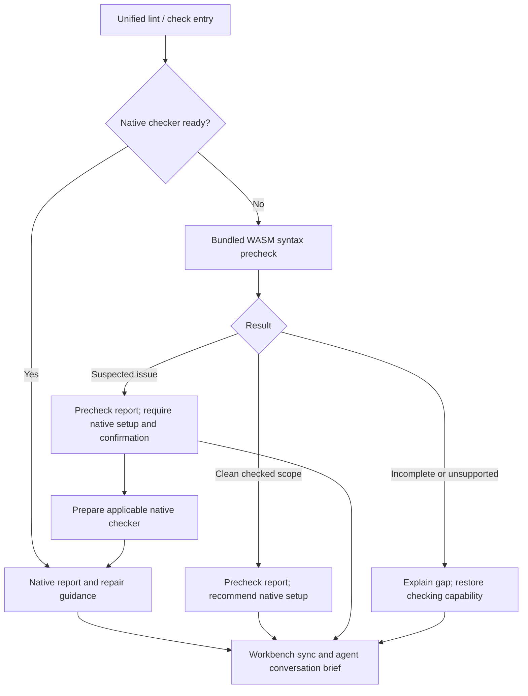

# Codeguard

[English](README.md) | [简体中文](README.zh-CN.md)

**A Rust CLI for native static checks and actionable repair workflows.**

Codeguard helps developers and coding agents discover existing quality configuration, run selected native checkers, and turn results into durable repair tasks. Rust owns orchestration and interpretation; Maven, P3C, Checkstyle, Javadoc, Ruff, Cargo, ESLint, and other native tools remain responsible for their checks.

> **Status:** early development, source `0.1.3`. Several native checks and local repair workflows work within explicitly bounded scopes. Full delivery gates, complete language coverage, automatic task closure, and host-plugin integration remain incomplete.
>
> **Baseline:** The current source and [implementation evidence](openspec/changes/introduce-rust-codeguard-cli/implementation-baseline.md) define callable behavior. Declared Rust minimum `1.85`, edition `2024`, Cargo resolver `2`. `@partme.ai/codeguard@0.1.3` is published for Apple Silicon macOS; no multi-platform binary release or crates.io availability is claimed.

```text
Project files + existing checker configuration
                    |
                    v
Codeguard: discover -> select -> native tools -> interpret
                    |                         |
                    v                         v
       Findings / environment blockers    Human / JSON / SARIF*
                    |
                    v
       Stable tasks -> agent repair -> original-tool recheck

* SARIF is supported by selected check output paths.
```

## 1. Purpose and boundaries

- Discover languages, build roots, declared versions, checker configuration, and statically observable module relationships.
- Unify code-style, documentation, dependency, vulnerability, security, and build checks as native adapters become available.
- Explain missing configuration and environment problems without misreporting them as source violations.
- Return findings and repair steps to the caller's conversation through human-readable or structured output.
- Preserve stable tasks and failed attempts; stop repeating actions that make no progress.
- Support precise false-positive dispositions. Current public allowlist commands inspect or propose decisions; they do not approve them.

The CLI contains no LLM or vector database. It does not reimplement P3C/Maven checks in Rust. Native tools may still require a JVM, Node.js, Python, Go, or Rust toolchain. Python reference fixtures are test material, not a second Codeguard runtime.

## 2. Capabilities and maturity

| Area | Current implementation | Boundary and evidence |
| :--- | :--- | :--- |
| Discovery / init | Multi-language observations, Maven/Cargo declarations, profiles, module graph, managed `AGENTS.md` | Static observations; architecture remains unknown without evidence. [Tests](crates/codeguard-cli/tests/init_command_contract.rs) |
| Python | Configuration-aware Ruff lint and `D###` documentation diagnostics; standard-pylock pip-audit observations | Partial scope/policy; distinguish simulated and real tool evidence. [Ruff](tests/acceptance/python-lint-scan.md), [CVE](tests/acceptance/python-cve-partial-native.md) |
| Rust | Clippy, Rustdoc, `cargo check`, cargo-audit; selected `check all` and repair integrations | Not every workspace/feature/target combination. [Clippy](tests/acceptance/check-all-partial-native.md), [Rustdoc](tests/acceptance/rustdoc-check-all.md), [build recheck](tests/acceptance/rust-build-task-verification.md) |
| Java | Maven configuration discovery; scoped P3C, JDK Javadoc, Checkstyle, dependency and OWASP observations | Explicit tool/configuration limits. [P3C](tests/acceptance/java-p3c-cli-native-local.md), [Javadoc](tests/acceptance/java-javadoc-cli-native-local.md), [Checkstyle](tests/acceptance/java-checkstyle-cli-local.md) |
| JavaScript / TypeScript | ESLint via `lint typescript` and source-built `check all`; npm audit via `cve typescript` and `check all` | Aggregate ESLint supports local 10.x and a unique flat config; not all package managers. [ESLint](tests/acceptance/eslint-public-lint-feedback.md), [npm](tests/acceptance/npm-partial-native.md) |
| Go | Scoped native Go vet observation | Not a full Go gate. [Evidence](tests/acceptance/go-vet-json-local-probe.md) |
| Repair workbench | Findings, task projections, sync, next, leases, attempts, selected rechecks | Formal task close/reopen remains pending. [Tests](crates/codeguard-cli/tests/task_verify_contract.rs) |
| Other languages | Capability inventory and explicit gaps | Registry presence is not an executable adapter. [Inventory](docs/CAPABILITIES.md) |

The six categories are `lint`, `comments`, `dependencies`, `cve`, `security`, and `build`. The registry defines 28 finer detection families; enumeration is not a coverage claim. See [capability dimensions](crates/codeguard-core/src/capability_dimensions.rs).

## 3. Architecture and layout

| Crate | Responsibility | Workspace dependencies |
| :--- | :--- | :--- |
| `codeguard-cli` | Binary, arguments, application orchestration, workspace files, feedback | core, runtime, adapters |
| `codeguard-core` | Findings, completion, obligations, gate calculation, allowlist matching, readiness | None |
| `codeguard-runtime` | Processes, snapshots, scheduling, cancellation, locks, artifact primitives | core |
| `codeguard-adapters` | Native command contracts, configuration observations, report parsing | core |

```text
codeguard/
├── Cargo.toml / Cargo.lock
├── crates/
│   ├── codeguard-cli/
│   ├── codeguard-core/
│   ├── codeguard-runtime/
│   └── codeguard-adapters/
├── rulepacks/          # preview candidates and legacy inventory
├── schemas/            # versioned data contracts
├── npm/                # thin Node command launcher
├── scripts/            # local npm packaging
├── docs/               # architecture, design, generated inventory
└── tests/              # acceptance records and shared fixtures
```

Repository: `codeguard`. Binary: `codeguard`. Cargo package: `codeguard-cli`. A checked project's generated `.codeguard/` data directory is separate from this source repository.

## 4. Build and first read-only run

Use a toolchain supporting Rust edition 2024. Declaring MSRV `1.85` does not prove every dependency/target combination on that version. Native execution and local coordination use Unix-specific code. Reviewed execution evidence is from macOS ARM64; the other candidate platforms are not a certified support matrix.

```bash
git clone https://github.com/full-stack-plugins/codeguard.git
cd codeguard
cargo build --locked -p codeguard-cli
./target/debug/codeguard --version --format json
./target/debug/codeguard capabilities java --format json
./target/debug/codeguard detect . --format json
./target/debug/codeguard init . --dry-run --format json
```

Version output includes `cli_version`, `target`, and protocol information. Discovery and init preview return observations and unknowns. Dry-run creates neither `AGENTS.md` nor a project data directory. Add Cargo `--offline` only when dependencies are cached.

The workspace requires `std`. The opt-in `wasm-precheck` build feature uses a bounded Rust worker with thirty-two pinned grammar candidates: ArkTS, C, C++, C#, Go, Java, JavaScript, Lua, Luau, Objective-C, Python, Rust, Solidity, TypeScript, TSX, Zig, Nix, Terraform, R, Ruby, PHP, Kotlin, Dart, Erlang, Pascal, CFML, CFQuery, CFScript, COBOL, Scala, Swift and VB.NET. Java and TypeScript/TSX have narrow single-file fallback paths; `lint python` can provide bounded suspected syntax positions when Ruff is unavailable or no project Ruff configuration is declared. Native Ruff results take priority. The published npm `0.1.3` package includes the candidate feature; `0.1.2` did not. No `no_std`, completed project-wide WASM fallback, zero-unsafe, or fastest-runtime claim is made. Runtime OS calls require safety review; a comprehensive security audit is not claimed.

The current source-built CLI's `codeguard grammar status --format=json` reports the coverage gap without loading grammars or running lint: the pinned CodeGraph source has 30 vendored WASM files plus two distinct grammars resolved through its dependency; CodeGuard has thirty-two unqualified asset candidates (ArkTS, C, C++, C#, Go, Java, JavaScript, Lua, Luau, Objective-C, Python, Rust, Solidity, TypeScript, TSX, Zig, Nix, Terraform, R, Ruby, PHP, Kotlin, Dart, Erlang, Pascal, CFML, CFQuery, CFScript, COBOL, Scala, Swift, VB.NET) and zero released syntax capabilities. C, C++, C#, Go, JavaScript, Lua, Luau and Rust are byte-pinned CodeGraph assets that load in the Rust worker but have no language-qualified standalone lint route or release qualification. ArkTS, Nix and Terraform are also pinned Rust-loadable candidates with narrow valid/invalid fixtures and no language-qualified standalone lint route or release qualification; see the [limited acceptance record](tests/acceptance/arkts-nix-terraform-grammar-candidates.md). The two dependency grammars retain their source bytes and use a byte-pinned legacy `dylink` metadata conversion for Rust loading; they have no language-qualified standalone lint route or release qualification. Zig uses a byte-pinned import adaptation so the corrected CodeGraph grammar can load in Rust; it has a narrow `lint zig` native-first candidate route but no release qualification. [Zig's limited acceptance record](tests/acceptance/zig-grammar-candidate.md) distinguishes this from released syntax support. Python has an unqualified CLI fallback path; its report remains incomplete and cannot approve delivery. R, Ruby, PHP and Kotlin have pinned CodeGraph bytes, licenses, measured Rust ABI and narrow worker samples; PHP covers mixed HTML/PHP, and all four remain unqualified. The original CodeGraph Dart WASM cannot be instantiated by Rust, but CodeGuard now pins a reproducible Zig rebuild with the real scanner and a byte-pinned WASI import adaptation. Its narrow Rust and worker fixtures pass, while public lint and release remain unqualified; see the [Dart rebuild record](tests/acceptance/dart-grammar-rebuild-candidate.md). Erlang now has pinned CodeGraph bytes, the upstream 0.19 license, ABI 14 and narrow Rust worker tests; it remains unqualified without native comparison or public lint. See the [Erlang candidate record](tests/acceptance/erlang-grammar-candidate.md). Pascal now has pinned CodeGraph bytes and its original Isopod dependency commit and license; ABI 14 and narrow worker tests pass, but native comparison and public lint remain open. See the [Pascal candidate record](tests/acceptance/pascal-grammar-candidate.md). The remaining CFML/CFQuery/CFScript/COBOL/Scala/Swift/VB.NET assets also load in the Rust worker, bringing the candidate inventory to 32/32 with zero released syntax capabilities. CFQuery misses `SELECT FROM`, VB.NET misparses a valid unindented method, and COBOL has a high load cost; see the [seven-asset acceptance record](tests/acceptance/final-seven-grammar-candidates.md). The separate [coverage inventory](grammars/codegraph-coverage.json) is not an approved asset manifest. COBOL's 16.4 MB asset now fits the bounded 20 MiB loader input, but its cold-load and memory budgets remain unqualified.

The source-built `grammar status` now includes each candidate's bounded `known_limitations`, including the [VB.NET false-positive reproduction](tests/acceptance/vbnet-unindented-method-false-positive.md). This is risk context for the agent, not a confirmed violation or a native compiler result.

### npm installation and one-off use

In a source build with `--features wasm-precheck`, `codeguard grammar probe <language> <file> --format=json` can explicitly run any of the 32 pinned candidates in an isolated worker. It always exits 3 with `status=incomplete`, `native.status=not_run`, and `delivery_decision=not_evaluated`; a completed parse also has `precheck.status=incomplete`. Input or worker failures use the same [closed JSON schema](schemas/grammar-probe-v0.1.schema.json). Recovery anchors are suspected observations only. This diagnostic command does not yet connect all grammars to language-qualified native-first `lint/check`; the published npm package includes it as an unqualified candidate.

Source-built `check all` now selects module-local ESLint 10 and a single flat config for discovered JS/TS/TSX files. It prefers `--node-tool`, otherwise resolving Node from PATH. Results appear under `native_results.node_lint`; initialized workspaces synchronize stable tasks and return `next`. Completed native files with matching source bytes skip duplicate WASM; missing configuration, ignored files and native failures retain their reasons and candidate fallback. The native path also works without the WASM feature. This wiring is not yet published to npm and does not cover pnpm symlink packages, older ESLint versions or every configuration combination. See [aggregate ESLint acceptance](tests/acceptance/check-all-eslint.md).

The same source build now runs a bounded candidate pass from `codeguard check all . --format=json` after existing native checks. Its `syntax_candidates` field in [check feedback 0.35.0](schemas/check-feedback.schema.json) carries bounded known grammar limitations and distinguishes TSX, JavaScript, CFScript and explicitly embedded CFQuery, preserving native blockers and skipped work. Python files covered by a completed Ruff scan of identical source bytes skip duplicate WASM and count under `native_preferred_count`; files without matching native syntax evidence retain candidate prechecks. Four bounded integration fixtures collectively invoked all 32 pinned grammars through this command. Every observation remains unqualified and the command exits 3; 64 files/64 fragments/90 seconds bound the candidate pass. This is not yet a language-qualified native fallback; published npm `0.1.3` includes this candidate route, while the 0.35.0 known-limitation projection is still source-only. See [acceptance evidence](tests/acceptance/check-all-32-grammar-candidates.md). Narrow 13-case syntax differentials agree for [C11 against Apple Clang 21](tests/acceptance/c-native-differential.md), [Rust 2021 against rustfmt 1.9.0](tests/acceptance/rust-native-differential.md), and [Ruby 2.6.10](tests/acceptance/ruby-native-differential.md); none qualifies native lint. A [Swift 6.4 differential](tests/acceptance/swift-native-differential.md) exposes one native-rejected source that the Swift WASM misses, so Swift remains unqualified.

The source-build acceptance test also runs the 31-file mixed-language fixture as one project: at most two isolated candidate workers run concurrently, subject to `--jobs`, while report order, source rechecks, and the 90-second candidate deadline remain fixed. A local run observed all 32 candidates with no skipped fragments; the Linux WASM integration step for source commit `ff60184` passed the same one-project test; the complete CI run passed. This is still candidate coverage, not qualified lint.

Java now also has a narrow [javac 21 / Java 17 differential](tests/acceptance/java-native-differential.md): 8 valid and 5 invalid syntax samples agree with the pinned WASM. This does not qualify Java lint, other language versions, or project-wide native-first routing.

A [Kotlin 2.4.10 differential](tests/acceptance/kotlin-native-differential.md) found a concrete false negative: `kotlinc` rejects `fun f(x: ) = x` while the pinned WASM emits no recovery. The candidate and delivery remain incomplete; install or run the applicable native checker for confirmation.

The source-built Unix CLI also has a narrow Zig route: `codeguard lint zig FILE --zig-tool /absolute/path/to/zig --format=json`. An explicitly supplied tool reporting Zig 0.16.0 and retaining the same byte digest runs native `ast-check` first; its source positions are retained without exposing source snippets. Without an explicit tool, the pinned Zig WASM provides an unqualified observation. Both paths remain incomplete because `ast-check` covers only local AST errors, not full lint, build or tests. See the [Zig feedback schema](schemas/zig-lint-feedback-v0.1.schema.json).

On Apple Silicon macOS, the published `0.1.3` candidate package was verified with a fresh npm cache:

```bash
npx --yes @partme.ai/codeguard@0.1.3 --version --format json
npx --yes @partme.ai/codeguard@0.1.3 grammar status --format=json
npx --yes @partme.ai/codeguard@0.1.3 check all . --format=json
```

For a project check, replace the arguments after the package name with the desired Codeguard command. The package is currently restricted to macOS arm64.

The Node entry point invokes the same Rust executable. From this checkout, build one host-native bundle and package it without npm lifecycle scripts:

```bash
cargo build --release --locked -p codeguard-cli
CODEGUARD_TARBALL="$(node scripts/pack-npm-local.mjs)"
npm install -g "$CODEGUARD_TARBALL" --ignore-scripts
codeguard --version --format json
```

For a one-off Node invocation without a global installation:

```bash
npm exec --yes --package "$CODEGUARD_TARBALL" -- codeguard detect . --format json
```

The packer currently supports macOS and Linux on x64/arm64 when a matching native binary is available. It requires Node 18+, npm, and an already built Rust binary for the current host. It checks the binary's reported target and version before packaging, and writes a platform-tagged tarball under ignored `release/npm/`. The default package is private and local-only. `node scripts/pack-npm-local.mjs --public` prepares the public `@partme.ai/codeguard` package with a README, full license, and host restrictions. Version `0.1.3` is published with all 32 WASM candidates; its registry-hosted `npx` entry and artifact hashes were verified on Apple Silicon macOS. The binary reports the candidate source commit, which is not a signed or reproducible-build attestation. Other platforms need their own verified binary packages. See the [distribution design](docs/Codeguard-Technical-Design.md) and [0.1.3 acceptance record](tests/acceptance/npm-0.1.3-wasm-candidate.md).

To prepare a **local** package with candidate WASM support, build with `cargo build --locked -p codeguard-cli --features wasm-precheck` and run `node scripts/pack-npm-local.mjs --require-wasm target/debug/codeguard`. The packer rejects a binary without the worker, checks all 32 pinned asset identities, and executes a bounded Zig candidate probe before writing the tarball. `--public` requires the same check and verified upstream licenses. The published `0.1.3` package carries all 32 candidates; local and registry installation do not qualify a language or certify a clean project.

## 5. Repair workflow

Make the built binary available as `codeguard` on `PATH`, or use its absolute path. In a target project:

```bash
codeguard init . --dry-run --format json
codeguard init . --apply --format json
codeguard check all . --format json
codeguard work sync . --format json
codeguard next . --format json
codeguard status . --format json
```

Current `init --apply` returns exit `3` and partial status even when files were created. `check all` also remains incomplete: inspect its findings and next actions. Do not convert exit `3` into CI success. Integrated checks already save/sync reports in initialized workspaces; explicit `work sync` supports recovery.

Set `TASK_ID` to an actual ID returned by `next`, then inspect and recheck after repair:

```bash
codeguard task show "$TASK_ID" . --format json
codeguard task verify "$TASK_ID" . --format json
```

Supply the original checker's required tool/configuration options to `task verify`. Missing tools require environment repair. Selected rechecks recognize native suppression or changed configuration; zero diagnostics alone do not close a task.

## 6. Command guide

`codeguard --help` provides current syntax. Source and acceptance records identify exact scopes; a few help descriptions remain conservative.

| Family | Value | Current boundary |
| :--- | :--- | :--- |
| `--version`, `capabilities`, `detect` | Binary, inventory, project observations | Current source `detect` 0.4.0 exposes local ESLint/Maven Wrapper candidates; no tool is run or approved |
| `init --dry-run / --apply` | Preview/create/refresh workbench | No implicit install, build, Hook takeover, or architecture certification |
| `config validate / explain`, `rules list` | Inspect configuration and rule origins | Candidates do not establish policy authority |
| `tools list / verify`, `doctor` | Inspect tools and limited environment probes | Explicit Ruff doctor probe; `tools install --apply` is blocked |
| `plan CATEGORY LANGUAGE` | Preview selections and gaps | Not a certified execution plan |
| `hook plan` | Route a versioned host event to a candidate check tier | Reads bounded JSON on stdin; exit 3, no check or host blocking |
| `hook execute` | Run read-only discovery, bounded Stop guidance, task-bound recheck, selected Python/Ruff, JS/TS/ESLint and optional WASM feedback, or a live pre-commit index safety preview | Explicit timeout; repair reuses `task verify` and never closes a task or approves delivery |
| `hook claude <session-start\|user-prompt-submit\|post-tool-use\|post-tool-use-failure\|stop>` | Map Claude Code lifecycle events to read-only discovery, constant prompt guidance, bounded edit feedback, no-check failure feedback, or local next-step guidance | Candidate soft Hooks; Stop offers one task continuation at most; default Hooks and delivery gates remain incomplete |
| `lint python / java / typescript / go` | Run selected native checks | Adapter-specific options and scope |
| `comments rust`, `build rust` | Documentation and type checking | Build does not run project tests |
| `cve rust / python / typescript` | Native advisory observations | Database identity/freshness and full coverage remain limited |
| `check all / java` | Aggregate integrated checks and repair feedback | Delivery remains `not_evaluated` |
| `work sync`, `status`, `next`, `task show` | Persist and inspect repair work | Task files are not a gate |
| `task claim / heartbeat / release`, `task attempt start / finish` | Local ownership and attempt history | Unix local coordination, not distributed locking |
| `task verify` | Repeat selected original checkers | Formal closure/reopening pending |
| `rules whitelist list / explain / propose` | Inspect/propose false-positive dispositions and corrections | No public approval or activation |
| `gate pre-commit` | Git-index path/object observation and narrow OpenSSH Ed25519 key detection | Incomplete preview; not a full content/security gate |

For Python edit feedback, run `codeguard lint python . --file src/changed.py --format json`. `--file` is repeatable with a limit of eight distinct paths, 512 bytes per path and 2 KiB combined. The response declares `scan_scope=selected_files` and observes only those files; it is not imported as a full workspace scan and cannot approve delivery. Without `--file`, the existing command still scans discovered Python files and synchronizes its local report.

Generic `dependencies`, generic `security`, arbitrary category/language combinations, `fix`, `gate pre-push`, `gate ci`, `mcp serve`, and the legacy compatibility dispatcher are target-design surfaces, not available commands in this baseline.

### Native-first entry points and syntax fallback — design target

**The published `0.1.3` includes bounded WASM candidate routing but not qualified fallback or automatic conversation delivery.** The existing commands remain the unified entry points; native adapter-specific prerequisites still apply today:

An opt-in source build with `--features codeguard-cli/wasm-precheck` has narrow TypeScript and Java single-file candidate paths. For TypeScript, a visible local ESLint 10 entry and one flat config take priority: when an executable Node is resolved from `PATH`, the CLI runs its existing bounded native probe; without Node it reports the setup gap. Only when the project-local ESLint package is not observed can the bundled TypeScript/TSX candidate provide suspected syntax positions; an untrusted entry, package identity or config returns a specific setup blocker. The Java candidate likewise remains incomplete. Python `lint` first preserves Ruff results, then can attach suspected positions for missing Ruff or undeclared project Ruff configuration; a broken Ruff configuration stays a setup blocker. For one checked file in an initialized workspace, the source-only path syncs one stable native-confirmation task; repeat candidate scans do not close it. No bundled grammar has an accepted language/dialect range. Native observations and prechecks never approve delivery. Default and published binaries keep their previous native-context behavior. [TypeScript acceptance](tests/acceptance/typescript-syntax-fallback-candidate.md) · [native-first acceptance](tests/acceptance/native-first-eslint-candidate.md) · [Java acceptance](tests/acceptance/java-syntax-fallback-candidate.md).

With an initialized `--workspace`, that TypeScript/TSX fallback now returns a real, stable native-confirmation task ID after sync; repeated WASM scans never close it. A versioned local report now preserves bounded suspected positions with source and grammar identities; capability-matched native closure still needs implementation. [Workbench acceptance](tests/acceptance/typescript-syntax-confirmation-task.md).

```bash
codeguard lint java .
codeguard lint typescript .
codeguard check all .
```

Target behavior selects per module/language/configuration, so a ready frontend checker and a Java module missing its JDK can take different paths:



Already-required native checks remain required even when precheck is clean. A native failure/violation cannot be erased by fallback. Installed tools with broken configuration need configuration repair. Suspected parser issues require native confirmation, not an automatic source edit; installation alone does not close a task. WASM syntax results do not cover type checks, style, Javadoc, CVE or security. See [architecture](docs/Codeguard-Architecture.md) section 8 and [technical design](docs/Codeguard-Technical-Design.md) sections 5.3–5.4.

## 7. Configuration and native tools

Native configuration controls native rule selection. Static discovery reports `configured`, `missing`, `invalid`, or `unknown`; it does not execute wrappers or JavaScript configuration to guess an effective build model.

Optional `.codeguard/runtime.json` controls scheduling only:

```json
{
  "schema_version": "1.1",
  "document_type": "codeguard_runtime_options",
  "timeout": "30m",
  "jobs": 4
}
```

For `check`: CLI → `CODEGUARD_TIMEOUT` / `CODEGUARD_JOBS` → project file → defaults. Default timeout is 30 minutes; default jobs is available CPU parallelism capped at four. Limits are 1 ms–24 hours and 1–64 jobs. Current hard deadlines cover native execution, not every discovery/persistence operation. Runtime options cannot disable rules or approve exceptions. See [schema](schemas/runtime-options-1.1.schema.json) and [selection code](crates/codeguard-cli/src/check_budget.rs).

Adapters use selected executables/configuration, not arbitrary command strings. Options include `--ruff-tool`, `--cargo-tool`, `--go-tool`, `--java-home`, explicit Maven repositories, and explicit Node/tool entry points. Prepare tools first; Codeguard does not silently install them. External checkers retain their own runtimes.

## 8. Results, exit codes, and false positives

| Code | Result-contract meaning |
| :--- | :--- |
| `0` | Query/operation success or a justified nonblocking result where implemented; not automatically delivery permission |
| `1` | Violations in a complete evaluated obligation set |
| `2` | Invalid/unsupported command or arguments |
| `3` | Incomplete configuration, execution, coverage, or policy context |
| `4` | Internal error |
| `130` | Cancellation |

These are [core semantics](crates/codeguard-core/src/verdict.rs), not a promise that partial scans produce all verdicts. Findings and completion are independent: timeout may retain valid findings; missing JDK is an environment blocker; damaged reports do not manufacture violations. Human/JSON are primary outputs; selected `check` paths support SARIF.

False-positive handling retains the native finding and matches a disposition to exact checker/rule/target/evidence identity. Expiry, revocation, and changed inputs require reevaluation. Public proposal/correction commands are partial workflows. Writing `approved: true` in a project file does not activate an exception. See [technical design](docs/Codeguard-Technical-Design.md).

### Conversation report examples — target presentation

These are illustrative report designs, not current CLI transcripts; the paths/task ID are synthetic, and English runtime localization is not claimed. Real messages must use actual scope, diagnostics and persisted task IDs.

```text
Codeguard: Java syntax precheck found 1 suspected issue

Method: bundled Tree-sitter WASM
Scope: 18 Java files selected and checked; 0 unresolved
Native check: not run; the project's required JDK is unavailable
Location: src/main/java/example/UserService.java:42
Observation: the parser recovered a missing syntax node here

Next steps (required):
1. Prepare the project's declared JDK and applicable native checker.
2. Run native verification covering this file and Java syntax.
3. Follow the native diagnostic, repair and recheck.

Task: CG-example-java-setup (illustrative; only after successful sync)
Recheck entry (after restoring original project tool/configuration context):
codeguard task verify CG-example-java-setup . --format json
This is not yet a confirmed code violation. Delivery is not evaluated.
```

A clean precheck with no existing native requirement should be shorter:

```text
Codeguard: no syntax anomaly observed in 18 checked Java files
Method: bundled Tree-sitter WASM; all 18 selected files checked.
Native lint: not run. Recommended: configure and prepare the native checker.
Not covered: types, project style rules and dependency security.
This is a syntax observation, not complete lint or delivery approval.
```

For a timeout, say “17 of 18 files checked; precheck incomplete”, identify the unresolved file and give the environment/parser recovery action. Do not say “all passed” or “source error”. For a native finding, show the actual checker/rule/location and original-tool recheck step. Do not guess missing tokens or promise a specific fix from a recovery node alone.

The plugin must deliver a bounded brief through the host's tool-result/context API; CLI JSON and files alone are not automatic conversation injection. Send initial results and meaningful changes, reuse stable tasks and avoid repeating unchanged installation requests. [Technical design](docs/Codeguard-Technical-Design.md) sections 7.3–7.4 include four complete scenarios, a proposed JSON example and review rules; none is a new supported report schema yet.

## 9. Data, security, and recovery

```text
.codeguard/                       # inside the checked project
├── .gitignore / README.md / workspace.json
├── project.json / module-graph.json / architecture.md
├── findings/                     # redacted facts and events
├── tasks/                        # readable repair projections
├── decisions/                    # intended decision references
├── reports/                      # ignored
├── runs/                         # ignored
├── cache/                        # ignored
├── worktrees/                    # ignored
└── state/                        # ignored
```

An existing `codeguard/src` remains user source and is still scanned. A previous `codeguard/workspace.json` is reported as a migration conflict; Codeguard does not move that directory automatically because it may also contain user code. Ignore rules are not a confidentiality boundary: do not commit secrets in records or share raw logs. Preserve the workspace before upgrading. Retry failed sync with `work sync`; changed inputs require a new scan.

Process groups, restricted environments, snapshots, and output limits are implemented building blocks, not a complete OS sandbox. Native builds can execute project plugins, scripts, and extensions. See [architecture](docs/Codeguard-Architecture.md).

## 10. Development and verification

```bash
cargo fmt --all --check
cargo clippy --workspace --all-targets --locked -- -D warnings
cargo test --workspace --locked
cargo run --locked -p codeguard-cli --example gen_capability_docs -- --check
```

The 2026-09-28 local source baseline passed 163 groups: 990 tests passed, zero failed, 101 ignored; format and Clippy also passed. Ignored tests are not passes. This is a dated local baseline, not remote CI, cross-platform acceptance, a false-positive benchmark, or full native-tool coverage.

The native corpus example needs prepared tools. Replace these illustrative paths:

```bash
cargo run --locked -p codeguard-cli --example validate_corpus -- \
  --verify-ruff /path/to/ruff --verify-maven /path/to/mvn
```

Read the relevant [acceptance record](tests/acceptance) before enabling ignored native tests. Preserve distinctions between parser fixtures, simulated processes, actual native tools, and host integration.

## 11. Troubleshooting

| Symptom | Next action |
| :--- | :--- |
| `init --apply` exits `3` | Inspect created files and partial status; full readiness is pending |
| Findings plus incomplete result | Address both confirmed findings and listed blockers |
| Zero findings, still incomplete | Check configuration, scope, tools, policy, and advisory-data state |
| Managed `AGENTS.md` conflict | Preserve human changes and reconcile the marked block |
| Recurring task | Read current evidence; checkbox edits do not close it |
| `needs_decision` | Inspect attempts and change the repair approach or request a specific decision |
| Listed language cannot run | Consult adapter gaps; inventory is not implementation |
| Offline Cargo build fails | Populate the dependency cache or omit `--offline` |

## 12. Documentation, contribution, and license

The [documentation index](docs/README.md) assigns ownership and status to the architecture, technical design and eight topic guides. See the [command reference](docs/Codeguard-Command-Reference.md) for command contracts and [legacy compatibility](docs/Codeguard-Legacy-Compatibility.md) for historical plugin behavior, which does not describe current Rust availability.

| Document | English | 简体中文 |
| :--- | :--- | :--- |
| Architecture | [Architecture](docs/Codeguard-Architecture.md) | [架构设计](docs/Codeguard-Architecture.zh_CN.md) |
| Technical design | [Design and roadmap](docs/Codeguard-Technical-Design.md) | [技术方案与路线](docs/Codeguard-Technical-Design.zh_CN.md) |
| Capabilities | [Generated inventory](docs/CAPABILITIES.md) | Shared IDs and statuses |
| Evidence | [Acceptance records](tests/acceptance) | Each record states scope and date |

The existing [OpenSpec change](openspec/changes/introduce-rust-codeguard-cli/proposal.md) now lives in this Rust repository and is the sole specification and task authority. Implemented slices and remaining work are tracked separately; these documents do not maintain a second task ledger.

Contributions should preserve native rule meaning, add positive/negative cases, separate environment failure from findings, and update bilingual documents and affected schemas. Use [GitHub Issues](https://github.com/full-stack-plugins/codeguard/issues) for non-sensitive bugs. A dedicated security reporting policy is not yet present.

Cargo declares `Apache-2.0`; this working tree now includes a repository-level `LICENSE` and `NOTICE`, both included in the published npm package. No unverified crates.io or CI badges are provided.

Source builds now provide native-first edit feedback through `hook execute` / `hook claude post-tool-use`: only explicit ordinary files are selected; Python uses Ruff and JS/TS uses module-local ESLint 10. Coherent same-byte native results avoid duplicate parsing. Uncovered files may use pinned WASM candidates; mixed scopes retain native results, unwired native scopes and failures. Recovery nodes require native-tool setup/repair and confirmation; complete zero-recovery candidates only recommend native lint, never full acceptance. One deadline bounds at most eight files and two WASM workers; builds without WASM report that gap. The outer feedback is 0.7.0 with local `hook_fast_feedback` 0.2.0. Candidate task synchronization is connected; default plugin Hooks, capability-matched closure and real-host acceptance remain incomplete. See [edit-feedback acceptance](tests/acceptance/hook-fast-native-wasm.md).

Source edit feedback now imports recovery-bearing pinned WASM candidates into the existing `.codeguard/` workbench. Confirmation identities remain stable per workspace/file/language; Python and JS/TS reuse existing confirmation/preparation identities. Reports bind the grammar, source SHA-256, known limitations and suspected byte positions; imports reject mismatched identities/coordinates and duplicate JSON keys. Task IDs appear only after successful synchronization. Zero-recovery observations create no new mandatory task and cannot close existing tasks. Dialogue includes `task show` / `task verify`; missing native confirmation adapters report an explicit capability gap. Outer Hook feedback is 0.7.0, local feedback is 0.2.0, and generic `next` briefs use 0.2.0 while existing checkers retain 0.1.0. Default plugin Hooks, capability-matched closure and actual-host acceptance remain incomplete.
