# CodeGuard

[English](README.md) | [简体中文](README.zh-CN.md)

## CodeGuard 在六大守卫中的正式定位

**CodeGuard** 只负责代码质量、安全与原生检查器执行；GuardEngine 提供通用规则/契约/证据，ArchGuard 负责架构，TestGuard 负责测试义务，GitGuard 负责合并安全，SpecGuard 负责规格，FlowGuard 负责审批和流程。现有 Rust CLI、修复任务、原生检查器适配、公开制品与测试记录继续保留，不重复建设。

- [CodeGuard 独立架构与跨守卫边界](docs/architecture.md)
- [GuardEngine 集成技术方案、迁移与测试](docs/technical-design.md)
- [已有详细架构手册](docs/Codeguard-Architecture.zh_CN.md)
- [已有详细技术实现手册](docs/Codeguard-Technical-Design.zh_CN.md)

**当前状态：**部分多语言检查与修复工作流已有代码，统一 Guard Protocol、可信 CI 合并授权、全语言/平台能力尚未全部实现。本文和新增设计文档不代表历史未完成任务已经完成。


**用统一 Rust CLI 串起原生静态检查和可执行的修复流程。**

Codeguard 面向开发者与编程智能体，识别项目已有质量配置，调用选定的原生检查器，并将结果转成持久修复任务。Rust 负责调度和结果解释；Maven、P3C、Checkstyle、Javadoc、Ruff、Cargo、ESLint 等原生工具继续负责具体检查。

> **当前状态：**早期开发阶段，源码版本 `0.1.4`。部分原生检查和本地修复流程已在明确范围内实现。完整交付门禁、全部语言覆盖、任务自动关闭和宿主插件接入仍未完成。
>
> **基线：**可调用行为以当前源码和[实施证据](openspec/changes/introduce-rust-codeguard-cli/implementation-baseline.md)为准。声明 Rust 最低版本 `1.85`，edition `2024`，Cargo resolver `2`。`@partme.ai/codeguard@0.1.4` 已发布，当前仅支持 Apple Silicon macOS；不声称已有多平台二进制发行版或 crates.io 发布。

```text
项目文件 + 已有检查器配置
           |
           v
Codeguard：发现 -> 选择 -> 原生工具 -> 解释结果
           |                          |
           v                          v
      问题 / 环境阻塞            Human / JSON / SARIF*
           |
           v
      稳定任务 -> 智能体修复 -> 原工具复检

* 部分 check 输出路径支持 SARIF。
```


源码构建现支持 `codeguard lint erlang FILE --erl-tool /absolute/path/to/erl --timeout 10s --format=json`。OTP 28 原生扫描/解析优先，能检出固定 WASM 的缺句点反例；宏与预处理保持未知。未提供显式工具时仍可作可选 WASM 初检并保留已知限制。这只是单文件 forms 观察，不能批准项目交付；已发布 npm 0.1.4 尚不含新命令。见[原生优先证据](tests/acceptance/erlang-native-first.md)。

源码构建的 `codeguard lint erlang FILE --format=json` 现从 PATH 的绝对目录自动定位 `erl`，显式 `--erl-tool` 优先且错误请求不回退；0.2 报告包含工具选择来源和规范路径。`codeguard task verify TASK_ID . --erl-tool /absolute/path/to/erl --format=json` 可显式复检已有 Erlang WASM 确认任务；省略参数时与 lint/check 共用调用方绝对 PATH 工具选择。`next` 保留当前原生位置、具体未完成原因和可复用工具命令；`repair_ready` 复用原租约和尝试历史。OTP 28 宏/预处理覆盖仍未完成，零诊断不自动关闭任务。公开 npm 0.1.4 尚不包含本轮扩展，见 [Erlang 修复闭环验收](tests/acceptance/erlang-native-task-verification.md)。

## 1. 用途与边界

- 识别语言、构建根、声明版本、检查配置和可静态观察的模块关系。
- 随原生适配器接入，统一编码规范、注释、依赖、漏洞、安全和构建检查。
- 解释缺配置和环境问题，避免将它们误报为源码违规。
- 通过可读或结构化输出，将发现和修复步骤返回调用者的对话界面。
- 保留稳定任务和失败尝试，停止重复执行无进展动作。
- 支持精确的误报处置。当前公开白名单命令用于查询或提案，不负责批准。

CLI 不内置大模型或向量数据库，也不使用 Rust 重写 P3C/Maven 检查。原生工具仍可能需要 JVM、Node.js、Python、Go 或 Rust 工具链。Python 参考夹具属于测试材料，不是第二套 Codeguard 运行内核。

当前源码的原生 P3C 单文件 lint 可连接最近已初始化的工作台，也可显式指定 `--workspace ROOT`。使用 `codeguard lint java FILE --checker p3c` 并提供既有 Maven/JDK/离线仓库参数；仅检查所选文件及最近 POM 可静态确认的规则子集，`check java` 和 `task verify` 复用同一稳定任务。显式选择 P3C 不会静默切换 WASM。这是局部反馈，完整 P3C 覆盖及自动关闭仍待验收。见[修复流程](docs/Codeguard-Native-Repair-Workflow.zh_CN.md#p3c-单文件项目绑定)和[验收记录](tests/acceptance/java-p3c-file-workbench.md)。公开 npm 0.1.4 未更新。

P3C 执行失败时，已经核对且仍匹配当前源码的诊断也会进入稳定源码任务，同时保留执行阻塞；不会增加完整观察计数，不能证明问题消失。见[部分执行验收](tests/acceptance/java-p3c-partial-execution.md)。

## 2. 能力与成熟度

| 领域 | 当前实现 | 边界与证据 |
| :--- | :--- | :--- |
| 发现 / init | 多语言观察、Maven/Cargo 声明、画像、模块图、`AGENTS.md` 受管摘要 | 静态观察；无证据时架构保持未知。[测试](crates/codeguard-cli/tests/init_command_contract.rs) |
| Python | 感知配置的 Ruff lint、`D###` 文档诊断、标准 pylock 的 pip-audit 观察 | 范围和策略仍不完整；区分模拟与真实工具证据。[Ruff](tests/acceptance/python-lint-scan.md)、[CVE](tests/acceptance/python-cve-partial-native.md) |
| Rust | Clippy、Rustdoc、`cargo check`、cargo-audit，以及部分 `check all` 和修复接线 | 不代表全部 workspace/feature/target 组合。[Clippy](tests/acceptance/check-all-partial-native.md)、[Rustdoc](tests/acceptance/rustdoc-check-all.md)、[构建复检](tests/acceptance/rust-build-task-verification.md) |
| Java | Maven 配置发现；有限范围的 P3C、JDK Javadoc、Checkstyle、依赖和 OWASP 观察 | 工具与配置有明确边界。[P3C](tests/acceptance/java-p3c-cli-native-local.md)、[Javadoc](tests/acceptance/java-javadoc-cli-native-local.md)、[Checkstyle](tests/acceptance/java-checkstyle-cli-local.md) |
| JavaScript / TypeScript | `lint typescript` 和源码构建的 `check all` 调用 ESLint；`cve typescript` 和 `check all` 调用 npm audit | 聚合 ESLint 支持模块本地 10.x 与唯一 flat config；不覆盖全部包管理器。[ESLint](tests/acceptance/eslint-public-lint-feedback.md)、[npm](tests/acceptance/npm-partial-native.md) |
| Go | 有限范围的原生 Go vet 观察 | 不是完整 Go 门禁。[证据](tests/acceptance/go-vet-json-local-probe.md) |
| 修复工作台 | 问题、任务投影、同步、next、租约、尝试及部分复检 | 正式关闭和重开待完成。[测试](crates/codeguard-cli/tests/task_verify_contract.rs) |
| 其它语言 | 能力登记和明确缺口 | 注册不等于可执行适配器。[能力表](docs/CAPABILITIES.md) |

六个类别是 `lint`、`comments`、`dependencies`、`cve`、`security`、`build`。注册表还定义了 28 个细分检测族，枚举不构成覆盖承诺，见[能力维度](crates/codeguard-core/src/capability_dimensions.rs)。

## 3. 架构与目录

| Crate | 职责 | 工作区依赖 |
| :--- | :--- | :--- |
| `codeguard-cli` | 二进制、参数、应用编排、工作区文件、反馈 | core、runtime、adapters |
| `codeguard-core` | 问题、完整性、义务、门禁计算、白名单匹配、就绪状态 | 无 |
| `codeguard-runtime` | 进程、快照、调度、取消、锁、制品基础能力 | core |
| `codeguard-adapters` | 原生命令契约、配置观察、报告解析 | core |

```text
codeguard/
├── Cargo.toml / Cargo.lock
├── crates/
│   ├── codeguard-cli/
│   ├── codeguard-core/
│   ├── codeguard-runtime/
│   └── codeguard-adapters/
├── rulepacks/          # 预览候选和历史清单
├── schemas/            # 版本化数据契约
├── npm/                # 精简的 Node 命令入口
├── scripts/            # 本地 npm 打包
├── docs/               # 架构、技术方案、生成能力表
└── tests/              # 验收记录和共享夹具
```

仓库名为 `codeguard`，二进制名为 `codeguard`，Cargo 包名为 `codeguard-cli`。受检项目生成的 `.codeguard/` 数据目录与此源码仓库是不同对象。

## 4. 构建与首次只读运行

使用支持 Rust edition 2024 的工具链。声明 MSRV `1.85` 不代表全部依赖和平台组合均在该版本实测。原生执行和本地协作使用 Unix 代码；已核对的运行证据来自 macOS ARM64，其它候选平台不是已认证支持矩阵。

WASM 依赖已约束 `tree-sitter-language=0.1.7`，避免传递更新突破声明的 Rust 1.85 基线。锁定 metadata 回归与显式 1.85 CI 检查是不同层级的证据，完整目标/MSRV 验收仍开放；见[兼容验收](tests/acceptance/rust-msrv-dependency-compatibility.md)。

S14.2 加载器已按指定条件验收：32份固定候选离线加载及坏字节/散列/ABI负例通过，8ca3bb1的真实Rust1.85 CI default/WASM检查成功。它不批准语言精度、资产发行或完整平台矩阵，详见[加载器核验](tests/acceptance/rust-wasm-loader-completion.md)。

```bash
git clone https://github.com/full-stack-plugins/codeguard.git
cd codeguard
cargo build --locked -p codeguard-cli
./target/debug/codeguard --version --format json
./target/debug/codeguard capabilities java --format json
./target/debug/codeguard detect . --format json
./target/debug/codeguard init . --dry-run --format json
```

版本输出包含 `cli_version`、`target` 和协议信息。发现与 init 预览返回观察及未知项。Dry-run 不创建 `AGENTS.md` 或项目数据目录。仅在依赖已缓存时为 Cargo 添加 `--offline`。

工作区要求 `std`。可选 `wasm-precheck` 构建特性已有三十二份固定 grammar 候选资产与有界 Rust worker。Java 和 TypeScript/TSX 有局部单文件兜底；`lint python` 在 Ruff 不可用或项目未声明 Ruff 配置时可报告有界疑似语法位置，原生 Ruff 结果优先。公开 npm `0.1.3` 包含这一候选路径；`0.1.2` 不含。不声称 `no_std`、已完成项目级 WASM 兜底、零 unsafe 或性能最快。运行层系统调用需要安全审查，当前不宣称已完成整体安全审计。

当前源码构建的 CLI 可用 `codeguard grammar status --format=json` 只读展示来源覆盖缺口，不加载 grammar 或运行 lint：固定 CodeGraph 来源含 30 份随仓 WASM，另有两种独立 grammar 从其依赖取得；CodeGuard 当前有三十二份未验收资产候选、零项已发行语法能力。C、C++、C#、Go、JavaScript、Lua、Luau、Rust、ArkTS、Nix、Terraform、R、Ruby、PHP、Kotlin、Erlang、Pascal、CFML、CFQuery、CFScript、COBOL、Scala、Swift、VB.NET 等已固定字节并由 Rust worker 做窄范围验证，但没有逐语言验收的独立 lint 路由或发行验收。Objective-C 与 Solidity 的依赖包原始字节、许可证和固定散列的 `dylink` 元数据转换已入库；Zig 的新版语法也有固定导入适配。CodeGraph 原 Dart WASM 无法由 Rust 直接加载；CodeGuard 现以固定源码和真实外部 scanner 经 Zig 重建，并固定适配前后字节，150 例上游语料错误分类与预期一致，但仍未做 Dart 原生工具对照或发布验收，见[Dart 重建局部验收](tests/acceptance/dart-grammar-rebuild-candidate.md)。Erlang 已固定 CodeGraph 字节、上游 0.19 许可证和 ABI 14，并已有 Rust worker 样例、OTP 28 原生对照、源码构建中的显式 `lint erlang --erl-tool` 入口与任务复检；原 WASM 仍漏检函数终止符。公开 npm 0.1.4 尚不包含这些原生扩展，完整语言与发行验收仍缺，见[原生对照](tests/acceptance/erlang-native-differential.md)和[任务复检](tests/acceptance/erlang-native-task-verification.md)。Pascal 已固定 CodeGraph 字节、原始 Isopod 依赖提交和许可证，ABI 14 及窄范围 worker 样例通过；原生对照和公开 lint 尚缺，见[Pascal 候选局部验收](tests/acceptance/pascal-grammar-candidate.md)。其余七份 CFML/CFQuery/CFScript/COBOL/Scala/Swift/VB.NET 来源 WASM 也已固定并由 Rust worker 加载，累计 32/32 份候选、0 项已发行。CFQuery 漏掉 `SELECT FROM`，VB.NET 对合法未缩进方法体误报，COBOL 成本高；都不能发布为 lint，见[七份局部验收](tests/acceptance/final-seven-grammar-candidates.md)。Python 已有未验收的 CLI 候选兜底，结果保持不完整，不能批准交付。[覆盖库存](grammars/codegraph-coverage.json)不是已批准资产清单。COBOL 的 16.4 MB 固定资产现可在 20 MiB 输入限额下加载，但冷启动和内存预算尚未验收。

当前源码构建的 `grammar status` 现逐候选返回有界的 `known_limitations`，包括[VB.NET 误报复现](tests/acceptance/vbnet-unindented-method-false-positive.md)。这是提供给智能体的风险背景，不是已确认违规或原生编译器结果。

### npm 安装与一次性调用

WASM源码构建可通过`codeguard grammar probe javascript FILE --format=json`观察重复直接JavaScript let/const绑定候选；项目检查、独立lint和编辑Hook也已复用该规则。显式诊断`codeguard grammar probe javascript MODULE_FILE --module --format=json`另外观察函数边界外return。[Probe0.8](schemas/grammar-probe-v0.8.schema.json)绑定`javascript_mode=module`，原始恢复与结构候选分开，始终退出3/incomplete。未指定`--module`不启用该规则，不能推断CommonJS或未知项目模式；不授予原生完成、任务关闭或语言资格。公开npm0.1.4不含这些增量。[验收](tests/acceptance/javascript-module-worker-probe.md)。

源码以 `--features wasm-precheck` 构建后，可显式运行 `codeguard grammar probe <language> <file> --format=json`，由隔离 worker 调用 32 份固定候选中的任意一份。命令始终以退出码 3 返回，并标记 `status=incomplete`、`native.status=not_run`、`delivery_decision=not_evaluated`；解析完成时还标记 `precheck.status=incomplete`。输入或 worker 失败也遵守同一份[封闭 JSON Schema](schemas/grammar-probe-v0.1.schema.json)。恢复锚点只是疑似观察。此诊断入口尚未把全部语种接入已验收的原生优先 `lint/check`；已发布 npm 包仅把它作为未验收候选提供。

源码构建的 `check all` 现自动按 JS/TS/TSX 源码最近的项目清单选择本地 ESLint 10 和单一 flat config；`--node-tool` 优先，否则查找 PATH 中的 Node。原生结果进入 `native_results.node_lint`，已初始化工作区自动同步稳定任务并返回 `next`。完整且源码摘要匹配的原生文件跳过重复 WASM；缺配置、原生忽略或故障的文件保留原因并继续候选初检。此接线也适用于未启用 WASM 的构建；已包含在 npm 0.1.4，不覆盖 pnpm 链接包、ESLint 旧版或所有配置组合。见[聚合 ESLint 验收](tests/acceptance/check-all-eslint.md)。

同一源码构建现在会在既有原生检查之后，从 `codeguard check all . --format=json` 执行有界候选初检。[检查反馈 0.38.0](schemas/check-feedback-v0.38.schema.json)中的 `syntax_candidates` 附带有界的已知 grammar 限制，并区分 TSX、JavaScript、CFScript 和明确嵌入的 CFQuery，同时保留原生阻塞与未执行范围。Ruff 已对相同源码完成原生扫描的 Python 文件跳过重复 WASM，并计入 `native_preferred_count`；其余未确认语法能力的文件仍运行候选初检。四个有界集成样例经此入口合计调用了 32 种固定 grammar。观察仍未验收，命令保持退出码 3；候选阶段限 64 文件、64 片段、90 秒。这尚非逐语言验收的原生兜底；已发布 npm `0.1.3` 包含该候选路径，0.35.0 的已知限制投影已包含于 0.1.4；见[验收记录](tests/acceptance/check-all-32-grammar-candidates.md)。[C11 与 Apple Clang 21 差分](tests/acceptance/c-native-differential.md)、[Rust 2021 与 rustfmt 1.9.0 差分](tests/acceptance/rust-native-differential.md)和[Ruby 2.6.10 差分](tests/acceptance/ruby-native-differential.md)各在 13 个窄范围语法样例上一致，但不代表对应语言的原生 lint 已验收。[Swift 6.4 差分](tests/acceptance/swift-native-differential.md)现区分 12 例可判定的一致结果与 1 例隐藏错误导致的未完成；Swift 仍未验收。

源码构建的验收测试还把 31 个源码文件作为一个混合语言项目：候选阶段最多同时运行两个隔离 worker，并服从 `--jobs`；报告顺序、源码复读与 90 秒总截止时间不变。本机单次运行观察到全部 32 种候选且无跳过片段；源码提交 `ff60184` 的 Linux WASM 集成步骤已通过同一单项目测试；完整 CI 已通过。这仍是候选覆盖，不是已验收的 lint。

Java 另有一组窄范围的 [javac 21 / Java 17 差分](tests/acceptance/java-native-differential.md)：8 份合法、5 份非法语法样例与固定 WASM 一致。这不代表 Java lint、其它语言版本或项目级原生优先路由已验收。

[Kotlin 2.4.10 差分](tests/acceptance/kotlin-native-differential.md)现区分 11 例可判定的一致结果与 2 例隐藏错误：原生拒绝的 `fun f(x: ) = x` 和原生合法的 `object C { val value = 1 }` 均为未完成，不能当作通过或已确认违规。零诊断数不能为未完成扫描分类，仍需适用原生检查器确认。

源码构建的 Unix CLI 还提供局部 Zig 入口：`codeguard lint zig FILE --zig-tool /absolute/path/to/zig --format=json`。显式提供且报告 Zig 0.16.0、执行前后字节摘要一致的工具优先运行原生 `ast-check`，仅输出诊断位置，不回显源码；未显式提供工具时，固定 Zig WASM 给出未验收候选观察。两条路径都保持未完成，因为 `ast-check` 仅覆盖局部 AST 错误，不等于完整 lint、构建或测试。见 [Zig 报告 Schema](schemas/zig-lint-feedback-v0.1.schema.json)。

已在 Apple Silicon macOS 上通过全新 npm 缓存验证公开 `0.1.4` 候选包：

```bash
npx --yes @partme.ai/codeguard@0.1.4 --version --format json
npx --yes @partme.ai/codeguard@0.1.4 grammar status --format=json
npx --yes @partme.ai/codeguard@0.1.4 check all . --format=json
```

检查项目时，可将包名后的参数换成需要执行的 Codeguard 指令。当前公开包仅支持 macOS arm64。

Node 入口调用同一个 Rust 可执行文件。在本仓库构建当前平台的二进制，并生成不带 npm 安装脚本的本地包：

```bash
cargo build --release --locked -p codeguard-cli
CODEGUARD_TARBALL="$(node scripts/pack-npm-local.mjs)"
npm install -g "$CODEGUARD_TARBALL" --ignore-scripts
codeguard --version --format json
```

只在当前 Node 会话中调用，无需全局安装：

```bash
npm exec --yes --package "$CODEGUARD_TARBALL" -- codeguard detect . --format json
```

打包器在已有匹配原生程序时支持 macOS 与 Linux 的 x64/arm64 平台。打包需要 Node 18+、npm 和预先构建的本机 Rust 二进制；打包前核对二进制报告的平台和版本，在已忽略的 `release/npm/` 写入带平台标识的 tarball。默认包标记为 private，仅用于本地分发。`node scripts/pack-npm-local.mjs --public` 准备带说明、完整许可证与平台限制的公开 `@partme.ai/codeguard` 包。`0.1.3` 已发布，包含全部 32 份 WASM 候选；其公开包在 Apple Silicon macOS 上通过全新缓存 `npx` 执行和制品摘要核对。二进制回报的候选源码提交不等于签名或可复现构建证明。其它平台仍需各自验收的二进制包。见[发行技术方案](docs/Codeguard-Technical-Design.zh_CN.md)及[0.1.3 验收记录](tests/acceptance/npm-0.1.3-wasm-candidate.md)。

若要准备**本地**含 WASM 候选的包，先执行 `cargo build --locked -p codeguard-cli --features wasm-precheck`，再运行 `node scripts/pack-npm-local.mjs --require-wasm target/debug/codeguard`。打包器会拒绝缺少 worker 的二进制，核对 32 份固定资产身份，并在写包前实际运行有界 Zig 候选探针。`--public` 同样要求这些检查及上游许可证核验。已发布的 `0.1.3` 包含全部 32 份候选；本地及注册表实装不等于语种精度验收或项目质量通过。

## 5. 修复流程

将构建出的二进制加入 `PATH`，使 `codeguard` 可用，或使用其绝对路径。在受检项目中执行：

```bash
codeguard init . --dry-run --format json
codeguard init . --apply --format json
codeguard check all . --format json
codeguard work sync . --format json
codeguard next . --format json
codeguard status . --format json
```

当前 `init --apply` 即使创建了文件，也返回退出码 `3` 和部分完成状态。`check all` 同样保持未完成，应读取其发现与下一步。不能将退出码 `3` 转换为 CI 成功。已接入检查会在初始化工作区自动保存与同步；显式 `work sync` 用于恢复。

将 `TASK_ID` 设置为 `next` 返回的真实任务 ID，查看任务并在修复后复检：

```bash
codeguard task show "$TASK_ID" . --format json
codeguard task verify "$TASK_ID" . --format json
```

为 `task verify` 提供原检查器要求的工具与配置参数。缺工具需要修复环境。部分复检已经识别原生抑制或配置变化；零诊断本身不会关闭任务。

## 6. 命令导览

`codeguard --help` 提供当前语法。精确范围以源码和验收记录为准，少数帮助说明仍较保守。

| 命令族 | 价值 | 当前边界 |
| :--- | :--- | :--- |
| `--version`、`capabilities`、`detect` | 查询二进制、清单、项目观察 | 当前源码的 `detect` 0.4.0 输出本地 ESLint/Maven Wrapper 候选，不执行或批准工具 |
| `init --dry-run / --apply` | 预览、创建、刷新工作台 | 不隐式安装、构建、接管 Hook 或认证架构 |
| `config validate / explain`、`rules list` | 查看配置和规则来源 | 候选不构成策略批准 |
| `tools list / verify`、`doctor` | 查看工具和有限环境探测 | 显式 Ruff doctor 探测；`tools install --apply` 受阻 |
| `plan CATEGORY LANGUAGE` | 预览选择和缺口 | 不是已认证执行计划 |
| `hook execute` | 启动只读发现、Stop 有界下一步、按任务原工具复检、Python/Ruff、JS/TS/ESLint、Kotlin、Swift、Zig、Ruby、ShellCheck 原生编辑反馈与可选 WASM及显式 Git 工具的提交面安全预览 | 必须给超时；复检不自动关闭任务，推送/CI 仍未接线，不构成宿主交付门禁 |
| `hook claude <session-start\|post-tool-use\|post-tool-use-failure\|stop>` | 将 Claude Code 生命周期事件映射为只读发现、局部编辑反馈、失败不检查或本地下一步指引 | 候选软 Hook；Stop 最多引导一次继续；默认 Hook 与交付门禁仍未接通 |
| `lint python / java / typescript / go` | 执行已接入原生检查 | 参数和范围因适配器而异 |
| `comments rust`、`build rust` | 文档与类型检查 | build 不运行项目测试 |
| `cve rust / python / typescript` | 原生漏洞公告观察 | 漏洞库身份、时效及完整覆盖仍有限 |
| `check all / <规范语言ID>` | 汇总已接入检查与修复反馈 | 全项目 `incomplete`；局部 `not_evaluated` |
| `work sync`、`status`、`next`、`task show` | 持久化及查看修复工作 | 任务文件不是门禁 |
| `task claim / heartbeat / release`、`task attempt start / finish` | 本地占用与尝试历史 | Unix 本地协作，不保证分布式锁 |
| `task verify` | 重跑部分原检查器 | 正式关闭与重开待完成 |
| `rules whitelist list / explain / propose` | 查询或提出误报处置与纠错 | 无公开批准或生效入口 |
| `gate pre-commit` | Git index 路径、对象及未加密 OpenSSH Ed25519 私钥局部观察 | 仍是不完整预览，尚非完整内容或安全门禁 |

当前源码的 `config validate/explain` 以 0.3 协议按构建根返回原生配置静态观察，包含来源摘要、未解析条件和准备动作。不执行 JS 配置或原生工具；生效规则及抑制仍未解析。见[配置验收记录](tests/acceptance/config-native-observation.md)。公开 npm 0.1.4 尚不包含此扩展。

Python 编辑快反馈可执行 `codeguard lint python . --file src/changed.py --format json`；`--file` 可重复，最多 8 个不同路径，单路径 512 字节、总计 2 KiB。报告标明 `scan_scope=selected_files`，只观察选中文件；局部反馈不导入完整工作台，也不代表全项目或交付通过。原有不带 `--file` 的命令仍扫描发现到的 Python 文件并同步局部报告。

通用 `dependencies`、通用 `security`、任意类别/语言组合、`fix`、`gate pre-push`、`gate ci`、`mcp serve` 和旧协议兼容调度均属目标设计，在本基线中不能作为已实现命令调用。

### 原生优先的统一入口与语法兜底——设计目标

**公开 `0.1.3` 已包含有界 WASM 候选路由，但尚无已验收兜底或自动对话交付。** 保留已有命令作为统一入口；当前仍须满足各原生适配器的参数和前置条件：

可选源码构建已有 Java/TypeScript 单文件候选路径。TypeScript 项目若有可见的本地 ESLint 10 入口和唯一 flat config，会先尝试从 `PATH` 解析 Node 并运行既有有界原生探针；缺 Node 时报告准备缺口；仅本地 ESLint 包未观察到时才提供 TypeScript/TSX 疑似语法初检。入口、包身份或配置不可信时保留具体环境阻塞。Java 候选仍须原生确认。Python `lint` 先保留 Ruff 结果，在 Ruff 缺失或项目未声明配置时补充疑似位置；损坏的 Ruff 配置仍是环境阻塞。已初始化工作区的单文件初检可同步一张稳定的原生确认任务；重复候选扫描不会关闭它。所有内置 grammar 的版本/方言尚未验收，原生局部观察和初检都不能批准交付。默认及公开二进制沿用既有原生上下文路径，见 [Java 局部验收](tests/acceptance/java-syntax-fallback-candidate.md)、[TypeScript 局部验收](tests/acceptance/typescript-syntax-fallback-candidate.md)与[原生优先局部验收](tests/acceptance/native-first-eslint-candidate.md)。

已初始化工作区使用 `--workspace` 时，TypeScript/TSX 候选回退在同步后返回真实且稳定的原生确认任务 ID；反复 WASM 扫描不会自行关闭任务。版本化本地报告已按源码与 grammar 身份保存有界疑似位置；能力匹配的原生关闭仍待实现，见[局部验收](tests/acceptance/typescript-syntax-confirmation-task.md)。

```bash
codeguard lint java .
codeguard lint typescript .
codeguard check all .
```

目标行为按模块/语言/配置选择路径，因此同一仓库中可用的前端检查器和缺 JDK 的 Java 模块可以分别处理：

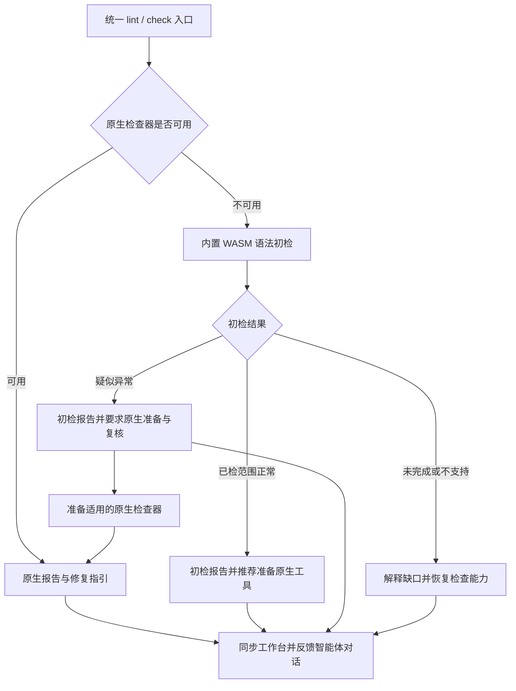

项目已有的必需原生检查，不因初检正常变成可选。原生失败/违规不能被兜底抹除。工具已安装但配置损坏时，应修复配置。解析器疑似问题要求原生确认，不直接自动修改源码；仅安装成功不能关闭任务。WASM 语法结果不覆盖类型、规范、Javadoc、CVE 和安全。详见[架构设计](docs/Codeguard-Architecture.zh_CN.md)第 8 节及[技术方案](docs/Codeguard-Technical-Design.zh_CN.md)第 5.3–5.4 节。

## 7. 配置与原生工具

原生配置控制原生规则选择。静态发现反馈 `configured`、`missing`、`invalid`、`unknown`，不会执行 wrapper 或 JavaScript 配置来猜测有效构建模型。

可选的 `.codeguard/runtime.json` 只控制运行调度：

```json
{
  "schema_version": "1.1",
  "document_type": "codeguard_runtime_options",
  "timeout": "30m",
  "jobs": 4
}
```

`check` 优先级：CLI → `CODEGUARD_TIMEOUT` / `CODEGUARD_JOBS` → 项目配置 → 默认值。默认超时 30 分钟，并发为可用 CPU 并行度且最多四个；有效范围为 1 ms–24 小时、1–64 个任务。当前硬截止时间覆盖原生执行，不覆盖全部发现或持久化。运行选项不能禁用规则或批准例外，见 [schema](schemas/runtime-options-1.1.schema.json) 与[选择代码](crates/codeguard-cli/src/check_budget.rs)。

适配器使用选定的可执行文件和配置，不接受任意命令字符串。参数包括 `--ruff-tool`、`--cargo-tool`、`--go-tool`、`--java-home`、显式 Maven 仓库及 Node/工具入口。先准备工具，Codeguard 不静默安装；外部检查器保留各自运行时。

## 8. 结果、退出码与误报

| 退出码 | 结果契约含义 |
| :--- | :--- |
| `0` | 查询/操作成功，或在已接入路径上得到有充分依据的非阻断结果；不自动代表交付许可 |
| `1` | 完整评估的义务集合中存在违规 |
| `2` | 命令或参数无效、不支持 |
| `3` | 配置、执行、覆盖或策略上下文未完成 |
| `4` | 内部错误 |
| `130` | 取消 |

这是[核心语义](crates/codeguard-core/src/verdict.rs)，不代表局部扫描可以产生全部结论。发现与完整性独立：超时仍可保留有效发现；缺 JDK 是环境阻塞；坏报告不能制造违规。Human/JSON 是主要输出，部分 `check` 路径支持 SARIF。

误报处理保留原生发现，以精确检查器、规则、目标和证据身份匹配处置。过期、撤销及输入变化需要重评。公开提案与纠错命令仍是局部流程，在项目文件中写入 `approved: true` 不会使例外生效，见[技术方案](docs/Codeguard-Technical-Design.zh_CN.md)。

### 对话报告示例——目标呈现

以下是报告呈现设计，不是当前 CLI 运行记录；路径/任务 ID 为合成示例，也不声称运行时已有英文国际化。真实消息必须使用实际范围、诊断和持久化任务 ID。

```text
Codeguard：Java 语法初检发现 1 处疑似异常

检查方式：内置 Tree-sitter WASM
检查范围：选中并检查 18 个 Java 文件；未解析 0 个
原生检查：未执行，项目要求的 JDK 不可用
位置：src/main/java/example/UserService.java:42
观察：解析器在此处恢复了一个缺失语法节点

下一步（必须）：
1. 准备项目声明版本的 JDK 和适用的原生检查器。
2. 执行覆盖此文件及 Java 语法的原生复核。
3. 根据原生诊断修复，再次检查。

关联任务：CG-example-java-setup（示意；仅同步成功后输出）
复检入口（准备原项目工具/配置上下文后）：
codeguard task verify CG-example-java-setup . --format json
这尚未确认为代码违规，交付未评估。
```

初检正常且没有既有必需原生义务时，反馈应更简短：

```text
Codeguard：已检查的 18 个 Java 文件未观察到语法异常
检查方式：内置 Tree-sitter WASM；选中的 18 个文件均已检查。
原生 lint：未执行。推荐配置并准备适用的原生检查器。
未覆盖：类型、项目规范和依赖安全。
这是语法观察，不是完整 lint 或交付通过结论。
```

超时应写“18 个文件已检查 17 个，初检未完成”，列出未解析文件并提供环境/解析恢复动作，不写“全部通过”或“源码错误”。原生发现应列明实际检查器/规则/位置及原工具复检步骤。不能仅凭恢复节点猜测缺失 token 或承诺特定修复。

插件须经宿主的工具结果/上下文 API 交付有界简报；CLI JSON 与文件本身不等于自动注入对话。反馈首次结果及有意义的变化，复用稳定任务，不反复发送未变化的安装要求。[技术方案](docs/Codeguard-Technical-Design.zh_CN.md)第 7.3–7.4 节提供四类完整示例、拟议 JSON 及审查规则；它们尚不是新的受支持报告 schema。

## 9. 数据、安全与恢复

```text
.codeguard/                       # 位于受检项目内部
├── .gitignore / README.md / workspace.json
├── project.json / module-graph.json / architecture.md
├── findings/                     # 脱敏事实与事件
├── tasks/                        # 可读修复投影
├── decisions/                    # 目标为决策引用
├── reports/                      # 默认忽略
├── runs/                         # 默认忽略
├── cache/                        # 默认忽略
├── worktrees/                    # 默认忽略
└── state/                        # 默认忽略
```

既有的 `codeguard/src` 仍是用户源码，继续参与检查。若发现旧 `codeguard/workspace.json`，Codeguard 会报告迁移冲突；旧目录可能同时含用户代码，不能自动整体移动。忽略规则不是保密边界：不要在记录中提交秘密，或分享原始日志。升级前保留工作区；同步失败可重试 `work sync`，输入变化需要重扫。

进程组、受限环境、快照和输出上限是已有基础能力，不等于完整操作系统沙箱。原生构建可能执行项目插件、脚本和扩展，见[架构文档](docs/Codeguard-Architecture.zh_CN.md)。

## 10. 开发与验证

```bash
cargo fmt --all --check
cargo clippy --workspace --all-targets --locked -- -D warnings
cargo test --workspace --locked
cargo run --locked -p codeguard-cli --example gen_capability_docs -- --check
```

2026-09-28 的本地源码基线通过 163 组测试：990 项通过、0 项失败、101 项忽略；格式与 Clippy 也通过。忽略不算通过。这是有日期的本地基线，不是远程 CI、跨平台验收、误报率评测或全部原生工具覆盖。

原生语料示例需要已准备的工具。替换以下示例路径：

```bash
cargo run --locked -p codeguard-cli --example validate_corpus -- \
  --verify-ruff /path/to/ruff --verify-maven /path/to/mvn
```

启用 ignored 原生测试前，阅读相应[验收记录](tests/acceptance)。区分解析夹具、模拟进程、真实原生工具与宿主接入证据。

## 11. 故障排查

| 现象 | 下一步 |
| :--- | :--- |
| `init --apply` 退出 `3` | 查看文件和部分完成状态，完整就绪待实现 |
| 同时有问题与未完成 | 处理已确认问题和列出的阻塞 |
| 零发现但仍未完成 | 检查配置、范围、工具、策略及漏洞库状态 |
| `AGENTS.md` 受管冲突 | 保留人工改动，协调标记区块 |
| 同一任务再次出现 | 阅读当前证据，勾选不会关闭任务 |
| `needs_decision` | 查看尝试历史，调整修复方式或请求具体决策 |
| 已登记语言不能运行 | 查看适配缺口，登记不等于实现 |
| Cargo 离线构建失败 | 准备依赖缓存或移除 `--offline` |

## 12. 文档、贡献与许可证

完整[文档导航](docs/README.zh_CN.md)集中维护架构、技术方案及八个专题的职责和状态。逐命令参数与目标契约见[命令参考](docs/Codeguard-Command-Reference.zh_CN.md)；历史插件行为见[兼容专题](docs/Codeguard-Legacy-Compatibility.zh_CN.md)，不能用于判断当前 Rust 功能。

| 文档 | English | 简体中文 |
| :--- | :--- | :--- |
| 架构 | [Architecture](docs/Codeguard-Architecture.md) | [架构设计](docs/Codeguard-Architecture.zh_CN.md) |
| 技术方案 | [Design and roadmap](docs/Codeguard-Technical-Design.md) | [技术方案与路线](docs/Codeguard-Technical-Design.zh_CN.md) |
| 能力 | [生成能力表](docs/CAPABILITIES.md) | 共享 ID 与状态 |
| 证据 | [验收记录](tests/acceptance) | 每项注明范围与日期 |

既有 [OpenSpec 规范与任务](openspec/changes/introduce-rust-codeguard-cli/proposal.md) 已整体迁入本 Rust 仓，是唯一规格与任务事实源。已实现切片和剩余工作分别记录，本文不维护第二份可独立勾选的任务。

贡献应保持原生规则语义、补齐正反例、区分环境失败与发现，并同步双语文档和受影响 schema。非敏感缺陷可提交 [GitHub Issues](https://github.com/full-stack-plugins/codeguard/issues)。专门的安全披露政策尚未建立。

Cargo 声明 `Apache-2.0`；当前工作树已有仓库级 `LICENSE` 与 `NOTICE`，公开 npm 包也包含两者。不提供未经核实的 crates.io 或 CI 徽章。

源码新增编辑事件原生优先快检：`hook execute` / `hook claude post-tool-use` 只检查事件明确指定的普通文件，Python 用 Ruff、JS/TS 用模块本地 ESLint 10；同字节完整原生结果不重复解析。未覆盖文件可调用固定 WASM 候选，混合语言仍保留局部结果、原生未接线范围和失败原因。疑似恢复节点要求安装或修复原生工具并确认；完整零恢复候选只建议安装，不代表完整通过。共享事件截止时间，最多 8 文件、2 个 WASM worker；未构建 WASM 明确报告缺口。外层反馈 0.7.0，局部 `hook_fast_feedback` 0.2.0。候选任务已接入现有工作台；默认插件 Hook、能力匹配自动关闭和真实宿主验收未完成。见[编辑快检验收](tests/acceptance/hook-fast-native-wasm.md)。

源码编辑快检现将有恢复节点的固定 WASM 候选同步到既有 `.codeguard/` 工作台：按工作区/文件/语言稳定归并，Python 与 JS/TS 复用原有确认或准备身份。报告保存固定 grammar、源码 SHA-256、已知限制和原字节疑似位置；导入拒绝身份或坐标失配、重复 JSON 键。只有实际同步成功才给出任务 ID；完整零恢复不创建新的必需任务；无定位但恢复扫描未完成时创建检查恢复任务。两者都不能关闭旧任务。对话提供 `task show` / `task verify`，缺原生确认 adapter 明确反馈能力缺口。外层 Hook 协议为 0.7.0，局部为 0.2.0；通用 `next` 简报用 0.3.0，已有检查器仍返回 0.1.0。默认插件 Hook、能力匹配关闭和真实宿主验收仍未完成。


### Zig 确认任务的原生复检

源码构建现可执行 `codeguard task verify TASK_ID . --zig-tool /absolute/path/to/zig --format=json`，复检已持久化的 Zig WASM 确认任务。`hook execute` 的 `repair_ready` 事件接受同一显式工具参数，复用现有租约和已结束的尝试关联。`lint zig` 原生路径不依赖可选 WASM 特性；未构建该特性时，回退明确报告缺失。

固定 Zig 0.16.0 探针在共同截止时间内执行 `version` 与 `ast-check --color off`，以 stdin 检查本轮原始源码字节。当前原生诊断使简报指向源码修复；工具缺失、版本不支持和执行失败仍指向环境恢复或具体决策。新鲜的 `next` 简报在复检 argv 中携带未改变的工具路径；源码或工具字节变化使旧诊断指引失效。报告与尝试继续保存在既有工作台，不另建任务系统。

原生观察协议为 `syntax_task_recheck` 0.1.0，外层 `task_verification_preview` 为 0.12.0；通用修复简报为 0.3.0，原 0.2.0 简报与 0.11.0 复检 schema 原件保留。原生 AST 零诊断记录为 `candidate_absent_unverified_policy`：解除本地尝试的待复检状态，但不关闭任务，不认证项目 lint、构建或交付。其它通用语言的原生确认 adapter 仍缺。见[验收记录](tests/acceptance/syntax-native-task-verification.md)。

简报同时提供最新原生报告引用/摘要和当前诊断位置；输入失效后不再投影这些位置。编译入二进制的不可变 grammar 校验结果仅在进程内复用，外部清单、源码和原生工具仍按当前字节复核。


### 源码 SDK：原生复检后的限定任务关闭

源码现提供 `verify_zig_task_resolution`：受保护宿主验签限定任务策略，使用同一 Zig 0.16.0 对原始反例与当前源码做原生对照，再追加关闭、调查或复发事件。普通 `task verify` 能记录匹配原工具的复发并重开同一任务；失败尝试沿用现有租约与验证收据。

它尚未接入默认插件或公开 CLI 的可信策略来源，npm 启动器不暴露此受保护 API。手工修改任务或读取本地关闭文件仍不能关闭问题或放行交付。API、执行图与完整报告示例见[技术方案](docs/Codeguard-Technical-Design.zh_CN.md)，当前验收范围见[任务生命周期记录](tests/acceptance/task-resolution-lifecycle.md)。

当前源码另已通过离线 npm 包的编辑与任务复检链路，实际经安装后的 Node 入口运行；[验收记录](tests/acceptance/npm-repair-local-package.md)区分本地包、公开 0.1.3 和真实宿主自动触发。


### 当前公开候选：0.1.4

`@partme.ai/codeguard@0.1.4` 已从干净源码 `1cd458f6e01a44a74388243e964e3f45290ac18e` 发布，限 Apple Silicon macOS。包含全部 32 份可执行但未验收的 grammar、指定编辑文件检查、稳定原生确认任务、原生复检与 next 指引。注册表摘要、新缓存 npx、公开包真实 Zig 0.16.0 修复链路及相同源码 Linux CI 已通过。普通 CLI 的零诊断不能在缺可信策略时关闭任务；限定 Zig SDK 是源码集成 API，npm 不暴露自批命令。插件启用、真实宿主、完整精度、多平台与完整门禁仍未完成。此前 0.1.3 证据保留为历史快照。见 [0.1.4 验收](tests/acceptance/npm-0.1.4-candidate.md)。

### 统一入口的 Erlang 原生优先检查（当前源码）

```bash
codeguard check all . --format=json
codeguard check all . --erl-tool /absolute/path/to/erl --timeout 30s --jobs 2 --format=json
```

`erlang.lint` 节点选择显式工具或 PATH 绝对目录中的首个可执行 `erl`，复用已有受控 OTP 28 scanner/parser。每轮最多观察 64 个普通 UTF-8 文件，每文件不超过 1 MiB，沿用请求总截止时间和任务图并发预算。`native_results.erlang_lint` 提供当前源码摘要、诊断位置、工具选择、逐文件下一步及采用绝对源码路径的原工具复检 argv，可从项目外直接重放；超出原生预算的范围明确计入未观察数。

只有完整、非预处理、源码与工具字节都匹配的 forms 观察才跳过重复 WASM。工具缺失保留候选初检；所选工具失败仍可伴随补充候选观察，但原生阻塞不会被洗成成功。宏/条件编译继续未完成。源码或工具变化会撤回受影响文件的当前定位和可复用 argv。项目范围变化设置 `scope_stable: false` 并保留仍与当前字节匹配的单文件诊断，同时撤回整体范围完整性。SIGINT 保持退出 130；JSON、human 和保守 SARIF 保留原生发现，不签发项目通过。

已初始化工作区的原生发现现在直接进入稳定任务，不要求先有 WASM 错误：聚合反馈现为 `check_feedback` **0.38.0**，内嵌 scan **0.2.0**，逐文件返回真实 `task_id` 或 `task_sync_reason`；`lint erlang FILE` 自动绑定最近已有工作台，反馈为 **0.3.0**。重复扫描和历史 WASM 来源复用同一任务，缺工具与预处理进入环境任务。未初始化聚合检查同为 0.38.0，历史协议保留；`check_aborted` 仍为 **0.13.0**，历史 schema 字节不改。可信关闭、复发重开和完整项目检查仍缺；公开 npm 0.1.4 不含本批实现。见[原生发现到修复指引](docs/Codeguard-Native-Repair-Workflow.zh_CN.md)及[实际验收](tests/acceptance/erlang-native-first-workbench.md)。

### 全部 32 份 grammar 的开发评测

Rust 开发入口 `evaluate_grammars` 用现有隔离 worker 回放 358 个固定样本，覆盖全部 32 语言、35 个语言×来源组；其中 Dart 上游 150 例按独立来源组统计。报告保留逐组 TP/FP/FN、Wilson 区间、未知、待裁定和顺序冷 worker 耗时，混合来源的语言汇总不混算 precision/recall。语料、源码及程序身份绑定；COBOL/CFQuery 待裁定标签不进入精度分母。0.1 历史输入与报告保持可读；此入口不执行原生 oracle 或独立 holdout，不提升 grammar 资格或批准发布。运行方式与指标边界见 [grammar 评测](docs/Codeguard-Grammar-Evaluation.zh_CN.md)。


### Erlang 限定任务关闭与复发（当前源码 SDK）

`verify_erlang_task_resolution` 复用 Zig 的签名核验、共享截止时间、租约、尝试交接和追加父链服务。受保护宿主独立固定信任根、工作区、策略修订、基线和可信时钟；项目文件不提供批准权威。OTP 28 对首次反例和当前字节分别执行 scanner/parser：首次有原生诊断、当前字节改变且完整无诊断，才能记录 `code_fixed`。宏/include、空 forms、截断或执行失败保留待核验；原样本合法进入误报调查。

支持 WASM 首次和原生首次两种任务来源。Erlang 策略 1.1.0、证据 0.2.0 与旧 Zig 1.0.0/0.1.0 独立；原生首次的 `grammar_sha256` 必须为 null，首次工具身份也须一致。内部规则身份使用实际批准策略字节摘要，不伪造 grammar 摘要。历史读取核对首次报告语言、源码和 grammar，重算本地摘要不能跨语言套用。普通 `task verify --erl-tool` 可在同一工具下追加复发重开；没有可信策略仍不能关闭。

这仍是源码 SDK，尚未接入默认插件的可信策略提供者，公开 npm 0.1.4 不含本批扩展；限定语法任务收据不是完整 lint、安全或项目门禁许可。原生工具摘要绑定 launcher，宿主仍须独立保护 OTP 运行环境。执行路径与实际测试见 [Erlang 生命周期验收](tests/acceptance/erlang-task-resolution-lifecycle.md)。

### Cargo 输入与代理入口边界（当前源码）

Clippy 的普通扫描及同规则 `--force-warn` 对照使用 `cargo clippy --locked --offline --all-targets --message-format=json`。缺少根 Cargo.lock 时，在原生启动前返回 `cargo_lock_unavailable`，不生成锁文件。源码指纹取自启动前的有界快照；已观察源码、清单、锁、根 Clippy/Cargo/工具链配置或原工具改变时撤回本轮 Clippy finding，保留准备/重扫任务。稳定输入下的部分有效诊断仍保留，不能把损坏报告称完整。

Cargo 为 rustup 等按入口名称分派的代理时，Clippy、rustdoc 与构建检查保留所选 Cargo 路径执行，同时核验解析目标的字节及运行后身份。私有 Clippy 输出目录以独立序号防止同时间戳碰撞。该边界只覆盖已观察输入，不证明完整 Cargo 生效配置、所有构建组合或进程沙箱；局部零诊断仍不能自动关闭任务。测试、失败记录和真实输出见 [Cargo 输入验收](tests/acceptance/rust-clippy-input-stability.md)。公开 npm 0.1.4 尚不包含本批修改。


聚合原生阶段完成后，当前源码会用 Clippy 的非缓存 `compiler-artifact`、原根清单身份和启动前源码摘要，免除同字节 Rust 目标入口的重复 WASM。覆盖只在本次进程内传递，不从可编辑报告恢复；失败、输入/工具变化、重复 JSON 键或结束记录后的事件不授予覆盖。`all-targets` 不能证明整个目录已解析，未证明的模块和条件排除文件继续初检；原生告警、稳定任务及完整交付义务均保留。同一文件/规则/行/列在库和测试目标中重复报告时只投影一项 finding，级别以 error 优先；不同位置分别保留，历史重复任务不自动关闭。见 [Rust 原生优先验收](tests/acceptance/check-all-native-preferred-rust.md)。公开 npm 0.1.4 尚不包含本批修改。


### 已安装 Cargo 自动发现（当前源码）

`check all`、`comments rust`、`build rust` 及其 Cargo 任务复检接受可选 `--cargo-tool`。未指定时，从调用方 PATH 的绝对目录中选择首个普通可执行 `cargo`；空目录、相对目录和不可执行入口不作为候选。显式无效工具或已选工具执行失败保留具体阻塞，不换用下一个 Cargo。聚合 Rust 检查共用本轮已选入口。

最终 `cargo` 入口名保留，以兼容 rustup 按名称分派；既有解析后字节和运行后目标身份校验继续执行。子进程保留 `RUSTUP_TOOLCHAIN`，并固定 `RUSTUP_AUTO_INSTALL=0`，即使调用方设置为 `1`。Cargo 的 `--locked --offline` 不独立约束 rustup 安装工具链；[rustup 官方说明提供单独控制](https://rust-lang.github.io/rustup/environment-variables.html)。缺工具链仍是环境故障，不生成源码违规，也不自动安装。本项不证明完整工具链、有效 Cargo 配置、全项目覆盖或可信任务关闭。

受控代理/不换工具反例及实际已安装/缺工具链观察见 [Cargo 自动发现验收](tests/acceptance/cargo-native-discovery.md)。公开 npm 0.1.4 不包含本次源码变更。


### 项目根 Ruff 工具发现（当前源码）

已配置Python扫描的 `lint python`、`check all`、指定编辑Hook执行及同根任务复检，依次选择显式 `--ruff-tool`、受检根 `.venv/bin/ruff`、调用方绝对PATH目录中的可执行入口。不激活Shell环境、不枚举安装包、不安装Ruff；本地入口沿既有原生链路探测版本、固定并复核字节。普通本地目录/入口不存在时可继续PATH；父目录链接/非目录、损坏或不可执行入口返回 `ruff_local_tool_invalid`，不静默换用全局Ruff。所选工具版本/执行失败不尝试其它工具。

损坏本地环境生成一张稳定准备任务，包含 `.venv/bin/ruff` 证据、限定环境修复范围、原Codeguard复检、历史及关闭条件。没有适用Ruff配置不启动工具。普通本地父目录中可使用可执行文件链接：解析后的工具字节在本轮固定并复核。局部成功或源码修复后零诊断仍不批准策略、不自动关闭任务。本项面向明确的受检根；逐模块虚拟环境、uv/Poetry/Conda解析、真实宿主及完整覆盖仍是独立待完成范围，见 [根内Ruff验收](tests/acceptance/ruff-local-discovery.md)。公开npm 0.1.4不包含本次源码变更。


### 无定位语法观察的检查恢复任务（当前源码）

`check all/java` 与确认写入的 Hook 共用语法任务同步：有可定位恢复节点的观察需要原生确认；树已报告错误但恢复扫描未完成且没有可定位节点时，生成检查能力恢复任务。后者保留空恢复数组和 `syntax_recovery_incomplete`，不记为已确认源码违规，也不虚构修改位置。完整零恢复观察只推荐原生检查，不新建这类任务。

同一工作区、文件和语言复用原有稳定任务身份；重复检查、Hook 和后续可定位观察更新同一任务。`next`/任务 Markdown 明确恢复工具、语言版本或 grammar，原生确认前不得修改源码。没有原生确认 adapter 时，`task verify` 记录能力缺口并保持开放；零恢复、安装或勾选均不关闭已有任务。保存失败保留观察、逐文件失败原因且不返回虚假任务 ID。

聚合反馈使用 `check_feedback` 0.38.0 的 `syntax_tasks`；无位置本地确认报告为 0.3.0，可定位历史报告 0.1.0 与 Erlang 原生首次报告 0.2.0 保留。旧 schema 原件不改。Claude Hook 命令上下文分别显示恢复节点数和恢复扫描未完成数；这仍是命令重放，真实宿主与全部语言验收尚缺，公开 npm 0.1.4 未包含本批改动。见[验收与实际报告](tests/acceptance/unlocated-syntax-recovery-tasks.md)。


### Erlang 任务复检自动发现原生工具（当前源码）

`codeguard task verify "$TASK_ID" . --format=json`（`TASK_ID` 使用 `next` 返回的真实 `task_id`） 对已有 Erlang 语法任务复用 lint/check 的工具选择：显式 `--erl-tool` 优先，否则从调用方 PATH 的绝对目录固定首个普通可执行 erl。复检核对 OTP 28、当前源码与工具字节，并沿用任务租约、预算、事件和原有报告版本。候选来源及原生首次发现来源均可复检；repair-ready Hook 复用同一入口。

未找到工具才生成 `erlang_tool_not_found_on_path` 的环境观察；相对/空 PATH 与不可执行文件不参与选择。显式坏工具、所选版本或执行失败不改用后续工具，也不自动安装。成功观察后的 `next` 带实际工具的显式复检 argv，后续 PATH 变化不能替换这个入口。局部零诊断依然不自动关闭任务，宏/预处理、可信策略和完整项目能力仍须核验。见[复检自动发现验收](tests/acceptance/erlang-recheck-discovery.md)。公开 npm 0.1.4 尚未包含本批改动。

### Swift 无定位观察的原生复检（当前源码）

已有 Swift 确认任务现支持 `codeguard task verify "$TASK_ID" . --swift-tool /absolute/path/to/swiftc --format=json`；`TASK_ID` 来自实际 `next`。同参数可传给 `hook execute` 的 `repair_ready`。调用方必须指定已有 Apple Swift 6.4 工具；当前不自动安装或从历史报告启动可编辑路径。缺工具给出定位既有编译器的具体动作，版本不匹配或执行失败保留原任务。

Rust 读取并复核有界源码字节，通过冻结 stdin、固定 `/` cwd、清空环境和共同截止时间执行 `swiftc -frontend -parse -diagnostic-style llvm -no-color-diagnostics -`。只投影原生错误的规则和位置，不把原始诊断文案交给智能体作为指令。Swift 列坐标是 UTF-8 字节，核对字符边界；未知输出、退出码矛盾、超时、位置越界或工具变化均保持未完成。工具摘要绑定启动入口，不独立认证整套 Swift 安装环境。

原生错误使同一任务的 `next` 进入源码修复；源码或工具变化撤回旧位置。修复后零诊断记录 `candidate_absent_unverified_policy`，不自动关闭，也不替代项目 lint、类型检查、宏/条件编译上下文、构建、安全或交付义务。重复无进展仍使用既有尝试预算。本批不提升 Swift grammar 资格或 32 语言精度结论，公开 npm 0.1.4 尚不含此扩展。

新增协议分别为 `syntax_task_recheck` 0.4.0、`task_verification_preview` 0.15.0、`repair_brief_preview` 0.6.0、Hook 反馈 0.9.0（任务摘要 0.3.0）。聚合 `check` 的 `next` 含 Swift 原生简报时用 0.39.0，其他路径保留 0.38.0；旧 schema 原件不改。具体实测和完整报告见 [Swift 原生确认验收](tests/acceptance/swift-native-task-confirmation.md)。


### Claude 实际生命周期验收与首次任务指引

Claude Code 2.1.273 已有会话内插件源码加载的实际证据，覆盖成功保存、重复保存、执行阶段文件系统写入失败、修复前后实际 Zig 0.16.0 复检、稳定任务以及 Stop 首次继续与重入保护。锁定公开运行时仍是 0.1.4，与当前开发源码区分。原生诊断从一项变为零项，任务保持 open，交付未评估。Edit 参数预检在工具执行前失败，本宿主未调度失败 Hook；另以真实 EACCES 写入验证 PostToolUseFailure。这不代表市场安装、可信关闭、完整原生优先或多宿主验收；见[实际宿主证据](tests/acceptance/claude-host-prepared-runtime.md)。

实测暴露首次任务指引误称 Zig adapter 未接入，但其原生复检确实可执行。开发源码的 `next` / `task show` 现从已绑定原报告区分已接入的 Zig 0.16.0、OTP 28、Apple Swift 6.4 adapter 与尚未核验的本地工具就绪状态，提供对应显式工具参数。只读指引不执行或安装检查器、不信任可编辑任务记录中的执行路径、不在原生确认前授权源码修复、不关闭任务；未接入语言保留具体能力决策，既有原生历史继续优先。锁定公开 0.1.4 尚不包含这项修正。

首次原生确认指引使用 `repair-brief-preview` 0.7.0，明确绑定语言、受支持工具版本、工具选择参数以及 `tool_readiness: not_evaluated`。聚合检查对应 `check-feedback` 0.40.0；`task show` 外层动作与内层复检参数一致。占位路径必须由智能体核对实际已安装工具后替换，不代表工具已就绪或原生检查已执行。历史协议保持原定义，不放宽旧消费者。

### Kotlin 原生优先单文件检查（开发源码）

`codeguard lint kotlin FILE.kt [--kotlinc-tool ABS_PATH] [--timeout 30s] --format=json` 优先使用显式工具，未指定时选择调用环境绝对 PATH 中首个 `kotlinc`，当前适配 Kotlin/JVM 2.4.10。工具缺失时使用内置 WASM；已选择工具失败时保留原生阻塞，不通过换工具或 WASM 隐藏失败。仅检查冻结的普通 `.kt`，不执行 `.kts`、Gradle/Maven 项目脚本或编译器插件。

`[SYNTAX]` 输出 `kotlin.syntax`，其他诊断进入上下文列表；位置保留 UTF-16 原列并转换为 UTF-8 字节列。未知输出、入口重定向、源码变化和预算中断均不能解释为通过。缺少两个后端或原生检查未完成时要求进一步原生确认；真实 WASM 零恢复且扫描完整时推荐安装原生工具，仍不代表完整项目通过。报告 schema 为 `kotlin-lint-feedback` 0.1.0。

已接通独立 lint、已有稳定任务的 task verify 与 repair_ready；聚合反馈可投影当前任务指引，首次 check/file_changed 的 Kotlin 原生优先扫描尚未接线；完整 Kotlin lint/注释检查、JDK 与编译器 JAR 身份、跨版本及发行验收仍未完成。该增量不在公开 npm 0.1.4 中。见 [Kotlin 单文件验收](tests/acceptance/kotlin-native-single-file.md)。

开发源码中，已有 Kotlin 语法确认任务还可用 `codeguard task verify TASK_ID . --kotlinc-tool ABS_PATH --format=json`；`repair_ready` 接受相同参数，保留稳定任务和历史。混合诊断分别给出可修复语法位置及上下文阻塞。见 [任务复检验收](tests/acceptance/kotlin-native-task-confirmation.md)。

### Swift 原生优先修复工作台（开发源码）

已初始化 `.codeguard/` 的项目，`check all` 和确认成功保存后的 `hook execute file_changed` 将 Swift 原生语法诊断或环境阻塞同步为稳定任务。重复检查复用同一任务；`next` 与 `task show` 提供证据、规则、修改范围、步骤、复检命令、历史和关闭条件。未初始化工作区明确报告工作台未连接，同步失败保留阻塞，不能假定任务已生成。独立 `lint swift` 尚不生成任务。

`codeguard task verify TASK_ID . [--swift-tool ABS_PATH] --format=json` 对首次原生来源任务支持显式工具或调用环境 PATH 发现。已有 WASM 来源任务保留显式工具契约；不执行历史记录中未经核对的路径。复检有诊断时要求修复源码；零诊断记录 `candidate_absent_unverified_policy`，原任务仍 open，后续完整 lint、类型、构建与交付检查仍待完成。

首次原生来源协议为 observation 0.5、scan 0.2、check 0.44、首次 brief 0.11、保存 Hook fast 0.5 / 外层 0.13、复检内层 0.7 / 外层 0.18。已有复检简报继续使用 0.6；旧 schema 保持原件。实际 Apple Swift 6.4 执行验证了重复扫描、保存和修复前后复检的同一任务引用。本轮没有真实安装宿主或可信关闭验收，也不在公开 npm 0.1.4 中。

### 缺失任务投影恢复

`codeguard work sync . --format=json` 现在在工作区同步锁内恢复已提交事实对应的缺失 Markdown，再导入新报告并复核缺失投影。恢复读取结构化事实、当前 RepairBrief、原报告摘要和消费标记，不执行检查器；现有普通任务文件原字节保留，包括用户备注和勾选。链接、目录冲突、坏事实、来源摘要变化及未提交来源明确未完成。最多检查 1000 条事实，避免无界恢复。

恢复只创建可读任务，含问题证据、规则依据、允许范围、步骤、复检 argv、历史及关闭条件。复检参数中的本机绝对路径脱敏为待核验占位；通过 `task show` 查询当前真实指引。恢复不关闭问题，不改原事实、事件、消费标记或尝试历史，也不代表门禁通过。仅恢复发生时使用 `work_sync_preview` 0.3.0，并返回正整数 `restored_task_projections`；无恢复时保留 0.2.0。

`next`可继续处理与等待/预算耗尽源码任务物理范围独立的另一项finding，同时保留原任务的只读查询及全部预算/租约状态。前置blocker与无法证明独立的范围不绕过；见[验收](tests/acceptance/next-independent-source-work.md)。

### Swift 限定语法任务闭环（开发源码）

受保护宿主可调用 `verify_swift_task_resolution`，以 Apple Swift 6.4 对照首次反例与当前源码。策略 1.2.0、脱敏证据 0.3.0 与 Zig/Erlang 分版本；原生首次任务的 grammar 保持 null。原反例确有 parse 诊断、当前源码改变且同工具完整无诊断时追加 `code_fixed`，重复验证幂等；普通 `task verify --swift-tool` 检出同工具复发时重开同一父链。原反例合法转误报调查，工具异常或身份变化不关闭。签名和信任根由独立宿主提供，项目记录不提供关闭权威。此接口尚未接入默认插件或公开发行，不代替 SwiftLint、类型检查、项目构建和完整交付验收。详见[闭环验收](tests/acceptance/swift-task-resolution-lifecycle.md)。

### Kotlin 限定语法关闭与上下文分流（开发源码）

`verify_kotlin_task_resolution` 复用共享宿主 SDK，以 kotlinc-jvm 2.4.10 对照原反例及当前源码；策略 1.3.0 / 证据 0.4.0 独立于其它语言，原生首次 grammar=null。原反例的 UTF-16 与 UTF-8 字节坐标须同时有效，源码已改变且原工具完整零诊断才追加 `code_fixed`。仅上下文诊断保留待验证；混合上下文未完成和已确认语法诊断时，保留原问题并支持普通 `task verify --kotlinc-tool` 重开同一父链，不因 `incomplete` 丢弃正向发现。签名来源由宿主独立固定；当前只绑定 launcher，不证明完整 JAR/JDK/项目构建身份。默认插件可信关闭、完整 lint/类型及发行仍未完成。详见[验收](tests/acceptance/kotlin-task-resolution-lifecycle.md)。

当前开发源码支持 `check` 的全部57个规范语言ID，按选择复用已有原生适配器和WASM回退，不调度无关语言工具；缺适配器仍明确报告。新增局部反馈0.45与内部故障0.14独立版本化，Java/all保持历史兼容。公开npm0.1.4和插件锁尚未包含此增量。详见[语言选择验收](tests/acceptance/check-language-selection.md)。

源码构建的Zig单文件lint和任务复检现在共用显式/PATH工具选择，0.2单文件反馈记录来源与当前源码，输入变化撤回旧位置；实际Zig0.16.0的显式/PATH正反例已复测。完整Zig聚合检查、lint/build、发行仍未完成，公开包未更新。见[验收](tests/acceptance/zig-native-discovery.md)。


2026-10-05 开发源码 Zig 原生路由：`check all`、`check zig` 与限定编辑文件现在复用冻结的 Zig 0.16.0 AST 探针。显式/PATH 选择后优先原生；选定工具失败保留未完成观察，不改用 WASM 绕过。缺工具时保留候选回退。源码或工具入口变化撤回旧位置；共同截止时间内最多观察64文件，其余范围明确保留。新增 check 0.46 / 中止反馈0.15 / Hook 0.14 独立协议，无 Zig 的报告沿用历史版本。Claude 摘要包含有界原生规则、位置和原工具复检指令。Zig 原生首次任务现按下节接线，报告仅提供实际同步的任务ID，AST零诊断不关闭历史任务，也不证明完整lint/build。公开npm0.1.4和插件锁未更新。

### Zig 首次原生任务接线（开发源码）

初始化工作区中，`check zig`、`check all`、`lint zig` 和编辑 Hook 按工作区/源码范围同步同一稳定任务。新文件完整零诊断不创建修复任务；已有任务零诊断记录 `candidate_absent_unverified_policy`，保持 open。`next`、`task show` 提供有界原生位置与原工具复检参数；`task verify TASK_ID . [--zig-tool ABS_PATH] --format=json` 和 repair_ready 记录复检事件。原生首次事实的 grammar 身份为 null，原生诊断不要求修改 grammar。

新协议：原生事实0.6、绑定扫描0.2、聚合0.47、单文件0.3、简报0.12、查看0.2、复检内层0.8/外层0.19、编辑Hook0.16、复检Hook0.15。旧 schema 不改写。实际 Zig 0.16.0 已验证错误与修复后输入；原生首次 Zig 可信关闭见下节；默认安装宿主、完整 lint/build 和发行仍未完成。公开 npm 0.1.4 未更新。见[验收](tests/acceptance/zig-native-first-workbench.md)。

### Zig 原生首次可信关闭（开发源码 SDK）

受保护宿主可通过 `verify_zig_task_resolution` 使用独立签名策略1.4.0，核验原生首次事实0.6.0。grammar 必须为 null；旧 WASM 来源策略1.0.0不扩权。首次原工具确有诊断、源码已改变且同一工具完整零诊断时，追加限定 `code_fixed`，证据0.5.0。重复验证幂等；普通 `task verify --zig-tool` 的同工具正向复检重开同一父链。原反例合法进入误报调查，异常输出、越界位置、工具变化和缺可信上下文不关闭。签名信任根由宿主独立提供，默认插件与公开 npm 尚未接入该提供者；不能凭本地任务文件批准交付。见[验收](tests/acceptance/zig-native-first-resolution.md)。

## 显式原生差分开发回放

新增 Rust 示例 `evaluate_native_grammars`：从同一32语言固定语料选择已显式提供 Zig0.16.0、OTP28、Apple Swift6.4 与 kotlinc-jvm2.4.10 的样本，逐例复用原生适配器和既有WASM worker。库存仍保留32语言；未选工具、无适配器、原生未完成及WASM隐藏恢复不被补成通过。只在双方语法可判定时统计TP/FP/FN/TN；Kotlin混合上下文阻塞保留已定位语法正向证据，但执行仍未完成。工具/入口或程序变化撤回对应分类。回放固定 incomplete/资格0，不创建任务或批准白名单。原生适配器复用、回归语料和入口制品摘要不证明独立holdout或完整工具链身份。使用方式和实际证据见[原生差分验收](tests/acceptance/native-grammar-differential.md)。


### Python 隔离原生语法对照

开发差分新增显式 Ruff0.16.8 / Python3.12 观察，固定 stdin、`--isolated --select E9 --ignore-noqa --no-cache`，不读取项目配置或执行用户源码。只消费合法定位的 `invalid-syntax`；普通 F401、坏路径/位置、版本变化或矛盾报告不判源码语法失败。新增0.2报告，0.1历史字节保持不变；扩展开发工具选择不扩大可信任务关闭权限。18例实际对照发现缺少函数体、错误缩进2个WASM漏检，仍为未验收候选；见[Python原生差分验收](tests/acceptance/python-native-grammar-differential.md)。

Python 开发差分 0.3 将原始 grammar 与“解析恢复 + 独立结构规则”候选分开测量：原有 `comparison` 和 TP/FP/FN/TN 保留，新增规则身份与原始坐标、`combined_candidate_comparison` 及独立分母。截断、取消和程序变化不产生清洁候选，原生身份变化撤回两层比较；候选仍要求原生确认，历史 0.1/0.2 报告不改写，资格和交付权威不扩大。见[分层验收](tests/acceptance/native-structure-differential.md)。

JavaScript 开发差分新增固定 Node 24.18.0 的隔离 `--check --input-type=module` 观察：清空环境、冻结 stdin、共享截止时间，调用前后核对制品及请求入口。0.4 报告明确 module 目标，只保留核对源码的行号；未知输出或工具变化保持未完成，不推断项目 CommonJS/ESM，也不代替 ESLint。Node 独立 128 MiB 制品预算不扩大其它工具的 64 MiB 上限。见[JavaScript 原生验收](tests/acceptance/javascript-isolated-native-differential.md)。 实际18样本保留5TP/0FP/2FN/11TN：模块顶层return及重复绑定仍为漏检，资格保持0/32。

### Python独立结构观察与稳定确认任务

源码构建的Python兜底路径现保留独立 `codeguard.python.required_suite` 结构规则证据，不将其伪装为ERROR/MISSING。单文件lint未初始化反馈0.16、初始化反馈0.17，工作台确认报告0.2绑定源码、固定规则配置和grammar摘要；重复扫描保持同一任务，后续合法初检也不关闭。实际Ruff可确认缺函数体和错误缩进；局部零发现仍不足以证明可信关闭。历史grammar漏检报告、原生优先、资格零及交付未评估均保留；可信关闭仍缺，聚合接线见下方。见[验收记录](tests/acceptance/python-structure-lint-task.md)。

`check python` / `check all` 现通过反馈0.48保留独立结构观察和真实计数，复用lint的稳定任务；通用确认报告0.7逐项核验规则配置及原字节坐标。合法候选结果不关闭旧任务，可信关闭仍未完成。见[聚合验收](tests/acceptance/check-python-structure.md)。

编辑Hook的源码构建反馈0.17（局部0.8）也保留独立结构计数；存在结构观察时要求原生确认。Claude兼容摘要提供规则和数量；尚不证明实际安装宿主验收或已发布插件默认行为。

Python候选确认任务的`task verify`现只按首次报告绑定文件复用项目Ruff配置。版本化反馈保留已消费首次证据与当前输入，不关闭任务或认证项目。[单文件复检验收](tests/acceptance/python-confirmation-scoped-recheck.md)。


### Python原生语法修复反馈（0.19 / 0.21）

Ruff正常与忽略noqa的两轮结果中一致的`invalid-syntax`现在保留为原生语法错误，不误判为抑制审计工具故障。末尾空行上的原生错误可用前一非空源码生成稳定任务身份，原生行列保持不变。单文件确认反馈0.19、任务预览0.21将语法错误仍存在区分为`still_present`，向智能体提供源码修复步骤；完整复检无语法错误仅为`candidate_absent_unverified_policy`，不自动关闭。历史0.18报告保留原事件语义，源码或配置变化撤回本轮判断。验收见[原生语法反馈](tests/acceptance/python-native-syntax-audit.md)。


### Python关闭前置的原样本与目标版本

宿主只读接口`validate_python_task_original_source(root, task_id, source)`核对两类首次报告、消费收据、冻结字节和原始/结构位置；当前文件已修复时仍接受原字节，拒绝以当前字节替代。隔离语法探针可接收明确Python目标，非法目标在工具解析前拒绝；开发差分固定py312入口保持不变。这些是关闭前置，不构成签名批准、项目目标来源或可信关闭。见[验收](tests/acceptance/python-resolution-prerequisites.md)。


### Ruff原生lint目标观察

`RuffSettingsObservation::explicit_python_target()`仅返回固定Ruff原生设置中的明确lint目标。设置必须具有唯一`linter.unresolved_target_version`和空`linter.per_file_target_version`；隐式none、缺失/重复、未知版本与尚未解析的逐文件目标返回具体原因。formatter/analyze目标不作替代。该内部观察与同轮工具、源码、配置核对链共用，不增加旧公开设置字段，也不批准关闭。见[验收](tests/acceptance/python-native-target-settings.md)。


### 限定任务的共享事件提交

原生语法服务已拆分复检与`commit_resolution`事件提交。提交前核对领域证据与脱敏原生对照的身份、原/当前源码、工具、适配器、grammar/批准策略及原生对照摘要，拒绝不一致的拼接。各语言入口仍负责验签和实际复检；共同提交逻辑保留幂等、策略变化核对、父链冲突和复发重开，不提供项目门禁。此拆分供Python后续接入，尚不表示Python可信关闭已实现。见[验收](tests/acceptance/task-resolution-commit-boundary.md)。


Python语法确认任务新增宿主SDK限定关闭：独立签名策略1.5绑定原样本、明确lint目标、项目配置和Ruff制品；原始/当前原生对照完整且输入稳定才记录代码修复。普通`task verify`可在同一绑定下记录复发重开，不能凭本地历史批准新关闭。此能力尚未代表生产宿主接入、全部语言或项目门禁验收；见[局部验收](tests/acceptance/python-task-resolution-lifecycle.md)。

Python原生误报反证现同步到`next`：保留合法源码并调查grammar版本差异；当前源码或配置变化时优先要求重新复检，不沿用旧反证放行。见[反证验收](tests/acceptance/python-template-string-counterevidence.md)。


### 语法确认动作与无进展预算

Python 语法确认任务的当前原生观察为 `still_present` 且未因源码或配置变化失效时，受控动作是 `repair-source`；缺工具、未完成或失效观察不能据旧位置要求修改源码。同一语法确认任务、同一前置输入下，`restore-checker-environment` 与 `repair-source` 共享既有无进展预算，动作切换不能清空历史失败。旧追加事件保留原动作与指纹；其他任务仍按既有动作规则计数，新输入与已核验进展按既有规则处理。预算耗尽仍要求具体诊断或决策，不自动关闭、不降低门禁。


### TypeScript 模块源码的统一范围

`detect`、`check all` / `check typescript` 和 `file_changed` Hook 现在将 `.mts/.cts` 及 `.d.mts/.d.cts` 纳入既有 TypeScript 范围，使用同一固定 TypeScript grammar，不误用 TSX。同文件已有完整原生 ESLint 观察时仍原生优先；其他构建根缺上下文的文件独立执行候选初检。重复疑似更新同一确认任务，合法声明不创建新语法阻塞；编辑 Hook 仅检查确认写入的文件。后缀识别不证明模块解析、类型检查、grammar 资格或交付通过。见[模块后缀验收](tests/acceptance/typescript-module-extension-routing.md)。


### R 与 C++ 显式源码后缀

项目发现及 WASM 候选路由支持 `.R`/`.r`，以及 C++ 的 `.C`/`.cp`/`.CPP`/`.c++`/`.cxx`/`.hxx`，保留既有后缀。大小写保持原义，`.C` 不会按 C 解析；共享 `.h` 仍不能仅凭后缀取得 C++ grammar 路由。原生工具缺失时提供实际候选观察，整体保留 `incomplete`，不据此宣称语法资格或交付通过。见[后缀验收](tests/acceptance/r-cpp-extension-routing.md)。


具体 grammar 兼容限制会在终端及 Claude 局部检查摘要中有界显示，例如旧 Python grammar 对 3.14 模板字符串的误报；摘要仍要求原生确认，不复制源码或把限制视为白名单。见[对话反馈验收](tests/acceptance/grammar-limitation-conversation-feedback.md)。
### Go整文件缺声明候选（源码版）

源码版通过独立AST规则发现Go完整文件缺少package声明。`grammar probe go FILE`、`check go/all`和确认保存的Hook保留原始恢复统计，并复用同一原生确认任务；补声明只消除候选，不关闭任务。`lint go`仍调用已有原生Go vet，确认任务已有受签名策略限定的SDK关闭；默认宿主可信审批与grammar资格尚未完成。公开npm0.1.4不含这些变更。见[验收](tests/acceptance/go-package-structure.md)。

Go候选任务现可执行 `codeguard task verify <task-id> . --go-tool /absolute/sdk/bin/go --format=json`，对冻结整文件源码做原生语法复检并记录尝试；任务须满足批准关闭条件才能关闭。见[验收](tests/acceptance/go-package-structure.md)。

### Go统一lint的原生优先与缺工具初检

源码版 `codeguard lint go . --format json` 优先显式 `--go-tool`，否则查找调用方绝对PATH中的Go。工具已选择但版本/执行失败时保留原生故障；真正缺工具时，内置WASM做有界整文件初检，保留恢复和独立结构候选。候选或初检未完成要求准备项目适用原生工具；完整有界范围的零候选只推荐准备，原生义务仍未完成，退出码继续3。默认不含WASM的构建明确报告能力缺失。重复lint与check复用确认任务，补声明不自动关闭。公开npm0.1.4未更新。见[局部验收](tests/acceptance/go-lint-fallback.md)。


### Go受保护宿主的限定任务关闭

Unix SDK提供 `verify_go_task_resolution(&GoTaskResolutionRequest)`，以独立签名的[策略1.6.0](schemas/task-resolution-policy-v1.6.schema.json)同时绑定Go1.23.4、同SDK gofmt及其规范路径联合摘要。原反例有诊断、当前源码无诊断且输入稳定才关闭同一任务；普通原工具复检发现复发会重开。辅助工具变化、原生反证、缺失/篡改历史不能关闭；[证据0.7.0](schemas/task-resolution-evidence-v0.7.schema.json)不签发项目许可。真实Go链路已局部验证，批准密钥仍为测试夹具，默认宿主集成尚未完成。见[验收](tests/acceptance/go-task-resolution-lifecycle.md)。


### 当前源码的只读帮助支持目录

`codeguard help --format json`查询C01–C36与额外公开入口；`codeguard help task verify --format json`按精确命令前缀查询。返回`command_help`0.3，以implemented/partial/planned/unavailable_build与executable区分当前入口状态；后者不代表检查或安装已完成。默认构建的grammar probe不可用，WASM构建仍是未验收候选；独立MCP服务等未实现操作明确标planned。

```bash
codeguard help --format json
codeguard help lint --format json
codeguard task verify --help
```

帮助不读取项目、不启动工具，成功退出0仅表示查询完成，delivery_decision仍not_evaluated。精确前缀末尾帮助已接入；带语言、路径和任意工具参数的完整上下文帮助以及完整参数生成仍未完成。见[真实报告与验收](tests/acceptance/command-help-current-support.md)。公开npm0.1.4未包含此源码增量。


### Rust 独立 lint 原生优先入口

当前源码支持 `codeguard lint rust . --cargo-tool /absolute/cargo --format json`。使用原生 Clippy 的锁定离线 all-targets 局部观察，复用聚合检查的输入核对和工作台同步，只执行 lint。初始化后同一 finding 保留同一任务，反馈含下一步，使用 `codeguard task verify TASK_ID . --cargo-tool /absolute/cargo --format json` 原工具复检；零诊断仍需规则/政策核验，不自动关闭任务。

未显式选择 Cargo 且绝对 PATH 找不到可执行入口时，WASM 构建提供有界候选初检。发现候选或检查不完整要求准备原生工具；完整有界范围零候选推荐准备原生工具。显式错误/原生失败不回退、不自动安装。JSON 使用 `rust_lint_feedback` 0.1，交付始终未评估；帮助协议0.2新增Rust，历史0.1保持原件。源码接入不表示公开npm包已包含新入口或Rust完整语言验收完成。

## Ruby 单文件原生语法与任务复检

源码构建新增 `codeguard lint ruby FILE.rb --ruby-tool /absolute/path/to/ruby --format=json`。仅确认 Ruby 2.6.10p210 的 `ruby -c`，关闭 gems，使用冻结 UTF-8 stdin；不会运行用户源码。显式工具缺失、版本不匹配或执行失败不切换到 WASM。没有可选择的原生工具时，WASM 构建提供候选初检；候选/初检不完整要求准备工具，零候选推荐准备工具。报告 `ruby_lint_feedback`0.1 只保留原生行号，不猜测列号；项目 Ruby 版本兼容性未确认，RuboCop、注释、安全及完整项目检查仍须完成。help0.3 增加 Ruby，历史 help0.1/0.2 协议不修改。初始化工作区中，WASM 候选与原生观察复用一张稳定确认任务。`next`保留原生行位置和已核验`--ruby-tool`参数；`task verify`记录尝试，零诊断仍保留开放状态，等待策略/覆盖复核。反馈0.3、原生历史0.9、复检0.10、任务预览0.23与简报0.15保留旧协议。`codeguard check ruby ROOT --ruby-tool /absolute/path/to/ruby --format=json`及`check all`现已复用有界原生语法扫描和稳定任务连接器；选定工具失败不切到WASM。共享截止时间及64文件上限保留未观察范围；源码/工具身份变化撤回旧位置。聚合反馈0.51包含Ruby扫描0.1/0.2与简报0.15，不修改旧schema。完整RuboCop/项目lint和可信关闭仍待完成，不属于公开npm0.1.4的能力。


Ruby 编辑快检接线：源码构建的 `hook execute` / `hook claude post-tool-use` 可选择 `--ruby-tool ABS_PATH` 或调用方绝对 PATH 的 Ruby。只检查确认编辑的文件，共用事件截止时间；选定工具失败不回退，缺工具保留 WASM 候选。原生行号与稳定任务进入有界对话，不回显源码/工具消息或猜列号；先核对项目 Ruby 版本适用性。`repair_ready` 用同一工具复检并保存真实证据引用，零诊断仍不关闭任务。编辑反馈 0.19（内层 0.10）、复检反馈 0.20（内层 0.6）新增封闭 schema，旧协议不改。实际宿主自动触发、完整 RuboCop 与公开 npm 版本尚未验收。

Ruby 版本声明约束：源码构建在原生解析前有界读取源码祖先至项目根最近的 `.ruby-version`（最多 64 层、4096 字节），只接受 `2.6.10`、`2.6.10p210` 及对应 `ruby-` 前缀。其它明确版本返回 `ruby_project_version_mismatch`，别名/歧义返回 `ruby_project_version_unresolved`，链接或读取失败返回 `ruby_project_version_unreadable`；均不启动旧 Ruby，也不回退 WASM。解析前后复核声明字节及更近目录的缺项，变化撤回诊断；已保存诊断遇到不适用的新声明也会撤回。单文件入口优先定位 `.codeguard` 工作区、再定位 Git 根和 Gemfile，模块 Gemfile 不能遮蔽工作区版本，模块自身最近版本声明仍优先。无声明继续提供未批准的初步观察；Gemfile 运行时约束、JRuby/RVM、完整项目版本识别及发行仍待实现。见[版本约束验收](tests/acceptance/ruby-project-version.md)。

Ruby 六类别候选档案已独立固化运行时方言、项目锁版本策略和条件性工具范围；原生规则、完整项目和平台资格仍待验收。见[档案验收](tests/acceptance/ruby-candidate-baseline.md)。

## ShellCheck 原生单文件检查（局部能力）

`codeguard lint shell app.sh --dialect bash --shellcheck-tool /absolute/shellcheck --timeout 30s --format json` 通过 Rust 调用 ShellCheck 0.11.0 的 `json1`，保留 SC 原规则、严重性和范围。支持显式 sh/bash/dash/ksh/busybox；zsh/fish 的声明、shebang 或已知文件名保持能力缺口，不强行按 bash 检查。工具缺失提供准备建议；没有 Shell WASM 资产时明确初检不可用，不伪造兜底。

显式 `--shellcheck-config /absolute/.shellcheckrc` 或源码祖先最近的 rc 作为配置输入（自动搜索最多64层）。不读取 HOME/XDG 全局配置；未发现项目 rc 与原生内置规则执行状态分别报告。配置冻结到本轮私有目录，源码通过 stdin 输入，原始源码/工具入口字节/配置及较近目录缺项在调用前后核对。拒绝链接 rc、坏编码和开启 external-sources 的配置，不执行受检脚本、不自动应用 fix；全平台隔离和工具依赖闭包仍待验收。

SC1071/1090/1091/1092/1134/1144/1145 分类为环境或依赖阻塞；可同时保留 SC2086 等局部发现。`json1` 的列按 Unicode 标量计数，tab 算一个字符；不能沿用旧 json 的 tab 展开列。非法或部分报告不能获得完整状态。原生日志自由文本与替换内容不进入修复指引。

未初始化工作台时，0.1.0 `shell_lint_feedback` 提供七要素修复简报、原工具复检 argv 和官方规则链接。`task_workflow_status=not_integrated`、空尝试历史明确尚未接入持久任务；未完成输入只提供调查指引，不给源码修改范围。即使原生零诊断，整体仍为 incomplete/退出3、delivery_decision=not_evaluated；项目全范围、Dockerfile/IaC、安全、可信白名单与任务关闭不得由单文件结果替代。参见 [局部验收](tests/acceptance/shellcheck-native-baseline.md)。

## Shell 原生规则组与修复工作台

在已初始化 `.codeguard` 的工作区，单文件 `lint shell` 现在保存独立的0.1.0 `shellcheck_workbench_observation`，复用工作台的报告消费、事实、追加事件及Markdown任务机制。反馈升级0.2.0并返回实际同步状态和稳定任务ID；未初始化仍保留0.1.0局部反馈，不自动初始化。持久化或导入失败明确incomplete，不删除原生结果，不伪造任务ID。

稳定单位为“工作区内文件、显式方言、原生SC规则”位置组，同一组内全部原生位置保留在报告；不把相同规则的不同文件或不同方言混成一个任务，也不声称多个位置是同一个语义缺陷。位置移动或新增同规则位置不另建组；缺工具、错误方言、坏rc及source依赖阻塞共享同文件同方言的环境恢复任务，具体原因保存在各次原报告。过期输入只进入历史/环境调查，不按旧位置新建可修源码问题。

`next` 为Shell提供0.17.0指引，`task show` 为0.3.0，两者推荐绑定任务ID及绝对工作区的task verify，保留Shell工具参数；原方言/显式rc由首次报告绑定，工具入口仍需重新核验。源码或原rc变化会撤回直接修改指引，先要求原生复扫；配置抑制、同步成功或零诊断不关闭已有任务。Shell专用 `task verify CG-… . --shellcheck-tool /absolute/shellcheck --format json` 已接入0.24.0局部复检、既有租约和失败尝试历史，绑定首次方言、原显式rc及SC规则组。原规则仍存在为still_present；配置改变后零诊断为rule_coverage_requires_review；疑似disable注释为suppression_requires_review；修复后零诊断为candidate_absent_unverified_policy。注释观察不证明实际抑制。受信任关闭、复发和项目全范围尚未验收，7.4继续开放。任务勾选或删除Markdown不能消除事实。

Shell失败尝试使用task claim/attempt/verify记录，两次同动作原规则仍存在后next为needs_decision，第三次被拒绝；问题仍保留。历史Markdown保留原内容，task show/next提供当前指引。见 [验收记录](tests/acceptance/shellcheck-task-recheck-baseline.md)。

## Shell 项目发现范围的原生检查

`codeguard check shell . --shellcheck-tool /absolute/shellcheck --format json` 和 `check all` 现在对静态发现的Shell文件逐项调用ShellCheck0.11.0，共享总deadline。0.52.0反馈的 `native_results.shell_lint` 为0.1.0 `shell_native_scan`，保存每个文件的源码摘要、方言、原rc、SC规则/Unicode标量位置、输入稳定性及工作台状态。human显示原规则位置；SARIF只投影当前观察，位置和原生消息仍留私有证据。

方言优先来自shebang及明确扩展名；无声明的文件可显式提供 `--shell-dialect bash` 作为默认值，不能覆盖已有zsh/fish声明。未知或不适用方言保持未完成，next提出具体方言/检查器决策，不重复安装不适用工具。每次最多64文件，超限显示unobserved_count；local_check_complete仅说明这批冻结单文件原生观察完成，不能证明项目source依赖、所有检查族或可信覆盖。

已初始化时绑定请求项目根，子工作台不改变归属；未初始化不创建目录。相同文件/方言/SC规则更新原任务；环境和配置故障保留阻塞。源码、范围、工具或rc变化撤回当前定位权限。Shell没有WASM资产时不伪造初检。check shell仍退出3/not_evaluated，check all仍为incomplete；安全、CVE、source依赖、可信关闭/复发、zsh/fish专用能力、Dockerfile/IaC和跨平台验收继续开放。

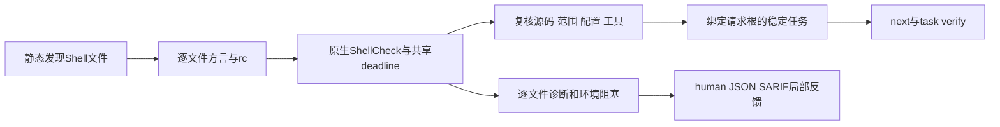

证据见 [项目Shell验收](tests/acceptance/shellcheck-project-baseline.md)。

### Shell 编辑与修复事件

Rust `hook execute` 和 Claude 格式适配器现在把已确认的 Shell 编辑路由到同一 ShellCheck 逐文件路径，接受 `--shellcheck-tool /absolute/path`；仅检查事件选择的文件，共享事件超时，不运行完整项目构建。任务 ID 与 `lint shell` / `check shell` 保持一致，未初始化工作区不自动创建任务。


编辑反馈外层协议0.21、内层0.11，旧协议保留。对话仅显示当前 SC 规则、Unicode 标量位置、实际已同步任务 ID 及复检命令，排除源码和原生自由文本。缺工具、不支持方言、工具失败和工作台保存失败保持未完成；当前不存在 Shell 内置 WASM，不虚构兜底。失败写入不检查；`repair_ready` 复用既有任务复检，零诊断不关闭问题。

[验收记录](tests/acceptance/shellcheck-hook-baseline.md)区分真实 ShellCheck 报告、受控工具测试、npm 离线安装及实际宿主会话。Claude 形状重放通过不代表真实已安装宿主或完整项目门禁已验收。

CFQuery的SQL语法对照必须绑定数据库方言：PostgreSQL可接受空SELECT列表，却拒绝DISTINCT空列表。当前隔离原生验证揭示固定WASM对两者均零恢复，不能将无方言样例升级为已确认错误。详见[方言证据](docs/CFQuery-SQL-Dialect-Evidence.zh_CN.md)；项目SQL原生适配与grammar修复仍开放。

失败写入的通用分流进一步允许已登记的 Go/Cargo/Maven 等检查器配置参数，直接返回 `not_run/write_failed`，不启动工具或创建工作台；租约/所有权、未知或格式错误参数仍拒绝。此例外仅用于失败写入，不将未接线工具静默启用于确认编辑。见[验收](tests/acceptance/hook-failed-write-options.md)。

## Go 编辑原生语法快检（局部验收）

`hook execute . --go-tool /绝对路径/go --timeout 30s --format=json` 对确认编辑中的选中文件优先调用固定 Go1.23.4 SDK 的同目录 gofmt；入口、辅助工具和源码字节分别复核，不运行源码、依赖安装或项目级 go vet。缺工具保留 WASM 候选；选定工具失败、辅助工具缺失、未知版本及 `//line` 位置重映射保持未完成，不静默切换检查器。当前仅固定 SDK 语法观察，项目语言版本与全部构建条件尚未验收。

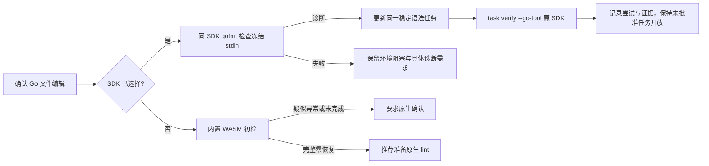

编辑外层协议0.22/内层0.12、新原生首次观察0.10；历史版本保留。原生诊断与候选沿用相同工作区/路径/语言任务身份；Claude格式仅显示当前Go规则、UTF-8字节位置及实际任务复检指引，排除源码/自由文本。原 SDK 复检零诊断不等于可信关闭，仍须go vet、类型、依赖、安全及完整项目检查。证据见[Go Hook验收](tests/acceptance/go-native-hook.md)。

Go首次原生观察的任务指引使用 `repair_brief_preview` 0.18和 `syntax-confirm-` 引用；实际任务复检继续使用0.14和 `syntax-native-` 引用，历史schema保持不变。最终受影响回归：WASM 78通过/5条件忽略，默认15通过/0忽略。此前1461通过的默认全量结果早于这次末尾协议修正。

Go固定1.23.4语法SDK现于编辑及原工具任务复检前静态检查最近 `go.mod` 和最近 `go.work`。最低版本或建议工具链超出支持范围、声明歧义或不可读时返回环境观察，不运行不适用SDK、不降级WASM；运行期间变化撤回诊断，当前声明不适用时撤回旧修复位置。该边界不代表通用工具链选择或语言版本验收。证据：[Go项目版本](tests/acceptance/go-project-version.md)。

### CFQuery 静态 DISTINCT 投影候选

固定 CFQuery grammar 能识别 SQL token，不能完整验证 SQL 子句。Codeguard 对直接相邻的 AST 关键词 `SELECT DISTINCT FROM` 增加独立候选，原始 ERROR/MISSING 保持不变。字符串、引号标识符和 CFML 插值会打断匹配；注释可跳过。该规则不标记 `SELECT FROM users`，因为 PostgreSQL 允许未使用 DISTINCT 的空投影。

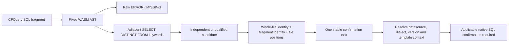

worker 使用1.3、显式probe 0.4、项目反馈0.53、编辑反馈0.23/0.13、持久候选0.11；历史schema及grammar资产不改。嵌入观察同时记录完整文件 `source_sha256` 和独立 `fragment_source_sha256`，坐标还原到文件。重复扫描复用同一任务；候选消失不关闭任务。`next` 明确要求确认datasource、数据库方言/版本、动态模板和schema上下文：CFQuery原生task verify adapter仍未接入，不自动连接项目数据库。

```bash
codeguard grammar probe cfquery query.sql --format=json
codeguard check all . --format=json
codeguard next . --format=json
```

报告示例（字段节选，不是完整schema）：

```json
{"language":"cfquery","recoveries":[],"structural_observations":[{"basis":"codeguard_structure_rule","rule_id":"codeguard.cfquery.distinct_projection","rule_version":"1.0.0","parent_syntax_kind":"program"}],"grammar_qualified":false,"status":"incomplete","delivery_decision":"not_evaluated","next_action":"confirm_candidate_structure_with_applicable_native_tool"}
```

本轮只在候选层纠正一个固定原生反例，不代表grammar取得资格、独立holdout精度、全部SQL方言、SQL注入安全或原生adapter/发行验收完成。证据：[CFQuery候选验收](tests/acceptance/cfquery-structure.md)。


### Rustfmt 原生解析对照（开发期）

Rust 开发重放现支持显式选择 Rustfmt1.9.0-stable：冻结 stdin、私有 edition2024 配置、空环境、共同预算，并复核入口、制品和配置。合法但未格式化的源码不算语法违规，不使用 `--check`；只保留有界 stdin 原生定位，兼容实测 EOF 和 E0765/退出101，崩溃及无定位输出保持未完成。固定 edition 不推断项目版本，不覆盖外部模块，不替代 Clippy/构建，不关闭任务；Rust 编辑 Hook 接线仍待实现。实际16例对照为5TP/11TN/0FP/0FN/0unknown，仅限小规模非独立holdout语料，语言资格仍0/32。执行路径、协议与复现命令见[局部验收](tests/acceptance/rustfmt-controlled-native-differential.md)。


Rust选中文件解析前置现从有界包/工作区声明确定Cargo edition，并在原生调用之间复核声明与源码连续性。Unix库服务已保留真实2015/2021/2024反例；选中文件编辑Hook、稳定确认任务与原工具复检已连接；完整项目与实际宿主验收仍开放。见[项目edition契约](docs/Rust-Project-Edition-Syntax.zh_CN.md)。

Rust编辑反馈现保留安全行号、稳定任务与原Rustfmt复检指引，Clippy/类型/构建义务继续保留。见[局部链路验收](tests/acceptance/rust-native-hook.md)。

Rust编辑后现提供可执行的批次后Clippy指令，明确编辑阶段未运行项目lint。原任务repair_ready保留当前规则/行号并撤回输入变化后的指引；这不是后台队列或可信关闭。见[项目lint后续流程](docs/Rust-Project-Lint-Followup.zh_CN.md)。

Rust 原生首次与 WASM 首次语法任务均可通过同一受保护宿主 SDK 确认、限定关闭和同工具复发重开。原生首次保留 grammar=null（策略1.7/证据0.8）；WASM 首次保留真实 grammar 摘要（策略1.8/证据0.9）。两者绑定 Cargo edition 来源与原反例；原生反证转调查，未完成或输入变化不能关闭。生产宿主批准接线仍待完成，不替代 Clippy/项目门禁。详见 [限定验收](tests/acceptance/rust-task-resolution.md)。

WASM 首次闭环的实际执行路径、协议与误报分流见 [验收记录](tests/acceptance/rust-wasm-task-resolution.md)。

JavaScript 回退候选已接入项目检查与确认编辑 Hook：重复顶层简单 let/const 绑定保留独立结构证据，沿用同一 ESLint 确认任务，并由 `next` 指导原生检查。独立 `lint typescript` 入口也已按 `.js`、`.mjs`、`.cjs`、`.jsx` 选择 JavaScript grammar，并优先调用原生 ESLint；只有无历史待确认任务的零候选观察才推荐安装 lint。真实宿主验收与 grammar 资格仍未完成。见[验收](tests/acceptance/javascript-binding-workbench.md)。

以上为当前源码候选的新增能力，公开 npm 发行未包含本批修改。

独立 `lint <注册表规范语言> FILE` 已接受全部规范语言ID：已有专用原生适配器保留原路径，其余输出 `syntax_lint_feedback`，明确原生适配缺口及配置未知。启用WASM的源码构建追加匹配的有界grammar候选，提供 `--workspace ABS_ROOT` 时复用 `.codeguard/` 原生确认任务。这是局部语法反馈，不代表原生lint全覆盖，也未更新公开npm能力。

C/C++源码构建还支持明确的独立原生上下文：`codeguard lint c main.c --clang-tool /ABS/PATH/clang --standard c11 --format=json`（C++使用 `cpp`/`c++17`）。已实测Apple Clang21档案返回原生规则、字节位置及可复用复检argv；尚未同步Clang原生任务，不替代项目lint，预处理上下文未解析时保持未完成。


显式 `grammar probe erlang FILE --format=json` 已补充直接函数form终止符候选，与原始解析恢复分开；字面量标点和合法子句续接不误判。项目/Hook/任务接线及原生精度验收仍开放，见[验收](tests/acceptance/erlang-form-candidates.md)。


Erlang 项目与编辑检查已原生优先，缺工具时补充函数终止符候选并更新同一持久任务；所选工具失败不回退WASM，原工具复检保留历史。[验收](tests/acceptance/erlang-form-workbench.md)。

源码增量（尚未发布）：项目 `check all` 的 Rust CVE 节点可发现绝对 PATH 中已有的 cargo-audit，显式 `--cargo-audit-tool` 优先；使用 `--rustsec-db /path/to/offline-db` 指定现有离线数据库。所选入口失败不换工具、不自动安装，数据库未核验仍不声明安全通过。见[验收](tests/acceptance/cargo-audit-path-discovery.md)。

## Java 注释统一入口（源码增量，尚未发布）

`comments java [path]` 复用既有原生 Javadoc 探针：文件模式执行显式 JDK21 局部诊断；项目模式只选择已识别配置及所属主源码。缺配置不运行 Javadoc，也不生成注释违规。显式 Maven 上下文选择原 POM 多文件检查，失败不退回单文件探针。

```bash
codeguard comments java File.java --java-home /absolute/jdk21 --format json
codeguard comments java . --java-home /absolute/jdk21 --maven-tool /absolute/mvn --maven-repo /absolute/repository --repo-sha256 SHA256 --timeout 60s --format json
```

独立包装协议 `java_comments_feedback 0.1.0` 保留 `native_observation` 原报告，不修改旧 `lint java --checker javadoc` 的协议。预算使用 CLI、登记环境变量、项目默认值、内置默认值的优先级；所有原生子任务共用截止时间。报告显示 `target_kind`、`execution_budget`、具体观察和下一步；局部零诊断仍是 `coverage_proven=false`、`delivery_decision=not_evaluated`，退出3（取消130）。不隐式安装或修改源码。

**范围限制：** Maven多文件模式的工作台适配尚未接通；文件入口通过显式--workspace接线，见下方说明。可信关闭仍待完成，本入口不伪造任务，不据局部探针关闭问题。示例中的绝对工具路径和离线仓库摘要需替换为当前真实环境。

### Javadoc 项目工作台接线（源码增量）

已初始化项目的 `comments java .` 在 JDK 单文件模式中自动保存局部观察并同步稳定任务，包装协议现为 `java_comments_feedback 0.4.0`；未绑定工作台仍沿用0.1局部反馈，显式文件工作台见下方。行号用于定位；规则、文件、源码锚点和同锚点序号构成身份。重复扫描追加观察，不增加重复任务。

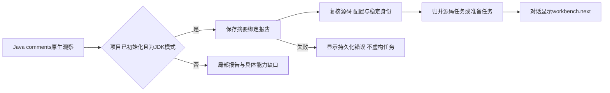

缺配置或原生未完成生成准备记录，不成为源码违规或自动新增交付义务。报告使用 `workbench.status/new_findings/new_blockers/next`，持久失败不返回虚构任务；`next` 和任务文字提供证据、规则、允许范围、步骤、复检和关闭条件。局部零诊断保留开放任务，`task_verify_status=local_observation_only`，原任务复检见下节；Maven多文件报告工作台适配尚未接通，显式文件工作台见下方。完整可信关闭和宿主验收仍待完成。

### Javadoc 原任务复检（源码增量）

已初始化项目 JDK 模式的 Javadoc 任务支持原工具复检：

```bash
codeguard task verify CG-<任务身份> . --java-home /absolute/jdk21 --format json
```

复检读取摘要绑定的原观察，只选择任务对应主源码与当前原生配置；不会从报告里选择可执行程序。显式 JDK21 的源码、配置、工具字节在扫描及记录前核对。其它检查器参数在租约和启动前拒绝。结果 `still_present`、`incomplete`、`rule_coverage_requires_review`、`candidate_absent_unverified_policy` 保存到同一任务事件，绑定原生报告和本次尝试。缺工具、工具失配或输入变化不成为修复完成；配置改变或同规则不同锚点需要复核。

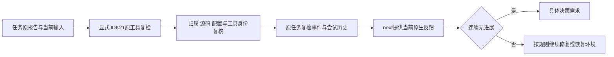

当前版本：绑定工作台包装 `java_comments_feedback 0.4.0`、Javadoc修复简报0.3、原生复检容器 `javadoc_task_recheck 0.2.0`、公开 `task_verification_preview 0.27.0`。旧schema保持可读；`task_verify_status=local_observation_only` 表示已接通局部复检，正式可信关闭仍未验收。补齐文档后的零诊断只记录消失候选并保持open；白名单审批、原完整项目规则归因与实际宿主仍需独立完成。Maven多文件任务同步已接通，可信关闭/复发及真实宿主验收仍待完成；显式文件工作台见下方。

### 显式 Java 文件工作台（源码增量）

```bash
codeguard comments java File.java --workspace . --java-home /absolute/jdk21 --format json
codeguard task verify CG-<任务身份> . --java-home /absolute/jdk21 --format json
```

`--workspace` 显式绑定可读工作区：文件必须位于其中；项目目标必须与工作区根一致。越界在工具启动前拒绝；未初始化时显示 `workspace_not_initialized`，不会自动初始化。只提供文件、未指定工作台时仍为原局部反馈，不从父目录猜工作区。显式工作区也用于共享预算的项目默认值。

持久观察0.2、修复简报0.3及原任务复检0.2增加 `observation_scope`：`explicit_file_probe` 为显式单文件诊断，配置引用必须为空；`configured_project_probe` 仍按项目原配置筛选主源码。原任务复检沿首次模式，不能因为后来新增POM把文件探针变成项目检查。行号只定位，稳定身份仍按原规则/文件/锚点归并。缺JDK只产生准备任务；局部零诊断及同步仍不关闭原任务。

当前绑定工作台包装为 `java_comments_feedback 0.4.0`，公开任务复检为 `task_verification_preview 0.27.0`；旧schema保留。Human输出也显示工作台状态、任务身份、模式、下一步与复检参数。Maven多文件任务同步已接通，可信关闭/复发及真实宿主验收仍待完成。

### Maven Javadoc 多文件工作台（源码增量）

已初始化项目使用显式 Maven 上下文运行 `comments java` 时，原生多文件诊断保存到 `.codeguard/reports/` 并归并稳定修复任务；缺配置或未完成执行生成准备任务。工作台在原生执行前捕获有界源码/POM快照，保存前再核对当前字节；导入时重新核对摘要、构建根、原POM、工具观察身份、规则和位置，并重算问题投影。篡改、越界或输入变化不产生新的源码问题。已消费历史报告按原摘要收据保留，不因后来修复源码反复变成导入失败。

```bash
codeguard comments java . --maven-tool /absolute/mvn --java-home /absolute/jdk21 --maven-repo /absolute/offline-repo --repo-sha256 <实际仓库摘要> --format json
codeguard next . --format json
```

Maven绑定包装为 `java_comments_feedback 0.6.0`，保存观察为 `maven_javadoc_workbench_observation 0.1.0`，修复简报内部版本0.5且 `observation_scope=configured_maven_multifile_probe`。JDK文件/项目模式保留0.4包装及已有复检协议。反馈包含稳定任务身份、证据引用、原生规则、允许范围和原Maven重扫argv。`task_verify_status=local_observation_only` 明示已接通Maven局部原任务复检，不能套用JDK单文件复检；准备任务只恢复环境，不修改无关源码。重复扫描不重复建任务，局部零诊断不关闭历史任务。

当前只覆盖既有简单静态POM直接重放探针；完整生效模型、复杂项目、可信关闭/复发、真实宿主及发行仍需验收。本轮验证使用受控Maven进程夹具，不冒充真实插件执行。详见 `tests/acceptance/maven-javadoc-workbench.md`。

## Maven Javadoc 原任务复检（源码实现）

`codeguard task verify CG-任务身份 . --maven-tool /绝对路径/mvn --java-home /绝对路径/jdk --maven-repo /绝对路径/离线仓库 --repo-sha256 固定摘要 --format json` 复用首次报告的构建根与原生多文件探针。缺工具或工具身份变化反馈未完成；POM或源码集合变化反馈 `rule_coverage_requires_review`。问题仍存在记录 `still_present`；补齐注释后的局部零诊断记录 `candidate_absent_unverified_policy`，任务保持开放。范围外源码的准备任务不能借主源码探针完成而消失。

复检接通原租约与尝试记录；同一动作两次无进展后 `next` 要求具体决策。Maven绑定包装0.6、内部简报0.5、原任务容器0.1、公开任务复检0.28；`task_verify_status=local_observation_only`。JDK入口与历史schema保留。聚合报告0.57为嵌入新Maven简报提供严格协议；本批真实聚合输出选择了更优先的P3C准备任务，仍是0.38；校验暴露其旧schema不接受P3C准备简报，历史失败保留；后续0.58已修复该配置准备简报分支，见下节。

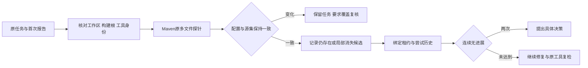

验收见 [Maven原任务复检](tests/acceptance/maven-javadoc-task-recheck.md)。本批使用受控Maven进程夹具；真实Maven插件新工作台、完整生效模型、可信关闭/复发、真实宿主和发行仍未验收。

### P3C配置准备任务的聚合协议修复

`check_feedback 0.58.0` 为选中的 `java.maven.p3c` / `p3c_configuration_not_confirmed` 准备任务提供明确的封闭简报协议，保留0.38等历史schema。简报仍是blocker及review-project-policy动作；配置是否必需由项目策略确认，不把缺配置转为源码违规。新schema包含CLI现有Java选择原因码，实际聚合及两处内嵌简报通过校验，伪造检查器、finding类型、原因、源码修复动作、批准权威和交付allow均被拒绝。其它P3C finding/工具阻塞分支仍按既有版本处理，本批不声称完整P3C协议验收。见 [局部验收](tests/acceptance/p3c-preparation-aggregate-schema.md)。

## CLI语言别名（源码构建）

公开检查命令和plan支持：py→python、rs→rust、ts→typescript、rb→ruby、kt→kotlin、erl→erlang、golang→go、c++→cpp、c#→csharp。例如 `codeguard plan lint py . --format json` 返回规范python身份；`codeguard lint py .` 进入既有Ruff入口。仅语言参数位置归一，源码/工具路径不修改。grammar probe保留独立语法身份，JavaScript/TSX/bash等不作推测映射；未登记拼写继续由原入口校验。别名不安装工具、不新增检测能力、不改变退出码或planned状态。

## `lint all` 的多语言检查范围

源码 CLI 的 `codeguard lint all . --jobs 2 --timeout 30m --format json` 复用项目发现与共享调度预算，只选择 lint 节点；不创建独立 build、comments、dependencies 或 CVE 任务。Clippy 等原生 lint 自身仍可能编译项目，原生规则返回的注释问题也保留。专用 CVE 参数在读取项目和启动工具前拒绝。

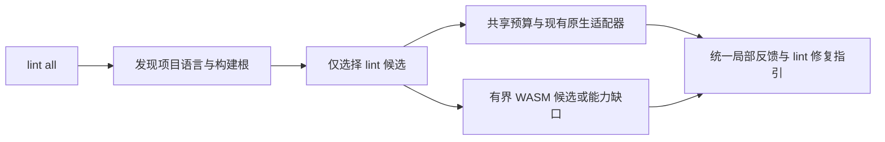

正常反馈沿用 check_feedback 报告，版本为 0.59.0，并明确 requested_categories=["lint"]。下面仅为字段节选，不是完整报告：

```json
{"schema_version":"0.59.0","report_type":"check_feedback","selection":"all","requested_categories":["lint"],"delivery_decision":"incomplete"}
```

历史其他类别事实保留，但本次 next 不选其他类别简报。缺原生工具、未接入语言和未获资格的 WASM 均保留未完成状态；原生局部零诊断不能签发完整项目 allow。真实 SIGINT 验收覆盖 lint 模式取消：退出 130，保留已完成兄弟任务诊断，并核对子孙进程清理；内部异常仍使用现有 check_aborted 协议，尚未独立验收 lint 模式内部异常。当前能力属于源码实现，不能据此宣称 npm 已发布相同能力。

`lint all` 的 next 通过一次本地事实校验，在允许的 lint 检查器集合内选择；历史构建/CVE/注释任务不使有效 lint 指引变成空值，也不会被删除。语法确认后备只选择本轮产生的任务 ID。

当前源码29ec2e1的WASM扩展回归已结束：基础crate与CLI lib/bins、201个集成目标合计1879通过、0失败、177条件用例未执行，明确排除未提交Erlang草稿。严格Clippy通过；这不代表独立语料、原生工具全矩阵、宿主或发布验收。详见tests/acceptance/wasm-regression-29ec2e1.md；32个grammar仍为候选，正式资格0。

## 四类核心生产验收与声明模块接线

生产目标要求57个canonical语言条目逐项验收语法、详细文档注释、开发规范和漏洞检查；历史planned仍是未完成目标。Java必须分别验收Maven/Gradle漏洞路径、详细Javadoc和原生P3C。配置存在、WASM可运行或模拟测试通过都不能证明生产就绪。独立标注评测、声明支持的版本/构建器/平台、原工具修复复检关闭与复发重开均为必需验收；当前WASM正式资格仍为0/32。详见OpenSpec任务15.1–15.7。

四项均为硬验收条件：原生语法检查与全部32份WASM分别验收；详细文档必须检查适用的用途、参数、返回、错误和行为说明，并有缺失、空标签、模板及语义不符反例；开发规范使用生态原生规则，格式检查不能代替；漏洞检查绑定真实直接/传递依赖和可追溯数据源。原生工具无法覆盖详细语义时，报告必须明确待核验范围。仓库计划读取的回归逐一拒绝全部228项义务的缺失或伪造生产资格，共684个反例；这验证计划不能自批，不代表功能完成。见[正式要求](openspec/changes/introduce-rust-codeguard-cli/specs/native-tool-adapters/spec.md)及[当前验收状态](tests/acceptance/production-acceptance-plan.md)。

当前源码把JavaScript声明模式证据接入项目检查、独立 `lint typescript`、`lint all` 与文件编辑反馈，适用原生ESLint仍优先。未覆盖的整文件 `.mjs` 和明确声明module的 `.js` 使用模块候选worker；CommonJS/未知模式继续原有有界初检，不启用函数外return模块规则。worker之后复核源码和模式证据；持久确认0.15、项目检查0.60、ESLint反馈0.7、Hook0.29/局部0.17与模块修复简报0.21使用独立版本契约。包声明改变时原任务复检报告上下文失效，不能沿用旧模块证据。重复检查复用稳定任务，清洁候选不能关闭任务。本批不声称新的npm/宿主发行或生产资格。见[接线验收](tests/acceptance/javascript-module-workbench.md)。

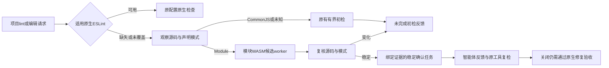

## 同构建根的 Maven 与 Gradle 归属

静态发现现逐份保留同一物理目录的Maven、Groovy Gradle、Kotlin Gradle配置引用。损坏POM不能遮蔽Gradle，两种Gradle脚本并存也分别保留。Java依赖/CVE/安全类别保留构建器混合或Gradle未解析状态，不再挂全范围Maven身份；已经取得的Maven局部依赖图和漏洞观察仍放在native_results。check反馈0.61保留普通检查/lint-only两个封闭契约，Java注释not_configured原因严格限于对应类别，旧schema不改。这是范围归属修复，不是原生Gradle插件执行或生产验收完成。本地缓存Gradle8.10.2版本命令已实际运行，所检查OWASP Gradle插件缓存路径不存在，本批未安装或下载。见[验收记录](tests/acceptance/java-mixed-build-roots.md)。


### 开发期CLI的Gradle配置观察

`check java` / `check all`可显式提供`--gradle-bundle`、`--java-home`及可重复的`--gradle-project-file`，使用已有Gradle观察选定构建输入。统一调度处理超时与取消，check_feedback0.62将局部模型与质量结果分开保存；`lint all`拒绝此组参数。模型成功不证明完整配置覆盖，也不执行质量/漏洞任务。见[命令参考](docs/Codeguard-Command-Reference.zh_CN.md)和[验收](tests/acceptance/gradle-public-model-check.md)；未发布npm包或授予生产资格。


### Gradle 原生 Javadoc 应用服务（开发期局部能力）

新增 `gradle_javadoc_probe::observe` 在一次离线 Gradle 调用中采集模型并重跑已启用的官方 Javadoc 任务，使用原项目 doclint/doclet/访问范围/源集，只固定诊断 JVM 的英语语言。Rust 校验选定源码及诊断位置，原生失败、未知诊断、输入变化等保持未完成。真实 Gradle 8.10.2/JDK21 四组样例得到 3 条缺注释、2 条缺标签、2 条空标签描述、0 条诊断；这是一个原生条件测试中的四次观察，不是独立精度语料或生产验收。无诊断报告仍为 `empty_output_unverified`，`rule_configuration_complete=false`、`coverage_proven=false`。

开发期 `check java` / `check all` 现可显式追加 `--gradle-javadoc`，同时提供 `--gradle-bundle`、`--java-home` 和可重复的 `--gradle-project-file`（含根 settings/build 及 Java 文件）。统一调度只生成一个 `java.gradle.javadoc` 任务，单次原生调用完成模型/注释检查，check_feedback 0.65 在 `native_results.java_gradle_javadoc` 保存诊断；不额外调用配置模型。仅模型请求仍使用 0.62；`lint all` 拒绝文档参数。SIGINT 保留取消观察，check_aborted 0.17 保留兄弟异常之前的文档观察。公开质量反馈已接入，原工具任务复检关闭、完整规则及完整 JDK/源码闭包和跨项目/custom doclet 验收仍待完成。见 [公开 Javadoc 入口验收](tests/acceptance/gradle-public-javadoc-check.md)。

Java 注释类别在显式 Gradle 文档请求下保留局部观察或原生未完成，不能把实际诊断或工具故障误报为 Maven 未配置；规则/完整范围仍未验收。见 [类别归属修复](tests/acceptance/gradle-javadoc-category-attribution.md)。

Gradle 文档的工作台基础现在提供独立 `gradle_javadoc_workbench::project`：首次导入前核对选定路径、源码摘要及原生快照摘要，归并相同原生定位，把工具故障/未验收覆盖保留为独立准备观察。同一路径/规则/源码行锚点仅移动行号时保留身份；修改锚点或插入相同锚点可能产生新身份，不承诺完整符号级身份。投影接口的首次基础验收没有持久化接线；当前接线和独立协议见下文，原生任务复检关闭仍待完成。见 [投影验收](tests/acceptance/gradle-javadoc-projection.md)。

Gradle 文档工作台已接入开发期 `check java/all --gradle-javadoc`：原生运行前捕获选定输入，首次导入再次核对摘要/位置，保存局部报告并同步稳定问题与准备任务；重复扫描追加观察，缺失 Markdown 可从事实恢复。`next` / `task show` 使用原选定输入的 Gradle 复扫参数，工具路径须复核；check_feedback 0.65 与修复指引 0.22 独立消费，普通 Java 检查也能读取历史指引。`gradle_javadoc_tasks` 的计数范围为本次工作区同步，并非只统计 Gradle。三次真实公开检查验证发现、复用和修复后空诊断；原问题仍开放。`task_verify_status=not_integrated`，原任务复检/可信关闭/复发重开和完整规则/范围仍待验收。见 [工作台验收](tests/acceptance/gradle-javadoc-workbench.md)。


独立JDK21路径现按原生消息识别空注释、缺用途及裸参数/返回/异常描述，并保留五种原生规则到稳定修复任务。`lint java FILE --checker javadoc`、`comments java FILE --workspace .`、已识别配置的项目comments及原任务task verify共用源字节绑定解析器；旧解析器和Maven协议不扩大。新增JDK原生0.2、项目0.4、工作台/复检0.3、文件反馈0.7/工作台反馈0.8、修复指引0.4、任务预览0.31、聚合0.68和异常0.19；缺配置/工具/未知格式仍未完成。真实JDK21两种模式各运行4/3/1/0诊断样例，16张原任务逐项确认仍存在及修复后未受信消失，事实仍open；详细中文与合法继承说明不产生诊断。这不是全部Java详细行为契约或生产资格，Maven真实描述验收、Checkstyle完整描述验收、所有语言四核心和可信关闭仍待完成。见[独立JDK详细描述验收](tests/acceptance/jdk-javadoc-detailed-descriptions.md)。

## Maven详细Javadoc描述：实现与验收分开

Maven原POM多文件路径现接入五类原生描述规则：空注释、缺主用途及空参数/返回/异常描述。新的详细解析入口保留源码行/caret、消息、位置和汇总核验；历史解析入口及schema不扩大。BUILD SUCCESS中的warning也保留为问题；未知输出、工具/配置故障与实际离线插件缺失保持检查不完整，生成准备任务。绝不回退单文件检查绕过Maven失败。

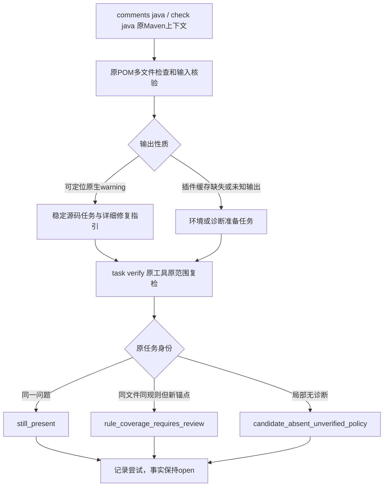

统一入口仍为 `codeguard comments java . --maven-tool /absolute/mvn --java-home /absolute/jdk21 --maven-repo /absolute/offline-repo --repo-sha256 ACTUAL_DIGEST --format json`；复检为 `codeguard task verify CG-task-id .` 并显式提供同样的原工具上下文。替换路径和实际缓存摘要；CodeGuard不自动安装插件或降低规则。修复指引要求说明用途、参数、返回和异常，不能用裸标签替代详细说明。

新增封闭协议：Maven原生/工作台/复检0.2、项目0.5、comments未绑定0.9/工作台0.10、内brief0.6/预览0.3、任务预览0.32、聚合0.69/异常0.20。首次导入重算规则和投影并拒绝版本降级；复检核对已消费首次报告的摘要收据与原任务范围/规则，支持首次证据为复检包裹报告的新任务。零诊断不会自动关闭，可信关闭/复发仍待验收。

受控Maven进程输出完成五规则×成功/警告失败的公开检查、任务归并、原任务复检及修复后未受信消失回归；这不是实际插件诊断验收。本机已有Maven3.9.16/JDK21实际运行空离线库检查与环境任务复检，两次均识别Javadoc3.12.0插件缺失、没有源码问题。缓存缺失，真实插件详细描述4/3/1/0样例及警告失败配置验收尚未执行，独立条件测试保持待运行。完整Java详细行为契约、Checkstyle完整描述验收、57语言四核心、平台/宿主与可信关闭继续未完成；OpenSpec15.3/15.6不勾选，正式语法资格仍0/32。见[分项验收](tests/acceptance/maven-javadoc-detailed-descriptions.md)。

## Checkstyle详细描述模块：源码实现，原生验收待完成

原配置的 `JavadocStyle`、`NonEmptyAtclauseDescription`、`SummaryJavadoc` 现可通过固定10.21.4静态适配，保留完整类名/短名、自定义ID、severity及各自属性。空描述开关、Java正则、首句/HTML、scope/tokens、标签token、摘要period/禁用片段和非紧凑HTML开关照原XML交给工具，不在Rust中替代原生检查。模块不能借用其它模块参数，未知token/来源和共享ID继续待解析；空period或摘要正则保留原生合法配置，Rust不以自己的正则语法判断Java正则。

统一入口：`codeguard lint java FILE --checker checkstyle --workspace . --config ORIGINAL_XML --java-tool EXISTING_JAVA --checkstyle-jar EXISTING_JAR --format json`。诊断进入稳定任务，`next` 给出详细用途、参数/返回/异常或摘要修复方向，`task verify CG-task-id .` 显式提供原工具/原配置复检。环境恢复产生的新源码任务也可据包裹首次报告复检；局部消失和恢复都不关闭任务。

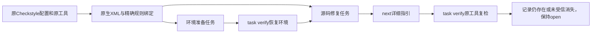

新协议为局部反馈0.5、工作台/源码复检/准备复检0.2、修复简报与预览0.25、源码任务预览0.33/准备任务预览0.34。历史schema不扩大，首次导入拒绝新配置伪装成工作台0.1；复检容器与scan版本配对。选中详细Checkstyle简报的聚合支持0.70，但本批实际公开聚合选择优先级更高的P3C准备任务，仍用0.58；0.70仅有构造序列化验证，不能称实际路由验收。另修正该实际聚合中不符合旧协议的Javadoc未配置原因码，现使用已有 `javadoc_checker_not_configured`，不虚构配置或运行。

受控XML进程夹具验证三类诊断、归并/修复复检、准备恢复及新任务复检；夹具不是Java或Checkstyle，不证明原模块语义或精度。当前未找到已有10.21.4自包含JAR，真实条件测试未执行；完整描述规则/配置/项目模型、独立误报评测、可信关闭/复发、57语言四核心与平台/宿主生产验收继续未完成，15.3/15.6不勾选，正式语法资格0/32。见[分项验收](tests/acceptance/checkstyle-detailed-descriptions.md)。

## Python 详细文档契约：Ruff DOC 原生增量（2026-10-06）

固定 Ruff 0.16.8 的 DOC102（多余参数）、DOC201/202（返回）、DOC402/403（生成值）、DOC501/502（异常）已进入原生文档分类、限定修复指引、稳定任务及原工具复检。原项目须自行明确启用 preview 和规则；CodeGuard 不添加参数开启预览，不复制语义检测实现。生效设置与诊断规则矛盾时仍未完成，未知 DOC 编号不凭前缀取得适配资格；原 D### 分类与未批准规则映射保持。

DOC502 只对照直接 raise，可能与真实隐式异常文档冲突：报告保留，指引要求调查实际调用链和项目约定，禁止自动删除真实异常说明，必要时走精确误报裁定。Google 首句 Return/Yield、None、stub 和抽象 stub 等原生零诊断均保留；本机带具体返回实现的抽象方法仍收到 DOC201，不把笼统豁免说明当完整验收。用途、完整参数/异常契约及文档内容的正确性仍需逐项验证，不能从此七项规则推断全部文档规范已通过。


真实七项规则已验证重复扫描身份、存在、noqa 抑制及文档修复后未受信消失，事实保持 open；另有原生豁免、隐式异常冲突和未选择 DOC 的边界。既有协议允许原规则 ID 和脱敏指引，本次不扩大历史 schema、受批准映射或关闭权限。验收与版本限制见 [Ruff DOC 验收](tests/acceptance/ruff-documentation-contract.md)。当前仍不是完整 Python 文档、独立误报评测、全平台或生产资格。

四核心验收计划只读入口：`codeguard capabilities [language] --acceptance-plan --format=json`. 57 语言/228 义务保留未授予资格，筛选不缩减总义务。参见[acceptance plan](docs/Codeguard-Production-Acceptance-Plan.zh_CN.md).

Java Gradle 漏洞检查新增显式原任务入口 `codeguard cve java`；JSON 原配置与可选模块缓存保留，结果仍未受信；已初始化工作区自动同步脱敏稳定准备任务，next/task show列出原输入/任务复扫参数；task verify已接入冻结上下文局部复检；统一check已支持显式原任务调度，完整原生验收待完成。详见[Gradle OWASP](docs/Codeguard-Gradle-Vulnerability-Checks.zh_CN.md).


C/C++ 独立 Clang 入口已修复字符串、注释和原始字符串中的井号误判，并补预处理替代记号/续行防护；行首非 ASCII 恢复仍保守未解析。仅局部验收，完整项目语法、文档规范、开发规范、CVE 四核心生产门槛保持开放。见 [验收边界](tests/acceptance/clang-preprocessor-context.md)。


Rust 的详细文档任务现对原生 Clippy `missing_errors_doc`、`missing_panics_doc`、`missing_safety_doc` 给出具体 Errors/Panics/Safety 修复指引，复用稳定任务及原工具抑制对照。已有 Clippy 实测接受空章节标题，因此零诊断不代表详细说明合格，事实继续 open；不会隐式启用 pedantic。`comments rust` 现共用截止时间采集 Rustdoc 探针与原项目 Clippy，保留独立原生报告、任务和原工具复检；详细内容完整性仍未取得资格。参见 [统一入口验收](tests/acceptance/rust-comments-combined.md)。参见 [局部验收与缺口](tests/acceptance/clippy-documentation-contract.md)。


`check rust/all` 现在把原生 Clippy 的三类文档诊断作为独立 comments 观察，与原 Rustdoc 行并存，不覆盖原工具阻塞或重复执行 Clippy；仅精确已知规则参与，零发现不证明详细契约启用。参见 [聚合验收](tests/acceptance/clippy-documentation-aggregate.md)。


Cargo 文档配置现在逐构建根记录五项精确 lint 的清单声明等级，绑定同次摘要；继承、组、源码属性和未声明均保留待核验。`init` 将详情写入项目画像，AGENTS 保留摘要与引用，不自行添加规则或授予详细文档合格。见[声明验收](tests/acceptance/cargo-documentation-declarations.md)。

Cargo文档配置发现现可将明确选择继承的成员与最近已观察workspace规则关联，保留两份清单身份及原成员配置引用；候选不可读或变化保持发现不完整，最近规则缺失/非法不能借用更远规则。项目内便携相对package.workspace引用现只选择声明来源并核验有界遍历及摘要；绝对/非便携引用、完整成员归属与生效覆盖仍待核验，这项候选关联不授予生产资格。


### Python 独立文档入口的局部能力

`codeguard comments python . --ruff-tool /absolute/path/to/ruff --format=json` 复用项目原 Ruff 配置和原工具检查，返回 `python_comments_feedback` 0.2。`native_report` 保留完整脱敏原生0.12对话报告；顶层 `documentation_findings` 仅取已有D###和七项明确DOC规则，顶层 `next` 保留当前及历史文档任务与准备任务，其他开发规范问题仍保留在原生子报告。零诊断不等于详细注释合格：规则覆盖固定 `unverified`，详细契约资格固定 `not_granted`，整体退出3。缺配置生成准备任务；不会开启preview、改配置或用WASM代替文档检查。已初始化项目沿用稳定任务和 `task verify` 原工具复检，原事实不自动关闭。

参见 [独立入口与真实Ruff验收](tests/acceptance/python-comments-cli.md)。


Python文档入口现在返回0.2封装，新增 `documentation_configuration`，直接复用同轮原生设置，区分已选择文档规则、未选择与设置不可用。零诊断也会显示实际全局文档规则及逐文件配置/源码/工具/设置身份；子配置独立，原生不完整不沿用旧设置，不新增工具调用。`observed`只指设置观察完成，逐文件忽略、源码抑制与详细语义资格仍未证明。历史0.1和原0.12协议保留；旧封装消费者需接受0.2。参见[同轮配置观察验收](tests/acceptance/python-documentation-configuration.md)。


Rust CVE局部观察现在核对同轮RustSec crates/rust内容、成员及物理入口稳定性；库变化或不可安全读取时，不因原生退出/JSON有效而报告局部完整，有效候选仍保留为未完成反馈。正常根级锁/Git整理不作advisory内容。共享预算与有界读取不等于可信数据库来源或时效，原0.1协议与not_evaluated保持。参见[漏洞库稳定性验收](tests/acceptance/cargo-audit-database-stability.md)。


### C/C++ 独立原生文档入口（源码增量，尚未发布）

`codeguard comments c api.c --clang-tool /absolute/clang --standard c11 --format=json`；C++ 使用 `comments cpp api.cpp --standard c++17` 并保留同一工具参数。当前仅适配已实测的 Apple Clang 21 独立文档警告档案，明确工具与标准，不隐式安装。原生 SARIF 的空命令描述、错误参数名及 void 返回标签三项精确规则带有修复步骤、仅文档允许范围和原工具复检 argv；未知规则单独保留。坏报告、输入变化、取消和未解析预处理不能成为源码违规。

这是 `c_family_comments_feedback` 0.1 的局部观察：项目原配置未知，完整详细契约未授予资格；Clang完全缺失注释也可能零诊断。未绑定工作台时保留0.1/`next=null`；已有工作台现在提供0.4反馈、按文件/语言标准/原规则归并的稳定任务和next0.30，保留全部当前位置及原工具复扫argv。输入或工具变化撤回修复定位，清洁复扫保留开放任务。专用task verify已沿首次工具/标准/规则接通，记录局部事实并保持任务开放；专用尝试日志已接通，按当前源码/原工具上下文记录失败与预算；项目检查和Hook仍待接通；退出3，取消130，不自动关闭任务或授予门禁。真实16例、执行路径和剩余缺口见[原生文档验收](tests/acceptance/c-family-comments-native.md)。

C/C++ 原任务复检与新封闭协议的当前证据见[复检验收](tests/acceptance/c-family-comments-task-recheck.md)；完整四核心生产资格仍未授予。

C/C++ 受控尝试、无进展诊断与当前协议见[尝试日志验收](tests/acceptance/c-family-comments-attempt-history.md)；本地日志不能替代完整四核心生产验收。


C/C++现新增原生Clang AST函数文档结构适配器，可区分无文档、空用途及缺参数/返回说明；重声明、文档引用和复杂类型保持未知。该能力现已接入显式comments反馈，check与专用结构复检/尝试闭环尚未接入，不替代现有原生警告或完整生产验收。见[结构验收](tests/acceptance/clang-documentation-structure.md)。


C/C++显式comments现同次原生扫描返回原警告及函数文档结构：无原警告也会报告缺注释；未知/非法结构、源码工具失稳不变成违规。反馈0.5/0.6保留原条数并归并重复定位，结构稳定任务现partial，专用复检/尝试尚未接通，完整详细文档资格未授予。见[公开结构反馈](tests/acceptance/c-family-comments-structure-cli.md)。


C/C++结构缺失现按文件/语言标准/Codeguard自有策略创建稳定修复任务，next给出全部当前函数定位与原comments复扫命令；重载和行号移动不重复创建，删除Markdown可恢复，局部消失仍open。专用task verify/attempt目前执行前拒绝，完整详细准确性与可信关闭仍未验收。见[结构任务验收](tests/acceptance/c-family-structure-workbench.md)。

C/C++结构原工具复检更新：结构任务现可执行绑定首次工具/标准的 `task verify`，记录 still_present、incomplete 或 candidate_absent_unverified_policy 局部观察；任务仍开放。新的brief0.32/task show0.6/反馈0.8/复检0.37将原comments复扫指引升级为任务绑定的原工具复检，测试直接执行生成argv。结构attempt/无进展及可信关闭继续未完成，历史段落保留为检查点。

C/C++ structural rechecks now use the original compiler and standard through task verify, recording local observations without closing tasks. Brief0.32, task-show0.6, feedback0.8 and verification0.37 upgrade comments re-scan guidance to task-bound original-tool verification; native tests execute the generated argv. Controlled structural attempts, no-progress handling and trusted closure remain pending. Earlier sections are historical checkpoints.

C/C++结构尝试更新：结构任务接入租约、repair-source尝试日志、ready后的原工具复检与同一输入两次失败预算。新brief0.33/task show0.7/绑定反馈0.9显示等待、必须复检或具体决策；重复扫描、删Markdown及重命名动作不能恢复预算。缺历史报告保持未验证，篡改事件拒绝。跨输入语义无进展、完整详细准确性/项目/平台/独立精度及可信关闭仍未验收。

C/C++ structural tasks now use leases, repair-source journals, original rechecks after ready attempts and a two-failure budget for unchanged inputs. Brief0.33/task-show0.7/feedback0.9 show waiting, required verification or a concrete decision. Rescans, projection deletion and action renaming cannot reset failures; missing reports remain unverified and forged events are rejected. Cross-input semantic progress, full accuracy/context/platform/independent precision and trusted closure remain unqualified.

### C/C++ 统一检查入口（当前源码，局部验收）

```bash
codeguard check all . --clang-tool /usr/bin/clang --c-standard c11 --cpp-standard c++17 --jobs 4 --format=json
codeguard check c . --clang-tool /usr/bin/clang --c-standard c11 --format=json
```

仅用于已验证的 Apple Clang 21 独立源码档案。`c.comments`、`cpp.comments` 在同一任务图中共享截止时间、取消和 jobs，上述两个任务共用编译器资源锁；每语言最多观察64文件，累计反馈包含任务投影且限制16MiB。报告0.72的 `native_results.c_family_comments` 区分上下文缺失、未执行、局部观察和未观察尾部；不能据此推断头文件、预处理或完整构建配置。

全项目输入复核后才接入原警告和结构稳定任务；源码、工具、范围变化或取消撤回当前定位及下一步权限。未初始化项目不创建`.codeguard/`，缺工具不会生成源码违规。JSON/human/SARIF保留局部结果，SARIF分别标记原生发现与CodeGuard自有结构策略。退出3；取消130。详细准确性、完整项目覆盖、可信关闭、Hook、跨平台/独立精度及四核心生产验收仍未完成。实际测试及报告见[统一入口验收](tests/acceptance/check-c-family-documentation.md)。

C/C++文档修复Hook当前增量：`repair_ready`按首次任务恢复原Clang/标准，外层反馈0.30与摘要0.9区分原警告和CodeGuard结构策略，最多8处定位并保留总数。当前输入变化、期限耗尽或消费收据失效撤回定位/报告引用；消失仍保持任务open，不授予详细准确性或可信关闭。已完成默认/WASM真实Clang及过期/篡改回归；自动编辑、已安装宿主和完整生产资格仍缺。见[局部验收](tests/acceptance/c-family-documentation-hook.md)。


C/C++已确认编辑事件已接入有界文档观察：`hook execute PATH --clang-tool ABS --c-standard c11 --cpp-standard c++17 --format=json`，事件仍从stdin JSON输入。缺上下文保留context_required；已有工作区可同步稳定文档任务。此路径保留原生语法覆盖缺口，不证明已安装宿主验收；repair_ready标准仍由原任务恢复。
