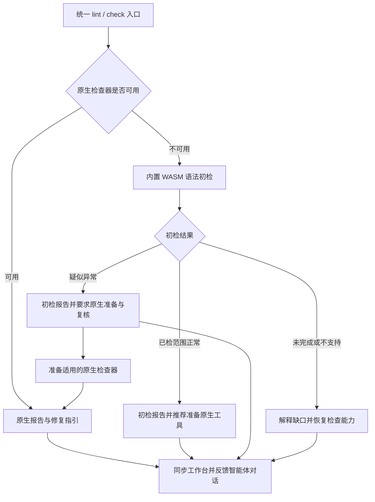

# Codeguard

[English](README.md) | [简体中文](README.zh-CN.md)

**用统一 Rust CLI 串起原生静态检查和可执行的修复流程。**

Codeguard 面向开发者与编程智能体，识别项目已有质量配置，调用选定的原生检查器，并将结果转成持久修复任务。Rust 负责调度和结果解释；Maven、P3C、Checkstyle、Javadoc、Ruff、Cargo、ESLint 等原生工具继续负责具体检查。

> **当前状态：**早期开发阶段，源码版本 `0.1.2`。部分原生检查和本地修复流程已在明确范围内实现。完整交付门禁、全部语言覆盖、任务自动关闭和宿主插件接入仍未完成。
>
> **基线：**可调用行为以当前源码和[实施证据](openspec/changes/introduce-rust-codeguard-cli/implementation-baseline.md)为准。声明 Rust 最低版本 `1.85`，edition `2024`，Cargo resolver `2`。`@partme.ai/codeguard@0.1.2` 已发布，当前仅支持 Apple Silicon macOS；不声称已有多平台二进制发行版或 crates.io 发布。

```text
项目文件 + 已有检查器配置
           |
           v
Codeguard：发现 -> 选择 -> 原生工具 -> 解释结果
           |                          |
           v                          v
      问题 / 环境阻塞            Human / JSON / SARIF*
           |
           v
      稳定任务 -> 智能体修复 -> 原工具复检

* 部分 check 输出路径支持 SARIF。
```

## 1. 用途与边界

- 识别语言、构建根、声明版本、检查配置和可静态观察的模块关系。
- 随原生适配器接入，统一编码规范、注释、依赖、漏洞、安全和构建检查。
- 解释缺配置和环境问题，避免将它们误报为源码违规。
- 通过可读或结构化输出，将发现和修复步骤返回调用者的对话界面。
- 保留稳定任务和失败尝试，停止重复执行无进展动作。
- 支持精确的误报处置。当前公开白名单命令用于查询或提案，不负责批准。

CLI 不内置大模型或向量数据库，也不使用 Rust 重写 P3C/Maven 检查。原生工具仍可能需要 JVM、Node.js、Python、Go 或 Rust 工具链。Python 参考夹具属于测试材料，不是第二套 Codeguard 运行内核。

## 2. 能力与成熟度

| 领域 | 当前实现 | 边界与证据 |
| :--- | :--- | :--- |
| 发现 / init | 多语言观察、Maven/Cargo 声明、画像、模块图、`AGENTS.md` 受管摘要 | 静态观察；无证据时架构保持未知。[测试](crates/codeguard-cli/tests/init_command_contract.rs) |
| Python | 感知配置的 Ruff lint、`D###` 文档诊断、标准 pylock 的 pip-audit 观察 | 范围和策略仍不完整；区分模拟与真实工具证据。[Ruff](tests/acceptance/python-lint-scan.md)、[CVE](tests/acceptance/python-cve-partial-native.md) |
| Rust | Clippy、Rustdoc、`cargo check`、cargo-audit，以及部分 `check all` 和修复接线 | 不代表全部 workspace/feature/target 组合。[Clippy](tests/acceptance/check-all-partial-native.md)、[Rustdoc](tests/acceptance/rustdoc-check-all.md)、[构建复检](tests/acceptance/rust-build-task-verification.md) |
| Java | Maven 配置发现；有限范围的 P3C、JDK Javadoc、Checkstyle、依赖和 OWASP 观察 | 工具与配置有明确边界。[P3C](tests/acceptance/java-p3c-cli-native-local.md)、[Javadoc](tests/acceptance/java-javadoc-cli-native-local.md)、[Checkstyle](tests/acceptance/java-checkstyle-cli-local.md) |
| JavaScript / TypeScript | `lint typescript` 调用 ESLint；`cve typescript` 和 `check all` 调用 npm audit | 需要显式 Node/工具/配置，不覆盖全部包管理器。[ESLint](tests/acceptance/eslint-public-lint-feedback.md)、[npm](tests/acceptance/npm-partial-native.md) |
| Go | 有限范围的原生 Go vet 观察 | 不是完整 Go 门禁。[证据](tests/acceptance/go-vet-json-local-probe.md) |
| 修复工作台 | 问题、任务投影、同步、next、租约、尝试及部分复检 | 正式关闭和重开待完成。[测试](crates/codeguard-cli/tests/task_verify_contract.rs) |
| 其它语言 | 能力登记和明确缺口 | 注册不等于可执行适配器。[能力表](docs/CAPABILITIES.md) |

六个类别是 `lint`、`comments`、`dependencies`、`cve`、`security`、`build`。注册表还定义了 28 个细分检测族，枚举不构成覆盖承诺，见[能力维度](crates/codeguard-core/src/capability_dimensions.rs)。

## 3. 架构与目录

| Crate | 职责 | 工作区依赖 |
| :--- | :--- | :--- |
| `codeguard-cli` | 二进制、参数、应用编排、工作区文件、反馈 | core、runtime、adapters |
| `codeguard-core` | 问题、完整性、义务、门禁计算、白名单匹配、就绪状态 | 无 |
| `codeguard-runtime` | 进程、快照、调度、取消、锁、制品基础能力 | core |
| `codeguard-adapters` | 原生命令契约、配置观察、报告解析 | core |

```text
codeguard/
├── Cargo.toml / Cargo.lock
├── crates/
│   ├── codeguard-cli/
│   ├── codeguard-core/
│   ├── codeguard-runtime/
│   └── codeguard-adapters/
├── rulepacks/          # 预览候选和历史清单
├── schemas/            # 版本化数据契约
├── npm/                # 精简的 Node 命令入口
├── scripts/            # 本地 npm 打包
├── docs/               # 架构、技术方案、生成能力表
└── tests/              # 验收记录和共享夹具
```

仓库名为 `codeguard`，二进制名为 `codeguard`，Cargo 包名为 `codeguard-cli`。受检项目生成的 `.codeguard/` 数据目录与此源码仓库是不同对象。

## 4. 构建与首次只读运行

使用支持 Rust edition 2024 的工具链。声明 MSRV `1.85` 不代表全部依赖和平台组合均在该版本实测。原生执行和本地协作使用 Unix 代码；已核对的运行证据来自 macOS ARM64，其它候选平台不是已认证支持矩阵。

```bash
git clone https://github.com/full-stack-plugins/codeguard.git
cd codeguard
cargo build --locked -p codeguard-cli
./target/debug/codeguard --version --format json
./target/debug/codeguard capabilities java --format json
./target/debug/codeguard detect . --format json
./target/debug/codeguard init . --dry-run --format json
```

版本输出包含 `cli_version`、`target` 和协议信息。发现与 init 预览返回观察及未知项。Dry-run 不创建 `AGENTS.md` 或项目数据目录。仅在依赖已缓存时为 Cargo 添加 `--offline`。

工作区要求 `std`。可选 `wasm-precheck` 构建特性已用固定的 Java/TypeScript grammar 候选资产与有界 Rust worker，为缺少显式原生上下文的 `lint java`、`lint typescript` 单文件请求提供疑似语法观察；公开 npm `0.1.2` 不含该路径。不声称 `no_std`、已完成项目级 WASM 兜底、零 unsafe 或性能最快。运行层系统调用需要安全审查，当前不宣称已完成整体安全审计。

### npm 安装与一次性调用

已在 Apple Silicon macOS 上通过全新 npm 缓存验证公开 `0.1.2` 包：

```bash
npx --yes @partme.ai/codeguard@0.1.2 --version --format json
```

检查项目时，可将包名后的参数换成需要执行的 Codeguard 指令。当前公开包仅支持 macOS arm64。

Node 入口调用同一个 Rust 可执行文件。在本仓库构建当前平台的二进制，并生成不带 npm 安装脚本的本地包：

```bash
cargo build --release --locked -p codeguard-cli
CODEGUARD_TARBALL="$(node scripts/pack-npm-local.mjs)"
npm install -g "$CODEGUARD_TARBALL" --ignore-scripts
codeguard --version --format json
```

只在当前 Node 会话中调用，无需全局安装：

```bash
npm exec --yes --package "$CODEGUARD_TARBALL" -- codeguard detect . --format json
```

打包器在已有匹配原生程序时支持 macOS 与 Linux 的 x64/arm64 平台。打包需要 Node 18+、npm 和预先构建的本机 Rust 二进制；打包前核对二进制报告的平台和版本，在已忽略的 `release/npm/` 写入带平台标识的 tarball。默认包标记为 private，仅用于本地分发。`node scripts/pack-npm-local.mjs --public` 准备带说明、完整许可证与平台限制的公开 `@partme.ai/codeguard` 包。`0.1.2` 已发布；其公开包在 Apple Silicon macOS 上通过全新缓存 `npx` 执行和制品摘要核对。二进制回报的候选源码提交不等于签名或可复现构建证明。其它平台仍需各自验收的二进制包。见[发行技术方案](docs/Codeguard-Technical-Design.zh_CN.md)及[0.1.2 验收记录](tests/acceptance/npm-0.1.2-candidate.md)。

## 5. 修复流程

将构建出的二进制加入 `PATH`，使 `codeguard` 可用，或使用其绝对路径。在受检项目中执行：

```bash
codeguard init . --dry-run --format json
codeguard init . --apply --format json
codeguard check all . --format json
codeguard work sync . --format json
codeguard next . --format json
codeguard status . --format json
```

当前 `init --apply` 即使创建了文件，也返回退出码 `3` 和部分完成状态。`check all` 同样保持未完成，应读取其发现与下一步。不能将退出码 `3` 转换为 CI 成功。已接入检查会在初始化工作区自动保存与同步；显式 `work sync` 用于恢复。

将 `TASK_ID` 设置为 `next` 返回的真实任务 ID，查看任务并在修复后复检：

```bash
codeguard task show "$TASK_ID" . --format json
codeguard task verify "$TASK_ID" . --format json
```

为 `task verify` 提供原检查器要求的工具与配置参数。缺工具需要修复环境。部分复检已经识别原生抑制或配置变化；零诊断本身不会关闭任务。

## 6. 命令导览

`codeguard --help` 提供当前语法。精确范围以源码和验收记录为准，少数帮助说明仍较保守。

| 命令族 | 价值 | 当前边界 |
| :--- | :--- | :--- |
| `--version`、`capabilities`、`detect` | 查询二进制、清单、项目观察 | 当前源码的 `detect` 0.4.0 输出本地 ESLint/Maven Wrapper 候选，不执行或批准工具 |
| `init --dry-run / --apply` | 预览、创建、刷新工作台 | 不隐式安装、构建、接管 Hook 或认证架构 |
| `config validate / explain`、`rules list` | 查看配置和规则来源 | 候选不构成策略批准 |
| `tools list / verify`、`doctor` | 查看工具和有限环境探测 | 显式 Ruff doctor 探测；`tools install --apply` 受阻 |
| `plan CATEGORY LANGUAGE` | 预览选择和缺口 | 不是已认证执行计划 |
| `hook execute` | 启动只读发现、Stop 有界下一步、按任务原工具复检、Python 编辑局部反馈及显式 Git 工具的提交面安全预览 | 必须给超时；复检不自动关闭任务，推送/CI 仍未接线，不构成宿主交付门禁 |
| `hook claude <session-start\|post-tool-use\|post-tool-use-failure\|stop>` | 将 Claude Code 生命周期事件映射为只读发现、局部编辑反馈、失败不检查或本地下一步指引 | 候选软 Hook；Stop 最多引导一次继续；尚无插件二进制绑定或交付门禁 |
| `lint python / java / typescript / go` | 执行已接入原生检查 | 参数和范围因适配器而异 |
| `comments rust`、`build rust` | 文档与类型检查 | build 不运行项目测试 |
| `cve rust / python / typescript` | 原生漏洞公告观察 | 漏洞库身份、时效及完整覆盖仍有限 |
| `check all / java` | 汇总已接入检查与修复反馈 | 交付仍为 `not_evaluated` |
| `work sync`、`status`、`next`、`task show` | 持久化及查看修复工作 | 任务文件不是门禁 |
| `task claim / heartbeat / release`、`task attempt start / finish` | 本地占用与尝试历史 | Unix 本地协作，不保证分布式锁 |
| `task verify` | 重跑部分原检查器 | 正式关闭与重开待完成 |
| `rules whitelist list / explain / propose` | 查询或提出误报处置与纠错 | 无公开批准或生效入口 |
| `gate pre-commit` | Git index 路径、对象及未加密 OpenSSH Ed25519 私钥局部观察 | 仍是不完整预览，尚非完整内容或安全门禁 |

Python 编辑快反馈可执行 `codeguard lint python . --file src/changed.py --format json`；`--file` 可重复，最多 8 个不同路径，单路径 512 字节、总计 2 KiB。报告标明 `scan_scope=selected_files`，只观察选中文件；局部反馈不导入完整工作台，也不代表全项目或交付通过。原有不带 `--file` 的命令仍扫描发现到的 Python 文件并同步局部报告。

通用 `dependencies`、通用 `security`、任意类别/语言组合、`fix`、`gate pre-push`、`gate ci`、`mcp serve` 和旧协议兼容调度均属目标设计，在本基线中不能作为已实现命令调用。

### 原生优先的统一入口与语法兜底——设计目标

**公开 `0.1.2` 尚未实现内置 WASM 兜底或自动对话交付。** 保留已有命令作为统一入口；当前仍须满足各原生适配器的参数和前置条件：

可选源码构建的单文件候选路径已存在：`codeguard lint java Foo.java` 与 `codeguard lint typescript foo.ts` 在完全缺少显式原生上下文时分别输出 [Java](schemas/java-syntax-precheck-feedback-v0.1.schema.json) 与 [TypeScript](schemas/eslint-local-feedback-v0.3.schema.json) 的版本化初检反馈。疑似恢复位置仍需原生确认；无恢复节点也因 grammar 版本/方言未验收保持 incomplete。默认及公开二进制沿用既有原生上下文路径，见 [Java 局部验收](tests/acceptance/java-syntax-fallback-candidate.md) 与 [TypeScript 局部验收](tests/acceptance/typescript-syntax-fallback-candidate.md)。

```bash
codeguard lint java .
codeguard lint typescript .
codeguard check all .
```

目标行为按模块/语言/配置选择路径，因此同一仓库中可用的前端检查器和缺 JDK 的 Java 模块可以分别处理：



项目已有的必需原生检查，不因初检正常变成可选。原生失败/违规不能被兜底抹除。工具已安装但配置损坏时，应修复配置。解析器疑似问题要求原生确认，不直接自动修改源码；仅安装成功不能关闭任务。WASM 语法结果不覆盖类型、规范、Javadoc、CVE 和安全。详见[架构设计](docs/Codeguard-Architecture.zh_CN.md)第 8 节及[技术方案](docs/Codeguard-Technical-Design.zh_CN.md)第 5.3–5.4 节。

## 7. 配置与原生工具

原生配置控制原生规则选择。静态发现反馈 `configured`、`missing`、`invalid`、`unknown`，不会执行 wrapper 或 JavaScript 配置来猜测有效构建模型。

可选的 `.codeguard/runtime.json` 只控制运行调度：

```json
{
  "schema_version": "1.1",
  "document_type": "codeguard_runtime_options",
  "timeout": "30m",
  "jobs": 4
}
```

`check` 优先级：CLI → `CODEGUARD_TIMEOUT` / `CODEGUARD_JOBS` → 项目配置 → 默认值。默认超时 30 分钟，并发为可用 CPU 并行度且最多四个；有效范围为 1 ms–24 小时、1–64 个任务。当前硬截止时间覆盖原生执行，不覆盖全部发现或持久化。运行选项不能禁用规则或批准例外，见 [schema](schemas/runtime-options-1.1.schema.json) 与[选择代码](crates/codeguard-cli/src/check_budget.rs)。

适配器使用选定的可执行文件和配置，不接受任意命令字符串。参数包括 `--ruff-tool`、`--cargo-tool`、`--go-tool`、`--java-home`、显式 Maven 仓库及 Node/工具入口。先准备工具，Codeguard 不静默安装；外部检查器保留各自运行时。

## 8. 结果、退出码与误报

| 退出码 | 结果契约含义 |
| :--- | :--- |
| `0` | 查询/操作成功，或在已接入路径上得到有充分依据的非阻断结果；不自动代表交付许可 |
| `1` | 完整评估的义务集合中存在违规 |
| `2` | 命令或参数无效、不支持 |
| `3` | 配置、执行、覆盖或策略上下文未完成 |
| `4` | 内部错误 |
| `130` | 取消 |

这是[核心语义](crates/codeguard-core/src/verdict.rs)，不代表局部扫描可以产生全部结论。发现与完整性独立：超时仍可保留有效发现；缺 JDK 是环境阻塞；坏报告不能制造违规。Human/JSON 是主要输出，部分 `check` 路径支持 SARIF。

误报处理保留原生发现，以精确检查器、规则、目标和证据身份匹配处置。过期、撤销及输入变化需要重评。公开提案与纠错命令仍是局部流程，在项目文件中写入 `approved: true` 不会使例外生效，见[技术方案](docs/Codeguard-Technical-Design.zh_CN.md)。

### 对话报告示例——目标呈现

以下是报告呈现设计，不是当前 CLI 运行记录；路径/任务 ID 为合成示例，也不声称运行时已有英文国际化。真实消息必须使用实际范围、诊断和持久化任务 ID。

```text
Codeguard：Java 语法初检发现 1 处疑似异常

检查方式：内置 Tree-sitter WASM
检查范围：选中并检查 18 个 Java 文件；未解析 0 个
原生检查：未执行，项目要求的 JDK 不可用
位置：src/main/java/example/UserService.java:42
观察：解析器在此处恢复了一个缺失语法节点

下一步（必须）：
1. 准备项目声明版本的 JDK 和适用的原生检查器。
2. 执行覆盖此文件及 Java 语法的原生复核。
3. 根据原生诊断修复，再次检查。

关联任务：CG-example-java-setup（示意；仅同步成功后输出）
复检入口（准备原项目工具/配置上下文后）：
codeguard task verify CG-example-java-setup . --format json
这尚未确认为代码违规，交付未评估。
```

初检正常且没有既有必需原生义务时，反馈应更简短：

```text
Codeguard：已检查的 18 个 Java 文件未观察到语法异常
检查方式：内置 Tree-sitter WASM；选中的 18 个文件均已检查。
原生 lint：未执行。推荐配置并准备适用的原生检查器。
未覆盖：类型、项目规范和依赖安全。
这是语法观察，不是完整 lint 或交付通过结论。
```

超时应写“18 个文件已检查 17 个，初检未完成”，列出未解析文件并提供环境/解析恢复动作，不写“全部通过”或“源码错误”。原生发现应列明实际检查器/规则/位置及原工具复检步骤。不能仅凭恢复节点猜测缺失 token 或承诺特定修复。

插件须经宿主的工具结果/上下文 API 交付有界简报；CLI JSON 与文件本身不等于自动注入对话。反馈首次结果及有意义的变化，复用稳定任务，不反复发送未变化的安装要求。[技术方案](docs/Codeguard-Technical-Design.zh_CN.md)第 7.3–7.4 节提供四类完整示例、拟议 JSON 及审查规则；它们尚不是新的受支持报告 schema。

## 9. 数据、安全与恢复

```text
.codeguard/                       # 位于受检项目内部
├── .gitignore / README.md / workspace.json
├── project.json / module-graph.json / architecture.md
├── findings/                     # 脱敏事实与事件
├── tasks/                        # 可读修复投影
├── decisions/                    # 目标为决策引用
├── reports/                      # 默认忽略
├── runs/                         # 默认忽略
├── cache/                        # 默认忽略
├── worktrees/                    # 默认忽略
└── state/                        # 默认忽略
```

既有的 `codeguard/src` 仍是用户源码，继续参与检查。若发现旧 `codeguard/workspace.json`，Codeguard 会报告迁移冲突；旧目录可能同时含用户代码，不能自动整体移动。忽略规则不是保密边界：不要在记录中提交秘密，或分享原始日志。升级前保留工作区；同步失败可重试 `work sync`，输入变化需要重扫。

进程组、受限环境、快照和输出上限是已有基础能力，不等于完整操作系统沙箱。原生构建可能执行项目插件、脚本和扩展，见[架构文档](docs/Codeguard-Architecture.zh_CN.md)。

## 10. 开发与验证

```bash
cargo fmt --all --check
cargo clippy --workspace --all-targets --locked -- -D warnings
cargo test --workspace --locked
cargo run --locked -p codeguard-cli --example gen_capability_docs -- --check
```

2026-09-28 的本地源码基线通过 163 组测试：990 项通过、0 项失败、101 项忽略；格式与 Clippy 也通过。忽略不算通过。这是有日期的本地基线，不是远程 CI、跨平台验收、误报率评测或全部原生工具覆盖。

原生语料示例需要已准备的工具。替换以下示例路径：

```bash
cargo run --locked -p codeguard-cli --example validate_corpus -- \
  --verify-ruff /path/to/ruff --verify-maven /path/to/mvn
```

启用 ignored 原生测试前，阅读相应[验收记录](tests/acceptance)。区分解析夹具、模拟进程、真实原生工具与宿主接入证据。

## 11. 故障排查

| 现象 | 下一步 |
| :--- | :--- |
| `init --apply` 退出 `3` | 查看文件和部分完成状态，完整就绪待实现 |
| 同时有问题与未完成 | 处理已确认问题和列出的阻塞 |
| 零发现但仍未完成 | 检查配置、范围、工具、策略及漏洞库状态 |
| `AGENTS.md` 受管冲突 | 保留人工改动，协调标记区块 |
| 同一任务再次出现 | 阅读当前证据，勾选不会关闭任务 |
| `needs_decision` | 查看尝试历史，调整修复方式或请求具体决策 |
| 已登记语言不能运行 | 查看适配缺口，登记不等于实现 |
| Cargo 离线构建失败 | 准备依赖缓存或移除 `--offline` |

## 12. 文档、贡献与许可证

完整[文档导航](docs/README.zh_CN.md)集中维护架构、技术方案及八个专题的职责和状态。逐命令参数与目标契约见[命令参考](docs/Codeguard-Command-Reference.zh_CN.md)；历史插件行为见[兼容专题](docs/Codeguard-Legacy-Compatibility.zh_CN.md)，不能用于判断当前 Rust 功能。

| 文档 | English | 简体中文 |
| :--- | :--- | :--- |
| 架构 | [Architecture](docs/Codeguard-Architecture.md) | [架构设计](docs/Codeguard-Architecture.zh_CN.md) |
| 技术方案 | [Design and roadmap](docs/Codeguard-Technical-Design.md) | [技术方案与路线](docs/Codeguard-Technical-Design.zh_CN.md) |
| 能力 | [生成能力表](docs/CAPABILITIES.md) | 共享 ID 与状态 |
| 证据 | [验收记录](tests/acceptance) | 每项注明范围与日期 |

既有 [OpenSpec 规范与任务](openspec/changes/introduce-rust-codeguard-cli/proposal.md) 已整体迁入本 Rust 仓，是唯一规格与任务事实源。已实现切片和剩余工作分别记录，本文不维护第二份可独立勾选的任务。

贡献应保持原生规则语义、补齐正反例、区分环境失败与发现，并同步双语文档和受影响 schema。非敏感缺陷可提交 [GitHub Issues](https://github.com/full-stack-plugins/codeguard/issues)。专门的安全披露政策尚未建立。

Cargo 声明 `Apache-2.0`；当前工作树已有仓库级 `LICENSE` 与 `NOTICE`，公开 npm 包也包含两者。不提供未经核实的 crates.io 或 CI 徽章。
