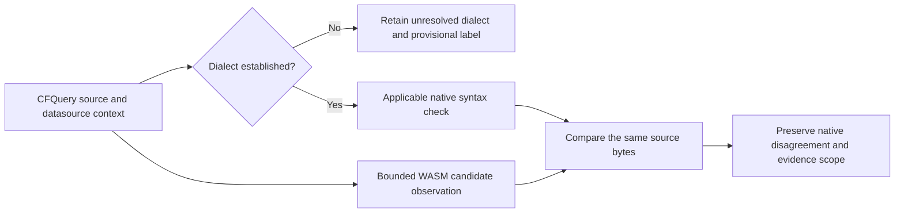

# CFQuery SQL dialect evidence

A grammar's zero recovery count is not a SQL semantic verdict. PostgreSQL permits `SELECT FROM users` with an empty output list, while `SELECT DISTINCT FROM users` is a syntax error. The [official SELECT reference](https://www.postgresql.org/docs/18/sql-select.html#SQL-SELECT-COMPATIBILITY) documents this distinction.

An isolated, already cached PostgreSQL 18.6 fixture confirms both outcomes using PREPARE without executing the SELECT queries. The pinned CFQuery WASM reports no recovery nodes for either source. The second sample is therefore a real disagreement for this database dialect; the first cannot be universally described as invalid SQL.

This diagram describes the required project integration. Current delivery contains the isolated development oracle, regression tests, and candidate probes; it does not add a project SQL checker. The existing generic case remains pending, frozen corpora and historical metrics are preserved, and neither grammar qualification nor a whitelist is approved. The two targeted samples are not independent holdout or language accuracy acceptance.

The [acceptance record](../tests/acceptance/cfquery-postgres-dialect.md) identifies the immutable image, version, source fingerprints, runtime-controlled process boundaries, offline/no-network fixture, and cleanup. Future integration must establish datasource dialect/version and retain dynamic-template and schema uncertainty before classifying project code.
