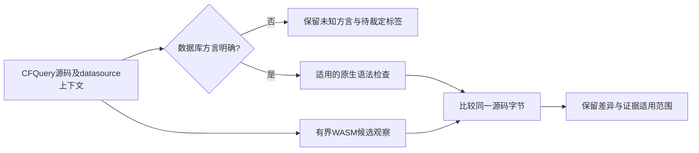

# CFQuery SQL 方言证据

零恢复节点不等于完整SQL语法或语义正确。PostgreSQL允许空输出列表的`SELECT FROM users`，却拒绝`SELECT DISTINCT FROM users`；[官方SELECT说明](https://www.postgresql.org/docs/18/sql-select.html#SQL-SELECT-COMPATIBILITY)明确区分两者。

本机已有PostgreSQL18.6固定镜像在无网络、无持久存储的隔离夹具中，通过PREPARE确认上述结果，不执行待检SELECT。固定CFQuery WASM对两份同字节输入都报告零恢复。因此第二份是有明确方言的真实漏检，第一份不能被一概认为是非法SQL。

图中表达项目接入要求。当前交付是隔离原生对照、回归契约和候选观察，尚未新增项目SQL检查器。原无方言样例保持pending，冻结语料和历史指标保留，不批准grammar资格、白名单或关闭任务。这两个有目的样例不是独立holdout，也不是语言精度验收。

[验收记录](../tests/acceptance/cfquery-postgres-dialect.md)给出镜像、版本、源码摘要、Rust受控进程、禁止拉取/网络及清理证据。后续项目接入须先确认datasource方言和版本，保留动态模板及schema依赖的不确定性。
