# Codeguard Architecture

> **Purpose:** explain system ownership, component contracts, repair flow, and the gap between current implementation and target behavior.
>
> **Document version:** 1.2.4 · **Updated:** 2026-10-04 · **Source baseline:** current checkout and the [implementation evidence](../openspec/changes/introduce-rust-codeguard-cli/implementation-baseline.md); software version `0.1.4`.

[简体中文](Codeguard-Architecture.zh_CN.md) · [README](../README.md) · [Technical design](Codeguard-Technical-Design.md)

Topic owners: [commands](Codeguard-Command-Reference.md), [initialization](Codeguard-Project-Initialization.md), [remediation](Codeguard-Remediation-Workflow.md), [false positives](Codeguard-False-Positive-Governance.md), [adapters](Codeguard-Adapter-Contracts.md), [trust/distribution](Codeguard-Trust-and-Distribution.md), [acceptance](Codeguard-Validation-and-Rollout.md) and [legacy compatibility](Codeguard-Legacy-Compatibility.md). Detailed contracts live in these guides; OpenSpec owns requirements and tasks.

The source build wires ESLint into the `node.lint` task in `check all`, sharing native concurrency and the request deadline. Discovered JS/TS/TSX files select their nearest module manifest, local ESLint 10, unique flat config and Node without searching above the selected root. Execution collects reports; aggregation synchronizes the workbench serially and reuses stable tasks. Only completed native results for identical source bytes suppress duplicate WASM; ignored files, configuration errors and tool failures retain both their reasons and fallback. Protocols are current aggregate `check_feedback` 0.38.0 for both bound and unbound checks and `check_aborted` 0.13.0, with older schemas archived. `native_results.node_lint` carries per-file feedback, unexecuted paths, synchronization status and next action. See [acceptance scope](../tests/acceptance/check-all-eslint.md). This does not qualify grammars or replace real host acceptance.


The source-built Erlang slice now applies native-first selection through `lint erlang FILE --erl-tool ABS_PATH`: fixed OTP 28 scanner/parser calls operate on stdin bytes, with a non-project cwd and project startup disabled. Native diagnostics take precedence; preprocessing/macro coverage remains unresolved. Without an explicit tool, `lint erlang` searches absolute PATH directories once and records the selected canonical executable in 0.2 feedback. Only absence of an executable enables the pinned WASM candidate; a selected tool failure remains unresolved. No task closure, complete project lint or release qualification follows from this local result; see [acceptance](../tests/acceptance/erlang-native-first.md).

The source configuration entry now reuses the discovery service through a bounded projection instead of inspecting only legacy files. `config validate/explain` 0.3 keeps checker declaration states and source hashes separate from effective rules, suppressions and approval. Human feedback identifies the source, reason and next action. This does not execute a checker or change project state; truncation remains incomplete. [Evidence and limits](../tests/acceptance/config-native-observation.md).

## 1. Reading contract and evidence

This is the architecture of the Rust **Codeguard CLI repository**, not the implementation manual for the existing Python host plugin. It addresses adapter authors, CLI/runtime maintainers, agent integrators, and reviewers.

- **Implemented building block:** code and a bounded testable contract exist; this does not imply an end-to-end product feature.
- **Partial workflow:** a callable path exists with explicit scope and unresolved requirements.
- **Target:** agreed architectural intent whose complete integration or acceptance remains pending.
- **Unknown:** no sufficient observation; never replace this with an optimistic assumption.

The existing [OpenSpec change](../openspec/changes/introduce-rust-codeguard-cli/proposal.md) now lives in this Rust repository and is the sole specification and task authority. Implemented slices and remaining work are tracked separately; these documents do not maintain a second task ledger.

| Evidence | What it establishes |
| :--- | :--- |
| [Workspace manifest](../Cargo.toml) and each crate manifest | Names, dependency direction, version/toolchain declarations |
| [CLI dispatch](../crates/codeguard-cli/src/main.rs) | Callable command branches and platform guards |
| [Full-check orchestration](../crates/codeguard-cli/src/check_command.rs) | Current aggregation, native scheduling, and sync integrations |
| [Initialization](../crates/codeguard-cli/src/init_command.rs), [contract tests](../crates/codeguard-cli/tests/init_command_contract.rs) | Actual workspace artifacts and refresh behavior |
| [Core aggregation](../crates/codeguard-core/src/aggregate.rs), [delivery gate](../crates/codeguard-core/src/delivery_gate.rs) | Pure result semantics, not trusted public gate availability |
| [Acceptance records](../tests/acceptance) | Scoped observations, test method, and residual gaps |

WASM requirements and 19 implementation tasks are recorded in the existing change. An opt-in Rust worker and narrow Java/TypeScript/TSX single-file feedback paths and a Python Ruff-unavailable candidate path now exist. All thirty-two candidate grammars remain unqualified; ArkTS, C, C++, C#, Go, JavaScript, Lua, Luau, Nix, Rust, Terraform, Zig, Objective-C, Solidity, R, Ruby, PHP, Kotlin, Dart, Erlang, Pascal, CFML, CFQuery, CFScript, COBOL, Scala, Swift and VB.NET are pinned Rust-loadable candidates without language-qualified lint routes. Project-wide native-first routing, qualified grammar ranges, capability-matched task closure, and host integrations remain incomplete; design examples are not current command output.

A source build with `--features wasm-precheck` now exposes `codeguard grammar probe <language> <file> --format=json` for all 32 pinned candidates. It uses the isolated Rust worker and reports unqualified observations with exit 3, not a lint or delivery verdict. Successful observations and input failures for a valid language share the [closed 0.1.0 JSON schema](../schemas/grammar-probe-v0.1.schema.json) and remain incomplete. Native-first `lint/check`, language/dialect acceptance, task/host feedback and distribution remain separate open work; current discovery also groups JavaScript/TSX under TypeScript and has no separate CFQuery/CFScript source mapping.

The source-built `check all` now runs a bounded candidate pass after its existing native checks. A separate [grammar router](../crates/codeguard-cli/src/grammar_route.rs) distinguishes `.tsx`, JavaScript, and `.cfs`; complete `<cfquery>...</cfquery>` bodies are parsed with CFQuery, while ordinary `.sql` and ambiguous `.h` are not guessed. Shared `.m` requires an Objective-C line marker, and `.sc` is not guessed as Scala without project evidence; see the [ambiguity regression](../tests/acceptance/ambiguous-grammar-extensions.md). Four bounded real CLI fixtures collectively invoked all 32 pinned workers. [Check feedback 0.38.0](../schemas/check-feedback-v0.38.schema.json) records selected dialect, source/grammar digests, file-relative recovery positions, bounded known limitations, skipped work and incomplete status; Python files with completed, source-matched Ruff scans skip duplicate WASM; style-only P3C does not confirm syntax. Candidate observations never become confirmed violations or delivery permission. The pass has a 64-file/64-fragment/90-second cap and was about 54 seconds for four bounded fixtures on this Mac; the prior sequential implementation observed 26/32 in one 31-file Linux run before its 90-second cap. It is a partial candidate route with task projection; language qualification and actual-host integration remain open; npm 0.1.3 distributes it as an unqualified candidate. See [acceptance evidence](../tests/acceptance/check-all-32-grammar-candidates.md).

The source-built candidate scheduler now prepares bounded fragments in stable path order and runs up to `min(--jobs, 2)` isolated workers concurrently. It emits observations in that same order and rereads each source before accepting a worker result. A local 31-file, one-project fixture observed all 32 candidates within the unchanged 90-second pass; the Linux WASM integration step for source commit `ff60184` passed the same one-project test; the complete CI run passed. This changes candidate throughput, not its authority.

The [Java 17 native differential](../tests/acceptance/java-native-differential.md) adds a 13-case javac 21 oracle for one grammar. It is local precision evidence only; Java remains an unqualified candidate.

The [Kotlin native differential](../tests/acceptance/kotlin-native-differential.md) now records 11 decidable agreements and two unresolved hidden-error cases, one native-invalid and one native-valid. Swift similarly has 12 decidable agreements and one unresolved case. Incomplete scans cannot become valid/invalid labels merely because their recovery arrays are empty; unknown coverage is reported separately and both grammars remain unqualified.

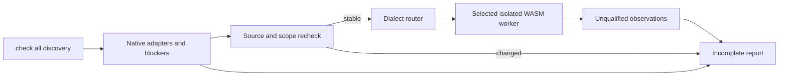

A first narrow native-first route is now available for Zig: `lint zig FILE --zig-tool ABS_PATH --format=json` runs a Zig 0.16.0 `ast-check` executable with stable bytes on the selected source bytes before considering WASM. Native AST positions remain visible without source snippets; when no explicit tool is supplied, the pinned Zig grammar remains an unqualified fallback. Both outcomes stay incomplete because AST checking is narrower than full lint, build and tests. See the [0.1.0 feedback schema](../schemas/zig-lint-feedback-v0.1.schema.json).

## 2. Architectural drivers

The product exists because generic output matching and ambiguous failures produce false positives, while repeated errors encourage agents to suppress checks instead of fixing code.

| Driver | Architectural response | Acceptance intent |
| :--- | :--- | :--- |
| Preserve native rule meaning | Adapter-specific command/report contracts | Environment failures never become invented source violations |
| Low false positives | Configuration-aware scope, explicit unknowns, exact exceptions | Unsupported configuration remains unresolved; valid findings retain origin |
| Actionable repair | Stable facts, repair brief, attempt history, original-tool recheck | A finding yields an appropriate next action rather than repeated raw logs |
| Multi-language consistency | Six categories and versioned report semantics | Every advertised language/category has its own tested evidence |
| Predictable execution | Bounded processes, resource-aware scheduling, cancellation | Failure cannot silently erase other completed observations |
| Minimal onboarding | Discover existing configuration first | Initialization does not execute project scripts or fabricate architecture |

Rust is the orchestration language, selected for a deployable binary and explicit state/resource handling. No comparative performance result is available. Native analyzer runtime and database costs can dominate total scan time.

## 3. Scope and system context

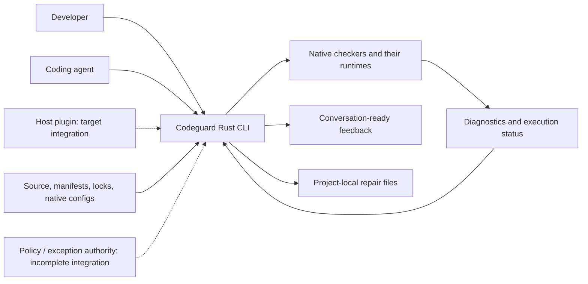

Codeguard owns discovery, command selection, bounded invocation, interpretation, result presentation, and local repair coordination. Native tools own language semantics, rule execution, dependency resolution, and advisory lookup within their contracts. The agent owns proposed code/environment changes. A policy authority must own exception approval; writing a local proposal is not approval.

The CLI does not own a model provider, chat transport, IDE UI, RAG store, distributed scheduler, or SaaS tenant database. Plugins and skills remain separate integration/distribution layers. Their automatic check → sync → brief behavior is a target integration, not established by this repository's CLI tests.

## 4. Current state and target state

| Capability | Current state | Target / remaining work |
| :--- | :--- | :--- |
| Native checks | Partial Python, Rust, Java, Node and Go paths | Complete supported scopes and language/category matrix |
| Discovery | Static configuration and manifest observations | Effective models under explicit controlled resolution |
| Project architecture | Unknown plus static module declarations | Evidence-labelled observed/inferred/confirmed views and conflicts |
| Repair | Stable tasks, local attempts, selected native rechecks | Reliable verified closure, recurrence, and full event reconciliation |
| False-positive exceptions | Candidate inspection/proposals, exact matching and signature-related building blocks | Trusted approval source, lifecycle integration, and usable activation |
| Quality gates | Core algebra; public scans remain partial; index path safety | End-to-end checks against actual worktree/index/ref/CI content |
| Distribution | Source build and npm 0.1.3 for Apple Silicon macOS; artifact verification/download/install primitives | Supported binary releases, platform tests and host runtime bindings |

Current `check all` includes Rust build scheduling and persistence; [build recheck](../tests/acceptance/rust-build-task-verification.md) is also present. Older notes saying these integrations are wholly absent must not be used as the current status. Complete build combinations and formal closure remain missing.

## 5. Components and dependency direction

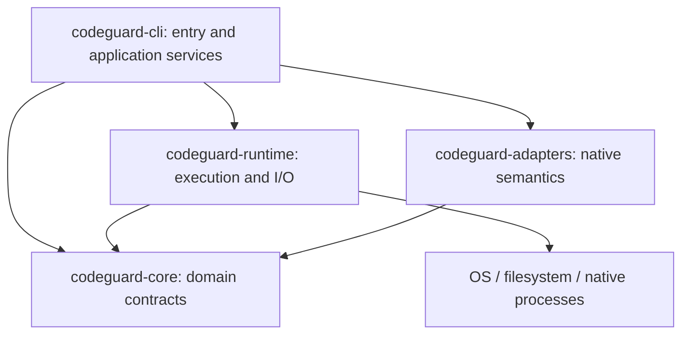

| Component | Input → output | State / failure responsibility |
| :--- | :--- | :--- |
| CLI | Arguments/configuration → selected operation and feedback | Owns workspace orchestration, command-specific errors, protocol projection |
| Core | Typed observations and scope → deterministic evaluation | No native process or filesystem access; does not establish trust from a boolean by itself |
| Runtime | Literal process specification / snapshot request → bounded observation | Process lifecycle, bytes, locks, resource cleanup, explicit I/O failures |
| Adapters | Native configuration/output → checker-specific observations | Rule identity, scope and exit/report coherence; unknown protocols remain unresolved |

The four crates are real compile-time boundaries. Application services currently live in `codeguard-cli`, including substantial scan/persistence logic. There is no separate application crate or universal runtime-loaded adapter ABI. Future extraction should follow cohesive responsibilities, not add empty crates to match a diagram.

### 5.1 Application services and extension boundaries

Discovery/Plan/Check/Work/Fix/Gate services in the earlier design are logical responsibilities, not a claim that corresponding public traits or separate crates exist. Argument parsing and application services currently live in the CLI. Scoped threads and bounded processes must not be described as an already implemented clap/Tokio scheduler. An adapter must declare configuration discovery, input scope, native report semantics and recheck capability; registering a language name is insufficient.

Project build scripts and checked code are untrusted inputs. The full CI gate is intended to isolate the validator, policy source and final credentials from project processes. Current local process controls and offline options do not establish network isolation or protection from a malicious process under the same user. See [trust and distribution](Codeguard-Trust-and-Distribution.md) for the detailed boundary.

## 6. Domain model and result semantics

| Concept | Meaning | Important distinction |
| :--- | :--- | :--- |
| Configuration observation | `configured / missing / invalid / unknown` | Declaration is not effective-model resolution or execution |
| Check obligation | Selected checker/category/target/rule scope | A planned inventory row is not an executed obligation |
| Finding | Native rule, tool, location, severity, identity | Native severity and policy gate impact are separate |
| Completion | `complete / incomplete / not_applicable` | Independent of finding count |
| Blocker | Environment, configuration, scope, or evidence issue | Not a source-code violation |
| Repair task | Actionable projection of a persistent problem | Checking a Markdown box is not resolution |
| Disposition | Exact false-positive or exception decision | Does not delete the raw finding or rewrite tool output |

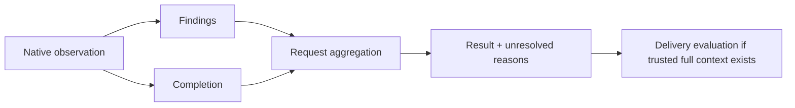

Core aggregation priority is cancellation → internal error → incomplete → violations → not applicable/passed. It retains findings from partial runs. The core delivery calculator separately checks scope, obligations, coverage and exception bindings. It can model `allow`, `allow_with_exceptions`, `deny`, `incomplete`, `not_applicable`, and `not_evaluated`; current public partial checks do not supply the complete trusted context needed to claim delivery success.

The user-facing contract is practical: show what is configured, what was found, what failed to run or resolve, and what to do next. Internal identity checks prevent stale or mismatched observations; they should not turn ordinary usage into a separate exercise in manually proving execution.

## 7. Initialization and project knowledge

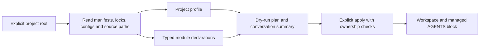

`init` defaults to dry-run. Static observation does not execute wrapper scripts, Maven extensions, JavaScript configs, or service startup. Declared package versions, language targets, resolved dependency versions, and installed runtimes are distinct; unknown values stay unknown.

Maven and Cargo support selected direct module/dependency declarations. Aggregation, containment and build dependency are distinct edges. Variables, inherited models, optional/target conditions, missing targets and ambiguous identities are unresolved. An incomplete graph cannot justify a narrower scan or prove independence.

`AGENTS.md` contains bounded summaries of languages, roots, versions, checkers and graph observations, with links and content digests. Human text outside the managed markers is retained. Duplicate/missing markers, modified managed content and detected concurrent edits produce conflicts. Current write checks do not establish perfect exclusion against an uncooperative external editor. Source strings are escaped as data; unknown MVC/DDD architecture does not activate a blocking rule.

## 8. Scan, feedback, and repair flow

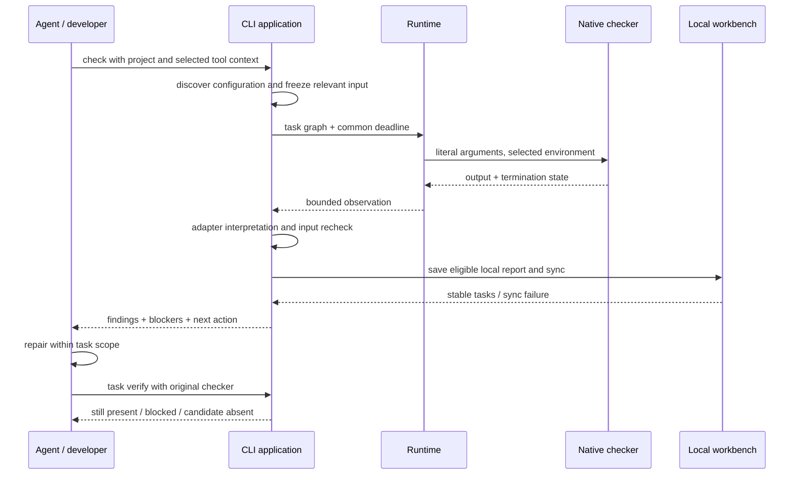

Local saving and sync are implemented for selected paths. Uninitialized projects can still receive feedback; they do not silently receive a persistent workbench. A sync error must remain visible without erasing native findings. Malformed or stale reports cannot close unrelated tasks.

The desired complete loop is:

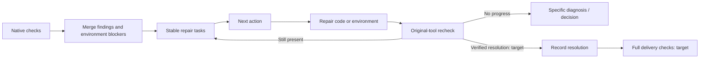

The final two nodes are target behavior. Current candidate-absent observations do not automatically close tasks. Each task should carry evidence, rule basis, allowed scope, repair steps, recheck command, attempt history, and closure conditions.

### 8.1 Native-first routing with bundled WASM precheck — target

**Target contract, partly implemented in the published `0.1.3` candidate package.** Keep a single entry point; callers select a language or project, not a parser backend:

```bash
codeguard lint java .
codeguard lint typescript .
codeguard check all .
```

These entry points already exist with bounded native adapters and adapter-specific prerequisites. Automatic fallback described below is new target behavior. Resolve checker availability per module, language/version, dialect and effective configuration. An ESLint-ready frontend and a Java module missing its JDK take different paths in the same run.

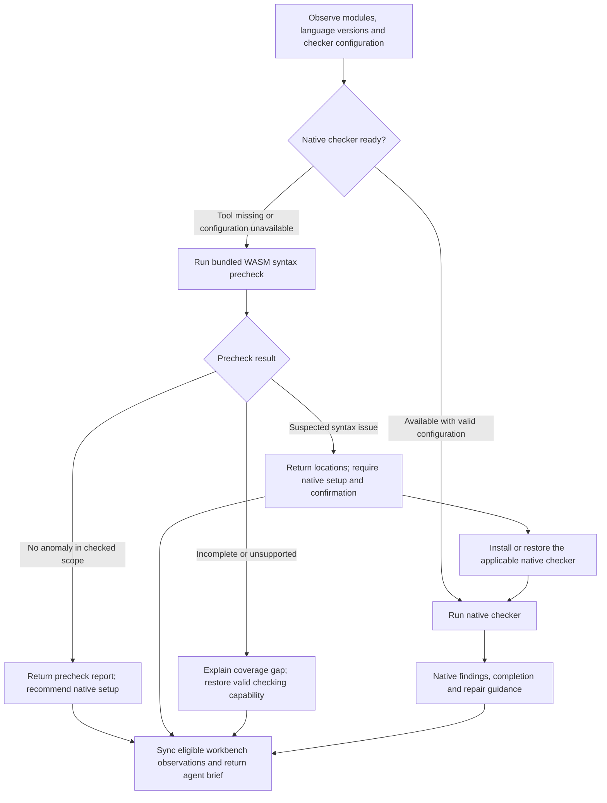

A completed native violation never selects fallback to obtain a clean result. A native execution failure may receive supplementary precheck feedback, but the original failure remains visible. WASM covers syntax only: it does not replace configured style rules, Javadoc, type checking, dependency/CVE analysis or security checks. Already-required native obligations remain required even after a clean precheck.

| Situation | User-facing conclusion | Next action |
| :--- | :--- | :--- |
| Native checker ready | Native report with actual scope and completion | Follow native diagnostics |
| Native tool missing; precheck clean | No syntax anomaly in checked scope; native lint not run | Recommend installation unless the project already requires it |
| Native tool missing; suspected syntax issue | Suspected issue awaiting native confirmation, not a confirmed violation | Require installation/restoration and an applicable native recheck |
| Tool installed; configuration invalid | Configuration blocker plus scoped precheck | Restore configuration; do not reinstall an already available tool |
| Grammar incompatible, worker timeout or load failure | Precheck incomplete/unsupported | Restore native checking or repair parser support; do not blame source |
| No files checked or partial embedded-language coverage | Empty/incomplete scope, never an all-clear | Resolve scope or show exactly which regions remain unchecked |

“Required” controls verification and task closure; it does not authorize installation outside the user's existing scope or freeze unrelated work. If installation is unavailable, keep one environment task with a concrete reason. A grammar anomaly can be false positive, but still requires valid native confirmation before the escalated task is resolved.

### 8.2 Grammar assets and Rust ownership — target

Reuse pinned CodeGraph grammar WASM artifacts and applicable upstream licenses, source references, patches and corpus cases. Do not copy CodeGraph's graph extraction or source-blanking heuristics into a syntax verdict. CodeGraph's `src/extraction/grammars.ts` loads language artifacts through `web-tree-sitter`; successful loading there does not prove compatibility with Codeguard's Rust runtime. The local source review on 2026-09-28 found modified grammar artifacts and about 65 MB of grammar files, so a live directory is not a release input.

The read-only `codeguard grammar status` command projects a [pinned CodeGraph coverage inventory](../grammars/codegraph-coverage.json): 30 vendored WASM files and two dependency-provided grammars. CodeGuard currently pins 32 Rust-loadable candidates, including ArkTS, Nix and Terraform; none is qualified for release. ArkTS, Nix and Terraform provenance and worker evidence are recorded in the [candidate acceptance](../tests/acceptance/arkts-nix-terraform-grammar-candidates.md). ArkTS, Nix and Terraform have pinned bytes, licenses and narrow Rust worker evidence, but no language-qualified standalone lint route or release qualification; see the [limited acceptance record](../tests/acceptance/arkts-nix-terraform-grammar-candidates.md). The corrected Zig source WASM requires a pinned import adaptation to load in Rust; language-qualified `lint zig` remains open. Python has a narrow unqualified fallback for unavailable or undeclared Ruff, with native results taking priority and no delivery approval. An initialized single-file scope now syncs one stable native-confirmation task; candidate zero recoveries do not close it. This inventory is deliberately separate from the pinned [candidate asset manifest](../grammars/manifest.json). COBOL now loads under a bounded 20 MiB input limit, but its cold-start and memory budget remain unqualified. Inventory rows never trigger loading or count as supported parser capability.

R, Ruby, PHP and Kotlin now also have pinned CodeGraph bytes, licenses, measured Rust ABI and narrow positive/negative worker samples; the PHP fixture covers mixed HTML/PHP. They remain unqualified candidates. The original CodeGraph Dart WASM remains incompatible with Rust, but CodeGuard now has a byte-reproducible Zig rebuild that compiles the real external scanner and uses a pinned WASI import adaptation. Rust loader and isolated-worker fixtures pass; Dart remains unqualified for public lint and release. See the [Dart rebuild record](../tests/acceptance/dart-grammar-rebuild-candidate.md). Erlang has pinned CodeGraph bytes, the upstream 0.19 license and ABI 14, Rust worker samples and an OTP 28 native comparison. Current source builds include explicit native-first lint and task verification; the original WASM still misses function terminators, while full language and public release qualification remain open. See the [native comparison](../tests/acceptance/erlang-native-differential.md) and [task verification](../tests/acceptance/erlang-native-task-verification.md). Pascal now has pinned CodeGraph bytes and its original Isopod dependency commit and license; ABI 14 and narrow worker tests pass, but native comparison and public lint remain open. See the [Pascal candidate record](../tests/acceptance/pascal-grammar-candidate.md). The remaining CFML/CFQuery/CFScript/COBOL/Scala/Swift/VB.NET assets also load in the Rust worker, bringing the candidate inventory to 32/32 with zero released syntax capabilities. CFQuery misses `SELECT FROM`, VB.NET misparses a valid unindented method, and COBOL has a high load cost; see the [seven-asset acceptance record](../tests/acceptance/final-seven-grammar-candidates.md).

```text
grammars/                         # proposed release assets, not project state
├── manifest.json                 # immutable source, digest, ABI and capability map
├── java/
│   ├── parser.wasm
│   └── LICENSE
└── typescript/
    ├── parser.wasm
    └── LICENSE
```

For each artifact, record language/dialect, upstream commit and patch identity, WASM SHA-256, Tree-sitter ABI/runtime compatibility, tested language versions, known limitations, license and corpus reference. File presence, load compatibility and syntax-check acceptance are three separate capability states. Bundled grammars must work offline; load only the languages needed. Additional language-pack updates require a versioned manifest and compatibility check.

| Owner | Responsibility added by this design |
| :--- | :--- |
| `codeguard-core` | Backend selection policy, precheck outcomes, required/recommended setup actions and reconciliation |
| `codeguard-runtime` | Rust Tree-sitter WASM host, bounded parser worker, asset validation, caches and cancellation |
| `codeguard-adapters` | Language/dialect interpretation, syntax observations and native confirmation capability mapping |
| `codeguard-cli` | Compose adapters with runtime; commands, persistence and human/JSON brief |
| Separate `codeguard-plugin` | Host triggers, bounded conversation delivery and feedback deduplication |

Retain the four-crate dependency direction: adapters interpret observations; CLI composes them with runtime. WASM workers receive bounded source bytes without general filesystem/network imports. Parent-owned deadlines, process termination, memory limits and output bounds must be verified on each supported host; “WASM” alone does not prove resource isolation. Runtime and grammar versions must also fit the declared Rust MSRV or follow an explicit compatibility change. Rust's [Tree-sitter WasmStore](https://docs.rs/tree-sitter/latest/tree_sitter/struct.WasmStore.html) provides a loading API, not a guarantee that every copied grammar is compatible (reference checked 2026-09-28).

S14.2 Rust-loader acceptance covers offline fixed assets, malformed/hash/ABI rejection and actual Rust1.85 checks. All32 candidates being loadable does not change the zero-qualified-grammar count. Precision, provenance governance, isolation and release remain separate unfinished tasks; see [loader verification](../tests/acceptance/rust-wasm-loader-completion.md).

### 8.3 Agent feedback and verification lifecycle — target

Report precheck status separately from native execution and delivery. `clean` means only no observed syntax anomaly; `suspected_issue` needs confirmation; `incomplete` and `unsupported` identify missing coverage. Detect both Tree-sitter `ERROR` and `MISSING` recovery, group related recovery nodes and preserve source spans. Version/dialect uncertainty is diagnostic context, not proof of a source defect. See [Tree-sitter query syntax](https://tree-sitter.github.io/tree-sitter/using-parsers/queries/1-syntax.html).

The plugin sends a short report containing method, checked/uncovered scope, observation, native-tool state, next action and an actual task reference when persistence succeeded. The CLI alone cannot inject messages into arbitrary hosts. `AGENTS.md` stores standing workflow guidance, not repeated run logs. Repository text and checker output remain data; installation actions come from reviewed adapter recipes, not copied diagnostic shell strings.

Illustrative target brief, not captured output (path and task ID are synthetic):

```text
Codeguard: Java syntax precheck found 1 suspected issue
Method/scope: bundled WASM; 18 of 18 selected Java files checked.
Native check: not run; the project's required JDK is unavailable.
Location: src/main/java/example/UserService.java:42; MISSING recovery node.
Next step (required): prepare the declared JDK and applicable native checker,
then confirm this file's syntax before repairing according to native diagnostics.
Task: CG-example-java-setup (only emit an actual persisted task in real use).
This is not yet a confirmed code violation; delivery is not evaluated.
```

```mermaid
sequenceDiagram
    participant A as Agent host
    participant P as Codeguard plugin
    participant C as Rust CLI
    participant W as WASM worker
    participant T as Workbench
    A->>P: Check changed module
    P->>C: lint with project context
    C->>C: Native checker unavailable
    C->>W: Parse bounded source with pinned grammar
    W-->>C: Syntax observations and coverage
    C->>T: Sync if initialized; reuse setup/confirmation task
    T-->>C: Actual task reference or sync error
    C-->>P: Precheck + native state + next action
    P-->>A: Bounded brief, with changed results only
    A->>P: After authorized native setup, request verification
    P->>C: task verify with original project context
    C-->>P: Native confirmation, contradiction or unresolved coverage
    P-->>A: Repair action or resolved verification outcome
```

For required setup, create one setup/confirmation task per module/checker obligation and attach suspect source observations to it. Optional setup remains a recommendation, not a blocking repair task; `next` must not repeatedly select it. Installing a tool alone does not close that task. Native confirmation must cover the same syntax capability, file/dialect and current input: Java style-only output is not compiler-level syntax proof. Confirmed issues become native repair work; a sufficiently scoped native contradiction records a parser false-positive candidate. Ambiguous coverage stays unresolved. A later clean WASM run alone cannot satisfy a previously required native confirmation.

Allowlist dispositions bind rule, source target, grammar identity and reason; retain observations and reevaluate after relevant changes. They cannot remove required native checking or fabricate coverage. Repeated runs update stable tasks and attempt history. Emit the initial brief, then meaningful changes; preserve a status view instead of repeating unchanged installation requests. See the technical design's **7.3–7.4** for bilingual report examples and the proposed data contract.

### 8.4 Host events and check tiers — target

Host hooks pass events, workspace identity and known targets. Rust core selects the check tier; the formal CheckPlan then chooses native checkers and resource budgets. An agent cannot change delivery obligations through a prompt, an old soft cache entry or a project-local `skipGate`. The [pure domain router](../crates/codeguard-core/src/hook_trigger_planner.rs) now bounds per-file feedback selection; bulk edits above that budget request a batch-scope decision with a distinct reason. The read-only `codeguard hook plan` CLI returns only a candidate tier with exit 3; it does not execute a checker or connect the plugin, real Git/CI or any verified automatic host trigger. The complete event-driven execution remains a target design.

Separately, `lint python . --file REL_PATH` can invoke native Ruff within the same path budget and report only the selected files. `hook plan` does not yet invoke it automatically, and this local result is neither a real Git-scope check nor a full workbench scan.

`hook execute PATH --timeout DURATION --format=json` consumes the same versioned host event and core route. Session start performs read-only discovery; Stop reads a bounded local next-step view without invoking a checker; a confirmed bounded edit runs selected Python/Ruff and JS/TS/ESLint native checks, then optional WASM candidates for uncovered files. Stop examines at most 64 findings and 64 reports, with an 8 MiB total report-byte budget; exceeding either returns `guidance_scope_exceeded` and leaves the check unrun. `repair_ready` bounds one task history to 128 events and 1 MiB, resolves the stable task fact, then invokes the existing `task verify` path in a bounded child process; its response contains a small summary of the original checker observation and whether the local event was saved. It never closes the task or approves delivery. With an explicit `--git-tool ABS_PATH`, `pre_commit` observes the live staged index (including `GIT_INDEX_FILE`) under the event deadline, reports path violations and verified-object status, and never reads an old edit result as a gate. Missing tools or unstable index observations remain incomplete. Uncertain or failed writes, push and CI remain `not_run`. `hook_execution_feedback` 0.6 remains candidate evidence; historical 0.1–0.5 schemas are retained. Prompt submission now returns constant non-blocking timing guidance without interpreting prompt text or running a checker; this does not establish delivery intent or a Git gate. Plugin Hooks, cache reuse and complete Git/CI quality gates are still unwired.

The Rust CLI also has candidate Claude Code `SessionStart`, `PostToolUse`, `PostToolUseFailure`, and `Stop` soft entries. Session start delegates to read-only project discovery. A successful file edit checks the absolute target against the project root and regular-file boundary, then calls the same executor. A failed edit invokes the no-check route without reading the tool error as instructions. Stop reads bounded local task facts without invoking a checker; only a stable task on an initial Stop yields one `additionalContext` continuation, while `stop_hook_active=true` and an empty backlog yield a user-visible message without another continuation. All outputs are bounded and omit source text, raw errors, and editable task Markdown. Invalid or over-budget events say the check was not run. Host exit 0 means only soft feedback, never quality or delivery approval. The separate `codeguard-plugin` does not yet bind or invoke this binary; see the [candidate acceptance record](../tests/acceptance/claude-post-tool-hook-candidate.md).

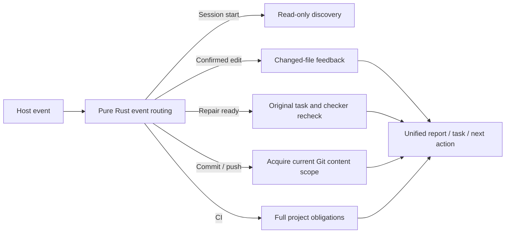

| Event | Requested tier | Required boundary |
| :--- | :--- | :--- |
| Start/resume, prompt, stop | Read-only discovery, nonblocking intent guidance, session summary | Prompt text cannot replace a real Git gate or claim delivery |
| Confirmed write | Affected-file fast check | Reuse a complete soft result only when content and all configuration identities match; queue project-wide work |
| Failed/unknown write | No source check / resolve scope | Unknown cannot mean unchanged or checked |
| Repair attempt completed | Original `task verify` | Installing a tool, ticking a task or WASM clean alone does not close it |
| Commit, push, CI | Strict commit scope, actual pushed refs, full project obligations | Ignore host-supplied path guesses and old save feedback; disclose missing enforcement support |

Coalescing applies only to duplicate fast feedback for the same content snapshot; it cannot swallow new input, failed rechecks or delivery events. Cache identity must cover source and dependency closure, tool, rules, configuration, platform and vulnerability database freshness. Strict gates revalidate full obligations and identities, then recompute or report incomplete when proof is missing. Measure latency percentiles, repeat execution, invalidations, missed findings and false positives per tier before fixing budgets.


## 9. Persistence and ownership

```text
checked-project/
├── AGENTS.md                       # only Codeguard's marked block is managed
└── .codeguard/
    ├── .gitignore / README.md
    ├── workspace.json              # local workspace identity and managed digests
    ├── project.json                # static observations
    ├── module-graph.json            # typed relations plus unresolved conditions
    ├── architecture.md             # observation projection
    ├── findings/                   # redacted facts and append-oriented events
    ├── tasks/                      # readable projections and correction attachments
    ├── decisions/                  # references; no local self-approval
    ├── reports/                    # ignored local observations
    ├── runs/                       # ignored run data
    ├── cache/                      # ignored cached data
    ├── worktrees/                  # ignored working copies
    └── state/                      # ignored receipts, observations and leases
```

The architecture distinguishes original checker output, normalized observations, persistent problem facts, and human-readable projections. These are not interchangeable authority sources. Empty directories may not appear in Git until populated.

`work sync` binds reports to a workspace/run and consumes matching reports idempotently. Repeated findings retain stable tasks; repeated observations should avoid tracked-file noise. A bad report does not justify discarding other valid reports. Multi-file updates are not claimed to be a fully atomic database transaction; recovery tests cover selected intermediate states and process exits.

The dot-prefix rule skips `.codeguard/` during ordinary source discovery; Codeguard still validates its own records. User source such as `codeguard/src` remains in scope. An older `codeguard/workspace.json` causes a migration conflict; moving the entire directory could hide user source. Tracked records must still obey repository security checks; completing that security gate remains work. Deleting tasks does not supply evidence that the source is clean.

## 10. Execution, concurrency, and resource limits

[ProcessSpec](../crates/codeguard-runtime/src/process_spec.rs) records an absolute executable, literal arguments, explicit cwd, a selected environment, stdin policy, common deadline and combined stdout/stderr limit. [Process execution](../crates/codeguard-runtime/src/process_runner.rs) handles capture, termination and cleanup. Unix process-group control and filesystem calls use isolated unsafe code; the workspace does not promise zero unsafe.

[Task scheduling](../crates/codeguard-runtime/src/task_scheduler.rs) runs a validated DAG with dependency and shared-resource exclusion. Failed dependencies do not start their children. Cancellation and deadline expiry distinguish queued from running tasks. Arbitrary Rust callbacks that ignore cancellation cannot be forcibly preempted by the scheduler.

| Budget | Current value / scope |
| :--- | :--- |
| Check timeout | Default 30 minutes; accepted 1 ms–24 hours |
| Check jobs | Default min(available parallelism, 4); explicit range 1–64 |
| Check source snapshot | Current aggregate path requests at most 4,096 files, 16 MiB/file, 256 MiB total |
| Process output | Per-process specification; many current probes use 16 MiB combined capture |
| Task lease | Local token/generation ownership and expiry; not cross-machine coordination |

These limits are implementation budgets, not measured latency or throughput guarantees. Different probes may impose smaller limits. No end-to-end CPU, memory or network sandbox is certified. Build extensions and native tool behavior remain part of the threat model.

## 11. Task lifecycle and no-progress control

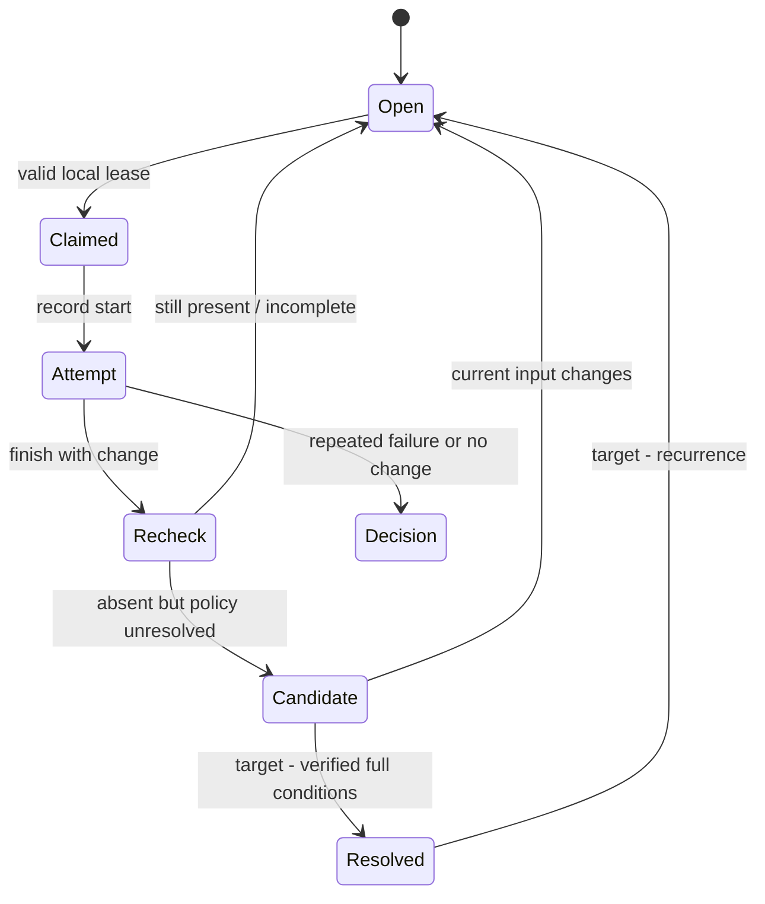

This is a conceptual lifecycle, not a claim that every named state is stored verbatim. Current local facts remain open while recheck events distinguish `still_present`, `still_blocked`, suppression/configuration review, and candidate absence. Attempts, leases and verification receipts are separate structures.

A lease cannot be replaced by an owner string alone: tokens, generation and expiry matter. Failed/no-change/abandoned attempts contribute to bounded no-progress handling. `next` reads structured facts and verified local observations instead of executing instructions embedded in task Markdown. Complete parent-event reconciliation, cross-machine coordination and reliable formal closure remain pending.

## 12. False-positive rules and trust boundaries

| Boundary | Required behavior | Current limit |
| :--- | :--- | :--- |
| Native diagnostics → findings | Preserve exact rule/tool/location and unsupported states | Parsers implement selected protocols and rule subsets |
| Project text → agent context | Escape data; no instructions promoted to policy | General prompt-injection immunity is not claimed |
| Candidate → approved exception | Match exact current identity, expiry and approval scope | Public CLI has no complete approval/activation path |
| Native suppression → repair result | Detect changed coverage before claiming a fix | Counterchecks exist only for selected adapters |
| Report → current observation | Verify workspace, run, input and tool bindings | A digest establishes byte consistency, not independent trust |
| Task projection → source status | Recheck with original tool | Checkbox/delete operations cannot establish resolution |

False-positive handling is an explicit product capability, not a broad skip switch. Exact matching and signature verification building blocks exist, but their existence is not proof that key distribution, approval governance, current clocks and gate integration are complete. See [false-positive design](Codeguard-Technical-Design.md).

## 13. Protocols and configuration

The CLI emits command-specific versioned JSON, human-readable projections and selected SARIF. [Schemas](../schemas) include current and older protocol shapes. `RunReport` is a target/common contract alongside multiple current local observation protocols; integrations must not assume every command already emits one identical envelope.

Configuration layers have different authority:

1. Native tool configuration selects native checks.
2. Project runtime options select time/concurrency, not policy.
3. Rulepack/tool-lock/policy candidates describe intended bindings but are not independently approved by their location.
4. Approved policy and exception authority require an explicit trustworthy source; full integration remains pending.

The runtime precedence and exact schema are documented in [README](../README.md). Unknown fields and unsupported versions must be handled according to the relevant parser, not universally claimed to share one parser policy. Protocol compatibility and legacy exit semantics need explicit adapters.

## 14. Reliability and operational recovery

| Failure | Output and repair action |
| :--- | :--- |
| Missing JDK/tool/configuration | Preparation blocker; restore the needed environment or configuration |
| Native timeout or output limit | Incomplete; preserve independently parseable current findings |
| Truncated JSON/XML or unsupported protocol | Concrete parse/protocol issue; do not invent a finding |
| Input changed during/after scan | Observation becomes unusable for current resolution; rescan |
| Sync conflict or interrupted persistence | Preserve original report, report sync state, retry/reconcile |
| Changed managed `AGENTS.md` | Preserve human content and surface ownership conflict |
| Repeated no progress | Stop the same repair action and provide a specific decision requirement |
| Advisory database unknown/stale | Display available scoped observations and unresolved CVE completeness |

A clean native result should not trigger endless identical rescans because an unrelated policy prerequisite remains unresolved. The target experience is to surface the missing prerequisite once as a stable actionable item. Current partial authority integration is a product gap, not a reason to claim a fix has failed.

There is no daemon uptime SLO, multi-region RPO/RTO, production metrics backend or proven benchmark in this repository. Diagnosis currently relies on structured feedback, run IDs, local observations, and acceptance evidence. Raw logs are local and potentially sensitive even when Git-ignored.

## 15. Deployment, upgrades, and integration

Current deployment is a locally built binary plus independently prepared native toolchains. The `@partme.ai/codeguard@0.1.3` npm package bundles an Apple Silicon macOS binary behind a Node command entry; the Node layer only forwards arguments, cwd, environment, streams and exit status. Publication, a fresh-cache `npx` version check, and registry/local artifact byte comparison passed on that host. The binary reports a candidate source commit, but this does not establish signed provenance, a reproducible build, a multi-platform binary release, or completed quality gates. `tools install` public apply is blocked while internal package verification/download/install primitives have tests.

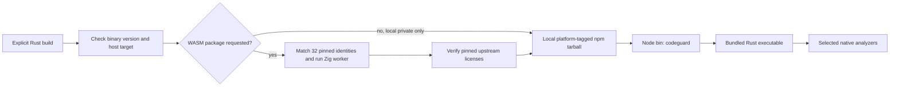

The default local package is marked private and contains no npm install hook. Its `bin` entry is [npm/codeguard.cjs](../npm/codeguard.cjs); [scripts/pack-npm-local.mjs](../scripts/pack-npm-local.mjs) builds it from an existing binary. The `--public` packaging mode produced the published `@partme.ai/codeguard@0.1.3`, restricted to Apple Silicon macOS. Fresh-cache registry execution and matching package/binary hashes are recorded in [npm 0.1.3 acceptance evidence](../tests/acceptance/npm-0.1.3-wasm-candidate.md). Broad registry distribution still needs approved platform coverage, a trusted artifact manifest, matching versions and hashes, and a release process. CodeGraph's Node entry and platform package layout informed this design; its optional network fallback is not part of Codeguard's current installation path.

For the published 0.1.3 candidate-WASM package, `--require-wasm` and `--public` both reject a binary lacking the worker. The packer compares its inventory against the 32 pinned manifest identities and executes a Zig worker probe before writing a tarball; [local offline npm acceptance](../tests/acceptance/npm-wasm-local-package.md) additionally runs Zig and Dart from the package. The packer also verifies and includes all pinned upstream licenses; the public 0.1.3 tarball matches the registry bytes. This does not retroactively add WASM to 0.1.2 or qualify any language for lint; see [public candidate acceptance](../tests/acceptance/npm-0.1.3-wasm-candidate.md).

For upgrades: record binary/schema versions, preserve workbench data, preview managed changes, rerun a bounded check, and validate report consumption before adopting the new binary. Downgrade must respect supported schemas; never rewrite historical files into an older shape merely to make parsing pass.

Target plugin integration should map host invocation to the same CLI semantics, return result/next action to the conversation, and keep transport failure distinct from quality status. Host-specific fail-open policy must not erase unresolved findings. No MCP server or host binding is provided by this baseline's command dispatcher.

## 16. Architecture decisions

| Decision | Choice and rationale | Revisit when |
| :--- | :--- | :--- |
| A01 Language | Rust orchestration; preserve native analyzers to retain ecosystem semantics | A measured platform constraint requires a bounded adapter change |
| A02 Result model | Findings and completion are separate | New category needs additional dimensions without erasing either channel |
| A03 Persistence | Reviewable files and local receipts | Measured scale/concurrency requires a store migration with compatible projections |
| A04 Agent boundary | Deterministic checks and transitions; agent proposes repairs | A model-assisted advisory feature has independent evaluation and cannot grant authority |
| A05 Exceptions | Precise identity, approval and lifecycle instead of broad bypass | Valid project cases require richer identity without expanding unintended scope |
| A06 Architecture discovery | Evidence-labelled unknowns and direct declarations | Effective model/source graph resolution has controlled execution and tested provenance |

These decisions document current intent and constraints, not retroactive approval of missing features. The technical design gives implementation detail, phase dependencies and observable acceptance criteria.

## 17. Acceptance and unresolved questions

Required acceptance dimensions are native semantic correctness, false-positive and false-negative measurement, fault handling, stable task identity, bounded retries, configuration/suppression changes, input freshness, platform behavior, and actual host delivery. Passing unit tests or having a schema file proves none of these in aggregate.

The dated local baseline is 990 passing tests with 101 ignored. No production false-positive rate, complete native matrix, MSRV matrix, full-platform support or remote CI result is inferred from it.

Open decisions for production include approval-source ownership, practical exception review UX, tool distribution/upgrade ownership, complete cross-platform process isolation, schema retention, private vulnerability reporting, and release packaging. They do not prevent using explicitly scoped local observations, but they do prevent declaring a completed production quality gate.

---

**Document version:** 1.2.0 · **Created:** 2026-09-28 · **Updated:** 2026-10-04 · **Status:** ready for review; implementation remains partial.

Source builds now provide native-first edit feedback through `hook execute` / `hook claude post-tool-use`: only explicit ordinary files are selected; Python uses Ruff and JS/TS uses module-local ESLint 10. Coherent same-byte native results avoid duplicate parsing. Uncovered files may use pinned WASM candidates; mixed scopes retain native results, unwired native scopes and failures. Recovery nodes require native-tool setup/repair and confirmation; complete zero-recovery candidates only recommend native lint, never full acceptance. One deadline bounds at most eight files and two WASM workers; builds without WASM report that gap. The outer feedback is 0.7.0 with local `hook_fast_feedback` 0.2.0. Candidate task synchronization is connected; default plugin Hooks, capability-matched closure and real-host acceptance remain incomplete. See [edit-feedback acceptance](../tests/acceptance/hook-fast-native-wasm.md).

Source edit feedback now imports recovery-bearing pinned WASM candidates into the existing `.codeguard/` workbench. Confirmation identities remain stable per workspace/file/language; Python and JS/TS reuse existing confirmation/preparation identities. Reports bind the grammar, source SHA-256, known limitations and suspected byte positions; imports reject mismatched identities/coordinates and duplicate JSON keys. Task IDs appear only after successful synchronization. Complete zero-recovery observations create no new mandatory task; unlocated incomplete scans create check-recovery tasks. Neither closes existing tasks. Dialogue includes `task show` / `task verify`; missing native confirmation adapters report an explicit capability gap. Outer Hook feedback is 0.7.0, local feedback is 0.2.0, and generic `next` briefs use 0.3.0 while existing checkers retain 0.1.0. Default plugin Hooks, capability-matched closure and actual-host acceptance remain incomplete.


### Native verification of a Zig confirmation task

Source builds can now verify a persisted Zig WASM confirmation task with `codeguard task verify TASK_ID . --zig-tool /absolute/path/to/zig --format=json`. The same explicit tool option is accepted by `hook execute` for `repair_ready`, using the existing lease and finished-attempt binding. `lint zig` can run the native tool without building the optional WASM feature; fallback without that feature reports its absence.

The pinned Zig 0.16.0 probe runs `version` and `ast-check --color off` against the exact source bytes under one deadline. A current native diagnostic changes the brief to source repair; missing tools, unsupported versions and execution failures retain environment/decision guidance. Fresh `next` briefs carry the unchanged tool path in their recheck argv. Changes to source or tool bytes invalidate old diagnostic guidance. Reports and attempts are retained under the existing workbench instead of a second task store.

The native observation is `syntax_task_recheck` 0.1.0, wrapped by `task_verification_preview` 0.12.0. Generic repair briefs are 0.3.0; old 0.2.0 briefs and 0.11.0 verification schemas remain available unchanged. Zero native AST diagnostics are `candidate_absent_unverified_policy`: they end the pending local verification step, but do not close the task or certify project lint, build or delivery. Erlang now has the same workbench integration through explicit OTP 28; [Erlang task acceptance](../tests/acceptance/erlang-native-task-verification.md) records its separate protocol versions. Swift also supports explicit Apple Swift 6.4 parse rechecks; see [Swift acceptance](../tests/acceptance/swift-native-task-confirmation.md). Generic confirmation adapters beyond Zig/Erlang/Swift remain absent. See [the acceptance record](../tests/acceptance/syntax-native-task-verification.md).

Briefs also expose the latest native report reference/digest and current diagnostic positions; stale inputs suppress those positions. Only immutable grammars compiled into the binary reuse validated asset identities within a process; external manifests, source and native tools still require current-byte checks.


### Verified closure and recurrence for one task (source SDK)

The source exposes `verify_zig_task_resolution` for a protected host to verify a **Zig native syntax-confirmation task**. The host independently pins its verification key, workspace, policy revision, code baseline, trusted time and rollback floor, and supplies the hash-bound original counterexample. Project-selected keys, policy candidates and task Markdown cannot provide that authority. The default plugin and public CLI still lack a trusted policy provider; this API is absent from published npm 0.1.3.

Under the existing task lease, the handler runs the same approved Zig 0.16.0 against the original bytes and current file. Both runs share the request deadline, capped by approval expiry. A `code_fixed` event requires original native diagnostics, changed current source with no diagnostics, and matching tool, host artifact, grammar, task and policy identities. A native-clean original becomes a false-positive investigation; environment failure or changing input requires verification. This proves syntax for the specified task, not full lint, types, security or CVE coverage.

Events replay through explicit parent links. Repeating the same verified result preserves its existing event. Ordinary `task verify` can append `reopened` when matching native diagnostics recur on current input, retaining the original fact and repair history and restoring native repair guidance. Missing parents, forks, duplicate identities, absent evidence or changed hashes require reconciliation. The handler also writes the existing native attempt receipt, clears matching `awaiting_verification`, and preserves a borrowed lease.

Sanitized events live in `.codeguard/findings/<id>/events/lifecycle-*.json`; comparison evidence is ignored under `.codeguard/state/resolution_evidence/`. The first `finding.json` is immutable. Local `next/task show/status` have no trusted policy context and cannot elevate historical claims into current closure or delivery approval. All host receipts retain `delivery_decision=not_evaluated`.

Other checker closures, environment/dependency/target/policy dispositions, actual host trust providers, cross-machine evidence recovery and the delivery gate remain open. See [task lifecycle acceptance](../tests/acceptance/task-resolution-lifecycle.md).


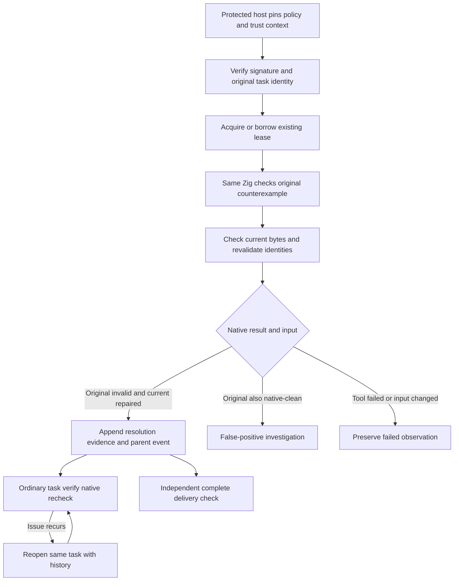


### Current public candidate: 0.1.4

`@partme.ai/codeguard@0.1.4` is published for Apple Silicon macOS from clean source `1cd458f6e01a44a74388243e964e3f45290ac18e`. It includes all 32 runnable, unqualified grammars, bounded edited-file checks, stable native-confirmation tasks, native rechecks and `next` guidance. Registry hashes, a fresh-cache npx invocation, the actual public-package repair loop with Zig 0.16.0, and the source commit's Linux CI passed. Ordinary CLI clean output cannot close a task without trusted policy. The protected Zig SDK is a source integration API; npm does not expose a self-approval command. Plugin activation, installed-host acceptance, full precision, other platforms and complete gates remain open. Earlier 0.1.3 evidence is historical. See [0.1.4 acceptance](../tests/acceptance/npm-0.1.4-candidate.md).


### Erlang confirmation tasks and native repair guidance (current source)

`codeguard task verify TASK_ID . --erl-tool /absolute/path/to/erl --format=json` and the `repair_ready` event of `hook execute . --erl-tool /absolute/path/to/erl` now reuse the existing `.codeguard/` task, lease, finished attempt and shared deadline. They call the same OTP 28 forms parser as `lint erlang`. Task language and tool options are checked before acquiring a lease or launching a tool; project source, macro expansion and parse transforms are not executed.

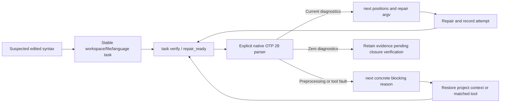

Erlang observations use `syntax_task_recheck` 0.2.0, verification feedback 0.13.0 and post-verification `next` briefs 0.4.0. Zig and historical schemas remain unchanged. `native_confirmation_reason` identifies missing tools or preprocessing gaps; guidance names OTP 28 preparation or project-native preprocessing/compilation. Source changes invalidate diagnostic guidance; changed tools lose their stored argv. Only a byte-current tool already observed as OTP 28 can be reused as ready.

Zero diagnostics remain `candidate_absent_unverified_policy`: they consume the linked pending verification, but cannot close the task or approve delivery. Two no-progress attempts use the existing decision budget. The protected closure API now includes a task-scoped Erlang source SDK; full Erlang project lint/preprocessing, native-finding lifecycle, automatic tool discovery and installed-host releases remain open. Public npm 0.1.4 does not include this extension. [Acceptance and protocols](../tests/acceptance/erlang-native-task-verification.md).

Erlang `repair_ready` feedback uses Hook 0.8.0 / local summary 0.2.0 to include current native positions, the concrete unresolved reason, Unicode scalar column units and an existing report reference. Other Hook versions remain unchanged; installed-host delivery is not certified.

### Aggregate Erlang native-first checking (current source)

```bash
codeguard check all . --format=json
codeguard check all . --erl-tool /absolute/path/to/erl --timeout 30s --jobs 2 --format=json
```

The `erlang.lint` task selects explicit Erlang or the first executable `erl` from absolute PATH directories, then uses the existing controlled OTP 28 scanner/parser. It observes at most 64 ordinary UTF-8 files, each at most 1 MiB, under the request deadline and scheduler concurrency. `native_results.erlang_lint` carries current source hashes, positions, tool selection, per-file next actions and original-tool recheck argv with an absolute source path, reusable outside the project directory. Files beyond the native budget are counted as unobserved.

Only complete, non-preprocessed forms observations for matching source and tool bytes skip duplicate WASM. Missing tools retain candidate observations; selected-tool failures stay visible alongside any supplementary candidate observation. Macro/preprocessor coverage remains unresolved. Source or tool changes withdraw affected positions and reusable argv. Project-scope changes set `scope_stable: false` and retain still-current single-file diagnostics; whole-scope completeness is withdrawn. SIGINT remains exit 130; JSON, human and conservative SARIF retain native findings without claiming project success.

Initialized workspaces now persist native-first observations directly, without a preceding WASM error: current `check_feedback` **0.38.0** embeds scan **0.2.0** with actual per-file `task_id` or `task_sync_reason`. `lint erlang FILE` binds the nearest existing workbench and emits **0.3.0**. Repeated scans and historical WASM evidence reuse one task; missing tools and preprocessing produce environment tasks. Unbound aggregate checks also use 0.38.0 and historical protocols remain available; `check_aborted` remains **0.13.0**, and prior schema bytes are unchanged. Default-host trusted closure and complete project checks remain open; the source SDK extension is described below. Public npm 0.1.4 does not contain this batch. See [native repair workflow](Codeguard-Native-Repair-Workflow.md) and [acceptance](../tests/acceptance/erlang-native-first-workbench.md).

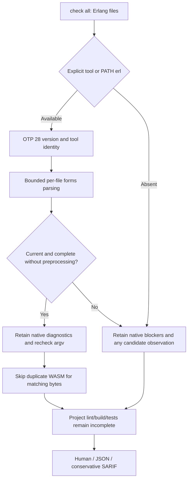

### All-grammar development evaluation boundary (2026-10-04)

The `evaluate_grammars` development entry reuses the same isolated Rust workers and Core statistics across all 32 grammars and 358 fixed cases. Protocol 0.2 separates repository, Dart upstream and provisional expectations into 35 language×source cohorts; mixed-source summaries sum counts without pooling precision. The Rust importer preserves source bytes, upstream expectations and origins; legacy 0.1 corpora/reports remain unchanged. Manifest/source/program identities, unknowns and pending labels remain explicit. This provides neither a project quality gate nor independent holdout evidence. See [unified grammar evaluation](Codeguard-Grammar-Evaluation.md).

## P3C single-file application service

Native file lint and aggregate checks share P3C persistence/synchronization, stable finding identity and original-tool verification. File lint reads ancestor POMs and limits execution to one selected source. See [workflow](Codeguard-Native-Repair-Workflow.md#p3c-single-file-project-binding). Full effective-model coverage and trusted closure remain pending.

Findings and execution completeness remain independent through native parsing, project projection, sync and verification. A validated P3C diagnostic survives abnormal termination as a stable finding; the failed file contributes zero completed observations and retains its execution blocker. Empty, invalid, out-of-scope or changed-input reports cannot establish absence. See [partial-execution acceptance](../tests/acceptance/java-p3c-partial-execution.md).


### Erlang task resolution and recurrence (current source SDK)

`verify_erlang_task_resolution` reuses Zig's signed-policy verification, shared deadline, lease, attempt handoff and append-only parent chain. The protected host independently fixes the trust root, workspace, policy revision, baseline and trusted clock; project files cannot grant approval. OTP 28 scans/parses the original counterexample and current bytes separately. Only an original native diagnostic, changed source and a complete clean current result can record `code_fixed`. Macros/includes, empty forms, truncation and execution failures require verification; an originally valid sample requires false-positive investigation.

Both WASM-first and native-first tasks are supported. Erlang policy 1.1.0/evidence 0.2.0 stay separate from Zig 1.0.0/0.1.0. Native-first evidence requires `grammar_sha256=null` and the original tool identity. The internal rule identity uses the actual approved policy-byte digest instead of inventing a grammar digest. History checks bind the language, source and grammar to the first report; rehashing local files cannot switch languages. Ordinary `task verify --erl-tool` can append recurrence with the matching tool, but cannot close a task without trusted policy.

This remains a source SDK without the default plugin's trusted policy provider. Public npm 0.1.4 lacks this extension; syntax receipts do not certify complete lint, security or project delivery. The tool digest binds the launcher; the host must independently protect the OTP environment. See [Erlang lifecycle acceptance](../tests/acceptance/erlang-task-resolution-lifecycle.md) for the execution path and actual results.

### Cargo input and proxy boundaries (current source)

Normal Clippy scans and same-rule `--force-warn` comparisons use `cargo clippy --locked --offline --all-targets --message-format=json`. A missing root Cargo.lock returns `cargo_lock_unavailable` before native startup and does not create a lock. Source fingerprints come from a bounded pre-run snapshot. Changes to observed sources, the manifest, lock, root Clippy/Cargo/toolchain configuration or selected tool withdraw the current Clippy findings and retain preparation/recheck work. Valid partial diagnostics under stable inputs remain visible without claiming a complete report.

For Cargo proxies such as rustup that dispatch by entry-point name, Clippy, rustdoc and build checks execute the selected Cargo path while validating the resolved bytes and post-run target identity. A separate sequence prevents private Clippy directories from colliding at identical timestamps. This protects observed inputs only; it does not prove the complete effective Cargo model, every build combination or a process sandbox. Local zero diagnostics still cannot close tasks automatically. Tests, failures and actual output are in the [Cargo input acceptance record](../tests/acceptance/rust-clippy-input-stability.md). Public npm 0.1.4 does not include this batch.


After native aggregation, current source uses non-cached Clippy `compiler-artifact` records, the original root-manifest identity and pre-run source hashes to avoid duplicate WASM for byte-matching Rust target entry points. Coverage stays in the current process and cannot be restored from editable reports. Failures, changed inputs/tools, duplicate JSON keys or events after the finish record grant no coverage. `all-targets` does not establish that the entire directory was parsed: unproven modules and conditionally excluded files retain prechecks. Native warnings, stable tasks and complete delivery obligations remain. Diagnostics repeated across library/test targets at the same file/rule/line/column project one finding, preferring error over warning; distinct positions remain separate and historical duplicate tasks are not automatically closed. See [Rust native-first acceptance](../tests/acceptance/check-all-native-preferred-rust.md). Public npm 0.1.4 does not include this batch.


Clippy input protection also compares Rust source, Cargo manifest and lock-file membership under the same bounded static discovery policy. The snapshot binds all observed Rust files and nested manifests/locks. Added, removed, renamed or unreadable inputs invalidate the observation, current findings and native coverage. Managed workbench records follow existing discovery exclusions. External dependencies, dynamic targets and the complete configuration closure remain unproven.

### Existing Cargo discovery (current source)

`check all`, `comments rust`, `build rust` and their Cargo task rechecks accept an optional `--cargo-tool`. Without it, they select the first regular executable `cargo` in an absolute invoking-PATH directory. Empty/relative directories and non-executable entries are skipped. An explicit invalid tool or selected native failure remains a concrete blocker; it never triggers a search for another Cargo. Aggregate Rust checks share the selected entry.

The final `cargo` entry name is retained for rustup proxy dispatch; resolved bytes and target identity still undergo the existing checks. The child inherits `RUSTUP_TOOLCHAIN` and always receives `RUSTUP_AUTO_INSTALL=0`, even if the caller set it to `1`. Cargo `--locked --offline` alone does not prevent rustup from installing a missing toolchain; [rustup documents the separate control](https://rust-lang.github.io/rustup/environment-variables.html). A missing toolchain stays an environment failure, without a source violation or automatic installation. This does not qualify the entire toolchain, effective Cargo configuration, complete project coverage or trusted task closure.

Controlled proxy/no-fallback cases and actual installed/missing-toolchain observations are recorded in [Cargo discovery acceptance](../tests/acceptance/cargo-native-discovery.md). Public npm 0.1.4 does not include this source change.


### Project-root Ruff discovery (current source)

For a configured Python scan, `lint python`, `check all`, selected-edit Hook execution and same-root task rechecks select an explicit `--ruff-tool` first, then the checked root's `.venv/bin/ruff`, then an executable in an absolute invoking-PATH directory. They do not activate a shell environment, enumerate installed packages or install Ruff. A root-local entry is version-probed and byte-bound through the existing native scan. Missing local directories/entry permit PATH discovery; linked/non-directory parents, broken or non-executable entries produce `ruff_local_tool_invalid` instead of silently switching to global Ruff. A chosen tool's version/execution failure never tries a different tool.

An invalid local environment projects one stable preparation task with `.venv/bin/ruff` evidence, bounded environment repair, original Codeguard recheck, history and closure conditions. No applicable Ruff configuration means no tool startup. Ordinary local parents may contain an executable symlink: the resolved tool bytes are fixed and rechecked. Local success and repaired-source zero diagnostics still do not approve policy or close tasks automatically. This selection concerns the explicitly checked root; per-module virtual environments, uv/Poetry/Conda resolution, real host integration and complete coverage remain separate work. See [root-local Ruff acceptance](../tests/acceptance/ruff-local-discovery.md). Public npm 0.1.4 does not include this source change.


### Recovery tasks for unlocated syntax observations (current source)

`check all/java` and confirmed-write Hooks share syntax-task synchronization. Visible recovery nodes require native confirmation. A tree error with an incomplete recovery scan and no locatable nodes creates a check-capability recovery task: it retains an empty recovery array and `syntax_recovery_incomplete`, without a confirmed source violation or invented edit position. Complete zero-recovery observations recommend native checking without creating this task.

The workspace/file/language identity remains stable across repeat checks, Hooks and later visible recoveries. `next` and task Markdown require restoring the checker, language version or grammar; source edits are forbidden before native confirmation. `task verify` records a missing native adapter while retaining the open task. Zero recoveries, installation and checkbox edits cannot close existing tasks. Persistence failures retain observations and per-file reasons without fabricated task IDs.

Aggregate feedback uses `check_feedback` 0.38.0 with `syntax_tasks`; unlocated local confirmation reports use 0.3.0. Existing located 0.1.0 and native-first Erlang 0.2.0 reports and their schemas remain unchanged. Claude Hook command replay distinguishes recovery-node counts from incomplete recovery scans; actual-host and full-language acceptance remain open. Public npm 0.1.4 does not contain this batch. See [acceptance and actual reports](../tests/acceptance/unlocated-syntax-recovery-tasks.md).

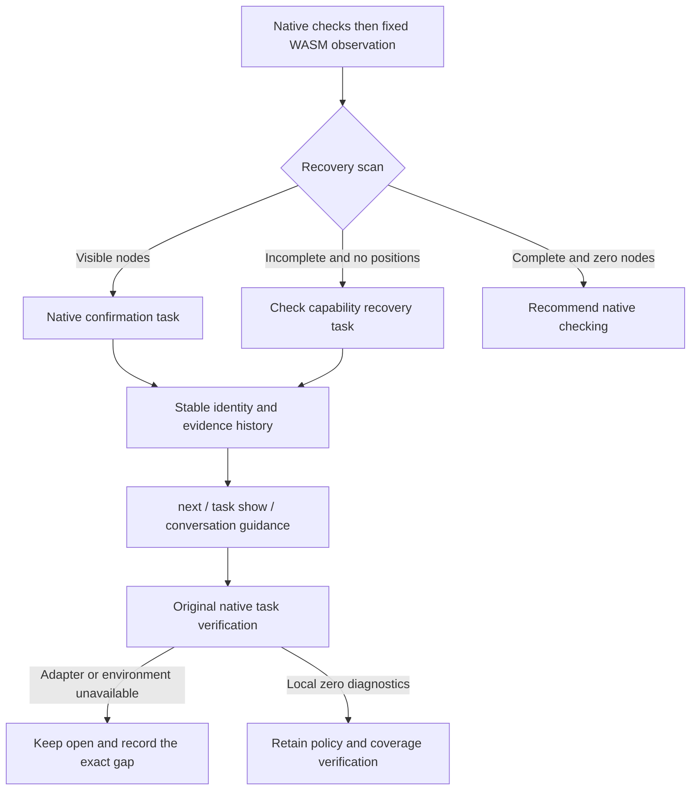


### Automatic native Erlang discovery for task rechecks (current source)

`codeguard task verify "$TASK_ID" . --format=json` (with `TASK_ID` set to the actual `task_id` returned by `next`) reuses lint/check selection for existing Erlang syntax tasks: explicit `--erl-tool` takes priority; otherwise the first executable erl in an absolute invoking-PATH directory is fixed. Rechecks verify OTP 28, current source and tool bytes while retaining leases, budgets, events and existing report versions. Both candidate-origin and native-first tasks can be rechecked; repair-ready Hooks use the same entry.

Only an absent tool produces `erlang_tool_not_found_on_path`; empty/relative PATH entries and non-executable files are ignored. An invalid explicit tool, unsupported selected version or execution failure never selects a later tool or installs one. After a valid observation, `next` supplies explicit recheck argv for the actual tool so later PATH changes cannot replace that entry. Local zero diagnostics still do not close tasks automatically; preprocessing, trusted policy and complete project capability remain separate obligations. See [recheck discovery acceptance](../tests/acceptance/erlang-recheck-discovery.md). Public npm 0.1.4 does not contain this batch.

### Native confirmation of unlocated Swift observations (current source)

An existing Swift confirmation task now accepts `codeguard task verify "$TASK_ID" . --swift-tool /absolute/path/to/swiftc --format=json`, where `TASK_ID` comes from actual `next` output. `hook execute` accepts the same option for `repair_ready`. The caller supplies an installed Apple Swift 6.4 compiler; this path does not install tools or execute editable paths from historical reports. Missing tools receive an existing-compiler recovery action; unsupported versions and execution failures retain the task.

Rust reads and rechecks bounded source bytes, then runs `swiftc -frontend -parse -diagnostic-style llvm -no-color-diagnostics -` with frozen stdin, `/` as cwd, a cleared environment and the shared deadline. Only native error rules and positions enter agent guidance; raw diagnostic text is not treated as an instruction. Columns are UTF-8 bytes and must fall on character boundaries. Unknown output, exit/diagnostic contradictions, timeout, invalid positions and tool changes remain incomplete. The tool digest binds the launcher, not the entire Swift installation.

Native errors make the same task actionable for source repair. Source or tool changes withdraw old positions. A clean parse records `candidate_absent_unverified_policy` without automatically closing the task or satisfying project lint, type checking, macro/conditional-compilation context, build, security or delivery obligations. Existing no-progress budgets still apply. Swift grammar qualification and the 32-language precision conclusions are unchanged; public npm 0.1.4 does not contain this extension.

New protocols are `syntax_task_recheck` 0.4.0, `task_verification_preview` 0.15.0, `repair_brief_preview` 0.6.0 and Hook feedback 0.9.0 (task summary 0.3.0). Aggregate `check` uses 0.39.0 when `next` contains a native Swift brief; other paths retain 0.38.0. Historical schemas remain unchanged. See [Swift native-confirmation acceptance](../tests/acceptance/swift-native-task-confirmation.md) for actual reports and limits.

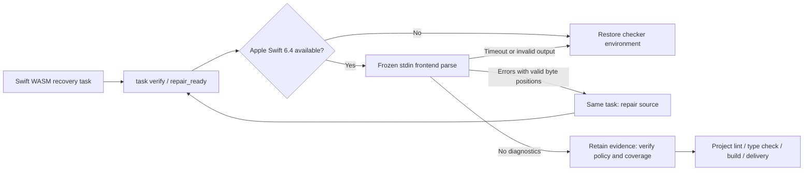


### Actual Claude lifecycle acceptance and fresh-task guidance

Claude Code 2.1.273 now has actual session-local plugin-source evidence for confirmed saves, repeated saves, an execution-time filesystem write failure, native Zig 0.16.0 rechecks before/after repair, stable task identity and one Stop continuation followed by a reentry guard. The locked public runtime remains 0.1.4, independently of current development source. Native diagnostics changed from one to zero; the task stayed open and delivery remained not evaluated. Edit argument validation failed before execution and produced no failure Hook in this host; the separate EACCES write exercised PostToolUseFailure. This is not marketplace installation, trusted closure, complete native-first coverage or multi-host acceptance. See [actual host evidence](../tests/acceptance/claude-host-prepared-runtime.md).

The actual session exposed incorrect first-task guidance claiming the Zig adapter was unavailable although its native recheck worked. Development `next` / `task show` now distinguish implemented Zig 0.16.0, OTP 28 and Apple Swift 6.4 adapters from unverified local tool readiness, using the bound original report and explicit tool arguments. Read-only guidance does not execute or install a checker, trust executable paths in editable task records, authorize source repair before native confirmation, or close a task. Unsupported languages retain a concrete capability decision; existing native history keeps precedence. This correction is not in the locked public 0.1.4.

Fresh native-confirmation guidance uses `repair-brief-preview` 0.7.0 to bind the language, supported tool version, tool-selection option, and `tool_readiness: not_evaluated`. Aggregate checks use `check-feedback` 0.40.0; `task show` preserves the same recheck arguments in its outer action. The agent must replace the placeholder with a verified installed tool path. Preparation does not establish readiness or native execution. Historical schema definitions remain unchanged.

### Native-first Kotlin single-file checking (development source)

`codeguard lint kotlin FILE.kt [--kotlinc-tool ABS_PATH] [--timeout 30s] --format=json` selects an explicit tool first, otherwise the first `kotlinc` in absolute invoking PATH entries. The current adapter supports Kotlin/JVM 2.4.10. Only an absent tool uses bundled WASM; a selected native failure remains visible. Frozen ordinary `.kt` files are compiled privately, without `.kts`, project build scripts or compiler plugins.

Only `[SYNTAX]` becomes `kotlin.syntax`; other diagnostics retain project-context limitations. Verified UTF-16 columns are also mapped to UTF-8 byte columns. Unknown output, redirected launchers, changed input and interrupted budgets cannot produce success. Missing backends or incomplete native checks require further native confirmation; an observable, complete zero-recovery WASM scan recommends native installation without granting project approval. The feedback schema is `kotlin-lint-feedback` 0.1.0.

Existing stable tasks now support task verify and repair_ready; aggregate feedback projects their current guidance. Initial check/file_changed now selects Kotlin native compilation first and synchronizes stable tasks. Complete Kotlin lint/comments, compiler JAR/JDK identity, version coverage and release acceptance remain open. Public npm 0.1.4 excludes this increment. See [single-file acceptance](../tests/acceptance/kotlin-native-single-file.md).

### Kotlin stable-task rechecks and agent feedback (development source)

Existing Kotlin WASM confirmation tasks support `codeguard task verify TASK_ID . --kotlinc-tool ABS_PATH --format=json`; omission reuses the standalone PATH selection. `repair_ready` through `hook execute --kotlinc-tool ABS_PATH` retains the task, lease and attempt history. `next` and `task show` derive tool guidance from bound facts rather than executing editable task Markdown.

Mixed native syntax and project-context diagnostics retain current syntax positions for repair while exposing unresolved context. Source or tool changes withdraw old positions. Native zero diagnostics advances to policy/coverage verification without repeated editing or installation. Rechecks do not automatically close tasks; Kotlin trusted closure remains unwired. Aggregate check feedback carries the current brief; initial check/file_changed now invokes the Kotlin native adapter for ordinary .kt files.

Protocols are syntax recheck0.5.0, task preview0.16.0, historical brief0.8.0, initial preparation brief0.9.0, Hook feedback0.10.0 and aggregate feedback0.41.0. Previous schema bytes remain unchanged. See [Kotlin task-recheck acceptance](../tests/acceptance/kotlin-native-task-confirmation.md).

### Kotlin first native observation (development source)

`check all . --kotlinc-tool ABS_PATH` and confirmed `file_changed` accept the same explicit tool; omission discovers invoking PATH. A selected native failure stays visible and does not switch to WASM. Only an absent compiler uses the existing candidate fallback. At most 64 ordinary `.kt` files share the request deadline; `.kts` is not compiled by this path. Repeated observations update one stable task, and native zero diagnostics does not automatically close it.

New reports use aggregate0.42.0, file-changed Hook0.11.0, scan0.1/0.2, native origin0.4.0, native-origin recheck0.6.0/task preview0.17.0 and first-native brief0.10.0. Existing WASM-origin rechecks retain their previous protocols. See [first-native acceptance](../tests/acceptance/kotlin-native-first.md). Full project lint, compiler/JDK identity, trusted closure and public release remain open.

When the bound first report contains incomplete, unlocated recovery, later missing-tool or stale native history preserves the limitation in `next` / `task show`: do not edit source before native confirmation, and follow the concrete environment recovery steps. Current native syntax diagnostics remain actionable; current zero diagnostics still require policy and coverage verification. See [native-history guidance regression](../tests/acceptance/unlocated-native-history-guidance.md).

### Native-first Swift single-file feedback (development source)

`codeguard lint swift FILE.swift [--swift-tool ABS_PATH] [--timeout 30s] --format=json` selects an explicit compiler first, otherwise the first executable `swiftc` in absolute invoking PATH entries. The current adapter supports Apple Swift 6.4 frontend parsing of frozen stdin. Only tool absence enables the bundled WASM candidate; a selected compiler's failure stays visible. Verified positions use UTF-8 byte columns. Source changes or entry redirection withdraw diagnostics, and timeout/cancellation remain incomplete/cancelled rather than source violations.

The `swift-lint-feedback`0.1.0 report distinguishes a required native confirmation for incomplete or hidden recovery from a recommendation after complete zero recovery. It never grants full lint or delivery approval: SwiftLint, comments, type checking, dependencies/security and project builds remain obligations. Compiler identity covers the selected entry, not the entire toolchain. Project-wide Swift native observation is now connected as described below; full language/release qualification remains open; initialized-workspace task connection is described below. Public npm0.1.4 excludes this increment. See [single-file acceptance](../tests/acceptance/swift-native-single-file.md).

### Swift project native observation (development source)

`check all . [--swift-tool ABS_PATH] --format=json` parses at most 64 ordinary Swift files under one shared deadline and reports unobserved files. Selected native failure never changes into a WASM result; only tool absence keeps candidate fallback. `check-feedback`0.43.0 / `swift-parse-scan`0.1.0 preserve current byte locations, selection and recheck argv. Source/tool changes withdraw positions; zero diagnostics do not prove SwiftLint, types or builds. This historical protocol describes an uninitialized workspace with `not_connected` task references; initialized-workspace task connection is described below. See [project observation acceptance](../tests/acceptance/swift-native-project.md).

Confirmed saves through `hook execute . --swift-tool ABS_PATH` reuse the Swift scanner for selected paths only. Missing tools keep candidates; selected failures do not switch. `hook-execution-feedback`0.12.0 / `hook_fast_feedback`0.4.0 expose current native positions and the unconnected task state. The CLI Claude adapter emits bounded counts/byte positions without tool diagnostic text; mixed candidate errors still require native confirmation. Actual installed-host acceptance, stable native tasks and the full repair loop remain open. See [save feedback acceptance](../tests/acceptance/swift-native-hook.md).

### Swift native-first repair workbench (development source)

In an initialized `.codeguard/` workspace, `check all` and a confirmed successful-save `hook execute file_changed` synchronize Swift native syntax findings or environment blockers into stable tasks. Repeated observations reuse the same task. `next` and `task show` expose evidence, rule basis, allowed scope, repair steps, recheck commands, history and closure conditions. An uninitialized workspace reports a disconnected workbench; synchronization failures remain blockers. Standalone `lint swift` does not create tasks yet.

`codeguard task verify TASK_ID . [--swift-tool ABS_PATH] --format=json` selects an explicit tool or discovers one in the invoking PATH for native-first tasks. Existing WASM-origin tasks retain their explicit-tool contract; editable historical paths are not executed. Diagnostics request source repair. Zero diagnostics records `candidate_absent_unverified_policy`; the same task stays open pending full lint, type, build and delivery checks.

Native-first protocols use observation 0.5, scan 0.2, check 0.44, initial brief 0.11, save Hook fast 0.5 / outer 0.13, and recheck inner 0.7 / outer 0.18. Existing verification briefs retain 0.6, and historical schemas remain unchanged. Actual Apple Swift 6.4 executions verified stable task references across repeated scans, saves and rechecks before and after repair. This is not installed-host or trusted-closure acceptance and is excluded from public npm 0.1.4.

### Recover missing task projections

`codeguard work sync . --format=json` now restores missing Markdown for committed facts under the workspace sync lock, imports new reports, and rechecks missing projections. Recovery reads structured facts, the current RepairBrief, original report hashes and consumption markers. It does not run checkers. Existing regular task files, including notes and checkmarks, retain their exact bytes. Symlinks, directory conflicts, invalid facts, changed origin hashes and uncommitted origins remain incomplete. Recovery examines at most 1,000 facts.

The readable task contains evidence, rule basis, allowed scope, steps, recheck argv, history and closure conditions. Local absolute paths in recheck arguments become verification placeholders; use `task show` for current instructions. Recovery never closes findings, changes original facts/events/consumption markers or attempt history, or grants delivery approval. Reports use `work_sync_preview` 0.3.0 with a positive `restored_task_projections` count only when recovery occurs; other runs retain 0.2.0.

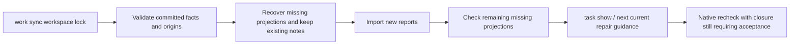


## Next steps for independent source findings

When the first source finding is waiting for its owner or has exhausted its retry budget, and no prerequisite blocker exists, next can select another actionable or verification-required finding on a proven independent physical source. next_actions and human output retain read-only task show references for deferred findings. Their facts, budgets, leases and gate effects remain unchanged. Overlapping targets, aliases, unknown scope, invalid facts and failed reports retain conservative handling. The complete module dependency graph remains incomplete; non-Unix keeps the original selection. See the [actual acceptance evidence and full report example](../tests/acceptance/next-independent-source-work.md).

### Scoped Swift syntax task lifecycle (development source)

A protected host can call `verify_swift_task_resolution` to compare the original counterexample and current source with Apple Swift 6.4. Policy 1.2.0 and evidence 0.3.0 remain separate from Zig/Erlang protocols; native-first tasks retain a null grammar identity. An original parse diagnostic, changed source, and a complete clean recheck with the same tool permit a scoped `code_fixed` event. Repeated verification is idempotent; an ordinary `task verify --swift-tool` recheck reopens the same parent chain on recurrence. A valid original sample requires false-positive review; tool failures or identity changes cannot close the task. The host supplies independent trust and signatures. Default plugin integration and public distribution remain incomplete, as do SwiftLint, type checking, project builds, and full delivery acceptance. See [lifecycle acceptance](../tests/acceptance/swift-task-resolution-lifecycle.md).

### Scoped Kotlin resolution and context blockers (development source)

`verify_kotlin_task_resolution` reuses the host SDK with kotlinc-jvm 2.4.10. Policy 1.3.0 and evidence 0.4.0 are language-specific; native-first tasks keep a null grammar identity. The original diagnostic must have coherent UTF-16 and UTF-8 coordinates. Changed source and a complete clean recheck permit a scoped `code_fixed` event. Context-only errors remain pending verification. Mixed syntax and context errors retain the known finding and allow ordinary `task verify --kotlinc-tool` recurrence to reopen the same parent chain even when completion is incomplete. The host supplies independent trust. Tool identity currently covers the launcher, with full JAR/JDK/project identity, default plugin closure, lint/type coverage, and publication still pending. See [acceptance](../tests/acceptance/kotlin-task-resolution-lifecycle.md).


Development-source Zig native routing (2026-10-05): `check all`, `check zig` and selected-file editing now reuse the frozen Zig 0.16.0 AST probe. Explicit/PATH selection runs native first; selected-tool failures retain an incomplete observation without switching to WASM. Missing tools retain candidate fallback. Source or tool-entry changes withdraw old positions; at most 64 files are observed under the shared deadline, with remaining scope visible. Check feedback 0.46, aborted feedback 0.15 and Hook feedback 0.14 are separate protocols; reports without Zig keep previous versions. Claude feedback includes bounded native rule IDs, positions and the original recheck instruction. First-native Zig task creation is now connected as described below: native reports expose only actually synchronized task IDs, and clean AST observations do not close historical tasks or prove complete lint/build. Public npm 0.1.4 and the plugin lock are unchanged.

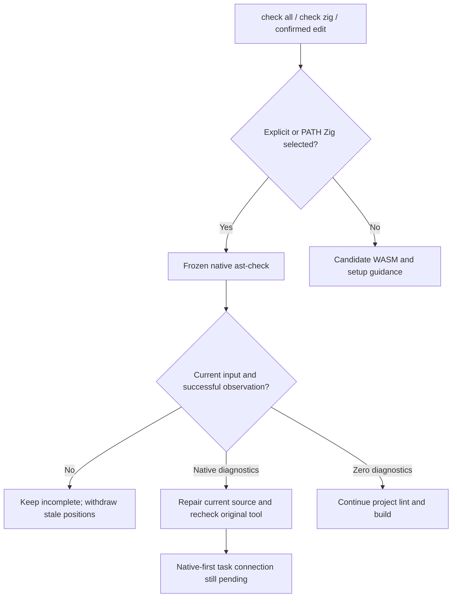

### Native-first Zig tasks (development source)

In initialized workspaces, `check zig`, `check all`, `lint zig` and edit Hooks synchronize one stable task per workspace/source scope. A newly clean file creates no repair task. Clean rechecks of existing tasks record `candidate_absent_unverified_policy` and retain the open task. `next` and `task show` expose bounded native positions and original-tool arguments; `task verify TASK_ID . [--zig-tool ABS_PATH] --format=json` and repair_ready record native rechecks. Native-first grammar identity is null; native diagnostics must not request grammar edits.

New protocols: observation 0.6, bound scan 0.2, aggregate 0.47, single-file 0.3, brief 0.12, task-show 0.2, recheck inner 0.8/outer 0.19, edit Hook 0.16 and recheck Hook 0.15. Historical schemas remain unchanged. Actual Zig 0.16.0 validated broken and repaired inputs. Trusted SDK closure for native-first Zig tasks is described below. Default installed-host integration, full lint/build and distribution remain incomplete. Public npm 0.1.4 is unchanged. See [acceptance](../tests/acceptance/zig-native-first-workbench.md).

### Trusted native-first Zig resolution (development SDK)

A protected host can call `verify_zig_task_resolution` with independently signed policy 1.4.0 for native-first observation 0.6.0. Grammar must be null; legacy WASM-origin policy 1.0.0 retains its scope. An original same-tool diagnostic, changed source and a complete clean same-tool recheck permit scoped `code_fixed` with evidence 0.5.0. Repeated verification is idempotent; ordinary `task verify --zig-tool` positive recurrence reopens the same parent chain. Valid original samples require false-positive review. Unexpected output, invalid positions, changed tools or missing trusted context cannot close the task. The host independently supplies trust. Default plugin/public npm integration of that provider remains incomplete; local task records do not authorize delivery. See [acceptance](../tests/acceptance/zig-native-first-resolution.md).

## Explicit native differential development replay

The Rust `evaluate_native_grammars` example selects samples for explicitly supplied Zig0.16.0, OTP28, Apple Swift6.4 and kotlinc-jvm2.4.10 from the same frozen 32-language corpus. It reuses native adapters and the existing WASM worker. All 32 languages remain in inventory; unselected tools, missing adapters, incomplete native observations and hidden WASM recovery stay unresolved. TP/FP/FN/TN include only jointly decidable syntax samples. Located Kotlin syntax diagnostics survive mixed context blockers while execution remains incomplete. Changed tools/entries or program bytes withdraw classifications. Reports remain incomplete with zero qualified grammars and create no tasks or whitelist approvals. Reused adapters, regression samples and entry-artifact hashes do not prove independent holdout or full toolchain identity. See [native differential acceptance](../tests/acceptance/native-grammar-differential.md) for commands and actual evidence.


### Isolated Python native syntax comparison

Development replay now accepts explicit Ruff0.16.8 with the Python3.12 target. Frozen stdin, `--isolated --select E9 --ignore-noqa --no-cache` excludes project configuration and ordinary lint. Only consistent located `invalid-syntax` diagnostics classify syntax errors; F401, wrong paths/positions, changed versions or contradictory reports remain incomplete. Report0.2 preserves historical0.1 bytes and does not expand trusted task-closing authority. The18-case actual replay found two WASM false negatives: an empty function suite and incorrect indentation. Python remains unqualified; see [Python native differential acceptance](../tests/acceptance/python-native-grammar-differential.md).

Python development differential 0.3 measures raw grammar separately from the parser-plus-structure candidate. Existing `comparison` and TP/FP/FN/TN stay intact; verified rule identity and source positions, `combined_candidate_comparison` and a separate denominator are added. Truncation, cancellation and program changes never become clean candidates; native identity changes withdraw both comparisons. Candidates still require native confirmation, historical 0.1/0.2 reports remain unchanged, and neither qualification nor delivery authority expands. See [layered acceptance](../tests/acceptance/native-structure-differential.md).

JavaScript development differential now uses fixed Node 24.18.0 with isolated `--check --input-type=module`, a cleared environment, frozen stdin, a shared deadline and entry/artifact checks before and after execution. Report 0.4 records the explicit module goal and only verified source-line locations; unknown output or tool changes remain incomplete. It neither infers project CommonJS/ESM settings nor replaces ESLint. Node has a separate 128 MiB artifact budget; other checker budgets stay at 64 MiB. See [JavaScript native acceptance](../tests/acceptance/javascript-isolated-native-differential.md). The actual 18-case module comparison retains 5 TP / 0 FP / 2 FN / 11 TN: top-level return and duplicate bindings remain missed, with 0/32 qualified grammars.


### Empty-block structural facts (integration pending)

Rust runtime now provides `scan_wasm_empty_blocks`, traversing the full tree for blocks with no non-comment named statement and retaining parent kinds, byte positions and exhausted budgets. These facts are distinct from raw ERROR/MISSING and cannot authorize a language violation: a legal empty Rust function also produces a fact. The fixed candidate Python required_suite rule now reaches the private worker, explicit probe and single-file lint/work sync confirmation task through separate versioned recovery and structure fields. Aggregate check now preserves structure evidence and the same task identity through feedback0.48 and generic confirmation0.7; trusted native closure remains incomplete; the two raw Python grammar false negatives remain open. See [structure task integration](../tests/acceptance/python-structure-lint-task.md). See [structural-fact acceptance](../tests/acceptance/wasm-empty-block-facts.md).

See [aggregate structure acceptance](../tests/acceptance/check-python-structure.md); this does not certify grammar quality or the full delivery gate.

The isolated Python native probe now rechecks the requested entry and frozen bytes after version detection and before syntax execution; changed entries do not trigger a second invocation. It also verifies continuity afterwards. See [native-entry acceptance](../tests/acceptance/python-native-tool-continuity.md). Trusted Python closure still requires stable task identity, original-report and approved target-version integration; the development py312 probe does not authorize project delivery.

Python candidate confirmation now rechecks only its original single-file scope through the existing project Ruff configuration and native execution chain. Feedback 0.18 and task preview 0.20 bind the consumed first report and current source; neither grants project coverage nor trusted task resolution. Missing or modified original receipts reject execution. See [acceptance](../tests/acceptance/python-confirmation-scoped-recheck.md).


### Python native syntax repair feedback (0.19 / 0.21)

Matching `invalid-syntax` diagnostics in Ruff normal and ignore-noqa runs remain native syntax errors instead of suppression-audit failures. An EOF diagnostic can use the preceding nonempty source as its stable task anchor without changing native coordinates. Single-file confirmation feedback 0.19 and task preview 0.21 distinguish remaining syntax errors as `still_present` and provide source-repair guidance. A complete recheck without syntax errors only yields `candidate_absent_unverified_policy`; it cannot close a task. Historical 0.18 reports retain their event semantics, and source or configuration changes withdraw current conclusions. See [native syntax feedback acceptance](../tests/acceptance/python-native-syntax-audit.md).


### Python resolution prerequisites: original source and target version

The read-only host API `validate_python_task_original_source(root, task_id, source)` checks both first-report families, consumed receipts, frozen bytes and recovery/structure positions. After repair, it still accepts the original bytes and rejects substituting current bytes. The isolated syntax probe can receive an explicit Python target and rejects invalid targets before tool resolution; the existing development differential retains py312. These prerequisites do not provide signed approval, project target provenance or trusted resolution. See [acceptance](../tests/acceptance/python-resolution-prerequisites.md).


### Native Ruff lint target observation

`RuffSettingsObservation::explicit_python_target()` returns only an explicit lint target observed in the pinned Ruff settings. It requires one `linter.unresolved_target_version` and an empty `linter.per_file_target_version`; implicit none, missing/duplicate fields, unknown versions and unresolved per-file targets return specific reasons. Formatter/analyze targets are not substitutes. This internal observation shares the native tool/source/configuration checks, leaves the public settings shape unchanged and does not authorize resolution. See [acceptance](../tests/acceptance/python-native-target-settings.md).


### Shared event commit for scoped tasks

Native syntax services now separate rechecks from `commit_resolution`. Before committing, domain evidence must match the redacted native pair for identity, original/current source, tool, adapter, grammar/approved policy and native-pair digest. Language entry points still verify signatures and execute native rechecks. Shared commit logic retains idempotency, policy-change reconciliation, parent-chain conflicts and recurrence, without granting project delivery. This prepares Python integration; Python trusted resolution is not implemented yet. See [acceptance](../tests/acceptance/task-resolution-commit-boundary.md).


### Scoped Python native syntax resolution (policy 1.5 / evidence 0.6)

The host SDK `verify_python_task_resolution` binds an independently signed policy to the task, consumed first report, original source, grammar, Ruff artifact, adapter, explicit lint target and project configuration digest. Rust invokes native Ruff against original stdin and the current scoped file. The current scan retains normal/ignore-noqa comparison and effective settings. Closure requires native syntax diagnostics on the original source, changed current source with complete zero syntax diagnostics, and stable inputs and policy bindings. Native counterevidence on the original enters false-positive investigation. Missing tools, unresolved targets, changed configuration and incomplete runs cannot close a task; formatter targets and implicit defaults cannot supply the lint target.

Both first-report families retain one task and append-only lifecycle history. Closed evidence 0.6 leaves historical protocols unchanged. Repeated verification is idempotent; recurrence preserves the previous closure. Ordinary verification may reopen but cannot authorize a new closure using a historical policy. Independent signing fixtures do not certify production host trust integration, project delivery or grammar qualification. See the [scoped acceptance record](../tests/acceptance/python-task-resolution-lifecycle.md).


Python3.14 template strings provide real native counterevidence: the pinned WASM reports ERROR while Ruff accepts identical bytes under explicit py314 and rejects them under py313. After scoped SDK false-positive review, next now reads the same Python confirmation task lifecycle and guides grammar/version investigation. Current source/configuration invalidation takes precedence over historical counterevidence. This does not approve a whitelist, close the task or rewrite historical corpus statistics. See the [native counterevidence acceptance](../tests/acceptance/python-template-string-counterevidence.md).


### Syntax confirmation actions and retry budgets

A Python syntax-confirmation task uses `repair-source` when its current native observation is `still_present` and source/configuration bindings remain valid. Missing tools, incomplete observations and stale inputs do not authorize source edits from historical positions. For the same syntax-confirmation task and unchanged input, `restore-checker-environment` and `repair-source` share the existing no-progress budget. Switching actions cannot erase failed attempts. Append-only events retain their original action and fingerprint; other task families keep their existing accounting. New inputs and verified progress follow existing reset rules. Exhaustion requires a concrete diagnosis or decision and grants neither closure nor gate acceptance.


### Unified scope for TypeScript module sources

`detect`, `check all` / `check typescript` and `file_changed` hooks now include `.mts/.cts` and `.d.mts/.d.cts` in the existing TypeScript scope. They use the pinned TypeScript grammar, never TSX. Complete same-file native ESLint observations retain priority; files in another build root without native context keep independent candidate fallback. Repeated suspected results update the same confirmation task; valid declarations create no new syntax blocker. Edit hooks check only confirmed changed files. Extension recognition does not certify module resolution, type checking, grammar qualification or delivery. See [module-extension acceptance](../tests/acceptance/typescript-module-extension-routing.md).


### Explicit R and C++ source suffixes

Project discovery and WASM candidate routing include `.R`/`.r` and C++ `.C`/`.cp`/`.CPP`/`.c++`/`.cxx`/`.hxx`, retaining existing suffixes. Case remains significant: `.C` uses C++, while shared `.h` gets no speculative C++ grammar route. Missing native tools still produce actual candidate observations and `incomplete` delivery; suffix coverage does not qualify a grammar or grant acceptance. See [suffix acceptance](../tests/acceptance/r-cpp-extension-routing.md).


### Conversation projection of pinned limitations

Candidate reports, independent structural rules and native diagnostics retain distinct provenance. Terminal feedback exposes bounded specific limitations. Claude resolves them from the bundled manifest for observed candidate languages, deduplicates and limits text, and does not use external report messages or source. Summaries reserve the incomplete-qualification and unevaluated-delivery boundary. Known compatibility issues still need native confirmation and do not expand allowlists. See [acceptance](../tests/acceptance/grammar-limitation-conversation-feedback.md).
### Go whole-file structural candidate lane

Source builds use a language-neutral runtime root-child observation and a Go adapter rule to supplement permissive fragment parsing. The rule is explicitly whole-file, versioned and unqualified. Raw recoveries remain separate; a candidate never authorizes a source violation, guessed package name or task closure.

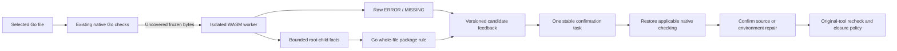

Probe, aggregate checking and save feedback now carry the Go candidate; the Go confirmation-task native recheck now uses an explicit SDK; trusted closure remains pending. Repair instructions preserve source until native confirmation and keep the task open after a zero-candidate rescan. See [acceptance](../tests/acceptance/go-package-structure.md).

Go candidate-task rechecks now accept `--go-tool /absolute/sdk/bin/go` and invoke the pinned SDK companion `gofmt -e /dev/stdin` on frozen whole-file bytes. Recheck0.9 / task feedback0.22 retain native diagnostics, tool and companion identities, first-report receipts and failed attempts. The repaired source can be observed without invalidating the original candidate history. Native zero diagnostics retain an open task pending approved policy and coverage. See [acceptance](../tests/acceptance/go-package-structure.md).

### Native-first Go lint with missing-tool candidates

Source-built `codeguard lint go . --format json` prefers explicit `--go-tool`, then executable Go from absolute caller PATH entries. Selected tool/version/execution failures remain native failures. When no native tool exists, the built-in WASM produces bounded whole-file recovery and structure candidates. Candidates or incomplete prechecks require a project-appropriate native tool; zero candidates in the completely observed bounded scope only recommend preparation. Native obligations remain incomplete and exit3 is retained. Builds without WASM report that capability gap. Repeated lint/check reuse the confirmation task; adding a package declaration does not close it. Public npm0.1.4 is unchanged. See [limited acceptance](../tests/acceptance/go-lint-fallback.md).

```mermaid
flowchart LR
  A[lint go] --> B{Explicit or absolute PATH Go}
  B -->|Selected| C[Native go vet]
  C --> D[Preserve native report and failures]
  B -->|Absent| E[Bounded whole-file WASM candidates]
  E --> F{Candidates or incomplete scope}
  F -->|Yes| G[Require native preparation and confirmation]
  F -->|No| H[Recommend native preparation]
  G --> I[Stable task and native task verify]
  H --> J[Native obligations remain incomplete]
  I --> J
```


### Limited Go task resolution by a protected host

The Unix SDK exposes `verify_go_task_resolution(&GoTaskResolutionRequest)`. Independently signed [policy1.6.0](../schemas/task-resolution-policy-v1.6.schema.json) binds Go1.23.4, same-SDK gofmt bytes and canonical companion-path digest. Original native diagnostics, current zero diagnostics and stable inputs are all required to close the same task; an ordinary original-tool recheck records recurrence and reopens it. Companion changes, native counterevidence and missing/tampered history cannot close it. [Evidence0.7.0](../schemas/task-resolution-evidence-v0.7.schema.json) never grants project delivery. The real Go pair was locally verified using a test host trust fixture; default production host integration remains open. See [acceptance](../tests/acceptance/go-task-resolution-lifecycle.md).


### Read-only current-source command support catalogue

`codeguard help --format json` queries C01–C36 and additional public entries. `codeguard help task verify --format json` selects an exact command prefix. The command_help0.3 report separates implemented/partial/planned/unavailable_build and executable; executable means an entry exists, not that checking or installation completed. Grammar probe is unavailable without the WASM feature and remains unqualified with it. Unimplemented standalone MCP and other operations are explicitly planned.

```bash
codeguard help --format json
codeguard help lint --format json
codeguard task verify --help
```

Help does not inspect projects or start tools. Exit0 means the query completed, with delivery_decision still not_evaluated. Exact-prefix trailing help is supported; full language/path/tool-argument contextual help and complete parameter generation remain open. See [actual reports and acceptance](../tests/acceptance/command-help-current-support.md). Public npm0.1.4 does not contain this source increment.


### Native-first standalone Rust lint

The current source supports `codeguard lint rust . --cargo-tool /absolute/cargo --format json`. It reuses the aggregate check's locked/offline all-targets Clippy observation, input validation and workbench synchronization, executing only lint. Initialized workspaces retain one stable task per finding and return the next action. Recheck with `codeguard task verify TASK_ID . --cargo-tool /absolute/cargo --format json`; zero diagnostics still require rule/policy review and do not automatically close the task.

When no explicit Cargo is selected and no executable is found on absolute PATH entries, WASM builds provide bounded candidate prechecks. Candidates or incomplete observations require native tool preparation; zero candidates across the complete bounded scope recommend it. Explicit tool errors or native failures do not trigger fallback or installation. The JSON protocol is `rust_lint_feedback` 0.1 with delivery unevaluated; help 0.2 adds Rust while preserving historical 0.1 schemas. Source integration does not imply public npm availability or complete Rust qualification.

## Ruby single-file native syntax and task rechecks

Source builds add `codeguard lint ruby FILE.rb --ruby-tool /absolute/path/to/ruby --format=json`. This only observes fixed Ruby2.6.10p210 `ruby -c` with gems disabled and frozen UTF-8 stdin; user source is never executed. Explicit tool failures and unsupported versions do not trigger WASM fallback. Missing native selection uses candidate prechecks in WASM builds; candidates/incomplete checks require native preparation, while zero candidates recommend it. The `ruby_lint_feedback`0.1 report preserves native line numbers without fabricated columns, leaves project-version compatibility unverified and requires RuboCop, documentation, security and full project checks. Help0.3 adds Ruby without changing historical help0.1/0.2 schemas. Initialized workspaces reuse one stable confirmation task across WASM candidates and native observations. `next` retains native line positions and the verified `--ruby-tool` recheck argument; `task verify` records attempts and leaves zero-diagnostic tasks open pending policy/coverage review. Ruby syntax feedback0.3, native history0.9, recheck0.10, task preview0.23 and repair brief0.15 preserve old protocol versions. `codeguard check ruby ROOT --ruby-tool /absolute/path/to/ruby --format=json` and `check all` now reuse the bounded native syntax scan and stable task connector; selected failures do not switch to WASM. The shared deadline and64-file cap retain incomplete scope; native observations withdraw positions when source/tool identity changes. Aggregate feedback0.51 supports Ruby scan0.1/0.2 and brief0.15 without modifying old schemas. Full RuboCop/project lint and trusted closure remain pending. Public npm0.1.4 is unchanged.


Ruby edit feedback: source builds of `hook execute` / `hook claude post-tool-use` accept `--ruby-tool ABS_PATH` or select Ruby from the caller's absolute PATH entries. Only confirmed edited files are parsed under the event deadline. Selected failures do not fall back; absence retains WASM candidates. Bounded dialogue carries current line positions and real stable tasks without source/tool-message echoes or invented columns, and asks agents to verify project Ruby compatibility first. `repair_ready` rechecks using the selected tool and retains real evidence references; zero diagnostics do not close tasks. New closed protocols are edit feedback 0.19 (inner 0.10) and recheck feedback 0.20 (inner 0.6); old schemas are preserved. Actual installed-host triggering, complete RuboCop coverage, and public npm release remain unverified.

Ruby version declaration guard: source builds read the nearest `.ruby-version` between the source and project root, bounded to 64 ancestor levels and 4096 bytes. Only `2.6.10`, `2.6.10p210` and their `ruby-` forms match the fixed parser. Other explicit versions yield `ruby_project_version_mismatch`; aliases/ambiguity yield `ruby_project_version_unresolved`; unsafe links/read failures yield `ruby_project_version_unreadable`. None starts the old Ruby or falls back to WASM. Declaration bytes and nearer missing declarations are rechecked after parsing; changes withdraw diagnostics. Saved positions are also withdrawn when a new declaration is incompatible. Standalone lint locates a `.codeguard` workspace before a Git root or Gemfile, so nested Gemfiles cannot hide the workspace pin; the nearest module version declaration remains authoritative. Absence retains an unapproved preliminary observation. Gemfile constraints, JRuby/RVM, complete project profiling and release remain pending. See [version guard acceptance](../tests/acceptance/ruby-project-version.md).

The Ruby six-category candidate profile now records runtime dialects, project-lock version selection and conditional tool scopes. Native rules, full project coverage and platform qualification remain unverified. See [profile acceptance](../tests/acceptance/ruby-candidate-baseline.md).

## Native ShellCheck single-file inspection (partial capability)

`codeguard lint shell app.sh --dialect bash --shellcheck-tool /absolute/shellcheck --timeout 30s --format json` invokes ShellCheck 0.11.0 `json1` through Rust, preserving native SC rules, severities and ranges. Explicit sh/bash/dash/ksh/busybox are supported; zsh/fish declarations, shebangs and known filenames remain capability gaps. Missing tools produce setup guidance. No Shell WASM asset is available, so fallback remains explicitly unavailable.

An explicit absolute `--shellcheck-config` or the nearest ancestor rc is frozen in a private run directory (automatic discovery is bounded to 64 ancestors). HOME/XDG global configuration is not loaded. Project configuration status is independent of native execution with built-in rules. Frozen stdin avoids executing the inspected script; source, entry bytes, rc bytes and nearer missing rc witnesses are rechecked across phases. Linked rc, invalid encoding and external-sources enablement are rejected. No fix is applied. Tool dependency closure and full platform isolation remain open.

SC1071/1090/1091/1092/1134/1144/1145 represent environment/dependency blockers and may coexist with retained local SC2086 diagnostics. `json1` columns count Unicode scalar characters, with each tab counting one character. Invalid/partial reports cannot claim completeness. Free-text native messages and replacement payloads are not forwarded into repair instructions.

Without an initialized workbench, version 0.1.0 `shell_lint_feedback` includes seven-part repair guidance, original-tool recheck argv and official rule links. `task_workflow_status=not_integrated` and empty attempt history explicitly identify the missing persistence integration. Incomplete evidence yields investigation guidance without authorized source paths. Even native zero diagnostics leaves the overall command incomplete/exit 3 and delivery not evaluated. Project coverage, Dockerfile/IaC, security, trusted exceptions and task closure require independent implementation and acceptance. See the [partial acceptance record](../tests/acceptance/shellcheck-native-baseline.md).

## Shell native rule groups in the repair workbench

In an initialized `.codeguard` workspace, single-file `lint shell` now saves a separate 0.1.0 `shellcheck_workbench_observation` through existing report consumption, fact, append-only event and Markdown projection mechanisms. Feedback becomes 0.2.0 with actual synchronization status and stable task IDs. Uninitialized workspaces retain 0.1.0 local feedback and are not initialized automatically. Persistence/import failures remain explicit without erasing native results or inventing task references.

The stable unit is a workspace-relative file, explicit dialect and native SC rule group. All locations remain in the report. Different files/dialects stay separate; a group does not claim multiple occurrences are one semantic defect. Moving positions or adding another occurrence does not create another group. Tool, dialect, rc and source-dependency blockers share a per-file/per-dialect environment recovery task, with concrete reasons in each original report. Stale input becomes historical/environment evidence, not fresh actionable source findings.

`next` supplies 0.17.0 Shell guidance and `task show` supplies 0.3.0. Both preserve the Shell tool parameter in task verify argv bound to the task ID and absolute workspace. The initial report binds dialect and explicit rc; the tool entry must be revalidated. Source or original rc changes withdraw direct repair instructions and require a native rescan. Suppression, synchronization and zero diagnostics cannot close existing tasks. Shell-specific `task verify CG-… . --shellcheck-tool /absolute/shellcheck --format json` now provides a 0.24.0 local recheck through existing leases and failed-attempt history, binding the initial dialect, explicit rc and SC rule group. Outcomes distinguish still_present, rule_coverage_requires_review after a configuration change, suppression_requires_review for a possible disable comment, and candidate_absent_unverified_policy after a clean repair. Comment observation does not prove effective suppression. Trusted closure, recurrence and project-wide coverage remain unaccepted under 7.4. Editing or deleting Markdown cannot remove persisted facts.

Shell attempts use task claim, attempt start, attempt finish --outcome ready-to-verify and task verify; verification events bind the attempt ID. Two unchanged attempts that still expose the original SC rule yield needs_decision, and the third same-action attempt is rejected. Findings remain open and no whitelist is automatically approved. Existing Markdown retains its bytes; task show/next provide current guidance. See [acceptance evidence](../tests/acceptance/shellcheck-task-recheck-baseline.md).

```mermaid
flowchart LR
    A[Native discovery and stable task] --> B[next or task show]
    B --> C[claim and attempt start]
    C --> D[Repair and finish ready-to-verify]
    D --> E[task verify bound to original task]
    E -->|Original rule remains| F[Failure event bound to attempt]
    F -->|Budget remains| B
    F -->|Two unchanged attempts| G[needs_decision and reject third attempt]
    E -->|Candidate absent| H[Await trusted policy and coverage]
```

## Native checks over discovered project Shell files

`codeguard check shell . --shellcheck-tool /absolute/shellcheck --format json` and `check all` now run ShellCheck 0.11.0 over discovered Shell files under one deadline. Feedback 0.52.0 exposes `native_results.shell_lint`, a 0.1.0 shell_native_scan with per-file source hashes, dialects, original rc, native SC rules/scalar positions, input stability and workbench status. Human output shows native positions; SARIF projects current observations while keeping locations and native messages private.

Shebangs and explicit filename conventions supply dialect evidence. `--shell-dialect bash` supplies a default for undeclared files and cannot override zsh/fish declarations. Unknown or unsupported dialects stay incomplete; next requests a concrete dialect/checker decision rather than repeating an unsuitable installation. At most 64 files are checked; unobserved_count exposes overflow. local_check_complete describes these isolated native observations and proves no project source-dependency, category or policy coverage.

An initialized scan binds its requested root despite nested workbenches; an uninitialized scan creates no workspace. Repeated file/dialect/SC rule observations update stable tasks. Configuration or environment failures remain blockers. Source, scope, rc or tool changes withdraw current location authority. No Shell WASM fallback is fabricated. check shell still returns 3/not_evaluated, and check all remains incomplete. Security, CVE, sourced dependencies, trusted closure/recurrence, dedicated zsh/fish tools, Dockerfile/IaC and platform acceptance remain open.

```mermaid
flowchart LR
    A[Discovered Shell files] --> B[Per-file dialect and rc]
    B --> C[Native ShellCheck and shared deadline]
    C --> D[Recheck source scope config and tool]
    D --> E[Stable tasks bound to requested root]
    E --> F[next and task verify]
    C --> G[Per-file diagnostics and blockers]
    G --> H[Partial human JSON and SARIF feedback]
```

See [project Shell acceptance](../tests/acceptance/shellcheck-project-baseline.md).

### Shell edit and repair events

Rust `hook execute` and the Claude-shaped adapter route confirmed Shell edits to the same per-file ShellCheck path, accepting `--shellcheck-tool /absolute/path`. Only selected files run within the event deadline. Tasks retain their identity across `lint shell`, `check shell`, and edit events; an uninitialized workspace is not created automatically.

```mermaid
flowchart LR
    A[Confirmed Shell edit] --> B[Selected files and observed dialect]
    B --> C[Native ShellCheck and input revalidation]
    C --> D[Stable tasks and bounded dialogue]
    D --> E[Agent repairs]
    E --> F[Task-bound repair_ready]
    F --> G[Original-rule task verify]
    G --> H[Persist observation and retain closure requirements]
```

Edit feedback uses outer protocol 0.21 and inner 0.11, preserving earlier schemas. Dialogue includes current SC rules, Unicode scalar positions, persisted task IDs, and recheck commands; source and free-form tool messages are excluded. Missing tools, unsupported dialects, selected-tool failures, and persistence failures remain incomplete. No bundled Shell WASM fallback is claimed. Failed writes run no checker; repair-ready events call the existing task verifier, and zero diagnostics never close a task.

The [acceptance record](../tests/acceptance/shellcheck-hook-baseline.md) distinguishes real ShellCheck output, controlled fixtures, offline npm installation, and live host sessions. Claude-shaped replay does not prove acceptance in a real installed host or a complete project delivery gate.

CFQuery SQL comparisons require a database dialect. PostgreSQL accepts an empty SELECT list but rejects its DISTINCT variant; the fixed WASM reports zero recoveries for both. The isolated native evidence does not promote generic pending labels. See [dialect evidence](CFQuery-SQL-Dialect-Evidence.md); project SQL adaptation and grammar repair remain open.

Failed-write routing also accepts registered Go/Cargo/Maven and other checker configuration options, returning `not_run/write_failed` without starting tools or creating a workbench. Ownership/lease, unknown and malformed arguments remain rejected. This exception only applies to failed writes and does not silently enable unwired tools on confirmed edits. See [acceptance](../tests/acceptance/hook-failed-write-options.md).

## Go native syntax feedback after edits (local acceptance)

`hook execute . --go-tool /absolute/path/go --timeout 30s --format=json` prefers the companion gofmt from the fixed Go1.23.4 SDK for selected confirmed edits. It checks frozen stdin and revalidates both artifacts and source bytes without running source, installing dependencies or executing project-wide go vet. Missing tools retain WASM candidates; selected failures, missing companions, unverified versions and `//line` position remapping remain incomplete without switching checkers. Project language versions and all build conditions remain unaccepted.

```mermaid
flowchart LR
    E[Confirmed Go edit] --> S{SDK selected?}
    S -->|Yes| G[Same SDK gofmt on frozen stdin]
    G -->|Diagnostics| T[Update one stable syntax task]
    G -->|Failure| B[Keep environment blocker and diagnosis]
    S -->|No| W[Bundled WASM precheck]
    W -->|Candidate or incomplete| R[Require native confirmation]
    W -->|Complete zero recovery| I[Recommend native lint preparation]
    T --> V[task verify --go-tool original SDK]
    V --> O[Record attempt and evidence; unapproved task stays open]
```

Edit feedback uses outer0.22/inner0.12 and native-first observations0.10; historical schemas remain intact. Native and candidate observations share workspace/path/language task identity. Claude-shaped feedback exposes current Go rules, UTF-8 byte positions and actual task recheck guidance without source or free-text messages. Zero native diagnostics do not authorize closure: project go vet, types, dependencies, security and complete checks still apply. See [Go Hook acceptance](../tests/acceptance/go-native-hook.md).

Go native-first task guidance uses `repair_brief_preview` 0.18 with a `syntax-confirm-` observation reference. Actual task-recheck guidance retains 0.14 with a `syntax-native-` reference; existing schemas are unchanged. Final affected regressions: WASM 78 passed / 5 conditionally ignored, default 15 passed / 0 ignored. The earlier 1,461-pass full default run predates this final protocol correction.

Go's fixed 1.23.4 syntax SDK now statically checks the nearest `go.mod` and nearest `go.work` before editing or original-tool task verification. A newer minimum/suggested toolchain, ambiguous or unreadable declarations produce an environment observation without running that SDK or falling back to WASM. Changes during observation withdraw diagnostics; incompatible current declarations withdraw saved repair positions. This is a bounded compatibility guard, not general project toolchain or language-version acceptance. Evidence: [Go project version](../tests/acceptance/go-project-version.md).

### CFQuery static DISTINCT projection candidate

The fixed CFQuery grammar tokenizes SQL without validating every SQL clause. Codeguard now reports adjacent AST `SELECT DISTINCT FROM` keywords as an independent candidate, preserving raw ERROR/MISSING observations. String/identifier literals and CFML interpolation interrupt the sequence; comments can be ignored. `SELECT FROM users` remains unflagged by this rule because PostgreSQL permits an empty projection without DISTINCT.

```mermaid
flowchart LR
    A[CFQuery SQL fragment] --> B[Fixed WASM AST]
    B --> C[Raw ERROR / MISSING]
    B --> D[Adjacent SELECT DISTINCT FROM keywords]
    D --> E[Independent unqualified candidate]
    E --> F[Whole-file identity + fragment identity + file positions]
    F --> G[One stable confirmation task]
    G --> H[Resolve datasource, dialect, version and template context]
    H --> I[Applicable native SQL confirmation required]
```

The worker uses 1.3, explicit probe 0.4, project feedback 0.53, editing feedback 0.23/0.13, and saved candidate observation 0.11. Historical schemas and grammar assets remain unchanged. Embedded observations carry whole-file `source_sha256`, separate `fragment_source_sha256`, and restored file positions. Repeat scans share a task; candidate disappearance does not close it. `next` explicitly asks for datasource, dialect/version and dynamic-template/schema context: the CFQuery native task-verification adapter is still unavailable, and no project database is contacted automatically.

```bash
codeguard grammar probe cfquery query.sql --format=json
codeguard check all . --format=json
codeguard next . --format=json
```

Report example (selected fields, not a complete schema):

```json
{"language":"cfquery","recoveries":[],"structural_observations":[{"basis":"codeguard_structure_rule","rule_id":"codeguard.cfquery.distinct_projection","rule_version":"1.0.0","parent_syntax_kind":"program"}],"grammar_qualified":false,"status":"incomplete","delivery_decision":"not_evaluated","next_action":"confirm_candidate_structure_with_applicable_native_tool"}
```

This addresses one fixed native-counterexample at the candidate layer. It does not qualify the grammar, measure an independent holdout, infer every SQL dialect, validate injection safety or prove native adapter/release acceptance. Evidence: [CFQuery candidate acceptance](../tests/acceptance/cfquery-structure.md).


### Rust formatter parser differential (development-only)

The Rust-owned developer replay now supports explicitly selected Rustfmt1.9.0-stable on frozen stdin with private edition2024 configuration, empty environment, shared budgets and artifact/config continuity checks. Valid unformatted source is not a syntax finding; `--check` is not used. Only recognized, bounded stdin diagnostics are retained, including the measured EOF and E0765/exit101 cases; crashes and unlocated output remain incomplete. This fixed edition does not infer project edition, analyze external modules, replace Clippy/build checks, close tasks or implement Rust editing Hook routing. The captured 16-case comparison has 5TP/11TN/0FP/0FN/0unknown on this small non-holdout corpus; language qualification remains0/32. See [scoped acceptance](../tests/acceptance/rustfmt-controlled-native-differential.md) for the actual execution path, protocol and reproduction commands.


Rust selected-file parser preparation now resolves Cargo edition from bounded package/workspace declarations and rechecks declaration/source continuity between native calls. The scoped Unix library service has actual2015/2021/2024 counterexample evidence; selected-file edit Hook, stable confirmation tasks and original-tool rechecks are now connected; complete project and real-host acceptance remain open. See [project edition contract](Rust-Project-Edition-Syntax.md).

Rust edit feedback now reports safe lines, stable tasks and original Rustfmt recheck guidance while retaining Clippy/type/build obligations. See [scoped chain acceptance](../tests/acceptance/rust-native-hook.md).

Rust edit dialogue now provides an executable post-batch Clippy command and explicitly states that project lint did not run during editing. Original-task repair-ready retains current rule/line feedback and withdraws changed-input guidance; this is not a background queue or authoritative closure. See [project lint follow-up](Rust-Project-Lint-Followup.md).

Native-first and WASM-first Rust syntax tasks now share a protected-host SDK confirmation, scoped resolution and same-tool recurrence path. Native-first policy1.7/evidence0.8 retain grammar=null; WASM-first policy1.8/evidence0.9 retain the original grammar digest. Both bind the original counterexample and approved Cargo edition provenance; a native counterexample requests investigation, and incomplete or changed inputs cannot resolve. Production host approval integration remains pending; this does not qualify Clippy or project delivery. See [scoped acceptance](../tests/acceptance/rust-task-resolution.md).

See [WASM-first acceptance](../tests/acceptance/rust-wasm-task-resolution.md) for the actual execution path, protocols and counterexample routing.


```mermaid
flowchart LR
    A[First syntax task] --> B{Original evidence}
    B -->|Native| C["Bind original tool and edition provenance<br/>Policy1.7 / evidence0.8 / grammar=null"]
    B -->|WASM| D["Bind original grammar and approved edition<br/>Policy1.8 / evidence0.9"]
    C --> E[Same-tool counterexample and current-source rechecks]
    D --> E
    E -->|Original diagnosed and current fixed| F[Resolve scoped task]
    E -->|Original has no native diagnosis| G[Investigate possible false positive]
    E -->|Incomplete or changed inputs| H[Require verification]
    F --> I[Ordinary native recheck observes recurrence]
    I --> J[Reopen the same lifecycle chain]
```

This diagram describes the implemented source-level host-approved SDK path. Production automatic host approval integration remains pending; editable local history cannot grant project delivery permission.

Incomplete parser feedback now directs the agent to check the original source with the applicable native tool. If native confirmation accepts the source, investigate grammar version/compatibility or scan budgets; only actual native diagnostics guide source changes. Truncation alone does not establish a grammar error. This applies to project output, edit context, persisted tasks and next/task show; task identity and closure requirements are unchanged. [Acceptance](../tests/acceptance/incomplete-syntax-guidance.md)

### Shared JavaScript candidate entry points (current source candidate)

Standalone `lint typescript` selects native-first JavaScript checking by file extension and reuses bounded project observations and edit-hook task synchronization. Automatic discovery stays within the selected workspace; it cannot execute a parent project's checker. A selected native failure remains visible. Versioned entry protocols share rule identities, byte/position validation and stable ESLint task identities. A candidate-free observation cannot replace native confirmation or the project gate.

```mermaid
flowchart LR
    A[Standalone lint] --> B[Native-first within workspace]
    C[Project check] --> D[Shared bounded observation]
    E[Confirmed edit hook] --> D
    B -->|Context absent| D
    B -->|Entry available| N[Native ESLint]
    D --> F[Stable task and next]
    D --> G{No candidate and no pending task}
    G -->|Yes| H[Recommend native lint]
    G -->|No| F
    F --> N
    N --> I[Native recheck and existing closure contract]
```

Feedback 0.6 separates current observations from pending historical confirmation: an open task retains its ID and required native checking. Synchronization failures preserve candidates and identify workspace/report recovery. Actual hosts, full policy closure and all language qualifications remain pending. See [acceptance](../tests/acceptance/javascript-lint-candidate.md).

For standalone lint, every registry ID has an honest entry point. A native adapter gap does not establish that the tool is absent. Candidate parsing, shared task synchronization and original native confirmation remain separate capabilities.

```mermaid
flowchart LR
    A["lint language FILE"] --> B{Native adapter}
    B -->|Integrated| C[Native-first language command]
    B -->|Gap| D[Unknown native configuration]
    D --> E{Matching WASM available}
    E -->|Yes| F[Bounded candidate observation]
    E -->|No| G[Explicit incomplete feedback]
    F --> H[Shared stable confirmation task]
    H --> I[Native confirmation or adapter decision]
```


The Erlang project/edit path now applies native-first selection before bounded WASM structural fallback. Persistent task identity spans environment blockers, candidates and native rechecks; zero diagnostics alone do not close it. [Workflow and execution diagram](../tests/acceptance/erlang-form-workbench.md).

## Unified Java comments entry (source increment, not released)

`comments java [path]` reuses the existing native Javadoc probes. A file selects an explicit JDK21 local observation. A project selects recognized Javadoc configuration and its main sources only. Missing configuration does not launch Javadoc or produce comment violations. Explicit Maven context selects original-POM multi-file checking; failure never falls back to a single-file probe.

```bash
codeguard comments java File.java --java-home /absolute/jdk21 --format json
codeguard comments java . --java-home /absolute/jdk21 --maven-tool /absolute/mvn --maven-repo /absolute/repository --repo-sha256 SHA256 --timeout 60s --format json
```

The independent `java_comments_feedback 0.1.0` wrapper preserves the existing report under `native_observation`; the old `lint java --checker javadoc` protocol remains unchanged. Budget precedence is CLI, registered environment, project default, then built-in default. All native child work shares one deadline. Feedback exposes target kind, budget, observations and next actions. Zero local diagnostics still means `coverage_proven=false`, `delivery_decision=not_evaluated`, exit3 (130 on cancellation). No implicit installation or source changes occur.

**Scope limitation:** Maven multi-file task synchronization is connected; trusted closure/recurrence and actual host acceptance remain incomplete; standalone files can explicitly bind --workspace as described below. Trusted closure remains incomplete. This entry creates no fake tasks and does not close findings from a local probe. Replace the absolute tool paths and offline-repository digest with real current values.

### Javadoc project workbench integration (source increment)

For initialized projects, `comments java .` in JDK single-file mode saves local observations and synchronizes stable tasks using wrapper protocol `java_comments_feedback 0.4.0`. Unbound checks retain 0.1 local feedback; explicit-file workspaces are described below. Rule, relative file, source anchor and occurrence ordinal define identity; line numbers only locate evidence. Repeat scans append observations without duplicate tasks.

```mermaid
flowchart LR
    A[Native Java comments observation] --> B{Initialized project and JDK mode}
    B -->|Yes| C[Save digest-bound report]
    C --> D[Recheck source configuration and identity]
    D --> E[Merge source or preparation tasks]
    E --> F[Display workbench.next in feedback]
    B -->|No| G[Local feedback and concrete capability gap]
    C -->|Failure| H[Visible persistence error without fake tasks]
```

Missing configuration or incomplete execution creates preparation records, not source violations or new mandatory delivery obligations. Feedback exposes `workbench.status/new_findings/new_blockers/next`. Persistence failures return no fake tasks. Briefs and task text include evidence, rule basis, scope, steps, recheck and closure conditions. Local zero diagnostics leave prior tasks open with `task_verify_status=local_observation_only`; original-task rechecks are described below. Maven multi-file task synchronization is connected; trusted closure/recurrence and actual host acceptance remain incomplete; explicit-file integration is described below, as do trusted closure and actual host acceptance.

### Recheck the original Javadoc task (source increment)

Initialized-project JDK-mode Javadoc tasks now support original-tool rechecks:

```bash
codeguard task verify CG-<task-identity> . --java-home /absolute/jdk21 --format json
```

The recheck reads the digest-bound original observation and selects the task source with current native configuration. It never selects an executable from saved reports. Source, configuration and explicit JDK21 tool bytes are checked around scanning and before recording. Unrelated checker options are rejected before leases or execution. Results `still_present`, `incomplete`, `rule_coverage_requires_review` and `candidate_absent_unverified_policy` are recorded on the original task, bound to the native report and current attempt. Missing or changed tools and unstable inputs cannot mean repair completion. Changed configuration or another anchor for the same rule requires review.

```mermaid
flowchart LR
    A[Original task report and current inputs] --> B[Explicit JDK21 native recheck]
    B --> C[Validate scope source configuration and tool identity]
    C --> D[Original task event and attempt history]
    D --> E[next gives current native feedback]
    E --> F{Repeated lack of progress}
    F -->|Yes| G[Concrete decision required]
    F -->|No| H[Continue rule repair or environment recovery]
```

Current protocols: bound-workbench wrapper `java_comments_feedback 0.4.0`, Javadoc brief0.3, native container `javadoc_task_recheck 0.2.0`, public `task_verification_preview 0.27.0`. Older schemas remain readable. `task_verify_status=local_observation_only` means local rechecks are connected; trusted closure remains unaccepted. Zero diagnostics after documentation repair only records an absence candidate and leaves the task open. Whitelist approval, full project-rule attribution and actual host acceptance remain independent work. Maven multi-file task synchronization is connected; trusted closure/recurrence and actual host acceptance remain incomplete; explicit-file integration is described below.

### Explicit Java file workbench (source increment)

```bash
codeguard comments java File.java --workspace . --java-home /absolute/jdk21 --format json
codeguard task verify CG-<task-identity> . --java-home /absolute/jdk21 --format json
```

`--workspace` explicitly binds a readable workspace. Files must belong to it; a project target must equal the workspace root. Out-of-scope files are rejected before execution. Uninitialized roots report `workspace_not_initialized` and are not initialized automatically. A file without an explicit workspace retains local feedback; no parent workspace is guessed. The explicit root also supplies project defaults for the shared budget.

Observation0.2, brief0.3 and recheck0.2 add `observation_scope`: `explicit_file_probe` means an explicitly selected file and requires null configuration references; `configured_project_probe` still selects main sources through original project configuration. Task rechecks preserve the original mode. Adding a POM later cannot turn a file probe into a project check. Lines only locate evidence; original rule/file/anchor identity stays stable. A missing JDK creates preparation tasks only. Local zero diagnostics or synchronization never closes a task.

The bound-workbench wrapper is now `java_comments_feedback 0.4.0`, public verification is `task_verification_preview 0.27.0`; older schemas remain available. Human output also shows workbench status, task identity, mode, next step and recheck arguments. Maven multi-file task synchronization is connected; trusted closure/recurrence and actual host acceptance remain incomplete.

### Maven Javadoc multi-file workbench (source increment)

In an initialized workspace, `comments java` with explicit Maven context persists native multi-file observations under `.codeguard/reports/` and creates stable repair tasks. Missing configuration or incomplete execution creates preparation tasks. A bounded source/POM snapshot is captured before native execution and checked again before persistence. Import revalidates current hashes, build-root ownership, the original POM, observed tool identities, rules and locations, then recomputes finding projections. Tampered or changed inputs cannot create new source findings. Consumed historical reports retain their original digest receipts after source edits.

```bash
codeguard comments java . --maven-tool /absolute/mvn --java-home /absolute/jdk21 --maven-repo /absolute/offline-repo --repo-sha256 <actual-repository-digest> --format json
codeguard next . --format json
```

The Maven-bound wrapper is `java_comments_feedback 0.6.0`, the saved observation is `maven_javadoc_workbench_observation 0.1.0`, and the inner repair brief is0.5 with `observation_scope=configured_maven_multifile_probe`. Existing JDK file/project wrappers and recheck protocols remain available. Feedback includes the stable task, evidence, native rule, allowed scope and original Maven rescan arguments. `task_verify_status=local_observation_only` identifies connected local Maven task verification; a JDK single-file check cannot substitute for it. Preparation tasks restore the environment, repeat scans reuse the task, and local zero diagnostics do not close historical tasks.

This covers the existing simple static-POM direct-replay probe. Effective models, complex projects, trusted closure/recurrence, actual hosts and release acceptance remain open. This increment uses controlled Maven process fixtures and does not claim actual plugin execution. See `tests/acceptance/maven-javadoc-workbench.md`.

## Maven Javadoc original-task verification (source implementation)

Run `codeguard task verify CG-task-id . --maven-tool /absolute/mvn --java-home /absolute/jdk --maven-repo /absolute/offline-repository --repo-sha256 pinned-digest --format json`. Verification binds the original workspace, build root, POM, Maven, JDK and repository identity and reuses the native multi-file probe. Missing or changed tools yield incomplete feedback. POM or source-membership changes yield `rule_coverage_requires_review`. Remaining diagnostics produce `still_present`; local zero diagnostics after repair produce `candidate_absent_unverified_policy`, with the task remaining open. Completing the main-source probe cannot clear an out-of-scope preparation task.

Verification uses existing leases and attempt history; two unchanged attempts lead to `next` returning `needs_decision`. Maven wrapper0.6, inner brief0.5, task container0.1 and public verification0.28 expose `task_verify_status=local_observation_only`; JDK protocols and historical schemas remain available. Aggregate0.57 strictly supports the new Maven brief; this batch's actual aggregate selected a higher-priority P3C preparation task and remained0.38; its historical schema rejected that P3C preparation brief. This historical failure is retained; aggregate0.58 subsequently repairs that configuration-preparation branch, as described below.

```mermaid
flowchart LR
    A[Task and original report] --> B[Bind workspace root and tools]
    B --> C[Original Maven multi-file probe]
    C --> D{POM and source membership unchanged}
    D -->|Changed| E[Keep task and review coverage]
    D -->|Unchanged| F[Record remaining or absence candidate]
    F --> G[Lease and attempt history]
    G --> H{Repeated no progress}
    H -->|Twice| I[Request concrete decision]
    H -->|Below budget| J[Repair and recheck]
```

See [acceptance](../tests/acceptance/maven-javadoc-task-recheck.md). This increment uses controlled Maven process fixtures. Actual Maven-plugin workbench acceptance, effective models, trusted closure/recurrence, actual hosts and release acceptance remain incomplete.

### Aggregate protocol for P3C configuration preparation

`check_feedback 0.58.0` strictly describes a selected `java.maven.p3c` / `p3c_configuration_not_confirmed` preparation brief while retaining historical schemas. It remains a blocker with the review-project-policy action; missing configuration is not a source violation or an automatically required check. The schema includes the existing Java-selection reason. Actual aggregate output and both embedded briefs validate; forged checker, finding kind, reason, source-repair action, approved authority and delivery allow are rejected. Other P3C findings/tool-blocker branches keep their existing versions; this is not complete P3C protocol acceptance. See [acceptance](../tests/acceptance/p3c-preparation-aggregate-schema.md).

## CLI language aliases (source builds)

Public check categories and plan accept py→python, rs→rust, ts→typescript, rb→ruby, kt→kotlin, erl→erlang, golang→go, c++→cpp and c#→csharp. For example, `codeguard plan lint py . --format json` reports the canonical python identity; `codeguard lint py .` uses the existing Ruff entry. Only explicit language positions are normalized; source/tool paths remain unchanged. Grammar probes keep their distinct identities. JavaScript/TSX/bash mappings are not guessed, and unknown spellings retain existing validation. Aliases do not install tools, add capabilities, alter exit codes or promote planned languages.

## Multilanguage scope of `lint all`

The source CLI supports `codeguard lint all . --jobs 2 --timeout 30m --format json`. It reuses project discovery and the shared scheduling budget, selecting lint nodes only. It does not create separate build, comments, dependencies or CVE tasks. Native lint tools such as Clippy may themselves compile the project, and comment diagnostics returned by native lint rules remain visible. Dedicated CVE options are rejected before project reads or tool execution.

```mermaid
flowchart LR
    A[lint all] --> B[Discover languages and build roots]
    B --> C[Select lint candidates only]
    C --> D[Shared budget and existing native adapters]
    C --> E[Bounded WASM candidates or capability gaps]
    D --> F[Partial feedback and lint repair guidance]
    E --> F
```

Normal feedback uses check_feedback version 0.59.0 with requested_categories=["lint"]. This is a field excerpt, not a complete report:

```json
{"schema_version":"0.59.0","report_type":"check_feedback","selection":"all","requested_categories":["lint"],"delivery_decision":"incomplete"}
```

Other-category history remains stored, but this invocation does not select its repair briefs as next. Missing tools, unsupported languages and unqualified WASM candidates remain incomplete. Zero native diagnostics cannot issue project-wide allow. Actual SIGINT tests qualify lint-mode cancellation: exit 130, completed sibling diagnostics retained, and descendant cleanup checked. Internal faults retain check_aborted and are not separately qualified for lint mode. Source implementation does not establish npm publication.

`lint all` selects next within the allowed lint checker set in one local-fact validation pass. Historical build/CVE/comments tasks do not hide valid lint guidance and remain stored. Syntax-confirmation fallback selects only task IDs produced by this invocation.

The WASM regression for source 29ec2e1 completed: foundation crates plus CLI lib/bins and 201 integration targets produced 1,879 passes, zero failures and 177 conditional tests not executed. The uncommitted Erlang draft was explicitly excluded. Strict Clippy passed. This does not qualify independent corpora, the full native-tool matrix, hosts or publication. See tests/acceptance/wasm-regression-29ec2e1.md; all 32 grammars remain candidates with zero formally qualified.

## Explicit JavaScript module candidate boundary

`grammar probe javascript FILE --module --format=json` binds an explicit module request to private worker1.7 and probe0.8. The worker reads frozen stdin and the pinned grammar, keeping raw ERROR/MISSING, direct duplicate bindings and returns outside functions as separate evidence. The parent validates mode/version/source/grammar/rule identities and byte positions. Legacy requests cannot consume module rules; wrong languages or unknown modes fail before parsing. Recovery and structure records share a total128-record output budget, with visible truncation. Zero candidates and input failures still retain the explicit mode and incomplete status.

```mermaid
flowchart LR
    A[Explicit candidate request] --> B{Module mode declared?}
    B -->|JavaScript --module| C[Parent binds mode and frozen input]
    B -->|Undeclared| D[Existing recovery and binding candidates]
    C --> E[Isolated worker 1.7]
    E --> F[Raw parser recoveries]
    E --> G[Duplicate bindings and outer returns]
    F --> H[Parent validates identity and budgets]
    G --> H
    H --> I[Probe 0.8: incomplete and native confirmation]
```

This entry does not infer project mode, install tools, execute source, replace native lint or close tasks. CommonJS may permit outer returns. Existing schemas remain unchanged; new context and rules require the new protocol. Automatic project-mode observation and task/host wiring still need separate acceptance. See [limited acceptance](../tests/acceptance/javascript-module-worker-probe.md).

## Project JavaScript declared-mode evidence interface

The mode observation interface now returns `javascript_mode_observation`0.1. It binds ordinary source and a physical workspace: `.mjs`/`.cjs` explicitly declare module/CommonJS, while `.js` reads only the nearest in-scope package's unique explicit `type`. Missing types, malformed/duplicate JSON, links, out-of-scope or over-budget inputs and unresolved loader modes remain unknown without outer-package inheritance. Limits are1MiB source,256KiB manifest and64 searched directories. Source/package digests and searched directories preserve evidence for detecting nearer-package changes before and after scanning. This does not execute native tools or prove effective ESLint configuration.

This interface-only checkpoint did not connect scanners/tasks/hooks. Current integration and its separate acceptance are documented below. See [limited acceptance](../tests/acceptance/javascript-project-mode.md) for5 actual Node file checks and21 protocol observations.

```mermaid
flowchart LR
    A[Physical workspace and ordinary source] --> B{Source extension}
    B -->|mjs / cjs| C[Explicit extension mode]
    B -->|js| D[Nearest in-scope package.json]
    B -->|Unresolved loader| E[Unknown with reason]
    D -->|Unique explicit type| F[Declared package mode and digest]
    D -->|Missing invalid linked over-budget| E
    C --> G[Mode evidence and source digest]
    F --> G
    E --> G
    G --> H[Project candidates and stable tasks; current integration below]
```

## Core production acceptance and declared-module integration

The production target now requires all 57 canonical language entries to qualify syntax, detailed documentation comments, development conventions and vulnerability checking. Historical planned entries remain unfinished targets. Java must qualify both Maven and Gradle vulnerability paths, detailed Javadoc and native P3C. A configured tool, runnable WASM or mocked test does not establish qualification. Independent labelled evaluation, supported versions/builds/platforms and the complete native repair/recheck/reopen path are mandatory; current formal WASM qualification remains 0/32. See OpenSpec tasks15.1–15.7.

Current source integrates declared JavaScript module evidence into project checks, standalone `lint typescript`, `lint all` and file-edit feedback. Applicable native ESLint retains priority. Uncovered whole-file `.mjs` and explicitly module-typed `.js` use the module candidate worker, while CommonJS/unknown modes keep their existing precheck and never activate the outer-return module rule. Source and mode evidence are rechecked after worker execution. Persisted confirmation0.15, check0.60, ESLint feedback0.7, hook0.29/fast0.17 and module repair brief0.21 retain separate versioned contracts. Module context changes prevent native task recheck from reusing the old package boundary. Repeated checks reuse stable tasks; clean candidates cannot close them. No new npm/host publication or production qualification is claimed. See [integration acceptance](../tests/acceptance/javascript-module-workbench.md).

```mermaid
flowchart LR
    A[Project lint or edit request] --> B{Applicable native ESLint}
    B -->|Available| C[Original native checks]
    B -->|Unavailable or uncovered| D[Observe source and declared mode]
    D -->|Module| E[Module WASM candidate worker]
    D -->|CommonJS or unknown| F[Existing bounded precheck]
    E --> G[Recheck source and mode evidence]
    F --> H[Incomplete precheck feedback]
    G -->|Changed| H
    G -->|Stable| I[Evidence-bound stable confirmation task]
    I --> J[Agent feedback and original native verification]
    J --> K[Closure requires accepted native repair evidence]
```

## Maven and Gradle in the same build root

Static discovery now retains every Maven/Groovy-Gradle/Kotlin-Gradle configuration reference in a shared physical directory. A malformed POM cannot hide Gradle, and two Gradle build scripts remain separate observations. Java dependency/CVE/security aggregates keep the mixed-build or unresolved-Gradle condition and no global Maven checker identity; any available Maven-local dependency graph and advisory observations remain in `native_results`. Check feedback0.61 preserves closed normal-check and lint-only contracts, including narrowly constrained Java comments `not_configured`; prior schemas remain unchanged. This fixes scope attribution, not native Gradle plugin execution or production acceptance. The local cached Gradle8.10.2 version command ran, while the inspected OWASP Gradle plugin cache paths were absent; no installation/download was performed. See [acceptance](../tests/acceptance/java-mixed-build-roots.md).


### Gradle native model observation (development stage)

The Rust application service `gradle_model_probe::observe` runs an existing Gradle distribution with a pinned init script in an isolated offline copy of explicitly selected build files. It observes applied plugins, canonical task implementation base classes, and enabled state. Real Gradle 8.10.2 tests cover a Groovy multi-project build and Kotlin DSL; similarly named ordinary tasks do not acquire OWASP identity. Selected source files, the script, and the complete Gradle distribution tree are checked before and after execution; JDK binding currently covers only the launcher and release file. The closed `gradle-model-probe-v0.1.schema.json` report remains an untrusted partial configuration observation, without project coverage or quality acceptance.

The development CLI now exposes this selected-input observation through `check java` or `check all`, with `--gradle-bundle`, `--java-home` and repeatable `--gradle-project-file` options. It uses the shared task scheduler and deadline, preserves the model in `native_results.java_gradle_model` under check_feedback 0.62, and does not change the read-only behavior of detect/config explain. `lint all` rejects these model options. Native documentation, convention and vulnerability tasks, report attribution, dependency/database binding and repair closure remain open. See [native model observation acceptance](../tests/acceptance/gradle-native-model-probe.md).


### Gradle native Javadoc application service (partial development capability)

`gradle_javadoc_probe::observe` captures the native model and reruns enabled official Javadoc tasks in one offline Gradle invocation. It preserves project doclint/doclet/access/source-set settings and fixes only the diagnostic JVM language. Rust validates selected source bytes and diagnostic locations; native failures, unknown diagnostics and input changes remain incomplete. Four observations within one real Gradle 8.10.2/JDK21 conditional test produce 3 missing-comment, 2 missing-tag, 2 empty-description, and 0 diagnostics. These are not an independent precision corpus or production acceptance. Empty output remains `empty_output_unverified` with `rule_configuration_complete=false` and `coverage_proven=false`.

The development `check java` / `check all` entry now accepts explicit `--gradle-javadoc` with `--gradle-bundle`, `--java-home`, and repeatable `--gradle-project-file` inputs including root settings/build and Java files. One scheduled `java.gradle.javadoc` job captures the model and executes original documentation tasks in one native invocation. Check feedback 0.65 preserves `native_results.java_gradle_javadoc`; it does not launch a second model invocation. Model-only requests retain 0.62; `lint all` rejects documentation options. SIGINT preserves cancellation observations, and check_aborted 0.17 preserves documentation observations before a sibling failure. Public quality feedback is connected; original-task native recheck/closure, complete rules and JDK/source closure, multi-project/custom-doclet and per-language qualification remain open. See [public Javadoc acceptance](../tests/acceptance/gradle-public-javadoc-check.md).

For explicit Gradle documentation requests, the Java comments category preserves a partial observation or native incompleteness. Native diagnostics and tool failures are not mislabeled as absent Maven configuration; complete rules and coverage remain unverified. See [category attribution fix](../tests/acceptance/gradle-javadoc-category-attribution.md).

An independent `gradle_javadoc_workbench::project` now validates selected paths, source digests and the native snapshot digest before first import, merges identical native locations, and retains execution failures or unqualified coverage as separate preparation observations. Identity survives line movement of the same path/rule/source-line anchor; anchor edits or duplicate-anchor insertion may change it. The initial projection acceptance did not wire persistence; the current integration and separate protocols are described below, while trusted closure remains open. See [projection acceptance](../tests/acceptance/gradle-javadoc-projection.md).

The development `check java/all --gradle-javadoc` now captures selected inputs before native execution, revalidates digests/locations at first import, and saves local reports with stable findings and preparation tasks. Repeated scans append observations; missing Markdown can be restored from facts. `next` / `task show` provide original-task `task verify` arguments; selected inputs are retained in the bound original report and tool paths require validation. Check feedback 0.67 and repair preview 0.24 are separate closed protocols (historical 0.65/0.22 and 0.66/0.23 remain unchanged); ordinary Java checks also retain historical guidance. Counts in `gradle_javadoc_tasks` cover the current workspace sync, not exclusively Gradle records. Three actual public checks verify detection, reuse and empty output after repair while historical findings remain open. `task_verify_status=local_observation_only`: original-task verification is connected; trusted closure/reopen and complete rule/scope acceptance remain pending. See [workbench acceptance](../tests/acceptance/gradle-javadoc-workbench.md).

Preparation facts retain `gradle_javadoc_preparation_required`; the latest diagnostic is bound to its consumption receipt and original report. Failure, cancellation and coverage review after recovery update the same task. A mismatching diagnostic rejects guidance rather than falling back to stale actions.

The internal `gradle_javadoc_task_recheck` service binds the consumed original report, task scope/rule and selected inputs. Java bytes may be repaired; changed build configuration or known tool identity prevents native execution. Observations distinguish a present finding, untrusted absence, rule review and incomplete execution; malformed native reports cannot represent zero findings. Public `task verify` now reuses the original selected scope with `--gradle-bundle` and `--java-home`. Recheck import revalidates original facts and current inputs, persists attempt-bound observations, and supports findings whose first evidence is a recheck wrapper. `next` invalidates stale source/configuration/tool observations; a different finding with the same file/rule requires review rather than being treated as the original finding. Task preview 0.30 and repair preview 0.24 remain local observations; trusted closure and production qualification are still pending. The initial service baseline remains in [internal recheck acceptance](../tests/acceptance/gradle-javadoc-task-recheck-service.md).

See [public recheck acceptance](../tests/acceptance/gradle-javadoc-public-task-recheck.md) for native observations, attempt binding and invalidation evidence.

Gradle native documentation feedback now preserves empty comments, missing main descriptions and empty exception descriptions as `JavadocEmptyComment`, `JavadocMissingMainDescription` and `JavadocEmptyThrowsDescription`; existing empty parameter/return rules remain. Original JDK21 output is bound to selected source bytes before stable task import and original-tool recheck. Native/workbench/recheck protocols use separate 0.2 contracts; historical 0.1 is not widened. Aggregation 0.67, aborted feedback 0.18, repair preview 0.24 and task preview 0.30 remain closed contracts. Actual empty type/constructor/field/method comments yield four diagnostics, bare tags three, missing purpose one; detailed Chinese comments and valid inherited documentation yield zero, still untrusted. Maven historical protocols remain unchanged; the new detailed-description path is described below; standalone JDK now uses the separate detailed-description contracts below, and complete documentation qualification remains pending. See [description acceptance](../tests/acceptance/gradle-javadoc-detailed-descriptions.md).


The standalone JDK21 path now preserves empty comments, missing purpose and bare parameter/return/exception descriptions as five native rules in stable repair tasks. `lint java FILE --checker javadoc`, `comments java FILE --workspace .`, configured project comments and original-task verification share source-bound parsing. The legacy parser and Maven protocols remain unchanged. Separate contracts are native0.2, project0.4, workbench/recheck0.3, file feedback0.7/workbench feedback0.8, repair brief0.4, task preview0.31, aggregate0.68 and aborted0.19. Missing configuration/tools and unknown output remain incomplete. Actual JDK21 examples in both modes yield 4/3/1/0 diagnostics; all16 original tasks are rechecked while present and after repair, with absent candidates still open. Detailed Chinese and valid inherited documentation produce no diagnostics. Full Java behavior contracts, actual Maven description acceptance, full native Checkstyle description acceptance, all-language qualification and trusted closure remain pending. See [standalone JDK description acceptance](../tests/acceptance/jdk-javadoc-detailed-descriptions.md).

## Maven detailed Javadoc descriptions: implementation and qualification

The original-POM multifile path now preserves five native description rules: empty comments, missing main purpose, and empty parameter, return and exception descriptions. The separate detailed parser binds messages, source lines, carets, locations and totals; historical parser/schema contracts are unchanged. Warnings remain findings even with BUILD SUCCESS. Unknown output, tool/configuration failures and the observed missing offline plugin remain incomplete preparation observations. A Maven failure cannot fall back to a single-file check.

```mermaid
flowchart TD
    A[comments java / check java with original Maven context] --> B[Original POM multifile probe and input validation]
    B --> C{Output}
    C -->|Source-bound warning| D[Stable source task and detailed repair guidance]
    C -->|Missing cache or unknown output| E[Preparation task]
    D --> F[task verify with original tools and scope]
    E --> F
    F --> G{Original finding identity}
    G -->|Same finding| H[still_present]
    G -->|Same file/rule, different anchor| I[rule_coverage_requires_review]
    G -->|No local diagnostic| J[candidate_absent_unverified_policy]
    H --> K[Persist attempt; fact remains open]
    I --> K
    J --> K
```

Use `codeguard comments java . --maven-tool /absolute/mvn --java-home /absolute/jdk21 --maven-repo /absolute/offline-repo --repo-sha256 ACTUAL_DIGEST --format json`, then `codeguard task verify CG-task-id .` with the same explicit tool context. Replace paths/digests with actual existing identities. CodeGuard does not install plugins or weaken rules. Repair guidance requires meaningful purpose, parameter, return and exception descriptions, not bare tags.

Separate closed protocols are Maven native/workbench/recheck0.2, project0.5, unbound/bound comments0.9/0.10, inner brief0.6/preview0.3, task preview0.32, aggregate0.69 and aborted0.20. First import recomputes rules/projections and rejects downgrade. Recheck verifies the consumed original report digest receipt and task scope/rule, including new tasks whose first evidence is a recheck wrapper. Zero diagnostics cannot close a task; trusted closure/recurrence remain unaccepted.

Controlled process fixtures exercise all five rules with success and warning-failure exits through public checking, task reuse, original-task recheck and repaired untrusted absence. They are not actual plugin qualification. Existing Maven3.9.16/JDK21 ran twice against an empty offline repository: checking and environment-task recheck both identified the missing Javadoc3.12.0 plugin and emitted no source findings. The plugin cache is absent; actual detailed 4/3/1/0 cases and warning-failure configuration remain unexecuted conditional acceptance. Full Java behavior contracts, full native Checkstyle description acceptance, all57 languages/four core capabilities, hosts/platforms and trusted closure remain pending. OpenSpec15.3/15.6 stay open; formal syntax qualification remains0/32. See [acceptance](../tests/acceptance/maven-javadoc-detailed-descriptions.md).

## Checkstyle description modules: source integration, native qualification pending

Original `JavadocStyle`, `NonEmptyAtclauseDescription` and `SummaryJavadoc` configurations now pass the pinned10.21.4 static adapter, retaining official full/short names, custom IDs, severity and module-specific properties. Empty-description, first-sentence/HTML, scopes/tokens, tag tokens, summary period/forbidden fragments and non-tight-HTML options remain original XML for native execution. Rust does not replace Checkstyle or evaluate Java regexes with Rust semantics. Unknown tokens/sources, misplaced properties and shared IDs remain unresolved. Native-valid empty summary period/regex options are preserved.

Use `codeguard lint java FILE --checker checkstyle --workspace . --config ORIGINAL_XML --java-tool EXISTING_JAVA --checkstyle-jar EXISTING_JAR --format json`. Stable tasks retain detailed purpose, parameter/return/exception or summary repair guidance. `codeguard task verify CG-task-id .` requires the explicit original tool/configuration context. New source tasks created during environment recovery can be rechecked from their wrapped first evidence. Local absence/restoration cannot close a task.

```mermaid
flowchart LR
    A[Original configuration and native tools] --> B[Native XML and exact rule binding]
    B --> C[Source repair task]
    B --> D[Preparation task]
    C --> E[next detailed guidance]
    D --> F[task verify environment recovery]
    F --> C
    E --> G[task verify original tools]
    G --> H[Record presence or untrusted absence; remain open]
```

Separate contracts are local feedback0.5, workbench/source recheck/preparation recheck0.2, brief/preview0.25, source task preview0.33 and preparation preview0.34. Historical schemas are unchanged. First import rejects extended configurations disguised as workbench0.1; recheck and scan versions must match. Aggregate0.70 supports a selected detailed Checkstyle brief, but this batch's public aggregate selected a higher-priority P3C preparation task and retained0.58. Version0.70 has constructed serialization validation only, not actual route qualification. That public aggregate also exposed a historical invalid Javadoc reason; the producer now emits the existing `javadoc_checker_not_configured` code without claiming configuration or execution.

Controlled XML process fixtures cover all three classes, task reuse/repair recheck and preparation recovery with recheckable new source tasks. The fixture is not Java/Checkstyle and proves no native semantics or precision. No existing10.21.4 all-JAR was found; the real conditional test remains unexecuted. Full description/configuration/project coverage, independent false-positive evaluation, trusted closure/recurrence, all57 languages/four capabilities and production host/platform acceptance remain pending. Tasks15.3/15.6 stay open; formal syntax qualification remains0/32. See [acceptance](../tests/acceptance/checkstyle-detailed-descriptions.md).

## Python documentation contracts: native Ruff DOC increment (2026-10-06)

Pinned Ruff 0.16.8 DOC102 (extraneous parameters), DOC201/202 (returns), DOC402/403 (yields), and DOC501/502 (exceptions) now reach documentation classification, bounded guidance, stable tasks and original-tool rechecks. The original project must explicitly select preview and its rules. CodeGuard does not inject preview options or reproduce semantic checks. Diagnostics contradicting effective settings remain incomplete; unknown DOC identifiers receive no adapter qualification from their prefix. Existing D### classification and unapproved rule mappings remain intact.

DOC502 compares direct raise statements and may conflict with accurate implicit-exception documentation. Retain the diagnosis and require investigation of the call chain and project convention; never automatically delete real exception documentation. Use precise false-positive adjudication when needed. Native exemptions for Google Return/Yield summaries, None, stubs and abstract stubs are preserved. This local native version still reports DOC201 for an abstract method with a concrete return body; broad exemption prose is not acceptance. These seven rules do not prove complete purpose, parameter, exception or behavioral documentation.

```mermaid
flowchart LR
    A[Original configuration and existing Ruff] --> B[Cross-check native settings and diagnostics]
    B --> C[DOC findings and stable tasks]
    C --> D[Detailed repair or convention investigation]
    D --> E[Original task and tool recheck]
    E --> F[Present / suppression review / untrusted absence]
```

Real native tests cover all seven rules, repeated identity, presence, noqa suppression and absence after documentation repair; facts remain open. Additional cases retain native exemptions, implicit-exception conflicts and unselected DOC rules. Existing protocols admit native rule IDs and redacted guidance; historical schemas, approved mappings and closure authority are not expanded. See [Ruff DOC acceptance](../tests/acceptance/ruff-documentation-contract.md) for evidence and version limits. Complete Python documentation, independent precision, all platforms and production qualification remain pending.

Read-only four-core acceptance plan: `codeguard capabilities [language] --acceptance-plan --format=json`. All 57 languages / 228 obligations remain unqualified; filtering preserves full obligations. See [acceptance plan](Codeguard-Production-Acceptance-Plan.md).

Java Gradle vulnerability checks now expose explicit original tasks through `codeguard cve java`, preserving JSON configuration and optional module-cache inputs. Observations remain unverified; workbench integration and full native acceptance are pending. See [Gradle OWASP](Codeguard-Gradle-Vulnerability-Checks.md).


Explicit Gradle CVE now syncs sanitized stable preparation tasks in initialized workspaces, retaining original input/task flags in next/task show. Empty reports never close tasks; task verify records frozen original-context local observations; unified check now schedules explicit original tasks; automatic discovery and full acceptance remain pending. See [Gradle vulnerability checks](Codeguard-Gradle-Vulnerability-Checks.md) for current protocols, execution paths and acceptance.


The standalone C/C++ Clang entry now distinguishes literal/comment hashes and raw strings from preprocessing directives, including alternate tokens and line splices. Leading non-ASCII recovery remains conservatively unresolved. This bounded verification does not qualify project syntax, documentation, development conventions, or CVE coverage. See [acceptance limits](../tests/acceptance/clang-preprocessor-context.md).


Native Clippy documentation findings now receive specific Errors/Panics/Safety repair guidance through stable tasks and original-tool suppression rechecks. The installed Clippy accepts bare headings: zero diagnostics do not qualify detailed documentation and facts remain open. Ordinary checks do not enable pedantic implicitly. `comments rust` now collects the existing Rustdoc probe and project-configured Clippy under one shared deadline, retaining independent native reports and original tasks. Complete detailed documentation contracts remain unqualified; see [combined-entry acceptance](../tests/acceptance/rust-comments-combined.md). See [acceptance and gaps](../tests/acceptance/clippy-documentation-contract.md).


`check rust/all` now retains a separate comments observation for the three native Clippy documentation rules alongside Rustdoc, preserving each tool obligation without another Clippy execution. Only exact known diagnostics participate; zero findings do not establish enabled or complete documentation contracts. See [aggregate acceptance](../tests/acceptance/clippy-documentation-aggregate.md).


Cargo documentation discovery now records manifest levels for five exact native lints per build root, bound to the observed manifest digest. Inheritance, groups, source attributes and absent declarations remain unresolved. Initialization stores details in the profile and retains AGENTS summaries/references; it does not add rules or qualify detailed documentation. See [declaration acceptance](../tests/acceptance/cargo-documentation-declarations.md).

Cargo documentation discovery now associates an opted-in member with its nearest observed workspace lint declarations, retaining both manifest identities and the original member configuration reference. Unreadable or changed candidates are incomplete; nearer invalid/missing rules are not replaced with farther rules. Project-local portable relative package.workspace references now select only their declared source, with bounded traversal and digest checks; absolute/nonportable references and full membership/effective coverage remain unresolved. This candidate association grants no production qualification.


### Partial standalone Python documentation entry

`codeguard comments python . --ruff-tool /absolute/path/to/ruff --format=json` reuses project-configured native Ruff and returns `python_comments_feedback` 0.2. `native_report` retains the complete sanitized 0.12 native conversation report. Top-level `documentation_findings` selects existing D### observations and seven explicitly mapped DOC rules; top-level `next` retains current and historical documentation tasks and preparation blockers. Other convention findings remain in the native child report. Zero diagnostics do not qualify detailed comments: documentation rule coverage stays `unverified`, detailed contract qualification stays `not_granted`, and the overall exit is 3. Missing configuration creates preparation work. It does not enable preview, modify configuration or substitute WASM for documentation checks. Initialized projects reuse stable tasks and original-tool `task verify`; native facts are not closed automatically.

See [standalone entry and actual Ruff acceptance](../tests/acceptance/python-comments-cli.md).


The Python documentation entry now returns wrapper 0.2 with `documentation_configuration`, reusing same-run native settings to distinguish selected documentation rules, unselected rules and unavailable settings. Even zero diagnostics include global documentation rules and per-file config/source/tool/settings identities. Nested configurations remain independent; incomplete native results do not reuse old settings, and no native call is added. `observed` means settings observation completed, while per-file ignores, source suppressions and detailed semantic qualification remain unresolved. Historical 0.1 and native 0.12 protocols remain; wrapper consumers must accept 0.2. See [same-run configuration acceptance](../tests/acceptance/python-documentation-configuration.md).


Rust CVE observations now check same-run stability of RustSec crates/rust contents, membership and physical entry identities. Changed or unreadable database input prevents local completion even with valid native exit/JSON; valid candidates remain visible as incomplete observations. Routine root lock/Git housekeeping is outside advisory content. Shared budgets and bounded reads do not qualify database source or freshness; original protocol 0.1 and not_evaluated remain. See [database stability acceptance](../tests/acceptance/cargo-audit-database-stability.md).


### Standalone native C/C++ documentation entry (source increment, not released)

`codeguard comments c api.c --clang-tool /absolute/clang --standard c11 --format=json`; C++ selects `comments cpp api.cpp --standard c++17` with the same tool argument. The measured Apple Clang 21 documentation profile requires an explicit tool and matching standard, without installation. Three precise native SARIF rules cover empty command descriptions, unknown parameter names and return tags on void functions, with repair steps, comment-only scope and original-tool verification argv. Unknown rules remain separate. Invalid reports, changed inputs, cancellation and unresolved preprocessing cannot become source violations.

The dedicated `c_family_comments_feedback` 0.1 observation leaves project configuration unknown and detailed-contract qualification ungranted. Completely missing comments may yield zero native diagnostics. Without a workspace, feedback remains 0.1 with `next=null`. An existing workspace now receives feedback0.4, stable file/language/standard/native-rule tasks and next0.30 with all current positions and original-tool rescan argv. Input/tool changes withdraw repair locations; clean rescans keep tasks open. Dedicated task verification now binds the first tool, standard and rule and records local observations while keeping tasks open. Dedicated attempt journals now retain failures and budgets under the current source/tool context. Project checks and Hooks remain unintegrated. Exit3 or cancellation130 persists, without automatic closure or delivery permission. See the [16-case native evidence, execution path and remaining gaps](../tests/acceptance/c-family-comments-native.md).

See [C/C++ original-task recheck acceptance](../tests/acceptance/c-family-comments-task-recheck.md) for current closed protocols and evidence. Full four-core production qualification remains ungranted.

See [C/C++ controlled attempt acceptance](../tests/acceptance/c-family-comments-attempt-history.md) for current repair history and protocols. Local history does not replace full four-core production acceptance.


A native Clang AST function-documentation adapter now distinguishes absent comments and missing purpose/parameter/return descriptions. Redeclarations, comment references and complex types remain unknown. Explicit comments feedback is connected; check and dedicated structural verification/attempt integration remain pending; this foundation does not replace native warnings or grant production acceptance. See [structural evidence](../tests/acceptance/clang-documentation-structure.md).


Explicit C/C++ comments now returns native warnings and function-documentation structure from one scan. Zero warnings can still expose absent comments; unsupported/invalid or changed-input structures cannot become violations. Feedback0.5/0.6 preserves raw warning counts and groups repeated positions. Structural tasks are now partial; dedicated verification and attempts remain unintegrated and full detailed-documentation qualification is not granted. See [public structural feedback](../tests/acceptance/c-family-comments-structure-cli.md).


C/C++ structural deficits now form stable file/language/standard/Codeguard-policy repair tasks. Next lists current function evidence and the original comments re-scan command; overloads/line movement do not duplicate tasks, projections can be recovered and local absence leaves facts open. Dedicated task verify/attempt currently reject before execution; full accuracy and trusted closure remain unqualified. See [structural task evidence](../tests/acceptance/c-family-structure-workbench.md).

C/C++结构原工具复检更新：结构任务现可执行绑定首次工具/标准的 `task verify`，记录 still_present、incomplete 或 candidate_absent_unverified_policy 局部观察；任务仍开放。新的brief0.32/task show0.6/反馈0.8/复检0.37将原comments复扫指引升级为任务绑定的原工具复检，测试直接执行生成argv。结构attempt/无进展及可信关闭继续未完成，历史段落保留为检查点。

C/C++ structural rechecks now use the original compiler and standard through task verify, recording local observations without closing tasks. Brief0.32, task-show0.6, feedback0.8 and verification0.37 upgrade comments re-scan guidance to task-bound original-tool verification; native tests execute the generated argv. Controlled structural attempts, no-progress handling and trusted closure remain pending. Earlier sections are historical checkpoints.

C/C++结构尝试更新：结构任务接入租约、repair-source尝试日志、ready后的原工具复检与同一输入两次失败预算。新brief0.33/task show0.7/绑定反馈0.9显示等待、必须复检或具体决策；重复扫描、删Markdown及重命名动作不能恢复预算。缺历史报告保持未验证，篡改事件拒绝。跨输入语义无进展、完整详细准确性/项目/平台/独立精度及可信关闭仍未验收。

C/C++ structural tasks now use leases, repair-source journals, original rechecks after ready attempts and a two-failure budget for unchanged inputs. Brief0.33/task-show0.7/feedback0.9 show waiting, required verification or a concrete decision. Rescans, projection deletion and action renaming cannot reset failures; missing reports remain unverified and forged events are rejected. Cross-input semantic progress, full accuracy/context/platform/independent precision and trusted closure remain unqualified.

### C/C++ documentation through unified check (current source, partial acceptance)

```bash
codeguard check all . --clang-tool /usr/bin/clang --c-standard c11 --cpp-standard c++17 --jobs 4 --format=json
codeguard check c . --clang-tool /usr/bin/clang --c-standard c11 --format=json
```

These commands use the tested Apple Clang 21 standalone-source profile. `c.comments` and `cpp.comments` share the task graph deadline, cancellation and jobs; both serialize on the compiler resource. Each language observes at most 64 files with a 16 MiB aggregate feedback budget including task projections. Check feedback 0.72 exposes `native_results.c_family_comments`, missing context, not-started work and the unobserved tail. Header/preprocessor/full build context remains unknown.

Original warnings and structural tasks connect only after project input revalidation. Changed source/tool/scope or cancellation withdraw current locations and next-step authority. An uninitialized project is not initialized implicitly; missing tools do not create source violations. JSON/human/SARIF retain local observations; SARIF distinguishes native findings from CodeGuard structural policy. Exit 3 or 130 for cancellation. Full accuracy/project coverage, trusted closure, hooks, platforms, independent precision and four-core production qualification remain open. See [acceptance evidence](../tests/acceptance/check-c-family-documentation.md).

```mermaid
flowchart TD
  A[Discover selected C/C++ files and freeze scope] --> B{Original Clang and explicit standard available?}
  B -->|No| C[Record context/environment blockers without source violations]
  B -->|Yes| D[Share task graph budget; serialize native warnings and AST]
  D --> E{Project inputs and original tool still stable?}
  E -->|Changed/cancelled| F[Withdraw positions and next-step authority; remain incomplete]
  E -->|Yes| G[Update original-warning and structural tasks in existing workspace]
  G --> H[Return local feedback and original-tool task verification guidance]
  C --> I[Full project coverage and production qualification remain open]
  F --> I
  H --> I
```

C/C++ documentation repair-hook source update: `repair_ready` restores the original task compiler and standard. Feedback0.30 and summary0.9 distinguish native warnings from CodeGuard structural policy, with at most eight positions and an explicit total. Changed inputs, expired deadlines or invalid consumed receipts withdraw positions/report references. Disappearance keeps tasks open and cannot qualify accuracy or trusted closure. Default/WASM native Clang and stale/tampered evidence regressions passed; automatic editing, installed-host acceptance and production qualification remain open. See [local acceptance](../tests/acceptance/c-family-documentation-hook.md).


Confirmed C/C++ file edits now expose a bounded documentation observation through `hook execute PATH --clang-tool ABS --c-standard c11 --cpp-standard c++17 --format=json`. The event remains stdin JSON; it is not inferred from the flags. Missing tool/standard stays `context_required`. Native warnings and Codeguard structural policy remain distinct; documentation does not erase native syntax gaps or qualify delivery. The entry checks selected standalone sources, not project compile commands or headers. Repair-ready verification still restores the original task standard and rejects these edit-profile overrides. This is a CLI protocol candidate, not installed-host acceptance.


The Claude protocol adapter now projects C/C++ edit documentation observations into bounded conversation guidance: current native rules/positions, separate structural policy, and validated task references. It suppresses source/comment text and stale positions; clean local observations do not request source edits or close historical tasks. Controlled PostToolUse tests with existing Clang do not establish installed-host acceptance or automatic configuration discovery.
