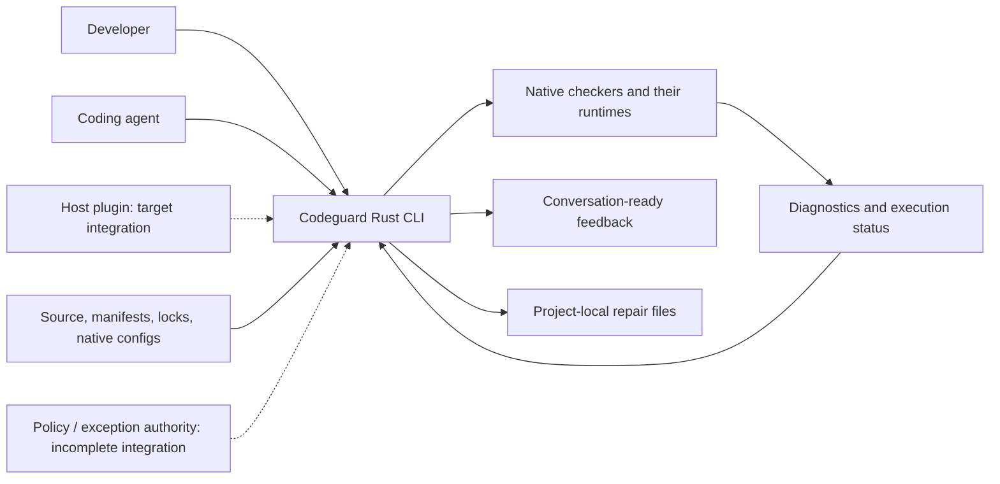
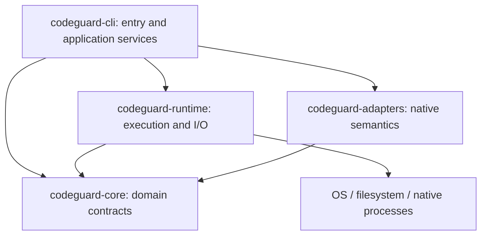
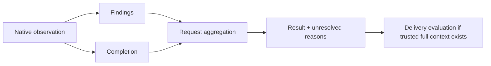
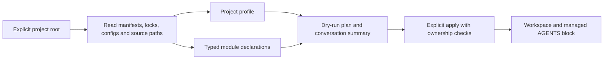
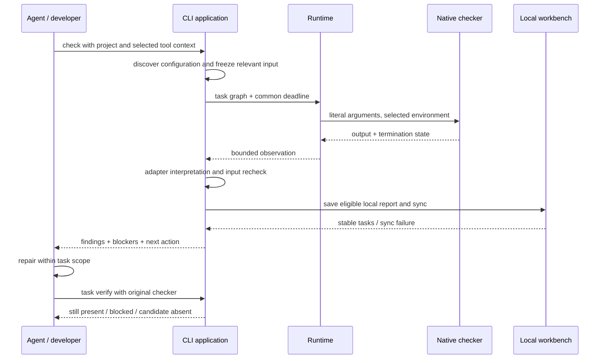
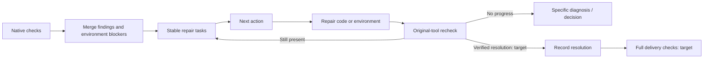
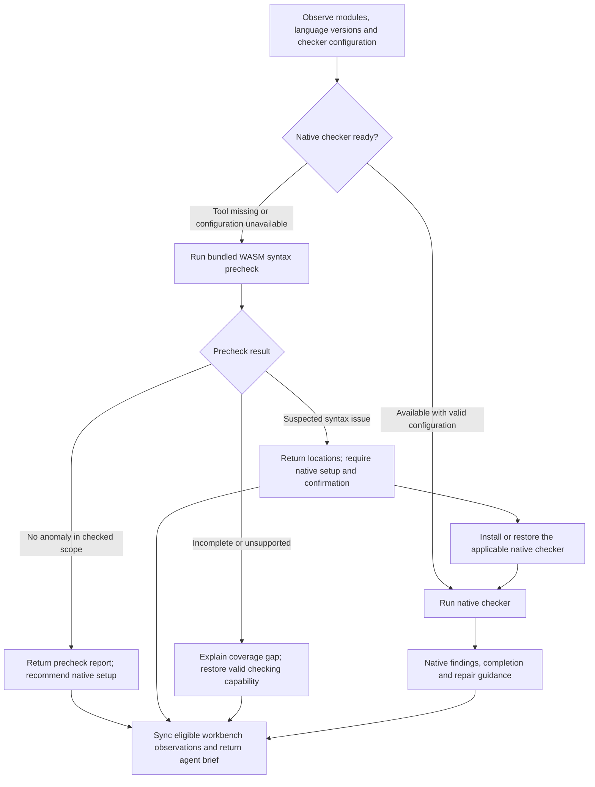
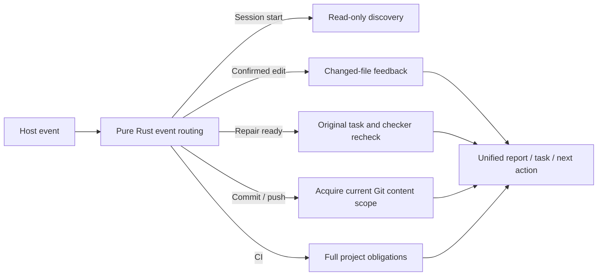
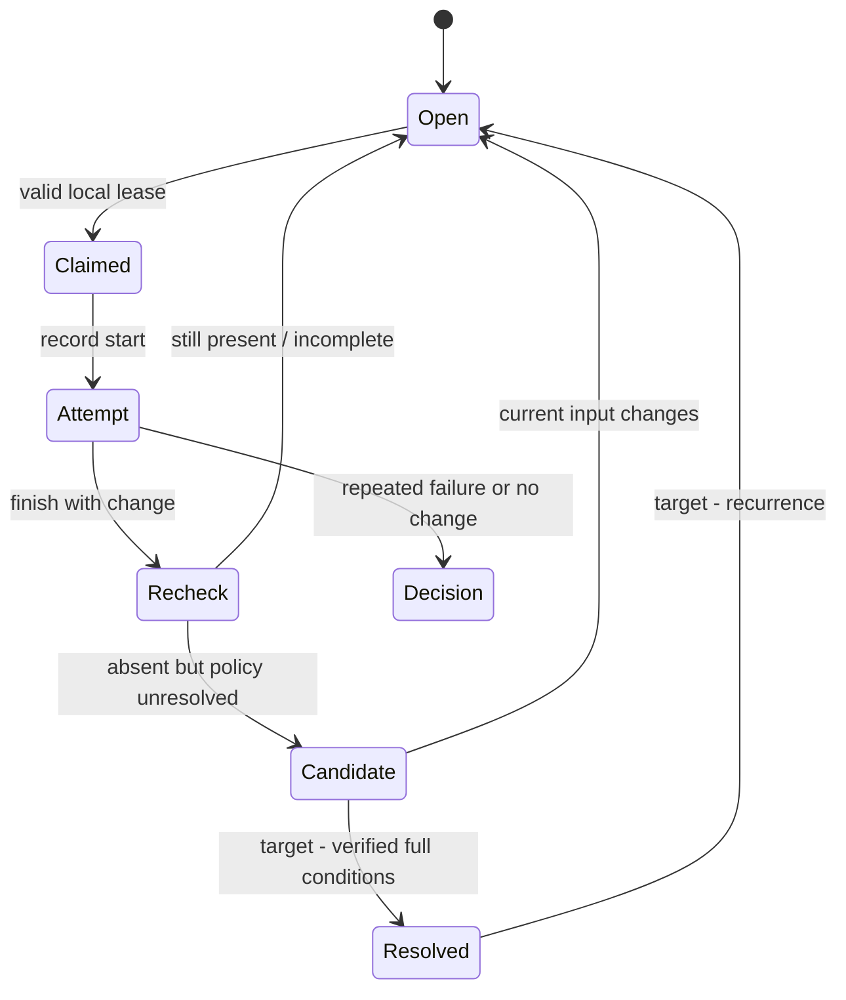
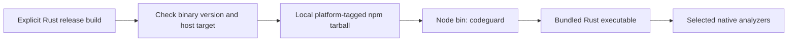

# Codeguard Architecture

> **Purpose:** explain system ownership, component contracts, repair flow, and the gap between current implementation and target behavior.
>
> **Document version:** 1.2.1 · **Updated:** 2026-09-29 · **Source baseline:** current checkout and the [implementation evidence](../openspec/changes/introduce-rust-codeguard-cli/implementation-baseline.md); software version `0.1.1`.

[简体中文](Codeguard-Architecture.zh_CN.md) · [README](../README.md) · [Technical design](Codeguard-Technical-Design.md)

Topic owners: [commands](Codeguard-Command-Reference.md), [initialization](Codeguard-Project-Initialization.md), [remediation](Codeguard-Remediation-Workflow.md), [false positives](Codeguard-False-Positive-Governance.md), [adapters](Codeguard-Adapter-Contracts.md), [trust/distribution](Codeguard-Trust-and-Distribution.md), [acceptance](Codeguard-Validation-and-Rollout.md) and [legacy compatibility](Codeguard-Legacy-Compatibility.md). Detailed contracts live in these guides; OpenSpec owns requirements and tasks.

## 1. Reading contract and evidence

This is the architecture of the Rust **Codeguard CLI repository**, not the implementation manual for the existing Python host plugin. It addresses adapter authors, CLI/runtime maintainers, agent integrators, and reviewers.

- **Implemented building block:** code and a bounded testable contract exist; this does not imply an end-to-end product feature.
- **Partial workflow:** a callable path exists with explicit scope and unresolved requirements.
- **Target:** agreed architectural intent whose complete integration or acceptance remains pending.
- **Unknown:** no sufficient observation; never replace this with an optimistic assumption.

The existing [OpenSpec change](../openspec/changes/introduce-rust-codeguard-cli/proposal.md) now lives in this Rust repository and is the sole specification and task authority. Implemented slices and remaining work are tracked separately; these documents do not maintain a second task ledger.

| Evidence | What it establishes |
| :--- | :--- |
| [Workspace manifest](../Cargo.toml) and each crate manifest | Names, dependency direction, version/toolchain declarations |
| [CLI dispatch](../crates/codeguard-cli/src/main.rs) | Callable command branches and platform guards |
| [Full-check orchestration](../crates/codeguard-cli/src/check_command.rs) | Current aggregation, native scheduling, and sync integrations |
| [Initialization](../crates/codeguard-cli/src/init_command.rs), [contract tests](../crates/codeguard-cli/tests/init_command_contract.rs) | Actual workspace artifacts and refresh behavior |
| [Core aggregation](../crates/codeguard-core/src/aggregate.rs), [delivery gate](../crates/codeguard-core/src/delivery_gate.rs) | Pure result semantics, not trusted public gate availability |
| [Acceptance records](../tests/acceptance) | Scoped observations, test method, and residual gaps |

WASM requirements and 18 implementation tasks are recorded in the existing change. An opt-in Rust worker, pinned grammar candidates, and TypeScript/Java single-file feedback schemas now exist. Project-wide native-first routing, qualified grammar ranges, stable syntax tasks, and host integrations remain incomplete; design examples are not current command output.

## 2. Architectural drivers

The product exists because generic output matching and ambiguous failures produce false positives, while repeated errors encourage agents to suppress checks instead of fixing code.

| Driver | Architectural response | Acceptance intent |
| :--- | :--- | :--- |
| Preserve native rule meaning | Adapter-specific command/report contracts | Environment failures never become invented source violations |
| Low false positives | Configuration-aware scope, explicit unknowns, exact exceptions | Unsupported configuration remains unresolved; valid findings retain origin |
| Actionable repair | Stable facts, repair brief, attempt history, original-tool recheck | A finding yields an appropriate next action rather than repeated raw logs |
| Multi-language consistency | Six categories and versioned report semantics | Every advertised language/category has its own tested evidence |
| Predictable execution | Bounded processes, resource-aware scheduling, cancellation | Failure cannot silently erase other completed observations |
| Minimal onboarding | Discover existing configuration first | Initialization does not execute project scripts or fabricate architecture |

Rust is the orchestration language, selected for a deployable binary and explicit state/resource handling. No comparative performance result is available. Native analyzer runtime and database costs can dominate total scan time.

## 3. Scope and system context



Codeguard owns discovery, command selection, bounded invocation, interpretation, result presentation, and local repair coordination. Native tools own language semantics, rule execution, dependency resolution, and advisory lookup within their contracts. The agent owns proposed code/environment changes. A policy authority must own exception approval; writing a local proposal is not approval.

The CLI does not own a model provider, chat transport, IDE UI, RAG store, distributed scheduler, or SaaS tenant database. Plugins and skills remain separate integration/distribution layers. Their automatic check → sync → brief behavior is a target integration, not established by this repository's CLI tests.

## 4. Current state and target state

| Capability | Current state | Target / remaining work |
| :--- | :--- | :--- |
| Native checks | Partial Python, Rust, Java, Node and Go paths | Complete supported scopes and language/category matrix |
| Discovery | Static configuration and manifest observations | Effective models under explicit controlled resolution |
| Project architecture | Unknown plus static module declarations | Evidence-labelled observed/inferred/confirmed views and conflicts |
| Repair | Stable tasks, local attempts, selected native rechecks | Reliable verified closure, recurrence, and full event reconciliation |
| False-positive exceptions | Candidate inspection/proposals, exact matching and signature-related building blocks | Trusted approval source, lifecycle integration, and usable activation |
| Quality gates | Core algebra; public scans remain partial; index path safety | End-to-end checks against actual worktree/index/ref/CI content |
| Distribution | Source build and npm 0.1.1 for Apple Silicon macOS; artifact verification/download/install primitives | Supported binary releases, platform tests and host runtime bindings |

Current `check all` includes Rust build scheduling and persistence; [build recheck](../tests/acceptance/rust-build-task-verification.md) is also present. Older notes saying these integrations are wholly absent must not be used as the current status. Complete build combinations and formal closure remain missing.

## 5. Components and dependency direction



| Component | Input → output | State / failure responsibility |
| :--- | :--- | :--- |
| CLI | Arguments/configuration → selected operation and feedback | Owns workspace orchestration, command-specific errors, protocol projection |
| Core | Typed observations and scope → deterministic evaluation | No native process or filesystem access; does not establish trust from a boolean by itself |
| Runtime | Literal process specification / snapshot request → bounded observation | Process lifecycle, bytes, locks, resource cleanup, explicit I/O failures |
| Adapters | Native configuration/output → checker-specific observations | Rule identity, scope and exit/report coherence; unknown protocols remain unresolved |

The four crates are real compile-time boundaries. Application services currently live in `codeguard-cli`, including substantial scan/persistence logic. There is no separate application crate or universal runtime-loaded adapter ABI. Future extraction should follow cohesive responsibilities, not add empty crates to match a diagram.

### 5.1 Application services and extension boundaries

Discovery/Plan/Check/Work/Fix/Gate services in the earlier design are logical responsibilities, not a claim that corresponding public traits or separate crates exist. Argument parsing and application services currently live in the CLI. Scoped threads and bounded processes must not be described as an already implemented clap/Tokio scheduler. An adapter must declare configuration discovery, input scope, native report semantics and recheck capability; registering a language name is insufficient.

Project build scripts and checked code are untrusted inputs. The full CI gate is intended to isolate the validator, policy source and final credentials from project processes. Current local process controls and offline options do not establish network isolation or protection from a malicious process under the same user. See [trust and distribution](Codeguard-Trust-and-Distribution.md) for the detailed boundary.

## 6. Domain model and result semantics

| Concept | Meaning | Important distinction |
| :--- | :--- | :--- |
| Configuration observation | `configured / missing / invalid / unknown` | Declaration is not effective-model resolution or execution |
| Check obligation | Selected checker/category/target/rule scope | A planned inventory row is not an executed obligation |
| Finding | Native rule, tool, location, severity, identity | Native severity and policy gate impact are separate |
| Completion | `complete / incomplete / not_applicable` | Independent of finding count |
| Blocker | Environment, configuration, scope, or evidence issue | Not a source-code violation |
| Repair task | Actionable projection of a persistent problem | Checking a Markdown box is not resolution |
| Disposition | Exact false-positive or exception decision | Does not delete the raw finding or rewrite tool output |



Core aggregation priority is cancellation → internal error → incomplete → violations → not applicable/passed. It retains findings from partial runs. The core delivery calculator separately checks scope, obligations, coverage and exception bindings. It can model `allow`, `allow_with_exceptions`, `deny`, `incomplete`, `not_applicable`, and `not_evaluated`; current public partial checks do not supply the complete trusted context needed to claim delivery success.

The user-facing contract is practical: show what is configured, what was found, what failed to run or resolve, and what to do next. Internal identity checks prevent stale or mismatched observations; they should not turn ordinary usage into a separate exercise in manually proving execution.

## 7. Initialization and project knowledge



`init` defaults to dry-run. Static observation does not execute wrapper scripts, Maven extensions, JavaScript configs, or service startup. Declared package versions, language targets, resolved dependency versions, and installed runtimes are distinct; unknown values stay unknown.

Maven and Cargo support selected direct module/dependency declarations. Aggregation, containment and build dependency are distinct edges. Variables, inherited models, optional/target conditions, missing targets and ambiguous identities are unresolved. An incomplete graph cannot justify a narrower scan or prove independence.

`AGENTS.md` contains bounded summaries of languages, roots, versions, checkers and graph observations, with links and content digests. Human text outside the managed markers is retained. Duplicate/missing markers, modified managed content and detected concurrent edits produce conflicts. Current write checks do not establish perfect exclusion against an uncooperative external editor. Source strings are escaped as data; unknown MVC/DDD architecture does not activate a blocking rule.

## 8. Scan, feedback, and repair flow



Local saving and sync are implemented for selected paths. Uninitialized projects can still receive feedback; they do not silently receive a persistent workbench. A sync error must remain visible without erasing native findings. Malformed or stale reports cannot close unrelated tasks.

The desired complete loop is:



The final two nodes are target behavior. Current candidate-absent observations do not automatically close tasks. Each task should carry evidence, rule basis, allowed scope, repair steps, recheck command, attempt history, and closure conditions.

### 8.1 Native-first routing with bundled WASM precheck — target

**Design addition, not implemented in the published `0.1.1` package.** Keep a single entry point; callers select a language or project, not a parser backend:

```bash
codeguard lint java .
codeguard lint typescript .
codeguard check all .
```

These entry points already exist with bounded native adapters and adapter-specific prerequisites. Automatic fallback described below is new target behavior. Resolve checker availability per module, language/version, dialect and effective configuration. An ESLint-ready frontend and a Java module missing its JDK take different paths in the same run.



A completed native violation never selects fallback to obtain a clean result. A native execution failure may receive supplementary precheck feedback, but the original failure remains visible. WASM covers syntax only: it does not replace configured style rules, Javadoc, type checking, dependency/CVE analysis or security checks. Already-required native obligations remain required even after a clean precheck.

| Situation | User-facing conclusion | Next action |
| :--- | :--- | :--- |
| Native checker ready | Native report with actual scope and completion | Follow native diagnostics |
| Native tool missing; precheck clean | No syntax anomaly in checked scope; native lint not run | Recommend installation unless the project already requires it |
| Native tool missing; suspected syntax issue | Suspected issue awaiting native confirmation, not a confirmed violation | Require installation/restoration and an applicable native recheck |
| Tool installed; configuration invalid | Configuration blocker plus scoped precheck | Restore configuration; do not reinstall an already available tool |
| Grammar incompatible, worker timeout or load failure | Precheck incomplete/unsupported | Restore native checking or repair parser support; do not blame source |
| No files checked or partial embedded-language coverage | Empty/incomplete scope, never an all-clear | Resolve scope or show exactly which regions remain unchecked |

“Required” controls verification and task closure; it does not authorize installation outside the user's existing scope or freeze unrelated work. If installation is unavailable, keep one environment task with a concrete reason. A grammar anomaly can be false positive, but still requires valid native confirmation before the escalated task is resolved.

### 8.2 Grammar assets and Rust ownership — target

Reuse pinned CodeGraph grammar WASM artifacts and applicable upstream licenses, source references, patches and corpus cases. Do not copy CodeGraph's graph extraction or source-blanking heuristics into a syntax verdict. CodeGraph's `src/extraction/grammars.ts` loads language artifacts through `web-tree-sitter`; successful loading there does not prove compatibility with Codeguard's Rust runtime. The local source review on 2026-09-28 found modified grammar artifacts and about 65 MB of grammar files, so a live directory is not a release input.

```text
grammars/                         # proposed release assets, not project state
├── manifest.json                 # immutable source, digest, ABI and capability map
├── java/
│   ├── parser.wasm
│   └── LICENSE
└── typescript/
    ├── parser.wasm
    └── LICENSE
```

For each artifact, record language/dialect, upstream commit and patch identity, WASM SHA-256, Tree-sitter ABI/runtime compatibility, tested language versions, known limitations, license and corpus reference. File presence, load compatibility and syntax-check acceptance are three separate capability states. Bundled grammars must work offline; load only the languages needed. Additional language-pack updates require a versioned manifest and compatibility check.

| Owner | Responsibility added by this design |
| :--- | :--- |
| `codeguard-core` | Backend selection policy, precheck outcomes, required/recommended setup actions and reconciliation |
| `codeguard-runtime` | Rust Tree-sitter WASM host, bounded parser worker, asset validation, caches and cancellation |
| `codeguard-adapters` | Language/dialect interpretation, syntax observations and native confirmation capability mapping |
| `codeguard-cli` | Compose adapters with runtime; commands, persistence and human/JSON brief |
| Separate `codeguard-plugin` | Host triggers, bounded conversation delivery and feedback deduplication |

Retain the four-crate dependency direction: adapters interpret observations; CLI composes them with runtime. WASM workers receive bounded source bytes without general filesystem/network imports. Parent-owned deadlines, process termination, memory limits and output bounds must be verified on each supported host; “WASM” alone does not prove resource isolation. Runtime and grammar versions must also fit the declared Rust MSRV or follow an explicit compatibility change. Rust's [Tree-sitter WasmStore](https://docs.rs/tree-sitter/latest/tree_sitter/struct.WasmStore.html) provides a loading API, not a guarantee that every copied grammar is compatible (reference checked 2026-09-28).

### 8.3 Agent feedback and verification lifecycle — target

Report precheck status separately from native execution and delivery. `clean` means only no observed syntax anomaly; `suspected_issue` needs confirmation; `incomplete` and `unsupported` identify missing coverage. Detect both Tree-sitter `ERROR` and `MISSING` recovery, group related recovery nodes and preserve source spans. Version/dialect uncertainty is diagnostic context, not proof of a source defect. See [Tree-sitter query syntax](https://tree-sitter.github.io/tree-sitter/using-parsers/queries/1-syntax.html).

The plugin sends a short report containing method, checked/uncovered scope, observation, native-tool state, next action and an actual task reference when persistence succeeded. The CLI alone cannot inject messages into arbitrary hosts. `AGENTS.md` stores standing workflow guidance, not repeated run logs. Repository text and checker output remain data; installation actions come from reviewed adapter recipes, not copied diagnostic shell strings.

Illustrative target brief, not captured output (path and task ID are synthetic):

```text
Codeguard: Java syntax precheck found 1 suspected issue
Method/scope: bundled WASM; 18 of 18 selected Java files checked.
Native check: not run; the project's required JDK is unavailable.
Location: src/main/java/example/UserService.java:42; MISSING recovery node.
Next step (required): prepare the declared JDK and applicable native checker,
then confirm this file's syntax before repairing according to native diagnostics.
Task: CG-example-java-setup (only emit an actual persisted task in real use).
This is not yet a confirmed code violation; delivery is not evaluated.
```

```mermaid
sequenceDiagram
    participant A as Agent host
    participant P as Codeguard plugin
    participant C as Rust CLI
    participant W as WASM worker
    participant T as Workbench
    A->>P: Check changed module
    P->>C: lint with project context
    C->>C: Native checker unavailable
    C->>W: Parse bounded source with pinned grammar
    W-->>C: Syntax observations and coverage
    C->>T: Sync if initialized; reuse setup/confirmation task
    T-->>C: Actual task reference or sync error
    C-->>P: Precheck + native state + next action
    P-->>A: Bounded brief, with changed results only
    A->>P: After authorized native setup, request verification
    P->>C: task verify with original project context
    C-->>P: Native confirmation, contradiction or unresolved coverage
    P-->>A: Repair action or resolved verification outcome
```

For required setup, create one setup/confirmation task per module/checker obligation and attach suspect source observations to it. Optional setup remains a recommendation, not a blocking repair task; `next` must not repeatedly select it. Installing a tool alone does not close that task. Native confirmation must cover the same syntax capability, file/dialect and current input: Java style-only output is not compiler-level syntax proof. Confirmed issues become native repair work; a sufficiently scoped native contradiction records a parser false-positive candidate. Ambiguous coverage stays unresolved. A later clean WASM run alone cannot satisfy a previously required native confirmation.

Allowlist dispositions bind rule, source target, grammar identity and reason; retain observations and reevaluate after relevant changes. They cannot remove required native checking or fabricate coverage. Repeated runs update stable tasks and attempt history. Emit the initial brief, then meaningful changes; preserve a status view instead of repeating unchanged installation requests. See the technical design's **7.3–7.4** for bilingual report examples and the proposed data contract.

### 8.4 Host events and check tiers — target

Host hooks pass events, workspace identity and known targets. Rust core selects the check tier; the formal CheckPlan then chooses native checkers and resource budgets. An agent cannot change delivery obligations through a prompt, an old soft cache entry or a project-local `skipGate`. The [pure domain router](../crates/codeguard-core/src/hook_trigger_planner.rs) now bounds per-file feedback selection; bulk edits above that budget request a batch-scope decision with a distinct reason. The read-only `codeguard hook plan` CLI returns only a candidate tier with exit 3; it does not execute a checker or connect the plugin, real Git/CI or any verified automatic host trigger. The complete event-driven execution remains a target design.

Separately, `lint python . --file REL_PATH` can invoke native Ruff within the same path budget and report only the selected files. `hook plan` does not yet invoke it automatically, and this local result is neither a real Git-scope check nor a full workbench scan.

`hook execute PATH --timeout DURATION --format=json` consumes the same versioned host event and core route. Session start performs read-only discovery; Stop reads a bounded local next-step view without invoking a checker; a confirmed, bounded, Python-only edit calls Ruff. Stop examines at most 64 findings and 64 reports, with an 8 MiB total report-byte budget; exceeding either returns `guidance_scope_exceeded` and leaves the check unrun. `repair_ready` bounds one task history to 128 events and 1 MiB, resolves the stable task fact, then invokes the existing `task verify` path in a bounded child process; its response contains a small summary of the original checker observation and whether the local event was saved. It never closes the task or approves delivery. With an explicit `--git-tool ABS_PATH`, `pre_commit` observes the live staged index (including `GIT_INDEX_FILE`) under the event deadline, reports path violations and verified-object status, and never reads an old edit result as a gate. Missing tools or unstable index observations remain incomplete. Mixed languages, uncertain or failed writes, push and CI remain `not_run`. `hook_execution_feedback` 0.4 remains candidate evidence; historical 0.1–0.3 schemas are retained. Prompt guidance is still unwired because the event lacks verified intent context. Plugin Hooks, cache reuse and complete Git/CI quality gates are still unwired.

The Rust CLI also has candidate Claude Code `SessionStart`, `PostToolUse`, `PostToolUseFailure`, and `Stop` soft entries. Session start delegates to read-only project discovery. A successful file edit checks the absolute target against the project root and regular-file boundary, then calls the same executor. A failed edit invokes the no-check route without reading the tool error as instructions. Stop reads bounded local task facts without invoking a checker; only a stable task on an initial Stop yields one `additionalContext` continuation, while `stop_hook_active=true` and an empty backlog yield a user-visible message without another continuation. All outputs are bounded and omit source text, raw errors, and editable task Markdown. Invalid or over-budget events say the check was not run. Host exit 0 means only soft feedback, never quality or delivery approval. The separate `codeguard-plugin` does not yet bind or invoke this binary; see the [candidate acceptance record](../tests/acceptance/claude-post-tool-hook-candidate.md).



| Event | Requested tier | Required boundary |
| :--- | :--- | :--- |
| Start/resume, prompt, stop | Read-only discovery, nonblocking intent guidance, session summary | Prompt text cannot replace a real Git gate or claim delivery |
| Confirmed write | Affected-file fast check | Reuse a complete soft result only when content and all configuration identities match; queue project-wide work |
| Failed/unknown write | No source check / resolve scope | Unknown cannot mean unchanged or checked |
| Repair attempt completed | Original `task verify` | Installing a tool, ticking a task or WASM clean alone does not close it |
| Commit, push, CI | Strict commit scope, actual pushed refs, full project obligations | Ignore host-supplied path guesses and old save feedback; disclose missing enforcement support |

Coalescing applies only to duplicate fast feedback for the same content snapshot; it cannot swallow new input, failed rechecks or delivery events. Cache identity must cover source and dependency closure, tool, rules, configuration, platform and vulnerability database freshness. Strict gates revalidate full obligations and identities, then recompute or report incomplete when proof is missing. Measure latency percentiles, repeat execution, invalidations, missed findings and false positives per tier before fixing budgets.

## 9. Persistence and ownership

```text
checked-project/
├── AGENTS.md                       # only Codeguard's marked block is managed
└── .codeguard/
    ├── .gitignore / README.md
    ├── workspace.json              # local workspace identity and managed digests
    ├── project.json                # static observations
    ├── module-graph.json            # typed relations plus unresolved conditions
    ├── architecture.md             # observation projection
    ├── findings/                   # redacted facts and append-oriented events
    ├── tasks/                      # readable projections and correction attachments
    ├── decisions/                  # references; no local self-approval
    ├── reports/                    # ignored local observations
    ├── runs/                       # ignored run data
    ├── cache/                      # ignored cached data
    ├── worktrees/                  # ignored working copies
    └── state/                      # ignored receipts, observations and leases
```

The architecture distinguishes original checker output, normalized observations, persistent problem facts, and human-readable projections. These are not interchangeable authority sources. Empty directories may not appear in Git until populated.

`work sync` binds reports to a workspace/run and consumes matching reports idempotently. Repeated findings retain stable tasks; repeated observations should avoid tracked-file noise. A bad report does not justify discarding other valid reports. Multi-file updates are not claimed to be a fully atomic database transaction; recovery tests cover selected intermediate states and process exits.

The dot-prefix rule skips `.codeguard/` during ordinary source discovery; Codeguard still validates its own records. User source such as `codeguard/src` remains in scope. An older `codeguard/workspace.json` causes a migration conflict; moving the entire directory could hide user source. Tracked records must still obey repository security checks; completing that security gate remains work. Deleting tasks does not supply evidence that the source is clean.

## 10. Execution, concurrency, and resource limits

[ProcessSpec](../crates/codeguard-runtime/src/process_spec.rs) records an absolute executable, literal arguments, explicit cwd, a selected environment, stdin policy, common deadline and combined stdout/stderr limit. [Process execution](../crates/codeguard-runtime/src/process_runner.rs) handles capture, termination and cleanup. Unix process-group control and filesystem calls use isolated unsafe code; the workspace does not promise zero unsafe.

[Task scheduling](../crates/codeguard-runtime/src/task_scheduler.rs) runs a validated DAG with dependency and shared-resource exclusion. Failed dependencies do not start their children. Cancellation and deadline expiry distinguish queued from running tasks. Arbitrary Rust callbacks that ignore cancellation cannot be forcibly preempted by the scheduler.

| Budget | Current value / scope |
| :--- | :--- |
| Check timeout | Default 30 minutes; accepted 1 ms–24 hours |
| Check jobs | Default min(available parallelism, 4); explicit range 1–64 |
| Check source snapshot | Current aggregate path requests at most 4,096 files, 16 MiB/file, 256 MiB total |
| Process output | Per-process specification; many current probes use 16 MiB combined capture |
| Task lease | Local token/generation ownership and expiry; not cross-machine coordination |

These limits are implementation budgets, not measured latency or throughput guarantees. Different probes may impose smaller limits. No end-to-end CPU, memory or network sandbox is certified. Build extensions and native tool behavior remain part of the threat model.

## 11. Task lifecycle and no-progress control



This is a conceptual lifecycle, not a claim that every named state is stored verbatim. Current local facts remain open while recheck events distinguish `still_present`, `still_blocked`, suppression/configuration review, and candidate absence. Attempts, leases and verification receipts are separate structures.

A lease cannot be replaced by an owner string alone: tokens, generation and expiry matter. Failed/no-change/abandoned attempts contribute to bounded no-progress handling. `next` reads structured facts and verified local observations instead of executing instructions embedded in task Markdown. Complete parent-event reconciliation, cross-machine coordination and reliable formal closure remain pending.

## 12. False-positive rules and trust boundaries

| Boundary | Required behavior | Current limit |
| :--- | :--- | :--- |
| Native diagnostics → findings | Preserve exact rule/tool/location and unsupported states | Parsers implement selected protocols and rule subsets |
| Project text → agent context | Escape data; no instructions promoted to policy | General prompt-injection immunity is not claimed |
| Candidate → approved exception | Match exact current identity, expiry and approval scope | Public CLI has no complete approval/activation path |
| Native suppression → repair result | Detect changed coverage before claiming a fix | Counterchecks exist only for selected adapters |
| Report → current observation | Verify workspace, run, input and tool bindings | A digest establishes byte consistency, not independent trust |
| Task projection → source status | Recheck with original tool | Checkbox/delete operations cannot establish resolution |

False-positive handling is an explicit product capability, not a broad skip switch. Exact matching and signature verification building blocks exist, but their existence is not proof that key distribution, approval governance, current clocks and gate integration are complete. See [false-positive design](Codeguard-Technical-Design.md).

## 13. Protocols and configuration

The CLI emits command-specific versioned JSON, human-readable projections and selected SARIF. [Schemas](../schemas) include current and older protocol shapes. `RunReport` is a target/common contract alongside multiple current local observation protocols; integrations must not assume every command already emits one identical envelope.

Configuration layers have different authority:

1. Native tool configuration selects native checks.
2. Project runtime options select time/concurrency, not policy.
3. Rulepack/tool-lock/policy candidates describe intended bindings but are not independently approved by their location.
4. Approved policy and exception authority require an explicit trustworthy source; full integration remains pending.

The runtime precedence and exact schema are documented in [README](../README.md). Unknown fields and unsupported versions must be handled according to the relevant parser, not universally claimed to share one parser policy. Protocol compatibility and legacy exit semantics need explicit adapters.

## 14. Reliability and operational recovery

| Failure | Output and repair action |
| :--- | :--- |
| Missing JDK/tool/configuration | Preparation blocker; restore the needed environment or configuration |
| Native timeout or output limit | Incomplete; preserve independently parseable current findings |
| Truncated JSON/XML or unsupported protocol | Concrete parse/protocol issue; do not invent a finding |
| Input changed during/after scan | Observation becomes unusable for current resolution; rescan |
| Sync conflict or interrupted persistence | Preserve original report, report sync state, retry/reconcile |
| Changed managed `AGENTS.md` | Preserve human content and surface ownership conflict |
| Repeated no progress | Stop the same repair action and provide a specific decision requirement |
| Advisory database unknown/stale | Display available scoped observations and unresolved CVE completeness |

A clean native result should not trigger endless identical rescans because an unrelated policy prerequisite remains unresolved. The target experience is to surface the missing prerequisite once as a stable actionable item. Current partial authority integration is a product gap, not a reason to claim a fix has failed.

There is no daemon uptime SLO, multi-region RPO/RTO, production metrics backend or proven benchmark in this repository. Diagnosis currently relies on structured feedback, run IDs, local observations, and acceptance evidence. Raw logs are local and potentially sensitive even when Git-ignored.

## 15. Deployment, upgrades, and integration

Current deployment is a locally built binary plus independently prepared native toolchains. The `@partme.ai/codeguard@0.1.1` npm package bundles an Apple Silicon macOS binary behind a Node command entry; the Node layer only forwards arguments, cwd, environment, streams and exit status. Publication, a fresh-cache `npx` version check, and registry/local artifact byte comparison passed on that host. The binary reports a candidate source commit, but this does not establish signed provenance, a reproducible build, a multi-platform binary release, or completed quality gates. `tools install` public apply is blocked while internal package verification/download/install primitives have tests.



The default local package is marked private and contains no npm install hook. Its `bin` entry is [npm/codeguard.cjs](../npm/codeguard.cjs); [scripts/pack-npm-local.mjs](../scripts/pack-npm-local.mjs) builds it from an existing binary. The `--public` packaging mode produced the published `@partme.ai/codeguard@0.1.1`, restricted to Apple Silicon macOS. Fresh-cache registry execution and matching package/binary hashes are recorded in [npm 0.1.1 acceptance evidence](../tests/acceptance/npm-0.1.1-candidate.md). Broad registry distribution still needs approved platform coverage, a trusted artifact manifest, matching versions and hashes, and a release process. CodeGraph's Node entry and platform package layout informed this design; its optional network fallback is not part of Codeguard's current installation path.

For upgrades: record binary/schema versions, preserve workbench data, preview managed changes, rerun a bounded check, and validate report consumption before adopting the new binary. Downgrade must respect supported schemas; never rewrite historical files into an older shape merely to make parsing pass.

Target plugin integration should map host invocation to the same CLI semantics, return result/next action to the conversation, and keep transport failure distinct from quality status. Host-specific fail-open policy must not erase unresolved findings. No MCP server or host binding is provided by this baseline's command dispatcher.

## 16. Architecture decisions

| Decision | Choice and rationale | Revisit when |
| :--- | :--- | :--- |
| A01 Language | Rust orchestration; preserve native analyzers to retain ecosystem semantics | A measured platform constraint requires a bounded adapter change |
| A02 Result model | Findings and completion are separate | New category needs additional dimensions without erasing either channel |
| A03 Persistence | Reviewable files and local receipts | Measured scale/concurrency requires a store migration with compatible projections |
| A04 Agent boundary | Deterministic checks and transitions; agent proposes repairs | A model-assisted advisory feature has independent evaluation and cannot grant authority |
| A05 Exceptions | Precise identity, approval and lifecycle instead of broad bypass | Valid project cases require richer identity without expanding unintended scope |
| A06 Architecture discovery | Evidence-labelled unknowns and direct declarations | Effective model/source graph resolution has controlled execution and tested provenance |

These decisions document current intent and constraints, not retroactive approval of missing features. The technical design gives implementation detail, phase dependencies and observable acceptance criteria.

## 17. Acceptance and unresolved questions

Required acceptance dimensions are native semantic correctness, false-positive and false-negative measurement, fault handling, stable task identity, bounded retries, configuration/suppression changes, input freshness, platform behavior, and actual host delivery. Passing unit tests or having a schema file proves none of these in aggregate.

The dated local baseline is 990 passing tests with 101 ignored. No production false-positive rate, complete native matrix, MSRV matrix, full-platform support or remote CI result is inferred from it.

Open decisions for production include approval-source ownership, practical exception review UX, tool distribution/upgrade ownership, complete cross-platform process isolation, schema retention, private vulnerability reporting, and release packaging. They do not prevent using explicitly scoped local observations, but they do prevent declaring a completed production quality gate.

---

**Document version:** 1.2.0 · **Created:** 2026-09-28 · **Updated:** 2026-09-29 · **Status:** ready for review; implementation remains partial.
