# Codeguard 架构设计

> **文档说明：**说明系统职责、组件契约、修复流程，以及当前实现与目标行为之间的差距。
>
> **文档版本：**1.2.4 · **最后更新：**2026-10-04 · **源码基线：**当前 checkout 与[实施证据](../openspec/changes/introduce-rust-codeguard-cli/implementation-baseline.md)；软件版本 `0.1.4`。

[English](Codeguard-Architecture.md) · [README](../README.zh-CN.md) · [技术方案](Codeguard-Technical-Design.zh_CN.md)

专题入口：[命令](Codeguard-Command-Reference.zh_CN.md)、[初始化](Codeguard-Project-Initialization.zh_CN.md)、[修复](Codeguard-Remediation-Workflow.zh_CN.md)、[误报治理](Codeguard-False-Positive-Governance.zh_CN.md)、[适配器](Codeguard-Adapter-Contracts.zh_CN.md)、[信任与分发](Codeguard-Trust-and-Distribution.zh_CN.md)、[验收](Codeguard-Validation-and-Rollout.zh_CN.md)、[旧协议](Codeguard-Legacy-Compatibility.zh_CN.md)。独立细节由专题维护，规格与任务由 OpenSpec 维护。

源码构建已把 ESLint 接入 `check all` 的 `node.lint` 任务图节点，与其它原生检查共用并发与截止时间。按发现的 JS/TS/TSX 文件选择最近的模块清单、本地 ESLint 10、唯一 flat config 和 Node；搜索不越过受检根。检查阶段收集报告，汇总阶段串行同步工作台，重复发现复用同一任务。每个完整且字节匹配的原生文件可免去重复 WASM；被忽略、配置错误或工具失败的文件仍保留降级与原生原因。协议为当前聚合 `check_feedback` 0.38.0（绑定和未绑定均适用）、`check_aborted` 0.13.0，原协议归档；`native_results.node_lint` 提供逐文件反馈、未执行文件、同步结果及下一步。见[验收范围](../tests/acceptance/check-all-eslint.md)。这不提升 grammar 资质或代替真实宿主验收。


Erlang 源码局部入口现通过 `lint erlang FILE --erl-tool ABS_PATH` 原生优先选择：固定 OTP 28 扫描/解析调用读取 stdin 字节，使用非项目 cwd 并禁止项目启动文件。原生诊断优先，预处理与宏覆盖保持未知；未提供显式工具时，`lint erlang` 从 PATH 的绝对目录定位一次工具，并在 0.2 报告中记录规范路径；仅未找到可执行工具时进入固定 WASM 候选，已选择工具的失败保持未完成。局部结果不授予任务关闭、项目完整 lint 或发行验收；见[验收](../tests/acceptance/erlang-native-first.md)。

源码配置入口现通过有界投影复用发现服务，不再仅查看旧配置文件。`config validate/explain` 0.3 将检查器声明状态及来源摘要与生效规则、抑制和批准分开；终端指出来源、原因及下一步。不执行检查器、不修改项目状态，截断保持未完成。见[证据及边界](../tests/acceptance/config-native-observation.md)。

## 1. 阅读契约与证据

本文描述 Rust **Codeguard CLI 仓库**的架构，不是既有 Python 宿主插件的实现手册。读者包括适配器作者、CLI/runtime 维护者、智能体集成者和评审者。

- **已实现基础能力：**已有代码和有界可测试契约，不代表端到端产品功能完整。
- **局部流程：**已有可调用路径，同时明确范围与剩余要求。
- **目标：**已有架构意图，但完整接线或验收尚未完成。
- **未知：**缺乏充分观察，不得用乐观假设替代。

既有 [OpenSpec 规范与任务](../openspec/changes/introduce-rust-codeguard-cli/proposal.md) 已整体迁入本 Rust 仓，是唯一规格与任务事实源。已实现切片和剩余工作分别记录，本文不维护第二份可独立勾选的任务。

| 证据 | 能说明什么 |
| :--- | :--- |
| [工作区清单](../Cargo.toml)及各 crate 清单 | 名称、依赖方向、版本与工具链声明 |
| [CLI 调度](../crates/codeguard-cli/src/main.rs) | 可调用命令分支和平台条件 |
| [完整检查编排](../crates/codeguard-cli/src/check_command.rs) | 当前聚合、原生调度和同步接线 |
| [初始化](../crates/codeguard-cli/src/init_command.rs)、[契约测试](../crates/codeguard-cli/tests/init_command_contract.rs) | 实际工作区产物与刷新行为 |
| [核心聚合](../crates/codeguard-core/src/aggregate.rs)、[交付门禁](../crates/codeguard-core/src/delivery_gate.rs) | 纯结果语义，不代表公开可信门禁已可用 |
| [验收记录](../tests/acceptance) | 限定范围的观察、测试方法和剩余缺口 |

WASM 的规范与 19 项实施任务已纳入既有 change；可选 Rust worker 与 Java/TypeScript/TSX 局部单文件反馈路径及 Python Ruff 不可用时的候选路径已存在；三十二份候选 grammar 都尚未验收；ArkTS、C、C++、C#、Go、JavaScript、Lua、Luau、Nix、Rust、Terraform、Zig、Objective-C、Solidity、R、Ruby、PHP、Kotlin、Dart、Erlang、Pascal、CFML、CFQuery、CFScript、COBOL、Scala、Swift、VB.NET 仅有固定字节的 Rust 可加载候选资产，尚无逐语言验收的独立 lint 路由。项目级原生优先调度、grammar 版本范围验收、任务的能力匹配关闭及宿主接线仍未完成；设计示例不是当前命令输出。

源码以 `--features wasm-precheck` 构建后，可通过 `codeguard grammar probe <language> <file> --format=json` 显式调用全部 32 份固定候选资产。命令使用隔离 Rust worker，以退出码 3 报告未经语言验收的观察，不能作为 lint 或交付结论。成功观察与有效语种的输入失败都遵守[0.1.0 封闭 JSON Schema](../schemas/grammar-probe-v0.1.schema.json)，保持未完成。原生优先 `lint/check`、语言/方言验收、任务/宿主反馈及发行仍需独立完成；现有发现清单还把 JavaScript/TSX 归入 TypeScript，并未为 CFQuery/CFScript 建立独立源码映射。

源码构建的 `check all` 现会在既有原生检查之后执行有界候选初检。[语法路由](../crates/codeguard-cli/src/grammar_route.rs)区分 `.tsx`、JavaScript 和 `.cfs`，只对完整的 `<cfquery>...</cfquery>` 标签体选用 CFQuery；普通 `.sql`、有歧义的 `.h` 不猜测语种。共用后缀的 `.m` 要求 Objective-C 行首标记，`.sc` 在缺项目证据时不猜成 Scala；见[歧义回归](../tests/acceptance/ambiguous-grammar-extensions.md)。四个有界真实 CLI 样例合计逐份调用了 32 种固定 worker。[检查反馈 0.38.0](../schemas/check-feedback-v0.38.schema.json)记录方言、源码及 grammar 摘要、原文件位置、有界已知限制、未执行范围和未完成状态；Ruff 本轮完整检查且摘要匹配的 Python 文件跳过重复 WASM；P3C 等规范检查不视为语法确认。候选观察不生成已确认违规或交付许可。候选阶段限 64 文件、64 片段、90 秒，本机四批 32 语种样例约 54 秒；此前串行实现的 Linux 单次 31 文件检查在 90 秒上限内完成 26/32。当前只是候选路由，尚非逐语言验收的原生兜底或任务/宿主接线；npm 0.1.3 仅将其作为未验收候选分发；见[验收记录](../tests/acceptance/check-all-32-grammar-candidates.md)。

源码构建的候选调度现在按稳定路径顺序准备有界片段，以 `min(--jobs, 2)` 个隔离 worker 并发执行；报告保持同序，接受结果前逐文件复读源码。本机 31 文件单项目样例在原 90 秒预算内观察到全部 32 种候选；源码提交 `ff60184` 的 Linux WASM 集成步骤已通过同一单项目测试；完整 CI 已通过。吞吐改进不提升候选观察的门禁权威。

[Java 17 原生差分](../tests/acceptance/java-native-differential.md)给 Java grammar 增加了 13 例 javac 21 独立 oracle。它只是局部精度证据，Java 仍是未验收候选。

[Kotlin 原生差分](../tests/acceptance/kotlin-native-differential.md)现记录 11 例可判定的一致结果与 2 例隐藏错误导致的未知，分别对应原生非法和原生合法源码。Swift 为 12 例可判定的一致结果与 1 例未知。未完成扫描不能仅凭恢复数组为空归入合法/非法标签；未知覆盖单独报告，两份 grammar 均未验收。

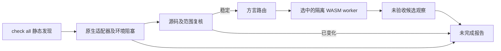

首个局部原生优先入口为 Zig：`lint zig FILE --zig-tool ABS_PATH --format=json` 对选定源码字节先运行版本报告为 Zig 0.16.0 且字节保持一致的 `ast-check`；原生错误只暴露行列位置，不回显源码。未提供显式工具时，固定 Zig grammar 作为未验收候选兜底。两种结果都保持未完成，因为 AST 检查范围小于完整 lint、构建和测试；见 [0.1.0 报告 Schema](../schemas/zig-lint-feedback-v0.1.schema.json)。

## 2. 架构驱动

产品要解决的问题是：通用文本匹配和含混的执行失败容易误报，而不断重复的错误又容易诱使智能体抑制检查，偏离修复代码的目标。

| 驱动 | 架构响应 | 验收意图 |
| :--- | :--- | :--- |
| 保持原生规则语义 | 为每个适配器定义命令与报告契约 | 环境失败不制造源码违规 |
| 低误报 | 感知配置的范围、明确未知状态、精确例外 | 不支持的配置保留未解析，有效发现保留来源 |
| 可推进修复 | 稳定事实、修复简报、尝试历史、原工具复检 | 问题给出合适下一步，不只重复原始日志 |
| 多语言一致性 | 六类别和版本化结果语义 | 每个宣传支持的语言/类别都有独立测试证据 |
| 执行可预测 | 有界进程、资源互斥调度和取消 | 局部失败不能悄悄删除其它已完成观察 |
| 简化接入 | 优先识别已有配置 | 初始化不执行项目脚本、不虚构架构 |

Rust 负责统一编排，以可分发二进制及显式状态、资源管理为选型理由。当前没有性能对比结论；原生分析器运行和数据库访问可能占据总耗时的大部分。

## 3. 范围与系统上下文

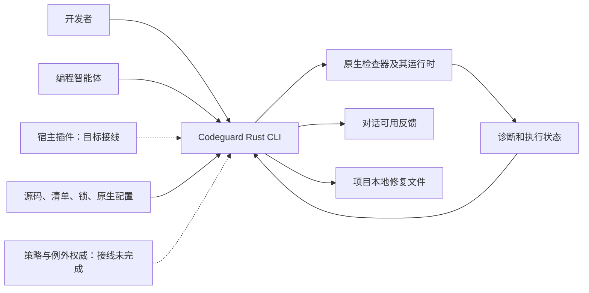

Codeguard 负责发现、命令选择、有界调用、解释结果、反馈和本地修复协调。原生工具负责其契约内的语言语义、规则执行、依赖解析和漏洞查询。智能体负责提出代码或环境变更。策略权威负责例外批准，本地提案不等于批准。

CLI 不承担模型供应商、聊天传输、IDE UI、RAG 存储、分布式调度器或 SaaS 租户数据库。插件与技能仍是独立集成和分发层；它们自动串起 check → sync → brief 的行为属于目标接线，不能用本仓库 CLI 测试代替宿主证明。

## 4. 当前态与目标态

| 能力 | 当前态 | 目标 / 剩余工作 |
| :--- | :--- | :--- |
| 原生检查 | Python、Rust、Java、Node、Go 的局部路径 | 完善适用范围及语言/类别矩阵 |
| 发现 | 静态配置和清单观察 | 显式受控解析下的有效模型 |
| 项目架构 | 未知状态与静态模块声明 | 带证据的 observed/inferred/confirmed 画像与冲突 |
| 修复 | 稳定任务、本地尝试、部分原工具复检 | 可靠的验证关闭、复发处理、完整事件协调 |
| 误报例外 | 候选查询/提案、精确匹配和签名相关基础能力 | 可信批准来源、生命周期接线和可用生效流程 |
| 质量门禁 | 核心判定逻辑；公开扫描仍局部；index 路径安全 | 针对实际工作树/index/ref/CI 内容的端到端检查 |
| 分发 | 源码构建、Apple Silicon macOS npm 0.1.3；制品核验、下载和安装基础能力 | 可支持的二进制发行、平台测试和宿主运行时绑定 |

当前 `check all` 已包含 Rust 构建调度和持久化，[构建复检](../tests/acceptance/rust-build-task-verification.md)也已存在。旧记录中“完全没有这些接线”的描述不能用作当前状态；完整构建组合和正式关闭仍待完成。

## 5. 组件与依赖方向

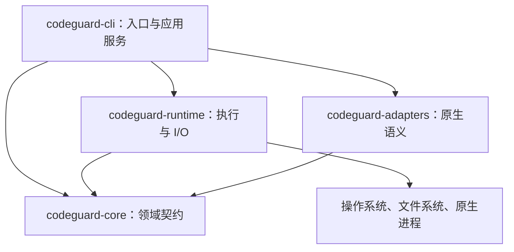

| 组件 | 输入 → 输出 | 状态和失败职责 |
| :--- | :--- | :--- |
| CLI | 参数/配置 → 选定操作及反馈 | 工作区编排、命令错误、协议投影 |
| Core | 类型化观察和范围 → 确定性判定 | 无原生进程或文件系统访问；布尔字段本身不能建立信任 |
| Runtime | 字面进程配置/快照请求 → 有界观察 | 生命周期、字节、锁、资源释放及明确 I/O 故障 |
| Adapters | 原生配置/输出 → 检查器专属观察 | 规则身份、范围、退出与报告一致性，未知协议保持未解析 |

四个 crate 是实际编译边界。应用服务目前仍在 `codeguard-cli`，包含较多扫描和持久化逻辑。当前没有独立 application crate 或通用动态适配器 ABI。未来拆分应围绕内聚职责，不为满足架构图而添加空模块。

### 5.1 应用服务与扩展边界

旧设计中的 Discovery/Plan/Check/Work/Fix/Gate Service 是逻辑职责，不意味着已经存在对应公共 trait 或独立 crate。当前参数解析与应用服务位于 CLI；运行时使用受控进程与作用域线程，不能把未来的 clap/Tokio 调度方案描述成现有实现。扩展适配器必须同时声明配置识别、输入范围、原生报告语义和复检能力，不能仅注册语言名称。

项目构建脚本与被检代码属于不可信输入。完整 CI 门禁的目标是将验证器、策略来源和最终凭据与项目进程隔离；当前本地进程控制与 offline 参数不等于已经实现网络或恶意同用户隔离。具体信任、签名、工具分发边界见[信任与分发](Codeguard-Trust-and-Distribution.zh_CN.md)。

## 6. 领域模型与结果语义

| 概念 | 含义 | 必须区分的边界 |
| :--- | :--- | :--- |
| 配置观察 | `configured / missing / invalid / unknown` | 配置声明不代表有效模型解析或执行 |
| 检查义务 | 选定检查器、类别、目标和规则范围 | 计划清单行不代表已执行义务 |
| Finding | 原生规则、工具、位置、严重度和身份 | 原生严重度与策略门禁影响分别记录 |
| Completion | `complete / incomplete / not_applicable` | 与发现数量独立 |
| Blocker | 环境、配置、范围或证据问题 | 不是源码违规 |
| 修复任务 | 持久问题的可执行投影 | 勾选 Markdown 不等于解决 |
| Disposition | 精确误报或例外决策 | 不删除原发现、不改写工具输出 |

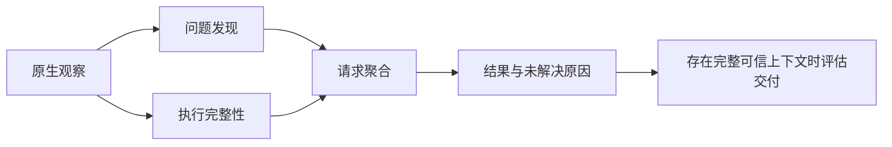

核心聚合优先级为取消 → 内部错误 → 未完成 → 违规 → 不适用/通过，同时保留局部运行的有效发现。交付计算器独立核对范围、义务、覆盖与例外绑定，可以表达 `allow`、`allow_with_exceptions`、`deny`、`incomplete`、`not_applicable`、`not_evaluated`；当前公开局部检查尚不具备签发交付成功所需的完整可信上下文。

面向用户的契约应保持实用：展示配置了什么、发现了什么、哪些步骤无法执行或解析，以及下一步做什么。内部身份校验用于避免陈旧或错配观察，不应让日常使用变成额外手工“证明执行过”的任务。

## 7. 初始化与项目知识

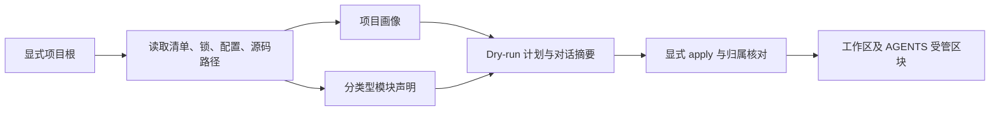

`init` 默认 dry-run。静态观察不执行 wrapper、Maven 扩展、JavaScript 配置或服务启动。项目包声明版本、语言目标、已解析依赖版本、本机运行时分别记录，未知值保持未知。

Maven/Cargo 当前支持部分直接模块和依赖声明。聚合、包含、构建依赖是不同边；变量、继承模型、optional/target 条件、缺失目标和歧义身份保持未解析。不完整图不能支撑缩小扫描或证明模块独立。

`AGENTS.md` 包含语言、构建根、版本、检查器和模块观察的有界摘要，并链接详情与内容摘要。受管标记外人工文本保留；重复/缺失 marker、人工改写区块和检测到的并发改动返回冲突。当前写入核对不保证排除不协作编辑器的所有竞态。项目字符串作为转义数据；未知 MVC/DDD 架构不激活阻断规则。

## 8. 扫描、反馈与修复流程

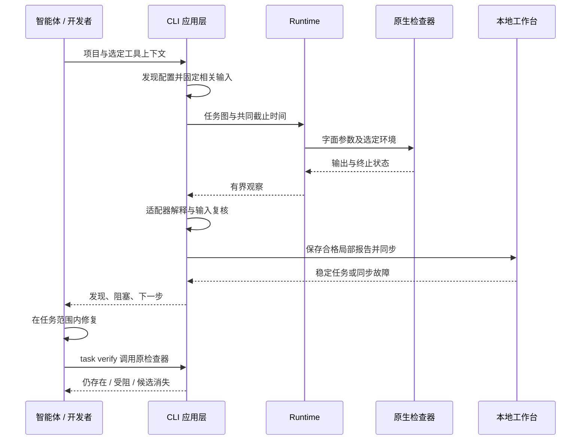

部分路径已实现本地保存和同步。未初始化项目也可以获取反馈，不会被静默创建持久工作台。同步错误必须可见，同时保留原生发现；坏报告或过时报告不能关闭不相关任务。

完整目标流程是：

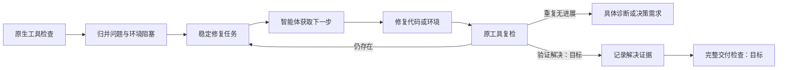

最后两个节点属于目标行为。当前候选消失观察不自动关闭任务。每张任务应具备问题证据、规则依据、允许范围、修复步骤、复检命令、历史尝试和关闭条件。

### 8.1 原生优先与内置 WASM 初检路径——目标

**本节目标契约仅在公开 `0.1.3` 候选包中局部实现。** 保留统一入口，调用者选择语言或项目，不选择解析器后端：

```bash
codeguard lint java .
codeguard lint typescript .
codeguard check all .
```

这些入口已存在，但当前只有局部原生适配能力及各适配器所需的前置参数；下述自动兜底是新增目标行为。按模块、语言/版本、方言及有效配置识别检查器可用性。同一轮检查中，已有 ESLint 的前端和缺 JDK 的 Java 模块分别选择路径。

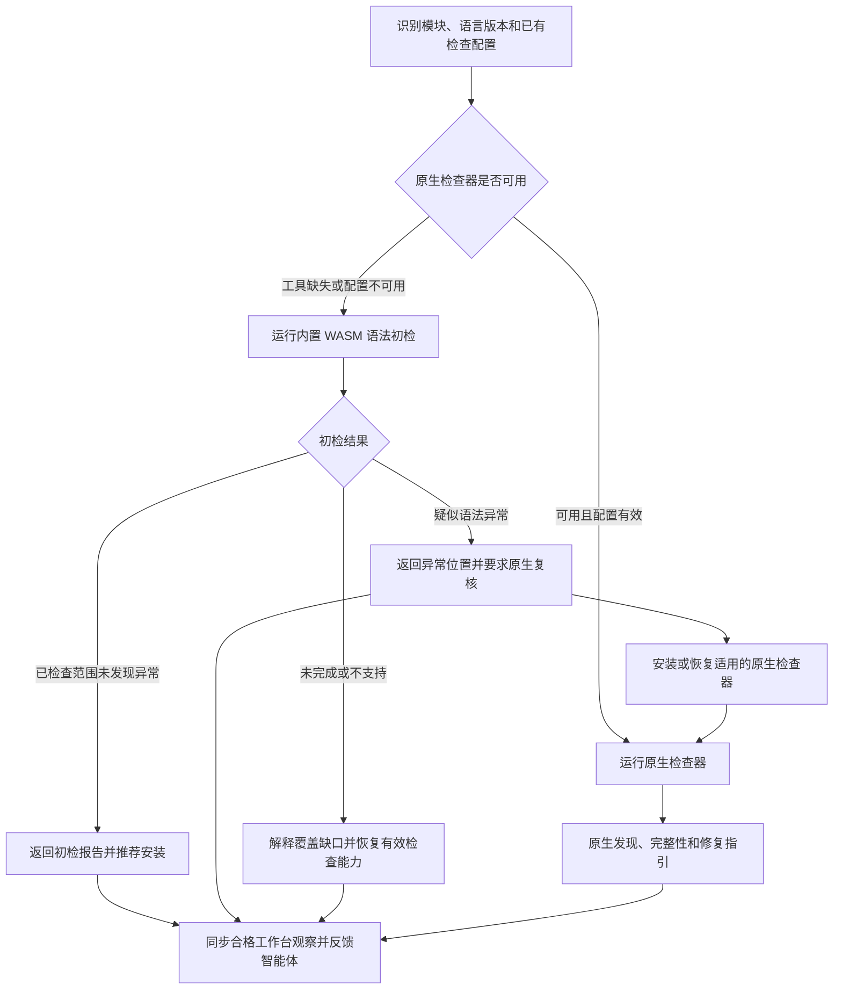

原生检查已检出违规时，不能切到兜底获取干净结果。原生执行失败时可补充初检，但必须保留原故障。WASM 仅覆盖语法，不替代已配置的规范规则、Javadoc、类型、依赖/CVE 或安全检查。项目已要求的原生检查，不会因初检正常变成可选。

| 情况 | 面向用户的结论 | 下一步 |
| :--- | :--- | :--- |
| 原生检查器可用 | 原生报告、实际范围与完整性 | 按原生诊断处理 |
| 缺原生工具，初检正常 | 已检查范围未发现语法异常；原生 lint 未执行 | 推荐安装；项目已有必需要求时仍必须安装 |
| 缺原生工具，初检疑似异常 | 待原生确认的疑似问题，不是已确认违规 | 必须安装/恢复适用工具并复核 |
| 工具已安装，配置无效 | 配置阻塞及局部初检结果 | 修复配置，不重复安装已有工具 |
| grammar 不兼容、工作进程超时或加载失败 | 初检未完成/不支持 | 恢复原生检查或修复解析支持，不归罪源码 |
| 零文件或嵌入语言覆盖不全 | 空范围/未完成，不能报告全部通过 | 恢复范围或列明未覆盖区域 |

“必须”约束验证与任务关闭条件，不越过用户已有授权安装工具，也不冻结无关工作。无法安装时，保留一张有具体原因的环境任务。grammar 异常可能是误报，但已升级的任务仍须经有效原生复核才能解决。

### 8.2 Grammar 资产与 Rust 职责——目标

复用固定版本的 CodeGraph grammar WASM，以及适用的上游许可证、源码引用、补丁和语料。不能把 CodeGraph 的图提取或源码遮盖启发式直接用于语法判定。CodeGraph 的 `src/extraction/grammars.ts` 通过 `web-tree-sitter` 加载语言资产，在那里可加载不证明兼容 Codeguard 的 Rust 运行时。发行时必须固定不可变的来源与资产清单，不能把正在修改的本地目录直接当作发行输入。

只读 `codeguard grammar status` 现投影[固定来源覆盖库存](../grammars/codegraph-coverage.json)：CodeGraph 随仓 30 份 WASM，依赖提供另两种独立 grammar；CodeGuard 有 C、C++、C#、Go、Java、JavaScript、Lua、Luau、Objective-C、Python、Rust、Solidity、TypeScript、TSX、Zig、ArkTS、Nix、Terraform、R、Ruby、PHP、Kotlin、Dart、Erlang、Pascal、CFML、CFQuery、CFScript、COBOL、Scala、Swift、VB.NET 三十二份资产候选。C、C++、C#、Go、JavaScript、Lua、Luau、Rust 的 CodeGraph 随仓字节及上游标签许可证已固定，可由 Rust worker 解析基础正反例，但尚未进行语言验收或公开 lint 接线。ArkTS、Nix、Terraform 的来源、许可证、字节及 Rust 正反例也已固定，仅为候选，尚无逐语言验收的独立 lint 路由或发行验收；见[局部验收](../tests/acceptance/arkts-nix-terraform-grammar-candidates.md)。Objective-C 与 Solidity 来自锁定的 `tree-sitter-wasms@0.1.13`，保留原始字节和许可证，并以固定散列的 `dylink` 元数据转换加载；仍未做语言验收与发行。Zig 新版来源 WASM 的导入经固定哈希适配后由 Rust 加载，已有局部 `lint zig` 原生优先候选入口，但尚无已验收发行能力。Python 已有源码可选构建中的局部 `lint` 兜底，仅覆盖 Ruff 不可用或项目未声明配置的情形；原生结果优先且不能批准交付。已初始化工作区的单文件范围可同步稳定的原生确认任务；候选零恢复节点不会关闭任务。覆盖库存与[候选资产清单](../grammars/manifest.json)分开，不能凭库存行自动加载或宣称支持。COBOL 现可在 20 MiB 输入限额下加载，但冷启动与内存预算未验收。

R、Ruby、PHP、Kotlin 也已固定 CodeGraph 字节、许可证和 Rust 实测 ABI，并通过隔离 worker 的窄范围正反例；PHP 样例覆盖 HTML/PHP 混合内容，仍仅为未验收候选。CodeGraph 原 Dart WASM 仍不能由 Rust 直接加载；CodeGuard 现以固定上游 C 源码和真实外部 scanner 经 Zig 可重复构建，再做固定 WASI 导入适配。Rust 加载与隔离 worker 的窄范围测试通过，但公开 lint 与发行仍未验收；见[Dart 重建局部验收](../tests/acceptance/dart-grammar-rebuild-candidate.md)。Erlang 已固定 CodeGraph 字节、上游 0.19 许可证及 ABI 14，并已有 Rust worker 样例与 OTP 28 原生对照；源码构建已接通显式原生优先 lint 和任务复检。原 WASM 仍漏检函数终止符，完整语言与公开发行验收仍缺，见[原生对照](../tests/acceptance/erlang-native-differential.md)和[任务复检](../tests/acceptance/erlang-native-task-verification.md)。Pascal 已固定 CodeGraph 字节、原始 Isopod 依赖提交和许可证，ABI 14 及窄范围 worker 样例通过；原生对照和公开 lint 尚缺，见[Pascal 候选局部验收](../tests/acceptance/pascal-grammar-candidate.md)。其余七份 CFML/CFQuery/CFScript/COBOL/Scala/Swift/VB.NET 来源 WASM 也已固定并由 Rust worker 加载，累计 32/32 份候选、0 项已发行。CFQuery 漏掉 `SELECT FROM`，VB.NET 对合法未缩进方法体误报，COBOL 成本高；都不能发布为 lint，见[七份局部验收](../tests/acceptance/final-seven-grammar-candidates.md)。

```text
grammars/                         # 规划中的发行资产，不是项目状态
├── manifest.json                 # 固定来源、摘要、ABI 及能力映射
├── java/
│   ├── parser.wasm
│   └── LICENSE
└── typescript/
    ├── parser.wasm
    └── LICENSE
```

每个资产记录语言/方言、上游提交与补丁身份、WASM SHA-256、Tree-sitter ABI/运行时兼容性、已验收语言版本、已知限制、许可证和语料引用。文件存在、加载兼容、语法检查通过验收，是三个独立能力状态。内置 grammar 必须能离线运行，并按需加载；额外语言包更新须经版本化清单与兼容性检查。

| 所有者 | 本设计增加的职责 |
| :--- | :--- |
| `codeguard-core` | 后端选择策略、初检状态、必须/推荐准备动作及结果协调 |
| `codeguard-runtime` | Rust Tree-sitter WASM 宿主、有界解析工作进程、资产核验、缓存及取消 |
| `codeguard-adapters` | 语言/方言解释、语法观察及原生复核能力映射 |
| `codeguard-cli` | 组合适配器与 runtime；命令、持久化和 human/JSON 简报 |
| 独立 `codeguard-plugin` | 宿主触发、对话摘要交付与反馈去重 |

保留四 crate 的依赖方向：适配器解释观察，由 CLI 组合 runtime。WASM 工作进程接收有界源码字节，不提供通用文件系统/网络导入。父进程截止时间、终止、内存和输出上限须逐宿主验证，不能仅凭 WASM 名称声称资源已隔离。运行时与 grammar 版本还须符合声明的 Rust MSRV，否则应明确变更兼容契约。Rust 的 [Tree-sitter WasmStore](https://docs.rs/tree-sitter/latest/tree_sitter/struct.WasmStore.html)提供加载接口，不保证复制来的每个 grammar 均兼容（参考核对日期：2026-09-28）。

S14.2 Rust加载器的离线固定资产、损坏/散列/ABI拒绝及Rust1.85检查已验收；32份候选可加载与已验收语法能力0并不冲突。语言精度、来源治理、隔离和发行由各自未完成任务继续承担，见[加载器核验](../tests/acceptance/rust-wasm-loader-completion.md)。

### 8.3 智能体反馈与验证闭环——目标

分别报告初检、原生执行及交付状态。`clean` 仅表示未观察到语法异常；`suspected_issue` 需要确认；`incomplete` 和 `unsupported` 说明覆盖缺口。必须识别 Tree-sitter 的 `ERROR` 和 `MISSING` 恢复，归并相关节点并保留源码位置。版本/方言不确定性属于诊断上下文，不是源码错误证明。见 [Tree-sitter 查询语法](https://tree-sitter.github.io/tree-sitter/using-parsers/queries/1-syntax.html)。

插件发送检查方式、已检查/未覆盖范围、观察、原生状态、下一步，以及持久化成功后真实存在的任务引用。CLI 本身不能向任意宿主注入消息。`AGENTS.md` 保存长期工作流说明，不追加每轮日志。仓库文本和工具输出只作为数据；安装动作来自审核过的适配器方案，不从诊断文本拼接 shell 指令。

目标简报示意，不是实际输出（路径和任务 ID 为合成示例）：

```text
Codeguard：Java 语法初检发现 1 处疑似异常
方式/范围：内置 WASM；选中的 18 个 Java 文件均已检查。
原生检查：未执行，项目要求的 JDK 不可用。
位置：src/main/java/example/UserService.java:42，MISSING 恢复节点。
下一步（必须）：准备声明版本的 JDK 和适用的原生检查器，
先确认此文件语法，再根据原生诊断修复。
关联任务：CG-example-java-setup（实际使用时仅输出真实持久化任务）。
这尚未确认为代码违规，交付未评估。
```

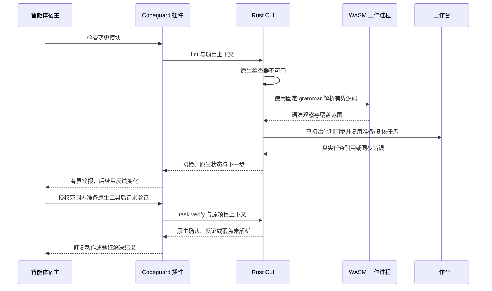

必需准备时，每个模块/检查义务只创建一张准备与确认任务，关联疑似源码观察。可选准备保持为建议，不生成阻断性修复任务；`next` 不能反复选中它。仅安装成功不能关闭任务。原生确认必须覆盖同一语法能力、文件/方言和当前输入：仅 Java 规范检查输出不能证明编译器级语法正确。确认的问题转为原生修复工作；覆盖充分的原生反证记录为解析器误报候选；覆盖不明继续保持未解析。之后单独一次 WASM 初检正常不能满足已要求的原生复核。

白名单处置绑定规则、源码目标、grammar 身份和原因；保留原始观察，相关输入变化后重新评估。白名单不能移除必需原生检查或伪造覆盖。重复运行更新稳定任务和尝试历史。首次反馈简报，之后只反馈有意义的变化；通过状态视图保留未完成项，不反复发送相同安装要求。双语报告示例及拟议数据契约见技术方案 **7.3–7.4**。

### 8.4 宿主事件与检查档位——目标

宿主 Hook 只传递事件、工作区身份和已知目标；Rust core 选择检查档位，正式 CheckPlan 再决定原生检查器及资源预算。智能体不能用提示词、旧软缓存或项目内 `skipGate` 自行改变交付义务。当前 [纯领域路由](../crates/codeguard-core/src/hook_trigger_planner.rs)已限制逐文件快检范围；批量编辑超预算时返回有明确原因的批量范围重定。只读 `codeguard hook plan` CLI 仍仅返回候选档位与退出码 3，尚未执行检查、接入插件或真实 Git/CI，也未证明任何宿主的自动触发。完整事件驱动执行仍是目标设计。

独立的 `lint python . --file REL_PATH` 已能以相同路径预算调用原生 Ruff，仅输出指定文件的局部反馈；它没有由 `hook plan` 自动调起，未执行本轮 Git 范围检查，也不将局部结果当作完整工作台扫描。

`hook execute PATH --timeout DURATION --format=json` 消费同一版本化宿主事件。会话启动只读发现；Stop 只读本地有界下一步，不调用检查器；确认成功的有界编辑范围先执行所选 Python/Ruff、JS/TS/ESLint，再对未覆盖文件执行可选 WASM 候选观察。Stop 最多检查 64 个 finding 和 64 份报告，报告字节总预算为 8 MiB；超出后返回 `guidance_scope_exceeded`，检查仍为未运行。`repair_ready` 先将单任务历史限制在 128 项和 1 MiB，读取稳定任务事实，再经有界子进程复用现有 `task verify`，只返回原检查器观察和本地事件是否保存的摘要；不关闭任务、不批准交付。显式提供 `--git-tool ABS_PATH` 后，`pre_commit` 在事件总截止时间内观察本轮真实暂存 index（含 `GIT_INDEX_FILE`），报告路径违规与对象核验状态，绝不拿编辑快检结果充作提交门禁。缺工具或 index 观察不稳定仍是不完整。未知/失败写入、推送和 CI 保持显式 `not_run`。`hook_execution_feedback` 0.6 仍仅是候选证据，历史 0.1–0.5 schema 保留。用户提示事件现返回固定的非阻断检查时机指引，不解释提示词或启动检查器，不能据此认定交付意图或 Git 门禁；插件 Hook、缓存复用和完整 Git/CI 质量门禁尚未接通。

Rust CLI 另有 Claude Code `SessionStart`、`PostToolUse`、`PostToolUseFailure`、`Stop` 候选软入口。启动只读发现；成功编辑核对绝对路径、项目根及普通文件后复用同一执行器；失败编辑走不检查源码的路由，不把错误文本当指令；Stop 有界读取已有任务事实，不运行检查器，仅在首次 Stop 发现稳定任务时给一次 `additionalContext` 继续指引，`stop_hook_active=true` 或无任务时只显示提示而不反复唤醒。全部反馈有界，排除源码、原工具错误及可编辑任务正文；非法/超预算输入显示未运行。宿主退出 0 仅表示软反馈已返回，不是质量通过。独立 `codeguard-plugin` 有显式固定二进制候选 dispatcher，默认 Hook 与真实宿主验收仍未完成；见[局部验收](../tests/acceptance/claude-post-tool-hook-candidate.md)。

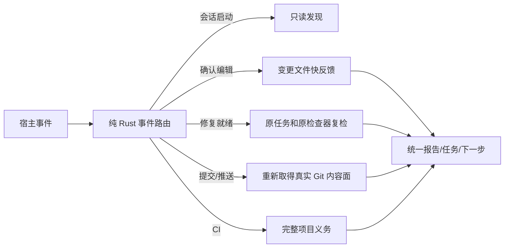

| 事件 | 应请求的档位 | 不可省略的约束 |
| :--- | :--- | :--- |
| 启动/恢复、用户提示、停止 | 只读发现、非阻断性意图建议、会话摘要 | 提示文字不能替代真实 Git 门禁，不签发通过 |
| 确认写入成功 | 受影响文件快检 | 同一内容与全部配置身份一致时才可复用完整软结果；项目级重任务排队 |
| 写入失败/结果未知 | 不检查 / 重新确定范围 | 未知不能当作无变更或已检查 |
| 修复尝试完成 | `task verify` 原生复检 | 仅安装工具、勾选任务或 WASM clean 不关闭问题 |
| 提交、推送、CI | 严格提交面、实际 ref 推送面、完整项目义务 | 不信宿主传入的路径列表或旧保存反馈；无可靠阻断能力则报告缺口 |

节流只合并同一内容快照的重复快反馈，不吞掉新输入、失败复检或交付事件。缓存至少绑定源码及依赖闭包、工具、规则、配置、平台和漏洞库时效；严格门禁重新核验完整义务与身份，缺证明时重算或标未完成。对每档分别测量耗时分位数、重复执行、缓存失效、漏检和误报，再确定预算；不能仅靠固定延时声称高效。


## 9. 持久化与所有权

```text
checked-project/
├── AGENTS.md                       # 仅管理 Codeguard 标记区块
└── .codeguard/
    ├── .gitignore / README.md
    ├── workspace.json              # 工作区身份及受管摘要
    ├── project.json                # 静态观察
    ├── module-graph.json            # 分类型关系与未解析条件
    ├── architecture.md             # 架构观察投影
    ├── findings/                   # 脱敏事实与追加式事件
    ├── tasks/                      # 可读投影和纠错附件
    ├── decisions/                  # 决策引用，不可本地自批
    ├── reports/                    # 忽略入库的局部观察
    ├── runs/                       # 忽略入库的运行数据
    ├── cache/                      # 忽略入库的缓存
    ├── worktrees/                  # 忽略入库的工作副本
    └── state/                      # 忽略入库的收据、观察和租约
```

原检查器输出、归一化观察、持久问题事实和可读投影分别建模，不能互相替代为权威来源。空目录在写入文件前不一定出现在 Git 中。

`work sync` 按工作区与 run 绑定报告，幂等消费匹配记录。重复发现维持稳定任务，重复观察尽量避免污染已跟踪文件。一份坏报告不能成为丢弃其它有效报告的理由。多文件写入不宣称具有数据库式全原子事务；恢复测试目前覆盖部分中间态和进程退出。

普通源码发现按点前缀规则跳过 `.codeguard/`，Codeguard 仍校验其中自有记录；`codeguard/src` 等用户源码继续检查。发现旧 `codeguard/workspace.json` 时报告迁移冲突；整体移动旧目录可能隐藏用户源码。已跟踪记录也须服从入库安全检查，完整安全门禁仍待实现。删除任务不构成源码已干净的证据。

## 10. 执行、并发与资源约束

[ProcessSpec](../crates/codeguard-runtime/src/process_spec.rs) 记录绝对工具路径、字面参数、明确 cwd、选定环境、stdin、共同截止时间和 stdout/stderr 合计上限。[进程执行器](../crates/codeguard-runtime/src/process_runner.rs)负责捕获、终止和清理。Unix 进程组与文件系统调用使用隔离的 unsafe 代码，工作区不承诺零 unsafe。

[任务调度器](../crates/codeguard-runtime/src/task_scheduler.rs)执行已校验 DAG，并约束依赖和共享资源互斥。失败依赖不启动子任务，取消与截止时间区分排队和运行状态。调度器无法强制抢占不响应取消的任意 Rust 回调。

| 预算 | 当前数值 / 范围 |
| :--- | :--- |
| 检查超时 | 默认 30 分钟，有效 1 ms–24 小时 |
| 检查并发 | 默认 min(可用并行度, 4)，显式范围 1–64 |
| 检查源码快照 | 当前聚合路径最多请求 4,096 文件、单文件 16 MiB、总计 256 MiB |
| 进程输出 | 由 ProcessSpec 决定，多个现有探针采用合计 16 MiB |
| 任务租约 | 本地 token/generation/过期控制，不是跨机器协调 |

这些是实现预算，不是延迟或吞吐实测保证。具体探针可能有更小限制。当前未认证端到端 CPU、内存或网络沙箱，构建扩展及原生工具行为仍在威胁模型内。

## 11. 任务生命周期与无进展控制

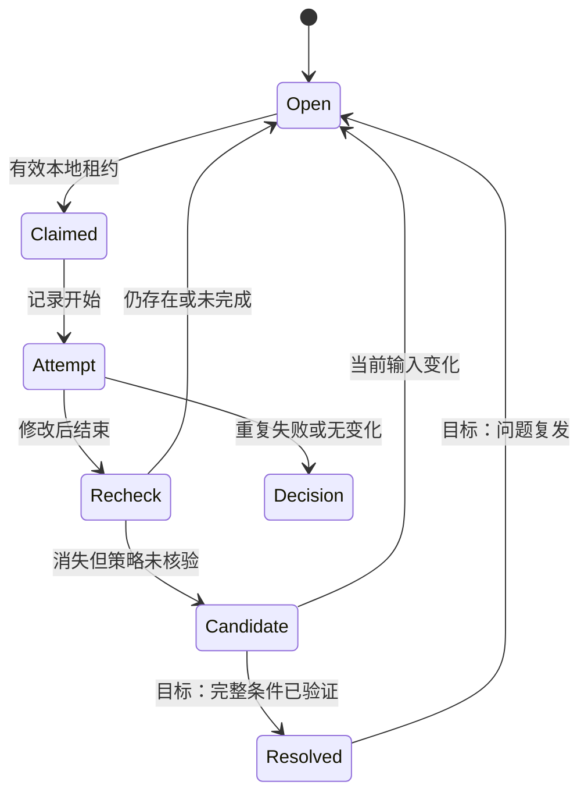

这是概念生命周期，不表示每个状态名都已原样持久化。当前本地事实仍保持 open，通过复检事件区分 `still_present`、`still_blocked`、抑制/配置核查及候选消失。尝试、租约和复检收据是独立结构。

租约不能只凭 owner 字符串覆盖，必须核对 token、generation 和期限。失败、无变化、放弃等尝试进入有界无进展处理。`next` 读取结构化事实及经核对的局部观察，不执行任务 Markdown 中的指令。完整父事件协调、跨机器协作、可靠正式关闭仍待完成。

## 12. 误报规则与信任边界

| 边界 | 要求 | 当前限制 |
| :--- | :--- | :--- |
| 原生诊断 → finding | 保留精确规则、工具、位置及不支持状态 | 解析器只实现选定协议和规则子集 |
| 项目文本 → 智能体上下文 | 转义为数据，不提升为策略 | 不宣称普遍免疫提示注入 |
| 候选 → 已批准例外 | 匹配当前身份、期限和批准范围 | 公开 CLI 尚无完整批准与生效链 |
| 原生抑制 → 修复结果 | 宣称修复前识别覆盖变化 | 仅部分适配器有对照复检 |
| 报告 → 当前观察 | 核对工作区、run、输入、工具绑定 | 摘要证明字节一致，不自动证明独立信任 |
| 任务投影 → 源码状态 | 必须原工具复检 | 勾选或删除不能证明解决 |

误报治理是明确产品能力，不是宽泛的 skip 开关。精确匹配和签名核验基础能力已存在，但不代表密钥分发、批准治理、可信时间和门禁接线已完成，见[误报技术方案](Codeguard-Technical-Design.zh_CN.md)。

## 13. 协议与配置

CLI 返回命令专属的版本化 JSON、可读投影及部分 SARIF。[Schema 目录](../schemas)包含当前与旧协议。通用/目标 `RunReport` 与多种当前局部观察协议并存，集成方不能假定所有命令已经返回同一个封套。

配置层具有不同权威：

1. 原生工具配置决定原生检查。
2. 项目运行选项决定时间和并发，不决定策略。
3. 规则包、工具锁、策略候选描述预期绑定，不能仅凭文件位置获得批准。
4. 已批准策略与例外需要明确可信来源，完整接线尚未完成。

运行优先级和精确 schema 见 [README](../README.zh-CN.md)。未知字段及不支持版本按对应解析器处理，不能泛称所有解析器已有完全相同的严格规则。协议兼容与旧退出语义需要显式适配。

## 14. 可靠性与运行恢复

| 故障 | 反馈与修复动作 |
| :--- | :--- |
| 缺 JDK、工具或配置 | 准备阻塞，恢复所需环境或配置 |
| 原生超时、输出超限 | 未完成，保留可独立解析且属于当前输入的发现 |
| JSON/XML 截断或协议未知 | 具体解析/协议原因，不制造 finding |
| 扫描中或扫描后输入变化 | 旧观察不能作为当前解决依据，重新扫描 |
| 同步冲突、持久化中断 | 保留原报告、反馈同步状态、重试或协调 |
| 人工修改 AGENTS 受管区块 | 保留人工内容，报告归属冲突 |
| 反复无进展 | 停止相同动作，给出具体决策需求 |
| 漏洞库未知或过期 | 展示可用局部观察及 CVE 完整性缺口 |

原生检查已无诊断时，不应仅因无关的策略前置未完成而无限重复扫描。目标体验是将缺失前置归并为一个稳定、可处理的问题。当前权威接线不完整属于产品缺口，不等于代码修复失败。

本仓库没有守护进程可用性 SLO、跨地域 RPO/RTO、生产指标后端或已验证基准。现阶段诊断依赖结构化反馈、run ID、本地观察和验收记录。原始日志即使被 Git 忽略，也可能包含敏感内容。

## 15. 部署、升级与集成

当前部署形态是本地构建二进制加独立准备的原生工具链。`@partme.ai/codeguard@0.1.3` npm 包通过 Node 命令入口携带 Apple Silicon macOS 二进制；Node 层只转发参数、工作目录、环境、输出与退出状态。该平台的发布、全新缓存 `npx` 版本检查及注册表/本地制品字节核对已通过。二进制回报候选源码提交，但这不证明签名来源、可复现构建、多平台发行或完整质量门禁。公开 `tools install` apply 仍受阻，内部包核验、下载和安装基础能力已有测试。

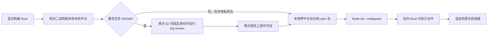

默认本地包标记为 private，不含 npm 安装钩子。`bin` 入口见 [npm/codeguard.cjs](../npm/codeguard.cjs)，[scripts/pack-npm-local.mjs](../scripts/pack-npm-local.mjs)使用已构建二进制打包。`--public` 模式已产出公开的 `@partme.ai/codeguard@0.1.3`，仅覆盖 Apple Silicon macOS；全新缓存运行和包/二进制摘要核对见[npm 0.1.3 验收记录](../tests/acceptance/npm-0.1.3-wasm-candidate.md)。扩大分发范围还需平台覆盖、可信制品清单、版本与摘要绑定及发行流程。CodeGraph 的 Node 入口和平台包布局为此设计提供参考；其可选网络回退不属于 Codeguard 当前安装路径。

已发布的 0.1.3 WASM 候选包使用 `--require-wasm` 或 `--public` 时，打包器会拒绝没有 worker 的二进制，核对固定清单的 32 份资产身份，并在写包前执行 Zig worker；[本地离线 npm 验收](../tests/acceptance/npm-wasm-local-package.md)另从包内运行 Zig、Dart。打包器还核对并分发全部固定上游许可证；公开 0.1.3 包与注册表字节一致。这不会让旧版 0.1.2 自动获得 WASM，也不证明任何语言的 lint 精度；见[公开候选验收](../tests/acceptance/npm-0.1.3-wasm-candidate.md)。

升级时记录二进制/schema 版本，保留工作区，预览受管变更，重跑有限检查，再核对报告消费。降级必须服从已有 schema 读取范围，不能为了通过解析而改写历史记录成旧格式。

目标插件应将宿主调用映射到同一 CLI 语义，将结果与下一步带回对话，同时区分传输失败与质量状态。宿主 fail-open 策略不能抹掉未解决发现。本基线调度器未提供 MCP 服务或宿主绑定。

## 16. 架构决策

| 决策 | 选择与理由 | 重新评估条件 |
| :--- | :--- | :--- |
| A01 语言 | Rust 编排，保留原生分析器的生态语义 | 实测平台限制要求有界适配变更 |
| A02 结果 | 发现与完整性独立 | 新类别需要额外维度，且不能删除原有两条信息 |
| A03 持久化 | 可审查文件及本地收据 | 实测规模或并发要求引入存储迁移，并保留兼容投影 |
| A04 智能体边界 | 检查和转换确定性，智能体提出修复 | 模型辅助建议经过独立评测且不能授予权威 |
| A05 例外 | 精确身份、批准及生命周期 | 真实场景需要更丰富身份，但不能误扩范围 |
| A06 架构发现 | 带证据的未知状态及直接声明 | 有效模型/源码图解析具备受控执行与测试依据 |

这些决策记录当前意图和约束，不追认缺失功能已经获批或完成。技术方案进一步给出实现细节、阶段依赖和可观察验收标准。

## 17. 验收与待决事项

验收维度包括原生语义正确性、误报和漏报测量、故障处理、稳定任务身份、有界重试、配置与抑制变化、输入新鲜度、平台行为和真实宿主交付。单元测试通过或 schema 文件存在不能合并证明以上全部要求。

有日期的本地基线为 990 项测试通过、101 项忽略。不能据此推断生产误报率、完整原生矩阵、MSRV 矩阵、全部平台支持或远程 CI 成功。

面向生产仍须明确批准来源的所有权、可用的例外评审体验、工具分发与升级职责、跨平台进程隔离、schema 保留策略、私密漏洞披露和发行包装。这些缺口不妨碍使用明确范围内的局部观察，但限制了完整生产质量门禁的完成声明。

---

**文档版本：**1.2.0 · **创建日期：**2026-09-28 · **最后更新：**2026-10-04 · **文档状态：**待评审；实现仍为局部完成。

源码新增编辑事件原生优先快检：`hook execute` / `hook claude post-tool-use` 只检查事件明确指定的普通文件，Python 用 Ruff、JS/TS 用模块本地 ESLint 10；同字节完整原生结果不重复解析。未覆盖文件可调用固定 WASM 候选，混合语言仍保留局部结果、原生未接线范围和失败原因。疑似恢复节点要求安装或修复原生工具并确认；完整零恢复候选只建议安装，不代表完整通过。共享事件截止时间，最多 8 文件、2 个 WASM worker；未构建 WASM 明确报告缺口。外层反馈 0.7.0，局部 `hook_fast_feedback` 0.2.0。候选任务已接入现有工作台；默认插件 Hook、能力匹配自动关闭和真实宿主验收未完成。见[编辑快检验收](../tests/acceptance/hook-fast-native-wasm.md)。

源码编辑快检现将有恢复节点的固定 WASM 候选同步到既有 `.codeguard/` 工作台：按工作区/文件/语言稳定归并，Python 与 JS/TS 复用原有确认或准备身份。报告保存固定 grammar、源码 SHA-256、已知限制和原字节疑似位置；导入拒绝身份或坐标失配、重复 JSON 键。只有实际同步成功才给出任务 ID；完整零恢复不创建新的必需任务；无定位但恢复扫描未完成时创建检查恢复任务。两者都不能关闭旧任务。对话提供 `task show` / `task verify`，缺原生确认 adapter 明确反馈能力缺口。外层 Hook 协议为 0.7.0，局部为 0.2.0；通用 `next` 简报用 0.3.0，已有检查器仍返回 0.1.0。默认插件 Hook、能力匹配关闭和真实宿主验收仍未完成。


### Zig 确认任务的原生复检

源码构建现可执行 `codeguard task verify TASK_ID . --zig-tool /absolute/path/to/zig --format=json`，复检已持久化的 Zig WASM 确认任务。`hook execute` 的 `repair_ready` 事件接受同一显式工具参数，复用现有租约和已结束的尝试关联。`lint zig` 原生路径不依赖可选 WASM 特性；未构建该特性时，回退明确报告缺失。

固定 Zig 0.16.0 探针在共同截止时间内执行 `version` 与 `ast-check --color off`，以 stdin 检查本轮原始源码字节。当前原生诊断使简报指向源码修复；工具缺失、版本不支持和执行失败仍指向环境恢复或具体决策。新鲜的 `next` 简报在复检 argv 中携带未改变的工具路径；源码或工具字节变化使旧诊断指引失效。报告与尝试继续保存在既有工作台，不另建任务系统。

原生观察协议为 `syntax_task_recheck` 0.1.0，外层 `task_verification_preview` 为 0.12.0；通用修复简报为 0.3.0，原 0.2.0 简报与 0.11.0 复检 schema 原件保留。原生 AST 零诊断记录为 `candidate_absent_unverified_policy`：解除本地尝试的待复检状态，但不关闭任务，不认证项目 lint、构建或交付。Erlang 现通过显式 OTP 28 接入同一工作台，独立协议版本见 [Erlang 任务验收](../tests/acceptance/erlang-native-task-verification.md)；Swift 也已有显式 Apple Swift 6.4 的局部 parse 复检，见 [Swift 验收](../tests/acceptance/swift-native-task-confirmation.md)；Zig/Erlang/Swift 之外的通用原生确认 adapter 仍缺。见[验收记录](../tests/acceptance/syntax-native-task-verification.md)。

简报同时提供最新原生报告引用/摘要和当前诊断位置；输入失效后不再投影这些位置。编译入二进制的不可变 grammar 校验结果仅在进程内复用，外部清单、源码和原生工具仍按当前字节复核。


### 限定任务的可信关闭与复发重开（源码 SDK）

当前源码提供 `verify_zig_task_resolution`，面向受保护宿主核验 **Zig 原生语法确认任务**。宿主独立固定验签密钥、工作区、策略修订、代码基线、可信时间和防回滚序号，并提供摘要绑定的原始反例；这些输入不能从项目自选公钥、候选策略或任务 Markdown 中取得。该入口尚未接入默认插件或公开 CLI 的可信策略提供者，也未包含在已发布的 npm 0.1.3 中。

处理器在既有任务租约下使用同一批准的 Zig 0.16.0，先检查原始字节，再检查当前文件；两次检查共享请求截止时间，并受批准到期时间限制。只有原样本有原生诊断、当前源码已改变且零诊断，工具/宿主制品/grammar/任务/策略身份一致时，才追加 `code_fixed` 解决事件。原样本同样零诊断进入误报调查；环境失败或输入变化进入待核验，不记为代码修复。适用能力仅为语法，不代替完整 lint、类型、安全或 CVE 检查。

生命周期事件按明确父关系重放；重复复检不重复追加同一解决事件。普通 `task verify` 再次取得匹配原工具的当前原生诊断时追加 `reopened`，保留首次事实与解决历史，并重新提供当前原生修复指引。父节点缺失、分叉、重复身份、证据丢失或摘要变化须核对，不能按时间最新覆盖。关闭处理器复用既有原生观察/尝试收据，解除对应 `awaiting_verification`，借用租约不被释放。

`.codeguard/findings/<id>/events/lifecycle-*.json` 是脱敏追加记录；对照证据位于默认忽略的 `.codeguard/state/resolution_evidence/`。首次 `finding.json` 不改写。本地 `next/task show/status` 不持有可信策略，因此不把历史声明升级为当前关闭或交付许可；关闭历史给出复核步骤，复发则沿用当前原生诊断。每份宿主收据的 `delivery_decision` 均为 `not_evaluated`。

完整范围仍缺其它检查器的可信关闭、环境/依赖/删除目标/政策处置、实际宿主策略来源、跨机器证据恢复及正式交付门禁。见[限定任务验收](../tests/acceptance/task-resolution-lifecycle.md)。


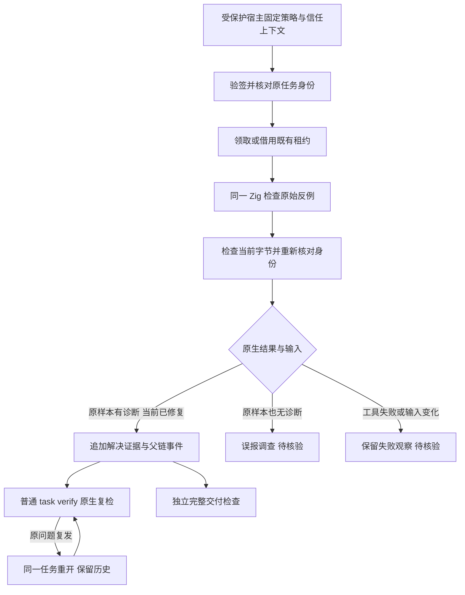


### 当前公开候选：0.1.4

`@partme.ai/codeguard@0.1.4` 已从干净源码 `1cd458f6e01a44a74388243e964e3f45290ac18e` 发布，限 Apple Silicon macOS。包含全部 32 份可执行但未验收的 grammar、指定编辑文件检查、稳定原生确认任务、原生复检与 next 指引。注册表摘要、新缓存 npx、公开包真实 Zig 0.16.0 修复链路及相同源码 Linux CI 已通过。普通 CLI 的零诊断不能在缺可信策略时关闭任务；限定 Zig SDK 是源码集成 API，npm 不暴露自批命令。插件启用、真实宿主、完整精度、多平台与完整门禁仍未完成。此前 0.1.3 证据保留为历史快照。见 [0.1.4 验收](../tests/acceptance/npm-0.1.4-candidate.md)。


### Erlang 确认任务与原生修复指引（当前源码）

`codeguard task verify TASK_ID . --erl-tool /absolute/path/to/erl --format=json` 和 `hook execute . --erl-tool /absolute/path/to/erl` 的 `repair_ready` 事件现复用已有 `.codeguard/` 任务、租约、尝试记录与共享截止时间，执行与 `lint erlang` 相同的 OTP 28 原生 forms 解析。工具和任务语言在租约或启动进程前核对，不启动项目源码、宏展开或 parse_transform。

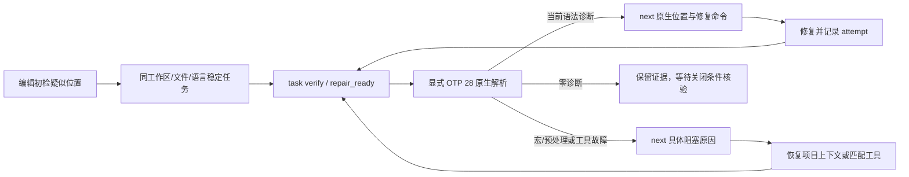

Erlang 原生观察使用 `syntax_task_recheck` 0.2.0，复检反馈为 `task_verification_preview` 0.13.0，复检后的 `next` 简报为 0.4.0；Zig 和历史 schema 原件不变。简报新增 `native_confirmation_reason`，缺工具给出明确 OTP 28 准备动作；宏/条件编译给出项目原生预处理/编译需求。源码变化会清空当前诊断并要求复检；工具改变会移除旧工具 argv。只有版本已观察为 OTP 28 且摘要仍一致的工具可复用，过旧工具不能被建议为已就绪工具。

原生零诊断记录为 `candidate_absent_unverified_policy`，解除关联尝试的待复检状态，但不关闭任务或签发交付许可；两次无进展沿用既有预算，转为具体决策而不是重复修复。当前限定可信关闭 API 已扩展到 Erlang 源码 SDK，默认宿主仍缺受保护策略接线；Erlang 项目完整 lint/预处理、原生发现的完整生命周期、自动工具发现及实际宿主发行尚未完成。公开 npm 0.1.4 不含此扩展。[验收与协议](../tests/acceptance/erlang-native-task-verification.md)。

Erlang `repair_ready` 使用 Hook 0.8.0 / 内层摘要 0.2.0，直接包含当前原生位置、具体未完成原因、Unicode 字符列单位和已保存报告引用；其他 Hook 版本保持不变，实际安装宿主对话交付尚未验收。

### 统一入口的 Erlang 原生优先检查（当前源码）

```bash
codeguard check all . --format=json
codeguard check all . --erl-tool /absolute/path/to/erl --timeout 30s --jobs 2 --format=json
```

`erlang.lint` 节点选择显式工具或 PATH 绝对目录中的首个可执行 `erl`，复用已有受控 OTP 28 scanner/parser。每轮最多观察 64 个普通 UTF-8 文件，每文件不超过 1 MiB，沿用请求总截止时间和任务图并发预算。`native_results.erlang_lint` 提供当前源码摘要、诊断位置、工具选择、逐文件下一步及采用绝对源码路径的原工具复检 argv，可从项目外直接重放；超出原生预算的范围明确计入未观察数。

只有完整、非预处理、源码与工具字节都匹配的 forms 观察才跳过重复 WASM。工具缺失保留候选初检；所选工具失败仍可伴随补充候选观察，但原生阻塞不会被洗成成功。宏/条件编译继续未完成。源码或工具变化会撤回受影响文件的当前定位和可复用 argv。项目范围变化设置 `scope_stable: false` 并保留仍与当前字节匹配的单文件诊断，同时撤回整体范围完整性。SIGINT 保持退出 130；JSON、human 和保守 SARIF 保留原生发现，不签发项目通过。

已初始化工作区的原生发现现在直接进入稳定任务，不要求先有 WASM 错误：聚合反馈现为 `check_feedback` **0.38.0**，内嵌 scan **0.2.0**，逐文件返回真实 `task_id` 或 `task_sync_reason`；`lint erlang FILE` 自动绑定最近已有工作台，反馈为 **0.3.0**。重复扫描和历史 WASM 来源复用同一任务，缺工具与预处理进入环境任务。未初始化聚合检查同为 0.38.0，历史协议保留；`check_aborted` 仍为 **0.13.0**，历史 schema 字节不改。可信关闭、复发重开和完整项目检查仍缺；公开 npm 0.1.4 不含本批实现。见[原生发现到修复指引](Codeguard-Native-Repair-Workflow.zh_CN.md)及[实际验收](../tests/acceptance/erlang-native-first-workbench.md)。

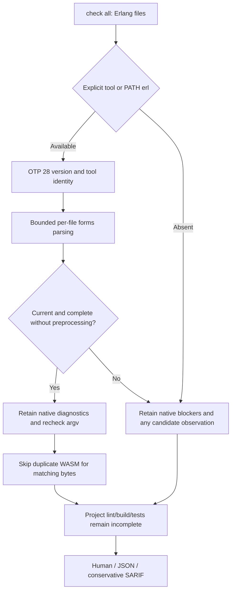

### 全 grammar 开发评测边界（2026-10-04）

开发期 `evaluate_grammars` 复用同一 Rust 隔离 worker 与 Core 分层计算，固定全部 32 份 grammar 和 358 例语料。0.2 协议将仓库回归、Dart 上游回归和待裁定预期分成 35 个语言×来源组；每组计算分类与区间，多来源语言汇总只加计数、不混算精度。Rust 导入器保留源码字节、上游预期及来源摘要；旧 0.1 语料/报告不改写。清单/源码/程序身份、未知和 pending 均保留，不成为项目质量门禁或独立 holdout。执行路径、逐组统计与缺口见 [统一 grammar 评测](Codeguard-Grammar-Evaluation.zh_CN.md)。

## P3C 单文件应用服务

原生单文件 lint 与聚合检查共用 P3C 保存/同步、稳定 finding 身份和原工具复检。单文件路径读取祖先 POM，执行范围仅限所选文件。见[修复流程](Codeguard-Native-Repair-Workflow.zh_CN.md#p3c-单文件项目绑定)。完整生效模型覆盖和可信关闭仍待完成。

原生解析、项目投影、同步和复检全程区分问题事实与执行完整性。P3C 异常终止时，已核对的有效诊断保留为稳定 finding；失败文件不计入完整观察，同时保留执行阻塞。空、无效、越界或输入变化的报告不证明问题消失。见[部分执行验收](../tests/acceptance/java-p3c-partial-execution.md)。


### Erlang 限定任务关闭与复发（当前源码 SDK）

`verify_erlang_task_resolution` 复用 Zig 的签名核验、共享截止时间、租约、尝试交接和追加父链服务。受保护宿主独立固定信任根、工作区、策略修订、基线和可信时钟；项目文件不提供批准权威。OTP 28 对首次反例和当前字节分别执行 scanner/parser：首次有原生诊断、当前字节改变且完整无诊断，才能记录 `code_fixed`。宏/include、空 forms、截断或执行失败保留待核验；原样本合法进入误报调查。

支持 WASM 首次和原生首次两种任务来源。Erlang 策略 1.1.0、证据 0.2.0 与旧 Zig 1.0.0/0.1.0 独立；原生首次的 `grammar_sha256` 必须为 null，首次工具身份也须一致。内部规则身份使用实际批准策略字节摘要，不伪造 grammar 摘要。历史读取核对首次报告语言、源码和 grammar，重算本地摘要不能跨语言套用。普通 `task verify --erl-tool` 可在同一工具下追加复发重开；没有可信策略仍不能关闭。

这仍是源码 SDK，尚未接入默认插件的可信策略提供者，公开 npm 0.1.4 不含本批扩展；限定语法任务收据不是完整 lint、安全或项目门禁许可。原生工具摘要绑定 launcher，宿主仍须独立保护 OTP 运行环境。执行路径与实际测试见 [Erlang 生命周期验收](../tests/acceptance/erlang-task-resolution-lifecycle.md)。

### Cargo 输入与代理入口边界（当前源码）

Clippy 的普通扫描及同规则 `--force-warn` 对照使用 `cargo clippy --locked --offline --all-targets --message-format=json`。缺少根 Cargo.lock 时，在原生启动前返回 `cargo_lock_unavailable`，不生成锁文件。源码指纹取自启动前的有界快照；已观察源码、清单、锁、根 Clippy/Cargo/工具链配置或原工具改变时撤回本轮 Clippy finding，保留准备/重扫任务。稳定输入下的部分有效诊断仍保留，不能把损坏报告称完整。

Cargo 为 rustup 等按入口名称分派的代理时，Clippy、rustdoc 与构建检查保留所选 Cargo 路径执行，同时核验解析目标的字节及运行后身份。私有 Clippy 输出目录以独立序号防止同时间戳碰撞。该边界只覆盖已观察输入，不证明完整 Cargo 生效配置、所有构建组合或进程沙箱；局部零诊断仍不能自动关闭任务。测试、失败记录和真实输出见 [Cargo 输入验收](../tests/acceptance/rust-clippy-input-stability.md)。公开 npm 0.1.4 尚不包含本批修改。


聚合原生阶段完成后，当前源码会用 Clippy 的非缓存 `compiler-artifact`、原根清单身份和启动前源码摘要，免除同字节 Rust 目标入口的重复 WASM。覆盖只在本次进程内传递，不从可编辑报告恢复；失败、输入/工具变化、重复 JSON 键或结束记录后的事件不授予覆盖。`all-targets` 不能证明整个目录已解析，未证明的模块和条件排除文件继续初检；原生告警、稳定任务及完整交付义务均保留。同一文件/规则/行/列在库和测试目标中重复报告时只投影一项 finding，级别以 error 优先；不同位置分别保留，历史重复任务不自动关闭。见 [Rust 原生优先验收](../tests/acceptance/check-all-native-preferred-rust.md)。公开 npm 0.1.4 尚不包含本批修改。


### 已安装 Cargo 自动发现（当前源码）

`check all`、`comments rust`、`build rust` 及其 Cargo 任务复检接受可选 `--cargo-tool`。未指定时，从调用方 PATH 的绝对目录中选择首个普通可执行 `cargo`；空目录、相对目录和不可执行入口不作为候选。显式无效工具或已选工具执行失败保留具体阻塞，不换用下一个 Cargo。聚合 Rust 检查共用本轮已选入口。

最终 `cargo` 入口名保留，以兼容 rustup 按名称分派；既有解析后字节和运行后目标身份校验继续执行。子进程保留 `RUSTUP_TOOLCHAIN`，并固定 `RUSTUP_AUTO_INSTALL=0`，即使调用方设置为 `1`。Cargo 的 `--locked --offline` 不独立约束 rustup 安装工具链；[rustup 官方说明提供单独控制](https://rust-lang.github.io/rustup/environment-variables.html)。缺工具链仍是环境故障，不生成源码违规，也不自动安装。本项不证明完整工具链、有效 Cargo 配置、全项目覆盖或可信任务关闭。

受控代理/不换工具反例及实际已安装/缺工具链观察见 [Cargo 自动发现验收](../tests/acceptance/cargo-native-discovery.md)。公开 npm 0.1.4 不包含本次源码变更。


### 项目根 Ruff 工具发现（当前源码）

已配置Python扫描的 `lint python`、`check all`、指定编辑Hook执行及同根任务复检，依次选择显式 `--ruff-tool`、受检根 `.venv/bin/ruff`、调用方绝对PATH目录中的可执行入口。不激活Shell环境、不枚举安装包、不安装Ruff；本地入口沿既有原生链路探测版本、固定并复核字节。普通本地目录/入口不存在时可继续PATH；父目录链接/非目录、损坏或不可执行入口返回 `ruff_local_tool_invalid`，不静默换用全局Ruff。所选工具版本/执行失败不尝试其它工具。

损坏本地环境生成一张稳定准备任务，包含 `.venv/bin/ruff` 证据、限定环境修复范围、原Codeguard复检、历史及关闭条件。没有适用Ruff配置不启动工具。普通本地父目录中可使用可执行文件链接：解析后的工具字节在本轮固定并复核。局部成功或源码修复后零诊断仍不批准策略、不自动关闭任务。本项面向明确的受检根；逐模块虚拟环境、uv/Poetry/Conda解析、真实宿主及完整覆盖仍是独立待完成范围，见 [根内Ruff验收](../tests/acceptance/ruff-local-discovery.md)。公开npm 0.1.4不包含本次源码变更。


### 无定位语法观察的检查恢复任务（当前源码）

`check all/java` 与确认写入的 Hook 共用语法任务同步：有可定位恢复节点的观察需要原生确认；树已报告错误但恢复扫描未完成且没有可定位节点时，生成检查能力恢复任务。后者保留空恢复数组和 `syntax_recovery_incomplete`，不记为已确认源码违规，也不虚构修改位置。完整零恢复观察只推荐原生检查，不新建这类任务。

同一工作区、文件和语言复用原有稳定任务身份；重复检查、Hook 和后续可定位观察更新同一任务。`next`/任务 Markdown 明确恢复工具、语言版本或 grammar，原生确认前不得修改源码。没有原生确认 adapter 时，`task verify` 记录能力缺口并保持开放；零恢复、安装或勾选均不关闭已有任务。保存失败保留观察、逐文件失败原因且不返回虚假任务 ID。

聚合反馈使用 `check_feedback` 0.38.0 的 `syntax_tasks`；无位置本地确认报告为 0.3.0，可定位历史报告 0.1.0 与 Erlang 原生首次报告 0.2.0 保留。旧 schema 原件不改。Claude Hook 命令上下文分别显示恢复节点数和恢复扫描未完成数；这仍是命令重放，真实宿主与全部语言验收尚缺，公开 npm 0.1.4 未包含本批改动。见[验收与实际报告](../tests/acceptance/unlocated-syntax-recovery-tasks.md)。

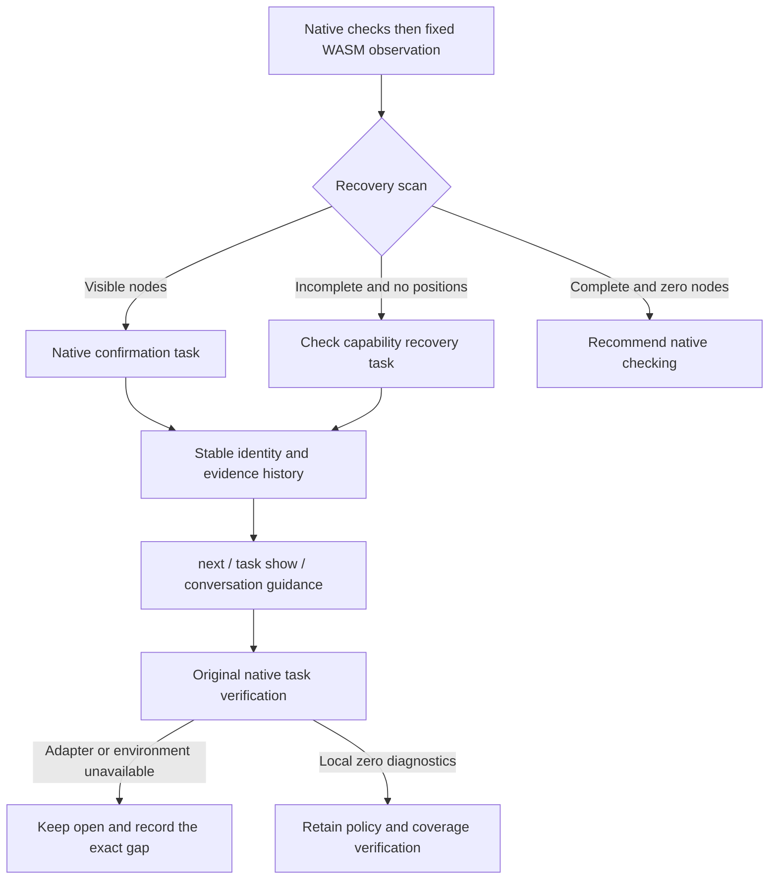


### Erlang 任务复检自动发现原生工具（当前源码）

`codeguard task verify "$TASK_ID" . --format=json`（`TASK_ID` 使用 `next` 返回的真实 `task_id`） 对已有 Erlang 语法任务复用 lint/check 的工具选择：显式 `--erl-tool` 优先，否则从调用方 PATH 的绝对目录固定首个普通可执行 erl。复检核对 OTP 28、当前源码与工具字节，并沿用任务租约、预算、事件和原有报告版本。候选来源及原生首次发现来源均可复检；repair-ready Hook 复用同一入口。

未找到工具才生成 `erlang_tool_not_found_on_path` 的环境观察；相对/空 PATH 与不可执行文件不参与选择。显式坏工具、所选版本或执行失败不改用后续工具，也不自动安装。成功观察后的 `next` 带实际工具的显式复检 argv，后续 PATH 变化不能替换这个入口。局部零诊断依然不自动关闭任务，宏/预处理、可信策略和完整项目能力仍须核验。见[复检自动发现验收](../tests/acceptance/erlang-recheck-discovery.md)。公开 npm 0.1.4 尚未包含本批改动。

### Swift 无定位观察的原生复检（当前源码）

已有 Swift 确认任务现支持 `codeguard task verify "$TASK_ID" . --swift-tool /absolute/path/to/swiftc --format=json`；`TASK_ID` 来自实际 `next`。同参数可传给 `hook execute` 的 `repair_ready`。调用方必须指定已有 Apple Swift 6.4 工具；当前不自动安装或从历史报告启动可编辑路径。缺工具给出定位既有编译器的具体动作，版本不匹配或执行失败保留原任务。

Rust 读取并复核有界源码字节，通过冻结 stdin、固定 `/` cwd、清空环境和共同截止时间执行 `swiftc -frontend -parse -diagnostic-style llvm -no-color-diagnostics -`。只投影原生错误的规则和位置，不把原始诊断文案交给智能体作为指令。Swift 列坐标是 UTF-8 字节，核对字符边界；未知输出、退出码矛盾、超时、位置越界或工具变化均保持未完成。工具摘要绑定启动入口，不独立认证整套 Swift 安装环境。

原生错误使同一任务的 `next` 进入源码修复；源码或工具变化撤回旧位置。修复后零诊断记录 `candidate_absent_unverified_policy`，不自动关闭，也不替代项目 lint、类型检查、宏/条件编译上下文、构建、安全或交付义务。重复无进展仍使用既有尝试预算。本批不提升 Swift grammar 资格或 32 语言精度结论，公开 npm 0.1.4 尚不含此扩展。

新增协议分别为 `syntax_task_recheck` 0.4.0、`task_verification_preview` 0.15.0、`repair_brief_preview` 0.6.0、Hook 反馈 0.9.0（任务摘要 0.3.0）。聚合 `check` 的 `next` 含 Swift 原生简报时用 0.39.0，其他路径保留 0.38.0；旧 schema 原件不改。具体实测和完整报告见 [Swift 原生确认验收](../tests/acceptance/swift-native-task-confirmation.md)。

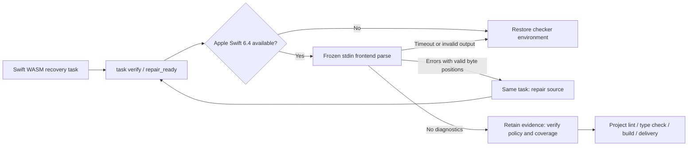


### Claude 实际生命周期验收与首次任务指引

Claude Code 2.1.273 已有会话内插件源码加载的实际证据，覆盖成功保存、重复保存、执行阶段文件系统写入失败、修复前后实际 Zig 0.16.0 复检、稳定任务以及 Stop 首次继续与重入保护。锁定公开运行时仍是 0.1.4，与当前开发源码区分。原生诊断从一项变为零项，任务保持 open，交付未评估。Edit 参数预检在工具执行前失败，本宿主未调度失败 Hook；另以真实 EACCES 写入验证 PostToolUseFailure。这不代表市场安装、可信关闭、完整原生优先或多宿主验收；见[实际宿主证据](../tests/acceptance/claude-host-prepared-runtime.md)。

实测暴露首次任务指引误称 Zig adapter 未接入，但其原生复检确实可执行。开发源码的 `next` / `task show` 现从已绑定原报告区分已接入的 Zig 0.16.0、OTP 28、Apple Swift 6.4 adapter 与尚未核验的本地工具就绪状态，提供对应显式工具参数。只读指引不执行或安装检查器、不信任可编辑任务记录中的执行路径、不在原生确认前授权源码修复、不关闭任务；未接入语言保留具体能力决策，既有原生历史继续优先。锁定公开 0.1.4 尚不包含这项修正。

首次原生确认指引使用 `repair-brief-preview` 0.7.0，明确绑定语言、受支持工具版本、工具选择参数以及 `tool_readiness: not_evaluated`。聚合检查对应 `check-feedback` 0.40.0；`task show` 外层动作与内层复检参数一致。占位路径必须由智能体核对实际已安装工具后替换，不代表工具已就绪或原生检查已执行。历史协议保持原定义，不放宽旧消费者。

### Kotlin 原生优先单文件检查（开发源码）

`codeguard lint kotlin FILE.kt [--kotlinc-tool ABS_PATH] [--timeout 30s] --format=json` 优先使用显式工具，未指定时选择调用环境绝对 PATH 中首个 `kotlinc`，当前适配 Kotlin/JVM 2.4.10。工具缺失时使用内置 WASM；已选择工具失败时保留原生阻塞，不通过换工具或 WASM 隐藏失败。仅检查冻结的普通 `.kt`，不执行 `.kts`、Gradle/Maven 项目脚本或编译器插件。

`[SYNTAX]` 输出 `kotlin.syntax`，其他诊断进入上下文列表；位置保留 UTF-16 原列并转换为 UTF-8 字节列。未知输出、入口重定向、源码变化和预算中断均不能解释为通过。缺少两个后端或原生检查未完成时要求进一步原生确认；真实 WASM 零恢复且扫描完整时推荐安装原生工具，仍不代表完整项目通过。报告 schema 为 `kotlin-lint-feedback` 0.1.0。

已接通独立 lint、已有稳定任务的 task verify 与 repair_ready；聚合反馈可投影当前任务指引，首次 check/file_changed 已接通 Kotlin 原生优先扫描及稳定任务同步；完整 Kotlin lint/注释检查、JDK 与编译器 JAR 身份、跨版本及发行验收仍未完成。该增量不在公开 npm 0.1.4 中。见 [Kotlin 单文件验收](../tests/acceptance/kotlin-native-single-file.md)。

### Kotlin 稳定任务复检与对话反馈（开发源码）

已有 Kotlin WASM 确认任务可运行 `codeguard task verify TASK_ID . --kotlinc-tool ABS_PATH --format=json`；未显式选择工具时复用独立入口的 PATH 选择规则。`hook execute --kotlinc-tool ABS_PATH` 的 `repair_ready` 路径复用原任务、租约和尝试历史。`next` 与 `task show` 从绑定事实生成工具指引，不从可编辑 Markdown 执行命令。

语法诊断和项目上下文混合出现时，简报保留当前语法位置供修复，同时保留上下文诊断和未完成状态。源码或工具变化立即撤销旧位置；原生零诊断进入后续策略与覆盖核验，不再建议重复改源码或反复安装。复检不自动关闭，Kotlin 的正式可信关闭尚未接入。聚合 `check all` 可携带当前简报，首次扫描也已对普通 `.kt` 调用 Kotlin 原生 compiler。

协议分别为原生复检0.5.0、任务反馈0.16.0、历史简报0.8.0、首次工具准备简报0.9.0、Hook反馈0.10.0、聚合反馈0.41.0。历史协议文件字节保留，未把新 Kotlin 字段放宽进旧消费者。见[Kotlin 任务复检验收](../tests/acceptance/kotlin-native-task-confirmation.md)。

### Kotlin 首次原生观察（开发源码）

`check all . --kotlinc-tool ABS_PATH` 和确认保存的 `file_changed` 接受相同显式工具；省略时发现调用环境 PATH。已选工具失败保留原生阻塞，不改走 WASM；仅缺工具时使用候选初检。最多 64 份普通 `.kt` 共用请求截止时间，不在此路径编译 `.kts`。重复扫描更新同一稳定任务，原生零诊断不自动关闭任务。

新增聚合0.42.0、保存 Hook0.11.0、扫描0.1/0.2、原生首次事实0.4.0、原生来源复检0.6.0/任务反馈0.17.0，以及首次原生简报0.10.0；已有 WASM 来源任务继续沿用旧协议。见[首次原生验收](../tests/acceptance/kotlin-native-first.md)。完整项目 lint、编译器/JDK 身份、可信关闭和公开发行仍待完成。

首次报告属于未完成、无法定位的恢复时，新的缺工具或过期原生历史不能抹掉该限制；`next` / `task show` 保留“原生确认前不得修改源码”，并叠加具体环境恢复动作。当前原生语法诊断可继续用于修复，当前零诊断仍需覆盖与策略核验。见[原生历史指引回归](../tests/acceptance/unlocated-native-history-guidance.md)。

### Swift 原生优先单文件反馈（开发源码）

`codeguard lint swift FILE.swift [--swift-tool ABS_PATH] [--timeout 30s] --format=json` 优先选择显式编译器，否则调用环境绝对 PATH 中首个普通可执行 `swiftc`。当前适配 Apple Swift 6.4，对冻结 stdin 执行 frontend parse；仅缺工具时使用内置 WASM 候选，选定工具失败保留原生阻塞。位置为 UTF-8 字节列；源码或入口目标变化撤回旧诊断，超时/取消不按源码违规解释。

`swift-lint-feedback`0.1.0 区分未完成/隐藏恢复所需的原生确认，与完整零恢复后的推荐准备。它不授予完整 lint 或交付通过：SwiftLint、注释、类型、依赖/安全和项目构建仍有义务。工具身份只覆盖所选入口，不代表整个工具链。Swift 项目原生观察已按下文接线；初始化工作区的原生任务连接见下文；完整语言及发行验收仍未完成；公开 npm0.1.4不包含本增量。见[单文件验收](../tests/acceptance/swift-native-single-file.md)。

### Swift 项目原生观察（开发源码）

`check all . [--swift-tool ABS_PATH] --format=json` 对最多 64 份普通 Swift 文件在同一截止时间内执行冻结原生 parse，报告未观察文件；原生选择失败不回退，只有缺工具保留 WASM。`check-feedback`0.43.0 / `swift-parse-scan`0.1.0 保留当前字节位置、工具选择及复检 argv。源码或工具变化撤回位置，零诊断不等于完整 SwiftLint、类型或构建通过。该历史协议描述未初始化工作区的 `not_connected`；初始化工作区现支持原生稳定任务，见下文。见[项目观察验收](../tests/acceptance/swift-native-project.md)。

确认保存事件的 `hook execute . --swift-tool ABS_PATH` 复用同一 Swift scanner，只检查选中路径；缺工具保留候选，已选工具失败不切换。`hook-execution-feedback`0.12.0 / `hook_fast_feedback`0.4.0 描述未初始化工作区的当前原生位置与未接任务状态。CLI Claude 适配器以有界计数/字节位置反馈，不回显工具诊断文本；混合范围候选疑似仍要求原生确认。初始化工作区的稳定原生任务见下文；源码插件实际宿主安装及正式闭环仍需验收。见[保存反馈验收](../tests/acceptance/swift-native-hook.md)。

### Swift 原生优先修复工作台（开发源码）

已初始化 `.codeguard/` 的项目，`check all` 和确认成功保存后的 `hook execute file_changed` 将 Swift 原生语法诊断或环境阻塞同步为稳定任务。重复检查复用同一任务；`next` 与 `task show` 提供证据、规则、修改范围、步骤、复检命令、历史和关闭条件。未初始化工作区明确报告工作台未连接，同步失败保留阻塞，不能假定任务已生成。独立 `lint swift` 尚不生成任务。

`codeguard task verify TASK_ID . [--swift-tool ABS_PATH] --format=json` 对首次原生来源任务支持显式工具或调用环境 PATH 发现。已有 WASM 来源任务保留显式工具契约；不执行历史记录中未经核对的路径。复检有诊断时要求修复源码；零诊断记录 `candidate_absent_unverified_policy`，原任务仍 open，后续完整 lint、类型、构建与交付检查仍待完成。

首次原生来源协议为 observation 0.5、scan 0.2、check 0.44、首次 brief 0.11、保存 Hook fast 0.5 / 外层 0.13、复检内层 0.7 / 外层 0.18。已有复检简报继续使用 0.6；旧 schema 保持原件。实际 Apple Swift 6.4 执行验证了重复扫描、保存和修复前后复检的同一任务引用。本轮没有真实安装宿主或可信关闭验收，也不在公开 npm 0.1.4 中。

### 缺失任务投影恢复

`codeguard work sync . --format=json` 现在在工作区同步锁内恢复已提交事实对应的缺失 Markdown，再导入新报告并复核缺失投影。恢复读取结构化事实、当前 RepairBrief、原报告摘要和消费标记，不执行检查器；现有普通任务文件原字节保留，包括用户备注和勾选。链接、目录冲突、坏事实、来源摘要变化及未提交来源明确未完成。最多检查 1000 条事实，避免无界恢复。

恢复只创建可读任务，含问题证据、规则依据、允许范围、步骤、复检 argv、历史及关闭条件。复检参数中的本机绝对路径脱敏为待核验占位；通过 `task show` 查询当前真实指引。恢复不关闭问题，不改原事实、事件、消费标记或尝试历史，也不代表门禁通过。仅恢复发生时使用 `work_sync_preview` 0.3.0，并返回正整数 `restored_task_projections`；无恢复时保留 0.2.0。

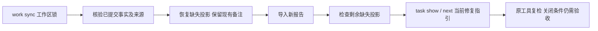


## 独立源码任务的下一步

当next原优先项是等待执行者或预算耗尽的源码问题，且没有前置blocker，CLI会检查是否另有不同物理源码范围的可修复/待复检finding。证明独立后推荐该项，同时在next_actions及human输出保留延后任务的只读task show入口。原问题、预算、租约和门禁保持不变。重叠、别名、范围未知、坏事实或失败报告不被绕过；完整跨模块依赖图仍未完成，非Unix保留原选择。详见[实际验收及完整报告示例](../tests/acceptance/next-independent-source-work.md)。

### Swift 限定语法任务闭环（开发源码）

受保护宿主可调用 `verify_swift_task_resolution`，以 Apple Swift 6.4 对照首次反例与当前源码。策略 1.2.0、脱敏证据 0.3.0 与 Zig/Erlang 分版本；原生首次任务的 grammar 保持 null。原反例确有 parse 诊断、当前源码改变且同工具完整无诊断时追加 `code_fixed`，重复验证幂等；普通 `task verify --swift-tool` 检出同工具复发时重开同一父链。原反例合法转误报调查，工具异常或身份变化不关闭。签名和信任根由独立宿主提供，项目记录不提供关闭权威。此接口尚未接入默认插件或公开发行，不代替 SwiftLint、类型检查、项目构建和完整交付验收。详见[闭环验收](../tests/acceptance/swift-task-resolution-lifecycle.md)。

### Kotlin 限定语法关闭与上下文分流（开发源码）

`verify_kotlin_task_resolution` 复用共享宿主 SDK，以 kotlinc-jvm 2.4.10 对照原反例及当前源码；策略 1.3.0 / 证据 0.4.0 独立于其它语言，原生首次 grammar=null。原反例的 UTF-16 与 UTF-8 字节坐标须同时有效，源码已改变且原工具完整零诊断才追加 `code_fixed`。仅上下文诊断保留待验证；混合上下文未完成和已确认语法诊断时，保留原问题并支持普通 `task verify --kotlinc-tool` 重开同一父链，不因 `incomplete` 丢弃正向发现。签名来源由宿主独立固定；当前只绑定 launcher，不证明完整 JAR/JDK/项目构建身份。默认插件可信关闭、完整 lint/类型及发行仍未完成。详见[验收](../tests/acceptance/kotlin-task-resolution-lifecycle.md)。


2026-10-05 开发源码 Zig 原生路由：`check all`、`check zig` 与限定编辑文件现在复用冻结的 Zig 0.16.0 AST 探针。显式/PATH 选择后优先原生；选定工具失败保留未完成观察，不改用 WASM 绕过。缺工具时保留候选回退。源码或工具入口变化撤回旧位置；共同截止时间内最多观察64文件，其余范围明确保留。新增 check 0.46 / 中止反馈0.15 / Hook 0.14 独立协议，无 Zig 的报告沿用历史版本。Claude 摘要包含有界原生规则、位置和原工具复检指令。Zig 原生首次任务现按下节接线，报告仅提供实际同步的任务ID，AST零诊断不关闭历史任务，也不证明完整lint/build。公开npm0.1.4和插件锁未更新。

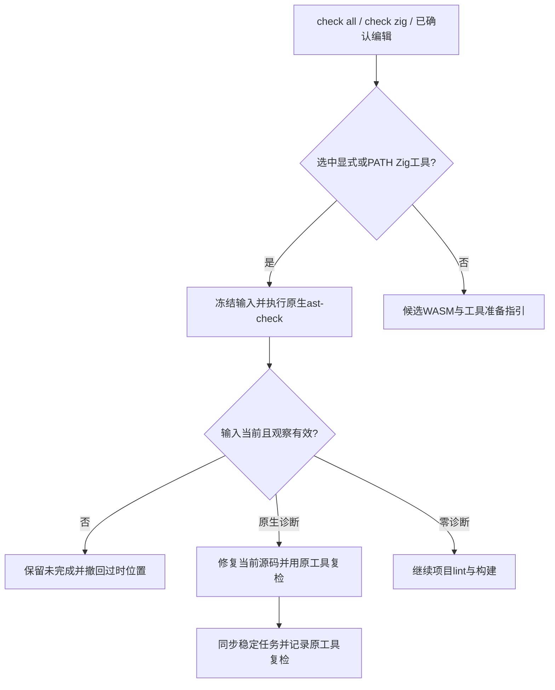

### Zig 首次原生任务接线（开发源码）

初始化工作区中，`check zig`、`check all`、`lint zig` 和编辑 Hook 按工作区/源码范围同步同一稳定任务。新文件完整零诊断不创建修复任务；已有任务零诊断记录 `candidate_absent_unverified_policy`，保持 open。`next`、`task show` 提供有界原生位置与原工具复检参数；`task verify TASK_ID . [--zig-tool ABS_PATH] --format=json` 和 repair_ready 记录复检事件。原生首次事实的 grammar 身份为 null，原生诊断不要求修改 grammar。

新协议：原生事实0.6、绑定扫描0.2、聚合0.47、单文件0.3、简报0.12、查看0.2、复检内层0.8/外层0.19、编辑Hook0.16、复检Hook0.15。旧 schema 不改写。实际 Zig 0.16.0 已验证错误与修复后输入；原生首次 Zig 可信关闭见下节；默认安装宿主、完整 lint/build 和发行仍未完成。公开 npm 0.1.4 未更新。见[验收](../tests/acceptance/zig-native-first-workbench.md)。

### Zig 原生首次可信关闭（开发源码 SDK）

受保护宿主可通过 `verify_zig_task_resolution` 使用独立签名策略1.4.0，核验原生首次事实0.6.0。grammar 必须为 null；旧 WASM 来源策略1.0.0不扩权。首次原工具确有诊断、源码已改变且同一工具完整零诊断时，追加限定 `code_fixed`，证据0.5.0。重复验证幂等；普通 `task verify --zig-tool` 的同工具正向复检重开同一父链。原反例合法进入误报调查，异常输出、越界位置、工具变化和缺可信上下文不关闭。签名信任根由宿主独立提供，默认插件与公开 npm 尚未接入该提供者；不能凭本地任务文件批准交付。见[验收](../tests/acceptance/zig-native-first-resolution.md)。

## 显式原生差分开发回放

新增 Rust 示例 `evaluate_native_grammars`：从同一32语言固定语料选择已显式提供 Zig0.16.0、OTP28、Apple Swift6.4 与 kotlinc-jvm2.4.10 的样本，逐例复用原生适配器和既有WASM worker。库存仍保留32语言；未选工具、无适配器、原生未完成及WASM隐藏恢复不被补成通过。只在双方语法可判定时统计TP/FP/FN/TN；Kotlin混合上下文阻塞保留已定位语法正向证据，但执行仍未完成。工具/入口或程序变化撤回对应分类。回放固定 incomplete/资格0，不创建任务或批准白名单。原生适配器复用、回归语料和入口制品摘要不证明独立holdout或完整工具链身份。使用方式和实际证据见[原生差分验收](../tests/acceptance/native-grammar-differential.md)。


### Python 隔离原生语法对照

开发差分新增显式 Ruff0.16.8 / Python3.12 观察，固定 stdin、`--isolated --select E9 --ignore-noqa --no-cache`，不读取项目配置或执行用户源码。只消费合法定位的 `invalid-syntax`；普通 F401、坏路径/位置、版本变化或矛盾报告不判源码语法失败。新增0.2报告，0.1历史字节保持不变；扩展开发工具选择不扩大可信任务关闭权限。18例实际对照发现缺少函数体、错误缩进2个WASM漏检，仍为未验收候选；见[Python原生差分验收](../tests/acceptance/python-native-grammar-differential.md)。


### 空语句块事实扫描（接线未完成）

Rust runtime新增 `scan_wasm_empty_blocks`，全树观察无非comment命名语句的block，保留父节点类型、字节位置和预算耗尽。它与原始ERROR/MISSING分开，不签发语言违规；合法Rust空函数也会产生事实。固定Python required_suite候选规则现已接入私有worker、显式探针及单文件lint/work sync稳定确认任务，原始恢复和结构观察使用独立版本化字段；聚合check现通过0.48反馈与通用0.7确认报告保留同一结构证据和任务身份；可信原生关闭仍缺，Python原始grammar两项漏检仍保留。详见[结构任务接线](../tests/acceptance/python-structure-lint-task.md)。见[结构事实验收](../tests/acceptance/wasm-empty-block-facts.md)。

聚合结构证据接线见[验收记录](../tests/acceptance/check-python-structure.md)，不能据此声明grammar质量认证或完整交付门禁完成。

Python隔离原生探针现于版本探测后、检查前核验请求入口与冻结字节，入口变化不启动第二次调用；检查后继续核验。实际三输入与替换/重定向反例见[原生入口连续性验收](../tests/acceptance/python-native-tool-continuity.md)。Python可信关闭仍缺稳定任务身份、首次报告与批准目标版本接线，不把开发py312探针视为项目通过。

Python候选确认任务现按首次单文件范围复用项目Ruff配置和原生执行链。反馈0.18与任务预览0.20绑定已消费首次报告及当前源码，不授予项目覆盖或可信关闭。首次收据缺失或篡改时拒绝执行。见[局部验收](../tests/acceptance/python-confirmation-scoped-recheck.md)。


### Python原生语法修复反馈（0.19 / 0.21）

Ruff正常与忽略noqa的两轮结果中一致的`invalid-syntax`现在保留为原生语法错误，不误判为抑制审计工具故障。末尾空行上的原生错误可用前一非空源码生成稳定任务身份，原生行列保持不变。单文件确认反馈0.19、任务预览0.21将语法错误仍存在区分为`still_present`，向智能体提供源码修复步骤；完整复检无语法错误仅为`candidate_absent_unverified_policy`，不自动关闭。历史0.18报告保留原事件语义，源码或配置变化撤回本轮判断。验收见[原生语法反馈](../tests/acceptance/python-native-syntax-audit.md)。


### Python关闭前置的原样本与目标版本

宿主只读接口`validate_python_task_original_source(root, task_id, source)`核对两类首次报告、消费收据、冻结字节和原始/结构位置；当前文件已修复时仍接受原字节，拒绝以当前字节替代。隔离语法探针可接收明确Python目标，非法目标在工具解析前拒绝；开发差分固定py312入口保持不变。这些是关闭前置，不构成签名批准、项目目标来源或可信关闭。见[验收](../tests/acceptance/python-resolution-prerequisites.md)。


### Ruff原生lint目标观察

`RuffSettingsObservation::explicit_python_target()`仅返回固定Ruff原生设置中的明确lint目标。设置必须具有唯一`linter.unresolved_target_version`和空`linter.per_file_target_version`；隐式none、缺失/重复、未知版本与尚未解析的逐文件目标返回具体原因。formatter/analyze目标不作替代。该内部观察与同轮工具、源码、配置核对链共用，不增加旧公开设置字段，也不批准关闭。见[验收](../tests/acceptance/python-native-target-settings.md)。


### 限定任务的共享事件提交

原生语法服务已拆分复检与`commit_resolution`事件提交。提交前核对领域证据与脱敏原生对照的身份、原/当前源码、工具、适配器、grammar/批准策略及原生对照摘要，拒绝不一致的拼接。各语言入口仍负责验签和实际复检；共同提交逻辑保留幂等、策略变化核对、父链冲突和复发重开，不提供项目门禁。此拆分供Python后续接入，尚不表示Python可信关闭已实现。见[验收](../tests/acceptance/task-resolution-commit-boundary.md)。


### Python限定原生语法任务关闭（策略1.5 / 证据0.6）

宿主SDK `verify_python_task_resolution` 接收独立信任根和签名策略，绑定Python任务、已消费首次报告、原样本、grammar、Ruff制品、适配器、明确lint目标及项目配置摘要。Rust调用原生Ruff，以绑定配置和目标对照原始stdin与当前单文件；当前文件复用正常/忽略noqa扫描及同轮设置观察。原样本存在语法诊断、当前已修改且完整无语法诊断、输入和批准身份仍稳定时，才记录限定关闭。原样本原生合法则记录误报调查；缺工具、未解析目标、配置变化或运行不完整均不能关闭。策略不支持以隐式默认或formatter目标代替lint目标。

两类Python首次WASM报告共用稳定任务与追加父链。新证据使用独立封闭0.6协议，不修改历史版本；重复验证幂等，复发重开保留关闭历史。普通复检只可重开，不凭历史策略批准新关闭。SDK测试中的独立签名夹具不证明生产宿主信任根已接入，限定关闭不代表项目门禁通过，也不授予grammar发布资格。局部验证记录见[Python任务关闭验收](../tests/acceptance/python-task-resolution-lifecycle.md)。


Python3.14模板字符串提供真实原生反证：固定Python WASM仍产生ERROR，Ruff在明确py314下接受同字节，py313下仍报告语法错误。限定SDK记录误报调查后，next现读取同一Python确认任务的生命周期，要求核对grammar版本与原生差异，保留合法源码；源码或配置已变化时，当前输入失效提示优先于历史反证。不会自动白名单或关闭，也不修改旧语料统计。见[实际反证验收](../tests/acceptance/python-template-string-counterevidence.md)。


### 语法确认动作与无进展预算

Python 语法确认任务的当前原生观察为 `still_present` 且未因源码或配置变化失效时，受控动作是 `repair-source`；缺工具、未完成或失效观察不能据旧位置要求修改源码。同一语法确认任务、同一前置输入下，`restore-checker-environment` 与 `repair-source` 共享既有无进展预算，动作切换不能清空历史失败。旧追加事件保留原动作与指纹；其他任务仍按既有动作规则计数，新输入与已核验进展按既有规则处理。预算耗尽仍要求具体诊断或决策，不自动关闭、不降低门禁。


### TypeScript 模块源码的统一范围

`detect`、`check all` / `check typescript` 和 `file_changed` Hook 现在将 `.mts/.cts` 及 `.d.mts/.d.cts` 纳入既有 TypeScript 范围，使用同一固定 TypeScript grammar，不误用 TSX。同文件已有完整原生 ESLint 观察时仍原生优先；其他构建根缺上下文的文件独立执行候选初检。重复疑似更新同一确认任务，合法声明不创建新语法阻塞；编辑 Hook 仅检查确认写入的文件。后缀识别不证明模块解析、类型检查、grammar 资格或交付通过。见[模块后缀验收](../tests/acceptance/typescript-module-extension-routing.md)。


### R 与 C++ 显式源码后缀

项目发现及 WASM 候选路由支持 `.R`/`.r`，以及 C++ 的 `.C`/`.cp`/`.CPP`/`.c++`/`.cxx`/`.hxx`，保留既有后缀。大小写保持原义，`.C` 不会按 C 解析；共享 `.h` 仍不能仅凭后缀取得 C++ grammar 路由。原生工具缺失时提供实际候选观察，整体保留 `incomplete`，不据此宣称语法资格或交付通过。见[后缀验收](../tests/acceptance/r-cpp-extension-routing.md)。
