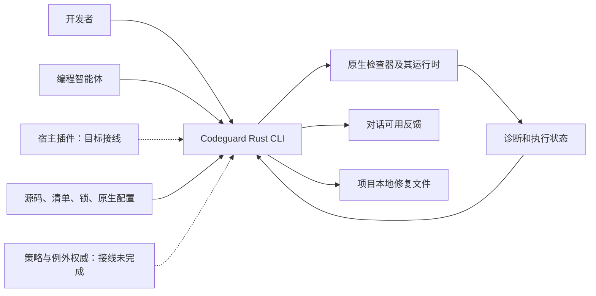
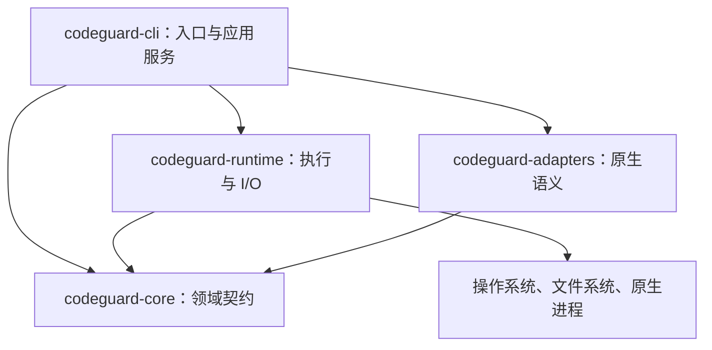
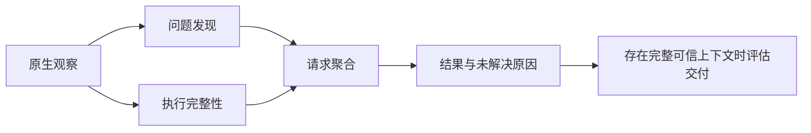
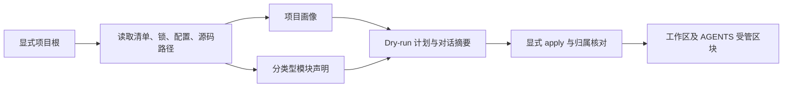
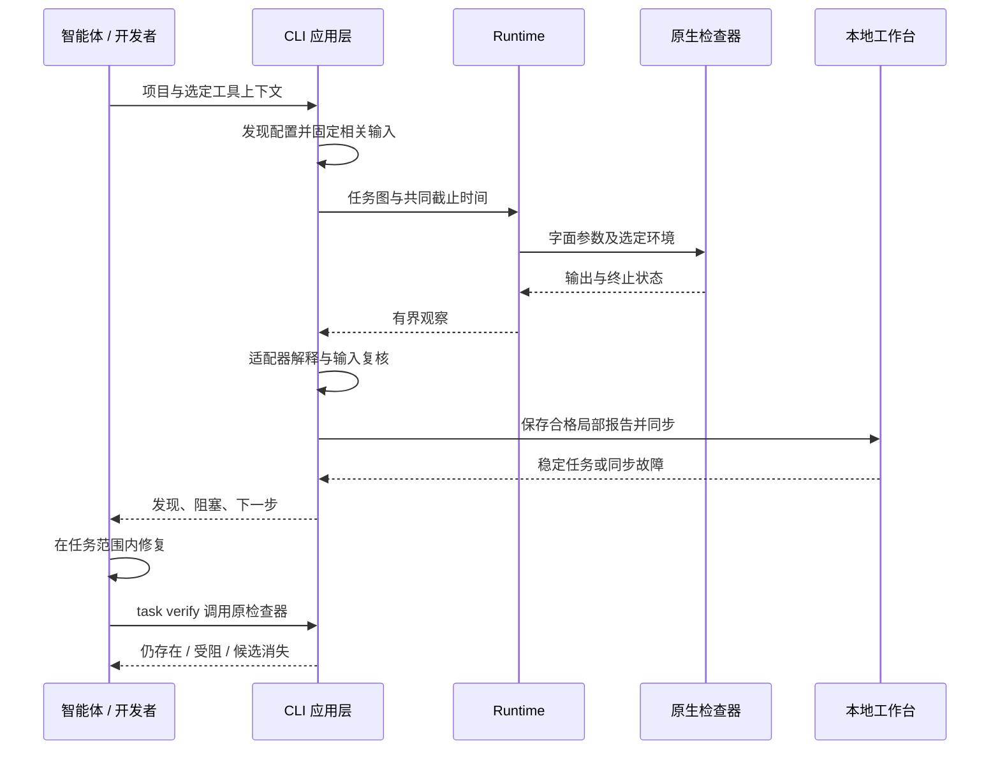
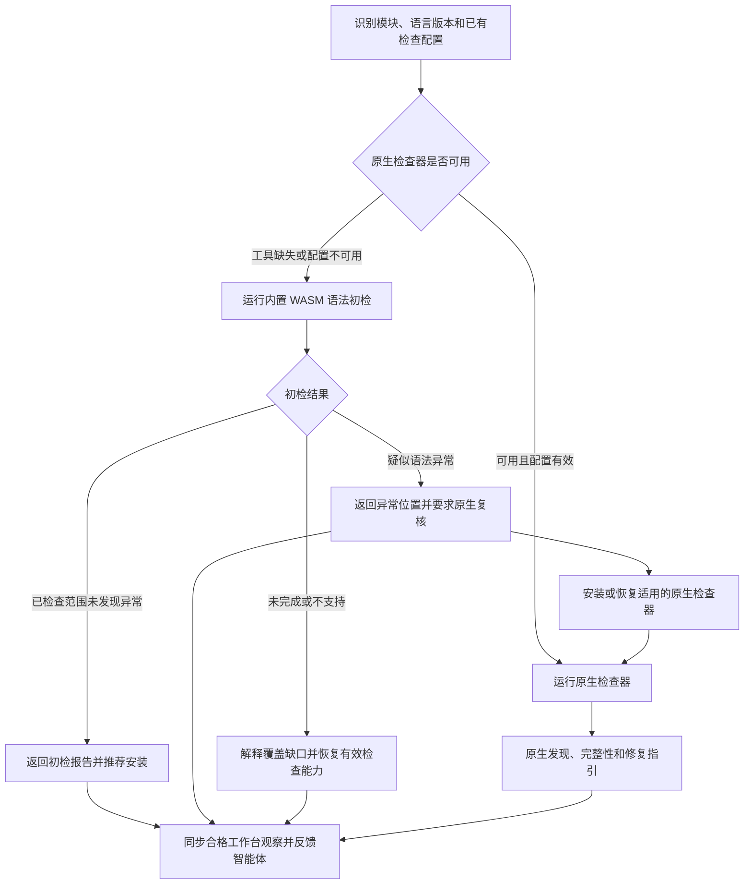
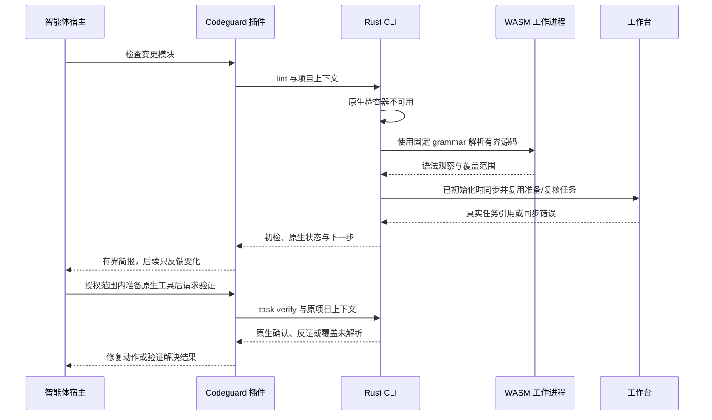
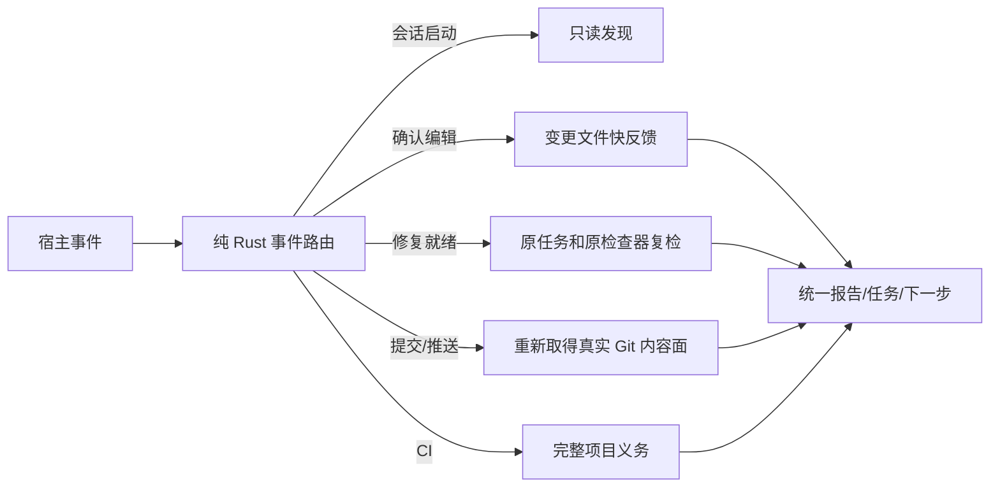
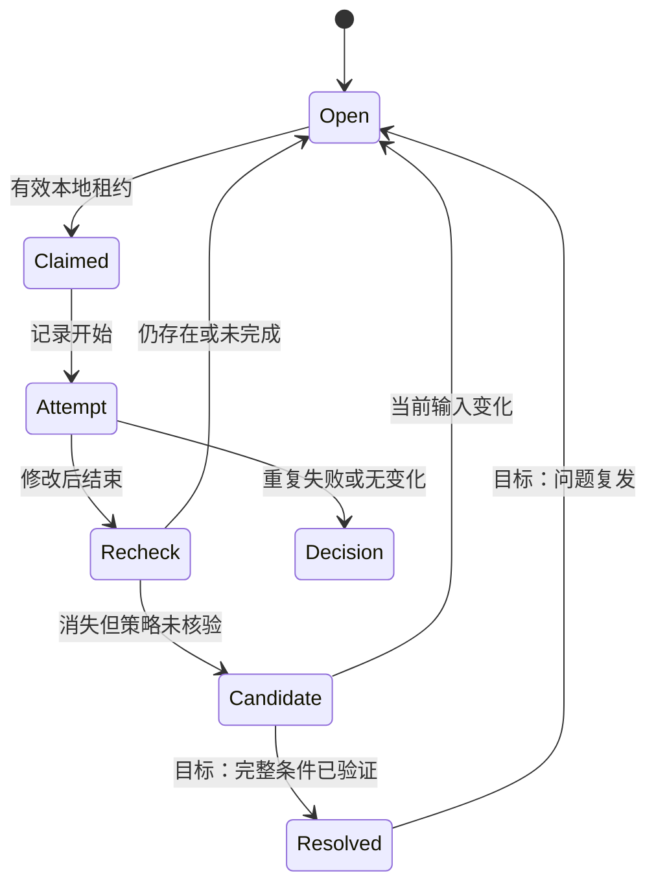

# Codeguard 架构设计

> **文档说明：**说明系统职责、组件契约、修复流程，以及当前实现与目标行为之间的差距。
>
> **文档版本：**1.2.2 · **最后更新：**2026-09-29 · **源码基线：**当前 checkout 与[实施证据](../openspec/changes/introduce-rust-codeguard-cli/implementation-baseline.md)；软件版本 `0.1.2`。

[English](Codeguard-Architecture.md) · [README](../README.zh-CN.md) · [技术方案](Codeguard-Technical-Design.zh_CN.md)

专题入口：[命令](Codeguard-Command-Reference.zh_CN.md)、[初始化](Codeguard-Project-Initialization.zh_CN.md)、[修复](Codeguard-Remediation-Workflow.zh_CN.md)、[误报治理](Codeguard-False-Positive-Governance.zh_CN.md)、[适配器](Codeguard-Adapter-Contracts.zh_CN.md)、[信任与分发](Codeguard-Trust-and-Distribution.zh_CN.md)、[验收](Codeguard-Validation-and-Rollout.zh_CN.md)、[旧协议](Codeguard-Legacy-Compatibility.zh_CN.md)。独立细节由专题维护，规格与任务由 OpenSpec 维护。

## 1. 阅读契约与证据

本文描述 Rust **Codeguard CLI 仓库**的架构，不是既有 Python 宿主插件的实现手册。读者包括适配器作者、CLI/runtime 维护者、智能体集成者和评审者。

- **已实现基础能力：**已有代码和有界可测试契约，不代表端到端产品功能完整。
- **局部流程：**已有可调用路径，同时明确范围与剩余要求。
- **目标：**已有架构意图，但完整接线或验收尚未完成。
- **未知：**缺乏充分观察，不得用乐观假设替代。

既有 [OpenSpec 规范与任务](../openspec/changes/introduce-rust-codeguard-cli/proposal.md) 已整体迁入本 Rust 仓，是唯一规格与任务事实源。已实现切片和剩余工作分别记录，本文不维护第二份可独立勾选的任务。

| 证据 | 能说明什么 |
| :--- | :--- |
| [工作区清单](../Cargo.toml)及各 crate 清单 | 名称、依赖方向、版本与工具链声明 |
| [CLI 调度](../crates/codeguard-cli/src/main.rs) | 可调用命令分支和平台条件 |
| [完整检查编排](../crates/codeguard-cli/src/check_command.rs) | 当前聚合、原生调度和同步接线 |
| [初始化](../crates/codeguard-cli/src/init_command.rs)、[契约测试](../crates/codeguard-cli/tests/init_command_contract.rs) | 实际工作区产物与刷新行为 |
| [核心聚合](../crates/codeguard-core/src/aggregate.rs)、[交付门禁](../crates/codeguard-core/src/delivery_gate.rs) | 纯结果语义，不代表公开可信门禁已可用 |
| [验收记录](../tests/acceptance) | 限定范围的观察、测试方法和剩余缺口 |

WASM 的规范与 18 项实施任务已纳入既有 change；可选 Rust worker、固定 Java/TypeScript/TSX grammar 候选资产和局部单文件反馈 schema 已存在。项目级原生优先调度、grammar 版本范围验收、稳定语法任务及宿主接线仍未完成；设计示例不是当前命令输出。

## 2. 架构驱动

产品要解决的问题是：通用文本匹配和含混的执行失败容易误报，而不断重复的错误又容易诱使智能体抑制检查，偏离修复代码的目标。

| 驱动 | 架构响应 | 验收意图 |
| :--- | :--- | :--- |
| 保持原生规则语义 | 为每个适配器定义命令与报告契约 | 环境失败不制造源码违规 |
| 低误报 | 感知配置的范围、明确未知状态、精确例外 | 不支持的配置保留未解析，有效发现保留来源 |
| 可推进修复 | 稳定事实、修复简报、尝试历史、原工具复检 | 问题给出合适下一步，不只重复原始日志 |
| 多语言一致性 | 六类别和版本化结果语义 | 每个宣传支持的语言/类别都有独立测试证据 |
| 执行可预测 | 有界进程、资源互斥调度和取消 | 局部失败不能悄悄删除其它已完成观察 |
| 简化接入 | 优先识别已有配置 | 初始化不执行项目脚本、不虚构架构 |

Rust 负责统一编排，以可分发二进制及显式状态、资源管理为选型理由。当前没有性能对比结论；原生分析器运行和数据库访问可能占据总耗时的大部分。

## 3. 范围与系统上下文



Codeguard 负责发现、命令选择、有界调用、解释结果、反馈和本地修复协调。原生工具负责其契约内的语言语义、规则执行、依赖解析和漏洞查询。智能体负责提出代码或环境变更。策略权威负责例外批准，本地提案不等于批准。

CLI 不承担模型供应商、聊天传输、IDE UI、RAG 存储、分布式调度器或 SaaS 租户数据库。插件与技能仍是独立集成和分发层；它们自动串起 check → sync → brief 的行为属于目标接线，不能用本仓库 CLI 测试代替宿主证明。

## 4. 当前态与目标态

| 能力 | 当前态 | 目标 / 剩余工作 |
| :--- | :--- | :--- |
| 原生检查 | Python、Rust、Java、Node、Go 的局部路径 | 完善适用范围及语言/类别矩阵 |
| 发现 | 静态配置和清单观察 | 显式受控解析下的有效模型 |
| 项目架构 | 未知状态与静态模块声明 | 带证据的 observed/inferred/confirmed 画像与冲突 |
| 修复 | 稳定任务、本地尝试、部分原工具复检 | 可靠的验证关闭、复发处理、完整事件协调 |
| 误报例外 | 候选查询/提案、精确匹配和签名相关基础能力 | 可信批准来源、生命周期接线和可用生效流程 |
| 质量门禁 | 核心判定逻辑；公开扫描仍局部；index 路径安全 | 针对实际工作树/index/ref/CI 内容的端到端检查 |
| 分发 | 源码构建、Apple Silicon macOS npm 0.1.2；制品核验、下载和安装基础能力 | 可支持的二进制发行、平台测试和宿主运行时绑定 |

当前 `check all` 已包含 Rust 构建调度和持久化，[构建复检](../tests/acceptance/rust-build-task-verification.md)也已存在。旧记录中“完全没有这些接线”的描述不能用作当前状态；完整构建组合和正式关闭仍待完成。

## 5. 组件与依赖方向



| 组件 | 输入 → 输出 | 状态和失败职责 |
| :--- | :--- | :--- |
| CLI | 参数/配置 → 选定操作及反馈 | 工作区编排、命令错误、协议投影 |
| Core | 类型化观察和范围 → 确定性判定 | 无原生进程或文件系统访问；布尔字段本身不能建立信任 |
| Runtime | 字面进程配置/快照请求 → 有界观察 | 生命周期、字节、锁、资源释放及明确 I/O 故障 |
| Adapters | 原生配置/输出 → 检查器专属观察 | 规则身份、范围、退出与报告一致性，未知协议保持未解析 |

四个 crate 是实际编译边界。应用服务目前仍在 `codeguard-cli`，包含较多扫描和持久化逻辑。当前没有独立 application crate 或通用动态适配器 ABI。未来拆分应围绕内聚职责，不为满足架构图而添加空模块。

### 5.1 应用服务与扩展边界

旧设计中的 Discovery/Plan/Check/Work/Fix/Gate Service 是逻辑职责，不意味着已经存在对应公共 trait 或独立 crate。当前参数解析与应用服务位于 CLI；运行时使用受控进程与作用域线程，不能把未来的 clap/Tokio 调度方案描述成现有实现。扩展适配器必须同时声明配置识别、输入范围、原生报告语义和复检能力，不能仅注册语言名称。

项目构建脚本与被检代码属于不可信输入。完整 CI 门禁的目标是将验证器、策略来源和最终凭据与项目进程隔离；当前本地进程控制与 offline 参数不等于已经实现网络或恶意同用户隔离。具体信任、签名、工具分发边界见[信任与分发](Codeguard-Trust-and-Distribution.zh_CN.md)。

## 6. 领域模型与结果语义

| 概念 | 含义 | 必须区分的边界 |
| :--- | :--- | :--- |
| 配置观察 | `configured / missing / invalid / unknown` | 配置声明不代表有效模型解析或执行 |
| 检查义务 | 选定检查器、类别、目标和规则范围 | 计划清单行不代表已执行义务 |
| Finding | 原生规则、工具、位置、严重度和身份 | 原生严重度与策略门禁影响分别记录 |
| Completion | `complete / incomplete / not_applicable` | 与发现数量独立 |
| Blocker | 环境、配置、范围或证据问题 | 不是源码违规 |
| 修复任务 | 持久问题的可执行投影 | 勾选 Markdown 不等于解决 |
| Disposition | 精确误报或例外决策 | 不删除原发现、不改写工具输出 |



核心聚合优先级为取消 → 内部错误 → 未完成 → 违规 → 不适用/通过，同时保留局部运行的有效发现。交付计算器独立核对范围、义务、覆盖与例外绑定，可以表达 `allow`、`allow_with_exceptions`、`deny`、`incomplete`、`not_applicable`、`not_evaluated`；当前公开局部检查尚不具备签发交付成功所需的完整可信上下文。

面向用户的契约应保持实用：展示配置了什么、发现了什么、哪些步骤无法执行或解析，以及下一步做什么。内部身份校验用于避免陈旧或错配观察，不应让日常使用变成额外手工“证明执行过”的任务。

## 7. 初始化与项目知识



`init` 默认 dry-run。静态观察不执行 wrapper、Maven 扩展、JavaScript 配置或服务启动。项目包声明版本、语言目标、已解析依赖版本、本机运行时分别记录，未知值保持未知。

Maven/Cargo 当前支持部分直接模块和依赖声明。聚合、包含、构建依赖是不同边；变量、继承模型、optional/target 条件、缺失目标和歧义身份保持未解析。不完整图不能支撑缩小扫描或证明模块独立。

`AGENTS.md` 包含语言、构建根、版本、检查器和模块观察的有界摘要，并链接详情与内容摘要。受管标记外人工文本保留；重复/缺失 marker、人工改写区块和检测到的并发改动返回冲突。当前写入核对不保证排除不协作编辑器的所有竞态。项目字符串作为转义数据；未知 MVC/DDD 架构不激活阻断规则。

## 8. 扫描、反馈与修复流程



部分路径已实现本地保存和同步。未初始化项目也可以获取反馈，不会被静默创建持久工作台。同步错误必须可见，同时保留原生发现；坏报告或过时报告不能关闭不相关任务。

完整目标流程是：


最后两个节点属于目标行为。当前候选消失观察不自动关闭任务。每张任务应具备问题证据、规则依据、允许范围、修复步骤、复检命令、历史尝试和关闭条件。

### 8.1 原生优先与内置 WASM 初检路径——目标

**本节是新增设计，公开的 `0.1.2` 包尚未实现。** 保留统一入口，调用者选择语言或项目，不选择解析器后端：

```bash
codeguard lint java .
codeguard lint typescript .
codeguard check all .
```

这些入口已存在，但当前只有局部原生适配能力及各适配器所需的前置参数；下述自动兜底是新增目标行为。按模块、语言/版本、方言及有效配置识别检查器可用性。同一轮检查中，已有 ESLint 的前端和缺 JDK 的 Java 模块分别选择路径。



原生检查已检出违规时，不能切到兜底获取干净结果。原生执行失败时可补充初检，但必须保留原故障。WASM 仅覆盖语法，不替代已配置的规范规则、Javadoc、类型、依赖/CVE 或安全检查。项目已要求的原生检查，不会因初检正常变成可选。

| 情况 | 面向用户的结论 | 下一步 |
| :--- | :--- | :--- |
| 原生检查器可用 | 原生报告、实际范围与完整性 | 按原生诊断处理 |
| 缺原生工具，初检正常 | 已检查范围未发现语法异常；原生 lint 未执行 | 推荐安装；项目已有必需要求时仍必须安装 |
| 缺原生工具，初检疑似异常 | 待原生确认的疑似问题，不是已确认违规 | 必须安装/恢复适用工具并复核 |
| 工具已安装，配置无效 | 配置阻塞及局部初检结果 | 修复配置，不重复安装已有工具 |
| grammar 不兼容、工作进程超时或加载失败 | 初检未完成/不支持 | 恢复原生检查或修复解析支持，不归罪源码 |
| 零文件或嵌入语言覆盖不全 | 空范围/未完成，不能报告全部通过 | 恢复范围或列明未覆盖区域 |

“必须”约束验证与任务关闭条件，不越过用户已有授权安装工具，也不冻结无关工作。无法安装时，保留一张有具体原因的环境任务。grammar 异常可能是误报，但已升级的任务仍须经有效原生复核才能解决。

### 8.2 Grammar 资产与 Rust 职责——目标

复用固定版本的 CodeGraph grammar WASM，以及适用的上游许可证、源码引用、补丁和语料。不能把 CodeGraph 的图提取或源码遮盖启发式直接用于语法判定。CodeGraph 的 `src/extraction/grammars.ts` 通过 `web-tree-sitter` 加载语言资产，在那里可加载不证明兼容 Codeguard 的 Rust 运行时。发行时必须固定不可变的来源与资产清单，不能把正在修改的本地目录直接当作发行输入。

只读 `codeguard grammar status` 现投影[固定来源覆盖库存](../grammars/codegraph-coverage.json)：CodeGraph 随仓 30 份 WASM，依赖提供另两种独立 grammar；CodeGuard 有 Java、TypeScript、TSX 三份候选，尚无已验收发行能力。覆盖库存与[候选资产清单](../grammars/manifest.json)分开，不能凭库存行自动加载或宣称支持。尤其 COBOL 来源资产超过当前加载器 8 MiB 限额。

```text
grammars/                         # 规划中的发行资产，不是项目状态
├── manifest.json                 # 固定来源、摘要、ABI 及能力映射
├── java/
│   ├── parser.wasm
│   └── LICENSE
└── typescript/
    ├── parser.wasm
    └── LICENSE
```

每个资产记录语言/方言、上游提交与补丁身份、WASM SHA-256、Tree-sitter ABI/运行时兼容性、已验收语言版本、已知限制、许可证和语料引用。文件存在、加载兼容、语法检查通过验收，是三个独立能力状态。内置 grammar 必须能离线运行，并按需加载；额外语言包更新须经版本化清单与兼容性检查。

| 所有者 | 本设计增加的职责 |
| :--- | :--- |
| `codeguard-core` | 后端选择策略、初检状态、必须/推荐准备动作及结果协调 |
| `codeguard-runtime` | Rust Tree-sitter WASM 宿主、有界解析工作进程、资产核验、缓存及取消 |
| `codeguard-adapters` | 语言/方言解释、语法观察及原生复核能力映射 |
| `codeguard-cli` | 组合适配器与 runtime；命令、持久化和 human/JSON 简报 |
| 独立 `codeguard-plugin` | 宿主触发、对话摘要交付与反馈去重 |

保留四 crate 的依赖方向：适配器解释观察，由 CLI 组合 runtime。WASM 工作进程接收有界源码字节，不提供通用文件系统/网络导入。父进程截止时间、终止、内存和输出上限须逐宿主验证，不能仅凭 WASM 名称声称资源已隔离。运行时与 grammar 版本还须符合声明的 Rust MSRV，否则应明确变更兼容契约。Rust 的 [Tree-sitter WasmStore](https://docs.rs/tree-sitter/latest/tree_sitter/struct.WasmStore.html)提供加载接口，不保证复制来的每个 grammar 均兼容（参考核对日期：2026-09-28）。

### 8.3 智能体反馈与验证闭环——目标

分别报告初检、原生执行及交付状态。`clean` 仅表示未观察到语法异常；`suspected_issue` 需要确认；`incomplete` 和 `unsupported` 说明覆盖缺口。必须识别 Tree-sitter 的 `ERROR` 和 `MISSING` 恢复，归并相关节点并保留源码位置。版本/方言不确定性属于诊断上下文，不是源码错误证明。见 [Tree-sitter 查询语法](https://tree-sitter.github.io/tree-sitter/using-parsers/queries/1-syntax.html)。

插件发送检查方式、已检查/未覆盖范围、观察、原生状态、下一步，以及持久化成功后真实存在的任务引用。CLI 本身不能向任意宿主注入消息。`AGENTS.md` 保存长期工作流说明，不追加每轮日志。仓库文本和工具输出只作为数据；安装动作来自审核过的适配器方案，不从诊断文本拼接 shell 指令。

目标简报示意，不是实际输出（路径和任务 ID 为合成示例）：

```text
Codeguard：Java 语法初检发现 1 处疑似异常
方式/范围：内置 WASM；选中的 18 个 Java 文件均已检查。
原生检查：未执行，项目要求的 JDK 不可用。
位置：src/main/java/example/UserService.java:42，MISSING 恢复节点。
下一步（必须）：准备声明版本的 JDK 和适用的原生检查器，
先确认此文件语法，再根据原生诊断修复。
关联任务：CG-example-java-setup（实际使用时仅输出真实持久化任务）。
这尚未确认为代码违规，交付未评估。
```



必需准备时，每个模块/检查义务只创建一张准备与确认任务，关联疑似源码观察。可选准备保持为建议，不生成阻断性修复任务；`next` 不能反复选中它。仅安装成功不能关闭任务。原生确认必须覆盖同一语法能力、文件/方言和当前输入：仅 Java 规范检查输出不能证明编译器级语法正确。确认的问题转为原生修复工作；覆盖充分的原生反证记录为解析器误报候选；覆盖不明继续保持未解析。之后单独一次 WASM 初检正常不能满足已要求的原生复核。

白名单处置绑定规则、源码目标、grammar 身份和原因；保留原始观察，相关输入变化后重新评估。白名单不能移除必需原生检查或伪造覆盖。重复运行更新稳定任务和尝试历史。首次反馈简报，之后只反馈有意义的变化；通过状态视图保留未完成项，不反复发送相同安装要求。双语报告示例及拟议数据契约见技术方案 **7.3–7.4**。

### 8.4 宿主事件与检查档位——目标

宿主 Hook 只传递事件、工作区身份和已知目标；Rust core 选择检查档位，正式 CheckPlan 再决定原生检查器及资源预算。智能体不能用提示词、旧软缓存或项目内 `skipGate` 自行改变交付义务。当前 [纯领域路由](../crates/codeguard-core/src/hook_trigger_planner.rs)已限制逐文件快检范围；批量编辑超预算时返回有明确原因的批量范围重定。只读 `codeguard hook plan` CLI 仍仅返回候选档位与退出码 3，尚未执行检查、接入插件或真实 Git/CI，也未证明任何宿主的自动触发。完整事件驱动执行仍是目标设计。

独立的 `lint python . --file REL_PATH` 已能以相同路径预算调用原生 Ruff，仅输出指定文件的局部反馈；它没有由 `hook plan` 自动调起，未执行本轮 Git 范围检查，也不将局部结果当作完整工作台扫描。

`hook execute PATH --timeout DURATION --format=json` 消费同一版本化宿主事件。会话启动只读发现；Stop 只读本地有界下一步，不调用检查器；确认成功且全为 Python 的有界编辑范围调用 Ruff 快检。Stop 最多检查 64 个 finding 和 64 份报告，报告字节总预算为 8 MiB；超出后返回 `guidance_scope_exceeded`，检查仍为未运行。`repair_ready` 先将单任务历史限制在 128 项和 1 MiB，读取稳定任务事实，再经有界子进程复用现有 `task verify`，只返回原检查器观察和本地事件是否保存的摘要；不关闭任务、不批准交付。显式提供 `--git-tool ABS_PATH` 后，`pre_commit` 在事件总截止时间内观察本轮真实暂存 index（含 `GIT_INDEX_FILE`），报告路径违规与对象核验状态，绝不拿编辑快检结果充作提交门禁。缺工具或 index 观察不稳定仍是不完整。混合语言、未知/失败写入、推送和 CI 保持显式 `not_run`。`hook_execution_feedback` 0.5 仍仅是候选证据，历史 0.1–0.4 schema 保留。用户提示事件现返回固定的非阻断检查时机指引，不解释提示词或启动检查器，不能据此认定交付意图或 Git 门禁；插件 Hook、缓存复用和完整 Git/CI 质量门禁尚未接通。

Rust CLI 另有 Claude Code `SessionStart`、`PostToolUse`、`PostToolUseFailure`、`Stop` 候选软入口。启动只读发现；成功编辑核对绝对路径、项目根及普通文件后复用同一执行器；失败编辑走不检查源码的路由，不把错误文本当指令；Stop 有界读取已有任务事实，不运行检查器，仅在首次 Stop 发现稳定任务时给一次 `additionalContext` 继续指引，`stop_hook_active=true` 或无任务时只显示提示而不反复唤醒。全部反馈有界，排除源码、原工具错误及可编辑任务正文；非法/超预算输入显示未运行。宿主退出 0 仅表示软反馈已返回，不是质量通过。独立 `codeguard-plugin` 尚未绑定该 CLI，也未自动调用这些入口；见[局部验收](../tests/acceptance/claude-post-tool-hook-candidate.md)。



| 事件 | 应请求的档位 | 不可省略的约束 |
| :--- | :--- | :--- |
| 启动/恢复、用户提示、停止 | 只读发现、非阻断性意图建议、会话摘要 | 提示文字不能替代真实 Git 门禁，不签发通过 |
| 确认写入成功 | 受影响文件快检 | 同一内容与全部配置身份一致时才可复用完整软结果；项目级重任务排队 |
| 写入失败/结果未知 | 不检查 / 重新确定范围 | 未知不能当作无变更或已检查 |
| 修复尝试完成 | `task verify` 原生复检 | 仅安装工具、勾选任务或 WASM clean 不关闭问题 |
| 提交、推送、CI | 严格提交面、实际 ref 推送面、完整项目义务 | 不信宿主传入的路径列表或旧保存反馈；无可靠阻断能力则报告缺口 |

节流只合并同一内容快照的重复快反馈，不吞掉新输入、失败复检或交付事件。缓存至少绑定源码及依赖闭包、工具、规则、配置、平台和漏洞库时效；严格门禁重新核验完整义务与身份，缺证明时重算或标未完成。对每档分别测量耗时分位数、重复执行、缓存失效、漏检和误报，再确定预算；不能仅靠固定延时声称高效。

## 9. 持久化与所有权

```text
checked-project/
├── AGENTS.md                       # 仅管理 Codeguard 标记区块
└── .codeguard/
    ├── .gitignore / README.md
    ├── workspace.json              # 工作区身份及受管摘要
    ├── project.json                # 静态观察
    ├── module-graph.json            # 分类型关系与未解析条件
    ├── architecture.md             # 架构观察投影
    ├── findings/                   # 脱敏事实与追加式事件
    ├── tasks/                      # 可读投影和纠错附件
    ├── decisions/                  # 决策引用，不可本地自批
    ├── reports/                    # 忽略入库的局部观察
    ├── runs/                       # 忽略入库的运行数据
    ├── cache/                      # 忽略入库的缓存
    ├── worktrees/                  # 忽略入库的工作副本
    └── state/                      # 忽略入库的收据、观察和租约
```

原检查器输出、归一化观察、持久问题事实和可读投影分别建模，不能互相替代为权威来源。空目录在写入文件前不一定出现在 Git 中。

`work sync` 按工作区与 run 绑定报告，幂等消费匹配记录。重复发现维持稳定任务，重复观察尽量避免污染已跟踪文件。一份坏报告不能成为丢弃其它有效报告的理由。多文件写入不宣称具有数据库式全原子事务；恢复测试目前覆盖部分中间态和进程退出。

普通源码发现按点前缀规则跳过 `.codeguard/`，Codeguard 仍校验其中自有记录；`codeguard/src` 等用户源码继续检查。发现旧 `codeguard/workspace.json` 时报告迁移冲突；整体移动旧目录可能隐藏用户源码。已跟踪记录也须服从入库安全检查，完整安全门禁仍待实现。删除任务不构成源码已干净的证据。

## 10. 执行、并发与资源约束

[ProcessSpec](../crates/codeguard-runtime/src/process_spec.rs) 记录绝对工具路径、字面参数、明确 cwd、选定环境、stdin、共同截止时间和 stdout/stderr 合计上限。[进程执行器](../crates/codeguard-runtime/src/process_runner.rs)负责捕获、终止和清理。Unix 进程组与文件系统调用使用隔离的 unsafe 代码，工作区不承诺零 unsafe。

[任务调度器](../crates/codeguard-runtime/src/task_scheduler.rs)执行已校验 DAG，并约束依赖和共享资源互斥。失败依赖不启动子任务，取消与截止时间区分排队和运行状态。调度器无法强制抢占不响应取消的任意 Rust 回调。

| 预算 | 当前数值 / 范围 |
| :--- | :--- |
| 检查超时 | 默认 30 分钟，有效 1 ms–24 小时 |
| 检查并发 | 默认 min(可用并行度, 4)，显式范围 1–64 |
| 检查源码快照 | 当前聚合路径最多请求 4,096 文件、单文件 16 MiB、总计 256 MiB |
| 进程输出 | 由 ProcessSpec 决定，多个现有探针采用合计 16 MiB |
| 任务租约 | 本地 token/generation/过期控制，不是跨机器协调 |

这些是实现预算，不是延迟或吞吐实测保证。具体探针可能有更小限制。当前未认证端到端 CPU、内存或网络沙箱，构建扩展及原生工具行为仍在威胁模型内。

## 11. 任务生命周期与无进展控制



这是概念生命周期，不表示每个状态名都已原样持久化。当前本地事实仍保持 open，通过复检事件区分 `still_present`、`still_blocked`、抑制/配置核查及候选消失。尝试、租约和复检收据是独立结构。

租约不能只凭 owner 字符串覆盖，必须核对 token、generation 和期限。失败、无变化、放弃等尝试进入有界无进展处理。`next` 读取结构化事实及经核对的局部观察，不执行任务 Markdown 中的指令。完整父事件协调、跨机器协作、可靠正式关闭仍待完成。

## 12. 误报规则与信任边界

| 边界 | 要求 | 当前限制 |
| :--- | :--- | :--- |
| 原生诊断 → finding | 保留精确规则、工具、位置及不支持状态 | 解析器只实现选定协议和规则子集 |
| 项目文本 → 智能体上下文 | 转义为数据，不提升为策略 | 不宣称普遍免疫提示注入 |
| 候选 → 已批准例外 | 匹配当前身份、期限和批准范围 | 公开 CLI 尚无完整批准与生效链 |
| 原生抑制 → 修复结果 | 宣称修复前识别覆盖变化 | 仅部分适配器有对照复检 |
| 报告 → 当前观察 | 核对工作区、run、输入、工具绑定 | 摘要证明字节一致，不自动证明独立信任 |
| 任务投影 → 源码状态 | 必须原工具复检 | 勾选或删除不能证明解决 |

误报治理是明确产品能力，不是宽泛的 skip 开关。精确匹配和签名核验基础能力已存在，但不代表密钥分发、批准治理、可信时间和门禁接线已完成，见[误报技术方案](Codeguard-Technical-Design.zh_CN.md)。

## 13. 协议与配置

CLI 返回命令专属的版本化 JSON、可读投影及部分 SARIF。[Schema 目录](../schemas)包含当前与旧协议。通用/目标 `RunReport` 与多种当前局部观察协议并存，集成方不能假定所有命令已经返回同一个封套。

配置层具有不同权威：

1. 原生工具配置决定原生检查。
2. 项目运行选项决定时间和并发，不决定策略。
3. 规则包、工具锁、策略候选描述预期绑定，不能仅凭文件位置获得批准。
4. 已批准策略与例外需要明确可信来源，完整接线尚未完成。

运行优先级和精确 schema 见 [README](../README.zh-CN.md)。未知字段及不支持版本按对应解析器处理，不能泛称所有解析器已有完全相同的严格规则。协议兼容与旧退出语义需要显式适配。

## 14. 可靠性与运行恢复

| 故障 | 反馈与修复动作 |
| :--- | :--- |
| 缺 JDK、工具或配置 | 准备阻塞，恢复所需环境或配置 |
| 原生超时、输出超限 | 未完成，保留可独立解析且属于当前输入的发现 |
| JSON/XML 截断或协议未知 | 具体解析/协议原因，不制造 finding |
| 扫描中或扫描后输入变化 | 旧观察不能作为当前解决依据，重新扫描 |
| 同步冲突、持久化中断 | 保留原报告、反馈同步状态、重试或协调 |
| 人工修改 AGENTS 受管区块 | 保留人工内容，报告归属冲突 |
| 反复无进展 | 停止相同动作，给出具体决策需求 |
| 漏洞库未知或过期 | 展示可用局部观察及 CVE 完整性缺口 |

原生检查已无诊断时，不应仅因无关的策略前置未完成而无限重复扫描。目标体验是将缺失前置归并为一个稳定、可处理的问题。当前权威接线不完整属于产品缺口，不等于代码修复失败。

本仓库没有守护进程可用性 SLO、跨地域 RPO/RTO、生产指标后端或已验证基准。现阶段诊断依赖结构化反馈、run ID、本地观察和验收记录。原始日志即使被 Git 忽略，也可能包含敏感内容。

## 15. 部署、升级与集成

当前部署形态是本地构建二进制加独立准备的原生工具链。`@partme.ai/codeguard@0.1.2` npm 包通过 Node 命令入口携带 Apple Silicon macOS 二进制；Node 层只转发参数、工作目录、环境、输出与退出状态。该平台的发布、全新缓存 `npx` 版本检查及注册表/本地制品字节核对已通过。二进制回报候选源码提交，但这不证明签名来源、可复现构建、多平台发行或完整质量门禁。公开 `tools install` apply 仍受阻，内部包核验、下载和安装基础能力已有测试。


默认本地包标记为 private，不含 npm 安装钩子。`bin` 入口见 [npm/codeguard.cjs](../npm/codeguard.cjs)，[scripts/pack-npm-local.mjs](../scripts/pack-npm-local.mjs)使用已构建二进制打包。`--public` 模式已产出公开的 `@partme.ai/codeguard@0.1.2`，仅覆盖 Apple Silicon macOS；全新缓存运行和包/二进制摘要核对见[npm 0.1.2 验收记录](../tests/acceptance/npm-0.1.2-candidate.md)。扩大分发范围还需平台覆盖、可信制品清单、版本与摘要绑定及发行流程。CodeGraph 的 Node 入口和平台包布局为此设计提供参考；其可选网络回退不属于 Codeguard 当前安装路径。

升级时记录二进制/schema 版本，保留工作区，预览受管变更，重跑有限检查，再核对报告消费。降级必须服从已有 schema 读取范围，不能为了通过解析而改写历史记录成旧格式。

目标插件应将宿主调用映射到同一 CLI 语义，将结果与下一步带回对话，同时区分传输失败与质量状态。宿主 fail-open 策略不能抹掉未解决发现。本基线调度器未提供 MCP 服务或宿主绑定。

## 16. 架构决策

| 决策 | 选择与理由 | 重新评估条件 |
| :--- | :--- | :--- |
| A01 语言 | Rust 编排，保留原生分析器的生态语义 | 实测平台限制要求有界适配变更 |
| A02 结果 | 发现与完整性独立 | 新类别需要额外维度，且不能删除原有两条信息 |
| A03 持久化 | 可审查文件及本地收据 | 实测规模或并发要求引入存储迁移，并保留兼容投影 |
| A04 智能体边界 | 检查和转换确定性，智能体提出修复 | 模型辅助建议经过独立评测且不能授予权威 |
| A05 例外 | 精确身份、批准及生命周期 | 真实场景需要更丰富身份，但不能误扩范围 |
| A06 架构发现 | 带证据的未知状态及直接声明 | 有效模型/源码图解析具备受控执行与测试依据 |

这些决策记录当前意图和约束，不追认缺失功能已经获批或完成。技术方案进一步给出实现细节、阶段依赖和可观察验收标准。

## 17. 验收与待决事项

验收维度包括原生语义正确性、误报和漏报测量、故障处理、稳定任务身份、有界重试、配置与抑制变化、输入新鲜度、平台行为和真实宿主交付。单元测试通过或 schema 文件存在不能合并证明以上全部要求。

有日期的本地基线为 990 项测试通过、101 项忽略。不能据此推断生产误报率、完整原生矩阵、MSRV 矩阵、全部平台支持或远程 CI 成功。

面向生产仍须明确批准来源的所有权、可用的例外评审体验、工具分发与升级职责、跨平台进程隔离、schema 保留策略、私密漏洞披露和发行包装。这些缺口不妨碍使用明确范围内的局部观察，但限制了完整生产质量门禁的完成声明。

---

**文档版本：**1.2.0 · **创建日期：**2026-09-28 · **最后更新：**2026-09-29 · **文档状态：**待评审；实现仍为局部完成。
