# Codeguard 架构设计

> **文档说明：**说明系统职责、组件契约、修复流程，以及当前实现与目标行为之间的差距。
>
> **文档版本：**1.2.4 · **最后更新：**2026-10-04 · **源码基线：**当前 checkout 与[实施证据](../openspec/changes/introduce-rust-codeguard-cli/implementation-baseline.md)；软件版本 `0.1.4`。

[English](Codeguard-Architecture.md) · [README](../README.zh-CN.md) · [技术方案](Codeguard-Technical-Design.zh_CN.md)

专题入口：[命令](Codeguard-Command-Reference.zh_CN.md)、[初始化](Codeguard-Project-Initialization.zh_CN.md)、[修复](Codeguard-Remediation-Workflow.zh_CN.md)、[误报治理](Codeguard-False-Positive-Governance.zh_CN.md)、[适配器](Codeguard-Adapter-Contracts.zh_CN.md)、[信任与分发](Codeguard-Trust-and-Distribution.zh_CN.md)、[验收](Codeguard-Validation-and-Rollout.zh_CN.md)、[旧协议](Codeguard-Legacy-Compatibility.zh_CN.md)。独立细节由专题维护，规格与任务由 OpenSpec 维护。

源码构建已把 ESLint 接入 `check all` 的 `node.lint` 任务图节点，与其它原生检查共用并发与截止时间。按发现的 JS/TS/TSX 文件选择最近的模块清单、本地 ESLint 10、唯一 flat config 和 Node；搜索不越过受检根。检查阶段收集报告，汇总阶段串行同步工作台，重复发现复用同一任务。每个完整且字节匹配的原生文件可免去重复 WASM；被忽略、配置错误或工具失败的文件仍保留降级与原生原因。协议为当前聚合 `check_feedback` 0.38.0（绑定和未绑定均适用）、`check_aborted` 0.13.0，原协议归档；`native_results.node_lint` 提供逐文件反馈、未执行文件、同步结果及下一步。见[验收范围](../tests/acceptance/check-all-eslint.md)。这不提升 grammar 资质或代替真实宿主验收。


Erlang 源码局部入口现通过 `lint erlang FILE --erl-tool ABS_PATH` 原生优先选择：固定 OTP 28 扫描/解析调用读取 stdin 字节，使用非项目 cwd 并禁止项目启动文件。原生诊断优先，预处理与宏覆盖保持未知；未提供显式工具时，`lint erlang` 从 PATH 的绝对目录定位一次工具，并在 0.2 报告中记录规范路径；仅未找到可执行工具时进入固定 WASM 候选，已选择工具的失败保持未完成。局部结果不授予任务关闭、项目完整 lint 或发行验收；见[验收](../tests/acceptance/erlang-native-first.md)。

源码配置入口现通过有界投影复用发现服务，不再仅查看旧配置文件。`config validate/explain` 0.3 将检查器声明状态及来源摘要与生效规则、抑制和批准分开；终端指出来源、原因及下一步。不执行检查器、不修改项目状态，截断保持未完成。见[证据及边界](../tests/acceptance/config-native-observation.md)。

## 1. 阅读契约与证据

本文描述 Rust **Codeguard CLI 仓库**的架构，不是既有 Python 宿主插件的实现手册。读者包括适配器作者、CLI/runtime 维护者、智能体集成者和评审者。

- **已实现基础能力：**已有代码和有界可测试契约，不代表端到端产品功能完整。
- **局部流程：**已有可调用路径，同时明确范围与剩余要求。
- **目标：**已有架构意图，但完整接线或验收尚未完成。
- **未知：**缺乏充分观察，不得用乐观假设替代。

既有 [OpenSpec 规范与任务](../openspec/changes/introduce-rust-codeguard-cli/proposal.md) 已整体迁入本 Rust 仓，是唯一规格与任务事实源。已实现切片和剩余工作分别记录，本文不维护第二份可独立勾选的任务。

| 证据 | 能说明什么 |
| :--- | :--- |
| [工作区清单](../Cargo.toml)及各 crate 清单 | 名称、依赖方向、版本与工具链声明 |
| [CLI 调度](../crates/codeguard-cli/src/main.rs) | 可调用命令分支和平台条件 |
| [完整检查编排](../crates/codeguard-cli/src/check_command.rs) | 当前聚合、原生调度和同步接线 |
| [初始化](../crates/codeguard-cli/src/init_command.rs)、[契约测试](../crates/codeguard-cli/tests/init_command_contract.rs) | 实际工作区产物与刷新行为 |
| [核心聚合](../crates/codeguard-core/src/aggregate.rs)、[交付门禁](../crates/codeguard-core/src/delivery_gate.rs) | 纯结果语义，不代表公开可信门禁已可用 |
| [验收记录](../tests/acceptance) | 限定范围的观察、测试方法和剩余缺口 |

WASM 的规范与 19 项实施任务已纳入既有 change；可选 Rust worker 与 Java/TypeScript/TSX 局部单文件反馈路径及 Python Ruff 不可用时的候选路径已存在；三十二份候选 grammar 都尚未验收；ArkTS、C、C++、C#、Go、JavaScript、Lua、Luau、Nix、Rust、Terraform、Zig、Objective-C、Solidity、R、Ruby、PHP、Kotlin、Dart、Erlang、Pascal、CFML、CFQuery、CFScript、COBOL、Scala、Swift、VB.NET 仅有固定字节的 Rust 可加载候选资产，尚无逐语言验收的独立 lint 路由。项目级原生优先调度、grammar 版本范围验收、任务的能力匹配关闭及宿主接线仍未完成；设计示例不是当前命令输出。

源码以 `--features wasm-precheck` 构建后，可通过 `codeguard grammar probe <language> <file> --format=json` 显式调用全部 32 份固定候选资产。命令使用隔离 Rust worker，以退出码 3 报告未经语言验收的观察，不能作为 lint 或交付结论。成功观察与有效语种的输入失败都遵守[0.1.0 封闭 JSON Schema](../schemas/grammar-probe-v0.1.schema.json)，保持未完成。原生优先 `lint/check`、语言/方言验收、任务/宿主反馈及发行仍需独立完成；现有发现清单还把 JavaScript/TSX 归入 TypeScript，并未为 CFQuery/CFScript 建立独立源码映射。

源码构建的 `check all` 现会在既有原生检查之后执行有界候选初检。[语法路由](../crates/codeguard-cli/src/grammar_route.rs)区分 `.tsx`、JavaScript 和 `.cfs`，只对完整的 `<cfquery>...</cfquery>` 标签体选用 CFQuery；普通 `.sql`、有歧义的 `.h` 不猜测语种。共用后缀的 `.m` 要求 Objective-C 行首标记，`.sc` 在缺项目证据时不猜成 Scala；见[歧义回归](../tests/acceptance/ambiguous-grammar-extensions.md)。四个有界真实 CLI 样例合计逐份调用了 32 种固定 worker。[检查反馈 0.38.0](../schemas/check-feedback-v0.38.schema.json)记录方言、源码及 grammar 摘要、原文件位置、有界已知限制、未执行范围和未完成状态；Ruff 本轮完整检查且摘要匹配的 Python 文件跳过重复 WASM；P3C 等规范检查不视为语法确认。候选观察不生成已确认违规或交付许可。候选阶段限 64 文件、64 片段、90 秒，本机四批 32 语种样例约 54 秒；此前串行实现的 Linux 单次 31 文件检查在 90 秒上限内完成 26/32。当前只是候选路由，尚非逐语言验收的原生兜底或任务/宿主接线；npm 0.1.3 仅将其作为未验收候选分发；见[验收记录](../tests/acceptance/check-all-32-grammar-candidates.md)。

源码构建的候选调度现在按稳定路径顺序准备有界片段，以 `min(--jobs, 2)` 个隔离 worker 并发执行；报告保持同序，接受结果前逐文件复读源码。本机 31 文件单项目样例在原 90 秒预算内观察到全部 32 种候选；源码提交 `ff60184` 的 Linux WASM 集成步骤已通过同一单项目测试；完整 CI 已通过。吞吐改进不提升候选观察的门禁权威。

[Java 17 原生差分](../tests/acceptance/java-native-differential.md)给 Java grammar 增加了 13 例 javac 21 独立 oracle。它只是局部精度证据，Java 仍是未验收候选。

[Kotlin 原生差分](../tests/acceptance/kotlin-native-differential.md)现记录 11 例可判定的一致结果与 2 例隐藏错误导致的未知，分别对应原生非法和原生合法源码。Swift 为 12 例可判定的一致结果与 1 例未知。未完成扫描不能仅凭恢复数组为空归入合法/非法标签；未知覆盖单独报告，两份 grammar 均未验收。

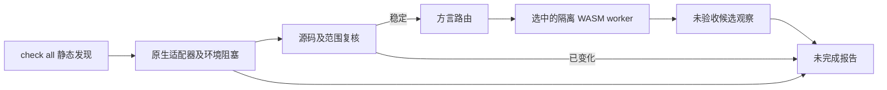

首个局部原生优先入口为 Zig：`lint zig FILE --zig-tool ABS_PATH --format=json` 对选定源码字节先运行版本报告为 Zig 0.16.0 且字节保持一致的 `ast-check`；原生错误只暴露行列位置，不回显源码。未提供显式工具时，固定 Zig grammar 作为未验收候选兜底。两种结果都保持未完成，因为 AST 检查范围小于完整 lint、构建和测试；见 [0.1.0 报告 Schema](../schemas/zig-lint-feedback-v0.1.schema.json)。

## 2. 架构驱动

产品要解决的问题是：通用文本匹配和含混的执行失败容易误报，而不断重复的错误又容易诱使智能体抑制检查，偏离修复代码的目标。

| 驱动 | 架构响应 | 验收意图 |
| :--- | :--- | :--- |
| 保持原生规则语义 | 为每个适配器定义命令与报告契约 | 环境失败不制造源码违规 |
| 低误报 | 感知配置的范围、明确未知状态、精确例外 | 不支持的配置保留未解析，有效发现保留来源 |
| 可推进修复 | 稳定事实、修复简报、尝试历史、原工具复检 | 问题给出合适下一步，不只重复原始日志 |
| 多语言一致性 | 六类别和版本化结果语义 | 每个宣传支持的语言/类别都有独立测试证据 |
| 执行可预测 | 有界进程、资源互斥调度和取消 | 局部失败不能悄悄删除其它已完成观察 |
| 简化接入 | 优先识别已有配置 | 初始化不执行项目脚本、不虚构架构 |

Rust 负责统一编排，以可分发二进制及显式状态、资源管理为选型理由。当前没有性能对比结论；原生分析器运行和数据库访问可能占据总耗时的大部分。

## 3. 范围与系统上下文

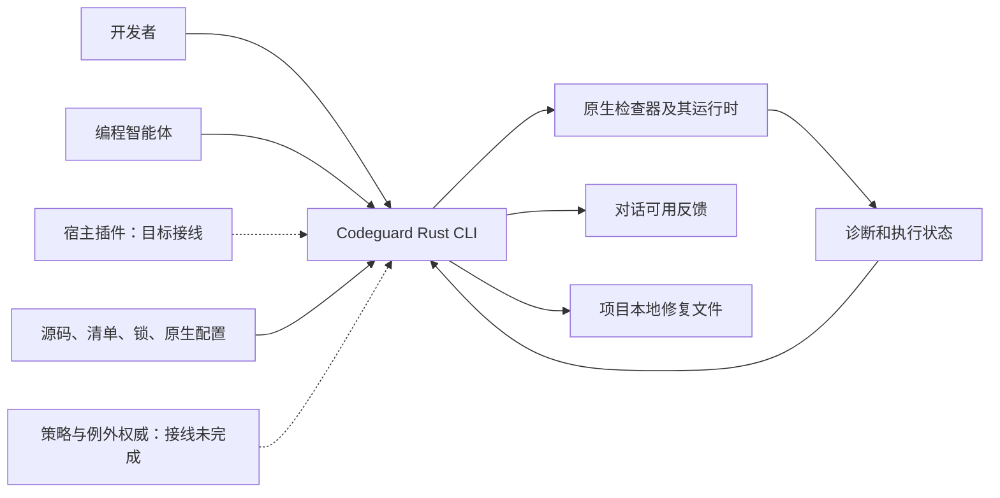

Codeguard 负责发现、命令选择、有界调用、解释结果、反馈和本地修复协调。原生工具负责其契约内的语言语义、规则执行、依赖解析和漏洞查询。智能体负责提出代码或环境变更。策略权威负责例外批准，本地提案不等于批准。

CLI 不承担模型供应商、聊天传输、IDE UI、RAG 存储、分布式调度器或 SaaS 租户数据库。插件与技能仍是独立集成和分发层；它们自动串起 check → sync → brief 的行为属于目标接线，不能用本仓库 CLI 测试代替宿主证明。

## 4. 当前态与目标态

| 能力 | 当前态 | 目标 / 剩余工作 |
| :--- | :--- | :--- |
| 原生检查 | Python、Rust、Java、Node、Go 的局部路径 | 完善适用范围及语言/类别矩阵 |
| 发现 | 静态配置和清单观察 | 显式受控解析下的有效模型 |
| 项目架构 | 未知状态与静态模块声明 | 带证据的 observed/inferred/confirmed 画像与冲突 |
| 修复 | 稳定任务、本地尝试、部分原工具复检 | 可靠的验证关闭、复发处理、完整事件协调 |
| 误报例外 | 候选查询/提案、精确匹配和签名相关基础能力 | 可信批准来源、生命周期接线和可用生效流程 |
| 质量门禁 | 核心判定逻辑；公开扫描仍局部；index 路径安全 | 针对实际工作树/index/ref/CI 内容的端到端检查 |
| 分发 | 源码构建、Apple Silicon macOS npm 0.1.3；制品核验、下载和安装基础能力 | 可支持的二进制发行、平台测试和宿主运行时绑定 |

当前 `check all` 已包含 Rust 构建调度和持久化，[构建复检](../tests/acceptance/rust-build-task-verification.md)也已存在。旧记录中“完全没有这些接线”的描述不能用作当前状态；完整构建组合和正式关闭仍待完成。

## 5. 组件与依赖方向

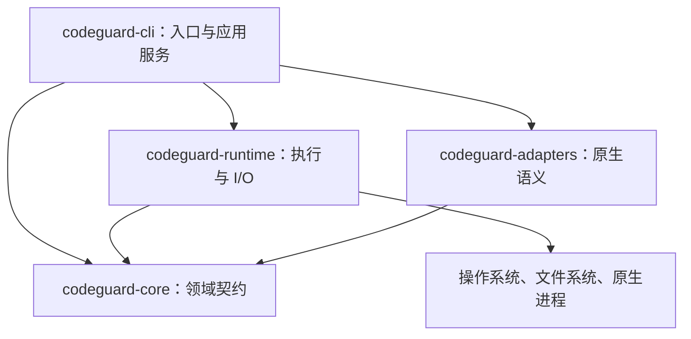

| 组件 | 输入 → 输出 | 状态和失败职责 |
| :--- | :--- | :--- |
| CLI | 参数/配置 → 选定操作及反馈 | 工作区编排、命令错误、协议投影 |
| Core | 类型化观察和范围 → 确定性判定 | 无原生进程或文件系统访问；布尔字段本身不能建立信任 |
| Runtime | 字面进程配置/快照请求 → 有界观察 | 生命周期、字节、锁、资源释放及明确 I/O 故障 |
| Adapters | 原生配置/输出 → 检查器专属观察 | 规则身份、范围、退出与报告一致性，未知协议保持未解析 |

四个 crate 是实际编译边界。应用服务目前仍在 `codeguard-cli`，包含较多扫描和持久化逻辑。当前没有独立 application crate 或通用动态适配器 ABI。未来拆分应围绕内聚职责，不为满足架构图而添加空模块。

### 5.1 应用服务与扩展边界

旧设计中的 Discovery/Plan/Check/Work/Fix/Gate Service 是逻辑职责，不意味着已经存在对应公共 trait 或独立 crate。当前参数解析与应用服务位于 CLI；运行时使用受控进程与作用域线程，不能把未来的 clap/Tokio 调度方案描述成现有实现。扩展适配器必须同时声明配置识别、输入范围、原生报告语义和复检能力，不能仅注册语言名称。

项目构建脚本与被检代码属于不可信输入。完整 CI 门禁的目标是将验证器、策略来源和最终凭据与项目进程隔离；当前本地进程控制与 offline 参数不等于已经实现网络或恶意同用户隔离。具体信任、签名、工具分发边界见[信任与分发](Codeguard-Trust-and-Distribution.zh_CN.md)。

## 6. 领域模型与结果语义

| 概念 | 含义 | 必须区分的边界 |
| :--- | :--- | :--- |
| 配置观察 | `configured / missing / invalid / unknown` | 配置声明不代表有效模型解析或执行 |
| 检查义务 | 选定检查器、类别、目标和规则范围 | 计划清单行不代表已执行义务 |
| Finding | 原生规则、工具、位置、严重度和身份 | 原生严重度与策略门禁影响分别记录 |
| Completion | `complete / incomplete / not_applicable` | 与发现数量独立 |
| Blocker | 环境、配置、范围或证据问题 | 不是源码违规 |
| 修复任务 | 持久问题的可执行投影 | 勾选 Markdown 不等于解决 |
| Disposition | 精确误报或例外决策 | 不删除原发现、不改写工具输出 |

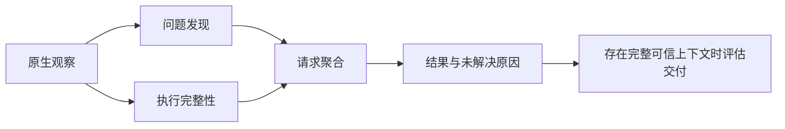

核心聚合优先级为取消 → 内部错误 → 未完成 → 违规 → 不适用/通过，同时保留局部运行的有效发现。交付计算器独立核对范围、义务、覆盖与例外绑定，可以表达 `allow`、`allow_with_exceptions`、`deny`、`incomplete`、`not_applicable`、`not_evaluated`；当前公开局部检查尚不具备签发交付成功所需的完整可信上下文。

面向用户的契约应保持实用：展示配置了什么、发现了什么、哪些步骤无法执行或解析，以及下一步做什么。内部身份校验用于避免陈旧或错配观察，不应让日常使用变成额外手工“证明执行过”的任务。

## 7. 初始化与项目知识

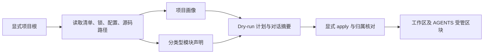

`init` 默认 dry-run。静态观察不执行 wrapper、Maven 扩展、JavaScript 配置或服务启动。项目包声明版本、语言目标、已解析依赖版本、本机运行时分别记录，未知值保持未知。

Maven/Cargo 当前支持部分直接模块和依赖声明。聚合、包含、构建依赖是不同边；变量、继承模型、optional/target 条件、缺失目标和歧义身份保持未解析。不完整图不能支撑缩小扫描或证明模块独立。

`AGENTS.md` 包含语言、构建根、版本、检查器和模块观察的有界摘要，并链接详情与内容摘要。受管标记外人工文本保留；重复/缺失 marker、人工改写区块和检测到的并发改动返回冲突。当前写入核对不保证排除不协作编辑器的所有竞态。项目字符串作为转义数据；未知 MVC/DDD 架构不激活阻断规则。

## 8. 扫描、反馈与修复流程

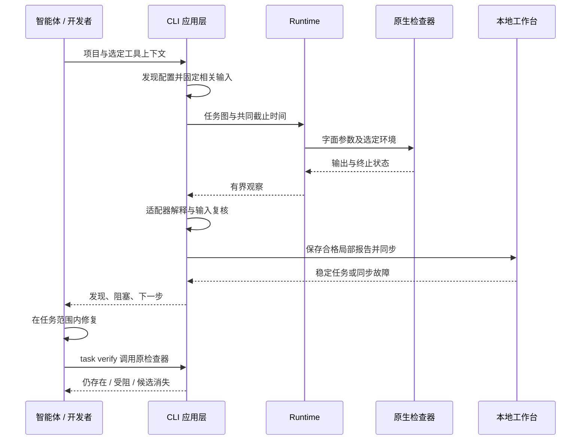

部分路径已实现本地保存和同步。未初始化项目也可以获取反馈，不会被静默创建持久工作台。同步错误必须可见，同时保留原生发现；坏报告或过时报告不能关闭不相关任务。

完整目标流程是：

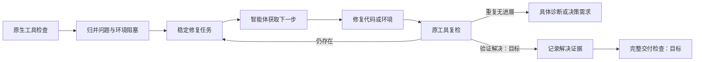

最后两个节点属于目标行为。当前候选消失观察不自动关闭任务。每张任务应具备问题证据、规则依据、允许范围、修复步骤、复检命令、历史尝试和关闭条件。

### 8.1 原生优先与内置 WASM 初检路径——目标

**本节目标契约仅在公开 `0.1.3` 候选包中局部实现。** 保留统一入口，调用者选择语言或项目，不选择解析器后端：

```bash
codeguard lint java .
codeguard lint typescript .
codeguard check all .
```

这些入口已存在，但当前只有局部原生适配能力及各适配器所需的前置参数；下述自动兜底是新增目标行为。按模块、语言/版本、方言及有效配置识别检查器可用性。同一轮检查中，已有 ESLint 的前端和缺 JDK 的 Java 模块分别选择路径。

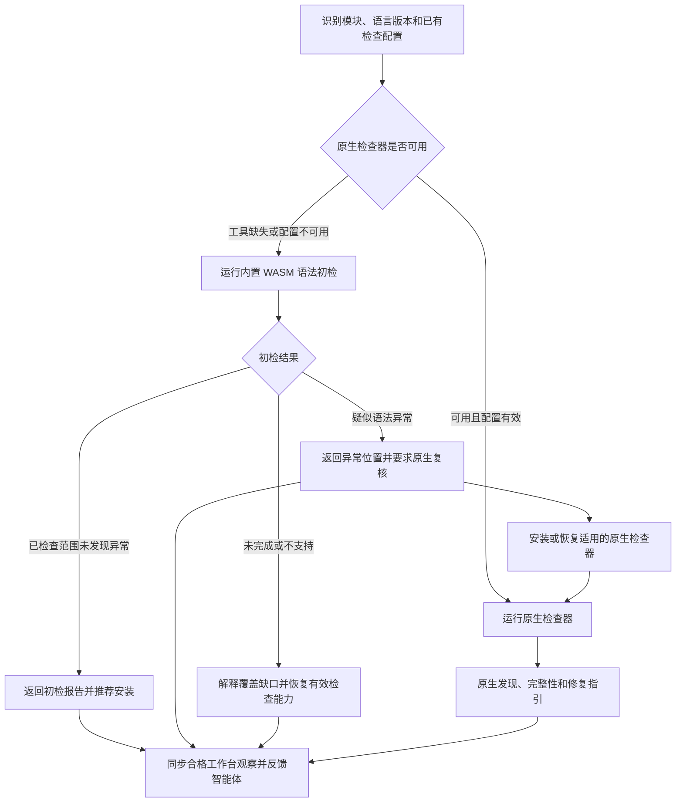

原生检查已检出违规时，不能切到兜底获取干净结果。原生执行失败时可补充初检，但必须保留原故障。WASM 仅覆盖语法，不替代已配置的规范规则、Javadoc、类型、依赖/CVE 或安全检查。项目已要求的原生检查，不会因初检正常变成可选。

| 情况 | 面向用户的结论 | 下一步 |
| :--- | :--- | :--- |
| 原生检查器可用 | 原生报告、实际范围与完整性 | 按原生诊断处理 |
| 缺原生工具，初检正常 | 已检查范围未发现语法异常；原生 lint 未执行 | 推荐安装；项目已有必需要求时仍必须安装 |
| 缺原生工具，初检疑似异常 | 待原生确认的疑似问题，不是已确认违规 | 必须安装/恢复适用工具并复核 |
| 工具已安装，配置无效 | 配置阻塞及局部初检结果 | 修复配置，不重复安装已有工具 |
| grammar 不兼容、工作进程超时或加载失败 | 初检未完成/不支持 | 恢复原生检查或修复解析支持，不归罪源码 |
| 零文件或嵌入语言覆盖不全 | 空范围/未完成，不能报告全部通过 | 恢复范围或列明未覆盖区域 |

“必须”约束验证与任务关闭条件，不越过用户已有授权安装工具，也不冻结无关工作。无法安装时，保留一张有具体原因的环境任务。grammar 异常可能是误报，但已升级的任务仍须经有效原生复核才能解决。

### 8.2 Grammar 资产与 Rust 职责——目标

复用固定版本的 CodeGraph grammar WASM，以及适用的上游许可证、源码引用、补丁和语料。不能把 CodeGraph 的图提取或源码遮盖启发式直接用于语法判定。CodeGraph 的 `src/extraction/grammars.ts` 通过 `web-tree-sitter` 加载语言资产，在那里可加载不证明兼容 Codeguard 的 Rust 运行时。发行时必须固定不可变的来源与资产清单，不能把正在修改的本地目录直接当作发行输入。

只读 `codeguard grammar status` 现投影[固定来源覆盖库存](../grammars/codegraph-coverage.json)：CodeGraph 随仓 30 份 WASM，依赖提供另两种独立 grammar；CodeGuard 有 C、C++、C#、Go、Java、JavaScript、Lua、Luau、Objective-C、Python、Rust、Solidity、TypeScript、TSX、Zig、ArkTS、Nix、Terraform、R、Ruby、PHP、Kotlin、Dart、Erlang、Pascal、CFML、CFQuery、CFScript、COBOL、Scala、Swift、VB.NET 三十二份资产候选。C、C++、C#、Go、JavaScript、Lua、Luau、Rust 的 CodeGraph 随仓字节及上游标签许可证已固定，可由 Rust worker 解析基础正反例，但尚未进行语言验收或公开 lint 接线。ArkTS、Nix、Terraform 的来源、许可证、字节及 Rust 正反例也已固定，仅为候选，尚无逐语言验收的独立 lint 路由或发行验收；见[局部验收](../tests/acceptance/arkts-nix-terraform-grammar-candidates.md)。Objective-C 与 Solidity 来自锁定的 `tree-sitter-wasms@0.1.13`，保留原始字节和许可证，并以固定散列的 `dylink` 元数据转换加载；仍未做语言验收与发行。Zig 新版来源 WASM 的导入经固定哈希适配后由 Rust 加载，已有局部 `lint zig` 原生优先候选入口，但尚无已验收发行能力。Python 已有源码可选构建中的局部 `lint` 兜底，仅覆盖 Ruff 不可用或项目未声明配置的情形；原生结果优先且不能批准交付。已初始化工作区的单文件范围可同步稳定的原生确认任务；候选零恢复节点不会关闭任务。覆盖库存与[候选资产清单](../grammars/manifest.json)分开，不能凭库存行自动加载或宣称支持。COBOL 现可在 20 MiB 输入限额下加载，但冷启动与内存预算未验收。

R、Ruby、PHP、Kotlin 也已固定 CodeGraph 字节、许可证和 Rust 实测 ABI，并通过隔离 worker 的窄范围正反例；PHP 样例覆盖 HTML/PHP 混合内容，仍仅为未验收候选。CodeGraph 原 Dart WASM 仍不能由 Rust 直接加载；CodeGuard 现以固定上游 C 源码和真实外部 scanner 经 Zig 可重复构建，再做固定 WASI 导入适配。Rust 加载与隔离 worker 的窄范围测试通过，但公开 lint 与发行仍未验收；见[Dart 重建局部验收](../tests/acceptance/dart-grammar-rebuild-candidate.md)。Erlang 已固定 CodeGraph 字节、上游 0.19 许可证及 ABI 14，并已有 Rust worker 样例与 OTP 28 原生对照；源码构建已接通显式原生优先 lint 和任务复检。原 WASM 仍漏检函数终止符，完整语言与公开发行验收仍缺，见[原生对照](../tests/acceptance/erlang-native-differential.md)和[任务复检](../tests/acceptance/erlang-native-task-verification.md)。Pascal 已固定 CodeGraph 字节、原始 Isopod 依赖提交和许可证，ABI 14 及窄范围 worker 样例通过；原生对照和公开 lint 尚缺，见[Pascal 候选局部验收](../tests/acceptance/pascal-grammar-candidate.md)。其余七份 CFML/CFQuery/CFScript/COBOL/Scala/Swift/VB.NET 来源 WASM 也已固定并由 Rust worker 加载，累计 32/32 份候选、0 项已发行。CFQuery 漏掉 `SELECT FROM`，VB.NET 对合法未缩进方法体误报，COBOL 成本高；都不能发布为 lint，见[七份局部验收](../tests/acceptance/final-seven-grammar-candidates.md)。

```text
grammars/                         # 规划中的发行资产，不是项目状态
├── manifest.json                 # 固定来源、摘要、ABI 及能力映射
├── java/
│   ├── parser.wasm
│   └── LICENSE
└── typescript/
    ├── parser.wasm
    └── LICENSE
```

每个资产记录语言/方言、上游提交与补丁身份、WASM SHA-256、Tree-sitter ABI/运行时兼容性、已验收语言版本、已知限制、许可证和语料引用。文件存在、加载兼容、语法检查通过验收，是三个独立能力状态。内置 grammar 必须能离线运行，并按需加载；额外语言包更新须经版本化清单与兼容性检查。

| 所有者 | 本设计增加的职责 |
| :--- | :--- |
| `codeguard-core` | 后端选择策略、初检状态、必须/推荐准备动作及结果协调 |
| `codeguard-runtime` | Rust Tree-sitter WASM 宿主、有界解析工作进程、资产核验、缓存及取消 |
| `codeguard-adapters` | 语言/方言解释、语法观察及原生复核能力映射 |
| `codeguard-cli` | 组合适配器与 runtime；命令、持久化和 human/JSON 简报 |
| 独立 `codeguard-plugin` | 宿主触发、对话摘要交付与反馈去重 |

保留四 crate 的依赖方向：适配器解释观察，由 CLI 组合 runtime。WASM 工作进程接收有界源码字节，不提供通用文件系统/网络导入。父进程截止时间、终止、内存和输出上限须逐宿主验证，不能仅凭 WASM 名称声称资源已隔离。运行时与 grammar 版本还须符合声明的 Rust MSRV，否则应明确变更兼容契约。Rust 的 [Tree-sitter WasmStore](https://docs.rs/tree-sitter/latest/tree_sitter/struct.WasmStore.html)提供加载接口，不保证复制来的每个 grammar 均兼容（参考核对日期：2026-09-28）。

S14.2 Rust加载器的离线固定资产、损坏/散列/ABI拒绝及Rust1.85检查已验收；32份候选可加载与已验收语法能力0并不冲突。语言精度、来源治理、隔离和发行由各自未完成任务继续承担，见[加载器核验](../tests/acceptance/rust-wasm-loader-completion.md)。

### 8.3 智能体反馈与验证闭环——目标

分别报告初检、原生执行及交付状态。`clean` 仅表示未观察到语法异常；`suspected_issue` 需要确认；`incomplete` 和 `unsupported` 说明覆盖缺口。必须识别 Tree-sitter 的 `ERROR` 和 `MISSING` 恢复，归并相关节点并保留源码位置。版本/方言不确定性属于诊断上下文，不是源码错误证明。见 [Tree-sitter 查询语法](https://tree-sitter.github.io/tree-sitter/using-parsers/queries/1-syntax.html)。

插件发送检查方式、已检查/未覆盖范围、观察、原生状态、下一步，以及持久化成功后真实存在的任务引用。CLI 本身不能向任意宿主注入消息。`AGENTS.md` 保存长期工作流说明，不追加每轮日志。仓库文本和工具输出只作为数据；安装动作来自审核过的适配器方案，不从诊断文本拼接 shell 指令。

目标简报示意，不是实际输出（路径和任务 ID 为合成示例）：

```text
Codeguard：Java 语法初检发现 1 处疑似异常
方式/范围：内置 WASM；选中的 18 个 Java 文件均已检查。
原生检查：未执行，项目要求的 JDK 不可用。
位置：src/main/java/example/UserService.java:42，MISSING 恢复节点。
下一步（必须）：准备声明版本的 JDK 和适用的原生检查器，
先确认此文件语法，再根据原生诊断修复。
关联任务：CG-example-java-setup（实际使用时仅输出真实持久化任务）。
这尚未确认为代码违规，交付未评估。
```

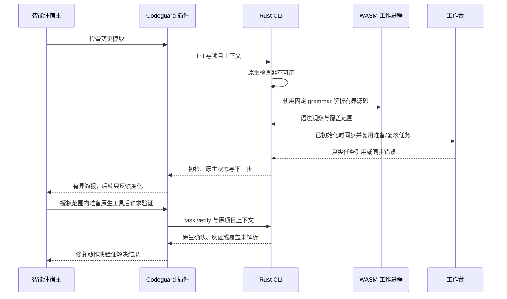

必需准备时，每个模块/检查义务只创建一张准备与确认任务，关联疑似源码观察。可选准备保持为建议，不生成阻断性修复任务；`next` 不能反复选中它。仅安装成功不能关闭任务。原生确认必须覆盖同一语法能力、文件/方言和当前输入：仅 Java 规范检查输出不能证明编译器级语法正确。确认的问题转为原生修复工作；覆盖充分的原生反证记录为解析器误报候选；覆盖不明继续保持未解析。之后单独一次 WASM 初检正常不能满足已要求的原生复核。

白名单处置绑定规则、源码目标、grammar 身份和原因；保留原始观察，相关输入变化后重新评估。白名单不能移除必需原生检查或伪造覆盖。重复运行更新稳定任务和尝试历史。首次反馈简报，之后只反馈有意义的变化；通过状态视图保留未完成项，不反复发送相同安装要求。双语报告示例及拟议数据契约见技术方案 **7.3–7.4**。

### 8.4 宿主事件与检查档位——目标

宿主 Hook 只传递事件、工作区身份和已知目标；Rust core 选择检查档位，正式 CheckPlan 再决定原生检查器及资源预算。智能体不能用提示词、旧软缓存或项目内 `skipGate` 自行改变交付义务。当前 [纯领域路由](../crates/codeguard-core/src/hook_trigger_planner.rs)已限制逐文件快检范围；批量编辑超预算时返回有明确原因的批量范围重定。只读 `codeguard hook plan` CLI 仍仅返回候选档位与退出码 3，尚未执行检查、接入插件或真实 Git/CI，也未证明任何宿主的自动触发。完整事件驱动执行仍是目标设计。

独立的 `lint python . --file REL_PATH` 已能以相同路径预算调用原生 Ruff，仅输出指定文件的局部反馈；它没有由 `hook plan` 自动调起，未执行本轮 Git 范围检查，也不将局部结果当作完整工作台扫描。

`hook execute PATH --timeout DURATION --format=json` 消费同一版本化宿主事件。会话启动只读发现；Stop 只读本地有界下一步，不调用检查器；确认成功的有界编辑范围先执行所选 Python/Ruff、JS/TS/ESLint，再对未覆盖文件执行可选 WASM 候选观察。Stop 最多检查 64 个 finding 和 64 份报告，报告字节总预算为 8 MiB；超出后返回 `guidance_scope_exceeded`，检查仍为未运行。`repair_ready` 先将单任务历史限制在 128 项和 1 MiB，读取稳定任务事实，再经有界子进程复用现有 `task verify`，只返回原检查器观察和本地事件是否保存的摘要；不关闭任务、不批准交付。显式提供 `--git-tool ABS_PATH` 后，`pre_commit` 在事件总截止时间内观察本轮真实暂存 index（含 `GIT_INDEX_FILE`），报告路径违规与对象核验状态，绝不拿编辑快检结果充作提交门禁。缺工具或 index 观察不稳定仍是不完整。未知/失败写入、推送和 CI 保持显式 `not_run`。`hook_execution_feedback` 0.6 仍仅是候选证据，历史 0.1–0.5 schema 保留。用户提示事件现返回固定的非阻断检查时机指引，不解释提示词或启动检查器，不能据此认定交付意图或 Git 门禁；插件 Hook、缓存复用和完整 Git/CI 质量门禁尚未接通。

Rust CLI 另有 Claude Code `SessionStart`、`PostToolUse`、`PostToolUseFailure`、`Stop` 候选软入口。启动只读发现；成功编辑核对绝对路径、项目根及普通文件后复用同一执行器；失败编辑走不检查源码的路由，不把错误文本当指令；Stop 有界读取已有任务事实，不运行检查器，仅在首次 Stop 发现稳定任务时给一次 `additionalContext` 继续指引，`stop_hook_active=true` 或无任务时只显示提示而不反复唤醒。全部反馈有界，排除源码、原工具错误及可编辑任务正文；非法/超预算输入显示未运行。宿主退出 0 仅表示软反馈已返回，不是质量通过。独立 `codeguard-plugin` 有显式固定二进制候选 dispatcher，默认 Hook 与真实宿主验收仍未完成；见[局部验收](../tests/acceptance/claude-post-tool-hook-candidate.md)。

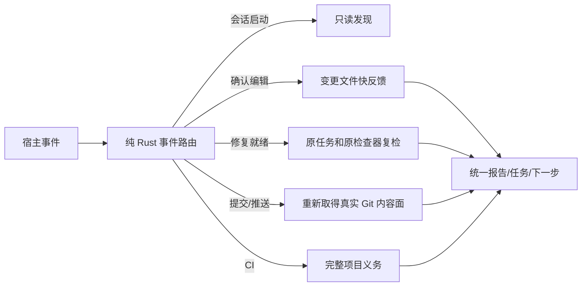

| 事件 | 应请求的档位 | 不可省略的约束 |
| :--- | :--- | :--- |
| 启动/恢复、用户提示、停止 | 只读发现、非阻断性意图建议、会话摘要 | 提示文字不能替代真实 Git 门禁，不签发通过 |
| 确认写入成功 | 受影响文件快检 | 同一内容与全部配置身份一致时才可复用完整软结果；项目级重任务排队 |
| 写入失败/结果未知 | 不检查 / 重新确定范围 | 未知不能当作无变更或已检查 |
| 修复尝试完成 | `task verify` 原生复检 | 仅安装工具、勾选任务或 WASM clean 不关闭问题 |
| 提交、推送、CI | 严格提交面、实际 ref 推送面、完整项目义务 | 不信宿主传入的路径列表或旧保存反馈；无可靠阻断能力则报告缺口 |

节流只合并同一内容快照的重复快反馈，不吞掉新输入、失败复检或交付事件。缓存至少绑定源码及依赖闭包、工具、规则、配置、平台和漏洞库时效；严格门禁重新核验完整义务与身份，缺证明时重算或标未完成。对每档分别测量耗时分位数、重复执行、缓存失效、漏检和误报，再确定预算；不能仅靠固定延时声称高效。


## 9. 持久化与所有权

```text
checked-project/
├── AGENTS.md                       # 仅管理 Codeguard 标记区块
└── .codeguard/
    ├── .gitignore / README.md
    ├── workspace.json              # 工作区身份及受管摘要
    ├── project.json                # 静态观察
    ├── module-graph.json            # 分类型关系与未解析条件
    ├── architecture.md             # 架构观察投影
    ├── findings/                   # 脱敏事实与追加式事件
    ├── tasks/                      # 可读投影和纠错附件
    ├── decisions/                  # 决策引用，不可本地自批
    ├── reports/                    # 忽略入库的局部观察
    ├── runs/                       # 忽略入库的运行数据
    ├── cache/                      # 忽略入库的缓存
    ├── worktrees/                  # 忽略入库的工作副本
    └── state/                      # 忽略入库的收据、观察和租约
```

原检查器输出、归一化观察、持久问题事实和可读投影分别建模，不能互相替代为权威来源。空目录在写入文件前不一定出现在 Git 中。

`work sync` 按工作区与 run 绑定报告，幂等消费匹配记录。重复发现维持稳定任务，重复观察尽量避免污染已跟踪文件。一份坏报告不能成为丢弃其它有效报告的理由。多文件写入不宣称具有数据库式全原子事务；恢复测试目前覆盖部分中间态和进程退出。

普通源码发现按点前缀规则跳过 `.codeguard/`，Codeguard 仍校验其中自有记录；`codeguard/src` 等用户源码继续检查。发现旧 `codeguard/workspace.json` 时报告迁移冲突；整体移动旧目录可能隐藏用户源码。已跟踪记录也须服从入库安全检查，完整安全门禁仍待实现。删除任务不构成源码已干净的证据。

## 10. 执行、并发与资源约束

[ProcessSpec](../crates/codeguard-runtime/src/process_spec.rs) 记录绝对工具路径、字面参数、明确 cwd、选定环境、stdin、共同截止时间和 stdout/stderr 合计上限。[进程执行器](../crates/codeguard-runtime/src/process_runner.rs)负责捕获、终止和清理。Unix 进程组与文件系统调用使用隔离的 unsafe 代码，工作区不承诺零 unsafe。

[任务调度器](../crates/codeguard-runtime/src/task_scheduler.rs)执行已校验 DAG，并约束依赖和共享资源互斥。失败依赖不启动子任务，取消与截止时间区分排队和运行状态。调度器无法强制抢占不响应取消的任意 Rust 回调。

| 预算 | 当前数值 / 范围 |
| :--- | :--- |
| 检查超时 | 默认 30 分钟，有效 1 ms–24 小时 |
| 检查并发 | 默认 min(可用并行度, 4)，显式范围 1–64 |
| 检查源码快照 | 当前聚合路径最多请求 4,096 文件、单文件 16 MiB、总计 256 MiB |
| 进程输出 | 由 ProcessSpec 决定，多个现有探针采用合计 16 MiB |
| 任务租约 | 本地 token/generation/过期控制，不是跨机器协调 |

这些是实现预算，不是延迟或吞吐实测保证。具体探针可能有更小限制。当前未认证端到端 CPU、内存或网络沙箱，构建扩展及原生工具行为仍在威胁模型内。

## 11. 任务生命周期与无进展控制

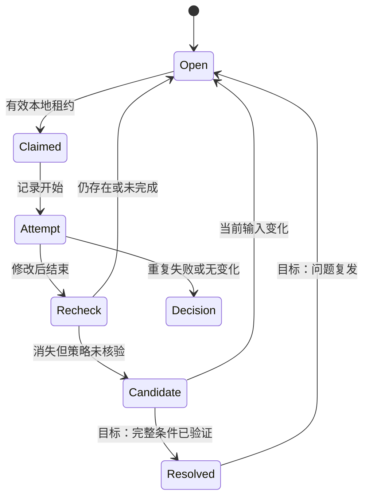

这是概念生命周期，不表示每个状态名都已原样持久化。当前本地事实仍保持 open，通过复检事件区分 `still_present`、`still_blocked`、抑制/配置核查及候选消失。尝试、租约和复检收据是独立结构。

租约不能只凭 owner 字符串覆盖，必须核对 token、generation 和期限。失败、无变化、放弃等尝试进入有界无进展处理。`next` 读取结构化事实及经核对的局部观察，不执行任务 Markdown 中的指令。完整父事件协调、跨机器协作、可靠正式关闭仍待完成。

## 12. 误报规则与信任边界

| 边界 | 要求 | 当前限制 |
| :--- | :--- | :--- |
| 原生诊断 → finding | 保留精确规则、工具、位置及不支持状态 | 解析器只实现选定协议和规则子集 |
| 项目文本 → 智能体上下文 | 转义为数据，不提升为策略 | 不宣称普遍免疫提示注入 |
| 候选 → 已批准例外 | 匹配当前身份、期限和批准范围 | 公开 CLI 尚无完整批准与生效链 |
| 原生抑制 → 修复结果 | 宣称修复前识别覆盖变化 | 仅部分适配器有对照复检 |
| 报告 → 当前观察 | 核对工作区、run、输入、工具绑定 | 摘要证明字节一致，不自动证明独立信任 |
| 任务投影 → 源码状态 | 必须原工具复检 | 勾选或删除不能证明解决 |

误报治理是明确产品能力，不是宽泛的 skip 开关。精确匹配和签名核验基础能力已存在，但不代表密钥分发、批准治理、可信时间和门禁接线已完成，见[误报技术方案](Codeguard-Technical-Design.zh_CN.md)。

## 13. 协议与配置

CLI 返回命令专属的版本化 JSON、可读投影及部分 SARIF。[Schema 目录](../schemas)包含当前与旧协议。通用/目标 `RunReport` 与多种当前局部观察协议并存，集成方不能假定所有命令已经返回同一个封套。

配置层具有不同权威：

1. 原生工具配置决定原生检查。
2. 项目运行选项决定时间和并发，不决定策略。
3. 规则包、工具锁、策略候选描述预期绑定，不能仅凭文件位置获得批准。
4. 已批准策略与例外需要明确可信来源，完整接线尚未完成。

运行优先级和精确 schema 见 [README](../README.zh-CN.md)。未知字段及不支持版本按对应解析器处理，不能泛称所有解析器已有完全相同的严格规则。协议兼容与旧退出语义需要显式适配。

## 14. 可靠性与运行恢复

| 故障 | 反馈与修复动作 |
| :--- | :--- |
| 缺 JDK、工具或配置 | 准备阻塞，恢复所需环境或配置 |
| 原生超时、输出超限 | 未完成，保留可独立解析且属于当前输入的发现 |
| JSON/XML 截断或协议未知 | 具体解析/协议原因，不制造 finding |
| 扫描中或扫描后输入变化 | 旧观察不能作为当前解决依据，重新扫描 |
| 同步冲突、持久化中断 | 保留原报告、反馈同步状态、重试或协调 |
| 人工修改 AGENTS 受管区块 | 保留人工内容，报告归属冲突 |
| 反复无进展 | 停止相同动作，给出具体决策需求 |
| 漏洞库未知或过期 | 展示可用局部观察及 CVE 完整性缺口 |

原生检查已无诊断时，不应仅因无关的策略前置未完成而无限重复扫描。目标体验是将缺失前置归并为一个稳定、可处理的问题。当前权威接线不完整属于产品缺口，不等于代码修复失败。

本仓库没有守护进程可用性 SLO、跨地域 RPO/RTO、生产指标后端或已验证基准。现阶段诊断依赖结构化反馈、run ID、本地观察和验收记录。原始日志即使被 Git 忽略，也可能包含敏感内容。

## 15. 部署、升级与集成

当前部署形态是本地构建二进制加独立准备的原生工具链。`@partme.ai/codeguard@0.1.3` npm 包通过 Node 命令入口携带 Apple Silicon macOS 二进制；Node 层只转发参数、工作目录、环境、输出与退出状态。该平台的发布、全新缓存 `npx` 版本检查及注册表/本地制品字节核对已通过。二进制回报候选源码提交，但这不证明签名来源、可复现构建、多平台发行或完整质量门禁。公开 `tools install` apply 仍受阻，内部包核验、下载和安装基础能力已有测试。

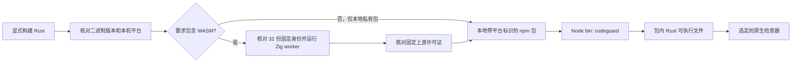

默认本地包标记为 private，不含 npm 安装钩子。`bin` 入口见 [npm/codeguard.cjs](../npm/codeguard.cjs)，[scripts/pack-npm-local.mjs](../scripts/pack-npm-local.mjs)使用已构建二进制打包。`--public` 模式已产出公开的 `@partme.ai/codeguard@0.1.3`，仅覆盖 Apple Silicon macOS；全新缓存运行和包/二进制摘要核对见[npm 0.1.3 验收记录](../tests/acceptance/npm-0.1.3-wasm-candidate.md)。扩大分发范围还需平台覆盖、可信制品清单、版本与摘要绑定及发行流程。CodeGraph 的 Node 入口和平台包布局为此设计提供参考；其可选网络回退不属于 Codeguard 当前安装路径。

已发布的 0.1.3 WASM 候选包使用 `--require-wasm` 或 `--public` 时，打包器会拒绝没有 worker 的二进制，核对固定清单的 32 份资产身份，并在写包前执行 Zig worker；[本地离线 npm 验收](../tests/acceptance/npm-wasm-local-package.md)另从包内运行 Zig、Dart。打包器还核对并分发全部固定上游许可证；公开 0.1.3 包与注册表字节一致。这不会让旧版 0.1.2 自动获得 WASM，也不证明任何语言的 lint 精度；见[公开候选验收](../tests/acceptance/npm-0.1.3-wasm-candidate.md)。

升级时记录二进制/schema 版本，保留工作区，预览受管变更，重跑有限检查，再核对报告消费。降级必须服从已有 schema 读取范围，不能为了通过解析而改写历史记录成旧格式。

目标插件应将宿主调用映射到同一 CLI 语义，将结果与下一步带回对话，同时区分传输失败与质量状态。宿主 fail-open 策略不能抹掉未解决发现。本基线调度器未提供 MCP 服务或宿主绑定。

## 16. 架构决策

| 决策 | 选择与理由 | 重新评估条件 |
| :--- | :--- | :--- |
| A01 语言 | Rust 编排，保留原生分析器的生态语义 | 实测平台限制要求有界适配变更 |
| A02 结果 | 发现与完整性独立 | 新类别需要额外维度，且不能删除原有两条信息 |
| A03 持久化 | 可审查文件及本地收据 | 实测规模或并发要求引入存储迁移，并保留兼容投影 |
| A04 智能体边界 | 检查和转换确定性，智能体提出修复 | 模型辅助建议经过独立评测且不能授予权威 |
| A05 例外 | 精确身份、批准及生命周期 | 真实场景需要更丰富身份，但不能误扩范围 |
| A06 架构发现 | 带证据的未知状态及直接声明 | 有效模型/源码图解析具备受控执行与测试依据 |

这些决策记录当前意图和约束，不追认缺失功能已经获批或完成。技术方案进一步给出实现细节、阶段依赖和可观察验收标准。

## 17. 验收与待决事项

验收维度包括原生语义正确性、误报和漏报测量、故障处理、稳定任务身份、有界重试、配置与抑制变化、输入新鲜度、平台行为和真实宿主交付。单元测试通过或 schema 文件存在不能合并证明以上全部要求。

有日期的本地基线为 990 项测试通过、101 项忽略。不能据此推断生产误报率、完整原生矩阵、MSRV 矩阵、全部平台支持或远程 CI 成功。

面向生产仍须明确批准来源的所有权、可用的例外评审体验、工具分发与升级职责、跨平台进程隔离、schema 保留策略、私密漏洞披露和发行包装。这些缺口不妨碍使用明确范围内的局部观察，但限制了完整生产质量门禁的完成声明。

---

**文档版本：**1.2.0 · **创建日期：**2026-09-28 · **最后更新：**2026-10-04 · **文档状态：**待评审；实现仍为局部完成。

源码新增编辑事件原生优先快检：`hook execute` / `hook claude post-tool-use` 只检查事件明确指定的普通文件，Python 用 Ruff、JS/TS 用模块本地 ESLint 10；同字节完整原生结果不重复解析。未覆盖文件可调用固定 WASM 候选，混合语言仍保留局部结果、原生未接线范围和失败原因。疑似恢复节点要求安装或修复原生工具并确认；完整零恢复候选只建议安装，不代表完整通过。共享事件截止时间，最多 8 文件、2 个 WASM worker；未构建 WASM 明确报告缺口。外层反馈 0.7.0，局部 `hook_fast_feedback` 0.2.0。候选任务已接入现有工作台；默认插件 Hook、能力匹配自动关闭和真实宿主验收未完成。见[编辑快检验收](../tests/acceptance/hook-fast-native-wasm.md)。

源码编辑快检现将有恢复节点的固定 WASM 候选同步到既有 `.codeguard/` 工作台：按工作区/文件/语言稳定归并，Python 与 JS/TS 复用原有确认或准备身份。报告保存固定 grammar、源码 SHA-256、已知限制和原字节疑似位置；导入拒绝身份或坐标失配、重复 JSON 键。只有实际同步成功才给出任务 ID；完整零恢复不创建新的必需任务；无定位但恢复扫描未完成时创建检查恢复任务。两者都不能关闭旧任务。对话提供 `task show` / `task verify`，缺原生确认 adapter 明确反馈能力缺口。外层 Hook 协议为 0.7.0，局部为 0.2.0；通用 `next` 简报用 0.3.0，已有检查器仍返回 0.1.0。默认插件 Hook、能力匹配关闭和真实宿主验收仍未完成。


### Zig 确认任务的原生复检

源码构建现可执行 `codeguard task verify TASK_ID . --zig-tool /absolute/path/to/zig --format=json`，复检已持久化的 Zig WASM 确认任务。`hook execute` 的 `repair_ready` 事件接受同一显式工具参数，复用现有租约和已结束的尝试关联。`lint zig` 原生路径不依赖可选 WASM 特性；未构建该特性时，回退明确报告缺失。

固定 Zig 0.16.0 探针在共同截止时间内执行 `version` 与 `ast-check --color off`，以 stdin 检查本轮原始源码字节。当前原生诊断使简报指向源码修复；工具缺失、版本不支持和执行失败仍指向环境恢复或具体决策。新鲜的 `next` 简报在复检 argv 中携带未改变的工具路径；源码或工具字节变化使旧诊断指引失效。报告与尝试继续保存在既有工作台，不另建任务系统。

原生观察协议为 `syntax_task_recheck` 0.1.0，外层 `task_verification_preview` 为 0.12.0；通用修复简报为 0.3.0，原 0.2.0 简报与 0.11.0 复检 schema 原件保留。原生 AST 零诊断记录为 `candidate_absent_unverified_policy`：解除本地尝试的待复检状态，但不关闭任务，不认证项目 lint、构建或交付。Erlang 现通过显式 OTP 28 接入同一工作台，独立协议版本见 [Erlang 任务验收](../tests/acceptance/erlang-native-task-verification.md)；Swift 也已有显式 Apple Swift 6.4 的局部 parse 复检，见 [Swift 验收](../tests/acceptance/swift-native-task-confirmation.md)；Zig/Erlang/Swift 之外的通用原生确认 adapter 仍缺。见[验收记录](../tests/acceptance/syntax-native-task-verification.md)。

简报同时提供最新原生报告引用/摘要和当前诊断位置；输入失效后不再投影这些位置。编译入二进制的不可变 grammar 校验结果仅在进程内复用，外部清单、源码和原生工具仍按当前字节复核。


### 限定任务的可信关闭与复发重开（源码 SDK）

当前源码提供 `verify_zig_task_resolution`，面向受保护宿主核验 **Zig 原生语法确认任务**。宿主独立固定验签密钥、工作区、策略修订、代码基线、可信时间和防回滚序号，并提供摘要绑定的原始反例；这些输入不能从项目自选公钥、候选策略或任务 Markdown 中取得。该入口尚未接入默认插件或公开 CLI 的可信策略提供者，也未包含在已发布的 npm 0.1.3 中。

处理器在既有任务租约下使用同一批准的 Zig 0.16.0，先检查原始字节，再检查当前文件；两次检查共享请求截止时间，并受批准到期时间限制。只有原样本有原生诊断、当前源码已改变且零诊断，工具/宿主制品/grammar/任务/策略身份一致时，才追加 `code_fixed` 解决事件。原样本同样零诊断进入误报调查；环境失败或输入变化进入待核验，不记为代码修复。适用能力仅为语法，不代替完整 lint、类型、安全或 CVE 检查。

生命周期事件按明确父关系重放；重复复检不重复追加同一解决事件。普通 `task verify` 再次取得匹配原工具的当前原生诊断时追加 `reopened`，保留首次事实与解决历史，并重新提供当前原生修复指引。父节点缺失、分叉、重复身份、证据丢失或摘要变化须核对，不能按时间最新覆盖。关闭处理器复用既有原生观察/尝试收据，解除对应 `awaiting_verification`，借用租约不被释放。

`.codeguard/findings/<id>/events/lifecycle-*.json` 是脱敏追加记录；对照证据位于默认忽略的 `.codeguard/state/resolution_evidence/`。首次 `finding.json` 不改写。本地 `next/task show/status` 不持有可信策略，因此不把历史声明升级为当前关闭或交付许可；关闭历史给出复核步骤，复发则沿用当前原生诊断。每份宿主收据的 `delivery_decision` 均为 `not_evaluated`。

完整范围仍缺其它检查器的可信关闭、环境/依赖/删除目标/政策处置、实际宿主策略来源、跨机器证据恢复及正式交付门禁。见[限定任务验收](../tests/acceptance/task-resolution-lifecycle.md)。


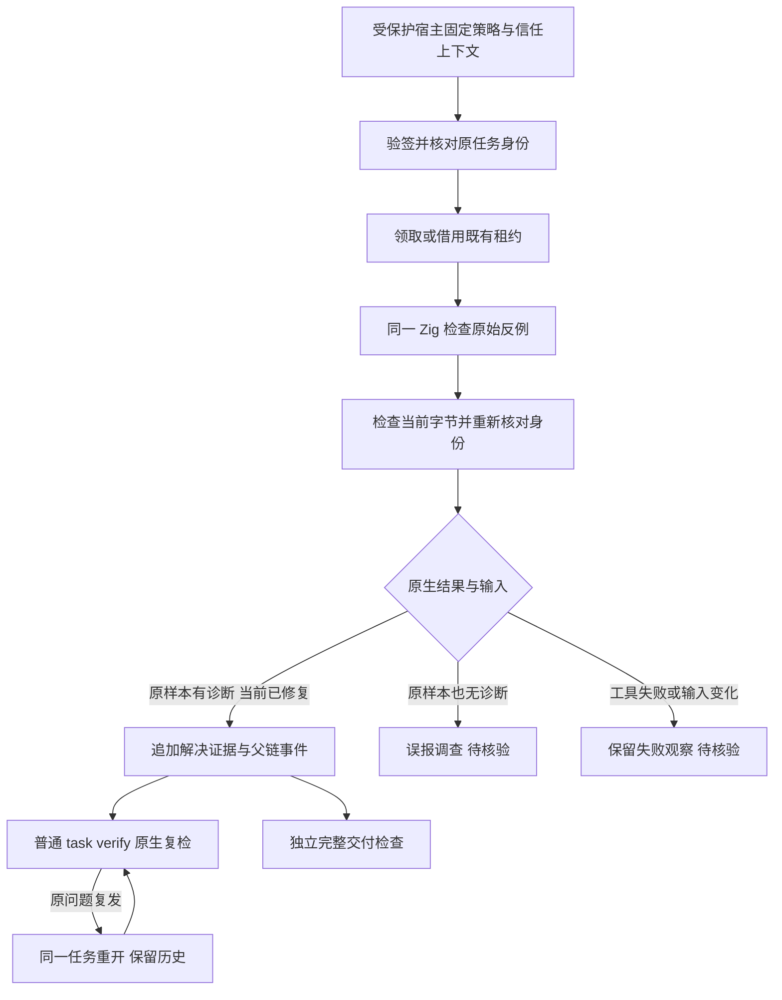


### 当前公开候选：0.1.4

`@partme.ai/codeguard@0.1.4` 已从干净源码 `1cd458f6e01a44a74388243e964e3f45290ac18e` 发布，限 Apple Silicon macOS。包含全部 32 份可执行但未验收的 grammar、指定编辑文件检查、稳定原生确认任务、原生复检与 next 指引。注册表摘要、新缓存 npx、公开包真实 Zig 0.16.0 修复链路及相同源码 Linux CI 已通过。普通 CLI 的零诊断不能在缺可信策略时关闭任务；限定 Zig SDK 是源码集成 API，npm 不暴露自批命令。插件启用、真实宿主、完整精度、多平台与完整门禁仍未完成。此前 0.1.3 证据保留为历史快照。见 [0.1.4 验收](../tests/acceptance/npm-0.1.4-candidate.md)。


### Erlang 确认任务与原生修复指引（当前源码）

`codeguard task verify TASK_ID . --erl-tool /absolute/path/to/erl --format=json` 和 `hook execute . --erl-tool /absolute/path/to/erl` 的 `repair_ready` 事件现复用已有 `.codeguard/` 任务、租约、尝试记录与共享截止时间，执行与 `lint erlang` 相同的 OTP 28 原生 forms 解析。工具和任务语言在租约或启动进程前核对，不启动项目源码、宏展开或 parse_transform。

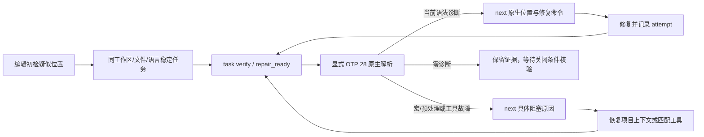

Erlang 原生观察使用 `syntax_task_recheck` 0.2.0，复检反馈为 `task_verification_preview` 0.13.0，复检后的 `next` 简报为 0.4.0；Zig 和历史 schema 原件不变。简报新增 `native_confirmation_reason`，缺工具给出明确 OTP 28 准备动作；宏/条件编译给出项目原生预处理/编译需求。源码变化会清空当前诊断并要求复检；工具改变会移除旧工具 argv。只有版本已观察为 OTP 28 且摘要仍一致的工具可复用，过旧工具不能被建议为已就绪工具。

原生零诊断记录为 `candidate_absent_unverified_policy`，解除关联尝试的待复检状态，但不关闭任务或签发交付许可；两次无进展沿用既有预算，转为具体决策而不是重复修复。当前限定可信关闭 API 已扩展到 Erlang 源码 SDK，默认宿主仍缺受保护策略接线；Erlang 项目完整 lint/预处理、原生发现的完整生命周期、自动工具发现及实际宿主发行尚未完成。公开 npm 0.1.4 不含此扩展。[验收与协议](../tests/acceptance/erlang-native-task-verification.md)。

Erlang `repair_ready` 使用 Hook 0.8.0 / 内层摘要 0.2.0，直接包含当前原生位置、具体未完成原因、Unicode 字符列单位和已保存报告引用；其他 Hook 版本保持不变，实际安装宿主对话交付尚未验收。

### 统一入口的 Erlang 原生优先检查（当前源码）

```bash
codeguard check all . --format=json
codeguard check all . --erl-tool /absolute/path/to/erl --timeout 30s --jobs 2 --format=json
```

`erlang.lint` 节点选择显式工具或 PATH 绝对目录中的首个可执行 `erl`，复用已有受控 OTP 28 scanner/parser。每轮最多观察 64 个普通 UTF-8 文件，每文件不超过 1 MiB，沿用请求总截止时间和任务图并发预算。`native_results.erlang_lint` 提供当前源码摘要、诊断位置、工具选择、逐文件下一步及采用绝对源码路径的原工具复检 argv，可从项目外直接重放；超出原生预算的范围明确计入未观察数。

只有完整、非预处理、源码与工具字节都匹配的 forms 观察才跳过重复 WASM。工具缺失保留候选初检；所选工具失败仍可伴随补充候选观察，但原生阻塞不会被洗成成功。宏/条件编译继续未完成。源码或工具变化会撤回受影响文件的当前定位和可复用 argv。项目范围变化设置 `scope_stable: false` 并保留仍与当前字节匹配的单文件诊断，同时撤回整体范围完整性。SIGINT 保持退出 130；JSON、human 和保守 SARIF 保留原生发现，不签发项目通过。

已初始化工作区的原生发现现在直接进入稳定任务，不要求先有 WASM 错误：聚合反馈现为 `check_feedback` **0.38.0**，内嵌 scan **0.2.0**，逐文件返回真实 `task_id` 或 `task_sync_reason`；`lint erlang FILE` 自动绑定最近已有工作台，反馈为 **0.3.0**。重复扫描和历史 WASM 来源复用同一任务，缺工具与预处理进入环境任务。未初始化聚合检查同为 0.38.0，历史协议保留；`check_aborted` 仍为 **0.13.0**，历史 schema 字节不改。可信关闭、复发重开和完整项目检查仍缺；公开 npm 0.1.4 不含本批实现。见[原生发现到修复指引](Codeguard-Native-Repair-Workflow.zh_CN.md)及[实际验收](../tests/acceptance/erlang-native-first-workbench.md)。

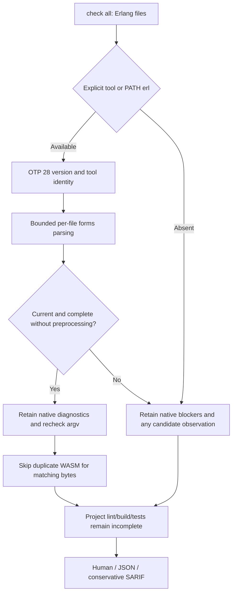

### 全 grammar 开发评测边界（2026-10-04）

开发期 `evaluate_grammars` 复用同一 Rust 隔离 worker 与 Core 分层计算，固定全部 32 份 grammar 和 358 例语料。0.2 协议将仓库回归、Dart 上游回归和待裁定预期分成 35 个语言×来源组；每组计算分类与区间，多来源语言汇总只加计数、不混算精度。Rust 导入器保留源码字节、上游预期及来源摘要；旧 0.1 语料/报告不改写。清单/源码/程序身份、未知和 pending 均保留，不成为项目质量门禁或独立 holdout。执行路径、逐组统计与缺口见 [统一 grammar 评测](Codeguard-Grammar-Evaluation.zh_CN.md)。

## P3C 单文件应用服务

原生单文件 lint 与聚合检查共用 P3C 保存/同步、稳定 finding 身份和原工具复检。单文件路径读取祖先 POM，执行范围仅限所选文件。见[修复流程](Codeguard-Native-Repair-Workflow.zh_CN.md#p3c-单文件项目绑定)。完整生效模型覆盖和可信关闭仍待完成。

原生解析、项目投影、同步和复检全程区分问题事实与执行完整性。P3C 异常终止时，已核对的有效诊断保留为稳定 finding；失败文件不计入完整观察，同时保留执行阻塞。空、无效、越界或输入变化的报告不证明问题消失。见[部分执行验收](../tests/acceptance/java-p3c-partial-execution.md)。


### Erlang 限定任务关闭与复发（当前源码 SDK）

`verify_erlang_task_resolution` 复用 Zig 的签名核验、共享截止时间、租约、尝试交接和追加父链服务。受保护宿主独立固定信任根、工作区、策略修订、基线和可信时钟；项目文件不提供批准权威。OTP 28 对首次反例和当前字节分别执行 scanner/parser：首次有原生诊断、当前字节改变且完整无诊断，才能记录 `code_fixed`。宏/include、空 forms、截断或执行失败保留待核验；原样本合法进入误报调查。

支持 WASM 首次和原生首次两种任务来源。Erlang 策略 1.1.0、证据 0.2.0 与旧 Zig 1.0.0/0.1.0 独立；原生首次的 `grammar_sha256` 必须为 null，首次工具身份也须一致。内部规则身份使用实际批准策略字节摘要，不伪造 grammar 摘要。历史读取核对首次报告语言、源码和 grammar，重算本地摘要不能跨语言套用。普通 `task verify --erl-tool` 可在同一工具下追加复发重开；没有可信策略仍不能关闭。

这仍是源码 SDK，尚未接入默认插件的可信策略提供者，公开 npm 0.1.4 不含本批扩展；限定语法任务收据不是完整 lint、安全或项目门禁许可。原生工具摘要绑定 launcher，宿主仍须独立保护 OTP 运行环境。执行路径与实际测试见 [Erlang 生命周期验收](../tests/acceptance/erlang-task-resolution-lifecycle.md)。

### Cargo 输入与代理入口边界（当前源码）

Clippy 的普通扫描及同规则 `--force-warn` 对照使用 `cargo clippy --locked --offline --all-targets --message-format=json`。缺少根 Cargo.lock 时，在原生启动前返回 `cargo_lock_unavailable`，不生成锁文件。源码指纹取自启动前的有界快照；已观察源码、清单、锁、根 Clippy/Cargo/工具链配置或原工具改变时撤回本轮 Clippy finding，保留准备/重扫任务。稳定输入下的部分有效诊断仍保留，不能把损坏报告称完整。

Cargo 为 rustup 等按入口名称分派的代理时，Clippy、rustdoc 与构建检查保留所选 Cargo 路径执行，同时核验解析目标的字节及运行后身份。私有 Clippy 输出目录以独立序号防止同时间戳碰撞。该边界只覆盖已观察输入，不证明完整 Cargo 生效配置、所有构建组合或进程沙箱；局部零诊断仍不能自动关闭任务。测试、失败记录和真实输出见 [Cargo 输入验收](../tests/acceptance/rust-clippy-input-stability.md)。公开 npm 0.1.4 尚不包含本批修改。


聚合原生阶段完成后，当前源码会用 Clippy 的非缓存 `compiler-artifact`、原根清单身份和启动前源码摘要，免除同字节 Rust 目标入口的重复 WASM。覆盖只在本次进程内传递，不从可编辑报告恢复；失败、输入/工具变化、重复 JSON 键或结束记录后的事件不授予覆盖。`all-targets` 不能证明整个目录已解析，未证明的模块和条件排除文件继续初检；原生告警、稳定任务及完整交付义务均保留。同一文件/规则/行/列在库和测试目标中重复报告时只投影一项 finding，级别以 error 优先；不同位置分别保留，历史重复任务不自动关闭。见 [Rust 原生优先验收](../tests/acceptance/check-all-native-preferred-rust.md)。公开 npm 0.1.4 尚不包含本批修改。


Clippy 输入保护还会沿同一有界静态发现策略复核 Rust 源码、Cargo 清单和锁文件的集合，快照固定全部已观察 Rust 文件及嵌套清单/锁的字节。新增、删除、重命名或读取失败使本轮观察未完成，撤回当前 finding 与原生覆盖；自有工作台记录沿既有排除策略处理，不制造源码变化。外部依赖、动态目标及完整配置闭包仍未证明。

### 已安装 Cargo 自动发现（当前源码）

`check all`、`comments rust`、`build rust` 及其 Cargo 任务复检接受可选 `--cargo-tool`。未指定时，从调用方 PATH 的绝对目录中选择首个普通可执行 `cargo`；空目录、相对目录和不可执行入口不作为候选。显式无效工具或已选工具执行失败保留具体阻塞，不换用下一个 Cargo。聚合 Rust 检查共用本轮已选入口。

最终 `cargo` 入口名保留，以兼容 rustup 按名称分派；既有解析后字节和运行后目标身份校验继续执行。子进程保留 `RUSTUP_TOOLCHAIN`，并固定 `RUSTUP_AUTO_INSTALL=0`，即使调用方设置为 `1`。Cargo 的 `--locked --offline` 不独立约束 rustup 安装工具链；[rustup 官方说明提供单独控制](https://rust-lang.github.io/rustup/environment-variables.html)。缺工具链仍是环境故障，不生成源码违规，也不自动安装。本项不证明完整工具链、有效 Cargo 配置、全项目覆盖或可信任务关闭。

受控代理/不换工具反例及实际已安装/缺工具链观察见 [Cargo 自动发现验收](../tests/acceptance/cargo-native-discovery.md)。公开 npm 0.1.4 不包含本次源码变更。


### 项目根 Ruff 工具发现（当前源码）

已配置Python扫描的 `lint python`、`check all`、指定编辑Hook执行及同根任务复检，依次选择显式 `--ruff-tool`、受检根 `.venv/bin/ruff`、调用方绝对PATH目录中的可执行入口。不激活Shell环境、不枚举安装包、不安装Ruff；本地入口沿既有原生链路探测版本、固定并复核字节。普通本地目录/入口不存在时可继续PATH；父目录链接/非目录、损坏或不可执行入口返回 `ruff_local_tool_invalid`，不静默换用全局Ruff。所选工具版本/执行失败不尝试其它工具。

损坏本地环境生成一张稳定准备任务，包含 `.venv/bin/ruff` 证据、限定环境修复范围、原Codeguard复检、历史及关闭条件。没有适用Ruff配置不启动工具。普通本地父目录中可使用可执行文件链接：解析后的工具字节在本轮固定并复核。局部成功或源码修复后零诊断仍不批准策略、不自动关闭任务。本项面向明确的受检根；逐模块虚拟环境、uv/Poetry/Conda解析、真实宿主及完整覆盖仍是独立待完成范围，见 [根内Ruff验收](../tests/acceptance/ruff-local-discovery.md)。公开npm 0.1.4不包含本次源码变更。


### 无定位语法观察的检查恢复任务（当前源码）

`check all/java` 与确认写入的 Hook 共用语法任务同步：有可定位恢复节点的观察需要原生确认；树已报告错误但恢复扫描未完成且没有可定位节点时，生成检查能力恢复任务。后者保留空恢复数组和 `syntax_recovery_incomplete`，不记为已确认源码违规，也不虚构修改位置。完整零恢复观察只推荐原生检查，不新建这类任务。

同一工作区、文件和语言复用原有稳定任务身份；重复检查、Hook 和后续可定位观察更新同一任务。`next`/任务 Markdown 明确恢复工具、语言版本或 grammar，原生确认前不得修改源码。没有原生确认 adapter 时，`task verify` 记录能力缺口并保持开放；零恢复、安装或勾选均不关闭已有任务。保存失败保留观察、逐文件失败原因且不返回虚假任务 ID。

聚合反馈使用 `check_feedback` 0.38.0 的 `syntax_tasks`；无位置本地确认报告为 0.3.0，可定位历史报告 0.1.0 与 Erlang 原生首次报告 0.2.0 保留。旧 schema 原件不改。Claude Hook 命令上下文分别显示恢复节点数和恢复扫描未完成数；这仍是命令重放，真实宿主与全部语言验收尚缺，公开 npm 0.1.4 未包含本批改动。见[验收与实际报告](../tests/acceptance/unlocated-syntax-recovery-tasks.md)。

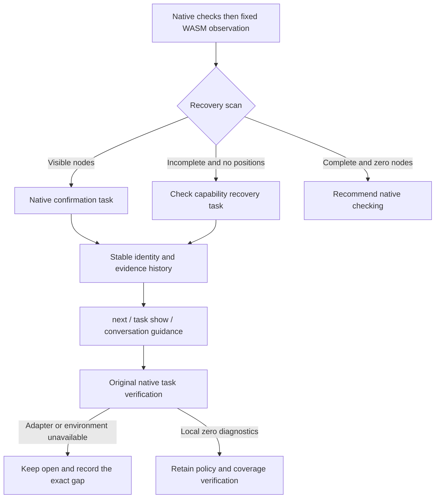


### Erlang 任务复检自动发现原生工具（当前源码）

`codeguard task verify "$TASK_ID" . --format=json`（`TASK_ID` 使用 `next` 返回的真实 `task_id`） 对已有 Erlang 语法任务复用 lint/check 的工具选择：显式 `--erl-tool` 优先，否则从调用方 PATH 的绝对目录固定首个普通可执行 erl。复检核对 OTP 28、当前源码与工具字节，并沿用任务租约、预算、事件和原有报告版本。候选来源及原生首次发现来源均可复检；repair-ready Hook 复用同一入口。

未找到工具才生成 `erlang_tool_not_found_on_path` 的环境观察；相对/空 PATH 与不可执行文件不参与选择。显式坏工具、所选版本或执行失败不改用后续工具，也不自动安装。成功观察后的 `next` 带实际工具的显式复检 argv，后续 PATH 变化不能替换这个入口。局部零诊断依然不自动关闭任务，宏/预处理、可信策略和完整项目能力仍须核验。见[复检自动发现验收](../tests/acceptance/erlang-recheck-discovery.md)。公开 npm 0.1.4 尚未包含本批改动。

### Swift 无定位观察的原生复检（当前源码）

已有 Swift 确认任务现支持 `codeguard task verify "$TASK_ID" . --swift-tool /absolute/path/to/swiftc --format=json`；`TASK_ID` 来自实际 `next`。同参数可传给 `hook execute` 的 `repair_ready`。调用方必须指定已有 Apple Swift 6.4 工具；当前不自动安装或从历史报告启动可编辑路径。缺工具给出定位既有编译器的具体动作，版本不匹配或执行失败保留原任务。

Rust 读取并复核有界源码字节，通过冻结 stdin、固定 `/` cwd、清空环境和共同截止时间执行 `swiftc -frontend -parse -diagnostic-style llvm -no-color-diagnostics -`。只投影原生错误的规则和位置，不把原始诊断文案交给智能体作为指令。Swift 列坐标是 UTF-8 字节，核对字符边界；未知输出、退出码矛盾、超时、位置越界或工具变化均保持未完成。工具摘要绑定启动入口，不独立认证整套 Swift 安装环境。

原生错误使同一任务的 `next` 进入源码修复；源码或工具变化撤回旧位置。修复后零诊断记录 `candidate_absent_unverified_policy`，不自动关闭，也不替代项目 lint、类型检查、宏/条件编译上下文、构建、安全或交付义务。重复无进展仍使用既有尝试预算。本批不提升 Swift grammar 资格或 32 语言精度结论，公开 npm 0.1.4 尚不含此扩展。

新增协议分别为 `syntax_task_recheck` 0.4.0、`task_verification_preview` 0.15.0、`repair_brief_preview` 0.6.0、Hook 反馈 0.9.0（任务摘要 0.3.0）。聚合 `check` 的 `next` 含 Swift 原生简报时用 0.39.0，其他路径保留 0.38.0；旧 schema 原件不改。具体实测和完整报告见 [Swift 原生确认验收](../tests/acceptance/swift-native-task-confirmation.md)。

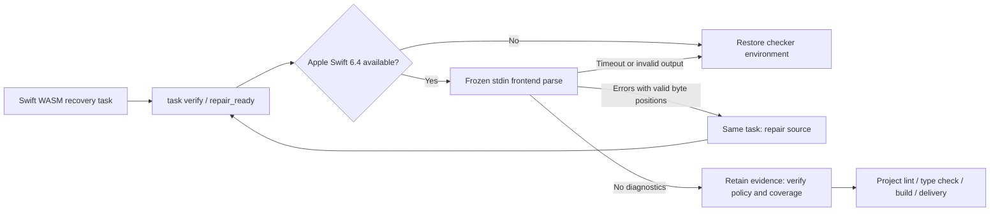


### Claude 实际生命周期验收与首次任务指引

Claude Code 2.1.273 已有会话内插件源码加载的实际证据，覆盖成功保存、重复保存、执行阶段文件系统写入失败、修复前后实际 Zig 0.16.0 复检、稳定任务以及 Stop 首次继续与重入保护。锁定公开运行时仍是 0.1.4，与当前开发源码区分。原生诊断从一项变为零项，任务保持 open，交付未评估。Edit 参数预检在工具执行前失败，本宿主未调度失败 Hook；另以真实 EACCES 写入验证 PostToolUseFailure。这不代表市场安装、可信关闭、完整原生优先或多宿主验收；见[实际宿主证据](../tests/acceptance/claude-host-prepared-runtime.md)。

实测暴露首次任务指引误称 Zig adapter 未接入，但其原生复检确实可执行。开发源码的 `next` / `task show` 现从已绑定原报告区分已接入的 Zig 0.16.0、OTP 28、Apple Swift 6.4 adapter 与尚未核验的本地工具就绪状态，提供对应显式工具参数。只读指引不执行或安装检查器、不信任可编辑任务记录中的执行路径、不在原生确认前授权源码修复、不关闭任务；未接入语言保留具体能力决策，既有原生历史继续优先。锁定公开 0.1.4 尚不包含这项修正。

首次原生确认指引使用 `repair-brief-preview` 0.7.0，明确绑定语言、受支持工具版本、工具选择参数以及 `tool_readiness: not_evaluated`。聚合检查对应 `check-feedback` 0.40.0；`task show` 外层动作与内层复检参数一致。占位路径必须由智能体核对实际已安装工具后替换，不代表工具已就绪或原生检查已执行。历史协议保持原定义，不放宽旧消费者。

### Kotlin 原生优先单文件检查（开发源码）

`codeguard lint kotlin FILE.kt [--kotlinc-tool ABS_PATH] [--timeout 30s] --format=json` 优先使用显式工具，未指定时选择调用环境绝对 PATH 中首个 `kotlinc`，当前适配 Kotlin/JVM 2.4.10。工具缺失时使用内置 WASM；已选择工具失败时保留原生阻塞，不通过换工具或 WASM 隐藏失败。仅检查冻结的普通 `.kt`，不执行 `.kts`、Gradle/Maven 项目脚本或编译器插件。

`[SYNTAX]` 输出 `kotlin.syntax`，其他诊断进入上下文列表；位置保留 UTF-16 原列并转换为 UTF-8 字节列。未知输出、入口重定向、源码变化和预算中断均不能解释为通过。缺少两个后端或原生检查未完成时要求进一步原生确认；真实 WASM 零恢复且扫描完整时推荐安装原生工具，仍不代表完整项目通过。报告 schema 为 `kotlin-lint-feedback` 0.1.0。

已接通独立 lint、已有稳定任务的 task verify 与 repair_ready；聚合反馈可投影当前任务指引，首次 check/file_changed 已接通 Kotlin 原生优先扫描及稳定任务同步；完整 Kotlin lint/注释检查、JDK 与编译器 JAR 身份、跨版本及发行验收仍未完成。该增量不在公开 npm 0.1.4 中。见 [Kotlin 单文件验收](../tests/acceptance/kotlin-native-single-file.md)。

### Kotlin 稳定任务复检与对话反馈（开发源码）

已有 Kotlin WASM 确认任务可运行 `codeguard task verify TASK_ID . --kotlinc-tool ABS_PATH --format=json`；未显式选择工具时复用独立入口的 PATH 选择规则。`hook execute --kotlinc-tool ABS_PATH` 的 `repair_ready` 路径复用原任务、租约和尝试历史。`next` 与 `task show` 从绑定事实生成工具指引，不从可编辑 Markdown 执行命令。

语法诊断和项目上下文混合出现时，简报保留当前语法位置供修复，同时保留上下文诊断和未完成状态。源码或工具变化立即撤销旧位置；原生零诊断进入后续策略与覆盖核验，不再建议重复改源码或反复安装。复检不自动关闭，Kotlin 的正式可信关闭尚未接入。聚合 `check all` 可携带当前简报，首次扫描也已对普通 `.kt` 调用 Kotlin 原生 compiler。

协议分别为原生复检0.5.0、任务反馈0.16.0、历史简报0.8.0、首次工具准备简报0.9.0、Hook反馈0.10.0、聚合反馈0.41.0。历史协议文件字节保留，未把新 Kotlin 字段放宽进旧消费者。见[Kotlin 任务复检验收](../tests/acceptance/kotlin-native-task-confirmation.md)。

### Kotlin 首次原生观察（开发源码）

`check all . --kotlinc-tool ABS_PATH` 和确认保存的 `file_changed` 接受相同显式工具；省略时发现调用环境 PATH。已选工具失败保留原生阻塞，不改走 WASM；仅缺工具时使用候选初检。最多 64 份普通 `.kt` 共用请求截止时间，不在此路径编译 `.kts`。重复扫描更新同一稳定任务，原生零诊断不自动关闭任务。

新增聚合0.42.0、保存 Hook0.11.0、扫描0.1/0.2、原生首次事实0.4.0、原生来源复检0.6.0/任务反馈0.17.0，以及首次原生简报0.10.0；已有 WASM 来源任务继续沿用旧协议。见[首次原生验收](../tests/acceptance/kotlin-native-first.md)。完整项目 lint、编译器/JDK 身份、可信关闭和公开发行仍待完成。

首次报告属于未完成、无法定位的恢复时，新的缺工具或过期原生历史不能抹掉该限制；`next` / `task show` 保留“原生确认前不得修改源码”，并叠加具体环境恢复动作。当前原生语法诊断可继续用于修复，当前零诊断仍需覆盖与策略核验。见[原生历史指引回归](../tests/acceptance/unlocated-native-history-guidance.md)。

### Swift 原生优先单文件反馈（开发源码）

`codeguard lint swift FILE.swift [--swift-tool ABS_PATH] [--timeout 30s] --format=json` 优先选择显式编译器，否则调用环境绝对 PATH 中首个普通可执行 `swiftc`。当前适配 Apple Swift 6.4，对冻结 stdin 执行 frontend parse；仅缺工具时使用内置 WASM 候选，选定工具失败保留原生阻塞。位置为 UTF-8 字节列；源码或入口目标变化撤回旧诊断，超时/取消不按源码违规解释。

`swift-lint-feedback`0.1.0 区分未完成/隐藏恢复所需的原生确认，与完整零恢复后的推荐准备。它不授予完整 lint 或交付通过：SwiftLint、注释、类型、依赖/安全和项目构建仍有义务。工具身份只覆盖所选入口，不代表整个工具链。Swift 项目原生观察已按下文接线；初始化工作区的原生任务连接见下文；完整语言及发行验收仍未完成；公开 npm0.1.4不包含本增量。见[单文件验收](../tests/acceptance/swift-native-single-file.md)。

### Swift 项目原生观察（开发源码）

`check all . [--swift-tool ABS_PATH] --format=json` 对最多 64 份普通 Swift 文件在同一截止时间内执行冻结原生 parse，报告未观察文件；原生选择失败不回退，只有缺工具保留 WASM。`check-feedback`0.43.0 / `swift-parse-scan`0.1.0 保留当前字节位置、工具选择及复检 argv。源码或工具变化撤回位置，零诊断不等于完整 SwiftLint、类型或构建通过。该历史协议描述未初始化工作区的 `not_connected`；初始化工作区现支持原生稳定任务，见下文。见[项目观察验收](../tests/acceptance/swift-native-project.md)。

确认保存事件的 `hook execute . --swift-tool ABS_PATH` 复用同一 Swift scanner，只检查选中路径；缺工具保留候选，已选工具失败不切换。`hook-execution-feedback`0.12.0 / `hook_fast_feedback`0.4.0 描述未初始化工作区的当前原生位置与未接任务状态。CLI Claude 适配器以有界计数/字节位置反馈，不回显工具诊断文本；混合范围候选疑似仍要求原生确认。初始化工作区的稳定原生任务见下文；源码插件实际宿主安装及正式闭环仍需验收。见[保存反馈验收](../tests/acceptance/swift-native-hook.md)。

### Swift 原生优先修复工作台（开发源码）

已初始化 `.codeguard/` 的项目，`check all` 和确认成功保存后的 `hook execute file_changed` 将 Swift 原生语法诊断或环境阻塞同步为稳定任务。重复检查复用同一任务；`next` 与 `task show` 提供证据、规则、修改范围、步骤、复检命令、历史和关闭条件。未初始化工作区明确报告工作台未连接，同步失败保留阻塞，不能假定任务已生成。独立 `lint swift` 尚不生成任务。

`codeguard task verify TASK_ID . [--swift-tool ABS_PATH] --format=json` 对首次原生来源任务支持显式工具或调用环境 PATH 发现。已有 WASM 来源任务保留显式工具契约；不执行历史记录中未经核对的路径。复检有诊断时要求修复源码；零诊断记录 `candidate_absent_unverified_policy`，原任务仍 open，后续完整 lint、类型、构建与交付检查仍待完成。

首次原生来源协议为 observation 0.5、scan 0.2、check 0.44、首次 brief 0.11、保存 Hook fast 0.5 / 外层 0.13、复检内层 0.7 / 外层 0.18。已有复检简报继续使用 0.6；旧 schema 保持原件。实际 Apple Swift 6.4 执行验证了重复扫描、保存和修复前后复检的同一任务引用。本轮没有真实安装宿主或可信关闭验收，也不在公开 npm 0.1.4 中。

### 缺失任务投影恢复

`codeguard work sync . --format=json` 现在在工作区同步锁内恢复已提交事实对应的缺失 Markdown，再导入新报告并复核缺失投影。恢复读取结构化事实、当前 RepairBrief、原报告摘要和消费标记，不执行检查器；现有普通任务文件原字节保留，包括用户备注和勾选。链接、目录冲突、坏事实、来源摘要变化及未提交来源明确未完成。最多检查 1000 条事实，避免无界恢复。

恢复只创建可读任务，含问题证据、规则依据、允许范围、步骤、复检 argv、历史及关闭条件。复检参数中的本机绝对路径脱敏为待核验占位；通过 `task show` 查询当前真实指引。恢复不关闭问题，不改原事实、事件、消费标记或尝试历史，也不代表门禁通过。仅恢复发生时使用 `work_sync_preview` 0.3.0，并返回正整数 `restored_task_projections`；无恢复时保留 0.2.0。

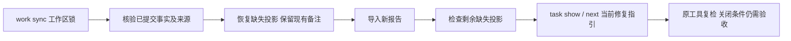


## 独立源码任务的下一步

当next原优先项是等待执行者或预算耗尽的源码问题，且没有前置blocker，CLI会检查是否另有不同物理源码范围的可修复/待复检finding。证明独立后推荐该项，同时在next_actions及human输出保留延后任务的只读task show入口。原问题、预算、租约和门禁保持不变。重叠、别名、范围未知、坏事实或失败报告不被绕过；完整跨模块依赖图仍未完成，非Unix保留原选择。详见[实际验收及完整报告示例](../tests/acceptance/next-independent-source-work.md)。

### Swift 限定语法任务闭环（开发源码）

受保护宿主可调用 `verify_swift_task_resolution`，以 Apple Swift 6.4 对照首次反例与当前源码。策略 1.2.0、脱敏证据 0.3.0 与 Zig/Erlang 分版本；原生首次任务的 grammar 保持 null。原反例确有 parse 诊断、当前源码改变且同工具完整无诊断时追加 `code_fixed`，重复验证幂等；普通 `task verify --swift-tool` 检出同工具复发时重开同一父链。原反例合法转误报调查，工具异常或身份变化不关闭。签名和信任根由独立宿主提供，项目记录不提供关闭权威。此接口尚未接入默认插件或公开发行，不代替 SwiftLint、类型检查、项目构建和完整交付验收。详见[闭环验收](../tests/acceptance/swift-task-resolution-lifecycle.md)。

### Kotlin 限定语法关闭与上下文分流（开发源码）

`verify_kotlin_task_resolution` 复用共享宿主 SDK，以 kotlinc-jvm 2.4.10 对照原反例及当前源码；策略 1.3.0 / 证据 0.4.0 独立于其它语言，原生首次 grammar=null。原反例的 UTF-16 与 UTF-8 字节坐标须同时有效，源码已改变且原工具完整零诊断才追加 `code_fixed`。仅上下文诊断保留待验证；混合上下文未完成和已确认语法诊断时，保留原问题并支持普通 `task verify --kotlinc-tool` 重开同一父链，不因 `incomplete` 丢弃正向发现。签名来源由宿主独立固定；当前只绑定 launcher，不证明完整 JAR/JDK/项目构建身份。默认插件可信关闭、完整 lint/类型及发行仍未完成。详见[验收](../tests/acceptance/kotlin-task-resolution-lifecycle.md)。


2026-10-05 开发源码 Zig 原生路由：`check all`、`check zig` 与限定编辑文件现在复用冻结的 Zig 0.16.0 AST 探针。显式/PATH 选择后优先原生；选定工具失败保留未完成观察，不改用 WASM 绕过。缺工具时保留候选回退。源码或工具入口变化撤回旧位置；共同截止时间内最多观察64文件，其余范围明确保留。新增 check 0.46 / 中止反馈0.15 / Hook 0.14 独立协议，无 Zig 的报告沿用历史版本。Claude 摘要包含有界原生规则、位置和原工具复检指令。Zig 原生首次任务现按下节接线，报告仅提供实际同步的任务ID，AST零诊断不关闭历史任务，也不证明完整lint/build。公开npm0.1.4和插件锁未更新。

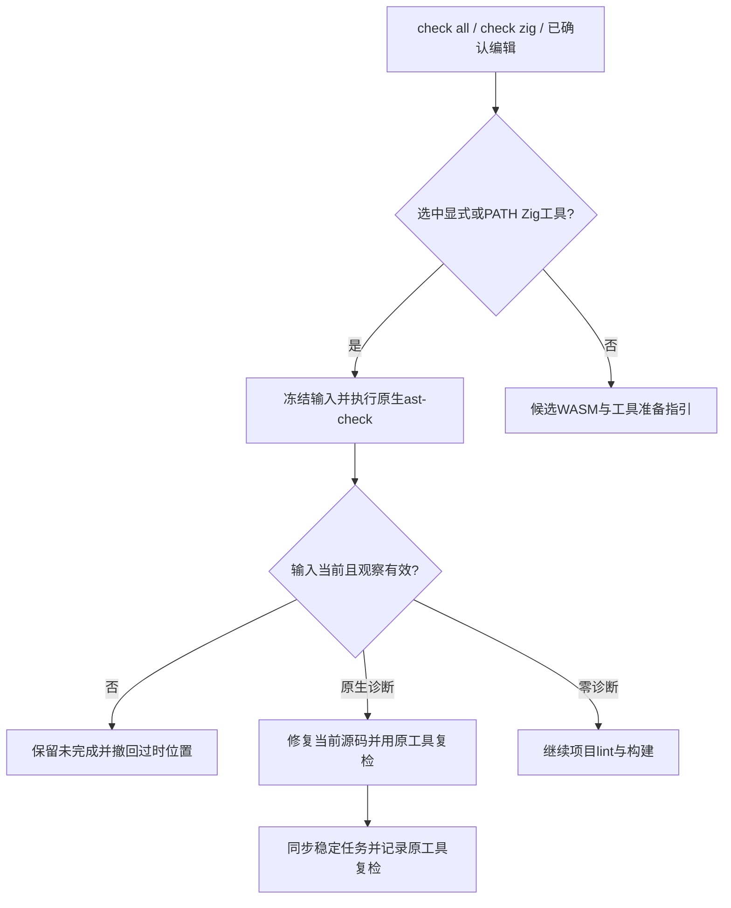

### Zig 首次原生任务接线（开发源码）

初始化工作区中，`check zig`、`check all`、`lint zig` 和编辑 Hook 按工作区/源码范围同步同一稳定任务。新文件完整零诊断不创建修复任务；已有任务零诊断记录 `candidate_absent_unverified_policy`，保持 open。`next`、`task show` 提供有界原生位置与原工具复检参数；`task verify TASK_ID . [--zig-tool ABS_PATH] --format=json` 和 repair_ready 记录复检事件。原生首次事实的 grammar 身份为 null，原生诊断不要求修改 grammar。

新协议：原生事实0.6、绑定扫描0.2、聚合0.47、单文件0.3、简报0.12、查看0.2、复检内层0.8/外层0.19、编辑Hook0.16、复检Hook0.15。旧 schema 不改写。实际 Zig 0.16.0 已验证错误与修复后输入；原生首次 Zig 可信关闭见下节；默认安装宿主、完整 lint/build 和发行仍未完成。公开 npm 0.1.4 未更新。见[验收](../tests/acceptance/zig-native-first-workbench.md)。

### Zig 原生首次可信关闭（开发源码 SDK）

受保护宿主可通过 `verify_zig_task_resolution` 使用独立签名策略1.4.0，核验原生首次事实0.6.0。grammar 必须为 null；旧 WASM 来源策略1.0.0不扩权。首次原工具确有诊断、源码已改变且同一工具完整零诊断时，追加限定 `code_fixed`，证据0.5.0。重复验证幂等；普通 `task verify --zig-tool` 的同工具正向复检重开同一父链。原反例合法进入误报调查，异常输出、越界位置、工具变化和缺可信上下文不关闭。签名信任根由宿主独立提供，默认插件与公开 npm 尚未接入该提供者；不能凭本地任务文件批准交付。见[验收](../tests/acceptance/zig-native-first-resolution.md)。

## 显式原生差分开发回放

新增 Rust 示例 `evaluate_native_grammars`：从同一32语言固定语料选择已显式提供 Zig0.16.0、OTP28、Apple Swift6.4 与 kotlinc-jvm2.4.10 的样本，逐例复用原生适配器和既有WASM worker。库存仍保留32语言；未选工具、无适配器、原生未完成及WASM隐藏恢复不被补成通过。只在双方语法可判定时统计TP/FP/FN/TN；Kotlin混合上下文阻塞保留已定位语法正向证据，但执行仍未完成。工具/入口或程序变化撤回对应分类。回放固定 incomplete/资格0，不创建任务或批准白名单。原生适配器复用、回归语料和入口制品摘要不证明独立holdout或完整工具链身份。使用方式和实际证据见[原生差分验收](../tests/acceptance/native-grammar-differential.md)。


### Python 隔离原生语法对照

开发差分新增显式 Ruff0.16.8 / Python3.12 观察，固定 stdin、`--isolated --select E9 --ignore-noqa --no-cache`，不读取项目配置或执行用户源码。只消费合法定位的 `invalid-syntax`；普通 F401、坏路径/位置、版本变化或矛盾报告不判源码语法失败。新增0.2报告，0.1历史字节保持不变；扩展开发工具选择不扩大可信任务关闭权限。18例实际对照发现缺少函数体、错误缩进2个WASM漏检，仍为未验收候选；见[Python原生差分验收](../tests/acceptance/python-native-grammar-differential.md)。

Python 开发差分 0.3 将原始 grammar 与“解析恢复 + 独立结构规则”候选分开测量：原有 `comparison` 和 TP/FP/FN/TN 保留，新增规则身份与原始坐标、`combined_candidate_comparison` 及独立分母。截断、取消和程序变化不产生清洁候选，原生身份变化撤回两层比较；候选仍要求原生确认，历史 0.1/0.2 报告不改写，资格和交付权威不扩大。见[分层验收](../tests/acceptance/native-structure-differential.md)。

JavaScript 开发差分新增固定 Node 24.18.0 的隔离 `--check --input-type=module` 观察：清空环境、冻结 stdin、共享截止时间，调用前后核对制品及请求入口。0.4 报告明确 module 目标，只保留核对源码的行号；未知输出或工具变化保持未完成，不推断项目 CommonJS/ESM，也不代替 ESLint。Node 独立 128 MiB 制品预算不扩大其它工具的 64 MiB 上限。见[JavaScript 原生验收](../tests/acceptance/javascript-isolated-native-differential.md)。 实际18样本保留5TP/0FP/2FN/11TN：模块顶层return及重复绑定仍为漏检，资格保持0/32。


### 空语句块事实扫描（接线未完成）

Rust runtime新增 `scan_wasm_empty_blocks`，全树观察无非comment命名语句的block，保留父节点类型、字节位置和预算耗尽。它与原始ERROR/MISSING分开，不签发语言违规；合法Rust空函数也会产生事实。固定Python required_suite候选规则现已接入私有worker、显式探针及单文件lint/work sync稳定确认任务，原始恢复和结构观察使用独立版本化字段；聚合check现通过0.48反馈与通用0.7确认报告保留同一结构证据和任务身份；可信原生关闭仍缺，Python原始grammar两项漏检仍保留。详见[结构任务接线](../tests/acceptance/python-structure-lint-task.md)。见[结构事实验收](../tests/acceptance/wasm-empty-block-facts.md)。

聚合结构证据接线见[验收记录](../tests/acceptance/check-python-structure.md)，不能据此声明grammar质量认证或完整交付门禁完成。

Python隔离原生探针现于版本探测后、检查前核验请求入口与冻结字节，入口变化不启动第二次调用；检查后继续核验。实际三输入与替换/重定向反例见[原生入口连续性验收](../tests/acceptance/python-native-tool-continuity.md)。Python可信关闭仍缺稳定任务身份、首次报告与批准目标版本接线，不把开发py312探针视为项目通过。

Python候选确认任务现按首次单文件范围复用项目Ruff配置和原生执行链。反馈0.18与任务预览0.20绑定已消费首次报告及当前源码，不授予项目覆盖或可信关闭。首次收据缺失或篡改时拒绝执行。见[局部验收](../tests/acceptance/python-confirmation-scoped-recheck.md)。


### Python原生语法修复反馈（0.19 / 0.21）

Ruff正常与忽略noqa的两轮结果中一致的`invalid-syntax`现在保留为原生语法错误，不误判为抑制审计工具故障。末尾空行上的原生错误可用前一非空源码生成稳定任务身份，原生行列保持不变。单文件确认反馈0.19、任务预览0.21将语法错误仍存在区分为`still_present`，向智能体提供源码修复步骤；完整复检无语法错误仅为`candidate_absent_unverified_policy`，不自动关闭。历史0.18报告保留原事件语义，源码或配置变化撤回本轮判断。验收见[原生语法反馈](../tests/acceptance/python-native-syntax-audit.md)。


### Python关闭前置的原样本与目标版本

宿主只读接口`validate_python_task_original_source(root, task_id, source)`核对两类首次报告、消费收据、冻结字节和原始/结构位置；当前文件已修复时仍接受原字节，拒绝以当前字节替代。隔离语法探针可接收明确Python目标，非法目标在工具解析前拒绝；开发差分固定py312入口保持不变。这些是关闭前置，不构成签名批准、项目目标来源或可信关闭。见[验收](../tests/acceptance/python-resolution-prerequisites.md)。


### Ruff原生lint目标观察

`RuffSettingsObservation::explicit_python_target()`仅返回固定Ruff原生设置中的明确lint目标。设置必须具有唯一`linter.unresolved_target_version`和空`linter.per_file_target_version`；隐式none、缺失/重复、未知版本与尚未解析的逐文件目标返回具体原因。formatter/analyze目标不作替代。该内部观察与同轮工具、源码、配置核对链共用，不增加旧公开设置字段，也不批准关闭。见[验收](../tests/acceptance/python-native-target-settings.md)。


### 限定任务的共享事件提交

原生语法服务已拆分复检与`commit_resolution`事件提交。提交前核对领域证据与脱敏原生对照的身份、原/当前源码、工具、适配器、grammar/批准策略及原生对照摘要，拒绝不一致的拼接。各语言入口仍负责验签和实际复检；共同提交逻辑保留幂等、策略变化核对、父链冲突和复发重开，不提供项目门禁。此拆分供Python后续接入，尚不表示Python可信关闭已实现。见[验收](../tests/acceptance/task-resolution-commit-boundary.md)。


### Python限定原生语法任务关闭（策略1.5 / 证据0.6）

宿主SDK `verify_python_task_resolution` 接收独立信任根和签名策略，绑定Python任务、已消费首次报告、原样本、grammar、Ruff制品、适配器、明确lint目标及项目配置摘要。Rust调用原生Ruff，以绑定配置和目标对照原始stdin与当前单文件；当前文件复用正常/忽略noqa扫描及同轮设置观察。原样本存在语法诊断、当前已修改且完整无语法诊断、输入和批准身份仍稳定时，才记录限定关闭。原样本原生合法则记录误报调查；缺工具、未解析目标、配置变化或运行不完整均不能关闭。策略不支持以隐式默认或formatter目标代替lint目标。

两类Python首次WASM报告共用稳定任务与追加父链。新证据使用独立封闭0.6协议，不修改历史版本；重复验证幂等，复发重开保留关闭历史。普通复检只可重开，不凭历史策略批准新关闭。SDK测试中的独立签名夹具不证明生产宿主信任根已接入，限定关闭不代表项目门禁通过，也不授予grammar发布资格。局部验证记录见[Python任务关闭验收](../tests/acceptance/python-task-resolution-lifecycle.md)。


Python3.14模板字符串提供真实原生反证：固定Python WASM仍产生ERROR，Ruff在明确py314下接受同字节，py313下仍报告语法错误。限定SDK记录误报调查后，next现读取同一Python确认任务的生命周期，要求核对grammar版本与原生差异，保留合法源码；源码或配置已变化时，当前输入失效提示优先于历史反证。不会自动白名单或关闭，也不修改旧语料统计。见[实际反证验收](../tests/acceptance/python-template-string-counterevidence.md)。


### 语法确认动作与无进展预算

Python 语法确认任务的当前原生观察为 `still_present` 且未因源码或配置变化失效时，受控动作是 `repair-source`；缺工具、未完成或失效观察不能据旧位置要求修改源码。同一语法确认任务、同一前置输入下，`restore-checker-environment` 与 `repair-source` 共享既有无进展预算，动作切换不能清空历史失败。旧追加事件保留原动作与指纹；其他任务仍按既有动作规则计数，新输入与已核验进展按既有规则处理。预算耗尽仍要求具体诊断或决策，不自动关闭、不降低门禁。


### TypeScript 模块源码的统一范围

`detect`、`check all` / `check typescript` 和 `file_changed` Hook 现在将 `.mts/.cts` 及 `.d.mts/.d.cts` 纳入既有 TypeScript 范围，使用同一固定 TypeScript grammar，不误用 TSX。同文件已有完整原生 ESLint 观察时仍原生优先；其他构建根缺上下文的文件独立执行候选初检。重复疑似更新同一确认任务，合法声明不创建新语法阻塞；编辑 Hook 仅检查确认写入的文件。后缀识别不证明模块解析、类型检查、grammar 资格或交付通过。见[模块后缀验收](../tests/acceptance/typescript-module-extension-routing.md)。


### R 与 C++ 显式源码后缀

项目发现及 WASM 候选路由支持 `.R`/`.r`，以及 C++ 的 `.C`/`.cp`/`.CPP`/`.c++`/`.cxx`/`.hxx`，保留既有后缀。大小写保持原义，`.C` 不会按 C 解析；共享 `.h` 仍不能仅凭后缀取得 C++ grammar 路由。原生工具缺失时提供实际候选观察，整体保留 `incomplete`，不据此宣称语法资格或交付通过。见[后缀验收](../tests/acceptance/r-cpp-extension-routing.md)。


### 固定限制的对话投影

候选报告、独立结构规则与原生诊断分别保留来源。终端有界展示具体 grammar 限制；Claude 按本轮候选语言从随程序固定清单读取提示，归并语言并限长，不信任外部报告文本或源码。摘要预留未验收/交付未评估说明，已知兼容问题仍须原生确认，不自动扩大白名单。见[反馈验收](../tests/acceptance/grammar-limitation-conversation-feedback.md)。
### Go完整文件独立结构候选

源码版用runtime的语言无关根节点子节点事实，加上adapter中的Go整文件规则，补充grammar允许片段的宽松解析。规则有版本、明确whole_file范围且未获资格验收；原始恢复统计独立保留。候选不授予源码违规、猜测包名或关闭任务的权威。

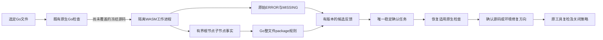

probe、聚合检查和保存反馈已携带该候选；Go确认任务已接入显式SDK原生复检及受签名策略限定的SDK关闭；默认宿主可信上下文仍待完成。修复指引要求原生确认前保留源码，零候选复扫继续保留任务。见[验收](../tests/acceptance/go-package-structure.md)。

Go候选任务复检现接受 `--go-tool /absolute/sdk/bin/go`，对冻结整文件字节调用固定SDK同目录 `gofmt -e /dev/stdin`。复检0.9/任务反馈0.22保留原生诊断、主/辅助制品身份、首次报告收据和失败尝试；修复后当前源码不会使原候选历史被误判损坏。局部零诊断继续保留open任务，等待批准政策与覆盖。见[验收](../tests/acceptance/go-package-structure.md)。

### Go统一lint的原生优先与缺工具初检

源码版 `codeguard lint go . --format json` 优先显式 `--go-tool`，否则查找调用方绝对PATH中的Go。工具已选择但版本/执行失败时保留原生故障；真正缺工具时，内置WASM做有界整文件初检，保留恢复和独立结构候选。候选或初检未完成要求准备项目适用原生工具；完整有界范围的零候选只推荐准备，原生义务仍未完成，退出码继续3。默认不含WASM的构建明确报告能力缺失。重复lint与check复用确认任务，补声明不自动关闭。公开npm0.1.4未更新。见[局部验收](../tests/acceptance/go-lint-fallback.md)。

```mermaid
flowchart LR
  A[lint go] --> B{Explicit or absolute PATH Go}
  B -->|Selected| C[Native go vet]
  C --> D[Preserve native report and failures]
  B -->|Absent| E[Bounded whole-file WASM candidates]
  E --> F{Candidates or incomplete scope}
  F -->|Yes| G[Require native preparation and confirmation]
  F -->|No| H[Recommend native preparation]
  G --> I[Stable task and native task verify]
  H --> J[Native obligations remain incomplete]
  I --> J
```


### Go受保护宿主的限定任务关闭

Unix SDK提供 `verify_go_task_resolution(&GoTaskResolutionRequest)`，以独立签名的[策略1.6.0](../schemas/task-resolution-policy-v1.6.schema.json)同时绑定Go1.23.4、同SDK gofmt及其规范路径联合摘要。原反例有诊断、当前源码无诊断且输入稳定才关闭同一任务；普通原工具复检发现复发会重开。辅助工具变化、原生反证、缺失/篡改历史不能关闭；[证据0.7.0](../schemas/task-resolution-evidence-v0.7.schema.json)不签发项目许可。真实Go链路已局部验证，批准密钥仍为测试夹具，默认宿主集成尚未完成。见[验收](../tests/acceptance/go-task-resolution-lifecycle.md)。


### 当前源码的只读帮助支持目录

`codeguard help --format json`查询C01–C36与额外公开入口；`codeguard help task verify --format json`按精确命令前缀查询。返回`command_help`0.3，以implemented/partial/planned/unavailable_build与executable区分当前入口状态；后者不代表检查或安装已完成。默认构建的grammar probe不可用，WASM构建仍是未验收候选；独立MCP服务等未实现操作明确标planned。

```bash
codeguard help --format json
codeguard help lint --format json
codeguard task verify --help
```

帮助不读取项目、不启动工具，成功退出0仅表示查询完成，delivery_decision仍not_evaluated。精确前缀末尾帮助已接入；带语言、路径和任意工具参数的完整上下文帮助以及完整参数生成仍未完成。见[真实报告与验收](../tests/acceptance/command-help-current-support.md)。公开npm0.1.4未包含此源码增量。


### Rust 独立 lint 原生优先入口

当前源码支持 `codeguard lint rust . --cargo-tool /absolute/cargo --format json`。使用原生 Clippy 的锁定离线 all-targets 局部观察，复用聚合检查的输入核对和工作台同步，只执行 lint。初始化后同一 finding 保留同一任务，反馈含下一步，使用 `codeguard task verify TASK_ID . --cargo-tool /absolute/cargo --format json` 原工具复检；零诊断仍需规则/政策核验，不自动关闭任务。

未显式选择 Cargo 且绝对 PATH 找不到可执行入口时，WASM 构建提供有界候选初检。发现候选或检查不完整要求准备原生工具；完整有界范围零候选推荐准备原生工具。显式错误/原生失败不回退、不自动安装。JSON 使用 `rust_lint_feedback` 0.1，交付始终未评估；帮助协议0.2新增Rust，历史0.1保持原件。源码接入不表示公开npm包已包含新入口或Rust完整语言验收完成。

## Ruby 单文件原生语法与任务复检

源码构建新增 `codeguard lint ruby FILE.rb --ruby-tool /absolute/path/to/ruby --format=json`。仅确认 Ruby 2.6.10p210 的 `ruby -c`，关闭 gems，使用冻结 UTF-8 stdin；不会运行用户源码。显式工具缺失、版本不匹配或执行失败不切换到 WASM。没有可选择的原生工具时，WASM 构建提供候选初检；候选/初检不完整要求准备工具，零候选推荐准备工具。报告 `ruby_lint_feedback`0.1 只保留原生行号，不猜测列号；项目 Ruby 版本兼容性未确认，RuboCop、注释、安全及完整项目检查仍须完成。help0.3 增加 Ruby，历史 help0.1/0.2 协议不修改。初始化工作区中，WASM 候选与原生观察复用一张稳定确认任务。`next`保留原生行位置和已核验`--ruby-tool`参数；`task verify`记录尝试，零诊断仍保留开放状态，等待策略/覆盖复核。反馈0.3、原生历史0.9、复检0.10、任务预览0.23与简报0.15保留旧协议。`codeguard check ruby ROOT --ruby-tool /absolute/path/to/ruby --format=json`及`check all`现已复用有界原生语法扫描和稳定任务连接器；选定工具失败不切到WASM。共享截止时间及64文件上限保留未观察范围；源码/工具身份变化撤回旧位置。聚合反馈0.51包含Ruby扫描0.1/0.2与简报0.15，不修改旧schema。完整RuboCop/项目lint和可信关闭仍待完成，不属于公开npm0.1.4的能力。


Ruby 编辑快检接线：源码构建的 `hook execute` / `hook claude post-tool-use` 可选择 `--ruby-tool ABS_PATH` 或调用方绝对 PATH 的 Ruby。只检查确认编辑的文件，共用事件截止时间；选定工具失败不回退，缺工具保留 WASM 候选。原生行号与稳定任务进入有界对话，不回显源码/工具消息或猜列号；先核对项目 Ruby 版本适用性。`repair_ready` 用同一工具复检并保存真实证据引用，零诊断仍不关闭任务。编辑反馈 0.19（内层 0.10）、复检反馈 0.20（内层 0.6）新增封闭 schema，旧协议不改。实际宿主自动触发、完整 RuboCop 与公开 npm 版本尚未验收。

Ruby 版本声明约束：源码构建在原生解析前有界读取源码祖先至项目根最近的 `.ruby-version`（最多 64 层、4096 字节），只接受 `2.6.10`、`2.6.10p210` 及对应 `ruby-` 前缀。其它明确版本返回 `ruby_project_version_mismatch`，别名/歧义返回 `ruby_project_version_unresolved`，链接或读取失败返回 `ruby_project_version_unreadable`；均不启动旧 Ruby，也不回退 WASM。解析前后复核声明字节及更近目录的缺项，变化撤回诊断；已保存诊断遇到不适用的新声明也会撤回。单文件入口优先定位 `.codeguard` 工作区、再定位 Git 根和 Gemfile，模块 Gemfile 不能遮蔽工作区版本，模块自身最近版本声明仍优先。无声明继续提供未批准的初步观察；Gemfile 运行时约束、JRuby/RVM、完整项目版本识别及发行仍待实现。见[版本约束验收](../tests/acceptance/ruby-project-version.md)。

Ruby 六类别候选档案已独立固化运行时方言、项目锁版本策略和条件性工具范围；原生规则、完整项目和平台资格仍待验收。见[档案验收](../tests/acceptance/ruby-candidate-baseline.md)。

## ShellCheck 原生单文件检查（局部能力）

`codeguard lint shell app.sh --dialect bash --shellcheck-tool /absolute/shellcheck --timeout 30s --format json` 通过 Rust 调用 ShellCheck 0.11.0 的 `json1`，保留 SC 原规则、严重性和范围。支持显式 sh/bash/dash/ksh/busybox；zsh/fish 的声明、shebang 或已知文件名保持能力缺口，不强行按 bash 检查。工具缺失提供准备建议；没有 Shell WASM 资产时明确初检不可用，不伪造兜底。

显式 `--shellcheck-config /absolute/.shellcheckrc` 或源码祖先最近的 rc 作为配置输入（自动搜索最多64层）。不读取 HOME/XDG 全局配置；未发现项目 rc 与原生内置规则执行状态分别报告。配置冻结到本轮私有目录，源码通过 stdin 输入，原始源码/工具入口字节/配置及较近目录缺项在调用前后核对。拒绝链接 rc、坏编码和开启 external-sources 的配置，不执行受检脚本、不自动应用 fix；全平台隔离和工具依赖闭包仍待验收。

SC1071/1090/1091/1092/1134/1144/1145 分类为环境或依赖阻塞；可同时保留 SC2086 等局部发现。`json1` 的列按 Unicode 标量计数，tab 算一个字符；不能沿用旧 json 的 tab 展开列。非法或部分报告不能获得完整状态。原生日志自由文本与替换内容不进入修复指引。

未初始化工作台时，0.1.0 `shell_lint_feedback` 提供七要素修复简报、原工具复检 argv 和官方规则链接。`task_workflow_status=not_integrated`、空尝试历史明确尚未接入持久任务；未完成输入只提供调查指引，不给源码修改范围。即使原生零诊断，整体仍为 incomplete/退出3、delivery_decision=not_evaluated；项目全范围、Dockerfile/IaC、安全、可信白名单与任务关闭不得由单文件结果替代。参见 [局部验收](../tests/acceptance/shellcheck-native-baseline.md)。

## Shell 原生规则组与修复工作台

在已初始化 `.codeguard` 的工作区，单文件 `lint shell` 现在保存独立的0.1.0 `shellcheck_workbench_observation`，复用工作台的报告消费、事实、追加事件及Markdown任务机制。反馈升级0.2.0并返回实际同步状态和稳定任务ID；未初始化仍保留0.1.0局部反馈，不自动初始化。持久化或导入失败明确incomplete，不删除原生结果，不伪造任务ID。

稳定单位为“工作区内文件、显式方言、原生SC规则”位置组，同一组内全部原生位置保留在报告；不把相同规则的不同文件或不同方言混成一个任务，也不声称多个位置是同一个语义缺陷。位置移动或新增同规则位置不另建组；缺工具、错误方言、坏rc及source依赖阻塞共享同文件同方言的环境恢复任务，具体原因保存在各次原报告。过期输入只进入历史/环境调查，不按旧位置新建可修源码问题。

`next` 为Shell提供0.17.0指引，`task show` 为0.3.0，两者推荐绑定任务ID及绝对工作区的task verify，保留Shell工具参数；原方言/显式rc由首次报告绑定，工具入口仍需重新核验。源码或原rc变化会撤回直接修改指引，先要求原生复扫；配置抑制、同步成功或零诊断不关闭已有任务。Shell专用 `task verify CG-… . --shellcheck-tool /absolute/shellcheck --format json` 已接入0.24.0局部复检、既有租约和失败尝试历史，绑定首次方言、原显式rc及SC规则组。原规则仍存在为still_present；配置改变后零诊断为rule_coverage_requires_review；疑似disable注释为suppression_requires_review；修复后零诊断为candidate_absent_unverified_policy。注释观察不证明实际抑制。受信任关闭、复发和项目全范围尚未验收，7.4继续开放。任务勾选或删除Markdown不能消除事实。

Shell失败尝试可通过 `task claim → task attempt start → task attempt finish --outcome ready-to-verify → task verify` 记录，复检事件绑定attempt ID。相同输入/动作两次仍有原SC规则时，next为needs_decision，第三次相同动作被拒绝；不会删除问题或自动批准白名单。历史Markdown保留原字节，task show/next提供当前指引。真实原工具记录见 [Shell指引验收](../tests/acceptance/shellcheck-task-recheck-baseline.md)。

```mermaid
flowchart LR
    A[原生发现与稳定任务] --> B[next或task show]
    B --> C[claim与attempt start]
    C --> D[修复并finish ready-to-verify]
    D --> E[绑定原任务的task verify]
    E -->|原规则仍存在| F[绑定尝试的失败事件]
    F -->|仍有预算| B
    F -->|两次同动作无进展| G[needs_decision并拒绝第三次]
    E -->|候选消失| H[等待可信政策和覆盖核验]
```

## Shell 项目发现范围的原生检查

`codeguard check shell . --shellcheck-tool /absolute/shellcheck --format json` 和 `check all` 现在对静态发现的Shell文件逐项调用ShellCheck0.11.0，共享总deadline。0.52.0反馈的 `native_results.shell_lint` 为0.1.0 `shell_native_scan`，保存每个文件的源码摘要、方言、原rc、SC规则/Unicode标量位置、输入稳定性及工作台状态。human显示原规则位置；SARIF只投影当前观察，位置和原生消息仍留私有证据。

方言优先来自shebang及明确扩展名；无声明的文件可显式提供 `--shell-dialect bash` 作为默认值，不能覆盖已有zsh/fish声明。未知或不适用方言保持未完成，next提出具体方言/检查器决策，不重复安装不适用工具。每次最多64文件，超限显示unobserved_count；local_check_complete仅说明这批冻结单文件原生观察完成，不能证明项目source依赖、所有检查族或可信覆盖。

已初始化时绑定请求项目根，子工作台不改变归属；未初始化不创建目录。相同文件/方言/SC规则更新原任务；环境和配置故障保留阻塞。源码、范围、工具或rc变化撤回当前定位权限。Shell没有WASM资产时不伪造初检。check shell仍退出3/not_evaluated，check all仍为incomplete；安全、CVE、source依赖、可信关闭/复发、zsh/fish专用能力、Dockerfile/IaC和跨平台验收继续开放。

```mermaid
flowchart LR
    A[静态发现Shell文件] --> B[逐文件方言与rc]
    B --> C[原生ShellCheck与共享deadline]
    C --> D[复核源码 范围 配置 工具]
    D --> E[绑定请求根的稳定任务]
    E --> F[next与task verify]
    C --> G[逐文件诊断和环境阻塞]
    G --> H[human JSON SARIF局部反馈]
```

证据见 [项目Shell验收](../tests/acceptance/shellcheck-project-baseline.md)。

### Shell 编辑与修复事件

Rust `hook execute` 和 Claude 格式适配器现在把已确认的 Shell 编辑路由到同一 ShellCheck 逐文件路径，接受 `--shellcheck-tool /absolute/path`；仅检查事件选择的文件，共享事件超时，不运行完整项目构建。任务 ID 与 `lint shell` / `check shell` 保持一致，未初始化工作区不自动创建任务。

```mermaid
flowchart LR
    A[确认 Shell 编辑] --> B[选中文件及实际方言]
    B --> C[原生 ShellCheck 与当前输入复核]
    C --> D[更新同一任务及脱敏对话摘要]
    D --> E[智能体修复]
    E --> F[repair_ready 绑定任务]
    F --> G[原规则 task verify]
    G --> H[记录观察 仍须核验关闭条件]
```

编辑反馈外层协议0.21、内层0.11，旧协议保留。对话仅显示当前 SC 规则、Unicode 标量位置、实际已同步任务 ID 及复检命令，排除源码和原生自由文本。缺工具、不支持方言、工具失败和工作台保存失败保持未完成；当前不存在 Shell 内置 WASM，不虚构兜底。失败写入不检查；`repair_ready` 复用既有任务复检，零诊断不关闭问题。

[验收记录](../tests/acceptance/shellcheck-hook-baseline.md)区分真实 ShellCheck 报告、受控工具测试、npm 离线安装及实际宿主会话。Claude 形状重放通过不代表真实已安装宿主或完整项目门禁已验收。

CFQuery的SQL语法对照必须绑定数据库方言：PostgreSQL可接受空SELECT列表，却拒绝DISTINCT空列表。当前隔离原生验证揭示固定WASM对两者均零恢复，不能将无方言样例升级为已确认错误。详见[方言证据](CFQuery-SQL-Dialect-Evidence.zh_CN.md)；项目SQL原生适配与grammar修复仍开放。

失败写入的通用分流进一步允许已登记的 Go/Cargo/Maven 等检查器配置参数，直接返回 `not_run/write_failed`，不启动工具或创建工作台；租约/所有权、未知或格式错误参数仍拒绝。此例外仅用于失败写入，不将未接线工具静默启用于确认编辑。见[验收](../tests/acceptance/hook-failed-write-options.md)。

## Go 编辑原生语法快检（局部验收）

`hook execute . --go-tool /绝对路径/go --timeout 30s --format=json` 对确认编辑中的选中文件优先调用固定 Go1.23.4 SDK 的同目录 gofmt；入口、辅助工具和源码字节分别复核，不运行源码、依赖安装或项目级 go vet。缺工具保留 WASM 候选；选定工具失败、辅助工具缺失、未知版本及 `//line` 位置重映射保持未完成，不静默切换检查器。当前仅固定 SDK 语法观察，项目语言版本与全部构建条件尚未验收。

```mermaid
flowchart LR
    E[确认 Go 文件编辑] --> S{SDK 已选择?}
    S -->|是| G[同 SDK gofmt 检查冻结 stdin]
    G -->|诊断| T[更新同一稳定语法任务]
    G -->|失败| B[保留环境阻塞与具体诊断需求]
    S -->|否| W[内置 WASM 初检]
    W -->|疑似异常或未完成| R[要求原生确认]
    W -->|完整零恢复| I[推荐准备原生 lint]
    T --> V[task verify --go-tool 原 SDK]
    V --> O[记录尝试与证据，保持未批准任务开放]
```

编辑外层协议0.22/内层0.12、新原生首次观察0.10；历史版本保留。原生诊断与候选沿用相同工作区/路径/语言任务身份；Claude格式仅显示当前Go规则、UTF-8字节位置及实际任务复检指引，排除源码/自由文本。原 SDK 复检零诊断不等于可信关闭，仍须go vet、类型、依赖、安全及完整项目检查。证据见[Go Hook验收](../tests/acceptance/go-native-hook.md)。

Go首次原生观察的任务指引使用 `repair_brief_preview` 0.18和 `syntax-confirm-` 引用；实际任务复检继续使用0.14和 `syntax-native-` 引用，历史schema保持不变。最终受影响回归：WASM 78通过/5条件忽略，默认15通过/0忽略。此前1461通过的默认全量结果早于这次末尾协议修正。

Go固定1.23.4语法SDK现于编辑及原工具任务复检前静态检查最近 `go.mod` 和最近 `go.work`。最低版本或建议工具链超出支持范围、声明歧义或不可读时返回环境观察，不运行不适用SDK、不降级WASM；运行期间变化撤回诊断，当前声明不适用时撤回旧修复位置。该边界不代表通用工具链选择或语言版本验收。证据：[Go项目版本](../tests/acceptance/go-project-version.md)。

### CFQuery 静态 DISTINCT 投影候选

固定 CFQuery grammar 能识别 SQL token，不能完整验证 SQL 子句。Codeguard 对直接相邻的 AST 关键词 `SELECT DISTINCT FROM` 增加独立候选，原始 ERROR/MISSING 保持不变。字符串、引号标识符和 CFML 插值会打断匹配；注释可跳过。该规则不标记 `SELECT FROM users`，因为 PostgreSQL 允许未使用 DISTINCT 的空投影。

```mermaid
flowchart LR
    A[CFQuery SQL fragment] --> B[Fixed WASM AST]
    B --> C[Raw ERROR / MISSING]
    B --> D[Adjacent SELECT DISTINCT FROM keywords]
    D --> E[Independent unqualified candidate]
    E --> F[Whole-file identity + fragment identity + file positions]
    F --> G[One stable confirmation task]
    G --> H[Resolve datasource, dialect, version and template context]
    H --> I[Applicable native SQL confirmation required]
```

worker 使用1.3、显式probe 0.4、项目反馈0.53、编辑反馈0.23/0.13、持久候选0.11；历史schema及grammar资产不改。嵌入观察同时记录完整文件 `source_sha256` 和独立 `fragment_source_sha256`，坐标还原到文件。重复扫描复用同一任务；候选消失不关闭任务。`next` 明确要求确认datasource、数据库方言/版本、动态模板和schema上下文：CFQuery原生task verify adapter仍未接入，不自动连接项目数据库。

```bash
codeguard grammar probe cfquery query.sql --format=json
codeguard check all . --format=json
codeguard next . --format=json
```

报告示例（字段节选，不是完整schema）：

```json
{"language":"cfquery","recoveries":[],"structural_observations":[{"basis":"codeguard_structure_rule","rule_id":"codeguard.cfquery.distinct_projection","rule_version":"1.0.0","parent_syntax_kind":"program"}],"grammar_qualified":false,"status":"incomplete","delivery_decision":"not_evaluated","next_action":"confirm_candidate_structure_with_applicable_native_tool"}
```

本轮只在候选层纠正一个固定原生反例，不代表grammar取得资格、独立holdout精度、全部SQL方言、SQL注入安全或原生adapter/发行验收完成。证据：[CFQuery候选验收](../tests/acceptance/cfquery-structure.md)。


### Rustfmt 原生解析对照（开发期）

Rust 开发重放现支持显式选择 Rustfmt1.9.0-stable：冻结 stdin、私有 edition2024 配置、空环境、共同预算，并复核入口、制品和配置。合法但未格式化的源码不算语法违规，不使用 `--check`；只保留有界 stdin 原生定位，兼容实测 EOF 和 E0765/退出101，崩溃及无定位输出保持未完成。固定 edition 不推断项目版本，不覆盖外部模块，不替代 Clippy/构建，不关闭任务；Rust 编辑 Hook 接线仍待实现。实际16例对照为5TP/11TN/0FP/0FN/0unknown，仅限小规模非独立holdout语料，语言资格仍0/32。执行路径、协议与复现命令见[局部验收](../tests/acceptance/rustfmt-controlled-native-differential.md)。


Rust选中文件解析前置现从有界包/工作区声明确定Cargo edition，并在原生调用之间复核声明与源码连续性。Unix库服务已保留真实2015/2021/2024反例；选中文件编辑Hook、稳定确认任务与原工具复检已连接；完整项目与实际宿主验收仍开放。见[项目edition契约](Rust-Project-Edition-Syntax.zh_CN.md)。

Rust编辑反馈现保留安全行号、稳定任务与原Rustfmt复检指引，Clippy/类型/构建义务继续保留。见[局部链路验收](../tests/acceptance/rust-native-hook.md)。

Rust编辑后现提供可执行的批次后Clippy指令，明确编辑阶段未运行项目lint。原任务repair_ready保留当前规则/行号并撤回输入变化后的指引；这不是后台队列或可信关闭。见[项目lint后续流程](Rust-Project-Lint-Followup.zh_CN.md)。

Rust 原生首次与 WASM 首次语法任务均可通过同一受保护宿主 SDK 确认、限定关闭和同工具复发重开。原生首次保留 grammar=null（策略1.7/证据0.8）；WASM 首次保留真实 grammar 摘要（策略1.8/证据0.9）。两者绑定 Cargo edition 来源与原反例；原生反证转调查，未完成或输入变化不能关闭。生产宿主批准接线仍待完成，不替代 Clippy/项目门禁。详见 [限定验收](../tests/acceptance/rust-task-resolution.md)。

WASM 首次闭环的实际执行路径、协议与误报分流见 [验收记录](../tests/acceptance/rust-wasm-task-resolution.md)。


```mermaid
flowchart LR
    A[首次语法任务] --> B{首次来源}
    B -->|原生| C["核对首次工具及 edition 来源<br/>策略1.7 / 证据0.8 / grammar=null"]
    B -->|WASM| D["绑定首次 grammar 与批准 edition<br/>策略1.8 / 证据0.9"]
    C --> E[同一工具及预算复检原反例和当前源码]
    D --> E
    E -->|原反例有诊断且当前已修复| F[限定任务关闭]
    E -->|原反例无诊断| G[误报调查]
    E -->|未完成或输入变化| H[继续核验]
    F --> I[普通原工具复检检出复发]
    I --> J[重开同一父链任务]
```

该图对应当前源码的宿主批准路径；批准上下文来自宿主SDK调用方，尚未实现生产宿主自动接线，不能从项目本地历史推断全项目通过。

未完成解析反馈现明确要求对原始源码进行适用原生确认：原生确认合法时调查grammar版本/兼容性或扫描预算，诊断成立时才按真实位置修复。不能仅凭截断声称grammar已报告错误。项目输出、编辑对话、持久任务及next/task show共用此分流，任务身份和关闭要求保持原有语义。[Acceptance](../tests/acceptance/incomplete-syntax-guidance.md)

### JavaScript 候选检查入口共享（当前源码候选）

独立 `lint typescript` 按JavaScript文件扩展选择原生优先路径，复用项目检查和编辑Hook的有界候选扫描与任务同步。自动原生发现受所选工作区边界限制，不执行父项目检查器；已选入口失败保留原故障。各入口的公开协议分别版本化，共享规则、字节/位置验证及稳定ESLint任务身份；不以初检零候选替代原生确认或完整门禁。

```mermaid
flowchart LR
    A[独立 lint] --> B[工作区内原生优先]
    C[项目检查] --> D[共享单文件候选观察]
    E[确认编辑 Hook] --> D
    B -->|缺本地上下文| D
    B -->|入口可用| N[原生 ESLint]
    D --> F[共享稳定任务与 next]
    D --> G{零候选且无历史待办}
    G -->|是| H[推荐原生 lint]
    G -->|否| F
    F --> N
    N --> I[原工具复检及既有关闭契约]
```

独立反馈0.6将当前初检与历史待确认分开：有历史任务时保留ID和required；同步失败保留候选，先恢复工作区身份或报告路径。真实宿主、完整策略关闭和全部语言资格仍待验收。详见[验收](../tests/acceptance/javascript-lint-candidate.md)。

独立lint为每个注册表规范ID提供明确入口；原生适配缺口不能证明工具未安装。候选解析、共享任务同步与原工具确认分别保留能力边界。

```mermaid
flowchart LR
    A["lint language FILE"] --> B{Native adapter}
    B -->|Integrated| C[Native-first language command]
    B -->|Gap| D[Unknown native configuration]
    D --> E{Matching WASM available}
    E -->|Yes| F[Bounded candidate observation]
    E -->|No| G[Explicit incomplete feedback]
    F --> H[Shared stable confirmation task]
    H --> I[Native confirmation or adapter decision]
```


Erlang项目/编辑路径已串起原生优先、有界WASM结构兜底与稳定任务复检。环境阻塞、候选及原生复检沿用同一身份，零诊断不自行关闭。见[工作流与执行图](../tests/acceptance/erlang-form-workbench.md)。

## Java 注释统一入口（源码增量，尚未发布）

`comments java [path]` 复用既有原生 Javadoc 探针：文件模式执行显式 JDK21 局部诊断；项目模式只选择已识别配置及所属主源码。缺配置不运行 Javadoc，也不生成注释违规。显式 Maven 上下文选择原 POM 多文件检查，失败不退回单文件探针。

```bash
codeguard comments java File.java --java-home /absolute/jdk21 --format json
codeguard comments java . --java-home /absolute/jdk21 --maven-tool /absolute/mvn --maven-repo /absolute/repository --repo-sha256 SHA256 --timeout 60s --format json
```

独立包装协议 `java_comments_feedback 0.1.0` 保留 `native_observation` 原报告，不修改旧 `lint java --checker javadoc` 的协议。预算使用 CLI、登记环境变量、项目默认值、内置默认值的优先级；所有原生子任务共用截止时间。报告显示 `target_kind`、`execution_budget`、具体观察和下一步；局部零诊断仍是 `coverage_proven=false`、`delivery_decision=not_evaluated`，退出3（取消130）。不隐式安装或修改源码。

**范围限制：** Maven多文件模式的工作台适配尚未接通；文件入口通过显式--workspace接线，见下方说明。可信关闭仍待完成，本入口不伪造任务，不据局部探针关闭问题。示例中的绝对工具路径和离线仓库摘要需替换为当前真实环境。

### Javadoc 项目工作台接线（源码增量）

已初始化项目的 `comments java .` 在 JDK 单文件模式中自动保存局部观察并同步稳定任务，包装协议现为 `java_comments_feedback 0.4.0`；未绑定工作台仍沿用0.1局部反馈，显式文件工作台见下方。行号用于定位；规则、文件、源码锚点和同锚点序号构成身份。重复扫描追加观察，不增加重复任务。

```mermaid
flowchart LR
    A[Java comments原生观察] --> B{项目已初始化且为JDK模式}
    B -->|是| C[保存摘要绑定报告]
    C --> D[复核源码 配置与稳定身份]
    D --> E[归并源码任务或准备任务]
    E --> F[对话显示workbench.next]
    B -->|否| G[局部报告与具体能力缺口]
    C -->|失败| H[显示持久化错误 不虚构任务]
```

缺配置或原生未完成生成准备记录，不成为源码违规或自动新增交付义务。报告使用 `workbench.status/new_findings/new_blockers/next`，持久失败不返回虚构任务；`next` 和任务文字提供证据、规则、允许范围、步骤、复检和关闭条件。局部零诊断保留开放任务，`task_verify_status=local_observation_only`，原任务复检见下节；Maven多文件报告工作台适配尚未接通，显式文件工作台见下方。完整可信关闭和宿主验收仍待完成。

### Javadoc 原任务复检（源码增量）

已初始化项目 JDK 模式的 Javadoc 任务支持原工具复检：

```bash
codeguard task verify CG-<任务身份> . --java-home /absolute/jdk21 --format json
```

复检读取摘要绑定的原观察，只选择任务对应主源码与当前原生配置；不会从报告里选择可执行程序。显式 JDK21 的源码、配置、工具字节在扫描及记录前核对。其它检查器参数在租约和启动前拒绝。结果 `still_present`、`incomplete`、`rule_coverage_requires_review`、`candidate_absent_unverified_policy` 保存到同一任务事件，绑定原生报告和本次尝试。缺工具、工具失配或输入变化不成为修复完成；配置改变或同规则不同锚点需要复核。

```mermaid
flowchart LR
    A[任务原报告与当前输入] --> B[显式JDK21原工具复检]
    B --> C[归属 源码 配置与工具身份复核]
    C --> D[原任务复检事件与尝试历史]
    D --> E[next提供当前原生反馈]
    E --> F{连续无进展}
    F -->|是| G[具体决策需求]
    F -->|否| H[按规则继续修复或恢复环境]
```

当前版本：绑定工作台包装 `java_comments_feedback 0.4.0`、Javadoc修复简报0.3、原生复检容器 `javadoc_task_recheck 0.2.0`、公开 `task_verification_preview 0.27.0`。旧schema保持可读；`task_verify_status=local_observation_only` 表示已接通局部复检，正式可信关闭仍未验收。补齐文档后的零诊断只记录消失候选并保持open；白名单审批、原完整项目规则归因与实际宿主仍需独立完成。Maven多文件任务同步已接通，可信关闭/复发及真实宿主验收仍待完成；显式文件工作台见下方。

### 显式 Java 文件工作台（源码增量）

```bash
codeguard comments java File.java --workspace . --java-home /absolute/jdk21 --format json
codeguard task verify CG-<任务身份> . --java-home /absolute/jdk21 --format json
```

`--workspace` 显式绑定可读工作区：文件必须位于其中；项目目标必须与工作区根一致。越界在工具启动前拒绝；未初始化时显示 `workspace_not_initialized`，不会自动初始化。只提供文件、未指定工作台时仍为原局部反馈，不从父目录猜工作区。显式工作区也用于共享预算的项目默认值。

持久观察0.2、修复简报0.3及原任务复检0.2增加 `observation_scope`：`explicit_file_probe` 为显式单文件诊断，配置引用必须为空；`configured_project_probe` 仍按项目原配置筛选主源码。原任务复检沿首次模式，不能因为后来新增POM把文件探针变成项目检查。行号只定位，稳定身份仍按原规则/文件/锚点归并。缺JDK只产生准备任务；局部零诊断及同步仍不关闭原任务。

当前绑定工作台包装为 `java_comments_feedback 0.4.0`，公开任务复检为 `task_verification_preview 0.27.0`；旧schema保留。Human输出也显示工作台状态、任务身份、模式、下一步与复检参数。Maven多文件任务同步已接通，可信关闭/复发及真实宿主验收仍待完成。

### Maven Javadoc 多文件工作台（源码增量）

已初始化项目使用显式 Maven 上下文运行 `comments java` 时，原生多文件诊断保存到 `.codeguard/reports/` 并归并稳定修复任务；缺配置或未完成执行生成准备任务。工作台在原生执行前捕获有界源码/POM快照，保存前再核对当前字节；导入时重新核对摘要、构建根、原POM、工具观察身份、规则和位置，并重算问题投影。篡改、越界或输入变化不产生新的源码问题。已消费历史报告按原摘要收据保留，不因后来修复源码反复变成导入失败。

```bash
codeguard comments java . --maven-tool /absolute/mvn --java-home /absolute/jdk21 --maven-repo /absolute/offline-repo --repo-sha256 <实际仓库摘要> --format json
codeguard next . --format json
```

Maven绑定包装为 `java_comments_feedback 0.6.0`，保存观察为 `maven_javadoc_workbench_observation 0.1.0`，修复简报内部版本0.5且 `observation_scope=configured_maven_multifile_probe`。JDK文件/项目模式保留0.4包装及已有复检协议。反馈包含稳定任务身份、证据引用、原生规则、允许范围和原Maven重扫argv。`task_verify_status=local_observation_only` 明示已接通Maven局部原任务复检，不能套用JDK单文件复检；准备任务只恢复环境，不修改无关源码。重复扫描不重复建任务，局部零诊断不关闭历史任务。

当前只覆盖既有简单静态POM直接重放探针；完整生效模型、复杂项目、可信关闭/复发、真实宿主及发行仍需验收。本轮验证使用受控Maven进程夹具，不冒充真实插件执行。详见 `tests/acceptance/maven-javadoc-workbench.md`。

## Maven Javadoc 原任务复检（源码实现）

`codeguard task verify CG-任务身份 . --maven-tool /绝对路径/mvn --java-home /绝对路径/jdk --maven-repo /绝对路径/离线仓库 --repo-sha256 固定摘要 --format json` 复用首次报告的构建根与原生多文件探针。缺工具或工具身份变化反馈未完成；POM或源码集合变化反馈 `rule_coverage_requires_review`。问题仍存在记录 `still_present`；补齐注释后的局部零诊断记录 `candidate_absent_unverified_policy`，任务保持开放。范围外源码的准备任务不能借主源码探针完成而消失。

复检接通原租约与尝试记录；同一动作两次无进展后 `next` 要求具体决策。Maven绑定包装0.6、内部简报0.5、原任务容器0.1、公开任务复检0.28；`task_verify_status=local_observation_only`。JDK入口与历史schema保留。聚合报告0.57为嵌入新Maven简报提供严格协议；本批真实聚合输出选择了更优先的P3C准备任务，仍是0.38；校验暴露其旧schema不接受P3C准备简报，历史失败保留；后续0.58已修复该配置准备简报分支，见下节。

```mermaid
flowchart LR
    A[原任务与首次报告] --> B[核对工作区 构建根 工具身份]
    B --> C[Maven原多文件探针]
    C --> D{配置与源集保持一致}
    D -->|变化| E[保留任务 要求覆盖复核]
    D -->|一致| F[记录仍存在或局部消失候选]
    F --> G[绑定租约与尝试历史]
    G --> H{连续无进展}
    H -->|两次| I[提出具体决策]
    H -->|未达到| J[继续修复与原工具复检]
```

验收见 [Maven原任务复检](../tests/acceptance/maven-javadoc-task-recheck.md)。本批使用受控Maven进程夹具；真实Maven插件新工作台、完整生效模型、可信关闭/复发、真实宿主和发行仍未验收。

### P3C配置准备任务的聚合协议修复

`check_feedback 0.58.0` 为选中的 `java.maven.p3c` / `p3c_configuration_not_confirmed` 准备任务提供明确的封闭简报协议，保留0.38等历史schema。简报仍是blocker及review-project-policy动作；配置是否必需由项目策略确认，不把缺配置转为源码违规。新schema包含CLI现有Java选择原因码，实际聚合及两处内嵌简报通过校验，伪造检查器、finding类型、原因、源码修复动作、批准权威和交付allow均被拒绝。其它P3C finding/工具阻塞分支仍按既有版本处理，本批不声称完整P3C协议验收。见 [局部验收](../tests/acceptance/p3c-preparation-aggregate-schema.md)。

## CLI语言别名（源码构建）

公开检查命令和plan支持：py→python、rs→rust、ts→typescript、rb→ruby、kt→kotlin、erl→erlang、golang→go、c++→cpp、c#→csharp。例如 `codeguard plan lint py . --format json` 返回规范python身份；`codeguard lint py .` 进入既有Ruff入口。仅语言参数位置归一，源码/工具路径不修改。grammar probe保留独立语法身份，JavaScript/TSX/bash等不作推测映射；未登记拼写继续由原入口校验。别名不安装工具、不新增检测能力、不改变退出码或planned状态。

## `lint all` 的多语言检查范围

源码 CLI 的 `codeguard lint all . --jobs 2 --timeout 30m --format json` 复用项目发现与共享调度预算，只选择 lint 节点；不创建独立 build、comments、dependencies 或 CVE 任务。Clippy 等原生 lint 自身仍可能编译项目，原生规则返回的注释问题也保留。专用 CVE 参数在读取项目和启动工具前拒绝。

```mermaid
flowchart LR
    A[lint all] --> B[发现项目语言与构建根]
    B --> C[仅选择 lint 候选]
    C --> D[共享预算与现有原生适配器]
    C --> E[有界 WASM 候选或能力缺口]
    D --> F[统一局部反馈与 lint 修复指引]
    E --> F
```

正常反馈沿用 check_feedback 报告，版本为 0.59.0，并明确 requested_categories=["lint"]。下面仅为字段节选，不是完整报告：

```json
{"schema_version":"0.59.0","report_type":"check_feedback","selection":"all","requested_categories":["lint"],"delivery_decision":"incomplete"}
```

历史其他类别事实保留，但本次 next 不选其他类别简报。缺原生工具、未接入语言和未获资格的 WASM 均保留未完成状态；原生局部零诊断不能签发完整项目 allow。真实 SIGINT 验收覆盖 lint 模式取消：退出 130，保留已完成兄弟任务诊断，并核对子孙进程清理；内部异常仍使用现有 check_aborted 协议，尚未独立验收 lint 模式内部异常。当前能力属于源码实现，不能据此宣称 npm 已发布相同能力。

`lint all` 的 next 通过一次本地事实校验，在允许的 lint 检查器集合内选择；历史构建/CVE/注释任务不使有效 lint 指引变成空值，也不会被删除。语法确认后备只选择本轮产生的任务 ID。

当前源码29ec2e1的WASM扩展回归已结束：基础crate与CLI lib/bins、201个集成目标合计1879通过、0失败、177条件用例未执行，明确排除未提交Erlang草稿。严格Clippy通过；这不代表独立语料、原生工具全矩阵、宿主或发布验收。详见tests/acceptance/wasm-regression-29ec2e1.md；32个grammar仍为候选，正式资格0。

## 显式 JavaScript module 候选边界

`grammar probe javascript FILE --module --format=json`将显式module请求固定到私有worker1.7及probe0.8。worker只读冻结stdin，使用同一固定grammar：原始ERROR/MISSING、重复直接绑定和函数外return分别留证据。父进程验证模式/版本/源码/grammar/规则摘要/字节位置；旧请求不能消费module规则，错语言或未知模式在解析前拒绝。记录总预算仍128，原始恢复与两类结构候选共用，访问截断保留未完成；零候选也保留module身份和incomplete。缺文件等失败同样保留请求模式。

```mermaid
flowchart LR
    A[显式候选请求] --> B{声明 module 模式?}
    B -->|JavaScript --module| C[父进程绑定模式和冻结输入]
    B -->|未声明| D[既有语法与绑定候选]
    C --> E[隔离 worker 1.7]
    E --> F[原始解析恢复]
    E --> G[重复绑定与函数外 return]
    F --> H[父进程验证身份与预算]
    G --> H
    H --> I[Probe 0.8: incomplete + 原生确认指引]
```

该入口不自动推断项目模式，不安装工具，不执行源码，不取代原生lint或关闭任务。CommonJS的顶层return可合法，不能套用模块规则。旧报告schema保持不变；新字段/规则只能通过新协议消费。项目模式自动观察、任务与宿主接线仍需独立验收。见[局部验收](../tests/acceptance/javascript-module-worker-probe.md)。

## 项目 JavaScript 声明模式证据接口

源码模式观察接口已实现，返回`javascript_mode_observation`0.1：普通源码和物理工作区绑定后，`.mjs`/`.cjs`分别明确module/CommonJS，`.js`只读取工作区内最近包的唯一显式`type`。缺type、坏/重复JSON、链接、越界、超预算、loader模式未知时不猜测或继承外包。源码上限1MiB、清单256KiB、搜索64目录；源码/包摘要和已搜索目录保留，便于扫描前后发现近包变化。它不执行原生工具，也不证明生效ESLint配置。

该接口基线批次尚未接入自动scanner/任务/Hook；当前接线及独立验收见下方新增章节。真实Node按文件路径的5例对照和21份协议观察见[局部验收](../tests/acceptance/javascript-project-mode.md)。

```mermaid
flowchart LR
    A[物理工作区与普通源码] --> B{源码后缀}
    B -->|mjs / cjs| C[明确后缀模式]
    B -->|js| D[工作区内最近 package.json]
    B -->|loader 或不支持| E[unknown 与原因]
    D -->|唯一显式 type| F[包声明模式与摘要]
    D -->|缺失 损坏 链接 超预算| E
    C --> G[模式证据与源码摘要]
    F --> G
    E --> G
    G -.待接线: 前后连续性核对.-> H[项目候选与稳定任务]
```

## 四类核心生产验收与声明模块接线

生产目标要求57个canonical语言条目逐项验收语法、详细文档注释、开发规范和漏洞检查；历史planned仍是未完成目标。Java必须分别验收Maven/Gradle漏洞路径、详细Javadoc和原生P3C。配置存在、WASM可运行或模拟测试通过都不能证明生产就绪。独立标注评测、声明支持的版本/构建器/平台、原工具修复复检关闭与复发重开均为必需验收；当前WASM正式资格仍为0/32。详见OpenSpec任务15.1–15.7。

当前源码把JavaScript声明模式证据接入项目检查、独立 `lint typescript`、`lint all` 与文件编辑反馈，适用原生ESLint仍优先。未覆盖的整文件 `.mjs` 和明确声明module的 `.js` 使用模块候选worker；CommonJS/未知模式继续原有有界初检，不启用函数外return模块规则。worker之后复核源码和模式证据；持久确认0.15、项目检查0.60、ESLint反馈0.7、Hook0.29/局部0.17与模块修复简报0.21使用独立版本契约。包声明改变时原任务复检报告上下文失效，不能沿用旧模块证据。重复检查复用稳定任务，清洁候选不能关闭任务。本批不声称新的npm/宿主发行或生产资格。见[接线验收](../tests/acceptance/javascript-module-workbench.md)。

```mermaid
flowchart LR
    A[项目lint或编辑请求] --> B{适用原生ESLint}
    B -->|可用| C[原配置原生检查]
    B -->|缺失或未覆盖| D[观察源码与声明模式]
    D -->|Module| E[模块WASM候选worker]
    D -->|CommonJS或未知| F[原有有界初检]
    E --> G[复核源码与模式]
    F --> H[未完成初检反馈]
    G -->|变化| H
    G -->|稳定| I[绑定证据的稳定确认任务]
    I --> J[智能体反馈与原工具复检]
    J --> K[关闭仍需通过原生修复验收]
```

## 同构建根的 Maven 与 Gradle 归属

静态发现现逐份保留同一物理目录的Maven、Groovy Gradle、Kotlin Gradle配置引用。损坏POM不能遮蔽Gradle，两种Gradle脚本并存也分别保留。Java依赖/CVE/安全类别保留构建器混合或Gradle未解析状态，不再挂全范围Maven身份；已经取得的Maven局部依赖图和漏洞观察仍放在native_results。check反馈0.61保留普通检查/lint-only两个封闭契约，Java注释not_configured原因严格限于对应类别，旧schema不改。这是范围归属修复，不是原生Gradle插件执行或生产验收完成。本地缓存Gradle8.10.2版本命令已实际运行，所检查OWASP Gradle插件缓存路径不存在，本批未安装或下载。见[验收记录](../tests/acceptance/java-mixed-build-roots.md)。


### Gradle 原生模型局部采集（开发期）

Rust 应用服务 `gradle_model_probe::observe` 可通过固定 init 脚本、已有 Gradle 和独立离线工作目录，观察选定构建文件对应的真实插件及任务实现基类/启用状态。已实测 Gradle 8.10.2 的 Groovy 多子项目与 Kotlin DSL；普通同名任务不授予 OWASP 身份。完整 Gradle 制品树、选定源码及脚本前后核对，JDK 目前只核对入口和 release。报告协议为 `gradle-model-probe-v0.1.schema.json`，保持局部未受信配置观察；不证明完整配置覆盖或质量检查通过。

开发期CLI已通过 `check java` / `check all` 接入选定输入观察：显式提供 `--gradle-bundle`、`--java-home` 和可重复的 `--gradle-project-file`。复用统一调度与截止时间，check_feedback 0.62 在 `native_results.java_gradle_model` 单独保存模型；`lint all` 拒绝这组模型参数。detect/config explain 保持只读；后续仍需原生 Javadoc/规范/漏洞任务执行、报告归属、依赖图和漏洞库及修复闭环。真实测试与边界见 [原生模型局部采集验收](../tests/acceptance/gradle-native-model-probe.md)。


### Gradle 原生 Javadoc 应用服务（开发期局部能力）

新增 `gradle_javadoc_probe::observe` 在一次离线 Gradle 调用中采集模型并重跑已启用的官方 Javadoc 任务，使用原项目 doclint/doclet/访问范围/源集，只固定诊断 JVM 的英语语言。Rust 校验选定源码及诊断位置，原生失败、未知诊断、输入变化等保持未完成。真实 Gradle 8.10.2/JDK21 四组样例得到 3 条缺注释、2 条缺标签、2 条空标签描述、0 条诊断；这是一个原生条件测试中的四次观察，不是独立精度语料或生产验收。无诊断报告仍为 `empty_output_unverified`，`rule_configuration_complete=false`、`coverage_proven=false`。

开发期 `check java` / `check all` 现可显式追加 `--gradle-javadoc`，同时提供 `--gradle-bundle`、`--java-home` 和可重复的 `--gradle-project-file`（含根 settings/build 及 Java 文件）。统一调度只生成一个 `java.gradle.javadoc` 任务，单次原生调用完成模型/注释检查，check_feedback 0.65 在 `native_results.java_gradle_javadoc` 保存诊断；不额外调用配置模型。仅模型请求仍使用 0.62；`lint all` 拒绝文档参数。SIGINT 保留取消观察，check_aborted 0.17 保留兄弟异常之前的文档观察。公开质量反馈已接入，原工具任务复检关闭、完整规则及完整 JDK/源码闭包和跨项目/custom doclet 验收仍待完成。见 [公开 Javadoc 入口验收](../tests/acceptance/gradle-public-javadoc-check.md)。

Java 注释类别在显式 Gradle 文档请求下保留局部观察或原生未完成，不能把实际诊断或工具故障误报为 Maven 未配置；规则/完整范围仍未验收。见 [类别归属修复](../tests/acceptance/gradle-javadoc-category-attribution.md)。

Gradle 文档的工作台基础现在提供独立 `gradle_javadoc_workbench::project`：首次导入前核对选定路径、源码摘要及原生快照摘要，归并相同原生定位，把工具故障/未验收覆盖保留为独立准备观察。同一路径/规则/源码行锚点仅移动行号时保留身份；修改锚点或插入相同锚点可能产生新身份，不承诺完整符号级身份。投影接口的首次基础验收没有持久化接线；当前接线和独立协议见下文，可信关闭仍待完成。见 [投影验收](../tests/acceptance/gradle-javadoc-projection.md)。

Gradle 文档工作台已接入开发期 `check java/all --gradle-javadoc`：原生运行前捕获选定输入，首次导入再次核对摘要/位置，保存局部报告并同步稳定问题与准备任务；重复扫描追加观察，缺失 Markdown 可从事实恢复。`next` / `task show` 使用原任务 `task verify` 参数，原选定输入保留在绑定报告中，工具路径须复核；check_feedback 0.67 与修复指引 0.24 独立消费（历史0.65/0.22、0.66/0.23保持不变），普通 Java 检查也能读取历史指引。`gradle_javadoc_tasks` 的计数范围为本次工作区同步，并非只统计 Gradle。三次真实公开检查验证发现、复用和修复后空诊断；原问题仍开放。`task_verify_status=local_observation_only`，原任务复检已接通，可信关闭/复发重开和完整规则/范围仍待验收。见 [工作台验收](../tests/acceptance/gradle-javadoc-workbench.md)。

准备任务的存储原因码固定为 `gradle_javadoc_preparation_required`，最新诊断由消费收据和原报告绑定；执行失败、取消和恢复后的覆盖核验沿同一任务更新。最新诊断篡改时拒绝指引，不退回陈旧动作。

内部 `gradle_javadoc_task_recheck` 服务已能绑定原已消费报告、任务范围/规则及选定输入；Java 字节允许修复，构建配置或已知工具身份变化停止原工具运行。局部观察区分仍存在、未受信消失、规则待复核与执行不完整，残缺原生报告不能冒充零问题。公开 `task verify` 已按 `--gradle-bundle` 和 `--java-home` 复用原选定范围；导入重核原事实和当前输入，保存与尝试关联的复检观察，支持首证据来自复检容器的新任务。`next` 撤回源码/配置/工具变化后的旧观察；同文件同规则不同身份进入复核，不误认原问题仍存在。任务复检预览0.30与修复预览0.24仅为局部观察，可信关闭和生产资格仍待验收。初始服务基线见 [内部复检验收](../tests/acceptance/gradle-javadoc-task-recheck-service.md)。

当前公开复检证据、尝试关联和失效处理见 [验收](../tests/acceptance/gradle-javadoc-public-task-recheck.md)。

Gradle文档原生描述检查现补齐空注释、缺主描述和空异常说明，分别保留 `JavadocEmptyComment`、`JavadocMissingMainDescription`、`JavadocEmptyThrowsDescription`；原参数/返回空描述规则继续保留。由原JDK21输出定位，经源码快照核验后进入稳定任务和原工具复检，不把注释文字存在等同于业务契约充分。原生、工作台和复检协议使用独立0.2，历史0.1不扩大；聚合0.67、异常0.18、修复0.24和任务复检0.30封闭消费。真实空类型/构造器/字段/方法注释4条、裸标签3条、缺用途1条；中文完整注释与合法继承文档0条，零诊断仍未受信。Maven旧协议保持不变，新增详细描述能力见后文；独立JDK现使用下列详细描述独立协议，完整详细注释验收继续待完成。见[详细描述验收](../tests/acceptance/gradle-javadoc-detailed-descriptions.md)。


独立JDK21路径现按原生消息识别空注释、缺用途及裸参数/返回/异常描述，并保留五种原生规则到稳定修复任务。`lint java FILE --checker javadoc`、`comments java FILE --workspace .`、已识别配置的项目comments及原任务task verify共用源字节绑定解析器；旧解析器和Maven协议不扩大。新增JDK原生0.2、项目0.4、工作台/复检0.3、文件反馈0.7/工作台反馈0.8、修复指引0.4、任务预览0.31、聚合0.68和异常0.19；缺配置/工具/未知格式仍未完成。真实JDK21两种模式各运行4/3/1/0诊断样例，16张原任务逐项确认仍存在及修复后未受信消失，事实仍open；详细中文与合法继承说明不产生诊断。这不是全部Java详细行为契约或生产资格，Maven真实描述验收、Checkstyle完整描述验收、所有语言四核心和可信关闭仍待完成。见[独立JDK详细描述验收](../tests/acceptance/jdk-javadoc-detailed-descriptions.md)。

## Maven详细Javadoc描述：实现与验收分开

Maven原POM多文件路径现接入五类原生描述规则：空注释、缺主用途及空参数/返回/异常描述。新的详细解析入口保留源码行/caret、消息、位置和汇总核验；历史解析入口及schema不扩大。BUILD SUCCESS中的warning也保留为问题；未知输出、工具/配置故障与实际离线插件缺失保持检查不完整，生成准备任务。绝不回退单文件检查绕过Maven失败。

```mermaid
flowchart TD
    A[comments java / check java 原Maven上下文] --> B[原POM多文件检查和输入核验]
    B --> C{输出性质}
    C -->|可定位原生warning| D[稳定源码任务与详细修复指引]
    C -->|插件缓存缺失或未知输出| E[环境或诊断准备任务]
    D --> F[task verify 原工具原范围复检]
    E --> F
    F --> G{原任务身份}
    G -->|同一问题| H[still_present]
    G -->|同文件同规则但新锚点| I[rule_coverage_requires_review]
    G -->|局部无诊断| J[candidate_absent_unverified_policy]
    H --> K[记录尝试，事实保持open]
    I --> K
    J --> K
```

统一入口仍为 `codeguard comments java . --maven-tool /absolute/mvn --java-home /absolute/jdk21 --maven-repo /absolute/offline-repo --repo-sha256 ACTUAL_DIGEST --format json`；复检为 `codeguard task verify CG-task-id .` 并显式提供同样的原工具上下文。替换路径和实际缓存摘要；CodeGuard不自动安装插件或降低规则。修复指引要求说明用途、参数、返回和异常，不能用裸标签替代详细说明。

新增封闭协议：Maven原生/工作台/复检0.2、项目0.5、comments未绑定0.9/工作台0.10、内brief0.6/预览0.3、任务预览0.32、聚合0.69/异常0.20。首次导入重算规则和投影并拒绝版本降级；复检核对已消费首次报告的摘要收据与原任务范围/规则，支持首次证据为复检包裹报告的新任务。零诊断不会自动关闭，可信关闭/复发仍待验收。

受控Maven进程输出完成五规则×成功/警告失败的公开检查、任务归并、原任务复检及修复后未受信消失回归；这不是实际插件诊断验收。本机已有Maven3.9.16/JDK21实际运行空离线库检查与环境任务复检，两次均识别Javadoc3.12.0插件缺失、没有源码问题。缓存缺失，真实插件详细描述4/3/1/0样例及警告失败配置验收尚未执行，独立条件测试保持待运行。完整Java详细行为契约、Checkstyle完整描述验收、57语言四核心、平台/宿主与可信关闭继续未完成；OpenSpec15.3/15.6不勾选，正式语法资格仍0/32。见[分项验收](../tests/acceptance/maven-javadoc-detailed-descriptions.md)。

## Checkstyle详细描述模块：源码实现，原生验收待完成

原配置的 `JavadocStyle`、`NonEmptyAtclauseDescription`、`SummaryJavadoc` 现可通过固定10.21.4静态适配，保留完整类名/短名、自定义ID、severity及各自属性。空描述开关、Java正则、首句/HTML、scope/tokens、标签token、摘要period/禁用片段和非紧凑HTML开关照原XML交给工具，不在Rust中替代原生检查。模块不能借用其它模块参数，未知token/来源和共享ID继续待解析；空period或摘要正则保留原生合法配置，Rust不以自己的正则语法判断Java正则。

统一入口：`codeguard lint java FILE --checker checkstyle --workspace . --config ORIGINAL_XML --java-tool EXISTING_JAVA --checkstyle-jar EXISTING_JAR --format json`。诊断进入稳定任务，`next` 给出详细用途、参数/返回/异常或摘要修复方向，`task verify CG-task-id .` 显式提供原工具/原配置复检。环境恢复产生的新源码任务也可据包裹首次报告复检；局部消失和恢复都不关闭任务。

```mermaid
flowchart LR
    A[原Checkstyle配置和原工具] --> B[原生XML与精确规则绑定]
    B --> C[源码修复任务]
    B --> D[环境准备任务]
    C --> E[next详细指引]
    D --> F[task verify恢复环境]
    F --> C
    E --> G[task verify原工具复检]
    G --> H[记录仍存在或未受信消失，保持open]
```

新协议为局部反馈0.5、工作台/源码复检/准备复检0.2、修复简报与预览0.25、源码任务预览0.33/准备任务预览0.34。历史schema不扩大，首次导入拒绝新配置伪装成工作台0.1；复检容器与scan版本配对。选中详细Checkstyle简报的聚合支持0.70，但本批实际公开聚合选择优先级更高的P3C准备任务，仍用0.58；0.70仅有构造序列化验证，不能称实际路由验收。另修正该实际聚合中不符合旧协议的Javadoc未配置原因码，现使用已有 `javadoc_checker_not_configured`，不虚构配置或运行。

受控XML进程夹具验证三类诊断、归并/修复复检、准备恢复及新任务复检；夹具不是Java或Checkstyle，不证明原模块语义或精度。当前未找到已有10.21.4自包含JAR，真实条件测试未执行；完整描述规则/配置/项目模型、独立误报评测、可信关闭/复发、57语言四核心与平台/宿主生产验收继续未完成，15.3/15.6不勾选，正式语法资格0/32。见[分项验收](../tests/acceptance/checkstyle-detailed-descriptions.md)。

## Python 详细文档契约：Ruff DOC 原生增量（2026-10-06）

固定 Ruff 0.16.8 的 DOC102（多余参数）、DOC201/202（返回）、DOC402/403（生成值）、DOC501/502（异常）已进入原生文档分类、限定修复指引、稳定任务及原工具复检。原项目须自行明确启用 preview 和规则；CodeGuard 不添加参数开启预览，不复制语义检测实现。生效设置与诊断规则矛盾时仍未完成，未知 DOC 编号不凭前缀取得适配资格；原 D### 分类与未批准规则映射保持。

DOC502 只对照直接 raise，可能与真实隐式异常文档冲突：报告保留，指引要求调查实际调用链和项目约定，禁止自动删除真实异常说明，必要时走精确误报裁定。Google 首句 Return/Yield、None、stub 和抽象 stub 等原生零诊断均保留；本机带具体返回实现的抽象方法仍收到 DOC201，不把笼统豁免说明当完整验收。用途、完整参数/异常契约及文档内容的正确性仍需逐项验证，不能从此七项规则推断全部文档规范已通过。

```mermaid
flowchart LR
    A[原项目配置与既有 Ruff] --> B[原生设置和诊断交叉核验]
    B --> C[DOC 注释发现与稳定任务]
    C --> D[详细修复或异常约定调查]
    D --> E[原任务原工具复检]
    E --> F[仍存在 / 抑制需复核 / 未受信消失]
```

真实七项规则已验证重复扫描身份、存在、noqa 抑制及文档修复后未受信消失，事实保持 open；另有原生豁免、隐式异常冲突和未选择 DOC 的边界。既有协议允许原规则 ID 和脱敏指引，本次不扩大历史 schema、受批准映射或关闭权限。验收与版本限制见 [Ruff DOC 验收](../tests/acceptance/ruff-documentation-contract.md)。当前仍不是完整 Python 文档、独立误报评测、全平台或生产资格。

四核心验收计划只读入口：`codeguard capabilities [language] --acceptance-plan --format=json`. 57 语言/228 义务保留未授予资格，筛选不缩减总义务。参见[acceptance plan](Codeguard-Production-Acceptance-Plan.zh_CN.md).

Java Gradle 漏洞检查新增显式原任务入口 `codeguard cve java`；JSON 原配置与可选模块缓存保留，结果仍未受信，工作台和完整原生验收待完成。详见[Gradle OWASP](Codeguard-Gradle-Vulnerability-Checks.zh_CN.md).


显式Gradle CVE已接入已初始化工作区的脱敏稳定准备任务，next/task show保留原输入/任务参数；空报告不关闭，task verify已接入冻结原上下文局部观察，统一check现支持显式原任务调度；自动发现与完整验收仍未完成。协议/执行路径与当前验收见[Gradle漏洞检查](Codeguard-Gradle-Vulnerability-Checks.zh_CN.md)。


C/C++ 独立 Clang 入口已修复字符串、注释和原始字符串中的井号误判，并补预处理替代记号/续行防护；行首非 ASCII 恢复仍保守未解析。仅局部验收，完整项目语法、文档规范、开发规范、CVE 四核心生产门槛保持开放。见 [验收边界](../tests/acceptance/clang-preprocessor-context.md)。


Rust 的详细文档任务现对原生 Clippy `missing_errors_doc`、`missing_panics_doc`、`missing_safety_doc` 给出具体 Errors/Panics/Safety 修复指引，复用稳定任务及原工具抑制对照。已有 Clippy 实测接受空章节标题，因此零诊断不代表详细说明合格，事实继续 open；不会隐式启用 pedantic。`comments rust` 现共用截止时间采集 Rustdoc 探针与原项目 Clippy，保留独立原生报告、任务和原工具复检；详细内容完整性仍未取得资格。参见 [统一入口验收](../tests/acceptance/rust-comments-combined.md)。参见 [局部验收与缺口](../tests/acceptance/clippy-documentation-contract.md)。


`check rust/all` 现在把原生 Clippy 的三类文档诊断作为独立 comments 观察，与原 Rustdoc 行并存，不覆盖原工具阻塞或重复执行 Clippy；仅精确已知规则参与，零发现不证明详细契约启用。参见 [聚合验收](../tests/acceptance/clippy-documentation-aggregate.md)。


Cargo 文档配置现在逐构建根记录五项精确 lint 的清单声明等级，绑定同次摘要；继承、组、源码属性和未声明均保留待核验。`init` 将详情写入项目画像，AGENTS 保留摘要与引用，不自行添加规则或授予详细文档合格。见[声明验收](../tests/acceptance/cargo-documentation-declarations.md)。

Cargo文档配置发现现可将明确选择继承的成员与最近已观察workspace规则关联，保留两份清单身份及原成员配置引用；候选不可读或变化保持发现不完整，最近规则缺失/非法不能借用更远规则。项目内便携相对package.workspace引用现只选择声明来源并核验有界遍历及摘要；绝对/非便携引用、完整成员归属与生效覆盖仍待核验，这项候选关联不授予生产资格。


### Python 独立文档入口的局部能力

`codeguard comments python . --ruff-tool /absolute/path/to/ruff --format=json` 复用项目原 Ruff 配置和原工具检查，返回 `python_comments_feedback` 0.2。`native_report` 保留完整脱敏原生0.12对话报告；顶层 `documentation_findings` 仅取已有D###和七项明确DOC规则，顶层 `next` 保留当前及历史文档任务与准备任务，其他开发规范问题仍保留在原生子报告。零诊断不等于详细注释合格：规则覆盖固定 `unverified`，详细契约资格固定 `not_granted`，整体退出3。缺配置生成准备任务；不会开启preview、改配置或用WASM代替文档检查。已初始化项目沿用稳定任务和 `task verify` 原工具复检，原事实不自动关闭。

参见 [独立入口与真实Ruff验收](../tests/acceptance/python-comments-cli.md)。


Python文档入口现在返回0.2封装，新增 `documentation_configuration`，直接复用同轮原生设置，区分已选择文档规则、未选择与设置不可用。零诊断也会显示实际全局文档规则及逐文件配置/源码/工具/设置身份；子配置独立，原生不完整不沿用旧设置，不新增工具调用。`observed`只指设置观察完成，逐文件忽略、源码抑制与详细语义资格仍未证明。历史0.1和原0.12协议保留；旧封装消费者需接受0.2。参见[同轮配置观察验收](../tests/acceptance/python-documentation-configuration.md)。


Rust CVE局部观察现在核对同轮RustSec crates/rust内容、成员及物理入口稳定性；库变化或不可安全读取时，不因原生退出/JSON有效而报告局部完整，有效候选仍保留为未完成反馈。正常根级锁/Git整理不作advisory内容。共享预算与有界读取不等于可信数据库来源或时效，原0.1协议与not_evaluated保持。参见[漏洞库稳定性验收](../tests/acceptance/cargo-audit-database-stability.md)。


### C/C++ 独立原生文档入口（源码增量，尚未发布）

`codeguard comments c api.c --clang-tool /absolute/clang --standard c11 --format=json`；C++ 使用 `comments cpp api.cpp --standard c++17` 并保留同一工具参数。当前仅适配已实测的 Apple Clang 21 独立文档警告档案，明确工具与标准，不隐式安装。原生 SARIF 的空命令描述、错误参数名及 void 返回标签三项精确规则带有修复步骤、仅文档允许范围和原工具复检 argv；未知规则单独保留。坏报告、输入变化、取消和未解析预处理不能成为源码违规。

这是 `c_family_comments_feedback` 0.1 的局部观察：项目原配置未知，完整详细契约未授予资格；Clang完全缺失注释也可能零诊断。未绑定工作台时保留0.1/`next=null`；已有工作台现在提供0.4反馈、按文件/语言标准/原规则归并的稳定任务和next0.30，保留全部当前位置及原工具复扫argv。输入或工具变化撤回修复定位，清洁复扫保留开放任务。专用task verify已沿首次工具/标准/规则接通，记录局部事实并保持任务开放；专用尝试日志已接通，按当前源码/原工具上下文记录失败与预算；项目检查和Hook仍待接通；退出3，取消130，不自动关闭任务或授予门禁。真实16例、执行路径和剩余缺口见[原生文档验收](../tests/acceptance/c-family-comments-native.md)。

C/C++ 原任务复检与新封闭协议的当前证据见[复检验收](../tests/acceptance/c-family-comments-task-recheck.md)；完整四核心生产资格仍未授予。

C/C++ 受控尝试、无进展诊断与当前协议见[尝试日志验收](../tests/acceptance/c-family-comments-attempt-history.md)；本地日志不能替代完整四核心生产验收。
