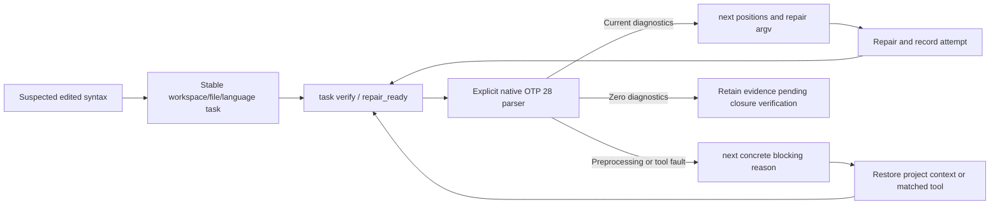
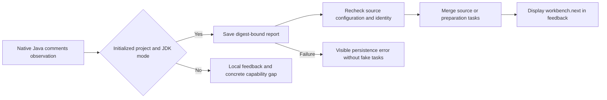
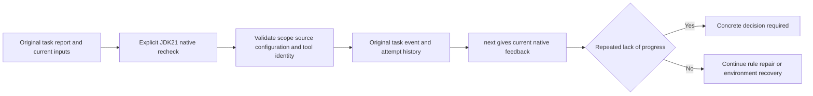

# Codeguard Command Reference

> **Document version:** 1.2.0 · **Updated:** 2026-10-04. Current slices and target contracts are explicitly separated.

[简体中文](Codeguard-Command-Reference.zh_CN.md) · [Documentation](README.md) · [Architecture](Codeguard-Architecture.md) · [Technical design](Codeguard-Technical-Design.md)

The source build wires ESLint into the `node.lint` task in `check all`, sharing native concurrency and the request deadline. Discovered JS/TS/TSX files select their nearest module manifest, local ESLint 10, unique flat config and Node without searching above the selected root. Execution collects reports; aggregation synchronizes the workbench serially and reuses stable tasks. Only completed native results for identical source bytes suppress duplicate WASM; ignored files, configuration errors and tool failures retain both their reasons and fallback. Protocols are `check_feedback` 0.36.0 and `check_aborted` 0.13.0, with older schemas archived. `native_results.node_lint` carries per-file feedback, unexecuted paths, synchronization status and next action. See [acceptance scope](../tests/acceptance/check-all-eslint.md). This does not qualify grammars or replace real host acceptance.


Source-only Erlang entry: `codeguard lint erlang FILE [--erl-tool ABS_PATH] [--timeout DURATION] [--format human|json]`. Ordinary `.erl`/`.hrl` files are supported; OTP 28 scanning/parsing precedes optional WASM. An explicit tool wins; otherwise the first ordinary executable `erl` in absolute PATH directories is selected. Its failure or unsupported version never changes the selection. Native faults and macro/preprocessor limits stay unresolved; all results remain partial with exit 3 (cancellation 130). The report uses [erlang_lint_feedback 0.2.0](../schemas/erlang-lint-feedback-v0.2.schema.json); [acceptance](../tests/acceptance/erlang-native-first.md) distinguishes it from the unchanged public 0.1.4 package.

Current source: `codeguard config validate|explain [path] [--policy-candidate FILE] --format json` returns `config_inspection` 0.3. It statically observes native configuration by build root and preserves `configuration_ref`, `reason`, `next_action` and source hashes. Maven P3C requires explicit artifact/ruleset/error-policy declarations; dynamic ESLint stays unknown. Human output includes sources and actions for at most 12 checker rows. Both commands remain read-only, exit 3, and report `effective_rules/suppressions=unresolved`, `native_execution=not_run`, `effective_policy=null`, `quality_decision=not_evaluated`. See [actual report and limits](../tests/acceptance/config-native-observation.md); public npm 0.1.4 lacks this extension.

## 1. Reading this reference

The command catalog below defines responsibility, not availability. Current dispatch is authoritative: [main.rs](../crates/codeguard-cli/src/main.rs), [README command guide](../README.md#6-command-guide). The Chinese companion preserves the detailed C01–C36 input/output, side-effect and failure contracts; the same IDs below provide an English navigation and behavioral contract. OpenSpec remains the single task ledger.

Current slices include static discovery/init, selected native checks, partial aggregation, work sync/next, local attempts/leases, selected original-tool rechecks and candidate inspection. Current doctor takes `[path]`; Java doclint is selected through `lint java --checker javadoc`. Do not assume a public `lint rust`, generic fix, complete gate or MCP service exists because its target is described here. A callable recheck does not imply final verified closure.

The opt-in `codeguard-cli/wasm-precheck` build adds narrow `lint typescript <file>` and `lint java <file>` paths when no explicit native execution context is provided. TypeScript first recognizes an ordinary project-local ESLint 10 entry and one flat config, then uses an executable Node from `PATH` to run the existing bounded native probe; when Node is unresolved, it reports setup instead of starting WASM. Only when no project-local ESLint package is observed does it return [TypeScript feedback 0.3.0](../schemas/eslint-local-feedback-v0.3.schema.json) or TSX 0.4.0 candidate feedback. Untrusted local paths, package identity or config selection remain setup blockers. Java returns [Java feedback 0.1.0](../schemas/java-syntax-precheck-feedback-v0.1.schema.json). These paths retain exit 3 and never turn an unvalidated grammar or local native observation into delivery approval. Default/published binaries retain the existing native-context behavior. See [native-first acceptance](../tests/acceptance/native-first-eslint-candidate.md).

The same source build also adds a bounded `syntax_candidates` pass to `check all` after its native nodes. [Feedback 0.38.0](../schemas/check-feedback-v0.38.schema.json) keeps all 32 pinned grammars callable through bounded uses of the unified command while preserving native blockers, bounded known grammar limitations (also capped in terminal output), skipped scope and an incomplete verdict; source-matched Python files completed by Ruff count under `native_preferred_count` and skip duplicate WASM; `.tsx`, JavaScript, `.cfs` and explicit CFQuery tag bodies use distinct routes. This is candidate observation, not language-qualified native fallback or automatic host support. See [32-grammar acceptance](../tests/acceptance/check-all-32-grammar-candidates.md).

With `--workspace` pointing to an initialized, canonical workspace, the TypeScript/TSX fallback emits [feedback 0.5.0](../schemas/eslint-local-feedback-v0.5.schema.json). It saves one source-scoped ESLint native-confirmation blocker and returns its real `setup.task_id` only after successful sync. Repeated scans and a later WASM result with no recovery nodes keep that task open; a versioned local report now links bounded suspected positions to that task through its report digest, while capability-matched native verification remains unfinished. See the [workbench acceptance record](../tests/acceptance/typescript-syntax-confirmation-task.md).

`codeguard hook plan [--format=json]` is a current, read-only host-event bridge. It reads a bounded [1.0 request](../schemas/hook-trigger-request.schema.json) from stdin and returns a [1.1 candidate tier](../schemas/hook-trigger-plan-v1.1.schema.json) with exit 3, `execution=not_run` and `delivery_decision=not_evaluated`. A confirmed edit may request fast file checks for at most eight distinct paths, 512 bytes per path and 2 KiB combined; an over-budget event instead requests scope resolution with `fast_scope_budget_exceeded`, without silently dropping files. This is a signal to select a bounded batch check, not to resubmit the same list forever. It does not invoke a checker, take a Git snapshot or block any host. The earlier [1.0 response schema](../schemas/hook-trigger-plan.schema.json) remains available for historical readers. See the [CLI acceptance record](../tests/acceptance/hook-plan-cli-candidate.md).

A separate Python execution slice now accepts `codeguard lint python . --file src/changed.py --format json`. Repeatable `--file` values share the eight-file, 512-byte per-path and 2-KiB combined budget. Only precisely selected, discovered Python files are scanned; an undiscovered target remains incomplete. The default CLI conversation response is `python_lint_feedback` 0.13 with `scan_scope=selected_files` and `requested_paths`. An opt-in source build may return 0.14 with bounded Python WASM suspicion when Ruff is unavailable or undeclared. For one checked file in an initialized workspace it returns 0.15 with a real stable native-confirmation task ID after successful sync, or an explicit persistence failure and null task ID. Native feedback and `delivery_decision=not_evaluated` remain. The selected-file response is not imported as a full workbench scan. The previous 0.12 schema remains for historical results; the nested Python result in `check all` has not been upgraded. `hook plan` does not yet invoke this command automatically; other languages, hosts and bounded batch execution remain unwired.

The current partial execution entry is `codeguard hook execute PATH --timeout DURATION --format=json [--ruff-tool ABS_PATH] [--git-tool ABS_PATH]`, reading the same 1.0.0 `hook_trigger_request` from stdin. The explicit timeout is capped at 120 seconds. Session start only discovers; Stop reads at most 64 findings and 64 reports with an 8 MiB report-byte budget and returns `hook_next_guidance` without running a checker. An oversized backlog returns `not_run/guidance_scope_exceeded`; use `codeguard next PATH --format=json` explicitly. An empty task list recommends a fresh full check, never a pass. `repair_ready` first bounds one task history to 128 events and 1 MiB, then verifies an existing stable task through the same `task verify` implementation in a bounded child process; a missing task, oversized history or failed child remains incomplete. Only task/checker identity, observation, saved-event state and a bounded reason are projected back, while the full native report stays in the existing local verification path. Explicit tool options supported by `task verify` may be passed to `hook execute`; they are rejected on unrelated events, except `--node-tool` also selects Node for confirmed edits. A confirmed edit runs selected Python/Ruff and JS/TS/ESLint native checks before optional WASM candidates. With an explicit Git binary, `pre_commit` reads the current staged index, including an alternate `GIT_INDEX_FILE`; the Git observation itself is bounded by the lesser of the supplied timeout and 15 seconds. Its `hook_git_index_summary` reports index identity, total violation count, at most 32 paths of at most 512 bytes each, truncation and object status while `source_check=not_run`; it cannot prove full quality coverage. Missing Git or failed index observation is `not_run`. Failed or uncertain writes, push and CI also remain `not_run`. The outer `hook_execution_feedback` is now 0.6; historical 0.1–0.5 schemas are preserved. `prompt_submitted` returns constant `read_only_intent_guidance` with no source check or delivery verdict. `host_blocking_verified=false` and `delivery_decision=not_evaluated` remain fixed even if the host claims blocking. The default plugin Hooks do not invoke this entry yet; it is not a strict gate.

Current `detect` 0.4.0 reports local ESLint and Maven Wrapper candidates separately from checker configuration. It skips `node_modules` during ordinary source discovery while observing fixed tool paths without following links. A candidate never means the native tool was executed or approved; `check_feedback` carries this discovery under version 0.36.0.

The candidate Claude Code soft adapter is `codeguard hook claude <session-start|user-prompt-submit|post-tool-use|post-tool-use-failure|stop> PATH --timeout DURATION --format=json [--ruff-tool ABS_PATH]`. It reads at most 1 MiB of host JSON on stdin and validates the event name and working directory. SessionStart does read-only discovery; UserPromptSubmit returns constant non-blocking timing guidance without inspecting prompt text or running a checker; successful Write/Edit/MultiEdit accepts only a regular file under the chosen project root and calls the same Rust local executor; PostToolUseFailure runs the no-check route without echoing the tool error. Stop reads bounded local facts, never a checker or editable task Markdown. A stable task on an initial Stop yields one `hookSpecificOutput.additionalContext` continuation; an already active Stop or no task returns `systemMessage` only, avoiding repeated wakeups. Context is bounded to 1200 characters for local edit feedback, and host exit 0 does not mean a check passed. Duplicate keys, oversized input, missing or escaping paths and mismatched events yield explicit unrun feedback. The separate plugin has an opt-in pinned dispatcher; default Hooks and real-host acceptance remain incomplete. See the [candidate acceptance record](../tests/acceptance/claude-post-tool-hook-candidate.md).

## 2. Command responsibilities

| ID | Target command | Responsibility and success boundary |
|---|---|---|
| C01 | `help`, `--help` | Explain syntax and supported options without executing a checker |
| C02 | `--version` | Identify software/protocol compatibility; no quality assertion |
| C03 | `detect` | Observe languages, manifests and roots; unknowns remain visible |
| C04 | `capabilities` | Expose registered slots and evidence, not implied support |
| C05 | `init` | Preview or apply owned workspace knowledge and AGENTS block |
| C06 | `plan` | Resolve selected obligations, scope and missing prerequisites |
| C07 | `doctor` | Diagnose environment prerequisites without inventing source defects |
| C08 | `rules list` | Explain rule origin, applicability and observed configuration |
| C09 | `config validate` | Validate structure and references; candidates confer no authority |
| C10 | `config explain` | Explain values and provenance; unknown effective models stay unknown |
| C11 | `tools list` | Inventory declared/observed tool requirements |
| C12 | `tools verify` | Check artifact identity separately from independent approval |
| C13 | `tools install` | Preview then explicitly apply trusted locked artifacts; public apply currently blocked |
| C14 | `lint` | Invoke native code convention/static quality checks |
| C15 | `comments` | Check deterministic comment/documentation contracts |
| C16 | `cve` | Check known vulnerabilities against a defined dependency graph and database |
| C17 | `security` | Check source/configuration/secrets and repository-entry safety |
| C18 | `build` | Check compilation/build and explicitly required test level |
| C19 | `check` | Aggregate applicable categories and unresolved obligations |
| C20 | `gate pre-commit` | Check actual index content, including partial staging |
| C21 | `gate pre-push` | Check all actual pushed refs supplied by Git |
| C22 | `gate ci` | Evaluate immutable delivery content under independent trusted policy |
| C23 | `work sync` | Idempotently import reports into stable findings and task projections |
| C24 | `status` | Separate readiness, scan completion, task state and freshness |
| C25 | `next` | Return one actionable repair brief with explicit scope and evidence |
| C26 | `task show` | Show evidence, history, allowed changes and closure conditions |
| C27 | `task claim` | Acquire a bounded local coordination lease |
| C28 | `task heartbeat` | Renew the matching lease without extending attempt budgets |
| C29 | `task release` | Release coordination without deleting the problem |
| C30 | `task attempt start` | Register an attempt before modification |
| C31 | `task attempt finish` | Record changes, failure or no progress; never assert verified closure |
| C32 | `fix` | Preview/apply bounded native remediation and original-tool verification |
| C33 | `task verify` | Recheck exact obligations and decide whether closure is justified |
| C34 | `mcp serve` | Expose the same application contracts through a host transport |
| C35 | `compat legacy-v1` | Project explicit old protocols without inheriting their gate meaning |
| C36 | `dependencies` | Inspect dependency-check configuration, invoke configured native tools and explain results |

## 3. Shared target contract

`[path]` defaults to the current directory; resolve the requested project/build root without silently widening scope. Check commands use a canonical language or `all`; `all` selects applicable obligations, not installation of every language. Missing adapters remain gaps. Project strings and diagnostic text are data, never shell templates.

Queries use typed envelopes with protocol identity, version, operation, request ID, status and next actions. Checks retain their full RunReport result/evidence structure. A query must not fabricate empty findings to resemble a scan. Current producers have separate versions; the target envelope is not a claim that every current command already shares it.

| Exit | Target meaning |
|---|---|
| 0 | Requested operation completed; for a check, complete with no blocking violations |
| 1 | Completed check has blocking violations |
| 2 | Invalid command/options |
| 3 | Required work incomplete |
| 4 | Internal failure |
| 130 | Cancelled |

After execution, precedence is cancellation, internal failure, incomplete, violation, success. Keep native raw exit separately. A successful query, init, sync or attempt update is not a quality pass. Configuration/tool verification succeeds only when its selected conditions are satisfied. `fix --dry-run` success means a usable preview, not repaired code.

Report import uses workspace ID + run ID and verifies the report digest: identical replay is idempotent, different bytes under the same key are a conflict. Repeated doctor runs have new run IDs but merge the same stable blocker.

## 4. Budgets and state changes

Current check runtime precedence is CLI > registered environment variables > `.codeguard/runtime.json` > defaults. Default timeout is 30 minutes and concurrency at most four; accepted bounds are 1 ms–24 hours and 1–64 jobs. Current hard deadlines do not cover every discovery/persistence operation. See [runtime configuration](../README.md#7-configuration-and-native-tools).

The target full-operation budget includes locks, snapshots, probes, execution, parsing, persistence and cleanup. Retries inherit remaining time. Doctor targets two minutes total and ten seconds per probe; installation targets ten minutes; fix/verify target thirty minutes. Leases target five minutes with a sixty-second heartbeat. These are target contracts for the relevant operations, not universally available flags. Cancellation reaps child processes and exposes cleanup still pending.

`init` previews by default; `--apply` changes owned files only. Scans never install tools implicitly. Selected current CLI paths persist reports and sync tasks; a complete host check → sync → next loop remains separate integration work. A manual checkbox, successful install or changed candidate cannot close a code task. Generic fix must check preconditions, isolate changes, preserve user edits and verify through the original checker.

## 5. Native-first fallback and conversation delivery

The same check entry selects a ready native checker first. If it is absent, the target bundled WASM parser supplies scoped syntax precheck while preserving the missing native capability. Clean optional precheck recommends native installation; suspected errors require native confirmation. Required native obligations never become optional, and a failing native execution must not be replaced by clean parser output. See the [canonical routing and reports](Codeguard-Technical-Design.md#53-native-first-selection-and-syntax-fallback--target-not-shipped).

Use `next` evidence, allowed scope, steps, verification command, history and closure conditions to guide an agent. Installation requires appropriate user/host authorization. No command-generated text grants itself authority to change policy or approve exceptions.

Source builds now provide native-first edit feedback through `hook execute` / `hook claude post-tool-use`: only explicit ordinary files are selected; Python uses Ruff and JS/TS uses module-local ESLint 10. Coherent same-byte native results avoid duplicate parsing. Uncovered files may use pinned WASM candidates; mixed scopes retain native results, unwired native scopes and failures. Recovery nodes require native-tool setup/repair and confirmation; complete zero-recovery candidates only recommend native lint, never full acceptance. One deadline bounds at most eight files and two WASM workers; builds without WASM report that gap. The outer feedback is 0.7.0 with local `hook_fast_feedback` 0.2.0. Candidate task synchronization is connected; default plugin Hooks, capability-matched closure and real-host acceptance remain incomplete. See [edit-feedback acceptance](../tests/acceptance/hook-fast-native-wasm.md).

Source edit feedback now imports recovery-bearing pinned WASM candidates into the existing `.codeguard/` workbench. Confirmation identities remain stable per workspace/file/language; Python and JS/TS reuse existing confirmation/preparation identities. Reports bind the grammar, source SHA-256, known limitations and suspected byte positions; imports reject mismatched identities/coordinates and duplicate JSON keys. Task IDs appear only after successful synchronization. Complete zero-recovery observations create no new mandatory task; unlocated incomplete scans create check-recovery tasks. Neither closes existing tasks. Dialogue includes `task show` / `task verify`; missing native confirmation adapters report an explicit capability gap. Outer Hook feedback is 0.7.0, local feedback is 0.2.0, and generic `next` briefs use 0.3.0 while existing checkers retain 0.1.0. Default plugin Hooks, capability-matched closure and actual-host acceptance remain incomplete.


### Native verification of a Zig confirmation task

Source builds can now verify a persisted Zig WASM confirmation task with `codeguard task verify TASK_ID . --zig-tool /absolute/path/to/zig --format=json`. The same explicit tool option is accepted by `hook execute` for `repair_ready`, using the existing lease and finished-attempt binding. `lint zig` can run the native tool without building the optional WASM feature; fallback without that feature reports its absence.

The pinned Zig 0.16.0 probe runs `version` and `ast-check --color off` against the exact source bytes under one deadline. A current native diagnostic changes the brief to source repair; missing tools, unsupported versions and execution failures retain environment/decision guidance. Fresh `next` briefs carry the unchanged tool path in their recheck argv. Changes to source or tool bytes invalidate old diagnostic guidance. Reports and attempts are retained under the existing workbench instead of a second task store.

The native observation is `syntax_task_recheck` 0.1.0, wrapped by `task_verification_preview` 0.12.0. Generic repair briefs are 0.3.0; old 0.2.0 briefs and 0.11.0 verification schemas remain available unchanged. Zero native AST diagnostics are `candidate_absent_unverified_policy`: they end the pending local verification step, but do not close the task or certify project lint, build or delivery. Erlang now has the same workbench integration through explicit OTP 28; [Erlang task acceptance](../tests/acceptance/erlang-native-task-verification.md) records its separate protocol versions. Remaining generic languages still lack native confirmation adapters. See [the acceptance record](../tests/acceptance/syntax-native-task-verification.md).

Briefs also expose the latest native report reference/digest and current diagnostic positions; stale inputs suppress those positions. Only immutable grammars compiled into the binary reuse validated asset identities within a process; external manifests, source and native tools still require current-byte checks.


### Erlang confirmation tasks and native repair guidance (current source)

`codeguard task verify TASK_ID . --erl-tool /absolute/path/to/erl --format=json` and the `repair_ready` event of `hook execute . --erl-tool /absolute/path/to/erl` now reuse the existing `.codeguard/` task, lease, finished attempt and shared deadline. They call the same OTP 28 forms parser as `lint erlang`. Task language and tool options are checked before acquiring a lease or launching a tool; project source, macro expansion and parse transforms are not executed.



Erlang observations use `syntax_task_recheck` 0.2.0, verification feedback 0.13.0 and post-verification `next` briefs 0.4.0. Zig and historical schemas remain unchanged. `native_confirmation_reason` identifies missing tools or preprocessing gaps; guidance names OTP 28 preparation or project-native preprocessing/compilation. Source changes invalidate diagnostic guidance; changed tools lose their stored argv. Only a byte-current tool already observed as OTP 28 can be reused as ready.

Zero diagnostics remain `candidate_absent_unverified_policy`: they consume the linked pending verification, but cannot close the task or approve delivery. Two no-progress attempts use the existing decision budget. The protected source closure API now supports task-scoped Erlang; the default host still lacks a trusted policy provider; full Erlang project lint/preprocessing, native-finding lifecycle, automatic tool discovery and installed-host releases remain open. Public npm 0.1.4 does not include this extension. [Acceptance and protocols](../tests/acceptance/erlang-native-task-verification.md).

Erlang `repair_ready` feedback uses Hook 0.8.0 / local summary 0.2.0 to include current native positions, the concrete unresolved reason, Unicode scalar column units and an existing report reference. Other Hook versions remain unchanged; installed-host delivery is not certified.

### Aggregate Erlang native-first checking (current source)

```bash
codeguard check all . --format=json
codeguard check all . --erl-tool /absolute/path/to/erl --timeout 30s --jobs 2 --format=json
```

The `erlang.lint` task selects explicit Erlang or the first executable `erl` from absolute PATH directories, then uses the existing controlled OTP 28 scanner/parser. It observes at most 64 ordinary UTF-8 files, each at most 1 MiB, under the request deadline and scheduler concurrency. `native_results.erlang_lint` carries current source hashes, positions, tool selection, per-file next actions and original-tool recheck argv with an absolute source path, reusable outside the project directory. Files beyond the native budget are counted as unobserved.

Only complete, non-preprocessed forms observations for matching source and tool bytes skip duplicate WASM. Missing tools retain candidate observations; selected-tool failures stay visible alongside any supplementary candidate observation. Macro/preprocessor coverage remains unresolved. Source or tool changes withdraw affected positions and reusable argv. Project-scope changes set `scope_stable: false` and retain still-current single-file diagnostics; whole-scope completeness is withdrawn. SIGINT remains exit 130; JSON, human and conservative SARIF retain native findings without claiming project success.

This earlier increment without task projection used `check_feedback` **0.36.0**, `check_aborted` **0.13.0**, and the embedded `erlang_forms_scan` **0.1.0**. Earlier aggregate schemas are preserved byte-for-byte. Forms completeness is distinct from full lint/build/test coverage. Native-finding task persistence and trusted closure are still unimplemented; the report exposes `task_id: null` rather than inventing a task. Existing WASM-origin Erlang confirmation tasks retain their separate `task verify` workflow. Public npm 0.1.4 does not include this new aggregate path. See [acceptance](../tests/acceptance/check-all-erlang.md).

### Cargo input and proxy boundaries (current source)

Normal Clippy scans and same-rule `--force-warn` comparisons use `cargo clippy --locked --offline --all-targets --message-format=json`. A missing root Cargo.lock returns `cargo_lock_unavailable` before native startup and does not create a lock. Source fingerprints come from a bounded pre-run snapshot. Changes to observed sources, the manifest, lock, root Clippy/Cargo/toolchain configuration or selected tool withdraw the current Clippy findings and retain preparation/recheck work. Valid partial diagnostics under stable inputs remain visible without claiming a complete report.

For Cargo proxies such as rustup that dispatch by entry-point name, Clippy, rustdoc and build checks execute the selected Cargo path while validating the resolved bytes and post-run target identity. A separate sequence prevents private Clippy directories from colliding at identical timestamps. This protects observed inputs only; it does not prove the complete effective Cargo model, every build combination or a process sandbox. Local zero diagnostics still cannot close tasks automatically. Tests, failures and actual output are in the [Cargo input acceptance record](../tests/acceptance/rust-clippy-input-stability.md). Public npm 0.1.4 does not include this batch.


### Existing Cargo discovery (current source)

`check all`, `comments rust`, `build rust` and their Cargo task rechecks accept an optional `--cargo-tool`. Without it, they select the first regular executable `cargo` in an absolute invoking-PATH directory. Empty/relative directories and non-executable entries are skipped. An explicit invalid tool or selected native failure remains a concrete blocker; it never triggers a search for another Cargo. Aggregate Rust checks share the selected entry.

The final `cargo` entry name is retained for rustup proxy dispatch; resolved bytes and target identity still undergo the existing checks. The child inherits `RUSTUP_TOOLCHAIN` and always receives `RUSTUP_AUTO_INSTALL=0`, even if the caller set it to `1`. Cargo `--locked --offline` alone does not prevent rustup from installing a missing toolchain; [rustup documents the separate control](https://rust-lang.github.io/rustup/environment-variables.html). A missing toolchain stays an environment failure, without a source violation or automatic installation. This does not qualify the entire toolchain, effective Cargo configuration, complete project coverage or trusted task closure.

Controlled proxy/no-fallback cases and actual installed/missing-toolchain observations are recorded in [Cargo discovery acceptance](../tests/acceptance/cargo-native-discovery.md). Public npm 0.1.4 does not include this source change.


### Project-root Ruff discovery (current source)

For a configured Python scan, `lint python`, `check all`, selected-edit Hook execution and same-root task rechecks select an explicit `--ruff-tool` first, then the checked root's `.venv/bin/ruff`, then an executable in an absolute invoking-PATH directory. They do not activate a shell environment, enumerate installed packages or install Ruff. A root-local entry is version-probed and byte-bound through the existing native scan. Missing local directories/entry permit PATH discovery; linked/non-directory parents, broken or non-executable entries produce `ruff_local_tool_invalid` instead of silently switching to global Ruff. A chosen tool's version/execution failure never tries a different tool.

An invalid local environment projects one stable preparation task with `.venv/bin/ruff` evidence, bounded environment repair, original Codeguard recheck, history and closure conditions. No applicable Ruff configuration means no tool startup. Ordinary local parents may contain an executable symlink: the resolved tool bytes are fixed and rechecked. Local success and repaired-source zero diagnostics still do not approve policy or close tasks automatically. This selection concerns the explicitly checked root; per-module virtual environments, uv/Poetry/Conda resolution, real host integration and complete coverage remain separate work. See [root-local Ruff acceptance](../tests/acceptance/ruff-local-discovery.md). Public npm 0.1.4 does not include this source change.


### Recovery tasks for unlocated syntax observations (current source)

`check all/java` and confirmed-write Hooks share syntax-task synchronization. Visible recovery nodes require native confirmation. A tree error with an incomplete recovery scan and no locatable nodes creates a check-capability recovery task: it retains an empty recovery array and `syntax_recovery_incomplete`, without a confirmed source violation or invented edit position. Complete zero-recovery observations recommend native checking without creating this task.

The workspace/file/language identity remains stable across repeat checks, Hooks and later visible recoveries. `next` and task Markdown require restoring the checker, language version or grammar; source edits are forbidden before native confirmation. `task verify` records a missing native adapter while retaining the open task. Zero recoveries, installation and checkbox edits cannot close existing tasks. Persistence failures retain observations and per-file reasons without fabricated task IDs.

Aggregate feedback uses `check_feedback` 0.38.0 with `syntax_tasks`; unlocated local confirmation reports use 0.3.0. Existing located 0.1.0 and native-first Erlang 0.2.0 reports and their schemas remain unchanged. Claude Hook command replay distinguishes recovery-node counts from incomplete recovery scans; actual-host and full-language acceptance remain open. Public npm 0.1.4 does not contain this batch. See [acceptance and actual reports](../tests/acceptance/unlocated-syntax-recovery-tasks.md).


### Automatic native Erlang discovery for task rechecks (current source)

`codeguard task verify "$TASK_ID" . --format=json` (with `TASK_ID` set to the actual `task_id` returned by `next`) reuses lint/check selection for existing Erlang syntax tasks: explicit `--erl-tool` takes priority; otherwise the first executable erl in an absolute invoking-PATH directory is fixed. Rechecks verify OTP 28, current source and tool bytes while retaining leases, budgets, events and existing report versions. Both candidate-origin and native-first tasks can be rechecked; repair-ready Hooks use the same entry.

Only an absent tool produces `erlang_tool_not_found_on_path`; empty/relative PATH entries and non-executable files are ignored. An invalid explicit tool, unsupported selected version or execution failure never selects a later tool or installs one. After a valid observation, `next` supplies explicit recheck argv for the actual tool so later PATH changes cannot replace that entry. Local zero diagnostics still do not close tasks automatically; preprocessing, trusted policy and complete project capability remain separate obligations. See [recheck discovery acceptance](../tests/acceptance/erlang-recheck-discovery.md). Public npm 0.1.4 does not contain this batch.

### Native confirmation of unlocated Swift observations (current source)

An existing Swift confirmation task now accepts `codeguard task verify "$TASK_ID" . --swift-tool /absolute/path/to/swiftc --format=json`, where `TASK_ID` comes from actual `next` output. `hook execute` accepts the same option for `repair_ready`. The caller supplies an installed Apple Swift 6.4 compiler; this path does not install tools or execute editable paths from historical reports. Missing tools receive an existing-compiler recovery action; unsupported versions and execution failures retain the task.

Rust reads and rechecks bounded source bytes, then runs `swiftc -frontend -parse -diagnostic-style llvm -no-color-diagnostics -` with frozen stdin, `/` as cwd, a cleared environment and the shared deadline. Only native error rules and positions enter agent guidance; raw diagnostic text is not treated as an instruction. Columns are UTF-8 bytes and must fall on character boundaries. Unknown output, exit/diagnostic contradictions, timeout, invalid positions and tool changes remain incomplete. The tool digest binds the launcher, not the entire Swift installation.

Native errors make the same task actionable for source repair. Source or tool changes withdraw old positions. A clean parse records `candidate_absent_unverified_policy` without automatically closing the task or satisfying project lint, type checking, macro/conditional-compilation context, build, security or delivery obligations. Existing no-progress budgets still apply. Swift grammar qualification and the 32-language precision conclusions are unchanged; public npm 0.1.4 does not contain this extension.

New protocols are `syntax_task_recheck` 0.4.0, `task_verification_preview` 0.15.0, `repair_brief_preview` 0.6.0 and Hook feedback 0.9.0 (task summary 0.3.0). Aggregate `check` uses 0.39.0 when `next` contains a native Swift brief; other paths retain 0.38.0. Historical schemas remain unchanged. See [Swift native-confirmation acceptance](../tests/acceptance/swift-native-task-confirmation.md) for actual reports and limits.

Development source also supports existing Kotlin confirmation tasks through `codeguard task verify TASK_ID . --kotlinc-tool ABS_PATH --format=json`. `repair_ready` accepts the same option and preserves the stable task/history. Mixed observations separate actionable syntax positions from unresolved context. See [task-recheck acceptance](../tests/acceptance/kotlin-native-task-confirmation.md).

Development source: `check all . --kotlinc-tool ABS_PATH` and `hook execute . --kotlinc-tool ABS_PATH` for confirmed file_changed select native Kotlin first; the option is also accepted for repair_ready. Selected failures remain visible; only tool absence enables WASM fallback.

Development source: `lint swift FILE.swift [--swift-tool ABS_PATH] --format=json` provides native-first syntax-only feedback; task verify/repair_ready remain separate existing paths. Project lint, types and build are incomplete.

Development source: `check all . --swift-tool ABS_PATH` adds Swift native parse under the shared deadline. Only absent tools keep candidate fallback; selected failure does not. Full lint and project-native task connection remain open.

Development source: confirmed file_changed accepts `hook execute . --swift-tool ABS_PATH` for selected Swift parsing; omission discovers invoking PATH. Other non-verification/non-save events reject the tool option. CLI Claude summaries preserve native positions and task-connection gaps.

### Swift native-first repair workbench (development source)

In an initialized `.codeguard/` workspace, `check all` and a confirmed successful-save `hook execute file_changed` synchronize Swift native syntax findings or environment blockers into stable tasks. Repeated observations reuse the same task. `next` and `task show` expose evidence, rule basis, allowed scope, repair steps, recheck commands, history and closure conditions. An uninitialized workspace reports a disconnected workbench; synchronization failures remain blockers. Standalone `lint swift` does not create tasks yet.

`codeguard task verify TASK_ID . [--swift-tool ABS_PATH] --format=json` selects an explicit tool or discovers one in the invoking PATH for native-first tasks. Existing WASM-origin tasks retain their explicit-tool contract; editable historical paths are not executed. Diagnostics request source repair. Zero diagnostics records `candidate_absent_unverified_policy`; the same task stays open pending full lint, type, build and delivery checks.

Native-first protocols use observation 0.5, scan 0.2, check 0.44, initial brief 0.11, save Hook fast 0.5 / outer 0.13, and recheck inner 0.7 / outer 0.18. Existing verification briefs retain 0.6, and historical schemas remain unchanged. Actual Apple Swift 6.4 executions verified stable task references across repeated scans, saves and rechecks before and after repair. This is not installed-host or trusted-closure acceptance and is excluded from public npm 0.1.4.

### Recover missing task projections

`codeguard work sync . --format=json` now restores missing Markdown for committed facts under the workspace sync lock, imports new reports, and rechecks missing projections. Recovery reads structured facts, the current RepairBrief, original report hashes and consumption markers. It does not run checkers. Existing regular task files, including notes and checkmarks, retain their exact bytes. Symlinks, directory conflicts, invalid facts, changed origin hashes and uncommitted origins remain incomplete. Recovery examines at most 1,000 facts.

The readable task contains evidence, rule basis, allowed scope, steps, recheck argv, history and closure conditions. Local absolute paths in recheck arguments become verification placeholders; use `task show` for current instructions. Recovery never closes findings, changes original facts/events/consumption markers or attempt history, or grants delivery approval. Reports use `work_sync_preview` 0.3.0 with a positive `restored_task_projections` count only when recovery occurs; other runs retain 0.2.0.

Actual recovery feedback (local synchronization, without delivery approval):

```json
{
  "already_consumed_reports": 1,
  "command_status": "partial",
  "delivery_decision": "not_evaluated",
  "failed_reports": 0,
  "historical_findings": 0,
  "imported_reports": 0,
  "new_blockers": 0,
  "new_findings": 0,
  "next_actions": [
    "inspect_findings_and_tasks",
    "implement_native_reverification_and_full_gate"
  ],
  "operation": "work_sync",
  "report_type": "work_sync_preview",
  "restored_task_projections": 1,
  "schema_version": "0.3.0",
  "workspace_id": "ws-f734e620fead976b3bb5826be2fb3341"
}
```


## Next steps for independent source findings

When the first source finding is waiting for its owner or has exhausted its retry budget, and no prerequisite blocker exists, next can select another actionable or verification-required finding on a proven independent physical source. next_actions and human output retain read-only task show references for deferred findings. Their facts, budgets, leases and gate effects remain unchanged. Overlapping targets, aliases, unknown scope, invalid facts and failed reports retain conservative handling. The complete module dependency graph remains incomplete; non-Unix keeps the original selection. See the [actual acceptance evidence and full report example](../tests/acceptance/next-independent-source-work.md).

### Scoped Swift syntax task lifecycle (development source)

A protected host can call `verify_swift_task_resolution` to compare the original counterexample and current source with Apple Swift 6.4. Policy 1.2.0 and evidence 0.3.0 remain separate from Zig/Erlang protocols; native-first tasks retain a null grammar identity. An original parse diagnostic, changed source, and a complete clean recheck with the same tool permit a scoped `code_fixed` event. Repeated verification is idempotent; an ordinary `task verify --swift-tool` recheck reopens the same parent chain on recurrence. A valid original sample requires false-positive review; tool failures or identity changes cannot close the task. The host supplies independent trust and signatures. Default plugin integration and public distribution remain incomplete, as do SwiftLint, type checking, project builds, and full delivery acceptance. See [lifecycle acceptance](../tests/acceptance/swift-task-resolution-lifecycle.md).

### Scoped Kotlin resolution and context blockers (development source)

`verify_kotlin_task_resolution` reuses the host SDK with kotlinc-jvm 2.4.10. Policy 1.3.0 and evidence 0.4.0 are language-specific; native-first tasks keep a null grammar identity. The original diagnostic must have coherent UTF-16 and UTF-8 coordinates. Changed source and a complete clean recheck permit a scoped `code_fixed` event. Context-only errors remain pending verification. Mixed syntax and context errors retain the known finding and allow ordinary `task verify --kotlinc-tool` recurrence to reopen the same parent chain even when completion is incomplete. The host supplies independent trust. Tool identity currently covers the launcher, with full JAR/JDK/project identity, default plugin closure, lint/type coverage, and publication still pending. See [acceptance](../tests/acceptance/kotlin-task-resolution-lifecycle.md).


### Source-aware false-positive investigation

`next` and `task show` derive the same investigation step from the bound first report. Native-first tasks compare native diagnostics, input, tool and environment; WASM-first tasks compare grammar assets, language versions and native observations. A native counterexample with no diagnostics does not establish a grammar defect. These queries do not execute checkers, mutate leases, budgets or history, approve an exception, or close a task. See the [scoped acceptance record](../tests/acceptance/counterexample-source-guidance.md).


### Run a project check for a selected language

`codeguard check <canonical-language-id> . --format=json` accepts all 57 IDs in the registry. It scopes existing native services, shared budgets and WASM fallback to the selection; missing adapters remain explicit gaps. Java/all retain their existing report versions. Other languages use check_feedback 0.45 and check_aborted 0.14 for internal failures, with delivery_decision=not_evaluated. An empty target cannot certify the project. Explicit tools must belong to the selected ecosystem; JavaScript/TypeScript share npm root checks. Unregistered aliases are rejected.

For example, `codeguard check python . --ruff-tool /absolute/path/to/ruff --format=json` does not schedule Java/Maven or Rust/Cargo in a mixed project. With native checks unavailable, a WASM-enabled binary observes only selected-language candidates.


### Zig tool discovery and current inputs

Development-source `lint zig FILE` and Zig `task verify` share explicit/PATH selection. An explicit tool takes precedence; otherwise, the first ordinary executable zig in an absolute PATH directory is selected. Empty/relative entries and non-executable files are ignored. A selected failure does not switch to a later compiler; supplemental unqualified WASM observations retain native blockers. Single-file feedback 0.2 exposes selection provenance and source_current. Changed source or entry targets withdraw stale native positions; changed source also withdraws old-byte WASM observations. Zero diagnostics cannot close a task or certify the project. Full Zig lint/build and aggregate native-first coverage remain incomplete.


Development-source Zig native routing (2026-10-05): `check all`, `check zig` and selected-file editing now reuse the frozen Zig 0.16.0 AST probe. Explicit/PATH selection runs native first; selected-tool failures retain an incomplete observation without switching to WASM. Missing tools retain candidate fallback. Source or tool-entry changes withdraw old positions; at most 64 files are observed under the shared deadline, with remaining scope visible. Check feedback 0.46, aborted feedback 0.15 and Hook feedback 0.14 are separate protocols; reports without Zig keep previous versions. Claude feedback includes bounded native rule IDs, positions and the original recheck instruction. First-native Zig task creation is now connected as described below: native reports expose only actually synchronized task IDs, and clean AST observations do not close historical tasks or prove complete lint/build. Public npm 0.1.4 and the plugin lock are unchanged.

### Native-first Zig tasks (development source)

In initialized workspaces, `check zig`, `check all`, `lint zig` and edit Hooks synchronize one stable task per workspace/source scope. A newly clean file creates no repair task. Clean rechecks of existing tasks record `candidate_absent_unverified_policy` and retain the open task. `next` and `task show` expose bounded native positions and original-tool arguments; `task verify TASK_ID . [--zig-tool ABS_PATH] --format=json` and repair_ready record native rechecks. Native-first grammar identity is null; native diagnostics must not request grammar edits.

New protocols: observation 0.6, bound scan 0.2, aggregate 0.47, single-file 0.3, brief 0.12, task-show 0.2, recheck inner 0.8/outer 0.19, edit Hook 0.16 and recheck Hook 0.15. Historical schemas remain unchanged. Actual Zig 0.16.0 validated broken and repaired inputs. Trusted SDK closure for native-first Zig tasks is described below. Default installed-host integration, full lint/build and distribution remain incomplete. Public npm 0.1.4 is unchanged. See [acceptance](../tests/acceptance/zig-native-first-workbench.md).

### Trusted native-first Zig resolution (development SDK)

A protected host can call `verify_zig_task_resolution` with independently signed policy 1.4.0 for native-first observation 0.6.0. Grammar must be null; legacy WASM-origin policy 1.0.0 retains its scope. An original same-tool diagnostic, changed source and a complete clean same-tool recheck permit scoped `code_fixed` with evidence 0.5.0. Repeated verification is idempotent; ordinary `task verify --zig-tool` positive recurrence reopens the same parent chain. Valid original samples require false-positive review. Unexpected output, invalid positions, changed tools or missing trusted context cannot close the task. The host independently supplies trust. Default plugin/public npm integration of that provider remains incomplete; local task records do not authorize delivery. See [acceptance](../tests/acceptance/zig-native-first-resolution.md).

### Native-first Go lint with missing-tool candidates

Source-built `codeguard lint go . --format json` prefers explicit `--go-tool`, then executable Go from absolute caller PATH entries. Selected tool/version/execution failures remain native failures. When no native tool exists, the built-in WASM produces bounded whole-file recovery and structure candidates. Candidates or incomplete prechecks require a project-appropriate native tool; zero candidates in the completely observed bounded scope only recommend preparation. Native obligations remain incomplete and exit3 is retained. Builds without WASM report that capability gap. Repeated lint/check reuse the confirmation task; adding a package declaration does not close it. Public npm0.1.4 is unchanged. See [limited acceptance](../tests/acceptance/go-lint-fallback.md).


### Read-only current-source command support catalogue

`codeguard help --format json` queries C01–C36 and additional public entries. `codeguard help task verify --format json` selects an exact command prefix. The command_help0.3 report separates implemented/partial/planned/unavailable_build and executable; executable means an entry exists, not that checking or installation completed. Grammar probe is unavailable without the WASM feature and remains unqualified with it. Unimplemented standalone MCP and other operations are explicitly planned.

```bash
codeguard help --format json
codeguard help lint --format json
codeguard task verify --help
```

Help does not inspect projects or start tools. Exit0 means the query completed, with delivery_decision still not_evaluated. Exact-prefix trailing help is supported; full language/path/tool-argument contextual help and complete parameter generation remain open. See [actual reports and acceptance](../tests/acceptance/command-help-current-support.md). Public npm0.1.4 does not contain this source increment.


### Native-first standalone Rust lint

The current source supports `codeguard lint rust . --cargo-tool /absolute/cargo --format json`. It reuses the aggregate check's locked/offline all-targets Clippy observation, input validation and workbench synchronization, executing only lint. Initialized workspaces retain one stable task per finding and return the next action. Recheck with `codeguard task verify TASK_ID . --cargo-tool /absolute/cargo --format json`; zero diagnostics still require rule/policy review and do not automatically close the task.

When no explicit Cargo is selected and no executable is found on absolute PATH entries, WASM builds provide bounded candidate prechecks. Candidates or incomplete observations require native tool preparation; zero candidates across the complete bounded scope recommend it. Explicit tool errors or native failures do not trigger fallback or installation. The JSON protocol is `rust_lint_feedback` 0.1 with delivery unevaluated; help 0.2 adds Rust while preserving historical 0.1 schemas. Source integration does not imply public npm availability or complete Rust qualification.

## Ruby single-file native syntax and task rechecks

Source builds add `codeguard lint ruby FILE.rb --ruby-tool /absolute/path/to/ruby --format=json`. This only observes fixed Ruby2.6.10p210 `ruby -c` with gems disabled and frozen UTF-8 stdin; user source is never executed. Explicit tool failures and unsupported versions do not trigger WASM fallback. Missing native selection uses candidate prechecks in WASM builds; candidates/incomplete checks require native preparation, while zero candidates recommend it. The `ruby_lint_feedback`0.1 report preserves native line numbers without fabricated columns, leaves project-version compatibility unverified and requires RuboCop, documentation, security and full project checks. Help0.3 adds Ruby without changing historical help0.1/0.2 schemas. Initialized workspaces reuse one stable confirmation task across WASM candidates and native observations. `next` retains native line positions and the verified `--ruby-tool` recheck argument; `task verify` records attempts and leaves zero-diagnostic tasks open pending policy/coverage review. Ruby syntax feedback0.3, native history0.9, recheck0.10, task preview0.23 and repair brief0.15 preserve old protocol versions. `codeguard check ruby ROOT --ruby-tool /absolute/path/to/ruby --format=json` and `check all` now reuse the bounded native syntax scan and stable task connector; selected failures do not switch to WASM. The shared deadline and64-file cap retain incomplete scope; native observations withdraw positions when source/tool identity changes. Aggregate feedback0.51 supports Ruby scan0.1/0.2 and brief0.15 without modifying old schemas. Full RuboCop/project lint and trusted closure remain pending. Public npm0.1.4 is unchanged.


Ruby edit feedback: source builds of `hook execute` / `hook claude post-tool-use` accept `--ruby-tool ABS_PATH` or select Ruby from the caller's absolute PATH entries. Only confirmed edited files are parsed under the event deadline. Selected failures do not fall back; absence retains WASM candidates. Bounded dialogue carries current line positions and real stable tasks without source/tool-message echoes or invented columns, and asks agents to verify project Ruby compatibility first. `repair_ready` rechecks using the selected tool and retains real evidence references; zero diagnostics do not close tasks. New closed protocols are edit feedback 0.19 (inner 0.10) and recheck feedback 0.20 (inner 0.6); old schemas are preserved. Actual installed-host triggering, complete RuboCop coverage, and public npm release remain unverified.

Rust edit entry: source-built `hook execute ROOT --rustfmt-tool ABS_PATH --timeout 30s --format=json` and `hook claude post-tool-use` use selected-file Cargo edition with fixed Rustfmt1.9.0-stable. Without an explicit selection, only absolute PATH entries are searched; genuine absence retains built-in WASM prechecks when available. `next ROOT --format=json` returns a stable confirmation task and original-tool recheck arguments; `task verify TASK_ID ROOT --rustfmt-tool ABS_PATH --format=json` records the same task's observation. Rustfmt supplies parser observations; Clippy/type/full-build obligations remain pending, and zero diagnostics cannot close tasks. Selected failures stay incomplete, including unverified proxy versions. Source changes and offline installation tests do not update the public npm release.

Rust edit dialogue now provides an executable post-batch Clippy command and explicitly states that project lint did not run during editing. Original-task repair-ready retains current rule/line feedback and withdraws changed-input guidance; this is not a background queue or authoritative closure. See [project lint follow-up](Rust-Project-Lint-Followup.md).

## Unified Java comments entry (source increment, not released)

`comments java [path]` reuses the existing native Javadoc probes. A file selects an explicit JDK21 local observation. A project selects recognized Javadoc configuration and its main sources only. Missing configuration does not launch Javadoc or produce comment violations. Explicit Maven context selects original-POM multi-file checking; failure never falls back to a single-file probe.

```bash
codeguard comments java File.java --java-home /absolute/jdk21 --format json
codeguard comments java . --java-home /absolute/jdk21 --maven-tool /absolute/mvn --maven-repo /absolute/repository --repo-sha256 SHA256 --timeout 60s --format json
```

The independent `java_comments_feedback 0.1.0` wrapper preserves the existing report under `native_observation`; the old `lint java --checker javadoc` protocol remains unchanged. Budget precedence is CLI, registered environment, project default, then built-in default. All native child work shares one deadline. Feedback exposes target kind, budget, observations and next actions. Zero local diagnostics still means `coverage_proven=false`, `delivery_decision=not_evaluated`, exit3 (130 on cancellation). No implicit installation or source changes occur.

**Scope limitation:** Maven multi-file task synchronization is connected; Maven original-task verification, trusted closure/recurrence and actual host acceptance remain incomplete; standalone files can explicitly bind --workspace as described below. Trusted closure remains incomplete. This entry creates no fake tasks and does not close findings from a local probe. Replace the absolute tool paths and offline-repository digest with real current values.

### Javadoc project workbench integration (source increment)

For initialized projects, `comments java .` in JDK single-file mode saves local observations and synchronizes stable tasks using wrapper protocol `java_comments_feedback 0.4.0`. Unbound checks retain 0.1 local feedback; explicit-file workspaces are described below. Rule, relative file, source anchor and occurrence ordinal define identity; line numbers only locate evidence. Repeat scans append observations without duplicate tasks.



Missing configuration or incomplete execution creates preparation records, not source violations or new mandatory delivery obligations. Feedback exposes `workbench.status/new_findings/new_blockers/next`. Persistence failures return no fake tasks. Briefs and task text include evidence, rule basis, scope, steps, recheck and closure conditions. Local zero diagnostics leave prior tasks open with `task_verify_status=local_observation_only`; original-task rechecks are described below. Maven multi-file task synchronization is connected; Maven original-task verification, trusted closure/recurrence and actual host acceptance remain incomplete; explicit-file integration is described below, as do trusted closure and actual host acceptance.

### Recheck the original Javadoc task (source increment)

Initialized-project JDK-mode Javadoc tasks now support original-tool rechecks:

```bash
codeguard task verify CG-<task-identity> . --java-home /absolute/jdk21 --format json
```

The recheck reads the digest-bound original observation and selects the task source with current native configuration. It never selects an executable from saved reports. Source, configuration and explicit JDK21 tool bytes are checked around scanning and before recording. Unrelated checker options are rejected before leases or execution. Results `still_present`, `incomplete`, `rule_coverage_requires_review` and `candidate_absent_unverified_policy` are recorded on the original task, bound to the native report and current attempt. Missing or changed tools and unstable inputs cannot mean repair completion. Changed configuration or another anchor for the same rule requires review.



Current protocols: bound-workbench wrapper `java_comments_feedback 0.4.0`, Javadoc brief0.3, native container `javadoc_task_recheck 0.2.0`, public `task_verification_preview 0.27.0`. Older schemas remain readable. `task_verify_status=local_observation_only` means local rechecks are connected; trusted closure remains unaccepted. Zero diagnostics after documentation repair only records an absence candidate and leaves the task open. Whitelist approval, full project-rule attribution and actual host acceptance remain independent work. Maven multi-file task synchronization is connected; Maven original-task verification, trusted closure/recurrence and actual host acceptance remain incomplete; explicit-file integration is described below.

### Explicit Java file workbench (source increment)

```bash
codeguard comments java File.java --workspace . --java-home /absolute/jdk21 --format json
codeguard task verify CG-<task-identity> . --java-home /absolute/jdk21 --format json
```

`--workspace` explicitly binds a readable workspace. Files must belong to it; a project target must equal the workspace root. Out-of-scope files are rejected before execution. Uninitialized roots report `workspace_not_initialized` and are not initialized automatically. A file without an explicit workspace retains local feedback; no parent workspace is guessed. The explicit root also supplies project defaults for the shared budget.

Observation0.2, brief0.3 and recheck0.2 add `observation_scope`: `explicit_file_probe` means an explicitly selected file and requires null configuration references; `configured_project_probe` still selects main sources through original project configuration. Task rechecks preserve the original mode. Adding a POM later cannot turn a file probe into a project check. Lines only locate evidence; original rule/file/anchor identity stays stable. A missing JDK creates preparation tasks only. Local zero diagnostics or synchronization never closes a task.

The bound-workbench wrapper is now `java_comments_feedback 0.4.0`, public verification is `task_verification_preview 0.27.0`; older schemas remain available. Human output also shows workbench status, task identity, mode, next step and recheck arguments. Maven multi-file task synchronization is connected; Maven original-task verification, trusted closure/recurrence and actual host acceptance remain incomplete.

### Maven Javadoc multi-file workbench (source increment)

In an initialized workspace, `comments java` with explicit Maven context persists native multi-file observations under `.codeguard/reports/` and creates stable repair tasks. Missing configuration or incomplete execution creates preparation tasks. A bounded source/POM snapshot is captured before native execution and checked again before persistence. Import revalidates current hashes, build-root ownership, the original POM, observed tool identities, rules and locations, then recomputes finding projections. Tampered or changed inputs cannot create new source findings. Consumed historical reports retain their original digest receipts after source edits.

```bash
codeguard comments java . --maven-tool /absolute/mvn --java-home /absolute/jdk21 --maven-repo /absolute/offline-repo --repo-sha256 <actual-repository-digest> --format json
codeguard next . --format json
```

The Maven-bound wrapper is `java_comments_feedback 0.5.0`, the saved observation is `maven_javadoc_workbench_observation 0.1.0`, and the inner repair brief is0.4 with `observation_scope=configured_maven_multifile_probe`. Existing JDK file/project wrappers and recheck protocols remain available. Feedback includes the stable task, evidence, native rule, allowed scope and original Maven rescan arguments. `task_verify_status=not_integrated` explicitly identifies the missing Maven task-verification integration; a JDK single-file check cannot substitute for it. Preparation tasks restore the environment, repeat scans reuse the task, and local zero diagnostics do not close historical tasks.

This covers the existing simple static-POM direct-replay probe. Effective models, complex projects, Maven original-task verification, trusted closure/recurrence, actual hosts and release acceptance remain open. This increment uses controlled Maven process fixtures and does not claim actual plugin execution. See `tests/acceptance/maven-javadoc-workbench.md`.


### Gradle model observation in project check (development CLI)

```bash
codeguard check java . --gradle-bundle /absolute/gradle-8.10.2 --java-home /absolute/jdk \
  --gradle-project-file settings.gradle --gradle-project-file build.gradle \
  --gradle-project-file app/build.gradle --format json
```

Select the actual Groovy or Kotlin DSL files explicitly. The model describes only the selected copy and does not establish complete project coverage or execute documentation, convention or vulnerability tasks. All options are required together; paths must be unique normal relative files. The check remains incomplete, preserving the model separately in check_feedback 0.62. `check all` accepts the same options; `lint all` rejects them. This is local development CLI acceptance, without an npm release claim. See [public Gradle model acceptance](../tests/acceptance/gradle-public-model-check.md).


### Explicit Gradle native documentation check

The development `check java` / `check all` entry now accepts explicit `--gradle-javadoc` with `--gradle-bundle`, `--java-home`, and repeatable `--gradle-project-file` inputs including root settings/build and Java files. One scheduled `java.gradle.javadoc` job captures the model and executes original documentation tasks in one native invocation. Check feedback 0.63 preserves `native_results.java_gradle_javadoc`; it does not launch a second model invocation. Model-only requests retain 0.62; `lint all` rejects documentation options. SIGINT preserves cancellation observations, and check_aborted 0.17 preserves documentation observations before a sibling failure. Public quality feedback is connected; automatic task persistence, repair recheck/closure, complete rules and JDK/source closure, multi-project/custom-doclet and per-language qualification remain open. See [public Javadoc acceptance](../tests/acceptance/gradle-public-javadoc-check.md).

```bash
codeguard check java . --gradle-javadoc \
  --gradle-bundle /absolute/gradle --java-home /absolute/jdk21 \
  --gradle-project-file settings.gradle --gradle-project-file build.gradle \
  --gradle-project-file src/main/java/Example.java --format json
```
