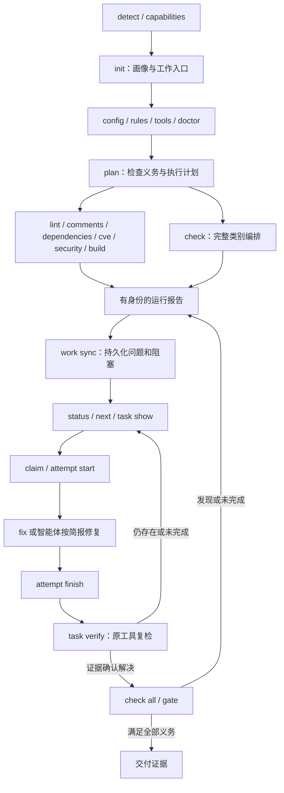
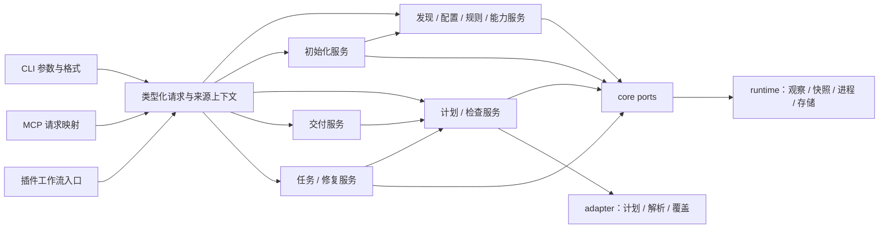
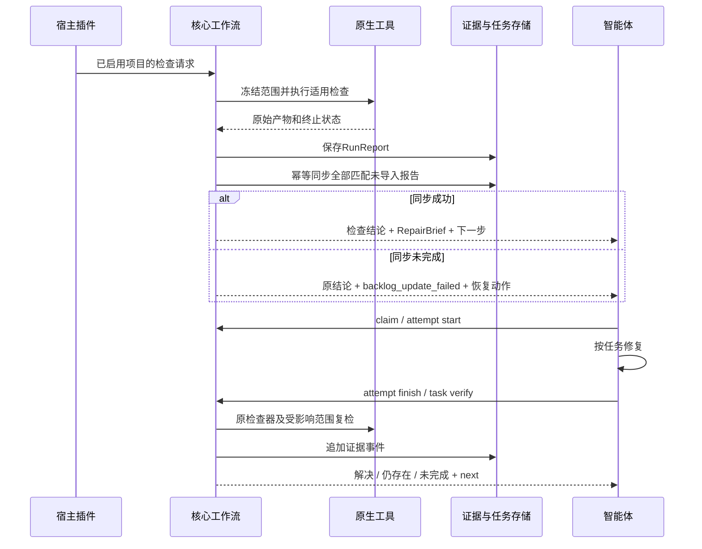
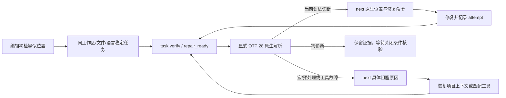
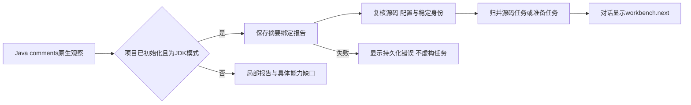

# Codeguard 命令参考与执行契约

> **文档说明：**逐指令解释价值、输入输出、副作用、失败处理和目标闭环；保留 C01–C36 追踪。
>
> **文档版本：**1.2.0 · **最后更新：**2026-10-04 · **状态：**当前切片与目标契约分别标注。

[English](Codeguard-Command-Reference.md) · [文档导航](README.zh_CN.md) · [架构](Codeguard-Architecture.zh_CN.md) · [技术方案](Codeguard-Technical-Design.zh_CN.md)

本文保留 C01–C36 的完整**目标职责契约**，供实现和评审；不是将全部目标语法当成当前可执行手册。当前调用与参数由 [README](../README.zh-CN.md#6-命令导览)、[main.rs](../crates/codeguard-cli/src/main.rs)及对应测试决定。未知组合应返回用法错误。

| 入口范围 | 当前边界 |
|---|---|
| help/version/detect/capabilities | 有公开查询；`help COMMAND` 不是当前通用子帮助能力 |
| init/config/rules/plan/tools | 局部观察/预览；init apply 为 partial，安装 apply 写入前阻塞 |
| doctor | 当前 `doctor [path] --ruff-tool ...`，不是目标 `doctor all .` 的完整多工具形式；已可保存/同步局部准备报告 |
| lint | python/java/typescript/go 与源码可选构建的 Zig 有局部入口；没有公开 lint rust，Clippy 通过 check all |
| comments/build | 当前公开 rust；Java Javadoc 走 `lint java FILE --checker javadoc`，不是 comments java |
| cve/check | rust/python/typescript CVE 与 check all/注册表规范语言ID；完整策略和交付仍未评估 |
| 工作台 | sync/status/next/show/lease/attempt/部分 verify；不正式关闭、重开或自批 |
| gate | 仅 pre-commit 路径安全预览；不是完整内容门禁 |
| fix/pre-push/ci/mcp/compat/dependencies/security | 目标通用入口未实现，不能复制目标例子直接使用 |

[已验收实现切片](../openspec/changes/introduce-rust-codeguard-cli/implementation-baseline.md)跟踪当前局部能力；[tasks](../openspec/changes/introduce-rust-codeguard-cli/tasks.md)独占完成状态。WASM 的完整统一入口仍为 S14 待办。可选 `codeguard-cli/wasm-precheck` 构建处理 `lint typescript <显式单文件>` 时，若观察到本地 ESLint 10 入口与唯一 flat config，会优先用 `PATH` 中可执行 Node 调用既有有界原生探针；缺 Node 则返回准备缺口。仅未观察到本地 ESLint 包时才输出 [TypeScript 0.3.0 候选反馈](../schemas/eslint-local-feedback-v0.3.schema.json)或 TSX 0.4.0。本地入口、包身份或配置不可信时保留具体环境阻塞，不启动 WASM。`lint java <显式单文件>` 仍输出 [Java 0.1.0 候选反馈](../schemas/java-syntax-precheck-feedback-v0.1.schema.json)。这些局部路径均不批准交付并保持退出 3；部分显式参数、Javadoc/Checkstyle 和符号链接沿用原路径，默认构建是否包含此项取决于 WASM 特性，发布包能力须以对应版本验收为准。见[原生优先局部验收](../tests/acceptance/native-first-eslint-candidate.md)与技术方案 5.3–5.4；后文未标当前的语法、退出0/1与闭环承诺均为目标契约。

同一源码构建现在也会在 `check all` 的原生节点之后输出有界 `syntax_candidates`。[反馈 0.38.0](../schemas/check-feedback-v0.38.schema.json)让 32 份固定 grammar 均能经统一入口分批被选用，同时保留原生阻塞、有界已知 grammar 限制（终端输出也限制条数）、未执行范围和未完成结论；Ruff 已完整覆盖的同摘要 Python 文件计入 `native_preferred_count`，不重复运行 WASM；`.tsx`、JavaScript、`.cfs` 与明确的 CFQuery 标签体分别路由。这仍是候选观察，不等于逐语言验收的原生兜底或自动宿主反馈，见[32 份验收](../tests/acceptance/check-all-32-grammar-candidates.md)。

对已初始化且使用规范绝对路径的 `--workspace`，TypeScript/TSX 候选回退改用[反馈 0.5.0](../schemas/eslint-local-feedback-v0.5.schema.json)：按源码范围保存同一张 ESLint 原生确认阻塞任务，仅同步成功时返回真实 `setup.task_id`。重复扫描和后续 WASM 无恢复节点不关闭任务。版本化本地报告已通过报告摘要关联有界疑似位置；能力匹配原生复检仍未接通，见[局部验收](../tests/acceptance/typescript-syntax-confirmation-task.md)。

源码构建已把 ESLint 接入 `check all` 的 `node.lint` 任务图节点，与其它原生检查共用并发与截止时间。按发现的 JS/TS/TSX 文件选择最近的模块清单、本地 ESLint 10、唯一 flat config 和 Node；搜索不越过受检根。检查阶段收集报告，汇总阶段串行同步工作台，重复发现复用同一任务。每个完整且字节匹配的原生文件可免去重复 WASM；被忽略、配置错误或工具失败的文件仍保留降级与原生原因。协议为 `check_feedback` 0.36.0、`check_aborted` 0.13.0，原协议归档；`native_results.node_lint` 提供逐文件反馈、未执行文件、同步结果及下一步。见[验收范围](../tests/acceptance/check-all-eslint.md)。这不提升 grammar 资质或代替真实宿主验收。


仅当前源码支持的 Erlang 入口：`codeguard lint erlang FILE [--erl-tool ABS_PATH] [--timeout DURATION] [--format human|json]`。支持普通 `.erl`/`.hrl` 文件；OTP 28 原生扫描/解析优先于可选 WASM；显式工具优先，否则从 PATH 绝对目录选择首个普通可执行 `erl`。所选工具的版本或执行失败不改变选择。原生故障及宏/预处理缺口保持未完成；整体退出 3，取消 130。报告使用[erlang_lint_feedback 0.2.0](../schemas/erlang-lint-feedback-v0.2.schema.json)，[验收](../tests/acceptance/erlang-native-first.md)明确区分当前源码与未包含本轮命令的公开 0.1.4 包。

当前源码：`codeguard config validate|explain [path] [--policy-candidate FILE] --format json` 返回 `config_inspection` 0.3，按构建根静态观察原生配置，保留 `configuration_ref`、`reason`、`next_action` 及来源摘要。Maven P3C 须明确制品/规则集/错误处理声明，动态 ESLint 保持 unknown；终端最多展示 12 行检查器的来源及动作。两命令只读、退出 3，`effective_rules/suppressions=unresolved`、`native_execution=not_run`、`effective_policy=null`、`quality_decision=not_evaluated`。见[实际报告与边界](../tests/acceptance/config-native-observation.md)，公开 npm 0.1.4 尚不包含此扩展。

## 1. 命令体系与协作路线



这是流程协作图，不表示每条命令在内部自动执行所有后继命令。当前已接入 CLI 检查在初始化工作区保存并同步报告；`work sync` 是显式恢复入口。插件自动串联属于待验收目标。`fix --apply` 与 `task verify` 内含必要复检；两者不是不受控的无限修复循环。

### 1.1 命令目录

下表 C01–C36 是文档追踪编号，不是对外子命令。每项在后文有独立契约。

| ID | 入口 | 用户获得的价值 |
|---|---|---|
| C01 | `help` / `--help` | 查询确实支持的参数和行为，避免智能体猜命令 |
| C02 | `--version` | 确认实际二进制身份和协议兼容范围 |
| C03 | `detect` | 观察项目语言、构建根与版本来源 |
| C04 | `capabilities` | 了解此发行版能适配的检查器；项目是否配置由 doctor/check 探测 |
| C05 | `init` | 建立项目画像、AGENTS 入口及持久修复工作区 |
| C06 | `plan` | 在执行前看清检查义务、范围、工具和缺口 |
| C07 | `doctor` | 将工具链和环境故障定位成可恢复的前置问题 |
| C08 | `rules list` | 查清实际规则的依据、来源与适用性 |
| C09 | `config validate` | 验证配置结构、引用和策略一致性 |
| C10 | `config explain` | 解释每项生效配置为何生效以及来自哪里 |
| C11 | `tools list` | 查看工具库存与项目所需工具 |
| C12 | `tools verify` | 检验实际工具制品是否符合锁定身份 |
| C13 | `tools install` | 将精确锁定的工具安装到受管位置 |
| C14 | `lint` | 检查编码规范与适用的静态质量规则 |
| C15 | `comments` | 检查可确定验证的注释与文档契约 |
| C16 | `cve` | 检查目标依赖图中的已知漏洞 |
| C17 | `security` | 检查源码、配置、敏感内容及入库安全规则 |
| C18 | `build` | 验证编译、构建一致性及策略要求的测试等级 |
| C19 | `check` | 编排指定语言的全部适用质量类别 |
| C20 | `gate pre-commit` | 检查这次实际将提交的 index 内容 |
| C21 | `gate pre-push` | 检查本次所有实际推送 ref 的内容 |
| C22 | `gate ci` | 对明确的不可变交付内容执行可信完整门禁 |
| C23 | `work sync` | 将全部未导入报告归并成稳定问题和修复任务 |
| C24 | `status` | 显示准备、检查、任务与证据新鲜度的分离状态 |
| C25 | `next` | 返回一个可推进动作及完整修复简报 |
| C26 | `task show` | 查看某项任务的证据、允许范围和历史 |
| C27 | `task claim` | 在同工作区取得有期限的任务租约 |
| C28 | `task heartbeat` | 续租并证明执行者仍持有当前租约 |
| C29 | `task release` | 释放协作占用，保留问题和历史 |
| C30 | `task attempt start` | 在修改前登记一次可追溯修复尝试 |
| C31 | `task attempt finish` | 记录实际变化、失败或无进展，防止无穷重试 |
| C32 | `fix` | 执行有界原生修复并复检结果 |
| C33 | `task verify` | 用证据判断任务是否满足关闭条件 |
| C34 | `mcp serve` | 向智能体提供同一核心能力的结构化入口 |
| C35 | `compat legacy-v1` | 显式承接旧调用协议，隔离旧语义 |
| C36 | `dependencies` | 识别依赖检查配置，运行已配置工具并反馈结果 |

### 1.2 容易混淆的边界

| 对比 | 职责区别 |
|---|---|
| detect / init | detect 返回观察结果；init 将画像、受管摘要和工作流配置形成可预览、可应用的产物 |
| capabilities / doctor / check | capabilities 回答发行版能适配什么；doctor 探测项目配置和工具条件；check 调用已配置工具并返回本次结果 |
| tools verify / doctor | 前者验证制品身份与兼容元数据；后者执行有界诊断，定位运行条件 |

## 2. 统一命令协议

### 2.1 参数与选择范围

- `[path]` 默认当前目录；先解析指定项目与构建根，不擅自扩大到上层工作区。共享目标发现与既有点路径政策，入库安全和配置发现例外保持。
- 检查类的 `<language|all>` 必填，接受注册表 canonical ID 与显式别名。`all` 是全部适用义务，不是安装所有语言工具；缺适配器不能删除义务。
- 查询/管理类支持 `--format human|json`；检查类另支持 `sarif` 与 `--output PATH`。不支持的格式在启动子进程前返回用法错误。
- 检查执行预算使用 `--jobs N`、`--timeout DURATION`、`--offline`；这些选项不改变质量要求。具体支持矩阵由同一命令 schema 生成，不能让无执行职责的命令接受后悄悄忽略。
- 不自动把 `audit`、`scan`、`repair` 等近义词解析成别的操作。初版没有独立 `test` 指令；策略要求的测试属于 build 义务，报告明确其等级。
- 命令解析只接受结构化参数；原生进程使用字面 argv。项目文本、诊断和任务 Markdown 不成为 Shell 模板或授权来源。

### 2.2 输出类型与退出语义

共用 `schema_version`、`report_type`、`operation`、`request_id`、`command_status`、`exit_code`、`warnings`、`next_actions`。检查报告继续使用既有 RunReport 顶层字段，如 `run_id/request/results/delivery_gate`，不为统一外壳丢失逐项证据。查询、计划、安装、修复及任务结果采用各自类型；不要求每个查询伪造空 findings。

`command_status=complete|incomplete|error|cancelled` 描述命令操作。一次检查发现违规仍可是 complete；报告另存 `completion`、findings 与 gate。`request_id` 标识请求，`run_id` 标识检查或诊断的证据生产运行，`task_id/attempt_id/lease_token` 标识协作对象；不能混用。

RunReport 与 doctor 的 PrerequisiteReport 均携带唯一 run_id、report_type、workspace/content/policy/tool 身份、观察范围及 freshness。导入幂等键为 workspace_id + run_id，另校验报告摘要；同键同摘要不重复写入，同键不同摘要拒绝并保留冲突。重新运行doctor产生新run_id，同一环境阻塞仍按稳定blocker身份合并，不制造第二张任务。

| 命令性质 | exit 0 的含义 | 典型非零 |
|---|---|---|
| 信息查询、plan、status、next | 请求的视图或计划已完整返回；允许明确含 unknown、待办和历史失败 | 无法读取必要来源为 3；坏参数为 2 |
| init | 计划或受管写入完成；readiness 可仍 incomplete | 写入冲突/部分落盘为 3 |
| doctor、config validate、tools verify | 本次所选验证条件满足；不是代码质量通过 | 必需条件缺失、配置无效或制品不匹配为 3 |
| 检查、gate、task verify | 选中义务完整且无阻断违规 | 违规 1，必需检查未完成 3 |
| sync、租约、attempt、安装 | 指定状态操作完成；尚有问题不改变此成功含义 | 存储、租约或安装未完成为 3 |
| fix --dry-run | 完成修复预览，不证明修复成功 | 无法得到可信预览为 3 |
| fix --apply | 应用流程和规定复检完成且无阻断违规 | 仍有违规 1，应用/复检未完成 3 |

全部操作保留 2 用法错误、4 内部故障、130 取消。执行后优先级：取消 > 内部故障 > 未完成 > 违规 > 成功；原生 raw_exit_code 独立保存。查询无法形成可信结果时不能以“已经输出错误信息”为由 exit 0。

只有 `check all` 与 `gate` 可以评估整份交付 contract。`check all` 的 allow 只绑定工作树快照，不能当作 index/ref/CI 收据。其它命令顶层不签发交付 allow；status 可展示带来源、身份、时间的历史决策，必须另示当前 freshness。无适用对象不能生成 allow。

JSON stdout 恰好一个完整文档；日志进 stderr/私有证据。MCP stdio stdout 则保留给协议消息，不直接打印 CLI JSON。公开记录脱敏；结构化 `next_actions` 带作用、前提和 argv，不将诊断原文直接升级为建议执行的命令。

### 2.3 副作用分级

| 类别 | 命令 | 允许的副作用 |
|---|---|---|
| 静态观察 | help/version、detect、capabilities、plan、rules、config、tools list/verify、status/next/show | 读取允许范围；不执行项目脚本、扫描或安装 |
| 初始化 | init dry-run / apply | dry-run 不写工作树；apply 精确写计划内画像、AGENTS 受管块、工作流记录 |
| 运行诊断 | doctor | 有界探测、私有诊断；不安装、不执行完整构建/扫描 |
| 证据执行 | 六类检查、三个 gate、task verify | 物化快照、运行工具、保存报告与缓存；verify 还追加任务事件 |
| 工作区协作 | sync、claim/heartbeat/release、attempt | sync/attempt 更新事实与投影；正常租约仅写本地 state，过期恢复另记abandoned事件，不修改源码/策略 |
| 显式安装 | tools install | 只写工具锁指定且授权的受管工具位置 |
| 受控修复 | fix dry-run / apply | dry-run 可在私有隔离副本运行修复器；apply 校验身份后修改允许文件并记录尝试 |
| 协议入口 | mcp serve、compat | 调用被映射操作；协议启动成功不等于检查成功 |

原生构建/扫描可能执行项目插件，普通本地隔离目录不等于安全沙箱；网络和可信 CI 边界遵循 [执行内核设计](Codeguard-Technical-Design.zh_CN.md)。未初始化时允许执行检查并保存私有报告，不静默创建 tracked 工作区。要求持久任务的命令须明确报告 workspace_not_initialized。

### 2.4 执行预算与默认值

当前已解析的检查预算见 [README 运行配置](../README.zh-CN.md#7-配置与原生工具)：CLI > 登记环境变量 > `.codeguard/runtime.json` > 默认值；默认 30 分钟、最多 4 路，边界 1ms–24h、1–64。runtime 1.1 支持 timeout/jobs；选中的非法字段在原生执行前拒绝。当前硬截止时间不涵盖全部发现与持久化。下面对 gate/fix/正式安装的预算是目标值，不代表公开命令已经实现。

| 运行类别 | 整次操作默认timeout | 默认并行度 / 可覆盖选项 |
|---|---|---|
| 六类检查、三个gate | 30分钟 | `min(4, max(1, 可用CPU并行度))`；支持 `--jobs`、`--timeout`、`--offline` |
| doctor | 2分钟；单个探测上限10秒且受剩余总预算约束 | 1；支持 `--timeout`，不隐式发起联网探测 |
| fix（预览或应用）、task verify | 30分钟，含规定复检 | 修复写入串行，验证沿检查并发配置；支持 `--timeout`、`--offline` |
| tools install | 10分钟 | 安装制品串行；支持 `--timeout`、`--offline`，离线只能使用已验证本地制品 |

timeout包含等待资源锁、快照、探测、执行、解析、持久化和清理预算；子任务/重试继承剩余deadline，不能每次重新获得30分钟。取消/超时触发进程树终止与回收；强制清理预留在总预算内，操作系统无法按时回收时明确cleanup_pending，不伪称完成。后台服务mcp serve本身无检查deadline，但每个请求必须按同一类别有界。

`--timeout`接受正数及ms/s/m/h单位，`--jobs`接受正整数；0、负数、未知单位或不支持的选项为2。不得以无限timeout隐藏无进展，也不得因缩短预算改变必需义务。工作区租约默认5分钟，插件建议每60秒heartbeat；长运行的FixService/验证服务负责内部续租，失租停止应用与状态提交。续租不能重置attempt预算。

## 3. 发现与准备命令

### C01 — help / --help

- **语法与价值**：`codeguard help [command...]` 或命令末尾 `--help`；提供参数、默认值、格式、退出码及最小示例，减少猜测调用。
- **行为与输出**：由命令 schema 生成静态帮助，不要求项目有效、工具已安装或网络可用。JSON 帮助如未在 schema 提供，明确拒绝，不能伪装支持。
- **失败与后继**：未知命令返回 2，列出合法入口；帮助成功不创建画像、不启动检查。

### C02 — --version

- **语法与价值**：`codeguard --version [--format human|json]`；显示 CLI 版本、构建目标、构建身份、协议 major 和规则包兼容范围，定位插件实际绑定的二进制。
- **行为与输出**：读取嵌入的发行元数据，不能联网查询 latest 或自行更新。工具、适配器实际状态继续由 capabilities/tools 给出。
- **失败与后继**：合法版本查询正常 exit 0；版本相等不是文件完整性或真实工具验收证明，继续 tools verify/doctor。

### C03 — detect

- **语法与价值**：`codeguard detect [path] [--format human|json]`；快速观察语言、方言、多构建根、清单、声明版本与源集，供 init/plan 复用。
- **输入与结果**：读取批准范围中的清单、锁与源文件特征，返回 DiscoveryReport、证据位置、未知项和观察覆盖。不执行 wrapper 或读取整台机器的开发环境。
- **当前局部实现**：发现协议 `0.4.0` 增加 `native_tool_candidates`，分别标记项目本地 ESLint 和 Maven Wrapper 的版本候选、配置损坏、链接及不完整输入。普通源码遍历排除 `node_modules`，仅对固定工具路径做有界只读观察；候选不代表已运行、已批准或 ready。
- **副作用与失败**：不写画像/AGENTS/任务。可完整回答“存在无法静态解析的条件”时 exit 0；权限错误导致必要发现范围不可读时 exit 3，并显示部分结果。
- **下一步**：需要持久接入用 init，需要知道规则能力用 capabilities，需要执行前计划用 plan。

### C04 — capabilities

- **语法与价值**：`codeguard capabilities [language] [--platform ID] [--category ID] [--format human|json]`；回答这个发行版在语言 × 类别 × 工具 × 平台上承诺什么。无筛选 JSON 返回完整能力矩阵；带筛选 JSON 返回发行版本和所选单元。
- **输入与结果**：读取发行注册表和适配器描述，返回支持/候选/计划状态、工具约束、输入粒度、报告与修复能力、已验证组合和缺口。尚未验证的工具约束或报告能力保持 gap/unknown，不从旧 lint 命令推断为已实现。
- **副作用与失败**：不探测项目、不安装工具；注册语言 planned 仍可查询成功，不能把 planned 写成已可运行。未知语言为 2；注册表损坏为 4。
- **下一步**：用 doctor 判断当前项目是否满足已实现能力的前置条件。没有实现的适配器不会因安装工具自动获得能力。

### C05 — init

- **语法与价值**：`codeguard init [path] [--dry-run|--apply] [--format human|json]`；省略模式为 dry-run，建立持久项目画像与智能体工作入口。
- **输入与结果**：复用 detect，生成带证据的语言/版本/构建/架构画像、分类型模块图、规则映射、准备任务、AGENTS 受管摘要和精确文件差异。MVC/DDD 等推断不自动成为强制约束。
- **副作用与失败**：apply 才写入自有工作区和受管摘要，保留人工文本；重复执行按输入身份刷新而不清空历史。冲突/部分写入为 3。dry-run 的任务只出现在计划里。
- **下一步**：返回 init_status 与独立 readiness；已授权插件继续 doctor/check/sync/next。完整契约见 [初始化设计](Codeguard-Project-Initialization.zh_CN.md)。

### C06 — plan

- **语法与价值**：`codeguard plan <lint|comments|dependencies|cve|security|build|check> <language|all> [path] [--format human|json]`；明确“应该检查什么、如何执行、哪些信息还缺失”。
- **输入与结果**：新鲜观察、可信策略、原生配置与工具锁形成全量义务，再选择适配器及任务 DAG。每项列目标、规则、工具身份、前置依赖、网络/资源需求、预计写入位置、缓存使用条件与未解析部分。
- **副作用与失败**：不运行检查器、解析构建模型的项目脚本、下载或安装；没有运行过就不给虚构耗时和命中率。完整返回含 blocker 的计划可以 exit 0；必要输入损坏、读不到可信策略为 3。
- **下一步**：doctor 恢复前置条件，再执行对应检查。执行时重新核对输入身份，不能直接使用过期计划。

### C07 — doctor

- **语法与价值**：`codeguard doctor [language|all] [path] [--format human|json]`；省略语言为 all，定位工具链、配置可加载性和执行环境问题。
- **输入与结果**：依据适用检查义务诊断必需运行时、制品、目标版本、权限、必要环境变量是否存在、漏洞库身份/时效及离线能力，返回 PrerequisiteReport 和结构化恢复动作。
- **副作用与失败**：只执行适配器声明、已解析身份、预算内的诊断命令；不得把任意项目 script 的 `--version` 当无副作用操作。需执行项目控制逻辑而缺少明确执行范围时标未完成，不隐式构建、安装或启动服务。默认不远程连通性探测、不读取凭据值。
- **下一步**：必需项缺失/未知为 3，可选工具缺失不误阻塞；生成可供 sync 消费的准备证据。恢复环境后重新 doctor，并运行原来被阻塞的检查；doctor 通过不证明源码质量通过。

### C08 — rules list

- **语法与价值**：`codeguard rules list <language|all> [path] [--format human|json]`；显示此项目有效规则及解释，避免只看规则名称猜检查内容。
- **输入与结果**：读取 rulepack/工具锁、批准策略和原生配置，列出 Codeguard/native rule ID、来源版本、类别、严重度、适用条件、规则依据、修复指引、已批准 suppression/例外及原因。
- **副作用与失败**：只读。动态条件未解析时标候选；不能凭名称宣称已执行 P3C。关键规则包缺失或摘要错误为 3，完整视图可带不适用规则而 exit 0。
- **下一步**：config explain 解释来源冲突，plan 显示规则实际绑定的检查任务；本命令没有 enable/disable/approve 副作用。

### C09 — config validate

- **语法与价值**：`codeguard config validate [path] [--format human|json]`；在昂贵检查前发现配置错误和未经允许的策略弱化。
- **输入与结果**：校验 codeguard.json、lock、被引用的规则和原生配置的 schema、类型、引用身份、版本兼容及批准策略约束；返回逐路径/字段的诊断。
- **副作用与失败**：不修配置、不把旧未知字段静默丢弃、不运行构建；静态无法完成的动态配置验证明确未完成。无效配置、必要引用缺失或未获批准的覆盖为 3，不报告源码违规。
- **下一步**：根据 config explain 的来源定位修复。结构正确不证明策略修订已获批准，也不证明原生检查器确实加载规则。

### C10 — config explain

- **语法与价值**：`codeguard config explain [path] [--format human|json]`；回答“为什么这项规则或范围生效”。
- **输入与结果**：返回每项运行参数、质量策略、工具锁和原生配置值的来源、覆盖关系、批准依据、拒绝的覆盖及 suppression 差异。凭据值脱敏，只展示引用名称。
- **副作用与失败**：只读。无法解析某层时给出可用的部分来源及 3，不能把默认值冒充最终有效值；已完整解释现存待办不等于修改配置。
- **下一步**：修复错误配置或提交具体的政策变更需求；Codeguard 不让智能体通过改任务文件完成政策批准。

### C11 — tools list

- **语法与价值**：`codeguard tools list [path] [--format human|json]`；对照项目工具锁显示必需/可选工具、版本约束、受管缓存及项目/系统候选。
- **输入与结果**：静态读取锁和库存，区分声明、已找到、未找到、尚未验证。未初始化项目仍可读取合法 codeguard 配置；缺少锁就明确声明“仅候选库存”。
- **副作用与失败**：不执行候选二进制、不下载、不选择较宽松版本。库存完整显示缺工具可 exit 0；库存必要元数据不可读为 3。
- **下一步**：tools verify 证明制品身份，doctor 判断能否运行，tools install 安装明确锁定的缺项。

### C12 — tools verify

- **语法与价值**：`codeguard tools verify [path] [--format human|json]`；验证工具锁要求的实际制品、规则包及声明运行时身份，防止 PATH 漂移。
- **输入与结果**：逐项核验版本元数据、平台、摘要、允许来源和可信发行证明；返回匹配、缺失、不兼容或篡改证据。只核验代码字节和元数据，不执行待核验项目脚本。
- **副作用与失败**：不下载安装；必需锁缺失或任一必需项不匹配为 3。工具身份一致不证明工具可启动或规则实际执行。
- **下一步**：缺制品用 tools install，身份正确但运行条件不明用 doctor。不能静默降级到随机系统版本。

### C13 — tools install

- **语法与价值**：`codeguard tools install --lock PATH [--dry-run|--apply] [--format human|json]`；省略模式为 dry-run，统一补齐已选定且可校验的工具链。
- **输入与结果**：精确工具锁和实际平台生成下载/安装清单，包括来源、摘要、目标目录、预计副作用及不支持项；apply 返回逐工具安装及验证状态。
- **副作用与失败**：dry-run 不联网安装；apply 才下载至受管临时位置、校验后逐制品原子发布并再次验证。不能写全局 PATH、自动提权或通过任意安装脚本接管系统；需要特殊安装程序时返回单独准备动作。锁本身必须来源可信，任意 URL+自写摘要不是授权。
- **下一步**：部分失败为 3并保留已验证的安装结果；不得留下冒充可用的半成品。随后 doctor 确认项目可使用它们；check/doctor 不隐式调用此写入操作。

## 4. 原生质量检查命令

以下六条共享语法：`codeguard <command> <language|all> [path] [--format human|json|sarif] [--output PATH] [--jobs N] [--timeout DURATION] [--offline]`。共享执行链为：建立义务 → 冻结内容 → 核验政策/工具 → 执行 DAG → 专用解析与覆盖核验 → 报告。目标检查不修改真实源码或 index。当前已接入路径在初始化工作区自动保存和同步合格局部报告；显式 work sync 可恢复，插件自动闭环仍待验收。

### C14 — lint

- **价值与范围**：执行已批准的编码规范、格式检查及一般静态质量规则。例如 Java 官方 P3C/PMD 与 Checkstyle 分开登记；格式器只有经验证的只读 check/diff 模式才计入相应能力。
- **输入与输出**：依据语言版本、模块、source set 和原生配置选择兼容适配器；每条 finding 保留 native rule ID、位置、规则依据和证据。相同原生执行可供其它类别取证，但不能凭类似文案随意去重。
- **失败与后继**：违规为 1；缺配置、解析失败或工具崩溃为 3，不能让通用 error 字样决定违规。转 work sync/next；支持确定性原生修复时再 fix。

### C15 — comments

- **价值与范围**：验证公共 API 文档覆盖、参数/返回/异常标签、链接与语法等可确定规则；按目标语言区分继承文档、生成代码、宏/注解生成成员。
- **输入与输出**：规则包声明哪些源集、可见性及文档义务适用；用原生文档工具或有验收证据的 AST 检查器取证，输出违反的具体文档契约。
- **失败与后继**：没有适配器是能力缺口，不等于“不需要注释”。纯主观文风意见不直接形成阻断发现；修复应补足真实语义，不能生成空话注释来骗覆盖率。之后原 comments 工具复检。

### C16 — cve

- **价值与范围**：审计项目真实依赖图的已知漏洞，覆盖策略规定的直接/传递、运行/开发/构建依赖范围，不审计宿主恰好安装的无关包。
- **输入与输出**：清单、锁、可证明的解析图和有身份/时效的漏洞库；结果包括生态、组件版本、advisory、依赖路径、原生严重度、修复版本信息及匹配确定性。
- **失败与后继**：网络、库过期、版本解析或匹配不确定为 incomplete并保留已确认发现，不虚构 CVE。离线同样核验库新鲜度。依赖升级由独立 fix 计划或任务处理，升级后的 CVE 与受影响构建必须复检。

### C36 — dependencies

- **价值与范围**：对每个构建根识别依赖图、版本、许可证、SBOM 和来源检查的配置；运行已配置且可用的原生检查器。未配置项给出建议，不因候选目录中有该检测族就自动要求执行。此命令不能据此宣称无 CVE。
- **输入与输出**：锁文件、构建配置和经受控解析的 effective graph；结果逐检测族保留组件坐标、解析路径、scope、规则身份和来源证据。不同构建根与源集不能由主语言的一个清单代替。
- **失败与后继**：动态版本、私服不可达、父 POM 缺失、图不完整或报告范围未知为 incomplete。已确认的版本或许可证问题仍保留，修复后由原生工具复检依赖、CVE 和受影响构建。

### C17 — security

- **价值与范围**：执行源码安全、配置/IaC、secret 内容及入库路径规则；不同规则具有不同的证据与扫描边界。
- **输入与输出**：源内容、配置和可信规则包，报告缺陷位置或脱敏敏感证据；命中 `*.pem` 等禁止入库路径只能称 repository_policy_violation，不能仅凭文件名断言泄露私钥。
- **失败与后继**：原生语义不明确或覆盖不足为 3。点路径、受管记录、生成文件不能成为入库安全逃逸位置；scope 必须按该类政策计算。任务引导修补漏洞/移除敏感内容；如需外部凭据轮换，明确恢复步骤，不把删除字符串称为已轮换。

### C18 — build

- **价值与范围**：验证依赖解析、编译、类型、打包和明确要求的生命周期检查，发现单文件 lint 无法证明的模块兼容问题。
- **输入与输出**：构建根、wrapper、目标运行时、profile/feature/target 和可信命令配置，返回逐阶段结果与 build_level、test_execution。保留已确认的静态构建默认；策略要求测试时必须执行。
- **失败与后继**：有可信编译诊断的源码错误可为 finding；磁盘不足、缺 JDK、下载失败是环境未完成。原生构建成功不能证明全部质量规则加载或测试已执行；无法核验阶段覆盖仍为 3。构建计划影响闭包决定修复后复检范围。

### C19 — check

- **价值与范围**：探测 lint/comments/dependencies/cve/security/build 的项目配置，组合已配置检查器与批准策略明确要求的检查；统一解决多工具启动、依赖顺序和结果聚合。
- **输入与输出**：逐项返回 `configured/missing/invalid/unknown`，已配置项附本次原生诊断或工具故障。候选目录不自动变成全量义务；策略必需项单独标注。宿主将结果摘要、位置或组件、修复建议及复检命令呈现在智能体对话。
- **失败与后继**：相互独立的检查继续收集证据；依赖失败的检查明确 incomplete，不跟着消失。mixed finding+missing tool 返回 3且保留二者。`check java` 只报告该语言；初版只有 `check all` 评估全项目交付 contract。
- **下一步**：独立 CLI 保存运行报告后可 work sync；已启用插件自动 sync并返回简报。工作树 allow 有内容与政策身份，不等于允许不同 index/ref 提交。

`check all` 的 Rust 节点已在同一任务图和预算内分别调用原生 Cargo check、Clippy 和 rustdoc。类型错误只进入 `rust.cargo_check` 的构建观察和稳定任务，不混作 Clippy/注释违规；缺工具、坏报告、输入变化、超时或取消保留原生结果和具体未完成原因。对话同时展示原始发现及下一步，旧有 Clippy 任务仍优先呈现，构建任务可由 `next` 单独读取。反馈协议 0.28 增加严格的 `rust_build` 字段；任务同步不代表完整构建覆盖或交付门禁已通过。

## 5. 交付门禁命令

gate 与 check 使用同一个义务/适配器/报告内核，差异是权威内容来源、入口输入与可信政策上下文。严格交付中 deny/incomplete/internal_error/cancelled 均不能放行；真实 Git Hook 将非零映射为拒绝，宿主 Hook 依宿主协议转换，不能直接透传 CLI exit=2。

### C20 — gate pre-commit

- **语法与价值**：`codeguard gate pre-commit [path] [--format human|json]`；核验将要提交的真实 index，避免工作树修好但暂存区仍旧错误。
- **输入与结果**：尊重 Git 工作目录、GIT_INDEX_FILE、部分暂存、初始提交与文件删除，冻结 tree/对象身份并执行完整交付 contract，返回 index 来源的 GateReport。
- **副作用与失败**：不 git add、不 stash、不覆盖用户 index；冲突条目、无法物化的必要对象或输入并发变化为 3。输入不是 Git 仓时不向上层工作区回退。
- **下一步**：失败说明具体源码任务或环境恢复动作；修复并按用户意图暂存后重跑。通过收据仅绑定被冻结的 index，不能防止 hook 之后任意外部修改；交付端须核对最终内容。

### C21 — gate pre-push

- **语法与价值**：`codeguard gate pre-push [path] --remote-name NAME --remote-url URL [--format human|json]`；stdin 为 Git 提供的 local-ref/local-OID/remote-ref/remote-OID 元组。
- **输入与结果**：CLI 先完整读取并验证输入，再将不可变推送集合交给 core；覆盖多 ref、非 HEAD 分支/标签、删除 ref和新 ref。remote URL 只作为上下文，不触发推送且公开输出脱敏。
- **副作用与失败**：不 git push、不默认 git fetch、不把 stdin传给探测器；本地缺必要对象时 3。每个新增/更新 ref 的全量义务保持，不用 HEAD 成功替代。删除 ref 显式记录不适用；全部删除不能签发源码质量 allow。
- **下一步**：修复实际被推送内容后重跑；真实 Hook 接线需原样传 remote 参数和 stdin。stdin缺失不能退化成检查 HEAD。

### C22 — gate ci

- **语法与价值**：`codeguard gate ci [path] --input PATH [--format human|json]`；用版本化请求文件明确 CI 本次认证的内容集合，避免 merge result 与分支头混淆。
- **输入与结果**：输入包含 schema_version、仓库身份、一个或多个不可变 commit OID、用途与预期内容来源；符号 ref仅作描述，不替代 OID。文件不授予政策权威，可信策略/工具锁由受保护接入独立提供。
- **副作用与失败**：不提交、不合并、不发布；无效参数 schema 在执行前为 2，无法获取必要对象/可信策略/执行隔离条件为 3。项目脚本不能改写可信验证器或最终状态凭据。
- **下一步**：按每个内容项和完整义务生成 GateReport；只有全部满足才 allow。失败把修复信息交回插件/CI展示；本地可写任务或缓存不能单独签发可信 CI 成功。

## 6. 问题工作区与协作命令

### C23 — work sync

- **语法与价值**：`codeguard work sync [path] [--format human|json]`；将原始运行结果转为稳定、可恢复的问题与任务。
- **输入与结果**：消费匹配工作区的全部未导入 RunReport/准备证据，逐项验证 schema、内容/规则/工具/政策/范围身份；返回导入、重复、历史、拒绝、问题新增/更新/重开/关闭计数及游标。
- **副作用与失败**：按 run_id幂等追加脱敏事件、重建任务投影并更新本地消费状态。旧报告只能进入历史，部分检查不按“没出现”关闭问题。单份报告事件提交与已消费标记形成可恢复事务；失败不能先推进游标丢掉事件，其他有效报告可先完成。
- **下一步**：next 获取动作。坏报告/存储失败返回 3并保留原始证据；再次执行从未完成单元恢复。同步成功不说明 backlog 已清空，也不重新计算质量 gate。

### C24 — status

- **语法与价值**：`codeguard status [path] [--format human|json]`；快速判断项目现在卡在哪里。
- **输入与结果**：只读汇总 initialized、画像 freshness、必需前置条件、最近运行的身份/覆盖、待导入报告、finding/blocker/任务状态、租约及冲突。
- **副作用与失败**：不 doctor、不扫描、不 sync、不修改状态。可返回“未初始化”或“还有10项问题”并 exit 0；无法读取可信视图时 3。
- **下一步**：返回精确缺项：先 init、先同步、先恢复环境、继续 next 或需要完整检查。历史 allow 必须标明证据来源及是否仍匹配，不能作为当前绿色徽标。

### C25 — next

- **语法与价值**：`codeguard next [path] [--format human|json]`；选择一个能够推进工作的动作，返回理由和 RepairBrief。
- **输入与结果**：依据任务依赖、严重度、准备状态、有效租约、动作历史与预算。优先解除影响多项检查的前置阻塞，但严重问题始终可见。返回 `disposition=actionable|waiting|needs_decision|verification_required|no_applicable_work`。
- **副作用与失败**：不领取、不运行动作、不更新过期状态；只做只读推导。无可行动任务与“全部通过”不同：全部被租用返回 waiting，预算耗尽返回具体决策，任务空但缺新鲜完整检查返回 verification_required。未初始化返回初始化动作/临时简报。
- **下一步**：actionable给出允许范围、规则证据、步骤、历史和复检条件；执行者另行 claim。只要完整回答就可 exit 0，不得让插件把 null task解释为允许交付。

### C26 — task show

- **语法与价值**：`codeguard task show <task-id> [path] [--format human|json]`；读取指定任务的完整修复上下文。
- **输入与结果**：稳定 issue、事件父关系、当前内容/政策身份和可重建投影，显示证据、状态、允许修改范围、依赖、尝试、关闭条件和租约。
- **副作用与失败**：不信任 Markdown勾选；任务不存在、事件链损坏或作用区不符返回 3，ID语法错误返回 2。resolved任务也保留历史和 freshness。
- **下一步**：claim后按简报修复，或原工具 verify；不能通过 show执行仓库诊断中的命令。

### C27 — task claim

- **语法与价值**：`codeguard task claim <task-id> [path] --owner ID [--format human|json]`；防止同工作区两个执行者同时修同一任务。
- **输入与结果**：在跨进程锁下核对任务、前置状态与租约，返回不可复用的 lease_token、generation、expires_at和当前任务身份；owner是审计标签，单凭同名 owner不能操作新租约。
- **副作用与失败**：正常领取只更新本地 state。有效租约已存在为 3并返回等待信息，不强抢；过期租约若有未结束attempt，须先在可恢复事务中追加abandoned事件和预算记录，再换新generation。恢复存储失败返回3，不先取得新租约后假定历史已经补齐。
- **下一步**：携带token调用 heartbeat/attempt/release；租约不授权修改超出简报的源码，更不授予策略变更权。跨机器全局独占不在初版保证内。

### C28 — task heartbeat

- **语法与价值**：`codeguard task heartbeat <task-id> [path] --owner ID --lease-token TOKEN [--format human|json]`；续租当前仍有效的任务占用。
- **输入与结果**：锁内核对 token/generation、owner、作用区与到期条件，返回新的 expires_at。续租周期由工作流运行配置给出，不由质量阈值推导。
- **副作用与失败**：只改state。失效token、已过期/已替换租约返回 3，不能复活旧持有者；调用方停止继续写入，重新读取任务状态。
- **下一步**：继续当前有界尝试。heartbeat只证明协作存活，不能重置无进展预算或延长无限重试。

### C29 — task release

- **语法与价值**：`codeguard task release <task-id> [path] --owner ID --lease-token TOKEN [--format human|json]`；显式结束占用，允许下一个执行者接续。
- **输入与结果**：验证当前租约并返回释放状态；相同已完成释放请求可幂等重放，新租约存在时旧token不能释放它。
- **副作用与失败**：不关闭问题、不删除attempt。存在未finish尝试时正常release返回 3，要求先记录失败/blocked等真实结尾；崩溃后的到期恢复将其记abandoned。
- **下一步**：next继续其他任务或等待。release成功不证明修复完成。

### C30 — task attempt start

- **语法与价值**：`codeguard task attempt start <task-id> [path] --owner ID --lease-token TOKEN --action-id ID [--format human|json]`；在实际修复前记录本次准备尝试什么。
- **输入与结果**：action-id来自RepairBrief的受控动作/recipe标识；自由代码修复使用明确的manual-code-edit动作类型并引用任务允许范围。CLI观察前置内容和环境证据，生成attempt_id、动作指纹、前置摘要及可用预算。
- **副作用与失败**：追加开始事件；同任务只能有一项未结束尝试，过期租约、范围不符或相同动作预算耗尽返回 3。动作ID不可被调用方任意换名来重置预算，指纹由规范化动作、范围和输入决定。
- **下一步**：执行该修复，再finish。失败发生在运行修复器之前也必须记入历史。

### C31 — task attempt finish

- **语法与价值**：`codeguard task attempt finish <task-id> [path] --owner ID --lease-token TOKEN --attempt-id ID --outcome <ready-to-verify|no-change|failed|blocked> --note-code <source_edit|tool_restored|no_change|execution_failed|blocked> [--format human|json]`。
- **输入与结果**：精确匹配begin事件、作用区和租约，CLI观察后置内容/patch或相关环境探测证据；返回观察变化与执行者说明两份信息、耗用预算及下一步。
- **副作用与失败**：追加结束事件、更新任务投影；同attempt同结果幂等返回，冲突finish返回 3。若结束收据已落盘，原请求的重放仅返回该收据，即便租约后来到期也不再写事件或改变新租约；不存在已结束收据时必须持有当前有效租约。ready-to-verify只表示可进入复检，不能写resolved；调用方说no-change但实际有变化时拒绝该结果并要求重新说明。
- **下一步**：task verify取得证据。租约中断但尚未验证的修改保留，恢复协议记录abandoned及当前事实，不自动回滚别人修改。

## 7. 修复与复检命令

### C32 — fix

- **语法与价值**：`codeguard fix <language|all> [path] --category <lint|comments|dependencies|security|cve> <--dry-run|--apply> [--task TASK_ID] [--owner ID --lease-token TOKEN] [--format human|json]`；调用已声明的确定性原生修复器，把可机械修复的问题安全落到代码。
- **输入与结果**：真实发现、匹配的工具/规则/内容、允许修改范围和recipe形成FixPlan。dry-run可在私有隔离副本运行修复器以产生真实补丁，但不改变项目源码、tracked任务或尝试预算；不能运行的预览明确为计划而非已生成补丁。
- **执行与副作用**：apply确认适用范围和前置哈希，已初始化时按同一租约/attempt协议登记，隔离执行→核对变化范围→逐文件安全应用→原工具及受影响义务复检→写尝试/验证事件。未初始化时保留私有操作证据和临时简报，不声称产生持久任务。
- **任务绑定**：`--task`将修复限定到该任务允许范围；它的语言/类别须与请求匹配。已有claim时必须同时传owner和token，复用租约但不接管已有未结束attempt；FixService登记自己的受控attempt，结束后不释放调用方租约。未持有租约时可只传task，由服务自行claim并在收尾时释放。已初始化且无task的批量apply先同步所用发现、映射受影响任务，并在同工作区事务中取得全部所需租约；任何冲突在应用补丁前返回3，不能悄悄跳过被占用任务。未初始化路径仅保留私有证据，不调用持久同步或任务租约服务；此时指定task须返回workspace_not_initialized。owner/token参数成对出现且要求task；dry-run只读任务，不领取或消耗预算。
- **失败与后继**：没有原生修复能力返回3及人工修复简报；不偷偷让模型改代码或转成关闭规则。并发修改、越界补丁、部分应用、复检超时分别记录；多文件写入不伪称全原子。只回滚自己拥有且未被后续改动的内容。
- **成功定义**：分别给出execution_succeeded、changed_files、verification和resolved_issue_ids；修复器exit0或无变化都不能得到fixed=true。存在其他必需违规时保留它们；单项修复成功不授权完整交付。

### C33 — task verify

- **语法与价值**：`codeguard task verify <task-id> [path] [--owner ID --lease-token TOKEN] [--format human|json]`；判断指定任务的关闭条件是否真的满足。
- **输入与执行**：依据issue、规则/工具/政策身份和影响闭包重建验证计划，冻结当前内容后运行原检查器。环境任务先验证恢复条件，再重跑原来受阻义务；探测到JDK不等于项目已能通过构建。
- **协作与副作用**：无租约时使用短期验证租约；若已有租约则要求对应token，不能冒用owner。不修改源码，持久保存运行报告并幂等同步相关发现和验证事件；结束时只释放本次自行取得的验证租约。
- **判定与失败**：完整证据确认解决才追加code_fixed/dependency_fixed/environment_restored等状态；目标删除和政策处置必须有批准且可核验的独立依据。仍存在为1；覆盖不足、工具不可用、并发变化为3。若原问题解决但复检引出其他违规，原任务可按证据关闭，新发现同步保留，命令仍按本次验证结果返回1/3。
- **下一步**：next推进剩余任务；无剩余任务也须check all/gate完成交付检查。不提供task close --force。

## 8. 宿主入口与兼容命令

当前已有局部只读入口 `codeguard hook plan [--format=json]`，从 stdin 读取最多 64 KiB 的 [`hook_trigger_request` 1.0.0](../schemas/hook-trigger-request.schema.json)，返回 [`hook_trigger_plan` 1.1.0](../schemas/hook-trigger-plan-v1.1.schema.json) 与退出码 3。确认成功的编辑最多选择 8 个不同路径、单路径 512 字节及总计 2 KiB 作逐文件快检；超预算返回 `fast_scope_budget_exceeded` 并要求重新确定有界批量范围，不截断后假称已检查，也不能反复提交同一超预算列表。旧 [1.0 响应 schema](../schemas/hook-trigger-plan.schema.json)保留供历史消费者识别。`execution=not_run`、`delivery_decision=not_evaluated` 固定，尚未调用检查器、取得 Git 快照或阻断任一宿主。它不是下述完整宿主接入的验收证明，见[局部验收](../tests/acceptance/hook-plan-cli-candidate.md)。

已提供独立的 Python 执行切片：`codeguard lint python . --file src/changed.py --format json`。`--file` 可重复，但遵守同一 8 文件/512 字节单路径/2 KiB 总路径预算；只扫描被发现且精确选中的 Python 文件，未发现目标保留未完成原因。默认 CLI 对话报告为 `python_lint_feedback` 0.13，返回 `scan_scope=selected_files` 和 `requested_paths`。源码可选构建在 Ruff 不可用或未声明时可返回 0.14 的有界 Python WASM 疑似位置；已初始化工作区的单文件范围同步成功后返回 0.15 的真实稳定原生确认任务 ID，失败则显示持久化原因且任务 ID 为空。原生反馈和 `delivery_decision=not_evaluated` 保留；局部反馈不作为完整工作台扫描导入。原 0.12 报告 schema 保留供历史结果识别；`check all` 的嵌套 Python 结果未因此升级。目前 `hook plan` 尚未自动调用它；其它语言、宿主入口和批量范围执行仍待接线。

现有局部执行入口 `codeguard hook execute PATH --timeout DURATION --format=json [--ruff-tool ABS_PATH] [--git-tool ABS_PATH]` 从 stdin 接收同一 `hook_trigger_request` 1.0.0。超时必须显式提供且不超过 120s。启动事件只读发现；Stop 只读最多 64 个 finding 和 64 份报告，报告字节总预算为 8 MiB，返回不调用检查器的 `hook_next_guidance`。记录超预算返回 `not_run/guidance_scope_exceeded`，需要显式执行 `codeguard next PATH --format=json`；无任务时要求新鲜完整检查，不能视作通过。`repair_ready` 先将单任务历史限制在 128 项和 1 MiB，再按稳定任务 ID 复用现有 `task verify`，通过有界子进程按原检查器复检；任务缺失、历史超限或子进程失败保留未完成。对话仅返回任务/检查器身份、观察结果、事件是否保存及有界原因，原生完整报告仍在既有本地复检路径中。`task verify` 的显式工具参数可传给 `hook execute`，其它事件收到这些参数会拒绝，但成功编辑事件也允许 `--node-tool` 指定 Node。确认成功的编辑事件先执行所选 Python/Ruff、JS/TS/ESLint，再补充可选 WASM 候选观察。显式给出 Git 二进制后，`pre_commit` 读取本轮真实暂存 index（含替代 `GIT_INDEX_FILE`），Git 观察本身的截止时间取传入预算与 15s 较小值；`hook_git_index_summary` 给出 index 身份、违规总数、最多 32 个且每个至多 512 字节的路径、截断状态与对象状态，同时 `source_check=not_run`，不证明完整质量覆盖。Git 缺失或 index 观察失败仍为 `not_run`。失败/未知写入、推送和 CI 仍保持 `not_run`。外层 `hook_execution_feedback` 升为 0.6，历史 0.1–0.5 schema 保留；`prompt_submitted` 仅返回固定的 `read_only_intent_guidance`，不运行源码检查、不签发交付结论；即使宿主声称可阻断，也固定 `host_blocking_verified=false`、`delivery_decision=not_evaluated`。该命令还没有被插件 Hook 自动调用，不能代替严格门禁。

Claude Code 候选软适配入口为 `codeguard hook claude <session-start|user-prompt-submit|post-tool-use|post-tool-use-failure|stop> PATH --timeout DURATION --format=json [--ruff-tool ABS_PATH]`。它从 stdin 读取至多 1 MiB 宿主 JSON，并校验事件名和工作目录。SessionStart 只读发现；UserPromptSubmit 只返回固定、非阻断的检查时机建议，不解析提示词或运行检查器；成功的 Write/Edit/MultiEdit 仅接受项目内普通文件，在同一 Rust 进程复用编辑执行器；PostToolUseFailure 走不检查源码的路由，绝不回显工具错误。Stop 有界读取本地事实，不运行检查器或读取可编辑任务正文；首次 Stop 有稳定任务时用 `hookSpecificOutput.additionalContext` 继续一次，已在 Stop 后继续或无任务时仅发 `systemMessage`，避免反复唤醒。局部编辑反馈最多 1200 字符，宿主退出 0 不表示检查通过。重复键、超预算、路径缺失/逃逸及事件不符均明确提示未运行。独立插件尚未调用这些候选入口，见[局部验收](../tests/acceptance/claude-post-tool-hook-candidate.md)。

### C34 — mcp serve

- **语法与价值**：`codeguard mcp serve`；初版通过stdio提供结构化工具入口，供支持MCP的宿主复用统一内核。
- **输入与结果**：宿主工作区与每个工具请求映射为同样的项目、选择、内容和运行选项；具体MCP tool names/schema由S11锁定并生成映射表。旧MCP工具名只能使用显式版本化映射。
- **执行与失败**：serve仅启动协议服务，不自动初始化项目、扫描或安装。读写行为遵循对应核心操作。单请求的1/3/4/130作为结果语义返回，不把每个检查失败变成服务器进程退出；协议非法参数用MCP适配层错误表达，不混进工具日志。
- **下一步**：已启用工作流的MCP扫描请求走scan→sync→brief；独立低层执行请求明示是否同步。取消传播至同一进程/快照运行时；服务关闭回收自身请求，不清空用户任务。

### C35 — compat legacy-v1

- **语法与价值**：`codeguard compat legacy-v1 <旧子命令与参数>`；为旧宿主迁移保留明确版本边界。
- **输入与结果**：按旧入口的逐项协议映射参数、退出码与字段，标明protocol=legacy-v1、实际runtime和未认证边界。不能用一张通用退出码表覆盖旧check/CVE等差异。
- **映射依据**：[legacy-v1 逐入口协议表](Codeguard-Legacy-Compatibility.zh_CN.md)分别列出七类旧 CLI、四个 MCP 工具、五类 Hook 的数字、字段与混合优先级；Rust 参数契约不把兼容出口升级为交付 allow。
- **副作用与失败**：保留的旧写行为须由对应旧动作明确触发；新入口失败不自动回退到此命令。缺兼容运行时说明未完成，不安装旧环境自救。
- **下一步**：逐入口迁移到Rust标准协议并验收。旧成功不生成新交付allow，旧skipGate变量也不授权新入口跳过检查。

## 9. 内部应用服务与执行架构



这是调用关系；编译依赖仍是CLI装配、runtime/adapters依赖core，core不导入基础设施。命令处理器只做参数转换、调用服务和输出映射，不能各自实现一套扫描或gate。

| 核心应用服务 | 命令 | 可复用能力 / port |
|---|---|---|
| CatalogService / ProjectObservationService | detect、capabilities、rules、config、tools list | Registry、ObservationPort、PolicySourcePort |
| InitializationService | init | 画像构造、OwnershipManifest、WorkspaceStore、受管文本合并 |
| PreparationService / ToolchainService | doctor、tools verify/install | ToolchainPort、ExecutionPort、ArtifactInstallPort |
| PlanningService / CheckService | plan、六类检查 | 义务账本、Adapter、SnapshotPort、ExecutionPort、EvidenceStore、CachePort |
| DeliveryService | 三个gate | 内容请求解析、可信策略、CheckService、完整性判定 |
| RemediationService / TaskQueryService | sync、status、next、show | 事件归并、修复简报、RemediationStore |
| TaskLeaseService / AttemptService | claim、heartbeat、release、attempt | 跨进程事务、租约generation、幂等事件、预算 |
| FixService / TaskVerificationService | fix、verify | 受控补丁、AttemptService、CheckService、验证事件 |

这些是逻辑边界，不要求一条命令新建一个crate。实体、值对象和纯判定在core；I/O由ports注入；运行结果进入同一渲染与协议层。新服务名称不代表已有可编译实现。

### 9.1 插件自动闭环



插件调用同一核心工作流API，不必为每个步骤启动一次二进制，也不复制状态机。同步失败影响工作流完成状态，不能改写已取得的quality gate；因此可能同时出现“检查已得出明确结论”和“任务保存未完成”。严格交付如何显示宿主错误由入口协议处理，不能据存储失败假造源码违规。

### 9.2 并发、取消与恢复

- 查询使用一致性视图；写操作带工作区身份、对象版本/事件父关系和幂等键，避免读到一半的新状态。
- lease_token包含不可复用的租约身份和generation。旧进程同名owner不享有新租约；失租后只能保留诊断，不能提交状态事件。
- run_id导入、attempt结束、租约释放各自定义幂等域；“再次执行”不等于再次写一份相同任务或历史。
- 取消传播到进程树和执行DAG。已完成证据保留，未完成部分明确标识；不能因为用户取消就删除finding或伪造finish成功。
- 多文件应用、初始化、安装允许部分完成，但记录精确恢复位置。任何rollback都只处理本次拥有且未被别人改动的内容。

## 10. 典型调用旅程

### 10.1 首次接入

```bash
codeguard detect . --format json
codeguard capabilities java --format json
codeguard init . --dry-run
codeguard init . --apply
codeguard config validate .
codeguard plan check all . --format json
codeguard doctor all . --format json
# 仅在需要安装并具有对应授权时，使用实际工具锁路径执行以下两步。
codeguard tools install --lock codeguard.lock.json --dry-run
codeguard tools install --lock codeguard.lock.json --apply
codeguard tools verify .
codeguard doctor all .
codeguard check all . --format json
codeguard work sync . --format json
codeguard next . --format json
```

这是顺序示意，调用方必须消费每步结果并处理失败，不能无条件执行整段。非安装问题按doctor给出的具体动作恢复；未满足必需前置条件不代表可以跳过检查。

### 10.2 智能体修复单项任务

以下ID/token是协议占位符，实际值取上一条JSON结果；插件实现使用结构化传参，不解析human文本。

```text
codeguard task show CG-abc123 . --format json
codeguard task claim CG-abc123 . --owner agent-session-1 --format json
codeguard task attempt start CG-abc123 . --owner agent-session-1 --lease-token <lease-token> --action-id <brief-action-id> --format json
按任务允许范围修复，长任务期间携带同一token调用heartbeat
codeguard task attempt finish CG-abc123 . --owner agent-session-1 --lease-token <lease-token> --attempt-id <attempt-id> --outcome ready-to-verify --note-code source_edit --format json
codeguard task verify CG-abc123 . --owner agent-session-1 --lease-token <lease-token> --format json
codeguard task release CG-abc123 . --owner agent-session-1 --lease-token <lease-token> --format json
codeguard next . --format json
```

若采用`fix --apply`，在claim后调用`fix ... --task CG-abc123 --owner agent-session-1 --lease-token <lease-token> --apply`，由FixService登记受控尝试并复检，不再由插件为同一个原生修复重复start/finish。不要先创建未结束的自由修复attempt再移交给fix；外层回合可关联子attempt但不重复计数。原生修复未支持时使用上述自由修复路线。

### 10.3 交付

```text
本地修复完成 → check all（工作树证据）
用户选择暂存内容 → gate pre-commit（index证据）
实际推送ref输入 → gate pre-push（ref证据）
受保护CI指定不可变OID → gate ci（可信交付证据）
```

完整检查可以按严格身份复用有效执行结果，但每个入口重新计算自己的交付条件；不同来源的“通过”不能互相替代。

## 11. 实现追踪与验收标准

| 命令范围 | 对应规格 | 实现任务阶段 |
|---|---|---|
| C01–C04、C06、公共参数/输出 | unified-cli-contract、native-tool-adapters | S01、S02、S05 |
| C05 | project-initialization、remediation-workflow | S09 |
| C07、C11–C13 | native-tool-adapters、execution-kernel、unified-cli-contract | S05 |
| C08–C10 | rulepack-governance、unified-cli-contract | S04 |
| C14–C19 | unified-cli-contract、native-tool-adapters、verdict-integrity | S02、S06–S08 |
| C20–C22 | execution-kernel、hook-protocol、unified-cli-contract | S03、S11 |
| C23–C31、C33 | remediation-workflow | S09 |
| C32 | execution-kernel、remediation-workflow | S10 |
| C34–C35 | unified-cli-contract、hook-protocol、binary-distribution | S02、S11 |
| C36 | unified-cli-contract、native-tool-adapters | S02、S05、S06–S08 |

所有命令都要验证：参数合法/非法、支持格式、退出语义、允许副作用和未初始化行为；有状态命令另测并发、取消、重放与恢复。重点反例：

1. 查询next没有任务，但缺乏新鲜全量证据：必须返回verification_required，不能allow。
2. plan列出缺JDK仍正常完成计划，doctor返回未完成：两者无矛盾，不能把plan exit0当就绪。
3. tools身份验证通过，但JDK不能启动：doctor未完成，check不得假通过。
4. lint与CVE先后产生报告：sync消费全部；重复sync不重复tracked事件。
5. 旧租约失效后新执行者领取：旧heartbeat/finish/release不能修改新状态。
6. 修复器exit0但无变化、部分应用后超时：不能宣称fixed=true或清空原finding。
7. 原任务修好但引入另一违规：原问题按证据关闭，新问题保留，不能宣布全项目通过。
8. 工作树通过但暂存区旧内容失败，或推送非HEAD分支失败：对应gate阻断。
9. tools install默认预览不下载；显式apply部分失败后重试只处理未完成且身份匹配项。
10. MCP某请求超时而服务仍存活：该请求结果未完成，不能以服务器活着证明检查成功。
11. check得到真实违规但sync写盘失败：保留原违规，另报工作流错误和恢复动作。
12. compat返回旧数字成功：新CI不能据此签发allow。

help、参数schema、命令矩阵、CLI/MCP映射与测试样本应由同一注册定义生成并检查漂移；各命令是否具备真实工具验收另行记录。本文完整不代表36项入口已实现，也不替代后续全部语言和平台验收。

源码新增编辑事件原生优先快检：`hook execute` / `hook claude post-tool-use` 只检查事件明确指定的普通文件，Python 用 Ruff、JS/TS 用模块本地 ESLint 10；同字节完整原生结果不重复解析。未覆盖文件可调用固定 WASM 候选，混合语言仍保留局部结果、原生未接线范围和失败原因。疑似恢复节点要求安装或修复原生工具并确认；完整零恢复候选只建议安装，不代表完整通过。共享事件截止时间，最多 8 文件、2 个 WASM worker；未构建 WASM 明确报告缺口。外层反馈 0.7.0，局部 `hook_fast_feedback` 0.2.0。候选任务已接入现有工作台；默认插件 Hook、能力匹配自动关闭和真实宿主验收未完成。见[编辑快检验收](../tests/acceptance/hook-fast-native-wasm.md)。

源码编辑快检现将有恢复节点的固定 WASM 候选同步到既有 `.codeguard/` 工作台：按工作区/文件/语言稳定归并，Python 与 JS/TS 复用原有确认或准备身份。报告保存固定 grammar、源码 SHA-256、已知限制和原字节疑似位置；导入拒绝身份或坐标失配、重复 JSON 键。只有实际同步成功才给出任务 ID；完整零恢复不创建新的必需任务；无定位但恢复扫描未完成时创建检查恢复任务。两者都不能关闭旧任务。对话提供 `task show` / `task verify`，缺原生确认 adapter 明确反馈能力缺口。外层 Hook 协议为 0.7.0，局部为 0.2.0；通用 `next` 简报用 0.3.0，已有检查器仍返回 0.1.0。默认插件 Hook、能力匹配关闭和真实宿主验收仍未完成。


### Zig 确认任务的原生复检

源码构建现可执行 `codeguard task verify TASK_ID . --zig-tool /absolute/path/to/zig --format=json`，复检已持久化的 Zig WASM 确认任务。`hook execute` 的 `repair_ready` 事件接受同一显式工具参数，复用现有租约和已结束的尝试关联。`lint zig` 原生路径不依赖可选 WASM 特性；未构建该特性时，回退明确报告缺失。

固定 Zig 0.16.0 探针在共同截止时间内执行 `version` 与 `ast-check --color off`，以 stdin 检查本轮原始源码字节。当前原生诊断使简报指向源码修复；工具缺失、版本不支持和执行失败仍指向环境恢复或具体决策。新鲜的 `next` 简报在复检 argv 中携带未改变的工具路径；源码或工具字节变化使旧诊断指引失效。报告与尝试继续保存在既有工作台，不另建任务系统。

原生观察协议为 `syntax_task_recheck` 0.1.0，外层 `task_verification_preview` 为 0.12.0；通用修复简报为 0.3.0，原 0.2.0 简报与 0.11.0 复检 schema 原件保留。原生 AST 零诊断记录为 `candidate_absent_unverified_policy`：解除本地尝试的待复检状态，但不关闭任务，不认证项目 lint、构建或交付。Erlang 现通过显式 OTP 28 接入同一工作台，独立协议版本见 [Erlang 任务验收](../tests/acceptance/erlang-native-task-verification.md)；其余通用语言的原生确认 adapter 仍缺。见[验收记录](../tests/acceptance/syntax-native-task-verification.md)。

简报同时提供最新原生报告引用/摘要和当前诊断位置；输入失效后不再投影这些位置。编译入二进制的不可变 grammar 校验结果仅在进程内复用，外部清单、源码和原生工具仍按当前字节复核。


### Erlang 确认任务与原生修复指引（当前源码）

`codeguard task verify TASK_ID . --erl-tool /absolute/path/to/erl --format=json` 和 `hook execute . --erl-tool /absolute/path/to/erl` 的 `repair_ready` 事件现复用已有 `.codeguard/` 任务、租约、尝试记录与共享截止时间，执行与 `lint erlang` 相同的 OTP 28 原生 forms 解析。工具和任务语言在租约或启动进程前核对，不启动项目源码、宏展开或 parse_transform。



Erlang 原生观察使用 `syntax_task_recheck` 0.2.0，复检反馈为 `task_verification_preview` 0.13.0，复检后的 `next` 简报为 0.4.0；Zig 和历史 schema 原件不变。简报新增 `native_confirmation_reason`，缺工具给出明确 OTP 28 准备动作；宏/条件编译给出项目原生预处理/编译需求。源码变化会清空当前诊断并要求复检；工具改变会移除旧工具 argv。只有版本已观察为 OTP 28 且摘要仍一致的工具可复用，过旧工具不能被建议为已就绪工具。

原生零诊断记录为 `candidate_absent_unverified_policy`，解除关联尝试的待复检状态，但不关闭任务或签发交付许可；两次无进展沿用既有预算，转为具体决策而不是重复修复。当前限定可信关闭 API 已扩展到 Erlang 源码 SDK，默认宿主仍缺受保护策略接线；Erlang 项目完整 lint/预处理、原生发现的完整生命周期、自动工具发现及实际宿主发行尚未完成。公开 npm 0.1.4 不含此扩展。[验收与协议](../tests/acceptance/erlang-native-task-verification.md)。

Erlang `repair_ready` 使用 Hook 0.8.0 / 内层摘要 0.2.0，直接包含当前原生位置、具体未完成原因、Unicode 字符列单位和已保存报告引用；其他 Hook 版本保持不变，实际安装宿主对话交付尚未验收。

### 统一入口的 Erlang 原生优先检查（当前源码）

```bash
codeguard check all . --format=json
codeguard check all . --erl-tool /absolute/path/to/erl --timeout 30s --jobs 2 --format=json
```

`erlang.lint` 节点选择显式工具或 PATH 绝对目录中的首个可执行 `erl`，复用已有受控 OTP 28 scanner/parser。每轮最多观察 64 个普通 UTF-8 文件，每文件不超过 1 MiB，沿用请求总截止时间和任务图并发预算。`native_results.erlang_lint` 提供当前源码摘要、诊断位置、工具选择、逐文件下一步及采用绝对源码路径的原工具复检 argv，可从项目外直接重放；超出原生预算的范围明确计入未观察数。

只有完整、非预处理、源码与工具字节都匹配的 forms 观察才跳过重复 WASM。工具缺失保留候选初检；所选工具失败仍可伴随补充候选观察，但原生阻塞不会被洗成成功。宏/条件编译继续未完成。源码或工具变化会撤回受影响文件的当前定位和可复用 argv。项目范围变化设置 `scope_stable: false` 并保留仍与当前字节匹配的单文件诊断，同时撤回整体范围完整性。SIGINT 保持退出 130；JSON、human 和保守 SARIF 保留原生发现，不签发项目通过。

该早期无任务投影增量的协议分别为 `check_feedback` **0.36.0**、`check_aborted` **0.13.0** 和内嵌 `erlang_forms_scan` **0.1.0**；旧聚合 Schema 逐字节保留。forms 局部完整不等于项目 lint、构建和测试完整。原生发现的任务持久化与可信关闭仍未实现，报告明确 `task_id: null`，不伪造任务。已有 WASM 来源的 Erlang 确认任务继续使用独立 `task verify` 流程。公开 npm 0.1.4 不含本轮聚合能力。见[验收记录](../tests/acceptance/check-all-erlang.md)。

### Cargo 输入与代理入口边界（当前源码）

Clippy 的普通扫描及同规则 `--force-warn` 对照使用 `cargo clippy --locked --offline --all-targets --message-format=json`。缺少根 Cargo.lock 时，在原生启动前返回 `cargo_lock_unavailable`，不生成锁文件。源码指纹取自启动前的有界快照；已观察源码、清单、锁、根 Clippy/Cargo/工具链配置或原工具改变时撤回本轮 Clippy finding，保留准备/重扫任务。稳定输入下的部分有效诊断仍保留，不能把损坏报告称完整。

Cargo 为 rustup 等按入口名称分派的代理时，Clippy、rustdoc 与构建检查保留所选 Cargo 路径执行，同时核验解析目标的字节及运行后身份。私有 Clippy 输出目录以独立序号防止同时间戳碰撞。该边界只覆盖已观察输入，不证明完整 Cargo 生效配置、所有构建组合或进程沙箱；局部零诊断仍不能自动关闭任务。测试、失败记录和真实输出见 [Cargo 输入验收](../tests/acceptance/rust-clippy-input-stability.md)。公开 npm 0.1.4 尚不包含本批修改。


### 已安装 Cargo 自动发现（当前源码）

`check all`、`comments rust`、`build rust` 及其 Cargo 任务复检接受可选 `--cargo-tool`。未指定时，从调用方 PATH 的绝对目录中选择首个普通可执行 `cargo`；空目录、相对目录和不可执行入口不作为候选。显式无效工具或已选工具执行失败保留具体阻塞，不换用下一个 Cargo。聚合 Rust 检查共用本轮已选入口。

最终 `cargo` 入口名保留，以兼容 rustup 按名称分派；既有解析后字节和运行后目标身份校验继续执行。子进程保留 `RUSTUP_TOOLCHAIN`，并固定 `RUSTUP_AUTO_INSTALL=0`，即使调用方设置为 `1`。Cargo 的 `--locked --offline` 不独立约束 rustup 安装工具链；[rustup 官方说明提供单独控制](https://rust-lang.github.io/rustup/environment-variables.html)。缺工具链仍是环境故障，不生成源码违规，也不自动安装。本项不证明完整工具链、有效 Cargo 配置、全项目覆盖或可信任务关闭。

受控代理/不换工具反例及实际已安装/缺工具链观察见 [Cargo 自动发现验收](../tests/acceptance/cargo-native-discovery.md)。公开 npm 0.1.4 不包含本次源码变更。


### 项目根 Ruff 工具发现（当前源码）

已配置Python扫描的 `lint python`、`check all`、指定编辑Hook执行及同根任务复检，依次选择显式 `--ruff-tool`、受检根 `.venv/bin/ruff`、调用方绝对PATH目录中的可执行入口。不激活Shell环境、不枚举安装包、不安装Ruff；本地入口沿既有原生链路探测版本、固定并复核字节。普通本地目录/入口不存在时可继续PATH；父目录链接/非目录、损坏或不可执行入口返回 `ruff_local_tool_invalid`，不静默换用全局Ruff。所选工具版本/执行失败不尝试其它工具。

损坏本地环境生成一张稳定准备任务，包含 `.venv/bin/ruff` 证据、限定环境修复范围、原Codeguard复检、历史及关闭条件。没有适用Ruff配置不启动工具。普通本地父目录中可使用可执行文件链接：解析后的工具字节在本轮固定并复核。局部成功或源码修复后零诊断仍不批准策略、不自动关闭任务。本项面向明确的受检根；逐模块虚拟环境、uv/Poetry/Conda解析、真实宿主及完整覆盖仍是独立待完成范围，见 [根内Ruff验收](../tests/acceptance/ruff-local-discovery.md)。公开npm 0.1.4不包含本次源码变更。


### 无定位语法观察的检查恢复任务（当前源码）

`check all/java` 与确认写入的 Hook 共用语法任务同步：有可定位恢复节点的观察需要原生确认；树已报告错误但恢复扫描未完成且没有可定位节点时，生成检查能力恢复任务。后者保留空恢复数组和 `syntax_recovery_incomplete`，不记为已确认源码违规，也不虚构修改位置。完整零恢复观察只推荐原生检查，不新建这类任务。

同一工作区、文件和语言复用原有稳定任务身份；重复检查、Hook 和后续可定位观察更新同一任务。`next`/任务 Markdown 明确恢复工具、语言版本或 grammar，原生确认前不得修改源码。没有原生确认 adapter 时，`task verify` 记录能力缺口并保持开放；零恢复、安装或勾选均不关闭已有任务。保存失败保留观察、逐文件失败原因且不返回虚假任务 ID。

聚合反馈使用 `check_feedback` 0.38.0 的 `syntax_tasks`；无位置本地确认报告为 0.3.0，可定位历史报告 0.1.0 与 Erlang 原生首次报告 0.2.0 保留。旧 schema 原件不改。Claude Hook 命令上下文分别显示恢复节点数和恢复扫描未完成数；这仍是命令重放，真实宿主与全部语言验收尚缺，公开 npm 0.1.4 未包含本批改动。见[验收与实际报告](../tests/acceptance/unlocated-syntax-recovery-tasks.md)。


### Erlang 任务复检自动发现原生工具（当前源码）

`codeguard task verify "$TASK_ID" . --format=json`（`TASK_ID` 使用 `next` 返回的真实 `task_id`） 对已有 Erlang 语法任务复用 lint/check 的工具选择：显式 `--erl-tool` 优先，否则从调用方 PATH 的绝对目录固定首个普通可执行 erl。复检核对 OTP 28、当前源码与工具字节，并沿用任务租约、预算、事件和原有报告版本。候选来源及原生首次发现来源均可复检；repair-ready Hook 复用同一入口。

未找到工具才生成 `erlang_tool_not_found_on_path` 的环境观察；相对/空 PATH 与不可执行文件不参与选择。显式坏工具、所选版本或执行失败不改用后续工具，也不自动安装。成功观察后的 `next` 带实际工具的显式复检 argv，后续 PATH 变化不能替换这个入口。局部零诊断依然不自动关闭任务，宏/预处理、可信策略和完整项目能力仍须核验。见[复检自动发现验收](../tests/acceptance/erlang-recheck-discovery.md)。公开 npm 0.1.4 尚未包含本批改动。

### Swift 无定位观察的原生复检（当前源码）

已有 Swift 确认任务现支持 `codeguard task verify "$TASK_ID" . --swift-tool /absolute/path/to/swiftc --format=json`；`TASK_ID` 来自实际 `next`。同参数可传给 `hook execute` 的 `repair_ready`。调用方必须指定已有 Apple Swift 6.4 工具；当前不自动安装或从历史报告启动可编辑路径。缺工具给出定位既有编译器的具体动作，版本不匹配或执行失败保留原任务。

Rust 读取并复核有界源码字节，通过冻结 stdin、固定 `/` cwd、清空环境和共同截止时间执行 `swiftc -frontend -parse -diagnostic-style llvm -no-color-diagnostics -`。只投影原生错误的规则和位置，不把原始诊断文案交给智能体作为指令。Swift 列坐标是 UTF-8 字节，核对字符边界；未知输出、退出码矛盾、超时、位置越界或工具变化均保持未完成。工具摘要绑定启动入口，不独立认证整套 Swift 安装环境。

原生错误使同一任务的 `next` 进入源码修复；源码或工具变化撤回旧位置。修复后零诊断记录 `candidate_absent_unverified_policy`，不自动关闭，也不替代项目 lint、类型检查、宏/条件编译上下文、构建、安全或交付义务。重复无进展仍使用既有尝试预算。本批不提升 Swift grammar 资格或 32 语言精度结论，公开 npm 0.1.4 尚不含此扩展。

新增协议分别为 `syntax_task_recheck` 0.4.0、`task_verification_preview` 0.15.0、`repair_brief_preview` 0.6.0、Hook 反馈 0.9.0（任务摘要 0.3.0）。聚合 `check` 的 `next` 含 Swift 原生简报时用 0.39.0，其他路径保留 0.38.0；旧 schema 原件不改。具体实测和完整报告见 [Swift 原生确认验收](../tests/acceptance/swift-native-task-confirmation.md)。

开发源码中，已有 Kotlin 语法确认任务还可用 `codeguard task verify TASK_ID . --kotlinc-tool ABS_PATH --format=json`；`repair_ready` 接受相同参数，保留稳定任务和历史。混合诊断分别给出可修复语法位置及上下文阻塞。见 [任务复检验收](../tests/acceptance/kotlin-native-task-confirmation.md)。

开发源码：`check all . --kotlinc-tool ABS_PATH` 与确认保存事件的 `hook execute . --kotlinc-tool ABS_PATH` 优先选择 Kotlin 原生工具；repair_ready 也接受该参数。已选工具失败保留阻塞，只有工具缺失才回退 WASM。

开发源码：`lint swift FILE.swift [--swift-tool ABS_PATH] --format=json` 提供原生优先的单文件语法反馈；已有 task verify/repair_ready 为独立路径。完整项目 lint、类型和构建仍未完成。

开发源码：`check all . --swift-tool ABS_PATH` 增加共享截止时间的 Swift 原生 parse；缺工具回退候选，已选工具失败不回退；完整 lint 与项目原生任务连接仍未完成。

开发源码：确认 file_changed 的 `hook execute . --swift-tool ABS_PATH` 接通 Swift 原生单文件 parse；省略则发现调用方 PATH。其它非复检/非保存事件拒绝此工具参数，CLI Claude 摘要保留原生位置与任务同步缺口。

### Swift 原生优先修复工作台（开发源码）

已初始化 `.codeguard/` 的项目，`check all` 和确认成功保存后的 `hook execute file_changed` 将 Swift 原生语法诊断或环境阻塞同步为稳定任务。重复检查复用同一任务；`next` 与 `task show` 提供证据、规则、修改范围、步骤、复检命令、历史和关闭条件。未初始化工作区明确报告工作台未连接，同步失败保留阻塞，不能假定任务已生成。独立 `lint swift` 尚不生成任务。

`codeguard task verify TASK_ID . [--swift-tool ABS_PATH] --format=json` 对首次原生来源任务支持显式工具或调用环境 PATH 发现。已有 WASM 来源任务保留显式工具契约；不执行历史记录中未经核对的路径。复检有诊断时要求修复源码；零诊断记录 `candidate_absent_unverified_policy`，原任务仍 open，后续完整 lint、类型、构建与交付检查仍待完成。

首次原生来源协议为 observation 0.5、scan 0.2、check 0.44、首次 brief 0.11、保存 Hook fast 0.5 / 外层 0.13、复检内层 0.7 / 外层 0.18。已有复检简报继续使用 0.6；旧 schema 保持原件。实际 Apple Swift 6.4 执行验证了重复扫描、保存和修复前后复检的同一任务引用。本轮没有真实安装宿主或可信关闭验收，也不在公开 npm 0.1.4 中。

### 缺失任务投影恢复

`codeguard work sync . --format=json` 现在在工作区同步锁内恢复已提交事实对应的缺失 Markdown，再导入新报告并复核缺失投影。恢复读取结构化事实、当前 RepairBrief、原报告摘要和消费标记，不执行检查器；现有普通任务文件原字节保留，包括用户备注和勾选。链接、目录冲突、坏事实、来源摘要变化及未提交来源明确未完成。最多检查 1000 条事实，避免无界恢复。

恢复只创建可读任务，含问题证据、规则依据、允许范围、步骤、复检 argv、历史及关闭条件。复检参数中的本机绝对路径脱敏为待核验占位；通过 `task show` 查询当前真实指引。恢复不关闭问题，不改原事实、事件、消费标记或尝试历史，也不代表门禁通过。仅恢复发生时使用 `work_sync_preview` 0.3.0，并返回正整数 `restored_task_projections`；无恢复时保留 0.2.0。

实际恢复反馈示例（仅局部同步，不是交付通过）：

```json
{
  "already_consumed_reports": 1,
  "command_status": "partial",
  "delivery_decision": "not_evaluated",
  "failed_reports": 0,
  "historical_findings": 0,
  "imported_reports": 0,
  "new_blockers": 0,
  "new_findings": 0,
  "next_actions": [
    "inspect_findings_and_tasks",
    "implement_native_reverification_and_full_gate"
  ],
  "operation": "work_sync",
  "report_type": "work_sync_preview",
  "restored_task_projections": 1,
  "schema_version": "0.3.0",
  "workspace_id": "ws-f734e620fead976b3bb5826be2fb3341"
}
```


## 独立源码任务的下一步

当next原优先项是等待执行者或预算耗尽的源码问题，且没有前置blocker，CLI会检查是否另有不同物理源码范围的可修复/待复检finding。证明独立后推荐该项，同时在next_actions及human输出保留延后任务的只读task show入口。原问题、预算、租约和门禁保持不变。重叠、别名、范围未知、坏事实或失败报告不被绕过；完整跨模块依赖图仍未完成，非Unix保留原选择。详见[实际验收及完整报告示例](../tests/acceptance/next-independent-source-work.md)。

### Swift 限定语法任务闭环（开发源码）

受保护宿主可调用 `verify_swift_task_resolution`，以 Apple Swift 6.4 对照首次反例与当前源码。策略 1.2.0、脱敏证据 0.3.0 与 Zig/Erlang 分版本；原生首次任务的 grammar 保持 null。原反例确有 parse 诊断、当前源码改变且同工具完整无诊断时追加 `code_fixed`，重复验证幂等；普通 `task verify --swift-tool` 检出同工具复发时重开同一父链。原反例合法转误报调查，工具异常或身份变化不关闭。签名和信任根由独立宿主提供，项目记录不提供关闭权威。此接口尚未接入默认插件或公开发行，不代替 SwiftLint、类型检查、项目构建和完整交付验收。详见[闭环验收](../tests/acceptance/swift-task-resolution-lifecycle.md)。

### Kotlin 限定语法关闭与上下文分流（开发源码）

`verify_kotlin_task_resolution` 复用共享宿主 SDK，以 kotlinc-jvm 2.4.10 对照原反例及当前源码；策略 1.3.0 / 证据 0.4.0 独立于其它语言，原生首次 grammar=null。原反例的 UTF-16 与 UTF-8 字节坐标须同时有效，源码已改变且原工具完整零诊断才追加 `code_fixed`。仅上下文诊断保留待验证；混合上下文未完成和已确认语法诊断时，保留原问题并支持普通 `task verify --kotlinc-tool` 重开同一父链，不因 `incomplete` 丢弃正向发现。签名来源由宿主独立固定；当前只绑定 launcher，不证明完整 JAR/JDK/项目构建身份。默认插件可信关闭、完整 lint/类型及发行仍未完成。详见[验收](../tests/acceptance/kotlin-task-resolution-lifecycle.md)。


### 误报调查的来源指引

`next` 和 `task show` 从绑定的首次报告生成同一调查步骤。原生首次任务核对原生诊断、输入、工具和环境差异；WASM 首次任务核对语法资产、语言版本和原生对照差异。原反例未检出原生诊断不等于已确认 grammar 缺陷。查询不执行检查器或修改租约、预算与历史，也不批准白名单或关闭。见[局部验收](../tests/acceptance/counterexample-source-guidance.md)。


### 按语言执行项目检查

`codeguard check <规范语言ID> . --format=json` 现在接受注册表全部57个ID。它按选择复用已接入的原生服务、共同预算及WASM回退；未接入的检查仍报告缺口。Java/all保持原报告协议，其他语言使用check_feedback 0.45、内部故障使用check_aborted 0.14。局部结果delivery_decision固定not_evaluated，空目标不算全项目通过。显式工具参数必须属于该语言；JavaScript/TypeScript共享npm构建根检查。未登记别名仍拒绝，不猜测语言。

例如：`codeguard check python . --ruff-tool /absolute/path/to/ruff --format=json`。同一个混合项目中的Java/Maven和Rust/Cargo不会被此请求调度；原生检查缺失时，包含WASM能力的二进制只对选定语言运行候选初检。


### Zig 工具发现与当前输入

源码构建的 `lint zig FILE` 与 Zig 任务的 `task verify` 共用显式/PATH 选择：显式工具优先，否则取绝对PATH目录中第一个普通可执行zig；忽略空、相对目录和不可执行入口。选中工具失败不换到后面的编译器；未验收的补充WASM观察保留原生阻塞。单文件反馈0.2显示选择来源和source_current，源码或入口目标变化撤回旧原生位置；源码变化也撤回旧字节WASM。局部零诊断不关闭任务或放行项目，完整Zig lint/构建与聚合原生优先仍未完成。


2026-10-05 开发源码 Zig 原生路由：`check all`、`check zig` 与限定编辑文件现在复用冻结的 Zig 0.16.0 AST 探针。显式/PATH 选择后优先原生；选定工具失败保留未完成观察，不改用 WASM 绕过。缺工具时保留候选回退。源码或工具入口变化撤回旧位置；共同截止时间内最多观察64文件，其余范围明确保留。新增 check 0.46 / 中止反馈0.15 / Hook 0.14 独立协议，无 Zig 的报告沿用历史版本。Claude 摘要包含有界原生规则、位置和原工具复检指令。Zig 原生首次任务现按下节接线，报告仅提供实际同步的任务ID，AST零诊断不关闭历史任务，也不证明完整lint/build。公开npm0.1.4和插件锁未更新。

### Zig 首次原生任务接线（开发源码）

初始化工作区中，`check zig`、`check all`、`lint zig` 和编辑 Hook 按工作区/源码范围同步同一稳定任务。新文件完整零诊断不创建修复任务；已有任务零诊断记录 `candidate_absent_unverified_policy`，保持 open。`next`、`task show` 提供有界原生位置与原工具复检参数；`task verify TASK_ID . [--zig-tool ABS_PATH] --format=json` 和 repair_ready 记录复检事件。原生首次事实的 grammar 身份为 null，原生诊断不要求修改 grammar。

新协议：原生事实0.6、绑定扫描0.2、聚合0.47、单文件0.3、简报0.12、查看0.2、复检内层0.8/外层0.19、编辑Hook0.16、复检Hook0.15。旧 schema 不改写。实际 Zig 0.16.0 已验证错误与修复后输入；原生首次 Zig 可信关闭见下节；默认安装宿主、完整 lint/build 和发行仍未完成。公开 npm 0.1.4 未更新。见[验收](../tests/acceptance/zig-native-first-workbench.md)。

### Zig 原生首次可信关闭（开发源码 SDK）

受保护宿主可通过 `verify_zig_task_resolution` 使用独立签名策略1.4.0，核验原生首次事实0.6.0。grammar 必须为 null；旧 WASM 来源策略1.0.0不扩权。首次原工具确有诊断、源码已改变且同一工具完整零诊断时，追加限定 `code_fixed`，证据0.5.0。重复验证幂等；普通 `task verify --zig-tool` 的同工具正向复检重开同一父链。原反例合法进入误报调查，异常输出、越界位置、工具变化和缺可信上下文不关闭。签名信任根由宿主独立提供，默认插件与公开 npm 尚未接入该提供者；不能凭本地任务文件批准交付。见[验收](../tests/acceptance/zig-native-first-resolution.md)。

### Go统一lint的原生优先与缺工具初检

源码版 `codeguard lint go . --format json` 优先显式 `--go-tool`，否则查找调用方绝对PATH中的Go。工具已选择但版本/执行失败时保留原生故障；真正缺工具时，内置WASM做有界整文件初检，保留恢复和独立结构候选。候选或初检未完成要求准备项目适用原生工具；完整有界范围的零候选只推荐准备，原生义务仍未完成，退出码继续3。默认不含WASM的构建明确报告能力缺失。重复lint与check复用确认任务，补声明不自动关闭。公开npm0.1.4未更新。见[局部验收](../tests/acceptance/go-lint-fallback.md)。


### 当前源码的只读帮助支持目录

`codeguard help --format json`查询C01–C36与额外公开入口；`codeguard help task verify --format json`按精确命令前缀查询。返回`command_help`0.3，以implemented/partial/planned/unavailable_build与executable区分当前入口状态；后者不代表检查或安装已完成。默认构建的grammar probe不可用，WASM构建仍是未验收候选；独立MCP服务等未实现操作明确标planned。

```bash
codeguard help --format json
codeguard help lint --format json
codeguard task verify --help
```

帮助不读取项目、不启动工具，成功退出0仅表示查询完成，delivery_decision仍not_evaluated。精确前缀末尾帮助已接入；带语言、路径和任意工具参数的完整上下文帮助以及完整参数生成仍未完成。见[真实报告与验收](../tests/acceptance/command-help-current-support.md)。公开npm0.1.4未包含此源码增量。


### Rust 独立 lint 原生优先入口

当前源码支持 `codeguard lint rust . --cargo-tool /absolute/cargo --format json`。使用原生 Clippy 的锁定离线 all-targets 局部观察，复用聚合检查的输入核对和工作台同步，只执行 lint。初始化后同一 finding 保留同一任务，反馈含下一步，使用 `codeguard task verify TASK_ID . --cargo-tool /absolute/cargo --format json` 原工具复检；零诊断仍需规则/政策核验，不自动关闭任务。

未显式选择 Cargo 且绝对 PATH 找不到可执行入口时，WASM 构建提供有界候选初检。发现候选或检查不完整要求准备原生工具；完整有界范围零候选推荐准备原生工具。显式错误/原生失败不回退、不自动安装。JSON 使用 `rust_lint_feedback` 0.1，交付始终未评估；帮助协议0.2新增Rust，历史0.1保持原件。源码接入不表示公开npm包已包含新入口或Rust完整语言验收完成。

## Ruby 单文件原生语法与任务复检

源码构建新增 `codeguard lint ruby FILE.rb --ruby-tool /absolute/path/to/ruby --format=json`。仅确认 Ruby 2.6.10p210 的 `ruby -c`，关闭 gems，使用冻结 UTF-8 stdin；不会运行用户源码。显式工具缺失、版本不匹配或执行失败不切换到 WASM。没有可选择的原生工具时，WASM 构建提供候选初检；候选/初检不完整要求准备工具，零候选推荐准备工具。报告 `ruby_lint_feedback`0.1 只保留原生行号，不猜测列号；项目 Ruby 版本兼容性未确认，RuboCop、注释、安全及完整项目检查仍须完成。help0.3 增加 Ruby，历史 help0.1/0.2 协议不修改。初始化工作区中，WASM 候选与原生观察复用一张稳定确认任务。`next`保留原生行位置和已核验`--ruby-tool`参数；`task verify`记录尝试，零诊断仍保留开放状态，等待策略/覆盖复核。反馈0.3、原生历史0.9、复检0.10、任务预览0.23与简报0.15保留旧协议。`codeguard check ruby ROOT --ruby-tool /absolute/path/to/ruby --format=json`及`check all`现已复用有界原生语法扫描和稳定任务连接器；选定工具失败不切到WASM。共享截止时间及64文件上限保留未观察范围；源码/工具身份变化撤回旧位置。聚合反馈0.51包含Ruby扫描0.1/0.2与简报0.15，不修改旧schema。完整RuboCop/项目lint和可信关闭仍待完成，不属于公开npm0.1.4的能力。


Ruby 编辑快检接线：源码构建的 `hook execute` / `hook claude post-tool-use` 可选择 `--ruby-tool ABS_PATH` 或调用方绝对 PATH 的 Ruby。只检查确认编辑的文件，共用事件截止时间；选定工具失败不回退，缺工具保留 WASM 候选。原生行号与稳定任务进入有界对话，不回显源码/工具消息或猜列号；先核对项目 Ruby 版本适用性。`repair_ready` 用同一工具复检并保存真实证据引用，零诊断仍不关闭任务。编辑反馈 0.19（内层 0.10）、复检反馈 0.20（内层 0.6）新增封闭 schema，旧协议不改。实际宿主自动触发、完整 RuboCop 与公开 npm 版本尚未验收。

Rust 编辑入口：源码构建的 `hook execute ROOT --rustfmt-tool ABS_PATH --timeout 30s --format=json` 和 `hook claude post-tool-use` 按选中文件 Cargo edition 调用固定 Rustfmt1.9.0-stable。未显式选择时查找绝对 PATH 入口；真正缺失才使用已构建的 WASM 初检。`next ROOT --format=json` 返回稳定确认任务和原工具复检参数，`task verify TASK_ID ROOT --rustfmt-tool ABS_PATH --format=json` 保存同任务观察。Rustfmt 是语法解析观察，Clippy/类型/完整构建仍待检查；零诊断不自动关闭。选定工具故障保留 incomplete，代理工具版本未认证不回退隐藏故障。公开 npm 版本未因源码或离线安装测试自动更新。

Rust编辑后现提供可执行的批次后Clippy指令，明确编辑阶段未运行项目lint。原任务repair_ready保留当前规则/行号并撤回输入变化后的指引；这不是后台队列或可信关闭。见[项目lint后续流程](Rust-Project-Lint-Followup.zh_CN.md)。

## Java 注释统一入口（源码增量，尚未发布）

`comments java [path]` 复用既有原生 Javadoc 探针：文件模式执行显式 JDK21 局部诊断；项目模式只选择已识别配置及所属主源码。缺配置不运行 Javadoc，也不生成注释违规。显式 Maven 上下文选择原 POM 多文件检查，失败不退回单文件探针。

```bash
codeguard comments java File.java --java-home /absolute/jdk21 --format json
codeguard comments java . --java-home /absolute/jdk21 --maven-tool /absolute/mvn --maven-repo /absolute/repository --repo-sha256 SHA256 --timeout 60s --format json
```

独立包装协议 `java_comments_feedback 0.1.0` 保留 `native_observation` 原报告，不修改旧 `lint java --checker javadoc` 的协议。预算使用 CLI、登记环境变量、项目默认值、内置默认值的优先级；所有原生子任务共用截止时间。报告显示 `target_kind`、`execution_budget`、具体观察和下一步；局部零诊断仍是 `coverage_proven=false`、`delivery_decision=not_evaluated`，退出3（取消130）。不隐式安装或修改源码。

**范围限制：** Maven多文件模式的工作台适配尚未接通；文件入口通过显式--workspace接线，见下方说明。可信关闭仍待完成，本入口不伪造任务，不据局部探针关闭问题。示例中的绝对工具路径和离线仓库摘要需替换为当前真实环境。

### Javadoc 项目工作台接线（源码增量）

已初始化项目的 `comments java .` 在 JDK 单文件模式中自动保存局部观察并同步稳定任务，包装协议现为 `java_comments_feedback 0.4.0`；未绑定工作台仍沿用0.1局部反馈，显式文件工作台见下方。行号用于定位；规则、文件、源码锚点和同锚点序号构成身份。重复扫描追加观察，不增加重复任务。



缺配置或原生未完成生成准备记录，不成为源码违规或自动新增交付义务。报告使用 `workbench.status/new_findings/new_blockers/next`，持久失败不返回虚构任务；`next` 和任务文字提供证据、规则、允许范围、步骤、复检和关闭条件。局部零诊断保留开放任务，`task_verify_status=local_observation_only`，原任务复检见下节；Maven多文件报告工作台适配尚未接通，显式文件工作台见下方。完整可信关闭和宿主验收仍待完成。

### Javadoc 原任务复检（源码增量）

已初始化项目 JDK 模式的 Javadoc 任务支持原工具复检：

```bash
codeguard task verify CG-<任务身份> . --java-home /absolute/jdk21 --format json
```

复检读取摘要绑定的原观察，只选择任务对应主源码与当前原生配置；不会从报告里选择可执行程序。显式 JDK21 的源码、配置、工具字节在扫描及记录前核对。其它检查器参数在租约和启动前拒绝。结果 `still_present`、`incomplete`、`rule_coverage_requires_review`、`candidate_absent_unverified_policy` 保存到同一任务事件，绑定原生报告和本次尝试。缺工具、工具失配或输入变化不成为修复完成；配置改变或同规则不同锚点需要复核。


当前版本：绑定工作台包装 `java_comments_feedback 0.4.0`、Javadoc修复简报0.3、原生复检容器 `javadoc_task_recheck 0.2.0`、公开 `task_verification_preview 0.27.0`。旧schema保持可读；`task_verify_status=local_observation_only` 表示已接通局部复检，正式可信关闭仍未验收。补齐文档后的零诊断只记录消失候选并保持open；白名单审批、原完整项目规则归因与实际宿主仍需独立完成。Maven多文件任务同步已接通，Maven原任务复检、可信关闭/复发及真实宿主验收仍待完成；显式文件工作台见下方。

### 显式 Java 文件工作台（源码增量）

```bash
codeguard comments java File.java --workspace . --java-home /absolute/jdk21 --format json
codeguard task verify CG-<任务身份> . --java-home /absolute/jdk21 --format json
```

`--workspace` 显式绑定可读工作区：文件必须位于其中；项目目标必须与工作区根一致。越界在工具启动前拒绝；未初始化时显示 `workspace_not_initialized`，不会自动初始化。只提供文件、未指定工作台时仍为原局部反馈，不从父目录猜工作区。显式工作区也用于共享预算的项目默认值。

持久观察0.2、修复简报0.3及原任务复检0.2增加 `observation_scope`：`explicit_file_probe` 为显式单文件诊断，配置引用必须为空；`configured_project_probe` 仍按项目原配置筛选主源码。原任务复检沿首次模式，不能因为后来新增POM把文件探针变成项目检查。行号只定位，稳定身份仍按原规则/文件/锚点归并。缺JDK只产生准备任务；局部零诊断及同步仍不关闭原任务。

当前绑定工作台包装为 `java_comments_feedback 0.4.0`，公开任务复检为 `task_verification_preview 0.27.0`；旧schema保留。Human输出也显示工作台状态、任务身份、模式、下一步与复检参数。Maven多文件任务同步已接通，Maven原任务复检、可信关闭/复发及真实宿主验收仍待完成。

### Maven Javadoc 多文件工作台（源码增量）

已初始化项目使用显式 Maven 上下文运行 `comments java` 时，原生多文件诊断保存到 `.codeguard/reports/` 并归并稳定修复任务；缺配置或未完成执行生成准备任务。工作台在原生执行前捕获有界源码/POM快照，保存前再核对当前字节；导入时重新核对摘要、构建根、原POM、工具观察身份、规则和位置，并重算问题投影。篡改、越界或输入变化不产生新的源码问题。已消费历史报告按原摘要收据保留，不因后来修复源码反复变成导入失败。

```bash
codeguard comments java . --maven-tool /absolute/mvn --java-home /absolute/jdk21 --maven-repo /absolute/offline-repo --repo-sha256 <实际仓库摘要> --format json
codeguard next . --format json
```

Maven绑定包装为 `java_comments_feedback 0.5.0`，保存观察为 `maven_javadoc_workbench_observation 0.1.0`，修复简报内部版本0.4且 `observation_scope=configured_maven_multifile_probe`。JDK文件/项目模式保留0.4包装及已有复检协议。反馈包含稳定任务身份、证据引用、原生规则、允许范围和原Maven重扫argv。`task_verify_status=not_integrated` 明示Maven原任务复检尚未接通，不能套用JDK单文件复检；准备任务只恢复环境，不修改无关源码。重复扫描不重复建任务，局部零诊断不关闭历史任务。

当前只覆盖既有简单静态POM直接重放探针；完整生效模型、复杂项目、Maven原任务复检、可信关闭/复发、真实宿主及发行仍需验收。本轮验证使用受控Maven进程夹具，不冒充真实插件执行。详见 `tests/acceptance/maven-javadoc-workbench.md`。


### 项目检查中的Gradle模型观察（开发期CLI）

```bash
codeguard check java . --gradle-bundle /absolute/gradle-8.10.2 --java-home /absolute/jdk \
  --gradle-project-file settings.gradle --gradle-project-file build.gradle \
  --gradle-project-file app/build.gradle --format json
```

显式选择实际Groovy/Kotlin DSL文件；模型仅描述选定副本，不证明完整项目配置覆盖，也不执行注释、开发规范或漏洞任务。工具、JDK和根settings/build文件须同时提供；输入必须为唯一普通相对路径。check_feedback 0.62独立保存模型，检查仍保持未完成。`check all`接受同组参数，`lint all`拒绝；这只是本地开发CLI验收，不代表npm包已发布。见[公开入口验收](../tests/acceptance/gradle-public-model-check.md)。


### 显式 Gradle 原生文档检查

开发期 `check java` / `check all` 现可显式追加 `--gradle-javadoc`，同时提供 `--gradle-bundle`、`--java-home` 和可重复的 `--gradle-project-file`（含根 settings/build 及 Java 文件）。统一调度只生成一个 `java.gradle.javadoc` 任务，单次原生调用完成模型/注释检查，check_feedback 0.64 在 `native_results.java_gradle_javadoc` 保存诊断；不额外调用配置模型。仅模型请求仍使用 0.62；`lint all` 拒绝文档参数。SIGINT 保留取消观察，check_aborted 0.17 保留兄弟异常之前的文档观察。公开质量反馈已接入，自动任务持久化、复检关闭、完整规则及完整 JDK/源码闭包和跨项目/custom doclet 验收仍待完成。见 [公开 Javadoc 入口验收](../tests/acceptance/gradle-public-javadoc-check.md)。

```bash
codeguard check java . --gradle-javadoc \
  --gradle-bundle /absolute/gradle --java-home /absolute/jdk21 \
  --gradle-project-file settings.gradle --gradle-project-file build.gradle \
  --gradle-project-file src/main/java/Example.java --format json
```

Java 注释类别在显式 Gradle 文档请求下保留局部观察或原生未完成，不能把实际诊断或工具故障误报为 Maven 未配置；规则/完整范围仍未验收。见 [类别归属修复](../tests/acceptance/gradle-javadoc-category-attribution.md)。

Gradle 文档工作台已接入开发期 `check java/all --gradle-javadoc`：原生运行前捕获选定输入，首次导入再次核对摘要/位置，保存局部报告并同步稳定问题与准备任务；重复扫描追加观察，缺失 Markdown 可从事实恢复。`next` / `task show` 使用原任务 `task verify` 参数，原选定输入保留在绑定报告中，工具路径须复核；check_feedback 0.67 与修复指引 0.24 独立消费（历史0.65/0.22、0.66/0.23保持不变），普通 Java 检查也能读取历史指引。`gradle_javadoc_tasks` 的计数范围为本次工作区同步，并非只统计 Gradle。三次真实公开检查验证发现、复用和修复后空诊断；原问题仍开放。`task_verify_status=local_observation_only`，原任务复检已接通，可信关闭/复发重开和完整规则/范围仍待验收。见 [工作台验收](../tests/acceptance/gradle-javadoc-workbench.md)。

当前公开复检证据、尝试关联和失效处理见 [验收](../tests/acceptance/gradle-javadoc-public-task-recheck.md)。

Gradle文档原生描述检查现补齐空注释、缺主描述和空异常说明，分别保留 `JavadocEmptyComment`、`JavadocMissingMainDescription`、`JavadocEmptyThrowsDescription`；原参数/返回空描述规则继续保留。由原JDK21输出定位，经源码快照核验后进入稳定任务和原工具复检，不把注释文字存在等同于业务契约充分。原生、工作台和复检协议使用独立0.2，历史0.1不扩大；聚合0.67、异常0.18、修复0.24和任务复检0.30封闭消费。真实空类型/构造器/字段/方法注释4条、裸标签3条、缺用途1条；中文完整注释与合法继承文档0条，零诊断仍未受信。独立JDK/Maven旧协议尚未接入这些新增规则，完整详细注释验收继续待完成。见[详细描述验收](../tests/acceptance/gradle-javadoc-detailed-descriptions.md)。

四核心验收计划只读入口：`codeguard capabilities [language] --acceptance-plan --format=json`. 57 语言/228 义务保留未授予资格，筛选不缩减总义务。参见[acceptance plan](Codeguard-Production-Acceptance-Plan.zh_CN.md).

Java Gradle 漏洞检查新增显式原任务入口 `codeguard cve java`；JSON 原配置与可选模块缓存保留，结果仍未受信，工作台和完整原生验收待完成。详见[Gradle OWASP](Codeguard-Gradle-Vulnerability-Checks.zh_CN.md).

`comments rust` 现返回独立 `rust_comments_feedback` 0.1 封装，在 `native_results` 保留原 Rustdoc 0.4 与 Clippy 0.2 观察。两项顺序执行且共用截止时间，`next` 选择文档任务。原独立入口的 Rustdoc JSON 消费方须改读 `native_results.rustdoc`；已保存原生报告和原工具任务复检保持兼容。参见 [统一入口验收](../tests/acceptance/rust-comments-combined.md)。


### Python 独立文档入口的局部能力

`codeguard comments python . --ruff-tool /absolute/path/to/ruff --format=json` 复用项目原 Ruff 配置和原工具检查，返回 `python_comments_feedback` 0.2。`native_report` 保留完整脱敏原生0.12对话报告；顶层 `documentation_findings` 仅取已有D###和七项明确DOC规则，顶层 `next` 保留当前及历史文档任务与准备任务，其他开发规范问题仍保留在原生子报告。零诊断不等于详细注释合格：规则覆盖固定 `unverified`，详细契约资格固定 `not_granted`，整体退出3。缺配置生成准备任务；不会开启preview、改配置或用WASM代替文档检查。已初始化项目沿用稳定任务和 `task verify` 原工具复检，原事实不自动关闭。

参见 [独立入口与真实Ruff验收](../tests/acceptance/python-comments-cli.md)。


Python文档入口现在返回0.2封装，新增 `documentation_configuration`，直接复用同轮原生设置，区分已选择文档规则、未选择与设置不可用。零诊断也会显示实际全局文档规则及逐文件配置/源码/工具/设置身份；子配置独立，原生不完整不沿用旧设置，不新增工具调用。`observed`只指设置观察完成，逐文件忽略、源码抑制与详细语义资格仍未证明。历史0.1和原0.12协议保留；旧封装消费者需接受0.2。参见[同轮配置观察验收](../tests/acceptance/python-documentation-configuration.md)。


Rust CVE局部观察现在核对同轮RustSec crates/rust内容、成员及物理入口稳定性；库变化或不可安全读取时，不因原生退出/JSON有效而报告局部完整，有效候选仍保留为未完成反馈。正常根级锁/Git整理不作advisory内容。共享预算与有界读取不等于可信数据库来源或时效，原0.1协议与not_evaluated保持。参见[漏洞库稳定性验收](../tests/acceptance/cargo-audit-database-stability.md)。


### C/C++ 独立原生文档入口（源码增量，尚未发布）

`codeguard comments c api.c --clang-tool /absolute/clang --standard c11 --format=json`；C++ 使用 `comments cpp api.cpp --standard c++17` 并保留同一工具参数。当前仅适配已实测的 Apple Clang 21 独立文档警告档案，明确工具与标准，不隐式安装。原生 SARIF 的空命令描述、错误参数名及 void 返回标签三项精确规则带有修复步骤、仅文档允许范围和原工具复检 argv；未知规则单独保留。坏报告、输入变化、取消和未解析预处理不能成为源码违规。

这是 `c_family_comments_feedback` 0.1 的局部观察：项目原配置未知，完整详细契约未授予资格；Clang完全缺失注释也可能零诊断。未绑定工作台时保留0.1/`next=null`；已有工作台现在提供0.3反馈、按文件/语言标准/原规则归并的稳定任务和next0.29，保留全部当前位置及原工具复扫argv。输入或工具变化撤回修复定位，清洁复扫保留开放任务。专用task verify已沿首次工具/标准/规则接通，记录局部事实并保持任务开放；专用尝试日志、项目检查和Hook仍待接通；退出3，取消130，不自动关闭任务或授予门禁。真实16例、执行路径和剩余缺口见[原生文档验收](../tests/acceptance/c-family-comments-native.md)。

C/C++ 原任务复检与新封闭协议的当前证据见[复检验收](../tests/acceptance/c-family-comments-task-recheck.md)；完整四核心生产资格仍未授予。
