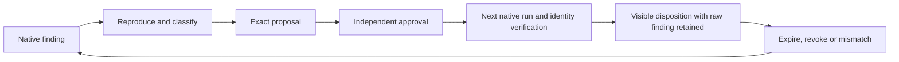

# Codeguard False-Positive Governance

> **Document version:** 1.2.0 · **Updated:** 2026-09-29. Current slices and target contracts are explicitly separated.

[简体中文](Codeguard-False-Positive-Governance.zh_CN.md) · [Documentation](README.md) · [Architecture](Codeguard-Architecture.md) · [Technical design](Codeguard-Technical-Design.md)

Current `config validate/explain` 0.3 observes native declarations and source hashes alongside legacy configuration and tool locks. Effective rules and suppressions stay unresolved; no project configuration is executed and no exception receives authority. See [configuration acceptance](../tests/acceptance/config-native-observation.md).

## 1. Classify before proposing an exception

| Root cause | Correct remedy | Gate meaning |
|---|---|---|
| Reproduced native false positive on an exact input | Time-bounded `false_positive` proposal and independent review | At most allow with exceptions after all other obligations are complete |
| Adapter misreads scope, exit/report or configured rule | Fix the Rust adapter and add positive/negative regressions | Do not hide the adapter defect with a whitelist |
| Rule generally inappropriate for an approved project class | Reviewed rulepack/policy revision with applicability tests | Existing policy remains until replacement is authorized |
| Real risk deliberately accepted | Separate `accepted_risk` decision | Never count as a false positive |
| Tool failure, bad configuration, stale advisory database or unknown scope | Preparation/coverage remediation | Incomplete; exceptions cannot manufacture completion |

Native checks still execute and original findings remain visible. Current list/explain/propose and correction recording create or inspect candidates. Matching and signature/domain building blocks exist, but no public self-approval or complete trusted activation workflow is provided.

## 2. Exact identity

One decision binds one stable finding and exact target. Source matching includes repository-relative reversible path, file content digest, native rule and structured location/fingerprint. Dependency matching includes component coordinates, resolved version, graph/artifact and advisory identity. Tool, adapter, rulepack and configuration identities constrain applicability.

A candidate records schema/ID/kind, rationale, reason code, reproducer, approval reference, policy revision and finite expiration. Wildcards, regular expressions, whole directories and “ignore every result for this rule” are not exact false-positive dispositions. Conflicting duplicate findings or reused decision IDs cannot use first-match-wins semantics.

The matching order is required policy/scope → native execution/report validation → stable finding identity → independent approval and identity/time/scope checks → gate aggregation. A scan exclusion is a separate pre-scan policy decision, never the same mechanism as post-finding disposition.

## 3. Correction lifecycle

An agent receiving “this is a false positive” should identify the original evidence, explain the rule/configuration, reproduce it and choose the remedy above. The user should not have to manually compute matching hashes. Editing target, rationale, tool identity or duration changes candidate bytes and requires a new approval; no automatic renewal or scope expansion.

Conversation states distinguish pending review, approved and matched in this run, and expired/revoked/mismatched. Source repair closes by native verification; a correction task closes by verifiable adjudication and disposition, not by pretending the code defect was repaired.

## 4. Native examples and incomplete evidence

A Maven POM enabling P3C naming rules does not enable comment rules from Codeguard's default template. A PMD report claiming rules outside the effective set is incomplete evidence. Fix the adapter/configuration before creating source tasks or exception candidates.

A single-file Javadoc `findings_observed_untrusted` probe lacks full project source-set/configuration/tool authority. Missing classpath, unknown diagnostics and process failure remain incomplete. OWASP feedback with `database_freshness=unverified` and `coverage_proven=false` cannot authorize a CVE waiver. Redacted private package names cannot be reverse-used as exact component identity.

Cargo-audit can compare advisories with current lockfile package/version/source/checksum. That bounded check does not establish a fresh trusted RustSec database, full graph/build combinations or approved tooling/policy. A clean local CVE observation does not become a security pass through a whitelist.

## 5. Authority, expiration and evaluation

Snapshots, revisions, signatures, Git ancestry and current host clock are detailed in [trust and distribution](Codeguard-Trust-and-Distribution.md). Project `approved=true`, locally computed hashes and filenames under decisions are not authority. Final gate matching requires host-frozen workspace/baseline/policy/checker mapping and current time; missing or mismatched context preserves the active finding and unresolved state.

Track raw findings, adjudicated false positives, accepted risks, matches, expired entries and false negatives separately. Growing whitelist volume triggers rule/adapter root-cause review, not broader matching. Matched findings remain in evaluation datasets and denominators. The [Chinese field and lifecycle specification](Codeguard-False-Positive-Governance.zh_CN.md) retains the detailed binding and correction examples.

### Signed approval lifetime boundary (2026-10-04 development source)

Ordinary candidates and every replacement-chain hop enforce `candidate.expires_at <= signed.expires_at` and a candidate lifetime no longer than that hop's host-fixed `max_lifetime_seconds`. A more permissive snapshot cannot expand either limit. Violations return `approval_candidate_lifetime_outside_signature`, even with a valid signature, matching digest and currently valid clock. Candidate creation before signature issuance is not itself rejected; valid shorter lifetimes remain bindable.

This protected-host SDK constraint does not establish approval provenance, current native identity or a complete delivery gate. Local candidates still cannot authorize delivery. See [lifetime acceptance](../tests/acceptance/approval-candidate-lifetime.md).
