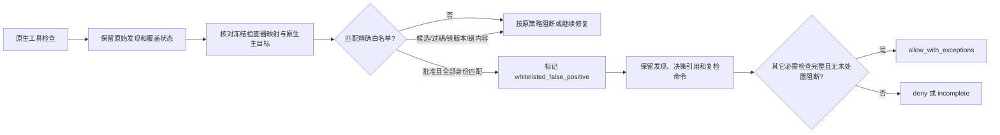
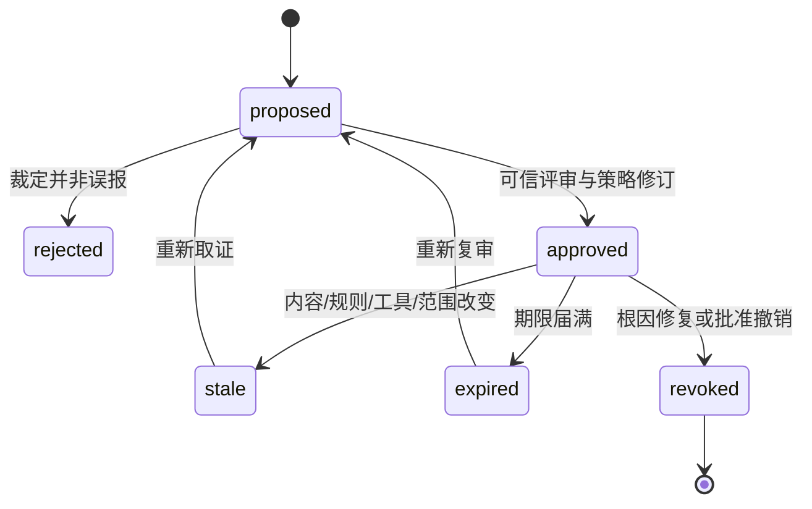

# Codeguard 误报治理与精确白名单

> **文档说明：**负责误报分流、条目身份、提案纠错、批准后处置与失效；密码学和发布细节另见信任专题。
>
> **文档版本：**1.2.0 · **最后更新：**2026-09-29 · **状态：**当前切片与目标契约分别标注。

[English](Codeguard-False-Positive-Governance.md) · [文档导航](README.zh_CN.md) · [架构](Codeguard-Architecture.zh_CN.md) · [技术方案](Codeguard-Technical-Design.zh_CN.md)

当前提供候选 list/explain/propose、纠错 --record、精确身份与领域判定基础；无公开自批或完整可信生效入口。原生发现保留，只有独立批准且当前身份完整匹配时，目标门禁才允许带例外处置。规范：[rulepack-governance](../openspec/changes/introduce-rust-codeguard-cli/specs/rulepack-governance/spec.md)。

## 目标与边界

### 用户纠正白名单的操作约定

用户应能从对话中选中原问题，查看“为什么报、为什么未命中、需要纠正什么”。智能体返回原生规则依据、精确目标、当前候选或批准决策、失配字段和复检动作，随后将纠正记录附到同一稳定问题。无需用户直接维护匹配摘要或编辑原始报告。此为目标交互，不能把现有只读查询当作完整交付能力。

- 新增：复核原工具误判，生成精确候选；批准后下一轮仍执行原工具，只豁免匹配的问题。
- 修改：理由、目标、工具身份或期限改变都产生新版本；旧批准不能授权修改后的字节，替代决策须重新批准。
- 撤销：保留旧记录，恢复原问题的正常处置；若问题仍被原工具发现，恢复对应待处理任务。
- 到期或失配：解释具体原因，给出复核任务；不得自动续期、扩大范围或删除问题。

对话必须分别显示“待审”“已批准且本轮命中”“失效/撤销”，不能用统一的“已忽略”混淆三者。白名单纠错任务的完成条件是裁定和本轮处置可核验；源码修复任务的完成条件仍是原工具复检，不因白名单文件修改而记为代码已修复。

白名单用于纠正**经过复现和裁定的误报**，不是跳过检查器、降低规则阈值或默认忽略历史问题。原生工具照常运行、原始 finding 照常保留；白名单只在报告解释与门禁处置阶段匹配该 finding。无效、过期或来源不可信的条目不生效。确实存在但团队决定接受的风险属于独立的 `accepted_risk` 例外，不能标成误报；工具崩溃、配置不明、覆盖不足或漏洞库过期属于 `incomplete`，也不能进入误报白名单。

坏报告的 `state/import-failures/` 本地收据只记录脱敏失败原因和报告字节摘要，供 `next` 指出修复动作；它没有原生 finding 身份、批准权威或门禁效力。报告修正后必须重新同步和原生复检，不能通过编写白名单候选来消除同步失败。

项目启用规则与 CodeGuard 探针规则不一致时，应先修配置解析或适配器。例：Maven POM 只声明 P3C `ali-naming.xml`，探针不能以模板中的 `ali-comment.xml` 生成作者注释 finding；也不能为这类多扫问题申请白名单来掩盖适配错误。POM 身份变化或无法确定生效规则集时，返回配置阻塞和重新发现动作。
原生报告也不能自证规则归属：PMD XML 若声称来自未启用的 P3C 规则集，或把另一个规则集的 ID 写入已启用规则集，应先标记报告未完成，不给智能体创建“修复源码”任务，更不生成白名单候选。

Javadoc 单文件 doclint 探针的 `findings_observed_untrusted` 也只供定位注释；尚未绑定项目生效配置、完整源集和可信工具身份时，不得直接据此生成可批准的误报白名单。类路径缺失、未知诊断文本或原生进程失败属于 `incomplete`，应先修复检查环境或适配器。

CVE 白名单还要绑定本轮原生 advisory、精确依赖坐标与解析版本、依赖图及制品摘要、检测器和规则身份，以及可核验的新鲜漏洞库。当前 OWASP Maven 局部反馈的 `database_freshness=unverified`、`coverage_proven=false`，因此只能作为调查线索，不能生成会放行的白名单命中。对话反馈中被脱敏为 `redacted-sha256` 的私服包标识也不能反向充当组件身份；须在受保护的原生报告与图归属中完成精确匹配。漏洞真实存在但业务接受风险时走 `accepted_risk`，不能以“误报”条目规避 CVE 门禁。

Rust 的 `cve rust` 与 `check all` 现可调用原生 cargo-audit，并将 advisory 的包名、解析版本、来源和校验和与本轮 `Cargo.lock` 对照；公开反馈仍把私有来源脱敏。此对照只是局部身份核验：RustSec 数据库来源与时效、完整依赖图和构建组合、受批准工具及策略仍未证明。即使 advisory 与锁文件精确相符，`database_freshness=unverified` 时也不得签发或命中能改变门禁的 CVE 白名单；用户纠正可先记录为待审调查，并在下一轮原工具复检后补充证据。没有 advisory 的局部扫描同样不能靠白名单变成安全通过。

## 条目模型

### 纠错分流

| 复核结论 | Codeguard 处理 | 门禁含义 |
|---|---|---|
| 原生规则在此精确输入上确为误判，且有可复现证据 | 提交有期限的 `false_positive` 候选，经独立批准后只处置该 finding | 其它义务完整时最多 `allow_with_exceptions` |
| 规则对该类项目普遍不适用 | 修订受保护的 rulepack/项目策略，附正反例回归 | 新策略生效前旧规则仍执行 |
| 问题真实存在，但团队决定承担风险 | 走独立的 `accepted_risk` 决策，不能伪装成误报 | 按独立策略显示风险例外 |
| 工具未配置、崩溃、漏洞库过期或报告不完整 | 创建环境/配置修复任务 | `incomplete`，白名单不参与放行 |

智能体可以收集证据并提出候选；对话中收到“这是误报”的反馈时应定位原 finding、给出原生复检与最小复现，再选择上表路径。修改候选文件本身只会改变待审内容；即使文件写入 `.codeguard/decisions/`，也不能凭路径或字段让本轮扫描通过。错误批准条目须撤销并重开相应任务，不能删除历史 finding 来掩盖纠错过程。

第一版只支持**精确发现**。一个决策条目只绑定一个稳定 finding 和一个精确目标；多个目标必须分别取证、裁定和批准。不能用 `*`、`**`、正则、整库目录或“忽略某规则的全部结果”冒充误报白名单。同一 finding ID 出现两个候选目标时属于身份冲突，查询与门禁均不得挑选其中一条放行。若规则在某类项目中系统性不适用，应修改经批准的 rulepack/项目策略，并用正反例验证，而不是堆积宽泛白名单。

### 规则层级与纠错优先级

白名单是**发现后的处置规则**，不能成为扫描输入排除规则。应用顺序固定为：批准的必需检查与覆盖范围 → 原生工具执行及结果校验 → finding 稳定身份 → 白名单身份、期限及独立批准校验 → 门禁汇总。任何前序步骤为 `incomplete` 时，不运行“没有发现所以命中白名单”之类的推断。候选条目只供调查；已批准的精确条目只能处置对应 finding；策略级规则调整须在下次检查以新 rulepack 身份重新执行原工具。

对反复出现的误判，按根因选择最窄的纠正方式：

| 根因 | 纠正位置 | 必须留下的证据 |
|---|---|---|
| 单个输入触发原生工具误报 | 精确 `false_positive` 条目 | 最小复现、原生诊断、目标与工具身份、批准引用、到期时间 |
| 适配器误读了退出码、路径、报告或规则 | 修复 Rust 适配器 | 错误输入与正确原生输出的回归样本；旧条目复审/撤销 |
| 某项目类型普遍不适用该规则 | 经批准的 rulepack/项目策略修订 | 适用范围、正反例、覆盖变化和受保护策略修订 |
| 原生配置把必需规则隐藏 | 修复配置或报告策略差异 | 有效配置来源及原工具复检；不能建立白名单 |
| 真实风险被业务接受 | `accepted_risk` 独立决策 | 风险说明、负责人、到期和独立批准；不能计为误报 |

白名单命中数持续增加应触发规则/适配器根因复盘，不自动扩大匹配范围。质量评测须同时展示原始发现、人工裁定误报、白名单命中、白名单失效及漏报；白名单命中不能从原始误报率的分母或回归样本中消失。

| 字段 | 用途与约束 |
|---|---|
| `id`、`schema_version`、`kind` | 稳定决策 ID；`kind=false_positive`，与 accepted risk 分开 |
| `checker_id`、`native_rule_id`、`category` | 只匹配同一原生检查器、规则和检测类别；不可只按消息相似度匹配 |
| `target` | 源码用规范化仓库相对路径与目标文件内容 SHA-256；依赖问题用组件坐标、解析版本、依赖图身份和 advisory ID；不能拿路径白名单压制所有依赖风险 |
| `finding_fingerprint` | 绑定原生规则、目标、结构化位置/符号和证据身份；行号可辅助展示，不单独作为身份 |
| `tool_identity`、`rulepack_identity`、`adapter_identity` | 版本或摘要范围显式限定；工具/规则语义变化后须重新裁定 |
| `reason_code`、`rationale`、`reproducer_ref` | 说明为何是误报，附最小复现、原生输出引用和人工裁定；自由文本只作数据 |
| `approved_policy_revision`、`approval_ref` | 指向受保护策略修订或可验证签发记录；项目内可写文件的 `approved=true` 无效 |
| `created_at`、`expires_at`、`reviewer` | 有期限、有责任人；期限上限来自可信策略，不能永久有效 |

内容 SHA-256 对源码文件按本次被检查的字节计算。匹配在原生解析、路径归属和内容复核之后进行；任何必需字段缺失、身份无法验证、多个条目冲突或时钟/批准来源不可靠都返回**未匹配或未完成**，不能按有利于放行的默认值处理。白名单条目本身有版本和摘要，报告记录命中的决策 ID、策略修订、到期时间和匹配依据，但不向对话泄露原始敏感证据。

## 申请、批准与复查

1. `work sync` 将疑似误报保留为 finding，并创建“误报调查”任务；智能体收集最小复现、原生规则、目标身份和建议修订，不自行关闭问题。
2. 目标 `codeguard rules whitelist propose <finding-id> [path] --format json` 在证据完整时只生成**候选**，不改变门禁。当前已实现 `rules whitelist list/explain --candidate FILE` 的显式文件只读查询，以及 `propose` 的本地观察预览：它只使用最新已同步报告中仍存在、且源码与配置内容一致的 finding；未同步、损坏或新扫描问题消失时不回退旧证据。调用者可加 `--ruff-tool /绝对路径/ruff`，预览会按当前普通文件字节复核报告里的工具摘要；不一致或工具不可读取时隐去旧观察并要求重新扫描。它不执行工具，也不证明工具获得批准。`explain` 可额外指定 `--observed-identity FILE` 解释两个未核验身份是否精确匹配。匹配成功也不能判断候选已批准、未过期或观察文件来自本轮原生检查，始终无门禁效果。现有 `config validate/explain` 0.3 静态观察旧配置、工具锁及逐构建根原生配置声明，生效规则和原生抑制仍未解析，固定 `authority=unverified`，不验证白名单批准、期限或本轮原生身份。后续须接入可信策略与完整配置差异；`propose` 的完整候选生成仍未实现。

Ruff 局部报告现在只在确有原生 finding 且还有检查预算时记录本次 CodeGuard 可执行制品的 SHA-256 作为**适配器观察摘要**；无摘要时仍报告具体缺口。候选入口读取已同步报告后再次哈希当前二进制，若发生变化，即使本地报告和同步标记被一起改写也拒绝沿用旧观察。这补齐一个可核对字段，不代表二进制发行来源、rulepack 或误报裁定已获独立批准；`candidate` 仍为 `null`，门禁不变。

`propose` 的输入必须是**本轮**原工具结果及内容复核形成的完整精确身份。Ruff 的局部报告已对完整文件记录本轮观察到的工具与配置字节摘要，已映射的 F401/E501 另记录未批准规则包摘要；局部预览能将它们与最新已同步、源码及配置未变的 finding 关联，但持久任务仍只存首次规则、路径和发现指纹，仍缺可信适配器发行来源及**经批准的** rulepack 身份。因此不能拿任务文件或候选规则包摘要直接拼出可评审条目。身份缺失时应返回 `incomplete`，列出缺失字段和复检/准备动作，不填零摘要、版本字符串或“当前文件”占位，也不写候选文件。
3. 人工评审确认确属工具/适配器误报后，将精确条目纳入受保护策略修订或签发批准；本地 `.codeguard/decisions/` 保存可读引用和历史，不作为自足的授权源。正在提交白名单的同一 PR 必须由受保护 CI 使用**此前可信基线**验证，不能用自己新写的条目为自己签发通过。

批准快照、撤销/替代、多跳签名和 Git 基线绑定的字节契约统一见 [信任与分发](Codeguard-Trust-and-Distribution.zh_CN.md#2-批准快照与修订链)。结构绑定不授予外部信任。

4. 生效后的每次检查仍运行原工具。只要源内容、依赖图、规则、工具/adapter、目标、批准修订或期限失配，原 finding 重新按正常规则处理；复发或新位置不能沿用旧白名单自动放过。
5. 若根因已在 checker/adapter 中修复，应撤销条目并用原工具正反例复检。已批准条目过期前提示复审，历史事件保留，任务处置标为 `whitelisted_false_positive` 而非 `resolved_by_code_fix`。

纠错反馈须回到同一个稳定 finding/任务：用户指出误判后，智能体记录反例并提出候选；被驳回时继续修复原问题或环境；批准后同步处置事件，任务可标为“经批准例外”，但不得写成源码已修复。批准被撤销、到期或身份失配时，任务重新进入待处理；任何人手动勾选任务都不改变本轮门禁。查询命令要分别解释 `candidate_unverified`、`approved_match`、`expired`、`identity_mismatch`、`revoked` 与 `approval_unverifiable`，并显示下一步是补证据、复检、重审还是修复代码。

### 纠正白名单的闭环

用户反馈“这条是误报”时，智能体先用 `rules whitelist explain` 定位原始 finding、原生规则和当前处置，再运行原工具取得本轮证据。若证实是单条误判，就对**同一稳定 finding** 提出精确候选；若是适配器解析错误，先修适配器；若规则对一类项目普遍不适用，则提出受保护的规则/项目策略修订。不能仅凭一句反馈生成有效豁免，也不能要求智能体反复修改无关源码。

已批准条目需要纠正时，采用“撤销旧决策 + 新候选 + 独立批准”的修订链；旧决策 ID 与历史事件不可覆盖或删除，新候选明确引用被替代的决策。受保护策略发布时原子地固定撤销集合和新批准集合，避免旧、新条目在过渡期间同时生效。若同一 finding 存在两个有效且互相冲突的决策，保持 `incomplete` 并要求评审，不选择较宽松的一条。撤销、过期、身份变化或新候选未批准时，本轮原生 finding 恢复正常阻断；既有任务重开并记录原因。

纠错提案的最小数据为原决策 ID、稳定 finding ID、结构化原因、本轮原工具复检引用和受影响目标。若仍是同一目标的误报，替代候选使用新决策 ID、`replaces_decision_id` 与新的完整精确身份；若先前误批或检查器已经修正，可以只撤销，不制造替代条目。CLI 只生成可审阅提案；受保护策略发布负责校验旧决策存在、修订链无环、撤销和替代原子生效、替代范围未扩大。另一个文件或依赖节点出现相同规则时，应单独调查，不能借旧决策的修订链批量放过。

当前 Rust 局部入口支持 `codeguard rules whitelist propose <finding-id> [path] --correct-decision FILE --correction-reason CODE --verification-run RUN_ID [--replacement FILE] [--record] --format json`。它只读取稳定任务、严格解析的旧候选及由 `task verify` 保存且摘要可核对的本轮原生报告。复检仍存在时可预览误批/范围过宽/证据失效的撤销；复检确认原问题缺失且目标源码未再变化时，可预览 `root_cause_fixed` 的仅撤销。提交替代文件时还比对同一稳定 finding 与目标、已观察的源码/工具/发现指纹；由于可信适配器发行来源与已批准规则包身份仍缺，替代只标为 `unverified_draft`，预览状态为 `evidence_incomplete`。任何路径都固定退出 3、`authority=unverified`、`gate_effect=none`，不写 `decisions/`，不关闭任务，也不更改门禁。

加 `--record` 时，命令持任务锁重查证据，将提案幂等写入 `.codeguard/findings/<finding-id>/events/correction-proposed-<sha256>.json`，并在输出中给出 `record_ref`。事件引用同一稳定 finding 与任务，包含旧决策、新草稿摘要、原生复检 run/报告摘要及缺失的批准证据；同内容重放不增事件。证据过期或目标变化时不落盘。此事件是待审记录，不是 `decisions/` 的可信批准，也不能让智能体关闭任务。`codeguard next . --format json` 会在当前复检 run/报告摘要仍匹配时，向同一任务简报附 `correction_proposal_refs`，提示独立评审；过期事件不作为当前任务决策。

`rules whitelist explain` 应逐字段解释命中、失配和修订链，只显示脱敏身份与批准引用；`propose` 应支持对现有决策提出修订候选，但永远不能自行批准或直接改门禁。上述局部纠错入口已存在；完整修订链查询与可信策略发布流程仍待实现。验收需覆盖“批准误报后精确放行、误批撤销后重新阻断、修订期间不能双重放行、其它同规则 finding 不受影响”，并在评测中保留白名单前的误报与漏报统计。

## 门禁与对话反馈

白名单**不删除 finding，也不改变原生工具退出语义或检查完整性**。报告分别记录 `raw_findings`、`whitelisted_false_positive`、`active_findings`、`incomplete_obligations`；每条命中报告原阻断级别、处置标签和批准引用。存在有效白名单且其它必需义务均完整时，交付决策为 `allow_with_exceptions`，不显示普通 `PASS/allow`；尚有真实阻断则 `deny`，工具/配置/覆盖未完成则 `incomplete`。同一 finding 同时命中冲突条目时不自动选最宽松结果。

Rust RunReport 1.4 schema/结构解析及对话摘要 0.2 已加入该决策值；1.3 原始 schema 仍保存供历史读取。1.4 对每条 finding 要求完整原生身份，对白名单处置要求精确决策身份，并核对规则、工具摘要、检查器类别和主定位；两份身份任一字段不同即拒绝报告声明。本仓 Rust 工程还有一个未接入正式命令的 SARIF 2.1.0 纯转换器：未完成运行在 SARIF 中标记执行失败和错误通知；白名单 finding 仍保留为结果，附上批准引用及“报告声明、来源未核验”标记，不创建 SARIF suppression；原生消息和路径不进入公开投影。原生报告生产、可信审批与 CLI/MCP/Hook 全格式消费尚未接通。旧消费者遇到新值应拒绝按普通 allow 解释。`allow_with_exceptions` 对完整交付请求可对应退出 0，但必须保留明确的带例外状态与可核验批准来源。

1.4 消费者现还要求源码 finding 的主目标同时属于该义务声明的预期和实际覆盖集合。独立的 `compare_claimed_source_hashes` 接口只接受宿主指定的工作区根，安全读取报告里**全部源码目标**的当前普通文件字节并比较 SHA-256；旧协议、内容变化、文件缺失、符号链接、冲突摘要或资源超限均拒绝。它只是一次内容比对，不能从报告自填的覆盖集合、工具摘要或审批字段推断来源可信，也不能替代终局复核；正式门禁仍未调用该接口。

智能体对话应说“规则 X 在文件 Y 被原工具发现，经白名单决策 Z 判为误报，本次不阻断；到期/失效条件是……”，并给出原工具复检命令。候选或失效白名单只能提示调查，不能对话中说“已放过”。`next` 可引导人工裁定或代码修复，但不得反复让智能体改无关源码。评测同时报告白名单前后发现数、已裁定误报数、实际漏报和豁免比例，不能通过增加白名单把 precision 人为抬高。

## 必须通过的验收场景

| 场景 | 期望 |
|---|---|
| 同一内容、规则、目标、工具/策略身份且批准有效 | 只标记对应 finding，不影响同文件其它规则；交付最多为 `allow_with_exceptions` |
| 同一规则出现在另一文件、内容变更、依赖版本或 advisory 变化 | 不匹配；原阻断保留 |
| 条目过期、缺批准、批准来自当前 PR 或本地 `approved=true` | 不放行，给出失效/未批准原因 |
| `propose` 只拿到历史任务，缺本轮工具/适配器/rulepack 摘要 | 不生成可批准候选；报告缺证据与原工具复检动作 |
| 原生检查器崩溃或报告范围不完整 | `incomplete`，即使历史 finding 曾在白名单中 |
| 原生 suppression 隐藏了必需规则 | 报策略差异/未完成，不能凭白名单证明该规则已执行 |
| 同轮有白名单误报与真实阻断 | 两类都展示，最终 `deny` |
| 唯一阻断是有效白名单误报，全部义务完整 | `allow_with_exceptions`，不写普通 `allow` |
| 原生规则或 adapter 修复后条目撤销 | 原工具复检；历史裁定与指标仍可追溯 |
| 同一误判重复扫描、任务被手动勾选或改名 | 复用同一 finding 与决策引用；不因任务文字变化改变处置或门禁 |
| 白名单命中量攀升或同规则出现多条候选 | 形成规则/适配器根因调查，不能自动合并为规则级忽略 |

### 当前可读纠错附件

纠错命令显式 --record 现在生成 .codeguard/tasks/corrections/<finding-id>/<event-sha256>.md，附属于同一稳定任务，包含证据、规则、范围、步骤、复检、历史和关闭条件。附件为历史投影，需通过 next 核对当前适用性；用户编辑保留、不用于批准或执行指令。事件保存成功后附件冲突/失败单独反馈，重试可恢复被删除的附件。next 仅引用当前复检仍匹配且与事件重建字节一致的附件。该能力仍不具独立批准、可信发布或正式门禁效力。

当前 Ruff 复检观察及普通误报提案在读取时重新发现目标选中的配置，核对配置路径和字节摘要。规则配置变化、新增更高优先级配置或旧报告缺少身份时，next 要求原工具复扫，不继续展示旧纠错事件/附件；历史记录仍保留。原源码未变也不能使陈旧配置证据继续有效。

## WASM 疑似语法的纠错边界（待实现）

疑似语法观察不是已确认原生 finding。纠错需额外绑定 grammar 字节/版本、语言方言、解析规则和源码范围；原生语法反证保留为最小回归语料。精确处置不能撤销必须运行的原生检查，不能将未解析范围标 clean，也不能把原生工具故障列入白名单。系统性 grammar 缺陷优先修解析器，逐输入例外只解决经裁定的精确误判。

## 原生抑制与当前复检

Ruff 的 show-settings/ignore-noqa、Clippy/Rustdoc 的 force-warn、ESLint 的 print-config、Checkstyle 的首次配置身份仅是各自局部对照。未启用原规则、配置改变或抑制出现时要求复核；两轮均无诊断也只得到候选消失，不代表可信批准。CVE 还必须确认组件/解析版本/图/advisory 与数据库时效，公开脱敏标识不能反向作为私有组件身份。详细适配边界见 [适配器契约](Codeguard-Adapter-Contracts.zh_CN.md)。
