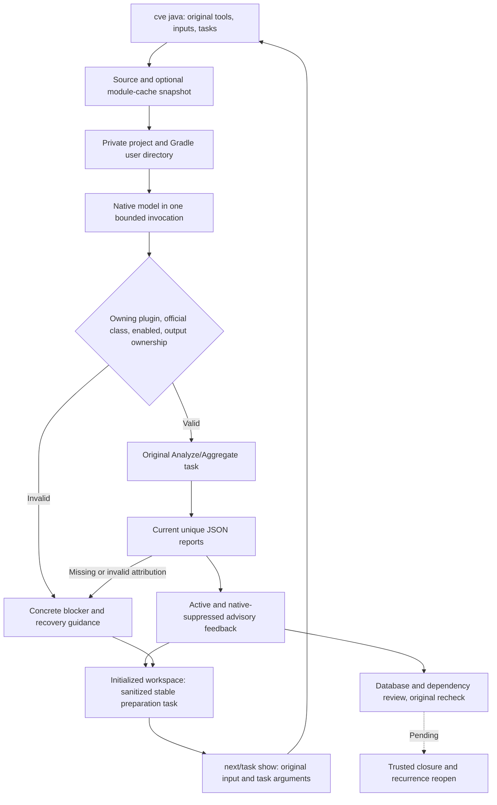

# Native Gradle vulnerability checks

This increment addresses existing OpenSpec S15.5/6.4. Rust invokes original Gradle OWASP tasks. The public command is connected; real OWASP positive/negative scans, database freshness, complete dependency attribution, full remediation and trusted closure remain unqualified.

```bash
codeguard cve java . \
  --gradle-bundle /absolute/gradle-8.10.2 \
  --java-home /absolute/jdk21 \
  --gradle-project-file settings.gradle \
  --gradle-project-file build.gradle \
  --gradle-owasp-task :dependencyCheckAnalyze \
  --gradle-module-cache /absolute/caches/modules-2 \
  --timeout 90s --format=json
```

Tools, inputs and fully qualified tasks are explicit. Inputs/tasks can repeat with distinct identities. Invalid scope and duplicates are rejected. The module cache is optional: an absent cache stays empty and unresolved offline plugins produce blockers. Never supply the entire user Gradle home. Existing Maven observations remain independently scheduled by `check java/all`; this command does not fall back to Maven.



Selection requires the owning project's applied `org.owasp.dependencycheck` plugin, official Analyze/Aggregate base class and enabled flag. Names alone are insufficient. One Gradle invocation captures model/ownership and executes the explicitly requested original tasks. It reruns tasks without build cache and preserves original formats, suppression, severity, scan and database configuration.

The current configuration API research targets OWASP Gradle v12.1.0 `config`; reports accept engine12.1.0/JSON1.1. Other interfaces or versions remain incomplete. JSON/ALL must be originally configured; no format is injected. Skips, duplicate/pre-existing outputs, escaped paths, composite builds and unknown tasks/API remain blockers. Gradle `--offline` controls dependency resolution; it does not establish independently verified offline behavior for OWASP data updates or external analyzers.

Only supported module/resource/metadata subtrees under an explicitly selected existing `modules-2` cache are copied. User properties and lock files are excluded; symlinks are rejected. Limits are4096 files,128MiB per file,512MiB total and20000 directory entries. The source cache stays read-only, with changes invalidating observations. Source inputs remain bounded to128 files/16MiB. These bounds do not establish complete project coverage.

## Dialogue report

`java_gradle_cve_feedback`0.3 wraps `gradle_dependency_check_probe`0.2 with original task requests, selected inputs, budget, native status/blockers, report digests and per-task advisories. Active and native-suppressed advisories are retained. Suppression does not mean resolution; package identifiers are not automatically attributed to the actual dependency graph.

```json
{
  "report_type": "java_gradle_cve_feedback",
  "native": {
    "native_status": "reports_observed_unverified",
    "reason": "database_and_dependency_coverage_unverified",
    "database_freshness_verified": false,
    "dependency_attribution_verified": false,
    "coverage_proven": false
  },
  "task_sync": "synced",
  "task_sync_reason": null,
  "delivery_decision": "not_evaluated"
}
```

This is a field excerpt, not a complete schema-valid packet. Complete controlled feedback and actual native blockers are separately archived. Valid report observations survive exits0/1, retaining failure on1; cancellation/timeouts, changed sources/tools, analysis exceptions or missing reports create no advisories. Public exits are3 for unverified observations,130 for cancellation,2 for invalid arguments. There is no delivery-success path.

Controlled tests cover active/suppressed advisories, empty reports, exits0/1, configuration/scope/task forgery, changed inputs/tools, stale reports, cancellation/deadlines and cache isolation/drift. These do not establish actual OWASP precision. Existing Gradle8.10.2/JDK21 ran imitation tasks and missing offline plugins through both the service and public CLI, preserving incompleteness. No plugins were installed/downloaded. Real OWASP positive/negative scans, cache closure, dependency/data freshness, task verify, unified check scheduling, platforms and release remain pending.

See [acceptance](../tests/acceptance/gradle-dependency-check-probe.md). `introduce-rust-codeguard-cli` remains the sole specification source; parent tasks stay open.

Native interface sources: [v12.1.0 AbstractAnalyze](https://github.com/dependency-check/dependency-check-gradle/blob/v12.1.0/src/main/groovy/org/owasp/dependencycheck/gradle/tasks/AbstractAnalyze.groovy), [ConfiguredTask](https://github.com/dependency-check/dependency-check-gradle/blob/v12.1.0/src/main/groovy/org/owasp/dependencycheck/gradle/tasks/ConfiguredTask.groovy).

Aggregate limits are16MiB report input,1000 advisory observations and2MiB serialized report feedback. Cancellation/deadlines are checked between reads and feedback records, including repeated package expansion. Exhaustion stays incomplete; no silent truncation or vulnerability-free verdict. Preserve all obligations when batching original tasks; oversized single tasks need a separate large-report design. Historical0.1 protocols/evidence stay unchanged;0.2 rejects downgrades. See [aggregate budget acceptance](../tests/acceptance/gradle-owasp-aggregate-budget.md).


## Stable preparation tasks

The explicit command now automatically syncs an already initialized `.codeguard/` workspace; it never initializes one implicitly. `task_sync` is `synced`, `not_initialized` or `incomplete`, with concrete `task_sync_reason` on failure. Cancellation does not persist. Workbench protocol0.1 retains selected input hashes, original task paths, tool/cache identity hashes, native status/reason, per-task report digests and counts. Native output, project names, package identifiers and advisory details do not enter committed task facts; native observations remain visible in dialogue.

Stable identity binds the checker and selected path/task sets. Changed tools, input bytes, reasons and counts append to the same preparation task. New imports validate current inputs; consumed historical reports use immutable byte receipts, rejecting tampering. `next`/`task show` expose every repeatable input/task flag, with tool/cache paths requiring revalidation. Empty scans never close a task or confirm a vulnerability. `task verify` explicitly returns not integrated without running an unrelated checker. Full remediation, trusted closure and unified check scheduling remain pending. See [workbench acceptance](../tests/acceptance/gradle-cve-workbench.md). Historical public0.1/0.2 protocols/evidence remain unchanged.
