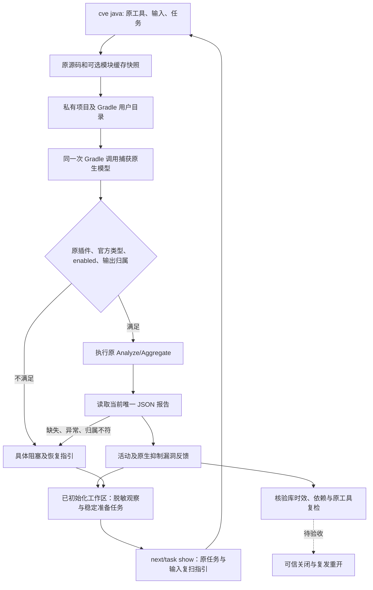
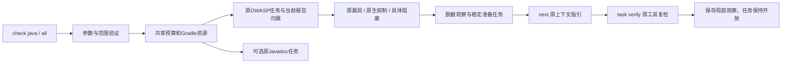

# Gradle 原生漏洞检查技术方案

本增量对应现有 OpenSpec S15.5/6.4。Rust 调用原 Gradle OWASP 任务，不重写漏洞引擎。公开入口已经接通，但真实 OWASP 有漏洞/无漏洞扫描、数据库时效、完整依赖归属、工作台任务和可信关闭仍待验收。

```bash
codeguard cve java . \
  --gradle-bundle /absolute/gradle-8.10.2 \
  --java-home /absolute/jdk21 \
  --gradle-project-file settings.gradle \
  --gradle-project-file build.gradle \
  --gradle-owasp-task :dependencyCheckAnalyze \
  --gradle-module-cache /absolute/caches/modules-2 \
  --timeout 90s --format=json
```

工具、任务和输入均显式指定；任务和输入可重复指定，重复身份及越界输入拒绝。模块缓存可省略，省略时使用空私有缓存，原插件不能离线解析便报告阻塞。不能把整个用户 Gradle home 当作缓存传入。Maven 原生能力仍由既有 `check java/all` 路径独立调度，本命令不进行构建器回退。



## 原任务与低误报约束

同时检查所属项目实际启用 `org.owasp.dependencycheck`、官方 Analyze/Aggregate 基类和 enabled。只执行显式完整任务路径，普通任务不能凭名称获得能力。原生模型、输出归属和原质量任务共用一次 Gradle 调用与截止时间；强制重跑并关闭构建缓存，保留原报告格式、抑制、阈值、扫描范围和数据库配置。

当前配置接口研究固定为 OWASP Gradle v12.1.0 的 `config`，报告只接受引擎12.1.0及JSON1.1；其它接口或版本保持未完成。原配置必须选择 JSON/ALL，不自动修改格式。跳过任务、共用输出、预存报告、输出越界、composite build、未知任务和未知配置接口均保留阻塞。依赖解析使用 Gradle `--offline`；这不等于 OWASP 的数据更新/外部分析器网络访问已被独立验收。

缓存只允许现有 `modules-2` 中的受支持模块/资源/元数据子树，不读取 `gradle.properties`，不复制锁文件或用户配置，不跟随符号链接；至多4096文件、单文件128MiB、总计512MiB、20000目录项。原缓存只读，私有缓存可由原 Gradle 使用；原缓存内容改变时撤回观察。源码快照仍有128文件/16MiB限制，这些是局部输入约束，不是完整项目覆盖声明。

## 对话报告

公开协议 `java_gradle_cve_feedback` 0.3包裹独立 `gradle_dependency_check_probe` 0.2。报告包括原请求任务、选定输入、预算来源、原生状态及阻塞、逐任务报告摘要和漏洞观察。活动及原生抑制项都保留；不把抑制等同于漏洞消失，不将包标识直接认定为项目真实依赖。

```json
{
  "report_type": "java_gradle_cve_feedback",
  "native": {
    "native_status": "reports_observed_unverified",
    "reason": "database_and_dependency_coverage_unverified",
    "database_freshness_verified": false,
    "dependency_attribution_verified": false,
    "coverage_proven": false
  },
  "task_sync": "synced",
  "task_sync_reason": null,
  "delivery_decision": "not_evaluated"
}
```

以上是字段节选，不是完整可校验报文。完整受控反馈见验收证据；实际原生阻塞反馈单独归档。退出0/1都可保留有效报告观察，退出1仍保留失败原因；取消/超时/源码或工具变化、分析异常和缺报告不生成漏洞发现。公开结果退出3，取消130，参数错误2；没有交付成功出口。

## 验收边界

受控进程覆盖活动/抑制漏洞、空报告、退出0/1、配置/作用域/任务伪造、输入和工具变化、预存报告、取消/超时及缓存复制/变化；它们不计作真实 OWASP 精度验收。已有Gradle8.10.2/JDK21实际跑了普通同名任务和离线缺插件两类，内部服务及公开入口均仅报告未完成。没有安装或下载插件；真实正/负例、缓存闭包、完整依赖和数据源时效、task verify、check统一调度、跨平台和发行均未完成。

详情：[局部验收](../tests/acceptance/gradle-dependency-check-probe.md)。唯一规格事实源仍为 `introduce-rust-codeguard-cli`，父任务不勾选。

原生接口依据：[v12.1.0 AbstractAnalyze](https://github.com/dependency-check/dependency-check-gradle/blob/v12.1.0/src/main/groovy/org/owasp/dependencycheck/gradle/tasks/AbstractAnalyze.groovy)、[ConfiguredTask](https://github.com/dependency-check/dependency-check-gradle/blob/v12.1.0/src/main/groovy/org/owasp/dependencycheck/gradle/tasks/ConfiguredTask.groovy)。

整轮累计报告输入上限16MiB、漏洞观察1000条、报告反馈2MiB；读报告及构造反馈时再次检查取消/截止时间。重复包标识放大也计入预算。超限为具体未完成，不静默截断或判为无漏洞；保留完整任务清单分批复检，超大单任务仍需独立大报告方案。历史0.1协议及证据保持原样，新0.2协议拒绝降级。见[累计预算验收](../tests/acceptance/gradle-owasp-aggregate-budget.md)。


## 稳定准备任务

`cve java` 现在自动同步已有 `.codeguard/`；不隐式初始化。`task_sync` 为 `synced`、`not_initialized` 或 `incomplete`，失败在 `task_sync_reason` 暴露具体原因；取消不写工作台。工作台协议0.1只保存选定路径/摘要、原任务、原工具/缓存身份摘要、原生状态/原因、每任务报告摘要及数量。原生输出、项目名称、包标识和advisory细节不进入可入库任务事实。对话仍显示原生局部报告。

任务按检查器与选定路径/原任务集合稳定归并；工具、字节、诊断或数量变化追加原任务的观察。首次导入核对当前源字节，已消费旧报告按收据处理；同run改字节拒绝。`next`/`task show`给出完整重复参数，工具与缓存绝对路径需重新核验。空报告不关闭任务，不将准备观察作为已确认漏洞。`task verify`按已消费原证据、原输入范围、已知工具/缓存身份运行原任务，保存开放任务的局部观察；完整修复、可信关闭仍待完成；统一check现支持显式原任务局部观察。见[工作台局部验收](../tests/acceptance/gradle-cve-workbench.md)。历史公开0.1/0.2协议和证据保持原样。


## 原任务复检

```bash
codeguard task verify CG-B-<稳定身份> . \
  --gradle-bundle /absolute/original-gradle \
  --java-home /absolute/original-jdk21 \
  --gradle-module-cache /absolute/original/caches/modules-2 \
  --format=json
```

缓存参数仅在原任务明确选择缓存时提供。原输入路径和任务从已消费的原报告恢复，不允许任意替换，Markdown没有执行权。原配置/已知工具或缓存字节变化停止执行，要求审查及重新扫描；缺原身份保持未验收，不通过补一个自写摘要签发资格。新输入和当前工具/缓存在复检保存前再核对，失败、仍阻塞或规则需要审查都记录为开放任务的观察；零advisory不关闭。纯准备任务尚未核验完整依赖/库，不能当实际源码漏洞修复验收。

协议新增原范围复检0.1、公开task verify0.35、next0.27，工作台0.1/公开cve0.3不扩大；历史next0.26保留原样。见[原任务复检局部验收](../tests/acceptance/gradle-cve-task-recheck.md)。

## 统一检查调度

同一原任务也可由统一入口调度：

```bash
codeguard check java . \
  --gradle-bundle /absolute/gradle-8.10.2 \
  --java-home /absolute/jdk-21 \
  --gradle-project-file settings.gradle \
  --gradle-project-file build.gradle \
  --gradle-owasp-task :dependencyCheckAnalyze \
  --format json
```

`check all`保留其它语言和全部检查义务；`--gradle-module-cache`可选且必须是显式绝对路径。任务和输入可重复指定，重复身份、无效路径、单独缓存及非Java选择拒绝。`lint all`不接受这些CVE选项。显式CVE替代单独模型探针，避免为同一CVE再跑一次模型；如果同时指定`--gradle-javadoc`，必须包含其Java源文件，两个原生节点共享Gradle资源串行执行，使用同一请求截止时间，不复用Javadoc结果作为漏洞结果。



新统一反馈0.71在`native_results.java_gradle_cve`保留原生0.2，`gradle_cve_tasks`分别反馈同步状态和原因；Gradle CVE候选使用`java.gradle.dependency_check`，已配置的Maven候选/原生结果另保留，不赋予全范围Maven身份。`next`使用0.27原范围指引；若兄弟节点发生内部故障，独立异常反馈0.21仍保留已观察的Gradle报告。JSON保留完整受预算限制的原报告，human列出活动/原生抑制漏洞；SARIF保留两类观察的数量与原生抑制标记（SARIF状态为underReview），同时脱敏位置、包标识和原生消息，不签发检查成功或批准白名单。SIGINT返回130，不保存CVE扫描和任务；超时/配置/原生故障保留具体未完成信息，零报告不关闭任务。

[统一入口局部验收](../tests/acceptance/gradle-cve-unified-check.md)包含受控正反例与已有Gradle/JDK四次阻塞/复检调用。这不是实际OWASP有/无漏洞、完整依赖/数据库时效、自动配置发现、受信关闭、独立精度、平台/宿主/发行验收。历史协议和验收不扩大。
