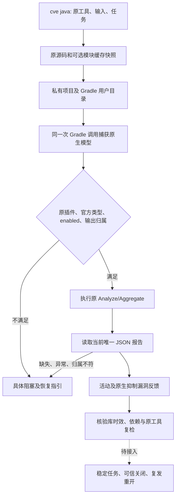

# Gradle 原生漏洞检查技术方案

本增量对应现有 OpenSpec S15.5/6.4。Rust 调用原 Gradle OWASP 任务，不重写漏洞引擎。公开入口已经接通，但真实 OWASP 有漏洞/无漏洞扫描、数据库时效、完整依赖归属、工作台任务和可信关闭仍待验收。

```bash
codeguard cve java . \
  --gradle-bundle /absolute/gradle-8.10.2 \
  --java-home /absolute/jdk21 \
  --gradle-project-file settings.gradle \
  --gradle-project-file build.gradle \
  --gradle-owasp-task :dependencyCheckAnalyze \
  --gradle-module-cache /absolute/caches/modules-2 \
  --timeout 90s --format=json
```

工具、任务和输入均显式指定；任务和输入可重复指定，重复身份及越界输入拒绝。模块缓存可省略，省略时使用空私有缓存，原插件不能离线解析便报告阻塞。不能把整个用户 Gradle home 当作缓存传入。Maven 原生能力仍由既有 `check java/all` 路径独立调度，本命令不进行构建器回退。



## 原任务与低误报约束

同时检查所属项目实际启用 `org.owasp.dependencycheck`、官方 Analyze/Aggregate 基类和 enabled。只执行显式完整任务路径，普通任务不能凭名称获得能力。原生模型、输出归属和原质量任务共用一次 Gradle 调用与截止时间；强制重跑并关闭构建缓存，保留原报告格式、抑制、阈值、扫描范围和数据库配置。

当前配置接口研究固定为 OWASP Gradle v12.1.0 的 `config`，报告只接受引擎12.1.0及JSON1.1；其它接口或版本保持未完成。原配置必须选择 JSON/ALL，不自动修改格式。跳过任务、共用输出、预存报告、输出越界、composite build、未知任务和未知配置接口均保留阻塞。依赖解析使用 Gradle `--offline`；这不等于 OWASP 的数据更新/外部分析器网络访问已被独立验收。

缓存只允许现有 `modules-2` 中的受支持模块/资源/元数据子树，不读取 `gradle.properties`，不复制锁文件或用户配置，不跟随符号链接；至多4096文件、单文件128MiB、总计512MiB、20000目录项。原缓存只读，私有缓存可由原 Gradle 使用；原缓存内容改变时撤回观察。源码快照仍有128文件/16MiB限制，这些是局部输入约束，不是完整项目覆盖声明。

## 对话报告

公开协议 `java_gradle_cve_feedback` 0.1包裹独立 `gradle_dependency_check_probe` 0.1。报告包括原请求任务、选定输入、预算来源、原生状态及阻塞、逐任务报告摘要和漏洞观察。活动及原生抑制项都保留；不把抑制等同于漏洞消失，不将包标识直接认定为项目真实依赖。

```json
{
  "report_type": "java_gradle_cve_feedback",
  "native": {
    "native_status": "reports_observed_unverified",
    "reason": "database_and_dependency_coverage_unverified",
    "database_freshness_verified": false,
    "dependency_attribution_verified": false,
    "coverage_proven": false
  },
  "task_sync": "not_integrated",
  "delivery_decision": "not_evaluated"
}
```

以上是字段节选，不是完整可校验报文。完整受控反馈见验收证据；实际原生阻塞反馈单独归档。退出0/1都可保留有效报告观察，退出1仍保留失败原因；取消/超时/源码或工具变化、分析异常和缺报告不生成漏洞发现。公开结果退出3，取消130，参数错误2；没有交付成功出口。

## 验收边界

受控进程覆盖活动/抑制漏洞、空报告、退出0/1、配置/作用域/任务伪造、输入和工具变化、预存报告、取消/超时及缓存复制/变化；它们不计作真实 OWASP 精度验收。已有Gradle8.10.2/JDK21实际跑了普通同名任务和离线缺插件两类，内部服务及公开入口均仅报告未完成。没有安装或下载插件；真实正/负例、缓存闭包、完整依赖和数据源时效、工作台/next/task verify、check统一调度、跨平台和发行均未完成。

详情：[局部验收](../tests/acceptance/gradle-dependency-check-probe.md)。唯一规格事实源仍为 `introduce-rust-codeguard-cli`，父任务不勾选。

原生接口依据：[v12.1.0 AbstractAnalyze](https://github.com/dependency-check/dependency-check-gradle/blob/v12.1.0/src/main/groovy/org/owasp/dependencycheck/gradle/tasks/AbstractAnalyze.groovy)、[ConfiguredTask](https://github.com/dependency-check/dependency-check-gradle/blob/v12.1.0/src/main/groovy/org/owasp/dependencycheck/gradle/tasks/ConfiguredTask.groovy)。
