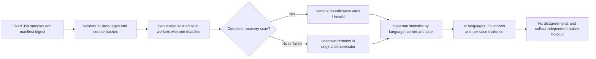

# Unified development evaluation of all 32 grammars

[简体中文](Codeguard-Grammar-Evaluation.zh_CN.md)

This implementation belongs to existing OpenSpec tasks S12.10–12.11, S14.17 and S14.19. The Rust development entry reuses `run_syntax_worker_candidate` and Core `evaluate_quality`. It replays a fixed corpus against every bundled grammar and produces per-language, per-case evidence without adding a second checker or task ledger.

## Run

From the repository root, build the program before replay. Do not run another Cargo build concurrently against that executable:

```bash
cargo build --locked -p codeguard-cli --features wasm-precheck
cargo run --locked -p codeguard-cli --features wasm-precheck \
  --example evaluate_grammars -- \
  "$PWD/target/debug/codeguard" tests/fixtures/grammar_regression_v0_2.json 1200 \
  > /tmp/codeguard-grammar-regression.json
```

The development report stays `incomplete` and exits 3. Invalid arguments or input exit 2. This is a development acceptance entry, not a replacement for product lint commands. It changes no workspace tasks, grammar qualifications or exceptions. CI runs it sequentially and retains JSON in the step output.



## Labels and statistics

The [current corpus](../tests/fixtures/grammar_regression_v0_2.json) contains 358 cases across all 32 languages and 35 language×source cohorts. It preserves all 186 legacy cases, adds 22 structural negatives and imports 150 Dart upstream cases. Every language has selected valid and invalid expectations; the new COBOL invalid expectation remains provisional, so this does not prove native confirmation for every negative. Duplicate keys, missing languages, unknown fields, manifest/source hash changes and self-declared approved labels are rejected before execution.

| `cohort` | Cases | Label authority |
|---|---:|---|
| `repository_regression` | 206 | Existing repository expectations; no native oracle executed in this run |
| `upstream_grammar_regression` | 150 | Dart grammar corpus with 4 expected ERROR/MISSING cases; not independent native labels |
| `provisional_syntax` | 2 | Pending CFQuery/COBOL expectations; excluded from TP/FP/FN/TN |

Build the new corpus using the Rust [developer importer](../crates/codeguard-cli/examples/build_grammar_corpus.rs):

```bash
cargo run --locked -p codeguard-cli --example build_grammar_corpus -- \
  tests/fixtures/grammar_regression.json \
  tests/fixtures/grammar_additional_regressions.json \
  --base-manifest tests/fixtures/grammar_manifests/manifest_2026_10_04.json \
  > /tmp/codeguard-grammar-current-corpus.json
```

The importer retains CRLF, blank lines and the final expected tree. Origins bind the upstream file hash and sample name. Missing separators, empty nodes, malformed expectations and unsupported corpus directives are rejected. Grammar expectations remain grammar regression labels. The [legacy corpus](../tests/fixtures/grammar_regression.json), version 0.1 schemas and historical 186-case report remain intact; historical report readers retain their original protocol; current replay requires new input bound to the current manifest.

The [report schema](../schemas/grammar-regression-evaluation-v0.2.schema.json) and [corpus schema](../schemas/grammar-regression-corpus-v0.2.schema.json) are version 0.2. Each language and nested `cohorts` row retains selected valid/invalid expectations, original sample count, decidable/unknown counts, pending labels, evaluated cases, TP/FP/FN/TN, Wilson intervals, recall and parsing completion rate. Selected-label counts include pending cases and do not assert native confirmation. Pending labels and unknown parsing may overlap.

Statistics classify whether each sample has any syntax recovery; they are not exact rule-instance recall or production accuracy. `metric_aggregation=single_cohort` retains that cohort's metrics; mixed-source summaries use `not_pooled` and set precision/recall to null while summing counts. Zero denominators also produce null. A grammar's own test labels cannot be pooled with repository expectations to imply independent evidence.

`fixture_false_clean_count` counts invalid regression samples fully parsed without recoveries, not actual project-gate approvals. Performance records sequential cold-worker wall time p50/p95; it proves neither warm performance nor memory or equivalent-coverage budgets. Cases retain IDs, origins, source hashes, labels, classifications, recovery counts, reasons and timings, without echoing source text.

A changed executable hash withdraws all classifications. Cancellation and expiration preserve unrun cases as unknown under the same deadline. Budget enforcement covers native execution and loop admission; hashing I/O does not yet have a hard deadline guarantee.

The report fixes `authority=repository_regression_only`, `native_oracle_executed=false`, `independent_holdout=false`, `grammar_qualified_count=0` and `delivery_decision=not_evaluated`. Its conservative development calculation uses the specified 0.98 Wilson lower bound, zero false negatives and 200 minimum predictions, while explicitly retaining `approval=not_verified`. Regression agreement does not supply native, version/dialect, installed-host, warm/memory or release approval evidence.

See the [actual acceptance record](../tests/acceptance/grammar-regression-evaluation.md). Independent holdout, native-tool replay and vulnerability-database evaluation remain separate unfinished work; parent tasks stay open.

## Report fragment with separate cohorts

This illustrates the protocol shape and omits other required fields; it is not complete runtime evidence:

```json
{
  "schema_version": "0.2.0",
  "cohort_policy": "separate_sources_no_pooled_precision",
  "language_count": 32,
  "cohort_count": 35,
  "languages": [{
    "language": "dart",
    "sample_count": 152,
    "metric_aggregation": "not_pooled",
    "precision": null,
    "recall": null,
    "cohorts": [
      {"cohort": "repository_regression", "sample_count": 2},
      {"cohort": "upstream_grammar_regression", "sample_count": 150}
    ]
  }]
}
```

The 150 Dart cases do not fill other languages' evidence gaps or combine with two repository cases into a stronger-looking Wilson interval. No cohort has independent holdout approval; qualified grammar count remains zero. See the separate [version 0.2 acceptance record](../tests/acceptance/grammar-cohort-regression-evaluation.md) for the actual 358-case replay.

## Explicit native differential development replay

The Rust `evaluate_native_grammars` example selects samples for explicitly supplied Zig0.16.0, OTP28, Apple Swift6.4 and kotlinc-jvm2.4.10 from the same frozen 32-language corpus. It reuses native adapters and the existing WASM worker. All 32 languages remain in inventory; unselected tools, missing adapters, incomplete native observations and hidden WASM recovery stay unresolved. TP/FP/FN/TN include only jointly decidable syntax samples. Located Kotlin syntax diagnostics survive mixed context blockers while execution remains incomplete. Changed tools/entries or program bytes withdraw classifications. Reports remain incomplete with zero qualified grammars and create no tasks or whitelist approvals. Reused adapters, regression samples and entry-artifact hashes do not prove independent holdout or full toolchain identity. See [native differential acceptance](../tests/acceptance/native-grammar-differential.md) for commands and actual evidence.


### Isolated Python native syntax comparison

Development replay now accepts explicit Ruff0.16.8 with the Python3.12 target. Frozen stdin, `--isolated --select E9 --ignore-noqa --no-cache` excludes project configuration and ordinary lint. Only consistent located `invalid-syntax` diagnostics classify syntax errors; F401, wrong paths/positions, changed versions or contradictory reports remain incomplete. Report0.2 preserves historical0.1 bytes and does not expand trusted task-closing authority. The18-case actual replay found two WASM false negatives: an empty function suite and incorrect indentation. Python remains unqualified; see [Python native differential acceptance](../tests/acceptance/python-native-grammar-differential.md).

Python development differential 0.3 measures raw grammar separately from the parser-plus-structure candidate. Existing `comparison` and TP/FP/FN/TN stay intact; verified rule identity and source positions, `combined_candidate_comparison` and a separate denominator are added. Truncation, cancellation and program changes never become clean candidates; native identity changes withdraw both comparisons. Candidates still require native confirmation, historical 0.1/0.2 reports remain unchanged, and neither qualification nor delivery authority expands. See [layered acceptance](../tests/acceptance/native-structure-differential.md).

JavaScript development differential now uses fixed Node 24.18.0 with isolated `--check --input-type=module`, a cleared environment, frozen stdin, a shared deadline and entry/artifact checks before and after execution. Report 0.4 records the explicit module goal and only verified source-line locations; unknown output or tool changes remain incomplete. It neither infers project CommonJS/ESM settings nor replaces ESLint. Node has a separate 128 MiB artifact budget; other checker budgets stay at 64 MiB. See [JavaScript native acceptance](../tests/acceptance/javascript-isolated-native-differential.md). The actual 18-case module comparison retains 5 TP / 0 FP / 2 FN / 11 TN: top-level return and duplicate bindings remain missed, with 0/32 qualified grammars.


### Empty-block structural facts (integration pending)

Rust runtime now provides `scan_wasm_empty_blocks`, traversing the full tree for blocks with no non-comment named statement and retaining parent kinds, byte positions and exhausted budgets. These facts are distinct from raw ERROR/MISSING and cannot authorize a language violation: a legal empty Rust function also produces a fact. The fixed candidate Python required_suite rule now reaches the private worker, explicit probe and single-file lint/work sync confirmation task through separate versioned recovery and structure fields. Aggregate check now preserves structure evidence and the same task identity through feedback0.48 and generic confirmation0.7; trusted native closure remains incomplete; the two raw Python grammar false negatives remain open. See [structure task integration](../tests/acceptance/python-structure-lint-task.md). See [structural-fact acceptance](../tests/acceptance/wasm-empty-block-facts.md).

See [aggregate structure acceptance](../tests/acceptance/check-python-structure.md); this does not certify grammar quality or the full delivery gate.

The isolated Python native probe now rechecks the requested entry and frozen bytes after version detection and before syntax execution; changed entries do not trigger a second invocation. It also verifies continuity afterwards. See [native-entry acceptance](../tests/acceptance/python-native-tool-continuity.md). Trusted Python closure still requires stable task identity, original-report and approved target-version integration; the development py312 probe does not authorize project delivery.


### Historical manifests and current replay

Historical corpora and reports retain their original manifest and corpus digests and are checked against preserved manifest bytes. Current replay still requires the current fixed manifest. Reusing samples requires an explicit newly bound input and its new corpus digest; archived reports are never rewritten. Read-only manifest validation grants neither execution permission nor release qualification. See [boundary acceptance](../tests/acceptance/grammar-manifest-history-binding.md).


### Immutable asset reuse versus source-result caching

Successful verification of bundled grammar bytes and licenses is now reused per language within one process, and immutable metadata is parsed once. Cache entries are bounded by the bundled manifest; unknown languages add no entry. Concurrent selection verifies an asset once and returns independent metadata copies. Caller-supplied WASM, licenses and identities are still checked on every call. Source, configuration, native tools, task history and gates are outside this cache. Restarting or updating the binary rebuilds it. This does not implement cross-command source-result caching or promote a zero-recovery candidate to clean. See [asset-reuse acceptance](../tests/acceptance/selected-grammar-asset-reuse.md).


Native differential replay follows the same history/current identity boundary: validate the archived corpus against its saved manifest, then explicitly create current input by changing only the manifest digest while retaining source, labels and origins. Direct execution of old input remains rejected. Native tools must be supplied explicitly. The controlled Ruff fixture checks current isolated arguments exactly; actual comparison writes a separate current report, preserving historical evidence. See [acceptance](../tests/acceptance/native-corpus-current-binding.md).


The developer importer validates current identity by default. Historical input requires an explicit matching `--base-manifest`; it never searches for historical metadata automatically. It writes new current-bound input to stdout, preserving historical files. Regression checks retain every sample, source and origin; a byte-level `cmp` against the historical file is inappropriate because manifest identity changes. Missing or wrong manifests fail before additional input is read, and final output still passes current validation. See [workspace acceptance and importer repair](../tests/acceptance/workspace-regression-importer-binding.md).

The native development differential now passes the same request cancellation token through version and source phases for Zig, Erlang, Swift, Kotlin, Python and JavaScript. In-flight cancellation retains samples and unknown comparisons without granting grammar qualification; synchronous digest I/O still has no hard interruption guarantee. See [cancellation acceptance](../tests/acceptance/native-differential-shared-cancellation.md).

Zig, Erlang and Swift native observers now revalidate the requested alias, canonical entry and artifact digest after version observation and around the source call. Changes stop subsequent execution and remain incomplete. See [entry-binding acceptance](../tests/acceptance/native-version-entry-binding.md) for six-language alias/replacement counterexamples; complete check-to-spawn TOCTOU and toolchain closure remain open.
