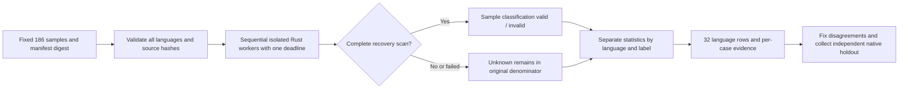

# Unified development evaluation of all 32 grammars

[简体中文](Codeguard-Grammar-Evaluation.zh_CN.md)

This implementation belongs to existing OpenSpec tasks S12.10–12.11, S14.17 and S14.19. The Rust development entry reuses `run_syntax_worker_candidate` and Core `evaluate_quality`. It replays a fixed corpus against every bundled grammar and produces per-language, per-case evidence without adding a second checker or task ledger.

## Run

From the repository root, build the program before replay. Do not run another Cargo build concurrently against that executable:

```bash
cargo build --locked -p codeguard-cli --features wasm-precheck
cargo run --locked -p codeguard-cli --features wasm-precheck \
  --example evaluate_grammars -- \
  "$PWD/target/debug/codeguard" tests/fixtures/grammar_regression.json 600 \
  > /tmp/codeguard-grammar-regression.json
```

The development report stays `incomplete` and exits 3. Invalid arguments or input exit 2. This is a development acceptance entry, not a replacement for product lint commands. It changes no workspace tasks, grammar qualifications or exceptions. CI runs it sequentially and retains JSON in the step output.



## Labels and statistics

The [fixed corpus](../tests/fixtures/grammar_regression.json) contains 186 cases: existing narrow labels for ten languages, expanded Erlang terminator cases, routing controls for every grammar and known VB.NET/CFQuery boundaries. Before execution, the reader checks the manifest digest, each source digest, unique IDs and the exact bundled-language set. Duplicate JSON keys, missing languages, unknown fields, changed bytes and self-declared approved labels are rejected.

`regression` means a repository development label, not a native oracle executed in this run or an independently approved holdout. A `pending` label remains outside TP/FP/FN. The CFQuery missing-select-list case is pending because structural parsing does not establish full SQL dialect validation.

The [report schema](../schemas/grammar-regression-evaluation-v0.1.schema.json) and [corpus schema](../schemas/grammar-regression-corpus-v0.1.schema.json) are version 0.1. Each language includes the original sample count, decidable/unknown counts, pending labels, evaluated cases, TP/FP/FN/TN, precision with its 95% Wilson interval, recall and parsing completion rate. These are **sample-level syntax classifications against development labels**, not exact rule-instance recall or production accuracy. Zero denominators produce null, never 100%. Pending labels and unknown parsing may overlap; they are not mutually exclusive groups.

`fixture_false_clean_count` counts invalid regression samples fully parsed without recoveries, not actual project-gate approvals. Performance records sequential cold-worker wall time p50/p95; it proves neither warm performance nor memory or equivalent-coverage budgets. Cases retain IDs, origins, source hashes, labels, classifications, recovery counts, reasons and timings, without echoing source text.

A changed executable hash withdraws all classifications. Cancellation and expiration preserve unrun cases as unknown under the same deadline. Budget enforcement covers native execution and loop admission; hashing I/O does not yet have a hard deadline guarantee.

The report fixes `authority=repository_regression_only`, `native_oracle_executed=false`, `independent_holdout=false`, `grammar_qualified_count=0` and `delivery_decision=not_evaluated`. Its conservative development calculation uses the specified 0.98 Wilson lower bound, zero false negatives and 200 minimum predictions, while explicitly retaining `approval=not_verified`. Regression agreement does not supply native, version/dialect, installed-host, warm/memory or release approval evidence.

See the [actual acceptance record](../tests/acceptance/grammar-regression-evaluation.md). Independent holdout, native-tool replay and vulnerability-database evaluation remain separate unfinished work; parent tasks stay open.
