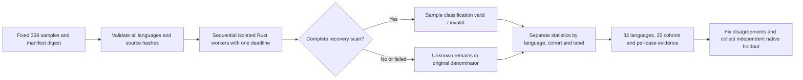

# Unified development evaluation of all 32 grammars

[简体中文](Codeguard-Grammar-Evaluation.zh_CN.md)

This implementation belongs to existing OpenSpec tasks S12.10–12.11, S14.17 and S14.19. The Rust development entry reuses `run_syntax_worker_candidate` and Core `evaluate_quality`. It replays a fixed corpus against every bundled grammar and produces per-language, per-case evidence without adding a second checker or task ledger.

## Run

From the repository root, build the program before replay. Do not run another Cargo build concurrently against that executable:

```bash
cargo build --locked -p codeguard-cli --features wasm-precheck
cargo run --locked -p codeguard-cli --features wasm-precheck \
  --example evaluate_grammars -- \
  "$PWD/target/debug/codeguard" tests/fixtures/grammar_regression_v0_2.json 1200 \
  > /tmp/codeguard-grammar-regression.json
```

The development report stays `incomplete` and exits 3. Invalid arguments or input exit 2. This is a development acceptance entry, not a replacement for product lint commands. It changes no workspace tasks, grammar qualifications or exceptions. CI runs it sequentially and retains JSON in the step output.



## Labels and statistics

The [current corpus](../tests/fixtures/grammar_regression_v0_2.json) contains 358 cases across all 32 languages and 35 language×source cohorts. It preserves all 186 legacy cases, adds 22 structural negatives and imports 150 Dart upstream cases. Every language has selected valid and invalid expectations; the new COBOL invalid expectation remains provisional, so this does not prove native confirmation for every negative. Duplicate keys, missing languages, unknown fields, manifest/source hash changes and self-declared approved labels are rejected before execution.

| `cohort` | Cases | Label authority |
|---|---:|---|
| `repository_regression` | 206 | Existing repository expectations; no native oracle executed in this run |
| `upstream_grammar_regression` | 150 | Dart grammar corpus with 4 expected ERROR/MISSING cases; not independent native labels |
| `provisional_syntax` | 2 | Pending CFQuery/COBOL expectations; excluded from TP/FP/FN/TN |

Build the new corpus using the Rust [developer importer](../crates/codeguard-cli/examples/build_grammar_corpus.rs):

```bash
cargo run --locked -p codeguard-cli --example build_grammar_corpus -- \
  tests/fixtures/grammar_regression.json \
  tests/fixtures/grammar_additional_regressions.json \
  > /tmp/codeguard-grammar-corpus.json
cmp /tmp/codeguard-grammar-corpus.json tests/fixtures/grammar_regression_v0_2.json
```

The importer retains CRLF, blank lines and the final expected tree. Origins bind the upstream file hash and sample name. Missing separators, empty nodes, malformed expectations and unsupported corpus directives are rejected. Grammar expectations remain grammar regression labels. The [legacy corpus](../tests/fixtures/grammar_regression.json), version 0.1 schemas and historical 186-case report remain intact; old input produces the old output shape.

The [report schema](../schemas/grammar-regression-evaluation-v0.2.schema.json) and [corpus schema](../schemas/grammar-regression-corpus-v0.2.schema.json) are version 0.2. Each language and nested `cohorts` row retains selected valid/invalid expectations, original sample count, decidable/unknown counts, pending labels, evaluated cases, TP/FP/FN/TN, Wilson intervals, recall and parsing completion rate. Selected-label counts include pending cases and do not assert native confirmation. Pending labels and unknown parsing may overlap.

Statistics classify whether each sample has any syntax recovery; they are not exact rule-instance recall or production accuracy. `metric_aggregation=single_cohort` retains that cohort's metrics; mixed-source summaries use `not_pooled` and set precision/recall to null while summing counts. Zero denominators also produce null. A grammar's own test labels cannot be pooled with repository expectations to imply independent evidence.

`fixture_false_clean_count` counts invalid regression samples fully parsed without recoveries, not actual project-gate approvals. Performance records sequential cold-worker wall time p50/p95; it proves neither warm performance nor memory or equivalent-coverage budgets. Cases retain IDs, origins, source hashes, labels, classifications, recovery counts, reasons and timings, without echoing source text.

A changed executable hash withdraws all classifications. Cancellation and expiration preserve unrun cases as unknown under the same deadline. Budget enforcement covers native execution and loop admission; hashing I/O does not yet have a hard deadline guarantee.

The report fixes `authority=repository_regression_only`, `native_oracle_executed=false`, `independent_holdout=false`, `grammar_qualified_count=0` and `delivery_decision=not_evaluated`. Its conservative development calculation uses the specified 0.98 Wilson lower bound, zero false negatives and 200 minimum predictions, while explicitly retaining `approval=not_verified`. Regression agreement does not supply native, version/dialect, installed-host, warm/memory or release approval evidence.

See the [actual acceptance record](../tests/acceptance/grammar-regression-evaluation.md). Independent holdout, native-tool replay and vulnerability-database evaluation remain separate unfinished work; parent tasks stay open.

## Report fragment with separate cohorts

This illustrates the protocol shape and omits other required fields; it is not complete runtime evidence:

```json
{
  "schema_version": "0.2.0",
  "cohort_policy": "separate_sources_no_pooled_precision",
  "language_count": 32,
  "cohort_count": 35,
  "languages": [{
    "language": "dart",
    "sample_count": 152,
    "metric_aggregation": "not_pooled",
    "precision": null,
    "recall": null,
    "cohorts": [
      {"cohort": "repository_regression", "sample_count": 2},
      {"cohort": "upstream_grammar_regression", "sample_count": 150}
    ]
  }]
}
```

The 150 Dart cases do not fill other languages' evidence gaps or combine with two repository cases into a stronger-looking Wilson interval. No cohort has independent holdout approval; qualified grammar count remains zero. See the separate [version 0.2 acceptance record](../tests/acceptance/grammar-cohort-regression-evaluation.md) for the actual 358-case replay.

## Explicit native differential development replay

The Rust `evaluate_native_grammars` example selects samples for explicitly supplied Zig0.16.0, OTP28, Apple Swift6.4 and kotlinc-jvm2.4.10 from the same frozen 32-language corpus. It reuses native adapters and the existing WASM worker. All 32 languages remain in inventory; unselected tools, missing adapters, incomplete native observations and hidden WASM recovery stay unresolved. TP/FP/FN/TN include only jointly decidable syntax samples. Located Kotlin syntax diagnostics survive mixed context blockers while execution remains incomplete. Changed tools/entries or program bytes withdraw classifications. Reports remain incomplete with zero qualified grammars and create no tasks or whitelist approvals. Reused adapters, regression samples and entry-artifact hashes do not prove independent holdout or full toolchain identity. See [native differential acceptance](../tests/acceptance/native-grammar-differential.md) for commands and actual evidence.


### Isolated Python native syntax comparison

Development replay now accepts explicit Ruff0.16.8 with the Python3.12 target. Frozen stdin, `--isolated --select E9 --ignore-noqa --no-cache` excludes project configuration and ordinary lint. Only consistent located `invalid-syntax` diagnostics classify syntax errors; F401, wrong paths/positions, changed versions or contradictory reports remain incomplete. Report0.2 preserves historical0.1 bytes and does not expand trusted task-closing authority. The18-case actual replay found two WASM false negatives: an empty function suite and incorrect indentation. Python remains unqualified; see [Python native differential acceptance](../tests/acceptance/python-native-grammar-differential.md).


### Empty-block structural facts (integration pending)

Rust runtime now provides `scan_wasm_empty_blocks`, traversing the full tree for blocks with no non-comment named statement and retaining parent kinds, byte positions and exhausted budgets. These facts are distinct from raw ERROR/MISSING and cannot authorize a language violation: a legal empty Rust function also produces a fact. Worker, public-report and repair-task integration remains incomplete; the two Python WASM false negatives remain open. See [structural-fact acceptance](../tests/acceptance/wasm-empty-block-facts.md).
