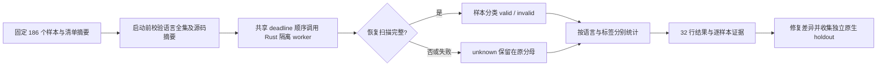

# 32 份 grammar 的统一开发评测

[English](Codeguard-Grammar-Evaluation.md)

此文对应现有 OpenSpec 的 S12.10–12.11、S14.17、S14.19。Rust 开发入口复用 `run_syntax_worker_candidate` 和 Core `evaluate_quality`，不新增第二套检查器或任务账本。它把分散的回归标签集中到固定语料，实际运行全部 32 份随仓 grammar，并形成可定位到样本的逐语言报告。

## 运行方式

在仓库根目录执行，先构建运行程序，再顺序回放，避免其它 Cargo 构建同时改写该程序：

```bash
cargo build --locked -p codeguard-cli --features wasm-precheck
cargo run --locked -p codeguard-cli --features wasm-precheck \
  --example evaluate_grammars -- \
  "$PWD/target/debug/codeguard" tests/fixtures/grammar_regression.json 600 \
  > /tmp/codeguard-grammar-regression.json
```

开发回放报告固定为 `incomplete`，退出 3；错参或无效输入退出 2。它是开发验收入口，不是 `codeguard lint` 的替代命令，不修改工作区任务、grammar 资格或白名单。CI 独立顺序执行并保留 JSON 步骤输出。

## 数据与执行路径



固定语料位于 [grammar_regression.json](../tests/fixtures/grammar_regression.json)。186 个样本包括已有十种语言的窄范围标签、Erlang 扩展终止符样本、全部 grammar 的路由控制样本，以及已知 VB.NET / CFQuery 边界。`manifest_sha256`、每个 `source_sha256` 和唯一 ID 在启动前检查；少一语言、重复键、未知字段、错误摘要和自行声明的批准标签都拒绝。

`regression` 是仓库内开发回归标签，**不是本轮执行的原生 oracle，也不是独立批准的 holdout**。`pending` 的临时预期只帮助调查，不进入 TP/FP/FN。CFQuery 缺 SQL 选择列表的样本使用 `pending`，因为该 grammar 的结构接受不能证明完整 SQL 方言检查。

## 报告含义

报告协议为 [grammar_regression_evaluation 0.1](../schemas/grammar-regression-evaluation-v0.1.schema.json)，语料协议为 [grammar_regression 0.1](../schemas/grammar-regression-corpus-v0.1.schema.json)。结果逐语言列出：

| 字段 | 含义 |
|---|---|
| `sample_count` | 原语料分母，失败与未知样本仍在其中 |
| `decidable_count` / `unknown_count` | 恢复扫描可判定与不可判定数量，不受临时标签影响 |
| `pending_label_count` | 未裁定标签数量，不与未知解析数量相加当作互斥分组 |
| `evaluated_count` | 有回归标签且可判定的样本数量 |
| `tp` / `fp` / `fn` / `tn` | 样本级“是否存在语法异常”的混淆计数，不是精确规则实例召回率 |
| `precision` / `recall` | 仅相对于开发回归标签；precision 附 95% Wilson 区间，零分母为 null |
| `fixture_false_clean_count` | 非法回归样本被完整解析为无恢复节点；不是项目门禁已经错误放行的次数 |
| `completion_rate` | 可判定解析数 / 全部样本数，不代表检查覆盖或源码正确率 |
| `performance` | 顺序冷 worker 的墙钟时间 p50/p95；不证明热启动、内存或同覆盖性能达标 |

每条样本保留 ID、来源、源码摘要、标签、实际分类、恢复数、未知原因和耗时；不在报告回显源码。程序启动前后摘要不一致时，全部分类撤回为 unknown。取消和预算耗尽不重置 deadline，尚未运行样本保留 unknown；预算控制进程执行与循环准入，不声称文件哈希 I/O 已有硬截止保障。

根报告固定 `authority=repository_regression_only`、`native_oracle_executed=false`、`independent_holdout=false`、`grammar_qualified_count=0`、`delivery_decision=not_evaluated`。统计门槛保持 Wilson 下界 0.98、零漏报；当前最低预测数量 200 仅用于保守开发计算，`approval=not_verified`。即使回归分类一致，也没有原生标签、版本/方言、真实宿主、热启动/内存和发布批准的自动升级。

本轮实际回放与剩余差异见 [验收记录](../tests/acceptance/grammar-regression-evaluation.md)。独立 holdout、真实原生工具回放和漏洞库评测必须继续单独实现；这些父任务保持未完成。
