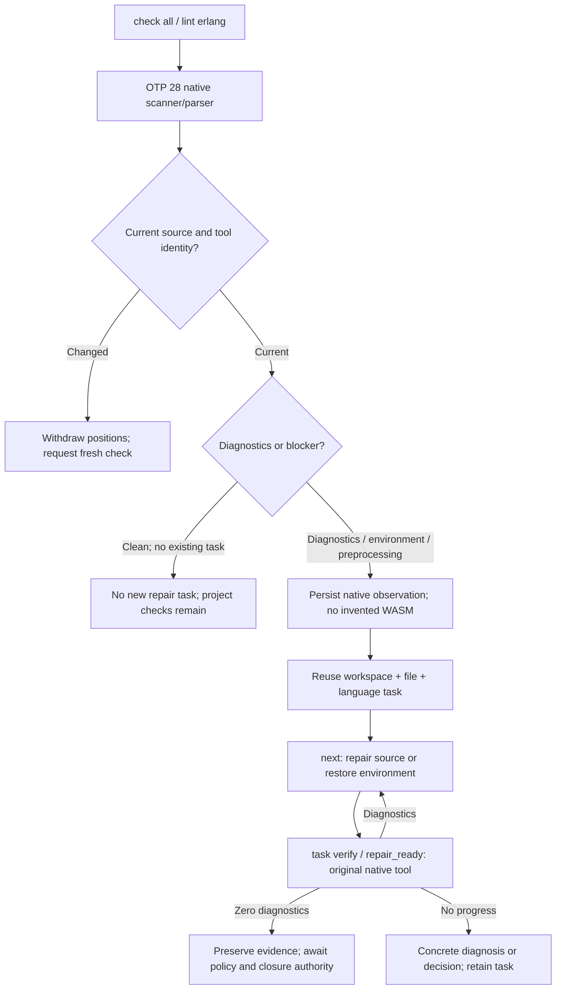
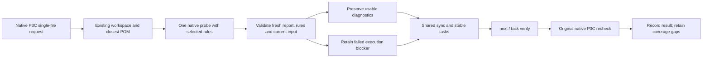
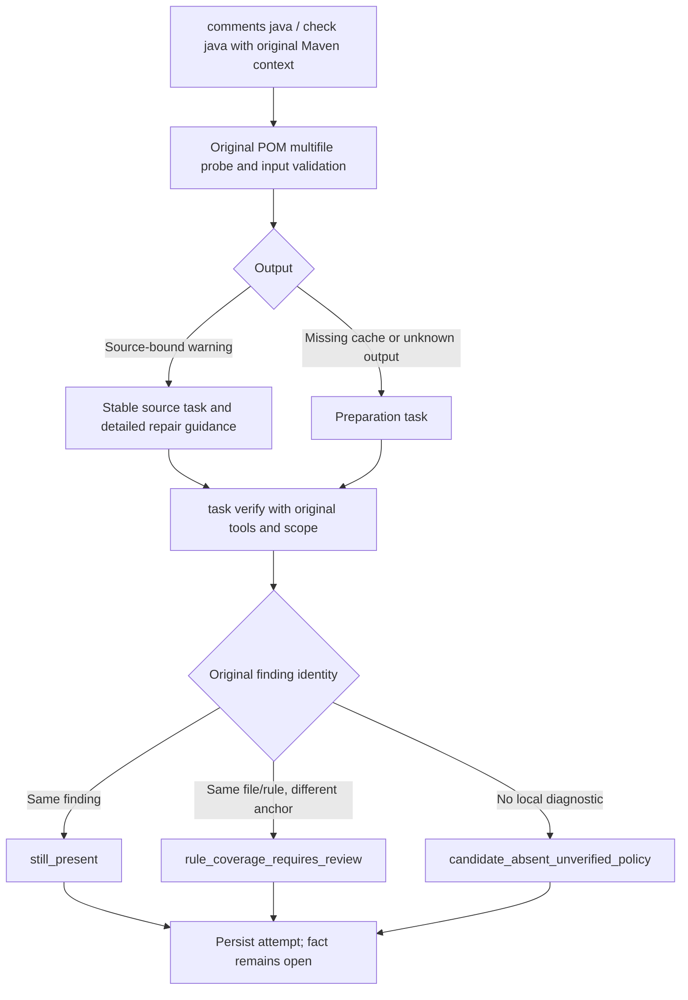
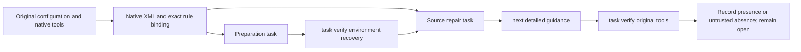

# CodeGuard — Native observations to repair tasks

The source build can create an Erlang confirmation task directly from native diagnostics or environment/preprocessing blockers, without a preceding WASM error. Both `check all` and `lint erlang FILE` reuse the same task in an initialized workspace. The single-file entry selects the nearest existing `.codeguard/`; it neither initializes an unbound directory nor bypasses a damaged workspace.

## Execution path



```bash
codeguard init . --apply
codeguard check all . --erl-tool /absolute/path/to/erl --format=json
# Or check a single file; it binds to the nearest existing workspace.
codeguard lint erlang src/app.erl --erl-tool /absolute/path/to/erl --format=json
codeguard next . --format=json
codeguard task verify TASK_ID . --erl-tool /absolute/path/to/erl --format=json
```

## Evidence, tasks and execution bounds

- Native-first evidence is `syntax_confirmation_observation` 0.2 with `observations: []`, explicitly recording no WASM observation. `native_evidence` binds source bytes, the selected tool and native positions.
- Workspace/file/language identity is shared with historical WASM confirmation tasks. Repeated scans update evidence; a bounded file batch synchronizes the workbench once rather than rescanning history for each file.
- `next` compares actual scan and recheck report timestamps and references the latest consumed report. A first scan never invents a `task_verify` operation or verification event.
- Missing tools, unsupported versions and unresolved preprocessing produce environment guidance, not source violations. Columns use `unicode_scalar`.
- Persistence failures retain native diagnostics and return a null task ID with `task_sync_reason`. Source/tool changes withdraw current repair positions.
- A clean initial observation creates no task. A clean observation for an existing task records evidence but leaves it open. Default-host trusted closure and full project lint/preprocessing/comments remain incomplete; the source SDK now supports limited Erlang resolution and recurrence; this slice does not qualify grammars.

## Versioned protocols

| Output | Version | Schema |
|---|---|---|
| Native-first observation | 0.2 | [observation](../schemas/syntax-confirmation-observation-v0.2.schema.json) |
| Bound forms scan | 0.2 | [scan](../schemas/erlang-forms-scan-v0.2.schema.json) |
| Bound check all | 0.37 | [check](../schemas/check-feedback-v0.37.schema.json) |
| Bound single-file lint | 0.3 | [lint](../schemas/erlang-lint-feedback-v0.3.schema.json) |
| First-scan next guidance | 0.5 | [next](../schemas/repair-brief-preview-v0.5.schema.json) |
| Recheck of native-first task | 0.3 / outer 0.14 | [recheck](../schemas/syntax-task-recheck-v0.3.schema.json), [feedback](../schemas/task-verification-preview-v0.14.schema.json) |

Unbound checks retain 0.36/scan 0.1 and single-file 0.2. Historical WASM-origin tasks retain recheck 0.2/outer 0.13. Post-recheck next remains 0.4; repair_ready remains Hook 0.8. Prior schema bytes are unchanged.

## Actual report examples

These are complete native-first and `next` outputs from a local OTP 28 run. Paths, workspace IDs and run IDs belong to that temporary acceptance workspace and are not reusable configuration. They do not certify delivery.

```json
{
  "affected_paths": [
    "app.erl"
  ],
  "authority": "local_unverified",
  "blocker_id": "CG-B-8a1ca1e0c61f9964d131d876588ba6d9",
  "build_root": ".",
  "checker_id": "syntax.native_confirmation",
  "coverage_proven": false,
  "delivery_decision": "not_evaluated",
  "execution": "incomplete",
  "fingerprint": "8a1ca1e0c61f9964d131d876588ba6d981175c0b5020a04500dc490ac01c4c93",
  "language": "erlang",
  "native_evidence": {
    "native": {
      "diagnostics": [
        {
          "column": 4,
          "line": 2,
          "rule_id": "erlang.syntax.error"
        }
      ],
      "diagnostics_truncated": false,
      "preprocessing_unresolved": false,
      "reason": "erlang_native_syntax_diagnostics",
      "status": "diagnostics_observed",
      "tool_sha256": "cd03d938d7547ef608076a58a49f5284931b43f39090087baf35efc1665dd5d6",
      "version": "OTP 28"
    },
    "target": {
      "language": "erlang",
      "path": "app.erl",
      "source_sha256": "22b202c1303137676dc8dbf46be3c26771f4faa453a223f1b607aecd2087c9e0"
    },
    "tool_path": "/opt/homebrew/Cellar/erlang/28.5/lib/erlang/bin/erl"
  },
  "observations": [],
  "reason_code": "native_syntax_confirmation_needed",
  "report_type": "syntax_confirmation_observation",
  "run_id": "syntax-confirm-4540-1791079691978950000",
  "schema_version": "0.2.0",
  "scope": "app.erl",
  "workspace_binding": "bound",
  "workspace_id": "ws-47d23398aadfa34bfe6493a1104f6880"
}
```

```json
{
  "authority": "local_unverified",
  "command_status": "complete",
  "delivery_decision": "not_evaluated",
  "disposition": "actionable",
  "exit_code": 0,
  "next_actions": [],
  "operation": "next",
  "reason": "local_task_selected",
  "repair_brief": {
    "action_id": "repair-source",
    "affected_paths": [
      "app.erl"
    ],
    "authority": "local_unverified",
    "build_root": ".",
    "checker_id": "syntax.native_confirmation",
    "closure_condition": "原生工具按相同受控策略完整复检并确认问题已解决；局部查询不能关闭任务",
    "constraints": [
      "先恢复检查完整性",
      "不得关闭检查器或修改无关源码"
    ],
    "disposition": "actionable",
    "evidence_ref": {
      "first_report_sha256": "d395171fb126df699a1593fe712e3405b99f645b9fedca9f9ea97ae97393a4b1",
      "first_run_id": "syntax-confirm-4525-1791079691732760000"
    },
    "history": {
      "attempt_count": 0,
      "awaiting_verification": false,
      "budget": 2,
      "no_progress_count": 0,
      "open_attempt_id": null,
      "recent": []
    },
    "kind": "blocker",
    "native_column_unit": "unicode_scalar",
    "native_confirmation_reason": "erlang_native_syntax_diagnostics",
    "native_confirmation_ref": {
      "report_ref": ".codeguard/reports/syntax-confirm-4540-1791079691978950000.json",
      "report_sha256": "a5aa5e7a3d8b2e3e2d002fa8a2c588ff7e5c13228a2f883e3b62da3b1a0cda6b",
      "run_id": "syntax-confirm-4540-1791079691978950000"
    },
    "native_confirmation_status": "diagnostics_observed",
    "native_diagnostic_positions": [
      {
        "column": 4,
        "line": 2,
        "rule_id": "erlang.syntax.error"
      }
    ],
    "reason_code": "native_syntax_confirmation_needed",
    "recheck_argv": [
      "codeguard",
      "task",
      "verify",
      "CG-B-8a1ca1e0c61f9964d131d876588ba6d9",
      ".",
      "--format",
      "json",
      "--erl-tool",
      "/opt/homebrew/Cellar/erlang/28.5/lib/erlang/bin/erl"
    ],
    "schema_version": "0.5.0",
    "scope": "app.erl",
    "step": "当前源码已有原生 Erlang 语法诊断；核对报告中有界原生位置并修复，然后使用同一工具复检；不要反复安装工具或关闭检查",
    "task_id": "CG-B-8a1ca1e0c61f9964d131d876588ba6d9"
  },
  "report_type": "repair_brief_preview",
  "schema_version": "0.5.0"
}
```

Public npm 0.1.4 does not include this batch. A private source-built package passed offline installation in an isolated cache and native-first lint/check/next/task verify/repair_ready flows. Controlled protocol and real OTP 28 runs remain separate; 26 actual reports passed their schemas. A clean recheck without trusted policy keeps the task open; persistence failure retains diagnostics without inventing a task. This does not upgrade the public version. Installed-host display and plugin release require separate acceptance. See [native workflow acceptance](../tests/acceptance/erlang-native-first-workbench.md) and [installed-package acceptance](../tests/acceptance/npm-erlang-native-repair.md).

## P3C single-file project binding

Native `lint java FILE --checker p3c` selects the nearest existing workspace, or explicit `--workspace ROOT`. Only the selected file and the nearest POM’s statically confirmed rule subset are checked. A missing/unknown child configuration shadows the parent; default ten-rule-set probes cannot substitute for it. Explicit P3C selection retains native preparation blockers; default context-free WASM remains a separate candidate path.



```bash
codeguard lint java src/main/java/Example.java --checker p3c --workspace . \
  --maven-tool /absolute/path/to/mvn --java-home /absolute/path/to/jdk \
  --maven-repo /absolute/path/to/offline-repository --repo-sha256 REPOSITORY_TREE_SHA256 \
  --format json
codeguard next . --format json
codeguard task verify TASK_ID . --maven-tool /absolute/path/to/mvn \
  --java-home /absolute/path/to/jdk --maven-repo /absolute/path/to/offline-repository \
  --repo-sha256 REPOSITORY_TREE_SHA256 --format json
```

Replace example paths, repository identity and task ID with the actual selected context. Bound feedback is [0.1](../schemas/java-p3c-file-feedback-0.1.schema.json), nesting existing project observation 0.2; unbound feedback stays 0.2. The single-file path reads ancestor POM candidates without discovering sibling sources. It reuses the aggregate persistence/sync service and existing native task verification. Damaged workspaces, outside sources and source/parent links stop before Maven. Persistence failure preserves native diagnostics and its actual reason, without a next task. Zero diagnostics leave the task open while rule coverage remains unproven. This change is absent from public npm 0.1.4. [Controlled protocol acceptance](../tests/acceptance/java-p3c-file-workbench.md) does not certify complete P3C/effective-model coverage or real-host installation.

Project observation 0.2 preserves nonempty validated diagnostics when local status is `incomplete` and reason is `native_execution_failed`. The source/rule/location projection undergoes the same current-byte and configuration checks as successful diagnostic reports. Sync imports both the source finding and execution blocker; `observed_file_count` stays unchanged. A matching positive recheck is `still_present`; partial zero results are `incomplete`, and blocker verification remains `still_blocked`. Legacy 0.2 reports without flat projections retain their blocker-only interpretation. No schema fields or approval semantics change. See [acceptance](../tests/acceptance/java-p3c-partial-execution.md).


### Erlang task resolution and recurrence (current source SDK)

`verify_erlang_task_resolution` reuses Zig's signed-policy verification, shared deadline, lease, attempt handoff and append-only parent chain. The protected host independently fixes the trust root, workspace, policy revision, baseline and trusted clock; project files cannot grant approval. OTP 28 scans/parses the original counterexample and current bytes separately. Only an original native diagnostic, changed source and a complete clean current result can record `code_fixed`. Macros/includes, empty forms, truncation and execution failures require verification; an originally valid sample requires false-positive investigation.

Both WASM-first and native-first tasks are supported. Erlang policy 1.1.0/evidence 0.2.0 stay separate from Zig 1.0.0/0.1.0. Native-first evidence requires `grammar_sha256=null` and the original tool identity. The internal rule identity uses the actual approved policy-byte digest instead of inventing a grammar digest. History checks bind the language, source and grammar to the first report; rehashing local files cannot switch languages. Ordinary `task verify --erl-tool` can append recurrence with the matching tool, but cannot close a task without trusted policy.

This remains a source SDK without the default plugin's trusted policy provider. Public npm 0.1.4 lacks this extension; syntax receipts do not certify complete lint, security or project delivery. The tool digest binds the launcher; the host must independently protect the OTP environment. See [Erlang lifecycle acceptance](../tests/acceptance/erlang-task-resolution-lifecycle.md) for the execution path and actual results.


#### Actual receipt example

This native-first receipt came from installed OTP 28. The signing root and clock are test fixtures: `host_context_verified` applies only to that context, not default-plugin approval. `resolved` covers one syntax task; delivery remains unevaluated.

```json
{
  "authority": "host_context_verified",
  "delivery_decision": "not_evaluated",
  "event_ref": ".codeguard/findings/CG-B-adbe0d18568c875773065066871ea3ae/events/lifecycle-event-fb3b032308cacd1f0ac441e5b3cf0634b54d4ec2719dfed22cdee6dbca9e8c96.json",
  "evidence_ref": ".codeguard/state/resolution_evidence/be49a29789222b17f49c539f9e0527faad9f9d0c9726ae874e3506ae8d050ecb.json",
  "evidence_sha256": "be49a29789222b17f49c539f9e0527faad9f9d0c9726ae874e3506ae8d050ecb",
  "identity": {
    "checker_id": "syntax.native_confirmation",
    "scope": "app.erl",
    "task_id": "CG-B-adbe0d18568c875773065066871ea3ae",
    "workspace_id": "ws-61c7cac666cd3addf981def0b69429cb"
  },
  "outcome": "code_fixed",
  "policy_revision": "p1",
  "policy_sha256": "78518f40ca4579bb414a8cac0ac216bebb0a2df14227142402b6aa4ef43e4d0f",
  "report_type": "task_resolution_receipt",
  "schema_version": "0.1.0",
  "state": "resolved"
}
```

The original [receipt](../tests/acceptance/evidence/otp28-native-first-resolved-2026-10-04.json), [evidence](../tests/acceptance/evidence/otp28-native-first-resolved-2026-10-04-evidence.json) and [recurrence receipt](../tests/acceptance/evidence/otp28-native-first-reopened-2026-10-04.json) retain their emitted bytes.


### Automatic native Erlang discovery for task rechecks (current source)

`codeguard task verify "$TASK_ID" . --format=json` (with `TASK_ID` set to the actual `task_id` returned by `next`) reuses lint/check selection for existing Erlang syntax tasks: explicit `--erl-tool` takes priority; otherwise the first executable erl in an absolute invoking-PATH directory is fixed. Rechecks verify OTP 28, current source and tool bytes while retaining leases, budgets, events and existing report versions. Both candidate-origin and native-first tasks can be rechecked; repair-ready Hooks use the same entry.

Only an absent tool produces `erlang_tool_not_found_on_path`; empty/relative PATH entries and non-executable files are ignored. An invalid explicit tool, unsupported selected version or execution failure never selects a later tool or installs one. After a valid observation, `next` supplies explicit recheck argv for the actual tool so later PATH changes cannot replace that entry. Local zero diagnostics still do not close tasks automatically; preprocessing, trusted policy and complete project capability remain separate obligations. See [recheck discovery acceptance](../tests/acceptance/erlang-recheck-discovery.md). Public npm 0.1.4 does not contain this batch.

### Native confirmation of unlocated Swift observations (current source)

An existing Swift confirmation task now accepts `codeguard task verify "$TASK_ID" . --swift-tool /absolute/path/to/swiftc --format=json`, where `TASK_ID` comes from actual `next` output. `hook execute` accepts the same option for `repair_ready`. The caller supplies an installed Apple Swift 6.4 compiler; this path does not install tools or execute editable paths from historical reports. Missing tools receive an existing-compiler recovery action; unsupported versions and execution failures retain the task.

Rust reads and rechecks bounded source bytes, then runs `swiftc -frontend -parse -diagnostic-style llvm -no-color-diagnostics -` with frozen stdin, `/` as cwd, a cleared environment and the shared deadline. Only native error rules and positions enter agent guidance; raw diagnostic text is not treated as an instruction. Columns are UTF-8 bytes and must fall on character boundaries. Unknown output, exit/diagnostic contradictions, timeout, invalid positions and tool changes remain incomplete. The tool digest binds the launcher, not the entire Swift installation.

Native errors make the same task actionable for source repair. Source or tool changes withdraw old positions. A clean parse records `candidate_absent_unverified_policy` without automatically closing the task or satisfying project lint, type checking, macro/conditional-compilation context, build, security or delivery obligations. Existing no-progress budgets still apply. Swift grammar qualification and the 32-language precision conclusions are unchanged; public npm 0.1.4 does not contain this extension.

New protocols are `syntax_task_recheck` 0.4.0, `task_verification_preview` 0.15.0, `repair_brief_preview` 0.6.0 and Hook feedback 0.9.0 (task summary 0.3.0). Aggregate `check` uses 0.39.0 when `next` contains a native Swift brief; other paths retain 0.38.0. Historical schemas remain unchanged. See [Swift native-confirmation acceptance](../tests/acceptance/swift-native-task-confirmation.md) for actual reports and limits.


### Ruby resolution with the original tool (current source SDK)

`verify_ruby_task_resolution(&RubyTaskResolutionRequest)` integrates fixed Ruby 2.6.10p210 with the existing host SDK. Signed policy 1.9.0 and evidence 0.10.0 support native-first tasks with a null grammar and the original tool identity, and WASM-first tasks with the original grammar. Both source checks share a deadline; project version declarations and missing declaration paths are rechecked throughout the request. Closure requires the original tool to confirm the original issue and complete the changed current source without diagnostics, while inputs remain stable. Repeated verification is idempotent; ordinary `task verify --ruby-tool` can record recurrence along the same parent chain.

A native counterexample requires false-positive review. Unsupported versions, invalid output, or declaration changes cannot close the task. Diagnostics retain native line numbers without invented columns or claims of RuboCop coverage. Trust still comes from an independent host; this source extension is not an npm release or default-plugin trusted closure acceptance. See [Ruby acceptance](../tests/acceptance/ruby-task-resolution.md).


### ShellCheck rule-specific closure and recurrence (source SDK)

`verify_shell_task_resolution(&ShellTaskResolutionRequest)` supports native finding tasks with pinned ShellCheck 0.11.0. Policy 1.10.0 binds task, original rule/report/source, tool, adapter, dialect and project configuration. Evidence 0.11.0 and receipt 0.2.0 use the ordinary `CG-…` finding identity; receipt 0.1.0 is unchanged. The original and current samples are checked by the same tool with frozen configuration. Absence of the original rule closes only that task, while other diagnostics and tasks remain. An ordinary recheck detecting that rule again under the same configuration/tool reopens the same task along its event chain.

Configuration changes cannot count as source fixes. Changed disable directives or existing directives affecting the original rule without scope proof require review; unchanged directives solely affecting unrelated rules do not automatically prevent closure. Malformed/incomplete native output and an original sample that does not confirm the rule cannot close the task. Borrowed leases and ready attempts are supported. The independent host signature requirement remains; this is neither default CLI closure nor project acceptance nor a published npm capability. See [rule-specific acceptance](../tests/acceptance/shell-task-resolution.md).


### Native confirmation for unlocated grammar errors (source build)

When an explicit `grammar probe` sees a tree error without publicly traversable recovery positions, report0.5 sets `parser_error_location_unavailable=true` and requests native checking of the original bytes before source repair or grammar investigation. Zero positions no longer receive only routine lint advice. The result remains incomplete, with no fabricated location or grammar qualification. Budget exhaustion retains the existing aggregate but does not fabricate hidden-token evidence; ordinary/structural paths retain prior versions.

The same pinned Kotlin/Swift assets reproduce the visibility gap in existing web-tree-sitter0.25.10. Changing the loader alone is not supported as a fix. A valid Kotlin object declaration can also produce a hidden semicolon, so has_error alone cannot justify a source violation. See [evidence and boundaries](../tests/acceptance/hidden-parser-error-guidance.md).


The standalone JDK21 path now preserves empty comments, missing purpose and bare parameter/return/exception descriptions as five native rules in stable repair tasks. `lint java FILE --checker javadoc`, `comments java FILE --workspace .`, configured project comments and original-task verification share source-bound parsing. The legacy parser and Maven protocols remain unchanged. Separate contracts are native0.2, project0.4, workbench/recheck0.3, file feedback0.7/workbench feedback0.8, repair brief0.4, task preview0.31, aggregate0.68 and aborted0.19. Missing configuration/tools and unknown output remain incomplete. Actual JDK21 examples in both modes yield 4/3/1/0 diagnostics; all16 original tasks are rechecked while present and after repair, with absent candidates still open. Detailed Chinese and valid inherited documentation produce no diagnostics. Full Java behavior contracts, actual Maven description acceptance, full native Checkstyle description acceptance, all-language qualification and trusted closure remain pending. See [standalone JDK description acceptance](../tests/acceptance/jdk-javadoc-detailed-descriptions.md).

## Maven detailed Javadoc descriptions: implementation and qualification

The original-POM multifile path now preserves five native description rules: empty comments, missing main purpose, and empty parameter, return and exception descriptions. The separate detailed parser binds messages, source lines, carets, locations and totals; historical parser/schema contracts are unchanged. Warnings remain findings even with BUILD SUCCESS. Unknown output, tool/configuration failures and the observed missing offline plugin remain incomplete preparation observations. A Maven failure cannot fall back to a single-file check.



Use `codeguard comments java . --maven-tool /absolute/mvn --java-home /absolute/jdk21 --maven-repo /absolute/offline-repo --repo-sha256 ACTUAL_DIGEST --format json`, then `codeguard task verify CG-task-id .` with the same explicit tool context. Replace paths/digests with actual existing identities. CodeGuard does not install plugins or weaken rules. Repair guidance requires meaningful purpose, parameter, return and exception descriptions, not bare tags.

Separate closed protocols are Maven native/workbench/recheck0.2, project0.5, unbound/bound comments0.9/0.10, inner brief0.6/preview0.3, task preview0.32, aggregate0.69 and aborted0.20. First import recomputes rules/projections and rejects downgrade. Recheck verifies the consumed original report digest receipt and task scope/rule, including new tasks whose first evidence is a recheck wrapper. Zero diagnostics cannot close a task; trusted closure/recurrence remain unaccepted.

Controlled process fixtures exercise all five rules with success and warning-failure exits through public checking, task reuse, original-task recheck and repaired untrusted absence. They are not actual plugin qualification. Existing Maven3.9.16/JDK21 ran twice against an empty offline repository: checking and environment-task recheck both identified the missing Javadoc3.12.0 plugin and emitted no source findings. The plugin cache is absent; actual detailed 4/3/1/0 cases and warning-failure configuration remain unexecuted conditional acceptance. Full Java behavior contracts, full native Checkstyle description acceptance, all57 languages/four core capabilities, hosts/platforms and trusted closure remain pending. OpenSpec15.3/15.6 stay open; formal syntax qualification remains0/32. See [acceptance](../tests/acceptance/maven-javadoc-detailed-descriptions.md).

## Checkstyle description modules: source integration, native qualification pending

Original `JavadocStyle`, `NonEmptyAtclauseDescription` and `SummaryJavadoc` configurations now pass the pinned10.21.4 static adapter, retaining official full/short names, custom IDs, severity and module-specific properties. Empty-description, first-sentence/HTML, scopes/tokens, tag tokens, summary period/forbidden fragments and non-tight-HTML options remain original XML for native execution. Rust does not replace Checkstyle or evaluate Java regexes with Rust semantics. Unknown tokens/sources, misplaced properties and shared IDs remain unresolved. Native-valid empty summary period/regex options are preserved.

Use `codeguard lint java FILE --checker checkstyle --workspace . --config ORIGINAL_XML --java-tool EXISTING_JAVA --checkstyle-jar EXISTING_JAR --format json`. Stable tasks retain detailed purpose, parameter/return/exception or summary repair guidance. `codeguard task verify CG-task-id .` requires the explicit original tool/configuration context. New source tasks created during environment recovery can be rechecked from their wrapped first evidence. Local absence/restoration cannot close a task.



Separate contracts are local feedback0.5, workbench/source recheck/preparation recheck0.2, brief/preview0.25, source task preview0.33 and preparation preview0.34. Historical schemas are unchanged. First import rejects extended configurations disguised as workbench0.1; recheck and scan versions must match. Aggregate0.70 supports a selected detailed Checkstyle brief, but this batch's public aggregate selected a higher-priority P3C preparation task and retained0.58. Version0.70 has constructed serialization validation only, not actual route qualification. That public aggregate also exposed a historical invalid Javadoc reason; the producer now emits the existing `javadoc_checker_not_configured` code without claiming configuration or execution.

Controlled XML process fixtures cover all three classes, task reuse/repair recheck and preparation recovery with recheckable new source tasks. The fixture is not Java/Checkstyle and proves no native semantics or precision. No existing10.21.4 all-JAR was found; the real conditional test remains unexecuted. Full description/configuration/project coverage, independent false-positive evaluation, trusted closure/recurrence, all57 languages/four capabilities and production host/platform acceptance remain pending. Tasks15.3/15.6 stay open; formal syntax qualification remains0/32. See [acceptance](../tests/acceptance/checkstyle-detailed-descriptions.md).
