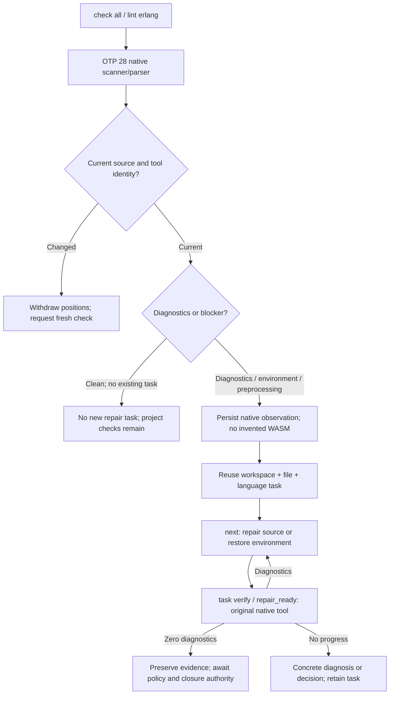

# CodeGuard — 原生发现到修复任务

当前源码的 Erlang 原生检查不再依赖先有 WASM 错误。已初始化工作区中，`check all` 和 `lint erlang FILE` 会把当前诊断或环境/预处理阻塞直接保存到同一稳定任务；未初始化目录不自动创建工作台。单文件入口选择最近已有 `.codeguard/`，损坏工作台不越过或初始化。

## 执行路径



```bash
codeguard init . --apply
codeguard check all . --erl-tool /absolute/path/to/erl --format=json
# Or check a single file; it binds to the nearest existing workspace.
codeguard lint erlang src/app.erl --erl-tool /absolute/path/to/erl --format=json
codeguard next . --format=json
codeguard task verify TASK_ID . --erl-tool /absolute/path/to/erl --format=json
```

## 证据、任务和性能边界

- 首次原生证据使用 `syntax_confirmation_observation` 0.2，`observations: []` 明确没有 WASM 观察；`native_evidence` 绑定源码、所选工具和原生位置。
- 文件/语言身份与旧 WASM 确认任务相同。重复扫描只更新证据；每轮有界文件批次只执行一次工作台同步，不为每个文件重扫历史。
- `next` 比较扫描与复检的实际报告时间，返回最新已消费报告引用。初始扫描不伪造 `task_verify` 操作或验证事件。
- 缺工具、版本不匹配和预处理未展开进入环境指引，不能形成源码违规。诊断列为 `unicode_scalar`。
- 报告保存或同步失败保留原生诊断，任务 ID 为 null，并返回 `task_sync_reason`。源码或工具变化撤回当前修复位置。
- 首次零诊断不创建修复任务；已有任务的零诊断保留观察、仍为 open。可信关闭、复发重开及完整项目 lint/预处理/注释仍需完成；本切片不提升 grammar 资格。

## 版本化协议

| Output | Version | Schema |
|---|---|---|
| Native-first observation | 0.2 | [observation](../schemas/syntax-confirmation-observation-v0.2.schema.json) |
| Bound forms scan | 0.2 | [scan](../schemas/erlang-forms-scan-v0.2.schema.json) |
| Bound check all | 0.37 | [check](../schemas/check-feedback-v0.37.schema.json) |
| Bound single-file lint | 0.3 | [lint](../schemas/erlang-lint-feedback-v0.3.schema.json) |
| First-scan next guidance | 0.5 | [next](../schemas/repair-brief-preview-v0.5.schema.json) |
| Recheck of native-first task | 0.3 / outer 0.14 | [recheck](../schemas/syntax-task-recheck-v0.3.schema.json), [feedback](../schemas/task-verification-preview-v0.14.schema.json) |

未绑定工作区的检查仍使用原 0.36/scan 0.1、单文件 0.2；历史 WASM 来源任务仍使用 recheck 0.2/外层 0.13。复检后的 next 仍为 0.4，repair_ready 仍为 Hook 0.8；旧 schema 字节未改。

## 实际报告示例

以下是本机 OTP 28 执行的完整原生首次报告和 `next` 输出。路径、工作区身份和运行编号仅属于该次临时验收，不是可复用配置；不是完整交付通过。

```json
{
  "affected_paths": [
    "app.erl"
  ],
  "authority": "local_unverified",
  "blocker_id": "CG-B-8a1ca1e0c61f9964d131d876588ba6d9",
  "build_root": ".",
  "checker_id": "syntax.native_confirmation",
  "coverage_proven": false,
  "delivery_decision": "not_evaluated",
  "execution": "incomplete",
  "fingerprint": "8a1ca1e0c61f9964d131d876588ba6d981175c0b5020a04500dc490ac01c4c93",
  "language": "erlang",
  "native_evidence": {
    "native": {
      "diagnostics": [
        {
          "column": 4,
          "line": 2,
          "rule_id": "erlang.syntax.error"
        }
      ],
      "diagnostics_truncated": false,
      "preprocessing_unresolved": false,
      "reason": "erlang_native_syntax_diagnostics",
      "status": "diagnostics_observed",
      "tool_sha256": "cd03d938d7547ef608076a58a49f5284931b43f39090087baf35efc1665dd5d6",
      "version": "OTP 28"
    },
    "target": {
      "language": "erlang",
      "path": "app.erl",
      "source_sha256": "22b202c1303137676dc8dbf46be3c26771f4faa453a223f1b607aecd2087c9e0"
    },
    "tool_path": "/opt/homebrew/Cellar/erlang/28.5/lib/erlang/bin/erl"
  },
  "observations": [],
  "reason_code": "native_syntax_confirmation_needed",
  "report_type": "syntax_confirmation_observation",
  "run_id": "syntax-confirm-4540-1791079691978950000",
  "schema_version": "0.2.0",
  "scope": "app.erl",
  "workspace_binding": "bound",
  "workspace_id": "ws-47d23398aadfa34bfe6493a1104f6880"
}
```

```json
{
  "authority": "local_unverified",
  "command_status": "complete",
  "delivery_decision": "not_evaluated",
  "disposition": "actionable",
  "exit_code": 0,
  "next_actions": [],
  "operation": "next",
  "reason": "local_task_selected",
  "repair_brief": {
    "action_id": "repair-source",
    "affected_paths": [
      "app.erl"
    ],
    "authority": "local_unverified",
    "build_root": ".",
    "checker_id": "syntax.native_confirmation",
    "closure_condition": "原生工具按相同受控策略完整复检并确认问题已解决；局部查询不能关闭任务",
    "constraints": [
      "先恢复检查完整性",
      "不得关闭检查器或修改无关源码"
    ],
    "disposition": "actionable",
    "evidence_ref": {
      "first_report_sha256": "d395171fb126df699a1593fe712e3405b99f645b9fedca9f9ea97ae97393a4b1",
      "first_run_id": "syntax-confirm-4525-1791079691732760000"
    },
    "history": {
      "attempt_count": 0,
      "awaiting_verification": false,
      "budget": 2,
      "no_progress_count": 0,
      "open_attempt_id": null,
      "recent": []
    },
    "kind": "blocker",
    "native_column_unit": "unicode_scalar",
    "native_confirmation_reason": "erlang_native_syntax_diagnostics",
    "native_confirmation_ref": {
      "report_ref": ".codeguard/reports/syntax-confirm-4540-1791079691978950000.json",
      "report_sha256": "a5aa5e7a3d8b2e3e2d002fa8a2c588ff7e5c13228a2f883e3b62da3b1a0cda6b",
      "run_id": "syntax-confirm-4540-1791079691978950000"
    },
    "native_confirmation_status": "diagnostics_observed",
    "native_diagnostic_positions": [
      {
        "column": 4,
        "line": 2,
        "rule_id": "erlang.syntax.error"
      }
    ],
    "reason_code": "native_syntax_confirmation_needed",
    "recheck_argv": [
      "codeguard",
      "task",
      "verify",
      "CG-B-8a1ca1e0c61f9964d131d876588ba6d9",
      ".",
      "--format",
      "json",
      "--erl-tool",
      "/opt/homebrew/Cellar/erlang/28.5/lib/erlang/bin/erl"
    ],
    "schema_version": "0.5.0",
    "scope": "app.erl",
    "step": "当前源码已有原生 Erlang 语法诊断；核对报告中有界原生位置并修复，然后使用同一工具复检；不要反复安装工具或关闭检查",
    "task_id": "CG-B-8a1ca1e0c61f9964d131d876588ba6d9"
  },
  "report_type": "repair_brief_preview",
  "schema_version": "0.5.0"
}
```

公开 npm 0.1.4 不含本批实现。当前源码的私有包已通过隔离缓存离线安装后的原生首次 lint/check/next/task verify/repair_ready：受控协议与真实 OTP 28 两组分开运行，26 份实际报告经 schema 校验。修复后没有可信策略仍保留 open，持久化失败保留位置且不伪造任务。该证据不代表公开版本已升级；实际宿主自动显示与插件发布仍需独立验收。见[原生链路验收](../tests/acceptance/erlang-native-first-workbench.md)和[安装后验收](../tests/acceptance/npm-erlang-native-repair.md)。
