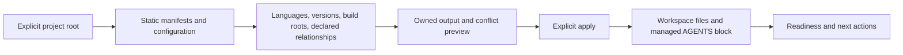

# Codeguard Project Initialization

> **Document version:** 1.2.0 · **Updated:** 2026-09-29. Current slices and target contracts are explicitly separated.

[简体中文](Codeguard-Project-Initialization.zh_CN.md) · [Documentation](README.md) · [Architecture](Codeguard-Architecture.md) · [Technical design](Codeguard-Technical-Design.md)

## 1. Purpose and current scope

Initialization creates a stable project identity, observes existing configuration, and gives agents a bounded project guide. It must not confuse “configuration exists” with “a checker ran”. Current static discovery, owned output and refresh contracts are grounded in [init_command.rs](../crates/codeguard-cli/src/init_command.rs) and [tests](../crates/codeguard-cli/tests/init_command_contract.rs). Effective build models, inferred architecture and automatic host activation are separate targets.



## 2. Artifacts and ownership

| Artifact | Contract |
|---|---|
| `.codeguard/workspace.json` | Stable workspace identity and managed summary; no portable absolute local path as identity |
| `.codeguard/project.json` | Static observations with source and uncertainty |
| `.codeguard/module-graph.json` | Typed relationships and unresolved conditions, not a fabricated call graph |
| `.codeguard/architecture.md` | Human-readable projection with evidence-labelled claims |
| `AGENTS.md` | Only the Codeguard marked block is owned; preserve all surrounding user text |
| `.codeguard/README.md`, `.gitignore` | Explain workflow and precisely ignore local report/run/cache/worktree/state data |
| findings/tasks/decisions | Persistent facts, repair projections and decision references; directory placement grants no approval |

The folder is `.codeguard/`. An existing ordinary `codeguard/` directory may contain source and remains checked. Never silently migrate, overwrite or blanket-exclude it. Missing owned markers, malformed records, concurrent modifications and path collisions require explicit conflicts rather than destructive repair.

## 3. Observation model

Record language IDs and declared version constraints separately from observed local runtimes. Identify build/package managers, root manifests, lockfiles, workspaces and declared modules. Record enabled checker plugins/configuration, scripts and CI declarations as observations without executing project code during static initialization.

Relationships must distinguish declaration, source import, build dependency, runtime dependency and inferred architecture. Preserve conditional profiles, unresolved versions, external coordinates and unsupported build expressions. A directory named `domain` is not proof of DDD; controllers do not prove MVC. Claims use observed/inferred/confirmed/unknown status, evidence references and an explicit confirmation source. Current architecture may legitimately remain unknown.

Architecture projections should explain module responsibilities only where evidence supports them, dependency direction and unresolved boundaries. Do not invent ownership, business capabilities, service topology or deployment credentials. The module graph is not CodeGraph's semantic call graph.

## 4. Preview, apply and refresh

```bash
codeguard init .
codeguard init . --apply
codeguard doctor .
```

These are bounded preparation steps, not a quality certification. Preview reports planned writes and conflicts. Apply rechecks expected state and owns only generated outputs/markers. Refresh merges supported managed data while protecting user edits and stable identity. Partial writes remain visible and recoverable; never erase the evidence/history store to make refresh succeed.

Project knowledge should include available native checks, missing prerequisites, supported invocation roots and next actions. Do not paste sensitive environment values or raw diagnostic credentials into AGENTS. Toolchain installation, source rewrites, migrations, builds, hook activation and policy approval are not implicit initialization side effects.

## 5. Acceptance boundaries

Test empty/mixed projects, nested roots, conflicting versions, malformed manifests, conditional dependencies, unknown architecture, preexisting AGENTS text, malformed markers, symlinks, interrupted apply, concurrent edits and repeated refresh. Stable identity and user text must survive reruns. Missing tooling yields preparation tasks, not unrelated source edits.

Schema versions belong to their specific artifacts. Older design examples using previous profile/workspace versions are historical; consumers must use current schemas and declare supported migrations. See the [Chinese detailed observation/refresh contracts](Codeguard-Project-Initialization.zh_CN.md) for retained per-ecosystem observations, and [OpenSpec](../openspec/changes/introduce-rust-codeguard-cli/proposal.md) for pending implementation.
