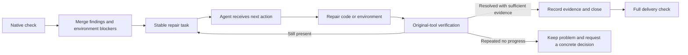

# Codeguard Remediation Workflow

> **Document version:** 1.2.0 · **Updated:** 2026-09-29. Current slices and target contracts are explicitly separated.

[简体中文](Codeguard-Remediation-Workflow.zh_CN.md) · [Documentation](README.md) · [Architecture](Codeguard-Architecture.md) · [Technical design](Codeguard-Technical-Design.md)

## 1. Facts, projections and evidence

A finding is a stable fact with append-only events. A task is its readable repair projection; editing Markdown does not modify a gate or prove resolution. Decisions reference independent authority. Local reports, runs, caches, worktrees, receipts, observations and leases stay under precisely ignored directories in `.codeguard/`; tracked records still require redaction and repository security checks.

This is the complete target lifecycle. Current selected CLI check/doctor paths already persist and synchronize reports; general host automation, formal verified closure/recurrence and complete final delivery remain incomplete. Current absent findings can become candidates for further verification, not automatically resolved tasks.

## 2. Stable identity and import

Import all matching unimported reports, not merely the newest timestamp. Workspace + run ID + report digest make replay idempotent and expose conflicting reuse. Findings retain native rule/tool/category, target and evidence identity; environment blockers use their own stable identity and task type. Do not merge unrelated defects by message similarity or split the same defect because line numbers moved.

A report failure retains qualified findings and independent completion status. Invalid reports produce redacted import-failure receipts and an actionable next step, without manufacturing source defects. Persistence failure reports `backlog_update_failed` alongside the scan result; the backlog cannot silently look clean.

## 3. Repair brief

Every task must provide:

- Problem evidence, native rule basis and exact target.
- Allowed files/configuration/environment scope and prohibited scope expansion.
- Concrete repair steps, prerequisites and original-tool verification command.
- Historical attempts, changes, outcomes and remaining uncertainty.
- Closure conditions tied to content, rule, tool, policy and coverage identity.

Missing JDK or a broken checker configuration produces an environment/configuration task. Exact project-native configuration bytes and identity matter: an adapter cannot substitute its default rules and then ask the agent to fix invented violations. Dependency/CVE tasks preserve ecosystem-specific graph and database limitations.

## 4. Attempts, leases and no progress

Claim/heartbeat/release coordinates local work; a lease is not authorization or cross-branch last-write-wins. Attempt start precedes modification, and attempt finish records success, failure, cancellation or no progress. Retain action fingerprints and diagnostics. Repeating an unchanged action after the budget is exhausted must stop and surface a specific diagnostic or decision requirement.

The current local no-progress slice uses a default two-attempt boundary in its supported scope; it is not a universal autonomous repair loop. A decision request explains what is blocked, evidence already tried, safe alternatives and the precise user/host action needed. Do not ask vaguely for permission to ignore quality requirements.

## 5. Verification and recurrence

A task closes only after the relevant original tool checks the intended content with valid configuration, tool/rule/policy identities and sufficient scope. An absent finding in an incomplete/empty report cannot close it. Installation alone cannot close a source problem. A checkbox, deleted task, whitelist proposal or clean parser fallback cannot certify native repair.

The target lifecycle distinguishes open/in progress/blocked/verification pending/resolved/accepted exception and reopens a recurring problem while retaining history. Accepted exceptions do not claim that source was repaired. Task inventory is never the input authority for the delivery gate: deleting all tasks cannot remove obligations.

## 6. WASM and conversation feedback — target

Native-first routing may create one stable setup task for a missing tool plus suspected syntax findings from an available grammar. Clean complete optional syntax precheck recommends installation. Suspected syntax requires a suitable native check; grammar incompatibility creates an unresolved parser/environment task. Repeated scans update evidence and avoid repeated identical notifications.

A syntax-capable native result may refute a parser suspicion for the exact source/version/scope; a style-only lint result cannot. Preserve that contradiction for parser regression evaluation. Host injection must include coverage, missing native capabilities, next action and persistence failures, not just a red/green label. The existing selected CLI output is not proof that any host conversation integration works.

Detailed current adapter/task slices and retained historical edge cases are listed in the [Chinese companion](Codeguard-Remediation-Workflow.zh_CN.md); shared report examples live in the [technical design](Codeguard-Technical-Design.md#73-conversation-report-examples--target-presentation).
