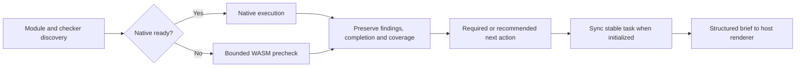
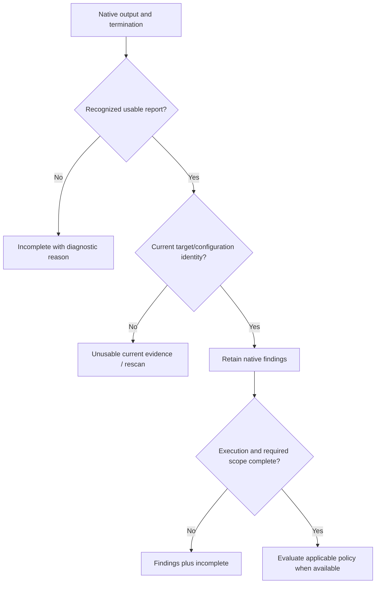
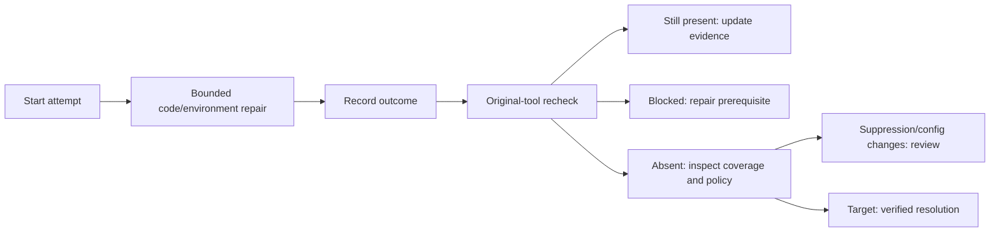
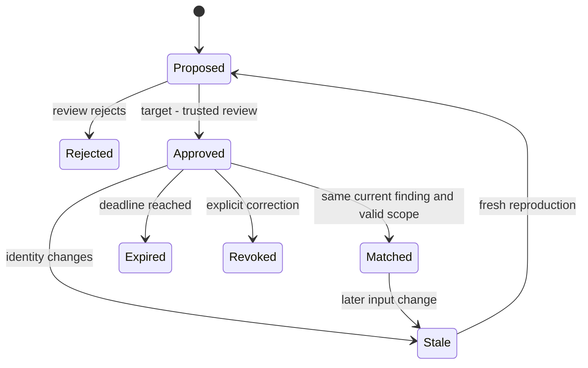
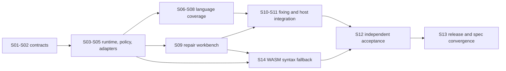

# Codeguard Technical Design and Roadmap

> **Purpose:** turn the architecture into concrete implementation contracts, command responsibilities, extension steps, and observable acceptance criteria.
>
> **Document version:** 1.2.0 · **Updated:** 2026-09-29 · **Source baseline:** current checkout and the [implementation evidence](../openspec/changes/introduce-rust-codeguard-cli/implementation-baseline.md); software version `0.1.0`.

[简体中文](Codeguard-Technical-Design.zh_CN.md) · [Architecture](Codeguard-Architecture.md) · [README](../README.md)

Topic owners: [commands](Codeguard-Command-Reference.md), [initialization](Codeguard-Project-Initialization.md), [remediation](Codeguard-Remediation-Workflow.md), [false positives](Codeguard-False-Positive-Governance.md), [adapters](Codeguard-Adapter-Contracts.md), [trust/distribution](Codeguard-Trust-and-Distribution.md), [acceptance](Codeguard-Validation-and-Rollout.md) and [legacy compatibility](Codeguard-Legacy-Compatibility.md). Detailed contracts live in these guides; OpenSpec owns requirements and tasks.

## 1. Scope and specification ownership

The existing [OpenSpec change](../openspec/changes/introduce-rust-codeguard-cli/proposal.md) now lives in this Rust repository and is the sole specification and task authority. Implemented slices and remaining work are tracked separately; these documents do not maintain a second task ledger.

Current source is the authority for callable behavior. Target contracts are labelled as such. The product priority is configuration discovery → native results → useful repair guidance. Internal consistency checks support this experience; they are not a demand for users to manually construct execution certificates.

WASM requirements and 18 implementation tasks are recorded in the existing change. Candidate Rust worker, pinned assets, and narrow TypeScript/Java single-file reports now exist behind an opt-in feature; project-wide native-first routing, qualified grammar ranges, and host integrations remain incomplete. Design examples are not current command output.

## 2. Technology choices and trade-offs

| Concern | Selected technology / current evidence | Consequence and alternative |
| :--- | :--- | :--- |
| Implementation | Rust workspace, edition 2024, declared MSRV 1.85 | One orchestration implementation; native checkers retain their runtimes. Do not replace native analyzers with handwritten approximate rules |
| Data contracts | `serde`, `serde_json`, versioned JSON Schema | Machine feedback and persistence can be validated; command-specific preview protocols still coexist |
| Maven / Cargo observation | `roxmltree`, `toml` | Static parsing avoids implicit build execution; inherited/effective models require later controlled resolution |
| Input identity | SHA-256; other algorithms have specific interoperability uses | Digests bind bytes; they are not authorization or semantic equivalence |
| Processes / locks | `std`, Unix `libc` primitives | Explicit ownership/cancellation, but no certified universal sandbox or Windows parity |
| Concurrent checks | Validated DAG, scoped threads, resource keys | Independent checks can run together; same-resource work is serialized |
| Package primitives | `ring`, archive crates, `reqwest` + Rustls/Tokio | Verification/download building blocks exist; public installation remains incomplete |
| Persistence | JSON facts/events and Markdown projections | Reviewable local state; transactions and cross-machine coordination need explicit work |
| Agent integration | CLI human/JSON and selected SARIF | No model dependency; host plugin/MCP integration remains separate work |

Exact versions are in [Cargo.lock](../Cargo.lock); dependency declarations are in the four crate manifests. The workspace currently has no public feature-selection matrix, database service, web UI, or daemon. Those template patterns are not product requirements.

## 3. Command responsibility contract

A command must explain its selection, reads/writes, result, and next action. Read-only means no intentional project changes; native tools may have their own execution side effects and must be handled by the adapter.

| Entry | Role and user value | Side effects / current implementation |
| :--- | :--- | :--- |
| `--help`, `--version` | Discover syntax and binary/protocol metadata | Read-only; version build identity remains unverified |
| `detect`, `capabilities` | Separate project observations from release inventory | Read-only; registry entries are not certified adapters |
| `init --dry-run` | Preview profile, graph, managed files and configuration status | No project write; no native build |
| `init --apply` | Create/refresh owned files and `AGENTS.md` context | Controlled local writes; current status partial |
| `config validate`, `config explain` | Explain native/legacy and candidate policy inputs | Read-only; untrusted candidate context stays incomplete |
| `rules list` | Show candidate rule origins and configuration gaps | Read-only, no rule activation |
| `tools list`, `tools verify` | Inspect inventory, selected paths and candidate identities | Static inspection; matching bytes remain untrusted without authority |
| `doctor` | Diagnose configuration and selected runtime availability | Partial explicit Ruff version probe; no general automatic install |
| `tools install` | Target controlled provisioning | Public dry-run is a preview; apply currently blocked |
| `plan` | Explain candidate obligations, target scope and prerequisites | Partial read-only plan, not a certified executable contract |
| `lint`, `comments`, `dependencies`, `cve`, `security`, `build` | Separate detection families | Only dispatcher-listed combinations execute; dependencies/security generic entry points are pending |
| `check all`, `check java` | Run integrated paths and explain remaining categories | Executes native tools, saves/syncs eligible local reports |
| `work sync` | Import all eligible unconsumed reports without losing another category | Local fact/event/task/receipt writes, bounded locking and replay |
| `status`, `next`, `task show` | Aggregate status, select action, inspect one task | Read-only structured facts; no automatic claim or source edit |
| `task claim`, `heartbeat`, `release` | Coordinate one local task owner | Lease files and generation/token/expiry checks |
| `task attempt start`, `finish` | Preserve attempted actions, input changes and outcomes | Local events; failed/no-change attempts still count |
| `task verify` | Repeat the original selected checker after repair | Native execution and recheck events; no automatic formal closure |
| `rules whitelist list`, `explain`, `propose` | Inspect exact candidates and propose corrections | Read-only by default; correction `--record` writes proposal events/attachments, never approval |
| `gate pre-commit` | Inspect actual Git-index path safety | Partial scope; not full content/secret scanning |
| `fix`, `gate pre-push`, `gate ci`, `mcp serve`, `compat legacy-v1` | Target native fixing, delivery content and host interoperability | Not public executable surfaces in this baseline |

The parser is [main.rs](../crates/codeguard-cli/src/main.rs), not a guessed conventional CLI. For example, `lint rust` is not a public branch here: current Clippy execution is integrated through `check all`. Category inventory does not make `security all` or `comments java` callable.

## 4. Initialization design

### 4.1 Observation algorithm

1. Resolve the explicit project root and discovery boundary.
2. Enumerate recognized source paths, manifests, lockfiles and exact configuration exceptions.
3. Collect content identities and direct declarations without running project code.
4. Keep package version, language target, resolved dependency version and installed runtime separate.
5. Build typed module edges; retain unresolved inheritance, expressions, conditions and missing targets.
6. Return the same observations to the conversation in dry-run and apply.
7. On apply, preflight ownership, merge only the managed `AGENTS.md` block, update files and workspace metadata with recoverable partial outcomes.

[Initialization source](../crates/codeguard-cli/src/init_command.rs) currently emits project profile `0.3.0`. Maven compiler release/source/target and Cargo rust-version/edition are `declared_only`; they are not an effective build-model assertion. Static graph edges are not source call graphs. Existing CodeGraph evidence, if integrated later, must be checked for freshness rather than automatically created.

### 4.2 Ownership and refresh

| Situation | Required response |
| :--- | :--- |
| First preview | Return planned paths and observations; create nothing |
| New module or changed manifest/lock | Recompute affected profile and graph, do not compare only old paths |
| Existing human text | Preserve bytes outside the managed block |
| Human edited managed content | Report conflict; no blind replacement |
| Unknown MVC/DDD architecture | Keep unknown or clearly labelled inference; no forced architecture rule |
| Missing checker configuration | Preparation/selection guidance, not a code violation |
| Partial file writes | Report what happened and retain recoverable state, not all-or-nothing success |

The managed `AGENTS.md` summary caps each list and links to complete structured observations. It is not the policy authority. `architecture.md` is presently an unknown-state projection. The complete architecture-confirmation and prerequisite-task initialization workflows remain pending.

## 5. Native adapter contract

### 5.1 Separation of observation and execution

An adapter has two conceptual phases. **Observe** reads configuration and identifies applicability, declared rule selection, scope and unresolved conditions. **Execute** uses explicit tool context, creates a native invocation, parses the native protocol and rechecks input identity. These are responsibilities distributed across current adapter and CLI modules, not an already standardized plugin trait.

| Contract dimension | Required content |
| :--- | :--- |
| Identity | Checker ID, adapter version/identity, supported native tool versions |
| Applicability | Language, build root, configuration state, source set, native prerequisites |
| Selection | Effective rules or a precise unresolved reason; no unrequested default rule expansion |
| Invocation | Absolute tool, literal argv, cwd, selected environment, input snapshot, deadline, output bound |
| Report | Format/version, native exit contract, parsing limits, rule IDs and locations |
| Normalization | Findings separate from execution/completion; preserve native severity |
| Repair | Supported stable identities, preparation cases, task brief and recheck recipe |
| Conformance | Positive, negative, malformed, interruption, mutation and real-native cases |

### 5.1.1 Extension and output boundaries — logical design

These signatures describe responsibilities, not existing public Rust traits or a requirement to create empty implementations:

```text
Adapter.descriptor() -> CapabilityDescriptor
Adapter.discover(observations) -> ApplicabilityEvidence
Adapter.resolve(context, policy, toolchain) -> ResolvedCheck
Adapter.plan(resolved_check) -> AdapterPlan
Adapter.parse(raw_artifacts, termination) -> ParsedEvidence
Adapter.verify_coverage(plan, evidence) -> CoverageAssessment
Adapter.plan_fix(finding_set, context) -> FixPlan
ExecutionPort.run(process_spec, cancellation) -> ToolExecution
SnapshotPort.capture(content_request) -> SnapshotLease
EvidenceStore.persist(raw_evidence) -> EvidenceRef
CachePort.lookup(validated_identity) -> VerifiedCacheEntry | Miss
```

Rust owns orchestration, parsing and policy; Node is a distribution entry only. Adapters request I/O through runtime rather than privately spawning, networking or writing files. Current application orchestration lives in the CLI; these target interfaces do not mean core already coordinates all I/O.

Target structured stdout contains one report; progress/tool logs go to stderr or private logs. Failed atomic report output remains incomplete while preserving check results. SARIF retains findings and execution-failure notices; zero results cannot hide incompleteness. Merge only same-tool or explicitly mapped equivalent rules, preserving original records/counts rather than matching messages across tools.

### 5.2 Native paths in this baseline

| Ecosystem | Adapter behavior | Avoid claiming |
| :--- | :--- | :--- |
| Maven/P3C | Discover Maven checker declarations; run selected native probes with explicit JDK/repository inputs | `mvn verify` alone proves every configured rule ran |
| Javadoc/Checkstyle | Native documentation diagnostics in supported configuration and scope | Missing classpath or unsupported XML property is a source violation |
| Ruff | Native lint plus selected settings/rule checks and suppression comparisons | Every Ruff rule/configuration form is a complete quality policy |
| Cargo | Clippy, library Rustdoc, all-targets type check, cargo-audit observations | Type checking runs tests, or all workspace/features combinations were verified |
| ESLint | Explicit Node/entry/config/cwd or mapped configuration; JSON/settings observations | Executing configuration is the same as safe static discovery |
| npm | Bind audit observations to supported package-lock inputs | A missing/old graph can establish a clean dependency set |
| pip-audit | Standard pylock snapshot and component matching | uv/Poetry lock files are interchangeable with PEP 751 inputs |
| Go vet | Scoped native JSON observation | Every Go analyzer and build tag combination is covered |

Add a new adapter by defining these contracts, implementing observation first, adding parser fixtures and explicit execution, then wiring commands, schemas, feedback, stable tasks and rechecks. Register an executable capability only after relevant acceptance; an inventory row alone is insufficient.

### 5.3 Native-first selection and syntax fallback — target, not shipped

The proposed routing extends existing `codeguard lint java .`, `codeguard lint typescript .` and `codeguard check all .` entries. It adds no requirement for callers to choose WASM. Current adapter options/prerequisites still apply until implementation and acceptance; the published `0.1.0` does not contain this fallback. The architecture document's **8.1–8.3** owns component boundaries and execution diagrams; this section defines the algorithm.



1. Discover each module's source set, language version/dialect, configured checkers and explicit native obligations. Separate “not on PATH” from “not installed”; inspect selected project-local tools and supported build integration before declaring a tool absent.
2. Run a suitable native checker when available with valid configuration. Preserve native findings. Never downgrade a native violation to WASM. For configuration/runtime failures, retain the failure while optionally providing a supplementary precheck.
3. Otherwise select a verified bundled grammar for that module/dialect, validate its asset identity and run a bounded syntax worker. Aggregate checked, unsupported, excluded and failed scope separately. `ERROR`/`MISSING` observations remain suspected issues.
4. With complete precheck scope and no anomaly, recommend native setup. With an anomaly, require setup and applicable native confirmation. Incomplete/unsupported prechecks require restoring valid checking capability, without inventing a source defect. An already-required native obligation stays required for all outcomes.
5. Sync eligible observations if the workspace exists and return a brief. Optional setup remains an advisory item, not a blocking task or a repeated `next` selection. Reuse the module/checker setup task; link individual suspect observations without making an installation task per line. A sync failure returns its own diagnostic and no fictional task ID.
6. After setup, use the original project configuration and current input to verify. A native zero-result contradicts a syntax observation only when the same syntax capability and source scope were actually covered. Installation, changing grammar or a later clean precheck alone cannot close a required native-confirmation task.

If the language has no supported native confirmation adapter, return that specific capability gap and an actionable environment/decision task. Do not repeatedly recommend a nonexistent tool. “Require installation” also includes restoring the correct runtime, project dependency or configuration; use project-declared versions and package manager, and perform modifications within the user's existing authorization.

| Design field | Meaning |
| :--- | :--- |
| `backend` | `native` or `wasm_precheck`; source of this observation |
| `precheck.status` | `not_run`, `clean`, `suspected_issue`, `incomplete`, `unsupported` |
| `native.status` | `not_run`, `completed`, `incomplete`; separate reason such as `missing_runtime` |
| `scope` | Selected/checked/unresolved files or regions, with exclusions and reason counts |
| `observations` | Source spans, parser/rule identity and suspected/confirmed classification |
| `setup.requirement` | `recommended` or `required` when setup is needed, with its reason |
| `task_id` | Actual persisted task, otherwise null; not a claimed closure receipt |
| `delivery` | Independently evaluated; a precheck never manufactures delivery permission |

When some files have suspected issues and others are unresolved, use overall `incomplete` while retaining all usable suspected observations. `clean` requires nonempty, completely checked selected scope.

These are the target semantic fields, not a shipped project-wide lint/check report. A narrow [candidate precheck schema](../schemas/syntax-precheck-candidate.schema.json) and [strict Rust reader](../crates/codeguard-adapters/src/syntax_precheck_candidate_report.rs) bind source SHA-256 and pinned grammar identity, recalculate status, and reject unknown versions or forged `clean`. Optional CLI single-file [TypeScript](../schemas/eslint-local-feedback-v0.3.schema.json) and [Java](../schemas/java-syntax-precheck-feedback-v0.1.schema.json) producers now include recovery positions and setup guidance; host rendering and durable task references remain absent. The bundled grammars remain unvalidated, so these reports cannot return `clean`. Missing required native execution remains incomplete (`3`); a suspected parser issue alone is not a confirmed violation (`1`). If a dedicated syntax-only operation is later introduced, its success must be explicitly scoped to syntax; no new `syntax` command is claimed here.

The opt-in CLI build now also emits [ESLint feedback 0.3.0](../schemas/eslint-local-feedback-v0.3.schema.json) for an explicit TypeScript file when no native execution context was supplied. It preserves `native=not_run` and `delivery=not_evaluated`, maps parser recoveries to suspected Unicode positions, and keeps the overall result incomplete even with zero recoveries. A partial native context or symlink does not trigger this candidate path; configured native execution stays on the original route. This is one local entry-point slice, not per-module native-first orchestration or automatic host feedback.

### 5.4 Grammar import and runtime lifecycle — target

Import only pinned WASM bytes with upstream license, commit/patch provenance, SHA-256, ABI, tested runtime and language/dialect ranges, corpus reference and known gaps. Verify each copied CodeGraph artifact in the selected Rust Tree-sitter runtime; do not copy TypeScript extraction logic or assume CodeGraph support equals syntax acceptance. A release manifest belongs to distribution assets, not writable `.codeguard/` project state.

Use a parent-controlled parser worker with a total deadline, per-file input bound, memory/process limit and capped diagnostics. Lazy-load selected grammars, parse without general network/filesystem imports, and terminate a stuck worker without losing native results from other modules. Host-specific enforcement and Rust MSRV compatibility must be tested; numeric production budgets remain measurement-driven rather than invented promises.

The opt-in Rust CLI now has a private [candidate worker](../crates/codeguard-cli/src/syntax_worker_command.rs) and [parent verifier](../crates/codeguard-cli/src/syntax_worker_runner.rs). On Unix they use the existing process-group runner with a 1 MiB source limit, 64 KiB output limit, caller deadline and cancellation, then recheck source/grammar digests and recovery positions. This is a measured contract slice, not the finished isolation design: a verified memory bound, cross-platform enforcement, formal lint/check routing and release packaging remain open. Candidate grammar observations remain `incomplete` even when parsing finds no recovery nodes.

Cache by source content, dialect/language profile, grammar bytes, parser runtime, query/rule version and relevant scope/configuration identity. Cancellation, partial output and unresolved coverage cannot produce a reusable clean result. Artifact replacement invalidates affected caches and dispositions. Roll back a language pack by its verified manifest; retain historical observations and never infer resolution from cache deletion.

## 6. Static detection portfolio

The [28-family registry](../crates/codeguard-core/src/capability_dimensions.rs) prevents distinct checks from being collapsed into one generic lint result.

| Category | Families | Expansion contract |
| :--- | :--- | :--- |
| `lint` | syntax, style, type, dataflow, complexity, duplication, dead_code, architecture, api_compatibility, schema | Native rule configuration and correct source sets |
| `comments` | api_docs, comment_policy, doc_links | Deterministically checkable documentation rules; subjective writing quality stays advisory |
| `dependencies` | graph, versions, licenses, sbom, provenance | Actual resolved component identity and tool-specific evidence |
| `cve` | advisory | Component/version/graph plus advisory source and freshness |
| `security` | sast, secrets, iac, container, config, policy | Scope and sensitive-data handling per tool |
| `build` | compile, reproducibility, manifest | Explicit build/test level; no escalation hidden under lint |

These are target coverage slots. Existing paths cover only the subsets described in the README. Security/IaC/container/SBOM/etc. must not appear as implemented merely because their family is registered. Language expansion should use native ecosystem tools and a capability gap when no suitable adapter exists.

## 7. Result normalization and conversation feedback

### 7.1 Mapping policy



Do not infer pass/fail from generic words such as `error`, `warning`, or `BUILD SUCCESS`. Tool-specific parsers decide what an exit/report combination means. A complete, input-bound report followed by abnormal exit can retain findings while remaining incomplete. Truncated monolithic JSON cannot be recovered by inventing findings from a prefix.

### 7.2 Feedback contract

| Field group | Reader question |
| :--- | :--- |
| Selection and configuration | What language/category/root was selected, and is its checker configured? |
| Findings | Which checker/rule, location/component and severity were observed; is a syntax observation suspected or natively confirmed? |
| Execution/completion | Did precheck/native execution finish, which scope was covered, and what remains unknown? |
| Persistence status | Was the local report saved/synced? If not, what can be retried? |
| Next action | Repair source, recommend/require native setup and confirmation, restore configuration, rescan, or obtain a concrete decision? |
| Delivery | Is this only a local observation or a fully evaluated delivery result? |

[RunReport parsing](../crates/codeguard-cli/src/run_report.rs) supports a common structured contract; [check orchestration](../crates/codeguard-cli/src/check_command.rs) currently emits `check_feedback` `0.31.0`. Adapters also emit their own versioned local observations. Consumers must dispatch by protocol identity/version rather than assume a universal JSON shape. Human output is currently primarily Chinese; English documentation does not imply localized runtime messages.

### 7.3 Conversation report examples — target presentation

The following four examples are synthetic presentation designs, not captured CLI output, confirmed product findings or a claim of English runtime localization. Source paths and task IDs are illustrative. Real feedback must use actual checked scope, observations and persisted task IDs. Prefer a short conclusion → method/scope → native status → evidence → next action → task/coverage boundary. Do not open with internal receipts, hashes or an unqualified “PASS/FAIL”.

**A. Missing native tool, suspected syntax issue: required confirmation.**

```text
Codeguard: Java syntax precheck found 1 suspected issue

Method: bundled Tree-sitter WASM
Scope: 18 Java files selected and checked; 0 unresolved
Native check: not run; the JDK required by this project is unavailable
Location: src/main/java/example/UserService.java:42
Observation: the parser recovered a missing syntax node at this location

Next steps (required):
1. Prepare the project's declared JDK and applicable native checker.
2. Run native verification covering this file and Java syntax.
3. Repair according to the native diagnostic, then recheck.

Task: CG-example-java-setup (illustrative; emit only after successful sync)
Recheck entry (after restoring original project tool/configuration context):
codeguard task verify CG-example-java-setup . --format json
This location is not yet a confirmed code violation. Delivery is not evaluated.
```

**B. Missing optional native checker, complete clean precheck: recommendation.**

```text
Codeguard: syntax precheck found no anomaly in the checked scope

Method: bundled Tree-sitter WASM
Scope: 18 Java files selected and checked; 0 unresolved
Native check: not run; native checking is not configured for this example
Next step (recommended): configure and prepare the project's native checker.

Type checks, project style rules and dependency security were not checked.
This is a syntax observation, not complete lint or delivery approval.
```

If the project already requires native lint, change the next step to required and show the declared requirement; do not reuse example B's optional wording.

**C. Precheck could not finish: scope gap, not a source violation.**

```text
Codeguard: syntax precheck incomplete

Method: bundled Tree-sitter WASM
Scope: 18 Java files selected; 17 checked, 1 unresolved
Completed scope: no syntax anomaly observed in those 17 files
Unresolved: src/main/java/example/PreviewFeature.java; worker timed out
Native check: not run; the required JDK is unavailable
Next step: restore native checking; inspect the parser timeout separately.

No source violation is inferred from the timeout. Do not report all files clean.
```

Grammar/version incompatibility is a different reason and must not be guessed from a timeout. An unsupported embedded-language region similarly needs an explicit uncovered region rather than a whole-file clean label.

**D. Native lint produced a diagnostic: direct repair guidance.**

```text
Codeguard: native lint found 1 issue

Method: ESLint with the project's selected configuration
Scope: 12 TypeScript files selected and checked
Native execution: completed
Location: src/example.ts:8
Rule: no-unused-vars
Observation: the local variable `unused` is declared but never used
Next step: inspect its intended use, remove an unnecessary declaration or use it,
then rerun the same checker with the same project configuration.

This result covers the selected lint scope; delivery is not evaluated.
```

If native execution later fails or output truncates, explicitly change execution/completion and retain only independently usable diagnostics; do not keep example D's “completed”. For CVE/other categories, replace syntax fields with actual component/version/rule and database coverage; a zero-advisory observation with unknown database coverage is not “safe”.

**E. Pre-commit index safety preview: staged paths only.**

```text
Codeguard: 1 staged path needs review

Scope: current Git index; 1 entry observed, 1 path violation
Path: .env
Rule: repository path safety
Object check: verified ordinary blob
Next step: remove the sensitive path from the index, then rerun the preview.

Source lint, dependency checks and the full commit gate have not run.
Delivery is not evaluated; this preview does not authorize a commit.
```

This is also illustrative, not captured output. Actual hook JSON carries an index digest, a total violation count and at most 32 displayed paths with a truncation flag. The observed index can differ from the working tree and can be supplied through `GIT_INDEX_FILE`.

**F. Stop guidance: read-only repair handoff.**

```json
{
  "execution": "read_only_guidance",
  "local_feedback": {
    "report_type": "hook_next_guidance",
    "disposition": "verification_required",
    "reason": "no_tasks_without_fresh_full_gate",
    "task_id": null,
    "checker_id": null,
    "step": null,
    "next_actions": [["codeguard", "check", "all", "."]],
    "source_check": "not_run",
    "authority": "local_unverified",
    "delivery_decision": "not_evaluated"
  }
}
```

This is an excerpt of the current 0.3 outer response, not a complete schema instance. It is a recommendation to run a fresh full check, not a clean result. Stop never executes `next_actions`; backlog count or byte overflow returns `not_run/guidance_scope_exceeded`. Prompt submission is intentionally still unexecuted until the event carries usable intent context and the host adapter can bound repeat messages.

### 7.4 Structured brief and host delivery — proposed contract

This JSON is a **design example only**, not the existing `check_feedback` schema and not a document to feed to `work sync`. It illustrates an initialized workspace with a successfully persisted synthetic task; real asset/run/input identities stay in the full report. Protocol name/version and schemas must be defined in the existing OpenSpec change before implementation.

```json
{
  "example_only": true,
  "backend": "wasm_precheck",
  "precheck": {
    "status": "suspected_issue",
    "scope": {"selected_files": 18, "checked_files": 18, "unresolved_files": 0}
  },
  "native": {"status": "not_run", "reason": "missing_runtime", "tool": "jdk"},
  "observations": [{
    "classification": "suspected_syntax",
    "path": "src/main/java/example/UserService.java",
    "line": 42,
    "recovery_node": "MISSING"
  }],
  "setup": {"requirement": "required", "reason": "native_confirmation_needed"},
  "task_id": "CG-example-java-setup",
  "next_action": "prepare_native_checker_and_recheck",
  "delivery": "not_evaluated"
}
```

The plugin renders structured fields as a bounded tool result/context message using the host's supported API; writing JSON or `.codeguard/` files alone is not conversation delivery. Send an initial brief, then changes in scope, findings, setup requirement or task state. Stable unchanged requirements remain visible through status without repeated interruption. Include report/task links only when files exist; keep raw logs and source excerpts bounded and redacted. Never execute instructions embedded in source or diagnostic text.

Report review rules apply across all maintained documents: distinguish installed/configured/executed/completed; state partial/empty scope; preserve findings during execution failure; label illustrative paths and task IDs; distinguish suspected syntax from native diagnostics; separate recommendation from required verification; expose sync failure; preserve category-specific coverage. Do not rewrite historical acceptance outputs to resemble the new presentation.

### 7.5 Protocol versions and identity closure

The current common `RunReport` is `1.4`, aggregate `check_feedback` is `0.31.0`, and `check_aborted` is `0.11.0`; adapter-local observations have separate versions. Protocol versions must not be rewritten to match software `0.1.0`. The conversation/JSON briefs above are target examples, not complete instances of these three protocols.

The target evidence chain correlates workspace/request/run/obligation/finding/task/attempt. Source locations use reversible paths and content identities; dependency locations use component, resolved version, graph and advisory identities. Lossy rendering of non-UTF-8 paths cannot participate in matching. Digests bind bytes, not approval authority. Upgrades preserve version semantics and never turn old empty findings into complete passes.

## 8. Persistent repair and attempts

### 8.1 Stable identity and import

Current findings commonly bind checker/rule, project-relative target and a source/content anchor; line numbers alone do not define identity. Cross-tool deduplication, rename matching and all dependency identities are not universally implemented. Ambiguous matches must not silently close an old task.

`work sync` must process all eligible reports, bind workspace/run/content, create fact/event/projection records, and only then record consumption. Current implementation includes local mutual exclusion and selected replay cases. Complete disk-failure and arbitrary crash-point atomicity remain acceptance work.

### 8.2 Repair brief

| Required section | Example meaning, not a stored task instance |
| :--- | :--- |
| Evidence | Native missing-doc rule at a current source location |
| Rule basis | Original checker and enabled rule/configuration origin |
| Allowed scope | The affected symbol/file or environment prerequisite |
| Repair steps | Add accurate public API documentation, or restore a missing runtime |
| Recheck | The same supported Codeguard/native checker path with original context |
| Attempt history | What changed, failed, made no progress, or awaited verification |
| Closure conditions | Current original-tool result and unchanged required coverage |

The agent must not execute instructions embedded in diagnostic text or Markdown. `next` uses structured observations and fixed guidance. Lack of progress should lead to a more specific diagnosis, not automatic rule weakening.

### 8.3 Closure target



Current `candidate_absent_unverified_policy` is not resolution. A `noqa`, Clippy allow, or changed Checkstyle configuration may hide a rule; selected paths already detect such cases. Environment recovery must eventually rerun the original blocked quality obligation. Complete verified closure, recurrence and event reconciliation remain target work.

## 9. False-positive allowlist and correction design

### 9.1 Choose the correct remedy

| Root cause | Correct action | Do not do |
| :--- | :--- | :--- |
| Native tool misjudges one exact input | Reproduce and propose a scoped `false_positive` decision | Disable a whole checker or directory |
| Rust adapter misreads output, path or enabled rule | Fix adapter with a regression fixture | Cover the bug with an allowlist |
| Rule is unsuitable for a project class | Review rulepack/policy applicability with positive and negative cases | Accumulate wildcard exceptions |
| Real issue is consciously accepted | Separate `accepted_risk` decision under a defined policy | Relabel it as a false positive |
| Tool/database/configuration is unavailable | Preparation task and incomplete status | Use an exception to certify coverage |

### 9.2 Identity and lifecycle

The current [FalsePositiveIdentity](../crates/codeguard-core/src/false_positive_allowlist.rs) matches:

- `finding_id`, `checker_id`, `native_rule_id`, `category`;
- source target `path` + `file_sha256`, or dependency `component` + `version` + `graph_sha256` + `advisory_id`;
- `finding_fingerprint`, `tool_sha256`, `adapter_sha256`, `rulepack_sha256`.

Approval scope, policy revision, decision/reference identity and bounded expiry are separate concerns in [delivery evaluation](../crates/codeguard-core/src/delivery_gate.rs). A valid identity comparison does not approve anything. Source bytes or tool/rulepack changes invalidate old exact matches; the UI should explain the changed field and propose reevaluation, not require users to calculate digests.



This is the target lifecycle. Current CLI provides candidate list/explain/propose and local correction recording; it does not expose the complete trusted approval transition. First-version matching excludes wildcard paths, whole-directory exemptions, and message-similarity matching.

### 9.3 User correction flow

1. User selects an existing finding and says why the diagnosis appears wrong.
2. Agent shows native rule/configuration, current target, reproduction and mismatch details.
3. The system distinguishes adapter defect, policy applicability, exact native false positive, and accepted risk.
4. A correction references the same stable finding and the latest relevant original-tool verification; replacement decisions are new versions.
5. Review/approval or revocation occurs through the selected authority; project-local `approved=true` is insufficient.
6. The next scan still runs the native tool, retains the finding, and reports either a matching exception or a concrete mismatch.

Current `rules whitelist propose ... --correct-decision ... --record` can append proposal events and readable correction attachments. [Correction evidence](../tests/acceptance/whitelist-correction-preview.md) covers bounded replay and input changes. Replacing a candidate is not source repair; approved exceptions should eventually show `allow_with_exceptions`, not pretend raw diagnostics vanished. CVE exceptions additionally require trustworthy current dependency/advisory context.

## 10. Scheduling, cancellation, and side effects

Use the same absolute deadline across child tasks and retries. The current scheduler validates dependency graphs and excludes concurrent resource keys, for example Cargo tasks sharing a build resource. Defaults and accepted ranges are in [check_budget.rs](../crates/codeguard-cli/src/check_budget.rs).

| Condition | Required outcome |
| :--- | :--- |
| Dependency fails | Do not start its dependent task; record why |
| Cancellation before start | Mark queued work as not started, not successful |
| Timeout/output limit during execution | Stop bounded execution; retain valid prior observations |
| Callback panic | Internal failure, preserve other captured results where possible |
| Native subprocess spawns children | Apply process-group lifecycle handling; verify platform-specific behavior |
| Persistence fails after native checks | Return native findings plus persistence failure |

Clearing environment and using literal arguments prevents one class of accidental shell interpretation. It does not make arbitrary native plugins safe. Offline flags are tool-level requests, not proof of network isolation. Runtime unsafe/FFI paths and native execution must be reviewed and tested on each advertised platform.

### 10.1 Snapshots, caching and repair transactions — full-workflow target

- Worktree, index, every ref supplied through pre-push stdin, and immutable CI commits require distinct evidence. Respect `GIT_INDEX_FILE`; never substitute the worktree for partially staged content. Define SHA-1/SHA-256, NUL paths, symlinks, gitlinks, LFS and missing-object behavior. Uncertain scope expands checking or remains incomplete, never silently disappears.
- Cache identity includes the input closure, tool/runtime, rules, configuration, module graph, content source, platform/locale and CVE database source/freshness. Changed-file thresholds affect scheduling only. Partial feedback and incomplete reports cannot become clean full-gate cache entries or receipts.
- Repair uses an isolated copy and preview, then checks content preconditions before applying. Roll back only changes owned by this attempt and preserve concurrent user edits. Expose partial application; never change tests, thresholds or required checks to manufacture success. Generic public fix remains unfinished.
- Retention must preserve active leases, referenced receipts and tracked historical events. Correlate run/task logs using the identities above and redact sensitive diagnostics; no background telemetry service is implied.

These are full-delivery contracts. Tests for snapshot/cache/install/repair building blocks do not establish integrated gates or platform acceptance.

## 11. Configuration, policy, and distribution

Keep operational preferences separate from rule authority. The runtime JSON example in [README](../README.md) is currently parseable and only changes time/concurrency. Native configuration remains at its existing tool location. `config` can inspect legacy configuration, tool-lock candidates and explicit policy candidates; it does not silently migrate them into approved policy.

| Input | Owner | Change implication |
| :--- | :--- | :--- |
| Native configuration | Project maintainers | Rule/scope change requires relevant recheck |
| Runtime options | Project/caller | Bounded execution preference, no exception authority |
| Rulepack candidate | Rule maintainers | Needs applicability/semantic tests and selected approval process |
| Tool-lock candidate | Toolchain maintainers | Bytes/version consistency alone is not trust |
| Exception decision | Designated approval authority, pending operational definition | Version, scope, reason, expiry, revocation and current identity |
| Generated profile/task | Codeguard local workflow | Observation/projection, not a source of rule approval |

Artifact signature, package digest, layout, archive extraction and publication primitives are implemented in parts of CLI/runtime. They must not be advertised as an operational tool installer while the public apply path is blocked. A binary release requires source/tag/artifact correspondence, platform smoke tests, compatible schemas, license notices and actual host binding where claimed.

The Node path supports the published macOS arm64 package and local packaging. For local packaging: explicitly build the Rust binary, validate its `--version --format json` target and version, create a host-tagged tarball, and install or execute it through npm. The package contains `codeguard.cjs` and the native binary, declares npm `os`/`cpu`, has no install lifecycle script, and is private. The launcher does not implement checks or silently fetch tooling. [README](../README.md) contains tested commands. This is separate from Codeguard's `tools install`, which provisions external analyzers under a different trust contract.

The `--public` packer mode produced `@partme.ai/codeguard@0.1.0` for `darwin-arm64`; its npm `os`/`cpu` constraints reject other hosts. Local tarball execution, registry publication and a fresh-cache registry-hosted `npx --yes @partme.ai/codeguard --version --format json` run passed on Apple Silicon macOS. The package still lacks immutable source/tag binding and does not complete S13 release evidence. For broader distribution, adapt CodeGraph's thin entry/platform bundle pattern only after S13 release evidence is ready: publish a version-matched package for each certified target, then a public command package with exact optional platform dependencies. Missing platform support must fail clearly; network recovery must follow Codeguard's signed selection and explicit host permission contract before any download.

## 12. Test and evaluation plan

| Layer | Proves | Does not prove |
| :--- | :--- | :--- |
| Pure core tests | Deterministic aggregation and matching | External trust, usable commands, native semantics |
| Parser fixtures | Supported report/config shapes and negative cases | Real tool invocation |
| Simulated subprocesses | Arguments, deadlines, abnormal exits, output limits | Native tool compatibility or genuine CVEs |
| Actual native fixtures | A named tool/version/configuration/input path | Every rule, platform, module or database freshness |
| CLI/workbench contracts | Observable commands, persistence, replay and feedback | Installed host integration |
| Host acceptance | Plugin invocation and conversation handoff | All language/category correctness |
| Independent labelled corpus | False-positive/negative measurements within stated strata | Universal precision from a single aggregate percentage |

The local `cd8fb72` baseline passed 990 tests, with 101 ignored tests excluded from passes, plus Clippy and formatting. No measured production accuracy or full matrix is available.

Target quality evaluation must retain raw findings, adjudicated false positives, true positives, false negatives, exception matches/expirations and incomplete runs. Report precision = TP/(TP+FP) and recall = TP/(TP+FN) only where independently labelled denominators exist; report insufficient samples otherwise. Break down by tool/rule/language/configuration/platform, and keep incomplete coverage visible. Exception matching must not remove false positives from the evaluation history. Thresholds, corpus ownership and review policy must be frozen before release claims; no invented percentage is a target acceptance fact.

### 12.1 WASM fallback acceptance — target, not executed

| Scenario | Required observable result |
| :--- | :--- |
| Ready native checker reports a violation | Native result retained; no clean fallback replaces it |
| Optional native checker missing, complete clean precheck | Scoped syntax result plus recommendation; no full lint/delivery claim |
| Native check already required, precheck clean | Native requirement remains required |
| Valid supported-version code and newer/unsupported syntax | Supported corpus stays clean; unsupported grammar context is visible rather than asserted as a source violation |
| Deliberate syntax errors and parser recovery | Detect `ERROR` and `MISSING`; coalesce related diagnostics; require native confirmation |
| Grammar load/ABI failure, timeout, cancellation or zero checked files | Incomplete/unsupported/empty scope; no false clean result |
| Native syntax-capable tool contradicts suspected finding | Record scoped contradiction and parser false-positive candidate; a style-only checker cannot supply this proof |
| Ten identical missing-tool runs | One stable setup task and bounded conversation notifications |
| Tool installed but not rechecked | Confirmation task remains open |
| Asset/source/dialect changes, whitelist match or expiration | Invalidate affected cache/disposition; preserve native obligations |
| Mixed modules or partially covered templates | Select per module; report unresolved files/regions explicitly |
| Offline fresh install on each supported host | Bundled parser loads and returns a report without downloading grammars |

Use a separately adjudicated corpus per grammar, dialect and language version. Measure false positives, missed syntax defects, native disagreement, cold/warm latency and peak memory; record denominators and uncertainty. Pin assets and runtime versions, and qualify each supported host before rollout. S14 remains pending in the existing OpenSpec change.

## 13. Failure-oriented acceptance criteria

| Scenario | Observable acceptance |
| :--- | :--- |
| Missing JDK | Environment task with JDK action; no unrelated Java source rewrite |
| Nonzero native exit with valid partial report | Findings retained, execution incomplete, actual reason shown |
| Truncated report | No invented finding from partial syntax |
| Configuration changes during scan | Current result not used to close a task |
| Ten identical scans | One stable problem/task, refreshed observation, no gratuitous tracked-file changes |
| Add native ignore after a finding | Original-tool/countercheck identifies suppression or unresolved coverage |
| Edit task checkbox / delete task files | No quality pass inferred |
| Exact false-positive approval expires | Reason shown, match no longer active, no automatic scope expansion |
| One corrupt queued report | Other valid reports handled; corrupt import remains visible |
| Two local workers claim one task | At most one current valid lease; stale token cannot mutate it |
| Repeated no-change attempt | Bounded stop and a concrete diagnosis/decision |
| `codeguard/src` contains user code | Still discovered and checked where the adapter applies |

These are acceptance requirements. Some already have bounded tests; the table does not claim the full matrix passed. Source/acceptance links and the OpenSpec ledger identify the actual subset.

## 14. Implementation roadmap and ownership



| Stage | Priority and owner role | Exit condition |
| :--- | :--- | :--- |
| Contract baseline | P0; core/CLI maintainers | Findings, completion, configuration and delivery remain distinct across supported protocols |
| Runtime and preparation | P0; runtime/adapter maintainers | Tool/configuration failures give actionable tasks; bounded lifecycle and recovery tested |
| One complete repair path | P0; adapter/workbench maintainers | Real finding → bounded repair → original-tool verification → justified closure and recurrence |
| Practical false-positive loop | P0; rule/policy maintainers | Exact proposals can be reviewed, corrected, expired and revoked with visible effects |
| Language/category expansion | P1; ecosystem adapter maintainers | Each supported slot has configuration, native, negative and feedback evidence |
| Host and platform integration | P1; plugin/release maintainers | Real host conversation and tested platform lifecycle, not just process output |
| Release qualification | P0 before stable release; reviewers | Independent quality corpus, full required checks, reproducible artifacts and compatibility |

Owners are responsibilities, not invented assigned individuals. Dates are not promised; stage exit is evidence-based. The practical priority is to finish a usable end-to-end path and reduce unnecessary repeated preparation, while expanding coverage without claiming incomplete slots as supported.

## 15. Compatibility, operations, and rollback

Protocol files retain explicit versions. New producers must define supported old readers, changed status meanings and migration behavior. Strict exact identities can invalidate prior observations after source/tool changes; preserve history and rescan rather than fabricating compatibility.

The old Python plugin and Rust CLI have separate release responsibilities. Keep old invocation/exit mapping behind a deliberate compatibility boundary; do not replace a host's installed runtime merely because the CLI repository exists.

Operational recovery sequence: inspect structured reason → preserve source and workbench → restore only the broken prerequisite → rerun the original check → sync eligible reports → inspect next action. Before rollback, preserve new-schema files and verify whether the older reader accepts them. No current cleanup command is documented as safe to discard all state.

Source control publishes `main` and `dev`; a branch name is not release acceptance. The macOS arm64 npm package and its LICENSE/NOTICE are published as recorded in section 11. Signed binaries, immutable source/tag binding, CI automation, MSRV/platform matrices and dedicated security reporting still need explicit release decisions and implementation.

## 16. Reproduction and document maintenance

Use the [README build path](../README.md) for a clean checkout. Core developer verification:

```bash
cargo fmt --all --check
cargo clippy --workspace --all-targets --locked -- -D warnings
cargo test --workspace --locked
cargo run --locked -p codeguard-cli --example gen_capability_docs -- --check
```

For documentation-only changes, validate relative links, paired-language command/identifier parity, JSON examples, architecture filenames and representative read-only CLI commands. Do not count documentation checks as a fresh native-tool acceptance run. Native tests require their explicitly documented tools and should not be silently installed.

This document uses the full-stack-doc Rust README, complete architecture/runtime/agent-boundary profiles, and technical-solution/roadmap template. SaaS, mobile UI, RAG/model routing, commercial tiers, message brokers and distributed deployment examples were omitted as inapplicable. Remaining unknowns concern implementation/release choices explicitly listed above, not hidden placeholder values.

---

**Document version:** 1.2.0 · **Created:** 2026-09-28 · **Updated:** 2026-09-29 · **Status:** ready for review; implementation and full acceptance remain incomplete.
