# Codeguard Technical Design and Roadmap

> **Purpose:** turn the architecture into concrete implementation contracts, command responsibilities, extension steps, and observable acceptance criteria.
>
> **Document version:** 1.2.4 · **Updated:** 2026-10-04 · **Source baseline:** current checkout and the [implementation evidence](../openspec/changes/introduce-rust-codeguard-cli/implementation-baseline.md); software version `0.1.4`.

[简体中文](Codeguard-Technical-Design.zh_CN.md) · [Architecture](Codeguard-Architecture.md) · [README](../README.md)

Topic owners: [commands](Codeguard-Command-Reference.md), [initialization](Codeguard-Project-Initialization.md), [remediation](Codeguard-Remediation-Workflow.md), [false positives](Codeguard-False-Positive-Governance.md), [adapters](Codeguard-Adapter-Contracts.md), [trust/distribution](Codeguard-Trust-and-Distribution.md), [acceptance](Codeguard-Validation-and-Rollout.md) and [legacy compatibility](Codeguard-Legacy-Compatibility.md). Detailed contracts live in these guides; OpenSpec owns requirements and tasks.

The source build wires ESLint into the `node.lint` task in `check all`, sharing native concurrency and the request deadline. Discovered JS/TS/TSX files select their nearest module manifest, local ESLint 10, unique flat config and Node without searching above the selected root. Execution collects reports; aggregation synchronizes the workbench serially and reuses stable tasks. Only completed native results for identical source bytes suppress duplicate WASM; ignored files, configuration errors and tool failures retain both their reasons and fallback. Protocols are current aggregate `check_feedback` 0.38.0 for both bound and unbound checks and `check_aborted` 0.13.0, with older schemas archived. `native_results.node_lint` carries per-file feedback, unexecuted paths, synchronization status and next action. See [acceptance scope](../tests/acceptance/check-all-eslint.md). This does not qualify grammars or replace real host acceptance.

Current `config_inspection` [0.3 schema](../schemas/config-inspection-v0.3.schema.json) adds `project_configuration`: static discovery basis, per-root checker states, source SHA-256, blocked paths and unresolved conditions. Projection budgets are 64 build roots, 256 checker rows, 256 entries per hash map and 32 entries per diagnostic list; total observed counts remain available. A truncated projection cannot be complete. The 0.2 schema is retained unchanged. Legacy JSON rejects duplicate keys recursively and reads through the bounded regular-file runtime. Effective rules/suppressions stay unresolved; configuration is never executed by this command. [Acceptance](../tests/acceptance/config-native-observation.md).

## 1. Scope and specification ownership

The existing [OpenSpec change](../openspec/changes/introduce-rust-codeguard-cli/proposal.md) now lives in this Rust repository and is the sole specification and task authority. Implemented slices and remaining work are tracked separately; these documents do not maintain a second task ledger.

Current source is the authority for callable behavior. Target contracts are labelled as such. The product priority is configuration discovery → native results → useful repair guidance. Internal consistency checks support this experience; they are not a demand for users to manually construct execution certificates.

WASM requirements and 19 implementation tasks are recorded in the existing change. Candidate Rust worker and narrow Java/TypeScript/TSX single-file reports and a Python Ruff-unavailable candidate report now exist behind an opt-in feature; all thirty-two candidate grammars remain unqualified; ArkTS, C, C++, C#, Go, JavaScript, Lua, Luau, Nix, Rust, Terraform, Zig, Objective-C, Solidity, R, Ruby, PHP, Kotlin, Dart, Erlang, Pascal, CFML, CFQuery, CFScript, COBOL, Scala, Swift and VB.NET are only Rust-loadable candidates. Project-wide native-first routing, qualified grammar ranges, and host integrations remain incomplete. Design examples are not current command output.

A source build with `--features wasm-precheck` now exposes `codeguard grammar probe <language> <file> --format=json` for all 32 pinned candidates. It uses the isolated Rust worker and reports unqualified observations with exit 3, not a lint or delivery verdict. Successful observations and input failures for a valid language share the [closed 0.1.0 JSON schema](../schemas/grammar-probe-v0.1.schema.json) and remain incomplete. Native-first `lint/check`, language/dialect acceptance, task/host feedback and distribution remain separate open work; current discovery also groups JavaScript/TSX under TypeScript and has no separate CFQuery/CFScript source mapping.

A first narrow native-first route is now available for Zig: `lint zig FILE --zig-tool ABS_PATH --format=json` runs a Zig 0.16.0 `ast-check` executable with stable bytes on the selected source bytes before considering WASM. Native AST positions remain visible without source snippets; when no explicit tool is supplied, the pinned Zig grammar remains an unqualified fallback. Both outcomes stay incomplete because AST checking is narrower than full lint, build and tests. See the [0.1.0 feedback schema](../schemas/zig-lint-feedback-v0.1.schema.json).

The pinned Zig worker now also has an explicit, real Zig 0.16.0 differential test: seven valid and four malformed sources are sent independently to native `ast-check` and the public isolated `grammar probe` path. All eleven classifications matched on the tested host; this is a narrow [precision record](../tests/acceptance/zig-native-differential.md), not an error-rate estimate or language qualification.

## 2. Technology choices and trade-offs

| Concern | Selected technology / current evidence | Consequence and alternative |
| :--- | :--- | :--- |
| Implementation | Rust workspace, edition 2024, declared MSRV 1.85 | One orchestration implementation; native checkers retain their runtimes. Do not replace native analyzers with handwritten approximate rules |
| Data contracts | `serde`, `serde_json`, versioned JSON Schema | Machine feedback and persistence can be validated; command-specific preview protocols still coexist |
| Maven / Cargo observation | `roxmltree`, `toml` | Static parsing avoids implicit build execution; inherited/effective models require later controlled resolution |
| Input identity | SHA-256; other algorithms have specific interoperability uses | Digests bind bytes; they are not authorization or semantic equivalence |
| Processes / locks | `std`, Unix `libc` primitives | Explicit ownership/cancellation, but no certified universal sandbox or Windows parity |
| Concurrent checks | Validated DAG, scoped threads, resource keys | Independent checks can run together; same-resource work is serialized |
| Package primitives | `ring`, archive crates, `reqwest` + Rustls/Tokio | Verification/download building blocks exist; public installation remains incomplete |
| Persistence | JSON facts/events and Markdown projections | Reviewable local state; transactions and cross-machine coordination need explicit work |
| Agent integration | CLI human/JSON and selected SARIF | No model dependency; host plugin/MCP integration remains separate work |

Current source pins the WASM companion `tree-sitter-language=0.1.7`; 0.1.8 declares Rust 1.90 and conflicts with the workspace baseline. A target/feature-bound locked metadata regression and an independent actual Rust 1.85 CI job now enforce separate static/build checks. Missing dependency declarations and complete platform/MSRV runtime acceptance remain unresolved; see [evidence](../tests/acceptance/rust-msrv-dependency-compatibility.md).

Commit8ca3bb1 passed actual Rust1.85 default/WASM all-target checks. Offline loading of32 candidates and malformed/hash/ABI rejection passed, closing S14.2 loader acceptance. Platform runtime, precision and asset-release acceptance remain open; see [loader verification](../tests/acceptance/rust-wasm-loader-completion.md).

Exact versions are in [Cargo.lock](../Cargo.lock); dependency declarations are in the four crate manifests. The workspace currently has no public feature-selection matrix, database service, web UI, or daemon. Those template patterns are not product requirements.

## 3. Command responsibility contract

A command must explain its selection, reads/writes, result, and next action. Read-only means no intentional project changes; native tools may have their own execution side effects and must be handled by the adapter.

| Entry | Role and user value | Side effects / current implementation |
| :--- | :--- | :--- |
| `--help`, `--version` | Discover syntax and binary/protocol metadata | Read-only; version build identity remains unverified |
| `detect`, `capabilities` | Separate project observations from release inventory | Read-only; registry entries are not certified adapters |
| `init --dry-run` | Preview profile, graph, managed files and configuration status | No project write; no native build |
| `init --apply` | Create/refresh owned files and `AGENTS.md` context | Controlled local writes; current status partial |
| `config validate`, `config explain` | Explain native/legacy and candidate policy inputs | Read-only; untrusted candidate context stays incomplete |
| `rules list` | Show candidate rule origins and configuration gaps | Read-only, no rule activation |
| `tools list`, `tools verify` | Inspect inventory, selected paths and candidate identities | Static inspection; matching bytes remain untrusted without authority |
| `doctor` | Diagnose configuration and selected runtime availability | Partial explicit Ruff version probe; no general automatic install |
| `tools install` | Target controlled provisioning | Public dry-run is a preview; apply currently blocked |
| `plan` | Explain candidate obligations, target scope and prerequisites | Partial read-only plan, not a certified executable contract |
| `lint`, `comments`, `dependencies`, `cve`, `security`, `build` | Separate detection families | Only dispatcher-listed combinations execute; dependencies/security generic entry points are pending |
| `check all`, `check java` | Run integrated paths and explain remaining categories | Executes native tools, saves/syncs eligible local reports |
| `work sync` | Import all eligible unconsumed reports without losing another category | Local fact/event/task/receipt writes, bounded locking and replay |
| `status`, `next`, `task show` | Aggregate status, select action, inspect one task | Read-only structured facts; no automatic claim or source edit |
| `task claim`, `heartbeat`, `release` | Coordinate one local task owner | Lease files and generation/token/expiry checks |
| `task attempt start`, `finish` | Preserve attempted actions, input changes and outcomes | Local events; failed/no-change attempts still count |
| `task verify` | Repeat the original selected checker after repair | Native execution and recheck events; no automatic formal closure |
| `rules whitelist list`, `explain`, `propose` | Inspect exact candidates and propose corrections | Read-only by default; correction `--record` writes proposal events/attachments, never approval |
| `gate pre-commit` | Inspect actual Git-index path safety | Partial scope; not full content/secret scanning |
| `fix`, `gate pre-push`, `gate ci`, `mcp serve`, `compat legacy-v1` | Target native fixing, delivery content and host interoperability | Not public executable surfaces in this baseline |

The parser is [main.rs](../crates/codeguard-cli/src/main.rs), not a guessed conventional CLI. For example, `lint rust` is not a public branch here: current Clippy execution is integrated through `check all`. Category inventory does not make `security all` or `comments java` callable.

## 4. Initialization design

### 4.1 Observation algorithm

1. Resolve the explicit project root and discovery boundary.
2. Enumerate recognized source paths, manifests, lockfiles and exact configuration exceptions.
3. Collect content identities and direct declarations without running project code.
4. Keep package version, language target, resolved dependency version and installed runtime separate.
5. Build typed module edges; retain unresolved inheritance, expressions, conditions and missing targets.
6. Return the same observations to the conversation in dry-run and apply.
7. On apply, preflight ownership, merge only the managed `AGENTS.md` block, update files and workspace metadata with recoverable partial outcomes.

[Initialization source](../crates/codeguard-cli/src/init_command.rs) currently emits project profile `0.3.0`. Maven compiler release/source/target and Cargo rust-version/edition are `declared_only`; they are not an effective build-model assertion. Static graph edges are not source call graphs. Existing CodeGraph evidence, if integrated later, must be checked for freshness rather than automatically created.

### 4.2 Ownership and refresh

| Situation | Required response |
| :--- | :--- |
| First preview | Return planned paths and observations; create nothing |
| New module or changed manifest/lock | Recompute affected profile and graph, do not compare only old paths |
| Existing human text | Preserve bytes outside the managed block |
| Human edited managed content | Report conflict; no blind replacement |
| Unknown MVC/DDD architecture | Keep unknown or clearly labelled inference; no forced architecture rule |
| Missing checker configuration | Preparation/selection guidance, not a code violation |
| Partial file writes | Report what happened and retain recoverable state, not all-or-nothing success |

The managed `AGENTS.md` summary caps each list and links to complete structured observations. It is not the policy authority. `architecture.md` is presently an unknown-state projection. The complete architecture-confirmation and prerequisite-task initialization workflows remain pending.

## 5. Native adapter contract

### 5.1 Separation of observation and execution

An adapter has two conceptual phases. **Observe** reads configuration and identifies applicability, declared rule selection, scope and unresolved conditions. **Execute** uses explicit tool context, creates a native invocation, parses the native protocol and rechecks input identity. These are responsibilities distributed across current adapter and CLI modules, not an already standardized plugin trait.

| Contract dimension | Required content |
| :--- | :--- |
| Identity | Checker ID, adapter version/identity, supported native tool versions |
| Applicability | Language, build root, configuration state, source set, native prerequisites |
| Selection | Effective rules or a precise unresolved reason; no unrequested default rule expansion |
| Invocation | Absolute tool, literal argv, cwd, selected environment, input snapshot, deadline, output bound |
| Report | Format/version, native exit contract, parsing limits, rule IDs and locations |
| Normalization | Findings separate from execution/completion; preserve native severity |
| Repair | Supported stable identities, preparation cases, task brief and recheck recipe |
| Conformance | Positive, negative, malformed, interruption, mutation and real-native cases |

### 5.1.1 Extension and output boundaries — logical design

These signatures describe responsibilities, not existing public Rust traits or a requirement to create empty implementations:

```text
Adapter.descriptor() -> CapabilityDescriptor
Adapter.discover(observations) -> ApplicabilityEvidence
Adapter.resolve(context, policy, toolchain) -> ResolvedCheck
Adapter.plan(resolved_check) -> AdapterPlan
Adapter.parse(raw_artifacts, termination) -> ParsedEvidence
Adapter.verify_coverage(plan, evidence) -> CoverageAssessment
Adapter.plan_fix(finding_set, context) -> FixPlan
ExecutionPort.run(process_spec, cancellation) -> ToolExecution
SnapshotPort.capture(content_request) -> SnapshotLease
EvidenceStore.persist(raw_evidence) -> EvidenceRef
CachePort.lookup(validated_identity) -> VerifiedCacheEntry | Miss
```

Rust owns orchestration, parsing and policy; Node is a distribution entry only. Adapters request I/O through runtime rather than privately spawning, networking or writing files. Current application orchestration lives in the CLI; these target interfaces do not mean core already coordinates all I/O.

Target structured stdout contains one report; progress/tool logs go to stderr or private logs. Failed atomic report output remains incomplete while preserving check results. SARIF retains findings and execution-failure notices; zero results cannot hide incompleteness. Merge only same-tool or explicitly mapped equivalent rules, preserving original records/counts rather than matching messages across tools.

### 5.2 Native paths in this baseline

| Ecosystem | Adapter behavior | Avoid claiming |
| :--- | :--- | :--- |
| Maven/P3C | Discover Maven checker declarations; run selected native probes with explicit JDK/repository inputs | `mvn verify` alone proves every configured rule ran |
| Javadoc/Checkstyle | Native documentation diagnostics in supported configuration and scope | Missing classpath or unsupported XML property is a source violation |
| Ruff | Native lint plus selected settings/rule checks and suppression comparisons | Every Ruff rule/configuration form is a complete quality policy |
| Cargo | Clippy, library Rustdoc, all-targets type check, cargo-audit observations | Type checking runs tests, or all workspace/features combinations were verified |
| ESLint | Explicit Node/entry/config/cwd or mapped configuration; JSON/settings observations | Executing configuration is the same as safe static discovery |
| npm | Bind audit observations to supported package-lock inputs | A missing/old graph can establish a clean dependency set |
| pip-audit | Standard pylock snapshot and component matching | uv/Poetry lock files are interchangeable with PEP 751 inputs |
| Go vet | Scoped native JSON observation | Every Go analyzer and build tag combination is covered |

Add a new adapter by defining these contracts, implementing observation first, adding parser fixtures and explicit execution, then wiring commands, schemas, feedback, stable tasks and rechecks. Register an executable capability only after relevant acceptance; an inventory row alone is insufficient.

### 5.3 Native-first selection and syntax fallback — target, not shipped

The proposed routing extends existing `codeguard lint java .`, `codeguard lint typescript .` and `codeguard check all .` entries. It adds no requirement for callers to choose WASM. Current adapter options/prerequisites still apply until implementation and acceptance; the published `0.1.3` includes only the bounded, unqualified candidate route; `0.1.2` did not contain it. The architecture document's **8.1–8.3** owns component boundaries and execution diagrams; this section defines the algorithm.

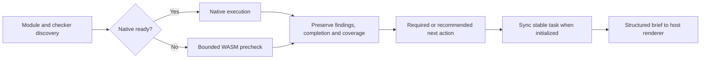

1. Discover each module's source set, language version/dialect, configured checkers and explicit native obligations. Separate “not on PATH” from “not installed”; inspect selected project-local tools and supported build integration before declaring a tool absent.
2. Run a suitable native checker when available with valid configuration. Preserve native findings. Never downgrade a native violation to WASM. For configuration/runtime failures, retain the failure while optionally providing a supplementary precheck.
3. Otherwise select a verified bundled grammar for that module/dialect, validate its asset identity and run a bounded syntax worker. Aggregate checked, unsupported, excluded and failed scope separately. `ERROR`/`MISSING` observations remain suspected issues.
4. With complete precheck scope and no anomaly, recommend native setup. With an anomaly, require setup and applicable native confirmation. Incomplete/unsupported prechecks require restoring valid checking capability, without inventing a source defect. An already-required native obligation stays required for all outcomes.
5. Sync eligible observations if the workspace exists and return a brief. Optional setup remains an advisory item, not a blocking task or a repeated `next` selection. Reuse the module/checker setup task; link individual suspect observations without making an installation task per line. A sync failure returns its own diagnostic and no fictional task ID.
6. After setup, use the original project configuration and current input to verify. A native zero-result contradicts a syntax observation only when the same syntax capability and source scope were actually covered. Installation, changing grammar or a later clean precheck alone cannot close a required native-confirmation task.

If the language has no supported native confirmation adapter, return that specific capability gap and an actionable environment/decision task. Do not repeatedly recommend a nonexistent tool. “Require installation” also includes restoring the correct runtime, project dependency or configuration; use project-declared versions and package manager, and perform modifications within the user's existing authorization.

Core now has a local pure setup-action selector taking an upstream-verified native blocker, the full precheck aggregate and any existing required native obligation. It recommends an optional tool only for a nonempty, complete, qualified clean precheck; invalid configuration and failed execution lead to distinct recovery actions instead of repeated installation advice. This selector is not yet connected to real tool discovery, CLI feedback or durable tasks. See the [candidate acceptance record](../tests/acceptance/syntax-setup-guidance-candidate.md).

| Design field | Meaning |
| :--- | :--- |
| `backend` | `native` or `wasm_precheck`; source of this observation |
| `precheck.status` | `not_run`, `clean`, `suspected_issue`, `incomplete`, `unsupported` |
| `native.status` | `not_run`, `completed`, `incomplete`; separate reason such as `missing_runtime` |
| `scope` | Selected/checked/unresolved files or regions, with exclusions and reason counts |
| `observations` | Source spans, parser/rule identity and suspected/confirmed classification |
| `setup.requirement` | `recommended` or `required` when setup is needed, with its reason |
| `task_id` | Actual persisted task, otherwise null; not a claimed closure receipt |
| `delivery` | Independently evaluated; a precheck never manufactures delivery permission |

When some files have suspected issues and others are unresolved, use overall `incomplete` while retaining all usable suspected observations. `clean` requires nonempty, completely checked selected scope.

These are the target semantic fields, not a shipped project-wide lint/check report. A narrow [candidate precheck schema](../schemas/syntax-precheck-candidate.schema.json) and [strict Rust reader](../crates/codeguard-adapters/src/syntax_precheck_candidate_report.rs) bind source SHA-256, pinned grammar identity and file dialect, recalculate status, and reject unknown versions or forged `clean`. Optional CLI single-file [TypeScript](../schemas/eslint-local-feedback-v0.3.schema.json), [TSX](../schemas/eslint-local-feedback-v0.4.schema.json) and [Java](../schemas/java-syntax-precheck-feedback-v0.1.schema.json) producers include recovery positions and setup guidance. With an initialized workspace, TypeScript/TSX now uses [feedback 0.5.0](../schemas/eslint-local-feedback-v0.5.schema.json) and attaches one stable native-confirmation task to the source scope; the [0.2.0 preparation report](../schemas/eslint-preparation-observation-v0.2.schema.json) stores bounded suspected positions with source and grammar identities and links them by digest to the task. Host rendering and capability-matched native closure remain absent. The bundled grammars remain unvalidated, so these reports cannot return `clean`. Missing required native execution remains incomplete (`3`); a suspected parser issue alone is not a confirmed violation (`1`). If a dedicated syntax-only operation is later introduced, its success must be explicitly scoped to syntax; no new `syntax` command is claimed here.

The source-built `check all` now adds a narrower actual project report: native adapters run first, then a [bounded source router](../crates/codeguard-cli/src/check_syntax_candidates.rs) selects pinned worker candidates. The closed [0.38.0 schema](../schemas/check-feedback-v0.38.schema.json) counts files preempted by native checks and projects each selected grammar's bounded known limitations; [0.33.0](../schemas/check-feedback-v0.33.schema.json) remains archived for older readers. Completed Ruff, selected Go vet and module-local ESLint results skip duplicate WASM only for matching source bytes. A style checker such as P3C is not syntax confirmation. Default terminal output also shows up to eight fixed limitations from candidate observations; automatic host delivery remains pending. The following is an excerpt, not a complete `check_feedback` instance:

```json
{
  "schema_version": "0.38.0",
  "command_status": "incomplete",
  "delivery_decision": "incomplete",
  "syntax_candidates": {
    "status": "observed_partial",
    "execution_phase": "after_native",
    "authority": "candidate_unqualified",
    "delivery_decision": "incomplete",
    "native_preferred_count": 1,
    "observations": [
      {"path": "src/view.tsx", "language": "tsx", "status": "candidate_observed", "grammar_qualified": false, "recovery_count": 0, "known_limitations": ["Rust loader smoke passed; TSX language versions, JSX dialects, isolation and syntax corpus are not yet validated"]}
    ],
    "next_action": "Run the applicable native checker before delivery"
  }
}
```

The actual report also includes native results, source/grammar digests, fragment offsets, bounded file-relative recovery anchors, skipped counts and unresolved obligations. A complete `<cfquery>` tag body is an embedded candidate; ordinary SQL or ambiguous C/C++ headers are not guessed. Automatic `.m` routing requires an Objective-C line marker, while `.sc` is left unresolved because SuperCollider shares that suffix. Read-only discovery now uses the same bounded `.m` evidence and records unresolved shared-suffix paths in `unknown_conditions`; `check all` retains them in its unrouted count. The shared detector ignores Objective-C-looking lines inside MATLAB `%{ ... %}` block comments, including an unclosed block, while retaining a real marker outside the block. This reduces a concrete false route; it is not a complete MATLAB lexer. Project-level dialect evidence and structured per-file ambiguity reporting still need work. Four bounded 32-grammar CLI fixtures took about 54 seconds on this Mac; the prior sequential implementation completed 26/32 in a single 31-file Linux run within 90 seconds; language-version corpora, native differential checks, task synchronization, host delivery and package release are still open.

For one mixed-language project, the candidate pass plans at most 64 fragments, then runs isolated workers in ordered batches capped by both `--jobs` and two workers. All workers share the existing 90-second candidate deadline, and successful results are invalidated when the source changes before reporting. The local 31-file fixture observed all 32 pinned candidates without skipped fragments; the Linux WASM integration step for source commit `ff60184` passed the same one-project test; the complete CI run passed, while resource characterization remains pending.

For Java, [javac 21 with `--release 17`](../tests/acceptance/java-native-differential.md) accepted eight valid and rejected five malformed syntax fixtures, matching the isolated WASM worker. The test pins only that narrow classification; project-level native routing, version coverage and false-positive rates remain open.

The current [Kotlin 2.4.10 differential](../tests/acceptance/kotlin-native-differential.md) records 11 decidable agreements and two unresolved hidden-error cases. Both `fun f(x: ) = x` and valid `object C { val value = 1 }` have no enumerable recoveries but an incomplete scan. `grammar status` and `check all` retain these bounded limitations. Unknown samples stay in the corpus denominator and are reported separately, never counted as clean, agreement or a confirmed source violation.

The opt-in CLI build first checks for a local ESLint 10 package and a single ordinary flat config on single-file TypeScript requests without explicit native context. With an executable Node resolved from `PATH`, it invokes the existing bounded native version/report probe; without Node it reports the preparation gap rather than running WASM first. Only when no project-local ESLint package is observed does the CLI emit [ESLint feedback 0.3.0](../schemas/eslint-local-feedback-v0.3.schema.json) for `.ts/.mts/.cts` or [0.4.0](../schemas/eslint-local-feedback-v0.4.schema.json) for `.tsx`. TSX uses its own pinned grammar. Candidate prechecks preserve `native=not_run` and `delivery=not_evaluated`, and remain incomplete even with zero recoveries. An ambiguous config, untrusted local path or invalid package identity remains a setup blocker and does not trigger WASM; a partial explicit context also retains its existing path. This is a single-file slice, not project script equivalence, per-module orchestration or automatic host feedback; see the [native-first acceptance](../tests/acceptance/native-first-eslint-candidate.md).

### 5.4 Grammar import and runtime lifecycle — target

Import only pinned WASM bytes with upstream license, commit/patch provenance, SHA-256, ABI, tested runtime and language/dialect ranges, corpus reference and known gaps. Verify each copied CodeGraph artifact in the selected Rust Tree-sitter runtime; do not copy TypeScript extraction logic or assume CodeGraph support equals syntax acceptance. A release manifest belongs to distribution assets, not writable `.codeguard/` project state.

Use `codeguard grammar status --format=json` to query the separate source coverage inventory. It reports 32 distinct CodeGraph grammar assets, thirty-two CodeGuard asset candidates (ArkTS, C, C++, C#, Go, Java, JavaScript, Lua, Luau, Objective-C, Python, Rust, Solidity, TypeScript, TSX, Zig, Nix, Terraform, R, Ruby, PHP, Kotlin, Dart, Erlang, Pascal, CFML, CFQuery, CFScript, COBOL, Scala, Swift and VB.NET), and zero released capabilities without running a parser. Python has a narrow unqualified `lint` fallback for unavailable or undeclared Ruff, never a clean or delivery result. A bound, single-file result uses [feedback 0.15.0](../schemas/python-lint-feedback-v0.15.schema.json) and persists a [0.1.0 confirmation observation](../schemas/python-syntax-confirmation-observation-v0.1.schema.json) through the existing work sync. The task identity binds workspace and source scope; current-source SHA-256 and pinned grammar are checked before import. Native capability-matched closure remains open. C, C++, C#, Go, JavaScript, Lua, Luau and Rust have pinned vendored bytes and narrow Rust worker smoke tests, but no language-qualified standalone lint route or language qualification. ArkTS, Nix and Terraform have pinned bytes, licenses and narrow Rust worker evidence, but no language-qualified standalone lint route or release qualification; see the [limited acceptance record](../tests/acceptance/arkts-nix-terraform-grammar-candidates.md). The two dependency-provided assets now have pinned original and adapted bytes plus license references, but are still unqualified candidates without language-qualified lint routes. COBOL now loads under a bounded 20 MiB input limit, but cold-start and memory budgets remain unqualified.

R, Ruby, PHP and Kotlin now also have pinned CodeGraph bytes, licenses, measured Rust ABI and narrow positive/negative worker samples; the PHP fixture covers mixed HTML/PHP. They remain unqualified candidates. The original CodeGraph Dart WASM remains incompatible with Rust, but CodeGuard now has a byte-reproducible Zig rebuild that compiles the real external scanner and uses a pinned WASI import adaptation. Rust loader and isolated-worker fixtures pass; Dart remains unqualified for public lint and release. See the [Dart rebuild record](../tests/acceptance/dart-grammar-rebuild-candidate.md). Erlang also has pinned CodeGraph bytes, upstream 0.19 license and ABI 14 with narrow Rust and worker samples. It has no qualified native comparison or public lint route; see the [Erlang candidate record](../tests/acceptance/erlang-grammar-candidate.md). Pascal now has pinned CodeGraph bytes and its original Isopod dependency commit and license; ABI 14 and narrow worker tests pass, but native comparison and public lint remain open. See the [Pascal candidate record](../tests/acceptance/pascal-grammar-candidate.md). The remaining CFML/CFQuery/CFScript/COBOL/Scala/Swift/VB.NET assets also load in the Rust worker, bringing the candidate inventory to 32/32 with zero released syntax capabilities. CFQuery misses `SELECT FROM`, VB.NET misparses a valid unindented method, and COBOL has a high load cost; see the [seven-asset acceptance record](../tests/acceptance/final-seven-grammar-candidates.md).

The source-built `grammar status` report now uses protocol 1.1.0 and projects each pinned candidate's bounded `known_limitations`, including the [VB.NET false-positive reproduction](../tests/acceptance/vbnet-unindented-method-false-positive.md). Manifest validation rejects overlong, excessive or control-character-bearing entries before they reach agent-facing output. This is a read-only risk signal; it cannot upgrade a recovery to a violation or close a native confirmation task. See the [projection acceptance](../tests/acceptance/grammar-known-limitations-projection.md).

The CFQuery source router now skips tags inside nested CFML comments and ordinary tag attributes or explicit CFScript bodies; it preserves tags inside HTML comments because [Adobe's CFML comment semantics](https://helpx.adobe.com/coldfusion/developing-applications/the-cfml-programming-language/elements-of-cfml/comments.html) do not make HTML comments server-side suppression. Quoted `>` characters and nested CFML comments inside a real opening tag no longer truncate its query body. This addresses a concrete false route without hiding a CFML tag that can execute; the CFQuery grammar's SQL false negative remains. See the [markup-boundary regression](../tests/acceptance/cfquery-markup-boundary.md).

The Go 1.23.4 native `gofmt -e` differential corpus now compares eight valid and five malformed sources with the isolated Go WASM worker, with all 13 syntax classifications matching locally. This is a narrow syntax oracle, not type checking, `go vet`, a measured population error rate, or grammar qualification; see the [Go differential record](../tests/acceptance/go-native-differential.md).

The JavaScript module corpus similarly compares Node 24.18.0 `--check --input-type=module` against the isolated JavaScript worker on eight valid and five malformed sources, with all 13 classifications matching locally. The pinned worker corpus runs in ordinary CI; native comparison is explicit because Node versions differ by host. This does not qualify JSX, TypeScript, ESLint rules, or the whole JavaScript ecosystem; see the [JavaScript differential record](../tests/acceptance/javascript-native-differential.md).

For Go under `check all`, a completed Go 1.23.4 `go vet` now preempts duplicate WASM only for files selected by a bounded `go list -json ./...` under the same default build conditions and matching source, module and tool identities. Build-tag-excluded files still reach the candidate worker; malformed package scope or changed inputs cannot preempt it. A real Go integration and a forged-scope regression cover this boundary, while the overall delivery remains incomplete; see the [Go native-first record](../tests/acceptance/check-all-native-preferred-go.md).

Rust 2021 `rustfmt 1.9.0 --emit stdout` and the isolated Rust worker classify the same eight valid and five broken syntax samples consistently; the bounded [Rust differential record](../tests/acceptance/rust-native-differential.md) does not qualify Clippy, compilation or other editions.

C11 `Apple clang 21 -fsyntax-only` and the isolated C worker classify eight valid and five syntax-broken samples consistently. The initial corpus mistakenly treated a return-type error as a syntax error, so it was replaced with a missing initializer expression; the bounded [C differential record](../tests/acceptance/c-native-differential.md) does not qualify semantic diagnostics, C lint or other language versions.

Ruby 2.6.10 `ruby -c` agrees with the isolated Ruby worker on a narrow 13-case corpus, with the fixed worker corpus running in ordinary CI; this does not qualify Ruby lint or other versions. By contrast, Apple Swift 6.4 `swiftc -frontend -parse` rejects `func f(_ x: ) {}` as a missing parameter type while the fixed Swift WASM emits no recovery. The corrected 13-case Swift differential has 12 decidable agreements and one unresolved hidden-error case; the native-rejected missing type remains incomplete instead of being classified by its empty recovery array. The candidate remains unqualified and cannot claim a clean syntax result; see the [Ruby](../tests/acceptance/ruby-native-differential.md) and [Swift](../tests/acceptance/swift-native-differential.md) records.

Use a parent-controlled parser worker with a total deadline, per-file input bound, memory/process limit and capped diagnostics. Lazy-load selected grammars, parse without general network/filesystem imports, and terminate a stuck worker without losing native results from other modules. Host-specific enforcement and Rust MSRV compatibility must be tested; numeric production budgets remain measurement-driven rather than invented promises.

The opt-in Rust CLI now has a private [candidate worker](../crates/codeguard-cli/src/syntax_worker_command.rs) and [parent verifier](../crates/codeguard-cli/src/syntax_worker_runner.rs). On Unix they use the existing process-group runner with a 1 MiB source limit, 64 KiB output limit, caller deadline and cancellation, then recheck source/grammar digests and recovery positions. This is a measured contract slice, not the finished isolation design: a verified memory bound, cross-platform enforcement, formal lint/check routing and release packaging remain open. Candidate grammar observations remain `incomplete` even when parsing finds no recovery nodes.

Cache by source content, dialect/language profile, grammar bytes, parser runtime, query/rule version and relevant scope/configuration identity. Cancellation, partial output and unresolved coverage cannot produce a reusable clean result. Artifact replacement invalidates affected caches and dispositions. Roll back a language pack by its verified manifest; retain historical observations and never infer resolution from cache deletion.


## 6. Static detection portfolio

The [28-family registry](../crates/codeguard-core/src/capability_dimensions.rs) prevents distinct checks from being collapsed into one generic lint result.

| Category | Families | Expansion contract |
| :--- | :--- | :--- |
| `lint` | syntax, style, type, dataflow, complexity, duplication, dead_code, architecture, api_compatibility, schema | Native rule configuration and correct source sets |
| `comments` | api_docs, comment_policy, doc_links | Deterministically checkable documentation rules; subjective writing quality stays advisory |
| `dependencies` | graph, versions, licenses, sbom, provenance | Actual resolved component identity and tool-specific evidence |
| `cve` | advisory | Component/version/graph plus advisory source and freshness |
| `security` | sast, secrets, iac, container, config, policy | Scope and sensitive-data handling per tool |
| `build` | compile, reproducibility, manifest | Explicit build/test level; no escalation hidden under lint |

These are target coverage slots. Existing paths cover only the subsets described in the README. Security/IaC/container/SBOM/etc. must not appear as implemented merely because their family is registered. Language expansion should use native ecosystem tools and a capability gap when no suitable adapter exists.

## 7. Result normalization and conversation feedback

### 7.1 Mapping policy

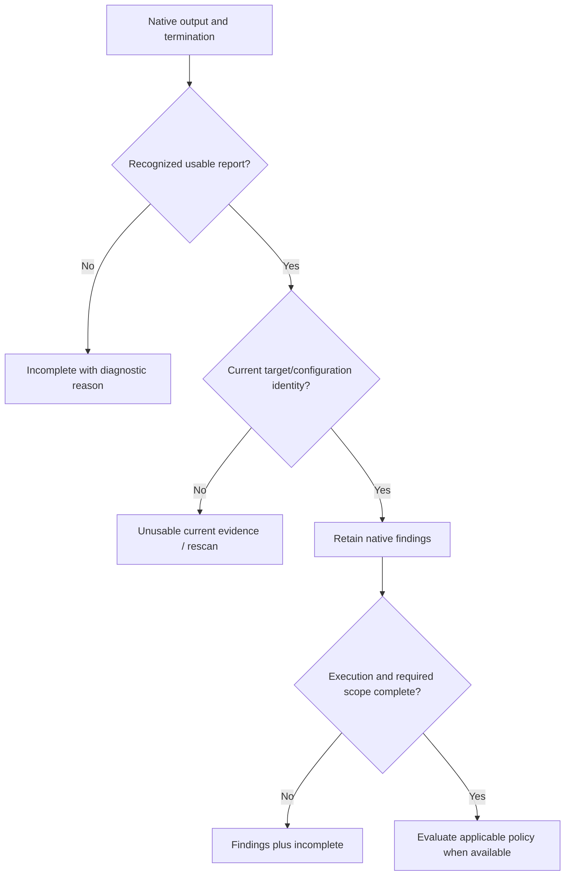

Do not infer pass/fail from generic words such as `error`, `warning`, or `BUILD SUCCESS`. Tool-specific parsers decide what an exit/report combination means. A complete, input-bound report followed by abnormal exit can retain findings while remaining incomplete. Truncated monolithic JSON cannot be recovered by inventing findings from a prefix.

### 7.2 Feedback contract

| Field group | Reader question |
| :--- | :--- |
| Selection and configuration | What language/category/root was selected, and is its checker configured? |
| Findings | Which checker/rule, location/component and severity were observed; is a syntax observation suspected or natively confirmed? |
| Execution/completion | Did precheck/native execution finish, which scope was covered, and what remains unknown? |
| Persistence status | Was the local report saved/synced? If not, what can be retried? |
| Next action | Repair source, recommend/require native setup and confirmation, restore configuration, rescan, or obtain a concrete decision? |
| Delivery | Is this only a local observation or a fully evaluated delivery result? |

[RunReport parsing](../crates/codeguard-cli/src/run_report.rs) supports a common structured contract; [check orchestration](../crates/codeguard-cli/src/check_command.rs) currently emits `check_feedback` `0.38.0`, with workspace binding expressed separately. Adapters also emit their own versioned local observations. Consumers must dispatch by protocol identity/version rather than assume a universal JSON shape. Human output is currently primarily Chinese; English documentation does not imply localized runtime messages.

### 7.3 Conversation report examples — target presentation

The following four examples are synthetic presentation designs, not captured CLI output, confirmed product findings or a claim of English runtime localization. Source paths and task IDs are illustrative. Real feedback must use actual checked scope, observations and persisted task IDs. Prefer a short conclusion → method/scope → native status → evidence → next action → task/coverage boundary. Do not open with internal receipts, hashes or an unqualified “PASS/FAIL”.

**A. Missing native tool, suspected syntax issue: required confirmation.**

```text
Codeguard: Java syntax precheck found 1 suspected issue

Method: bundled Tree-sitter WASM
Scope: 18 Java files selected and checked; 0 unresolved
Native check: not run; the JDK required by this project is unavailable
Location: src/main/java/example/UserService.java:42
Observation: the parser recovered a missing syntax node at this location

Next steps (required):
1. Prepare the project's declared JDK and applicable native checker.
2. Run native verification covering this file and Java syntax.
3. Repair according to the native diagnostic, then recheck.

Task: CG-example-java-setup (illustrative; emit only after successful sync)
Recheck entry (after restoring original project tool/configuration context):
codeguard task verify CG-example-java-setup . --format json
This location is not yet a confirmed code violation. Delivery is not evaluated.
```

**B. Missing optional native checker, complete clean precheck: recommendation.**

```text
Codeguard: syntax precheck found no anomaly in the checked scope

Method: bundled Tree-sitter WASM
Scope: 18 Java files selected and checked; 0 unresolved
Native check: not run; native checking is not configured for this example
Next step (recommended): configure and prepare the project's native checker.

Type checks, project style rules and dependency security were not checked.
This is a syntax observation, not complete lint or delivery approval.
```

If the project already requires native lint, change the next step to required and show the declared requirement; do not reuse example B's optional wording.

**C. Precheck could not finish: scope gap, not a source violation.**

```text
Codeguard: syntax precheck incomplete

Method: bundled Tree-sitter WASM
Scope: 18 Java files selected; 17 checked, 1 unresolved
Completed scope: no syntax anomaly observed in those 17 files
Unresolved: src/main/java/example/PreviewFeature.java; worker timed out
Native check: not run; the required JDK is unavailable
Next step: restore native checking; inspect the parser timeout separately.

No source violation is inferred from the timeout. Do not report all files clean.
```

Grammar/version incompatibility is a different reason and must not be guessed from a timeout. An unsupported embedded-language region similarly needs an explicit uncovered region rather than a whole-file clean label.

**D. Native lint produced a diagnostic: direct repair guidance.**

```text
Codeguard: native lint found 1 issue

Method: ESLint with the project's selected configuration
Scope: 12 TypeScript files selected and checked
Native execution: completed
Location: src/example.ts:8
Rule: no-unused-vars
Observation: the local variable `unused` is declared but never used
Next step: inspect its intended use, remove an unnecessary declaration or use it,
then rerun the same checker with the same project configuration.

This result covers the selected lint scope; delivery is not evaluated.
```

If native execution later fails or output truncates, explicitly change execution/completion and retain only independently usable diagnostics; do not keep example D's “completed”. For CVE/other categories, replace syntax fields with actual component/version/rule and database coverage; a zero-advisory observation with unknown database coverage is not “safe”.

**E. Pre-commit index safety preview: staged paths only.**

```text
Codeguard: 1 staged path needs review

Scope: current Git index; 1 entry observed, 1 path violation
Path: .env
Rule: repository path safety
Object check: verified ordinary blob
Next step: remove the sensitive path from the index, then rerun the preview.

Source lint, dependency checks and the full commit gate have not run.
Delivery is not evaluated; this preview does not authorize a commit.
```

This is also illustrative, not captured output. Actual hook JSON carries an index digest, a total violation count and at most 32 displayed paths with a truncation flag. The observed index can differ from the working tree and can be supplied through `GIT_INDEX_FILE`.

**F. Stop guidance: read-only repair handoff.**

```json
{
  "execution": "read_only_guidance",
  "local_feedback": {
    "report_type": "hook_next_guidance",
    "disposition": "verification_required",
    "reason": "no_tasks_without_fresh_full_gate",
    "task_id": null,
    "checker_id": null,
    "step": null,
    "next_actions": [["codeguard", "check", "all", "."]],
    "source_check": "not_run",
    "authority": "local_unverified",
    "delivery_decision": "not_evaluated"
  }
}
```

This is an excerpt of the current 0.3 outer response, not a complete schema instance. It is a recommendation to run a fresh full check, not a clean result. Stop never executes `next_actions`; backlog count or byte overflow returns `not_run/guidance_scope_exceeded`. Prompt submission is intentionally still unexecuted until the event carries usable intent context and the host adapter can bound repeat messages.

**G. Repair-ready: original-checker recheck, still locally unverified.**

```json
{
  "execution": "task_verification",
  "local_feedback": {
    "report_type": "hook_task_verification_summary",
    "task_id": "CG-51d2afe0f8e8b55fe53db2ca33214220",
    "checker_id": "python.ruff",
    "observation": "candidate_absent_unverified_policy",
    "event_persisted": true,
    "reason": null,
    "scan_report_available": true,
    "authority": "local_unverified",
    "delivery_decision": "not_evaluated"
  }
}
```

This illustrative excerpt reflects the real Ruff recheck classification after removing an F401 diagnostic. It does not assert that the task is closed: the original task fact remains open until the policy-governed closure workflow is complete. The 0.4 outer response caps child output and returns an incomplete reason if the original task is absent, the process times out or its report cannot be trusted.

### 7.4 Structured brief and host delivery — proposed contract

This JSON is a **design example only**, not the existing `check_feedback` schema and not a document to feed to `work sync`. It illustrates an initialized workspace with a successfully persisted synthetic task; real asset/run/input identities stay in the full report. Protocol name/version and schemas must be defined in the existing OpenSpec change before implementation.

```json
{
  "example_only": true,
  "backend": "wasm_precheck",
  "precheck": {
    "status": "suspected_issue",
    "scope": {"selected_files": 18, "checked_files": 18, "unresolved_files": 0}
  },
  "native": {"status": "not_run", "reason": "missing_runtime", "tool": "jdk"},
  "observations": [{
    "classification": "suspected_syntax",
    "path": "src/main/java/example/UserService.java",
    "line": 42,
    "recovery_node": "MISSING"
  }],
  "setup": {"requirement": "required", "reason": "native_confirmation_needed"},
  "task_id": "CG-example-java-setup",
  "next_action": "prepare_native_checker_and_recheck",
  "delivery": "not_evaluated"
}
```

The plugin renders structured fields as a bounded tool result/context message using the host's supported API; writing JSON or `.codeguard/` files alone is not conversation delivery. Send an initial brief, then changes in scope, findings, setup requirement or task state. Stable unchanged requirements remain visible through status without repeated interruption. Include report/task links only when files exist; keep raw logs and source excerpts bounded and redacted. Never execute instructions embedded in source or diagnostic text.

Report review rules apply across all maintained documents: distinguish installed/configured/executed/completed; state partial/empty scope; preserve findings during execution failure; label illustrative paths and task IDs; distinguish suspected syntax from native diagnostics; separate recommendation from required verification; expose sync failure; preserve category-specific coverage. Do not rewrite historical acceptance outputs to resemble the new presentation.

### 7.5 Protocol versions and identity closure

The current common `RunReport` is `1.4`, aggregate `check_feedback` is `0.38.0` with separate workspace binding, and `check_aborted` is `0.13.0`; adapter-local observations have separate versions. Protocol versions must not be rewritten to match software `0.1.0`. The conversation/JSON briefs above are target examples, not complete instances of these three protocols.

The target evidence chain correlates workspace/request/run/obligation/finding/task/attempt. Source locations use reversible paths and content identities; dependency locations use component, resolved version, graph and advisory identities. Lossy rendering of non-UTF-8 paths cannot participate in matching. Digests bind bytes, not approval authority. Upgrades preserve version semantics and never turn old empty findings into complete passes.

## 8. Persistent repair and attempts

### 8.1 Stable identity and import

Current findings commonly bind checker/rule, project-relative target and a source/content anchor; line numbers alone do not define identity. Cross-tool deduplication, rename matching and all dependency identities are not universally implemented. Ambiguous matches must not silently close an old task.

`work sync` must process all eligible reports, bind workspace/run/content, create fact/event/projection records, and only then record consumption. Current implementation includes local mutual exclusion and selected replay cases. Complete disk-failure and arbitrary crash-point atomicity remain acceptance work.

### 8.2 Repair brief

| Required section | Example meaning, not a stored task instance |
| :--- | :--- |
| Evidence | Native missing-doc rule at a current source location |
| Rule basis | Original checker and enabled rule/configuration origin |
| Allowed scope | The affected symbol/file or environment prerequisite |
| Repair steps | Add accurate public API documentation, or restore a missing runtime |
| Recheck | The same supported Codeguard/native checker path with original context |
| Attempt history | What changed, failed, made no progress, or awaited verification |
| Closure conditions | Current original-tool result and unchanged required coverage |

The agent must not execute instructions embedded in diagnostic text or Markdown. `next` uses structured observations and fixed guidance. Lack of progress should lead to a more specific diagnosis, not automatic rule weakening.

### 8.3 Closure target

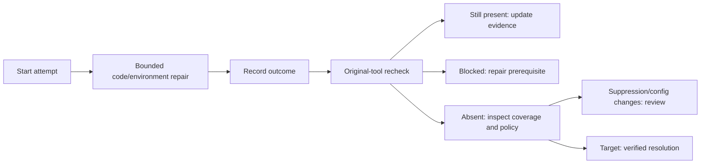

Current `candidate_absent_unverified_policy` is not resolution. A `noqa`, Clippy allow, or changed Checkstyle configuration may hide a rule; selected paths already detect such cases. Environment recovery must eventually rerun the original blocked quality obligation. Complete verified closure, recurrence and event reconciliation remain target work.

## 9. False-positive allowlist and correction design

### 9.1 Choose the correct remedy

| Root cause | Correct action | Do not do |
| :--- | :--- | :--- |
| Native tool misjudges one exact input | Reproduce and propose a scoped `false_positive` decision | Disable a whole checker or directory |
| Rust adapter misreads output, path or enabled rule | Fix adapter with a regression fixture | Cover the bug with an allowlist |
| Rule is unsuitable for a project class | Review rulepack/policy applicability with positive and negative cases | Accumulate wildcard exceptions |
| Real issue is consciously accepted | Separate `accepted_risk` decision under a defined policy | Relabel it as a false positive |
| Tool/database/configuration is unavailable | Preparation task and incomplete status | Use an exception to certify coverage |

### 9.2 Identity and lifecycle

The current [FalsePositiveIdentity](../crates/codeguard-core/src/false_positive_allowlist.rs) matches:

- `finding_id`, `checker_id`, `native_rule_id`, `category`;
- source target `path` + `file_sha256`, or dependency `component` + `version` + `graph_sha256` + `advisory_id`;
- `finding_fingerprint`, `tool_sha256`, `adapter_sha256`, `rulepack_sha256`.

Approval scope, policy revision, decision/reference identity and bounded expiry are separate concerns in [delivery evaluation](../crates/codeguard-core/src/delivery_gate.rs). A valid identity comparison does not approve anything. Source bytes or tool/rulepack changes invalidate old exact matches; the UI should explain the changed field and propose reevaluation, not require users to calculate digests.

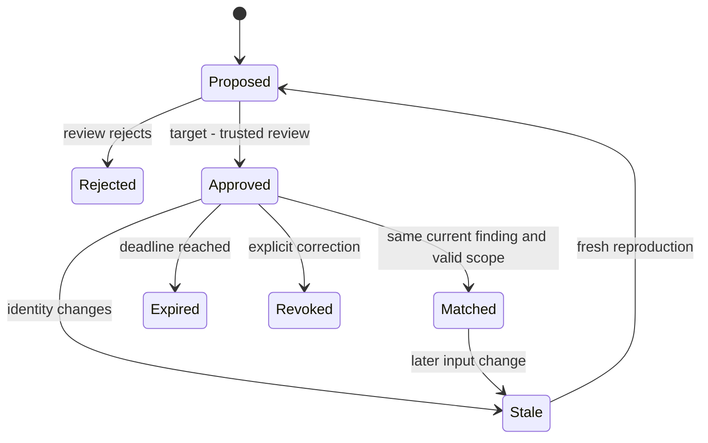

This is the target lifecycle. Current CLI provides candidate list/explain/propose and local correction recording; it does not expose the complete trusted approval transition. First-version matching excludes wildcard paths, whole-directory exemptions, and message-similarity matching.

### 9.3 User correction flow

1. User selects an existing finding and says why the diagnosis appears wrong.
2. Agent shows native rule/configuration, current target, reproduction and mismatch details.
3. The system distinguishes adapter defect, policy applicability, exact native false positive, and accepted risk.
4. A correction references the same stable finding and the latest relevant original-tool verification; replacement decisions are new versions.
5. Review/approval or revocation occurs through the selected authority; project-local `approved=true` is insufficient.
6. The next scan still runs the native tool, retains the finding, and reports either a matching exception or a concrete mismatch.

Current `rules whitelist propose ... --correct-decision ... --record` can append proposal events and readable correction attachments. [Correction evidence](../tests/acceptance/whitelist-correction-preview.md) covers bounded replay and input changes. Replacing a candidate is not source repair; approved exceptions should eventually show `allow_with_exceptions`, not pretend raw diagnostics vanished. CVE exceptions additionally require trustworthy current dependency/advisory context.

## 10. Scheduling, cancellation, and side effects

Use the same absolute deadline across child tasks and retries. The current scheduler validates dependency graphs and excludes concurrent resource keys, for example Cargo tasks sharing a build resource. Defaults and accepted ranges are in [check_budget.rs](../crates/codeguard-cli/src/check_budget.rs).

| Condition | Required outcome |
| :--- | :--- |
| Dependency fails | Do not start its dependent task; record why |
| Cancellation before start | Mark queued work as not started, not successful |
| Timeout/output limit during execution | Stop bounded execution; retain valid prior observations |
| Callback panic | Internal failure, preserve other captured results where possible |
| Native subprocess spawns children | Apply process-group lifecycle handling; verify platform-specific behavior |
| Persistence fails after native checks | Return native findings plus persistence failure |

Clearing environment and using literal arguments prevents one class of accidental shell interpretation. It does not make arbitrary native plugins safe. Offline flags are tool-level requests, not proof of network isolation. Runtime unsafe/FFI paths and native execution must be reviewed and tested on each advertised platform.

### 10.1 Snapshots, caching and repair transactions — full-workflow target

- Worktree, index, every ref supplied through pre-push stdin, and immutable CI commits require distinct evidence. Respect `GIT_INDEX_FILE`; never substitute the worktree for partially staged content. Define SHA-1/SHA-256, NUL paths, symlinks, gitlinks, LFS and missing-object behavior. Uncertain scope expands checking or remains incomplete, never silently disappears.
- Cache identity includes the input closure, tool/runtime, rules, configuration, module graph, content source, platform/locale and CVE database source/freshness. Changed-file thresholds affect scheduling only. Partial feedback and incomplete reports cannot become clean full-gate cache entries or receipts.
- Repair uses an isolated copy and preview, then checks content preconditions before applying. Roll back only changes owned by this attempt and preserve concurrent user edits. Expose partial application; never change tests, thresholds or required checks to manufacture success. Generic public fix remains unfinished.
- Retention must preserve active leases, referenced receipts and tracked historical events. Correlate run/task logs using the identities above and redact sensitive diagnostics; no background telemetry service is implied.

These are full-delivery contracts. Tests for snapshot/cache/install/repair building blocks do not establish integrated gates or platform acceptance.

## 11. Configuration, policy, and distribution

Keep operational preferences separate from rule authority. The runtime JSON example in [README](../README.md) is currently parseable and only changes time/concurrency. Native configuration remains at its existing tool location. `config` can inspect legacy configuration, tool-lock candidates and explicit policy candidates; it does not silently migrate them into approved policy.

| Input | Owner | Change implication |
| :--- | :--- | :--- |
| Native configuration | Project maintainers | Rule/scope change requires relevant recheck |
| Runtime options | Project/caller | Bounded execution preference, no exception authority |
| Rulepack candidate | Rule maintainers | Needs applicability/semantic tests and selected approval process |
| Tool-lock candidate | Toolchain maintainers | Bytes/version consistency alone is not trust |
| Exception decision | Designated approval authority, pending operational definition | Version, scope, reason, expiry, revocation and current identity |
| Generated profile/task | Codeguard local workflow | Observation/projection, not a source of rule approval |

Artifact signature, package digest, layout, archive extraction and publication primitives are implemented in parts of CLI/runtime. They must not be advertised as an operational tool installer while the public apply path is blocked. A binary release requires source/tag/artifact correspondence, platform smoke tests, compatible schemas, license notices and actual host binding where claimed.

The Node path supports the published macOS arm64 package and local packaging. For local packaging: explicitly build the Rust binary, validate its `--version --format json` target and version, create a host-tagged tarball, and install or execute it through npm. The package contains `codeguard.cjs` and the native binary, declares npm `os`/`cpu`, and has no install lifecycle script. Local packages are private by default; `--public` packages are public. The launcher does not implement checks or silently fetch tooling. [README](../README.md) contains tested commands. This is separate from Codeguard's `tools install`, which provisions external analyzers under a different trust contract.

The `--public` packer mode produced `@partme.ai/codeguard@0.1.3` for `darwin-arm64`; its npm `os`/`cpu` constraints reject other hosts. Registry publication, a fresh-cache registry-hosted `npx --yes @partme.ai/codeguard@0.1.3 --version --format json` run, and registry/local tarball and binary SHA-256 comparisons passed on Apple Silicon macOS. Its clean-checkout build identity reports the candidate source commit but does not prove a reproducible build, signed provenance, or S13 release completion; see [acceptance evidence](../tests/acceptance/npm-0.1.3-wasm-candidate.md). For broader distribution, adapt CodeGraph's thin entry/platform bundle pattern only after S13 release evidence is ready: publish a version-matched package for each certified target, then a public command package with exact optional platform dependencies. Missing platform support must fail clearly; network recovery must follow Codeguard's signed selection and explicit host permission contract before any download.

For the published 0.1.3 WASM candidate package, `--require-wasm` verifies the binary's 32 reported identities against the pinned manifest, rejects a default build without the worker, and executes a real Zig grammar probe before packing. `--public` implies this guard and retains its clean-checkout/build-identity checks. A local private tarball then runs offline through `npm exec`; Zig and Dart probes demonstrate the launcher reaches the bundled Rust worker, and four bounded installed-package `check all` runs invoke all 32 candidates. This [local packaging evidence](../tests/acceptance/npm-wasm-local-package.md) is supplemented by [registry installation and byte-identity evidence](../tests/acceptance/npm-0.1.3-wasm-candidate.md). The packer verifies and includes pinned upstream licenses. The published candidate still does not establish per-language syntax qualification; broader platforms and the remaining S14 acceptance are open.

## 12. Test and evaluation plan

| Layer | Proves | Does not prove |
| :--- | :--- | :--- |
| Pure core tests | Deterministic aggregation and matching | External trust, usable commands, native semantics |
| Parser fixtures | Supported report/config shapes and negative cases | Real tool invocation |
| Simulated subprocesses | Arguments, deadlines, abnormal exits, output limits | Native tool compatibility or genuine CVEs |
| Actual native fixtures | A named tool/version/configuration/input path | Every rule, platform, module or database freshness |
| CLI/workbench contracts | Observable commands, persistence, replay and feedback | Installed host integration |
| Host acceptance | Plugin invocation and conversation handoff | All language/category correctness |
| Independent labelled corpus | False-positive/negative measurements within stated strata | Universal precision from a single aggregate percentage |

The local `cd8fb72` baseline passed 990 tests, with 101 ignored tests excluded from passes, plus Clippy and formatting. No measured production accuracy or full matrix is available.

Target quality evaluation must retain raw findings, adjudicated false positives, true positives, false negatives, exception matches/expirations and incomplete runs. Report precision = TP/(TP+FP) and recall = TP/(TP+FN) only where independently labelled denominators exist; report insufficient samples otherwise. Break down by tool/rule/language/configuration/platform, and keep incomplete coverage visible. Exception matching must not remove false positives from the evaluation history. Thresholds, corpus ownership and review policy must be frozen before release claims; no invented percentage is a target acceptance fact.

### 12.1 WASM fallback acceptance — target, not executed

| Scenario | Required observable result |
| :--- | :--- |
| Ready native checker reports a violation | Native result retained; no clean fallback replaces it |
| Optional native checker missing, complete clean precheck | Scoped syntax result plus recommendation; no full lint/delivery claim |
| Native check already required, precheck clean | Native requirement remains required |
| Valid supported-version code and newer/unsupported syntax | Supported corpus stays clean; unsupported grammar context is visible rather than asserted as a source violation |
| Deliberate syntax errors and parser recovery | Detect `ERROR` and `MISSING`; coalesce related diagnostics; require native confirmation |
| Grammar load/ABI failure, timeout, cancellation or zero checked files | Incomplete/unsupported/empty scope; no false clean result |
| Native syntax-capable tool contradicts suspected finding | Record scoped contradiction and parser false-positive candidate; a style-only checker cannot supply this proof |
| Ten identical missing-tool runs | One stable setup task and bounded conversation notifications |
| Tool installed but not rechecked | Confirmation task remains open |
| Asset/source/dialect changes, whitelist match or expiration | Invalidate affected cache/disposition; preserve native obligations |
| Mixed modules or partially covered templates | Select per module; report unresolved files/regions explicitly |
| Offline fresh install on each supported host | Bundled parser loads and returns a report without downloading grammars |

Use a separately adjudicated corpus per grammar, dialect and language version. Measure false positives, missed syntax defects, native disagreement, cold/warm latency and peak memory; record denominators and uncertainty. Pin assets and runtime versions, and qualify each supported host before rollout. S14 remains pending in the existing OpenSpec change.

## 13. Failure-oriented acceptance criteria

| Scenario | Observable acceptance |
| :--- | :--- |
| Missing JDK | Environment task with JDK action; no unrelated Java source rewrite |
| Nonzero native exit with valid partial report | Findings retained, execution incomplete, actual reason shown |
| Truncated report | No invented finding from partial syntax |
| Configuration changes during scan | Current result not used to close a task |
| Ten identical scans | One stable problem/task, refreshed observation, no gratuitous tracked-file changes |
| Add native ignore after a finding | Original-tool/countercheck identifies suppression or unresolved coverage |
| Edit task checkbox / delete task files | No quality pass inferred |
| Exact false-positive approval expires | Reason shown, match no longer active, no automatic scope expansion |
| One corrupt queued report | Other valid reports handled; corrupt import remains visible |
| Two local workers claim one task | At most one current valid lease; stale token cannot mutate it |
| Repeated no-change attempt | Bounded stop and a concrete diagnosis/decision |
| `codeguard/src` contains user code | Still discovered and checked where the adapter applies |

These are acceptance requirements. Some already have bounded tests; the table does not claim the full matrix passed. Source/acceptance links and the OpenSpec ledger identify the actual subset.

## 14. Implementation roadmap and ownership

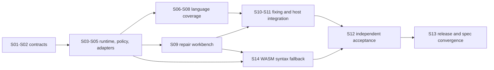

| Stage | Priority and owner role | Exit condition |
| :--- | :--- | :--- |
| Contract baseline | P0; core/CLI maintainers | Findings, completion, configuration and delivery remain distinct across supported protocols |
| Runtime and preparation | P0; runtime/adapter maintainers | Tool/configuration failures give actionable tasks; bounded lifecycle and recovery tested |
| One complete repair path | P0; adapter/workbench maintainers | Real finding → bounded repair → original-tool verification → justified closure and recurrence |
| Practical false-positive loop | P0; rule/policy maintainers | Exact proposals can be reviewed, corrected, expired and revoked with visible effects |
| Language/category expansion | P1; ecosystem adapter maintainers | Each supported slot has configuration, native, negative and feedback evidence |
| Host and platform integration | P1; plugin/release maintainers | Real host conversation and tested platform lifecycle, not just process output |
| Release qualification | P0 before stable release; reviewers | Independent quality corpus, full required checks, reproducible artifacts and compatibility |

Owners are responsibilities, not invented assigned individuals. Dates are not promised; stage exit is evidence-based. The practical priority is to finish a usable end-to-end path and reduce unnecessary repeated preparation, while expanding coverage without claiming incomplete slots as supported.

## 15. Compatibility, operations, and rollback

Protocol files retain explicit versions. New producers must define supported old readers, changed status meanings and migration behavior. Strict exact identities can invalidate prior observations after source/tool changes; preserve history and rescan rather than fabricating compatibility.

The old Python plugin and Rust CLI have separate release responsibilities. Keep old invocation/exit mapping behind a deliberate compatibility boundary; do not replace a host's installed runtime merely because the CLI repository exists.

Operational recovery sequence: inspect structured reason → preserve source and workbench → restore only the broken prerequisite → rerun the original check → sync eligible reports → inspect next action. Before rollback, preserve new-schema files and verify whether the older reader accepts them. No current cleanup command is documented as safe to discard all state.

Source control publishes `main` and `dev`; a branch name is not release acceptance. The macOS arm64 npm package and its LICENSE/NOTICE are published as recorded in section 11. Signed binaries, immutable source/tag binding, CI automation, MSRV/platform matrices and dedicated security reporting still need explicit release decisions and implementation.

## 16. Reproduction and document maintenance

Use the [README build path](../README.md) for a clean checkout. Core developer verification:

```bash
cargo fmt --all --check
cargo clippy --workspace --all-targets --locked -- -D warnings
cargo test --workspace --locked
cargo run --locked -p codeguard-cli --example gen_capability_docs -- --check
```

For documentation-only changes, validate relative links, paired-language command/identifier parity, JSON examples, architecture filenames and representative read-only CLI commands. Do not count documentation checks as a fresh native-tool acceptance run. Native tests require their explicitly documented tools and should not be silently installed.

This document uses the full-stack-doc Rust README, complete architecture/runtime/agent-boundary profiles, and technical-solution/roadmap template. SaaS, mobile UI, RAG/model routing, commercial tiers, message brokers and distributed deployment examples were omitted as inapplicable. Remaining unknowns concern implementation/release choices explicitly listed above, not hidden placeholder values.

---

**Document version:** 1.2.0 · **Created:** 2026-09-28 · **Updated:** 2026-10-04 · **Status:** ready for review; implementation and full acceptance remain incomplete.

Source builds now provide native-first edit feedback through `hook execute` / `hook claude post-tool-use`: only explicit ordinary files are selected; Python uses Ruff and JS/TS uses module-local ESLint 10. Coherent same-byte native results avoid duplicate parsing. Uncovered files may use pinned WASM candidates; mixed scopes retain native results, unwired native scopes and failures. Recovery nodes require native-tool setup/repair and confirmation; complete zero-recovery candidates only recommend native lint, never full acceptance. One deadline bounds at most eight files and two WASM workers; builds without WASM report that gap. The outer feedback is 0.7.0 with local `hook_fast_feedback` 0.2.0. Candidate task synchronization is connected; default plugin Hooks, capability-matched closure and real-host acceptance remain incomplete. See [edit-feedback acceptance](../tests/acceptance/hook-fast-native-wasm.md).

Selected Python discovery observes only source paths and ancestor configuration candidates, without directory enumeration. An unavailable nearest configuration does not silently fall back to a parent. Full filesystem I/O hard deadlines and large-project latency remain unaccepted.

Source edit feedback now imports recovery-bearing pinned WASM candidates into the existing `.codeguard/` workbench. Confirmation identities remain stable per workspace/file/language; Python and JS/TS reuse existing confirmation/preparation identities. Reports bind the grammar, source SHA-256, known limitations and suspected byte positions; imports reject mismatched identities/coordinates and duplicate JSON keys. Task IDs appear only after successful synchronization. Complete zero-recovery observations create no new mandatory task; unlocated incomplete scans create check-recovery tasks. Neither closes existing tasks. Dialogue includes `task show` / `task verify`; missing native confirmation adapters report an explicit capability gap. Outer Hook feedback is 0.7.0, local feedback is 0.2.0, and generic `next` briefs use 0.3.0 while existing checkers retain 0.1.0. Default plugin Hooks, capability-matched closure and actual-host acceptance remain incomplete.

### Current edit-confirmation feedback example

The following fields are extracted from actual CLI output, rather than a complete report. The full protocol is `hook-execution-feedback.schema.json`; this task ID belongs to a temporary acceptance workspace.

```json
{
  "schema_version": "0.2.0",
  "report_type": "hook_fast_feedback",
  "next_action": "require_native_lint_confirmation",
  "syntax_tasks": {
    "failures": [],
    "new_blockers": 1,
    "status": "synced_partial",
    "tasks": [
      {
        "language": "zig",
        "path": "app.zig",
        "task_id": "CG-B-e8b667ce9c1f5d939af37205b976d0a9"
      }
    ]
  }
}
```


### Native verification of a Zig confirmation task

Source builds can now verify a persisted Zig WASM confirmation task with `codeguard task verify TASK_ID . --zig-tool /absolute/path/to/zig --format=json`. The same explicit tool option is accepted by `hook execute` for `repair_ready`, using the existing lease and finished-attempt binding. `lint zig` can run the native tool without building the optional WASM feature; fallback without that feature reports its absence.

The pinned Zig 0.16.0 probe runs `version` and `ast-check --color off` against the exact source bytes under one deadline. A current native diagnostic changes the brief to source repair; missing tools, unsupported versions and execution failures retain environment/decision guidance. Fresh `next` briefs carry the unchanged tool path in their recheck argv. Changes to source or tool bytes invalidate old diagnostic guidance. Reports and attempts are retained under the existing workbench instead of a second task store.

The native observation is `syntax_task_recheck` 0.1.0, wrapped by `task_verification_preview` 0.12.0. Generic repair briefs are 0.3.0; old 0.2.0 briefs and 0.11.0 verification schemas remain available unchanged. Zero native AST diagnostics are `candidate_absent_unverified_policy`: they end the pending local verification step, but do not close the task or certify project lint, build or delivery. Erlang now has the same workbench integration through explicit OTP 28; [Erlang task acceptance](../tests/acceptance/erlang-native-task-verification.md) records its separate protocol versions. Swift also supports explicit Apple Swift 6.4 parse rechecks; see [Swift acceptance](../tests/acceptance/swift-native-task-confirmation.md). Generic confirmation adapters beyond Zig/Erlang/Swift remain absent. See [the acceptance record](../tests/acceptance/syntax-native-task-verification.md).

The following fields come from an actual Zig recheck, not a complete report; the task ID belongs to a temporary acceptance workspace.

```json
{
  "schema_version": "0.12.0",
  "report_type": "task_verification_preview",
  "task_id": "CG-B-eb509056a023765826d547a33df030ed",
  "observation": "still_blocked",
  "event_persisted": true,
  "authority": "local_unverified",
  "delivery_decision": "not_evaluated",
  "native_scan": {
    "report_type": "syntax_task_recheck",
    "input_stable": true,
    "native": {
      "diagnostic_count": 1,
      "diagnostics": [
        {
          "column": 19,
          "line": 1,
          "rule_id": "zig.ast_check.error"
        }
      ],
      "reason": "ast_check_diagnostics",
      "status": "diagnostics_observed",
      "tool_sha256": "71cc3995a7586753ebf82c66dfb8bef43df446517550678781834586a960f8c9",
      "version": "0.16.0"
    }
  }
}
```

Briefs also expose the latest native report reference/digest and current diagnostic positions; stale inputs suppress those positions. Only immutable grammars compiled into the binary reuse validated asset identities within a process; external manifests, source and native tools still require current-byte checks.


### Verified closure and recurrence for one task (source SDK)

The source exposes `verify_zig_task_resolution` for a protected host to verify a **Zig native syntax-confirmation task**. The host independently pins its verification key, workspace, policy revision, code baseline, trusted time and rollback floor, and supplies the hash-bound original counterexample. Project-selected keys, policy candidates and task Markdown cannot provide that authority. The default plugin and public CLI still lack a trusted policy provider; this API is absent from published npm 0.1.3.

Under the existing task lease, the handler runs the same approved Zig 0.16.0 against the original bytes and current file. Both runs share the request deadline, capped by approval expiry. A `code_fixed` event requires original native diagnostics, changed current source with no diagnostics, and matching tool, host artifact, grammar, task and policy identities. A native-clean original becomes a false-positive investigation; environment failure or changing input requires verification. This proves syntax for the specified task, not full lint, types, security or CVE coverage.

Events replay through explicit parent links. Repeating the same verified result preserves its existing event. Ordinary `task verify` can append `reopened` when matching native diagnostics recur on current input, retaining the original fact and repair history and restoring native repair guidance. Missing parents, forks, duplicate identities, absent evidence or changed hashes require reconciliation. The handler also writes the existing native attempt receipt, clears matching `awaiting_verification`, and preserves a borrowed lease.

Sanitized events live in `.codeguard/findings/<id>/events/lifecycle-*.json`; comparison evidence is ignored under `.codeguard/state/resolution_evidence/`. The first `finding.json` is immutable. Local `next/task show/status` have no trusted policy context and cannot elevate historical claims into current closure or delivery approval. All host receipts retain `delivery_decision=not_evaluated`.

Other checker closures, environment/dependency/target/policy dispositions, actual host trust providers, cross-machine evidence recovery and the delivery gate remain open. See [task lifecycle acceptance](../tests/acceptance/task-resolution-lifecycle.md).


Source SDK example: all `host_*` values are independently established by the host, not new CLI flags:

```rust
let receipt = codeguard_cli::verify_zig_task_resolution(
    &codeguard_cli::ZigTaskResolutionRequest {
        root: host_workspace,
        task_id: host_task_id,
        tool: host_zig,
        original_source: host_original_bytes,
        policy_bytes: host_policy_bytes,
        envelope_bytes: host_signed_envelope,
        trust: host_trust_key,
        context: host_approval_context,
        deadline: host_request_deadline,
        borrowed_lease: None,
    },
)?;
```

The following complete receipt comes from a controlled local integration fixture. Its signing key is a test fixture, not proof of a production host approval. Policy, record, evidence and receipt each have a closed schema; stored files do not authenticate their origin.

```json
{
  "authority": "host_context_verified",
  "delivery_decision": "not_evaluated",
  "event_ref": ".codeguard/findings/CG-B-1a46d41b4d912927dd646df9c79dd779/events/lifecycle-event-503da1b5644bac1bbf5d82625e0668d5a26a4aa426fb572402dc5dd3145add6d.json",
  "evidence_ref": ".codeguard/state/resolution_evidence/f79f40ee3ebaf383c3dad1804999cd05ee50bf14a863bc6f6ec33a9d911241e9.json",
  "evidence_sha256": "f79f40ee3ebaf383c3dad1804999cd05ee50bf14a863bc6f6ec33a9d911241e9",
  "identity": {
    "checker_id": "syntax.native_confirmation",
    "scope": "app.zig",
    "task_id": "CG-B-1a46d41b4d912927dd646df9c79dd779",
    "workspace_id": "ws-34904a4fec61187f6fef2a8157ea8617"
  },
  "outcome": "code_fixed",
  "policy_revision": "p1",
  "policy_sha256": "1128cecb4d352cbb412a75c89c6baedece580651b24090b257f57775a841b866",
  "report_type": "task_resolution_receipt",
  "schema_version": "0.1.0",
  "state": "resolved"
}
```

- [Policy 1.0](../schemas/task-resolution-policy-v1.0.schema.json)
- [Lifecycle record 0.1](../schemas/task-lifecycle-record-v0.1.schema.json)
- [Comparison evidence 0.1](../schemas/task-resolution-evidence-v0.1.schema.json)
- [Host receipt 0.1](../schemas/task-resolution-receipt-v0.1.schema.json)


### Current public candidate: 0.1.4

`@partme.ai/codeguard@0.1.4` is published for Apple Silicon macOS from clean source `1cd458f6e01a44a74388243e964e3f45290ac18e`. It includes all 32 runnable, unqualified grammars, bounded edited-file checks, stable native-confirmation tasks, native rechecks and `next` guidance. Registry hashes, a fresh-cache npx invocation, the actual public-package repair loop with Zig 0.16.0, and the source commit's Linux CI passed. Ordinary CLI clean output cannot close a task without trusted policy. The protected Zig SDK is a source integration API; npm does not expose a self-approval command. Plugin activation, installed-host acceptance, full precision, other platforms and complete gates remain open. Earlier 0.1.3 evidence is historical. See [0.1.4 acceptance](../tests/acceptance/npm-0.1.4-candidate.md).


### Erlang native forms observation (current source)

The unified entry `codeguard lint erlang sample.erl --timeout 10s --format=json` gives OTP 28 scanner/parser results priority; `--erl-tool /absolute/path/to/erl` overrides automatic discovery. It uses the original bytes, a fixed non-project cwd, disabled project startup and a cleared environment; it never expands macros or executes compile/parse_transform. Macro/preprocessor coverage stays unknown, and explicit native failures are not replaced by WASM. Without an explicit tool, absolute PATH directories are searched for the first executable erl. Its canonical path, version and bytes are checked; its failure never silently selects a later tool. Only absence of an executable enables the pinned candidate and preparation guidance. Native forms results do not replace full project lint, compilation or tests.

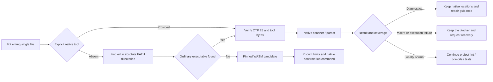

This complete structural example comes from an actual missing-period report with PATH tool selection, with a relative example path and the budget source matching the explicit CLI argument. It validates against the [0.2.0 schema](../schemas/erlang-lint-feedback-v0.2.schema.json); the historical 0.1.0 schema remains unchanged. Public npm 0.1.4 does not yet contain this command.

```json
{
  "authority": "local_unverified",
  "coverage_proven": false,
  "delivery_decision": "not_evaluated",
  "execution_budget": {
    "enforcement": "native_execution_only",
    "source": "cli",
    "timeout_ms": 10000
  },
  "known_limitations": [
    "OTP 28 erlc rejects a missing final function period in `f() -> ok`, but this pinned WASM returns zero recoveries; 12/13 narrow native syntax cases agree. Other Erlang versions, systematic precision, public native-first lint route and release remain unqualified"
  ],
  "language": "erlang",
  "native": {
    "diagnostics": [
      {
        "column": 8,
        "line": 2,
        "rule_id": "erlang.syntax.error"
      }
    ],
    "diagnostics_truncated": false,
    "preprocessing_unresolved": false,
    "reason": "erlang_native_syntax_diagnostics",
    "status": "diagnostics_observed",
    "tool_sha256": "cd03d938d7547ef608076a58a49f5284931b43f39090087baf35efc1665dd5d6",
    "version": "OTP 28"
  },
  "next_action": "核对并修复原生 Erlang 语法诊断，复用 tool_selection.executable 作为 --erl-tool 再检查；还需项目完整 lint、编译和测试",
  "operation": "lint",
  "path": "sample.erl",
  "report_type": "erlang_lint_feedback",
  "schema_version": "0.2.0",
  "scope": "single_file_forms_without_preprocessing",
  "source_sha256": "d66c937c29e3eba8063b468f2744f995cd24cee2399b5f63018935876f5fc9a3",
  "status": "incomplete",
  "syntax_precheck": null,
  "tool_selection": {
    "executable": "/opt/homebrew/Cellar/erlang/28.5/lib/erlang/bin/erl",
    "source": "path"
  }
}
```

The tool hash binds the explicit launcher, not the whole OTP runtime/standard-library supply chain; this result cannot grant trusted task closure. Thirteen native classifications agree with independent erlc labels, and the additional macro/startup cases pass. Version-wide precision, modules, tasks and actual hosts remain open; see [acceptance](../tests/acceptance/erlang-native-first.md).


### Erlang confirmation tasks and native repair guidance (current source)

`codeguard task verify TASK_ID . --erl-tool /absolute/path/to/erl --format=json` and the `repair_ready` event of `hook execute . --erl-tool /absolute/path/to/erl` now reuse the existing `.codeguard/` task, lease, finished attempt and shared deadline. They call the same OTP 28 forms parser as `lint erlang`. Task language and tool options are checked before acquiring a lease or launching a tool; project source, macro expansion and parse transforms are not executed.

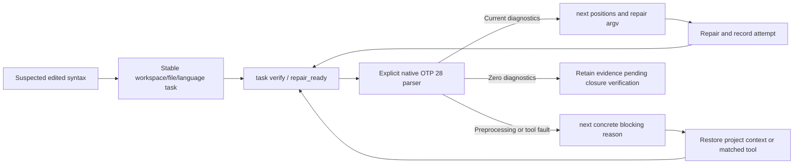

Erlang observations use `syntax_task_recheck` 0.2.0, verification feedback 0.13.0 and post-verification `next` briefs 0.4.0. Zig and historical schemas remain unchanged. `native_confirmation_reason` identifies missing tools or preprocessing gaps; guidance names OTP 28 preparation or project-native preprocessing/compilation. Source changes invalidate diagnostic guidance; changed tools lose their stored argv. Only a byte-current tool already observed as OTP 28 can be reused as ready.

Zero diagnostics remain `candidate_absent_unverified_policy`: they consume the linked pending verification, but cannot close the task or approve delivery. Two no-progress attempts use the existing decision budget. The protected closure API now includes a task-scoped Erlang source SDK; full Erlang project lint/preprocessing, native-finding lifecycle, automatic tool discovery and installed-host releases remain open. Public npm 0.1.4 does not include this extension. [Acceptance and protocols](../tests/acceptance/erlang-native-task-verification.md).


### Actual complete Erlang repair_ready feedback

This JSON was captured from an OTP 28 native recheck. Task/run IDs and report references belong to a temporary acceptance workspace, not the reader’s project. It exposes native positions, Unicode column units and a persisted report reference instead of only reporting “still blocked”. The Hook is 0.8.0 with a 0.2.0 local summary; installed-host conversation acceptance remains open.

```json
{
  "delivery_decision": "not_evaluated",
  "execution": "task_verification",
  "host_blocking_verified": false,
  "local_feedback": {
    "authority": "local_unverified",
    "checker_id": "syntax.native_confirmation",
    "delivery_decision": "not_evaluated",
    "event_persisted": true,
    "native_column_unit": "unicode_scalar",
    "native_confirmation_reason": "erlang_native_syntax_diagnostics",
    "native_confirmation_ref": {
      "report_ref": ".codeguard/reports/syntax-native-88734-1791066158885814000.json",
      "report_sha256": "f529b3d472381a5d7cdf2d655d1d18a0000264d1e71ecb45856c17a01fd9ec45",
      "run_id": "syntax-native-88734-1791066158885814000"
    },
    "native_confirmation_status": "diagnostics_observed",
    "native_diagnostic_positions": [
      {
        "column": 4,
        "line": 2,
        "rule_id": "erlang.syntax.error"
      }
    ],
    "observation": "still_blocked",
    "reason": null,
    "report_type": "hook_task_verification_summary",
    "scan_report_available": true,
    "schema_version": "0.2.0",
    "task_id": "CG-B-b2b940bb04fde9437c1c303ca785c1ca"
  },
  "plan": {
    "action": "verify_task",
    "host_blocking_claimed": false,
    "may_claim_delivery": false,
    "requires_git_snapshot": false,
    "scope_resolution_reason": null,
    "soft_result_reuse_candidate": false,
    "target_paths": [],
    "task_id": "CG-B-b2b940bb04fde9437c1c303ca785c1ca"
  },
  "reason": null,
  "report_type": "hook_execution_feedback",
  "schema_version": "0.8.0",
  "soft_result_reused": false
}
```

### Aggregate Erlang native-first checking (current source)

```bash
codeguard check all . --format=json
codeguard check all . --erl-tool /absolute/path/to/erl --timeout 30s --jobs 2 --format=json
```

The `erlang.lint` task selects explicit Erlang or the first executable `erl` from absolute PATH directories, then uses the existing controlled OTP 28 scanner/parser. It observes at most 64 ordinary UTF-8 files, each at most 1 MiB, under the request deadline and scheduler concurrency. `native_results.erlang_lint` carries current source hashes, positions, tool selection, per-file next actions and original-tool recheck argv with an absolute source path, reusable outside the project directory. Files beyond the native budget are counted as unobserved.

Only complete, non-preprocessed forms observations for matching source and tool bytes skip duplicate WASM. Missing tools retain candidate observations; selected-tool failures stay visible alongside any supplementary candidate observation. Macro/preprocessor coverage remains unresolved. Source or tool changes withdraw affected positions and reusable argv. Project-scope changes set `scope_stable: false` and retain still-current single-file diagnostics; whole-scope completeness is withdrawn. SIGINT remains exit 130; JSON, human and conservative SARIF retain native findings without claiming project success.

Initialized workspaces now persist native-first observations directly, without a preceding WASM error: current `check_feedback` **0.38.0** embeds scan **0.2.0** with actual per-file `task_id` or `task_sync_reason`. `lint erlang FILE` binds the nearest existing workbench and emits **0.3.0**. Repeated scans and historical WASM evidence reuse one task; missing tools and preprocessing produce environment tasks. Unbound aggregate checks also use 0.38.0 and historical protocols remain available; `check_aborted` remains **0.13.0**, and prior schema bytes are unchanged. Default-host trusted closure and complete project checks remain open; the source SDK extension is described below. Public npm 0.1.4 does not contain this batch. See [native repair workflow](Codeguard-Native-Repair-Workflow.md) and [acceptance](../tests/acceptance/erlang-native-first-workbench.md).

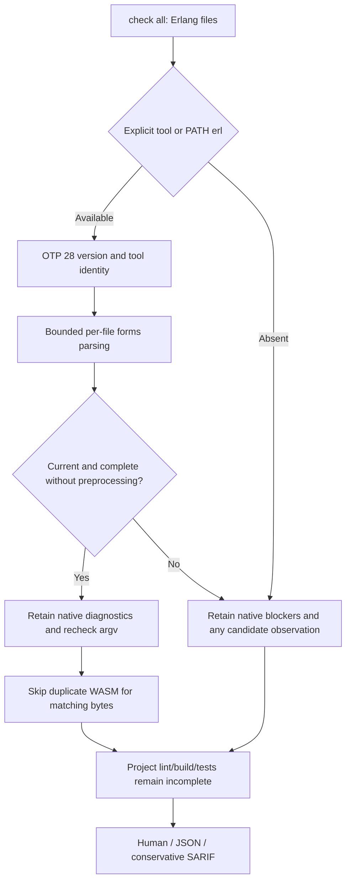

This is a complete embedded `erlang_forms_scan` example captured from actual OTP 28 execution, not a complete aggregate report. Per-file task references were saved and synchronized; the root task_id remains null because a batch can contain multiple tasks. The tool hash identifies the selected launcher, not the entire OTP runtime supply chain.

```json
{
  "authority": "local_unverified",
  "coverage_proven": false,
  "delivery_decision": "not_evaluated",
  "files": [
    {
      "current": true,
      "findings": [
        {
          "column": 4,
          "line": 2,
          "rule_id": "erlang.syntax.error"
        }
      ],
      "native": {
        "diagnostics": [
          {
            "column": 4,
            "line": 2,
            "rule_id": "erlang.syntax.error"
          }
        ],
        "diagnostics_truncated": false,
        "preprocessing_unresolved": false,
        "reason": "erlang_native_syntax_diagnostics",
        "status": "diagnostics_observed",
        "tool_sha256": "cd03d938d7547ef608076a58a49f5284931b43f39090087baf35efc1665dd5d6",
        "version": "OTP 28"
      },
      "next_action": "按当前原生语法位置修复并执行 recheck_argv；仍需项目完整 lint、预处理、编译和测试",
      "path": "app.erl",
      "recheck_argv": [
        "codeguard",
        "lint",
        "erlang",
        "/private/var/folders/_s/9_xnnkz141920t1yv5zhvd1r0000gn/T/cg-native-work-evidence-sriqn9fb/project/app.erl",
        "--erl-tool",
        "/opt/homebrew/Cellar/erlang/28.5/lib/erlang/bin/erl",
        "--format=json"
      ],
      "source_sha256": "22b202c1303137676dc8dbf46be3c26771f4faa453a223f1b607aecd2087c9e0",
      "task_id": "CG-B-8a1ca1e0c61f9964d131d876588ba6d9",
      "task_sync_reason": null
    }
  ],
  "local_forms_complete": true,
  "reason": "erlang_forms_observed_unverified_project_coverage",
  "report_type": "erlang_forms_scan",
  "schema_version": "0.2.0",
  "scope": "single_file_forms_without_preprocessing",
  "scope_stable": true,
  "source_file_count": 1,
  "task_id": null,
  "task_status": "synced_partial",
  "tool_selection": {
    "executable": "/opt/homebrew/Cellar/erlang/28.5/lib/erlang/bin/erl",
    "source": "explicit"
  },
  "unobserved_count": 0
}
```

### All-grammar replay protocol (2026-10-04)

The development-only `grammar_regression` / `grammar_regression_evaluation` protocols support legacy 0.1 and explicit-cohort 0.2. Duplicate keys, missing languages, cohort/version conflicts and changed hashes are rejected before execution. The 358-case corpus uses a Rust importer preserving 150 Dart source/expectation cases while rejecting empty trees and missing separators that swallow cases. Reports retain 32 languages and 35 source cohorts, selected valid/invalid labels, sample-level TP/FP/FN/TN, Wilson intervals, unknowns and cold-worker timings. Mixed-source summaries use `metric_aggregation=not_pooled` with null precision/recall. Pending labels stay outside metrics; qualified count stays zero and delivery unevaluated. Legacy schemas/reports remain intact. See [evaluation technical guide](Codeguard-Grammar-Evaluation.md).

## Bound P3C file feedback protocol

`java_p3c_file_feedback` 0.1 wraps existing project observation 0.2 and actual workbench/next results. Its [schema](../schemas/java-p3c-file-feedback-0.1.schema.json) restricts source selection, native authority and failure/task combinations; explicit `--checker p3c` preserves native blockers rather than silently selecting WASM. Unbound native feedback 0.2 remains compatible. See [acceptance](../tests/acceptance/java-p3c-file-workbench.md); controlled protocol tests do not prove actual rule precision.

Project observation 0.2 preserves nonempty validated diagnostics when local status is `incomplete` and reason is `native_execution_failed`. The source/rule/location projection undergoes the same current-byte and configuration checks as successful diagnostic reports. Sync imports both the source finding and execution blocker; `observed_file_count` stays unchanged. A matching positive recheck is `still_present`; partial zero results are `incomplete`, and blocker verification remains `still_blocked`. Legacy 0.2 reports without flat projections retain their blocker-only interpretation. No schema fields or approval semantics change. See [acceptance](../tests/acceptance/java-p3c-partial-execution.md).


### Erlang task resolution and recurrence (current source SDK)

`verify_erlang_task_resolution` reuses Zig's signed-policy verification, shared deadline, lease, attempt handoff and append-only parent chain. The protected host independently fixes the trust root, workspace, policy revision, baseline and trusted clock; project files cannot grant approval. OTP 28 scans/parses the original counterexample and current bytes separately. Only an original native diagnostic, changed source and a complete clean current result can record `code_fixed`. Macros/includes, empty forms, truncation and execution failures require verification; an originally valid sample requires false-positive investigation.

Both WASM-first and native-first tasks are supported. Erlang policy 1.1.0/evidence 0.2.0 stay separate from Zig 1.0.0/0.1.0. Native-first evidence requires `grammar_sha256=null` and the original tool identity. The internal rule identity uses the actual approved policy-byte digest instead of inventing a grammar digest. History checks bind the language, source and grammar to the first report; rehashing local files cannot switch languages. Ordinary `task verify --erl-tool` can append recurrence with the matching tool, but cannot close a task without trusted policy.

This remains a source SDK without the default plugin's trusted policy provider. Public npm 0.1.4 lacks this extension; syntax receipts do not certify complete lint, security or project delivery. The tool digest binds the launcher; the host must independently protect the OTP environment. See [Erlang lifecycle acceptance](../tests/acceptance/erlang-task-resolution-lifecycle.md) for the execution path and actual results.

### Cargo input and proxy boundaries (current source)

Normal Clippy scans and same-rule `--force-warn` comparisons use `cargo clippy --locked --offline --all-targets --message-format=json`. A missing root Cargo.lock returns `cargo_lock_unavailable` before native startup and does not create a lock. Source fingerprints come from a bounded pre-run snapshot. Changes to observed sources, the manifest, lock, root Clippy/Cargo/toolchain configuration or selected tool withdraw the current Clippy findings and retain preparation/recheck work. Valid partial diagnostics under stable inputs remain visible without claiming a complete report.

For Cargo proxies such as rustup that dispatch by entry-point name, Clippy, rustdoc and build checks execute the selected Cargo path while validating the resolved bytes and post-run target identity. A separate sequence prevents private Clippy directories from colliding at identical timestamps. This protects observed inputs only; it does not prove the complete effective Cargo model, every build combination or a process sandbox. Local zero diagnostics still cannot close tasks automatically. Tests, failures and actual output are in the [Cargo input acceptance record](../tests/acceptance/rust-clippy-input-stability.md). Public npm 0.1.4 does not include this batch.


After native aggregation, current source uses non-cached Clippy `compiler-artifact` records, the original root-manifest identity and pre-run source hashes to avoid duplicate WASM for byte-matching Rust target entry points. Coverage stays in the current process and cannot be restored from editable reports. Failures, changed inputs/tools, duplicate JSON keys or events after the finish record grant no coverage. `all-targets` does not establish that the entire directory was parsed: unproven modules and conditionally excluded files retain prechecks. Native warnings, stable tasks and complete delivery obligations remain. Diagnostics repeated across library/test targets at the same file/rule/line/column project one finding, preferring error over warning; distinct positions remain separate and historical duplicate tasks are not automatically closed. See [Rust native-first acceptance](../tests/acceptance/check-all-native-preferred-rust.md). Public npm 0.1.4 does not include this batch.


Clippy input protection also compares Rust source, Cargo manifest and lock-file membership under the same bounded static discovery policy. The snapshot binds all observed Rust files and nested manifests/locks. Added, removed, renamed or unreadable inputs invalidate the observation, current findings and native coverage. Managed workbench records follow existing discovery exclusions. External dependencies, dynamic targets and the complete configuration closure remain unproven.

### Existing Cargo discovery (current source)

`check all`, `comments rust`, `build rust` and their Cargo task rechecks accept an optional `--cargo-tool`. Without it, they select the first regular executable `cargo` in an absolute invoking-PATH directory. Empty/relative directories and non-executable entries are skipped. An explicit invalid tool or selected native failure remains a concrete blocker; it never triggers a search for another Cargo. Aggregate Rust checks share the selected entry.

The final `cargo` entry name is retained for rustup proxy dispatch; resolved bytes and target identity still undergo the existing checks. The child inherits `RUSTUP_TOOLCHAIN` and always receives `RUSTUP_AUTO_INSTALL=0`, even if the caller set it to `1`. Cargo `--locked --offline` alone does not prevent rustup from installing a missing toolchain; [rustup documents the separate control](https://rust-lang.github.io/rustup/environment-variables.html). A missing toolchain stays an environment failure, without a source violation or automatic installation. This does not qualify the entire toolchain, effective Cargo configuration, complete project coverage or trusted task closure.

Controlled proxy/no-fallback cases and actual installed/missing-toolchain observations are recorded in [Cargo discovery acceptance](../tests/acceptance/cargo-native-discovery.md). Public npm 0.1.4 does not include this source change.


### Project-root Ruff discovery (current source)

For a configured Python scan, `lint python`, `check all`, selected-edit Hook execution and same-root task rechecks select an explicit `--ruff-tool` first, then the checked root's `.venv/bin/ruff`, then an executable in an absolute invoking-PATH directory. They do not activate a shell environment, enumerate installed packages or install Ruff. A root-local entry is version-probed and byte-bound through the existing native scan. Missing local directories/entry permit PATH discovery; linked/non-directory parents, broken or non-executable entries produce `ruff_local_tool_invalid` instead of silently switching to global Ruff. A chosen tool's version/execution failure never tries a different tool.

An invalid local environment projects one stable preparation task with `.venv/bin/ruff` evidence, bounded environment repair, original Codeguard recheck, history and closure conditions. No applicable Ruff configuration means no tool startup. Ordinary local parents may contain an executable symlink: the resolved tool bytes are fixed and rechecked. Local success and repaired-source zero diagnostics still do not approve policy or close tasks automatically. This selection concerns the explicitly checked root; per-module virtual environments, uv/Poetry/Conda resolution, real host integration and complete coverage remain separate work. See [root-local Ruff acceptance](../tests/acceptance/ruff-local-discovery.md). Public npm 0.1.4 does not include this source change.


### Recovery tasks for unlocated syntax observations (current source)

`check all/java` and confirmed-write Hooks share syntax-task synchronization. Visible recovery nodes require native confirmation. A tree error with an incomplete recovery scan and no locatable nodes creates a check-capability recovery task: it retains an empty recovery array and `syntax_recovery_incomplete`, without a confirmed source violation or invented edit position. Complete zero-recovery observations recommend native checking without creating this task.

The workspace/file/language identity remains stable across repeat checks, Hooks and later visible recoveries. `next` and task Markdown require restoring the checker, language version or grammar; source edits are forbidden before native confirmation. `task verify` records a missing native adapter while retaining the open task. Zero recoveries, installation and checkbox edits cannot close existing tasks. Persistence failures retain observations and per-file reasons without fabricated task IDs.

Aggregate feedback uses `check_feedback` 0.38.0 with `syntax_tasks`; unlocated local confirmation reports use 0.3.0. Existing located 0.1.0 and native-first Erlang 0.2.0 reports and their schemas remain unchanged. Claude Hook command replay distinguishes recovery-node counts from incomplete recovery scans; actual-host and full-language acceptance remain open. Public npm 0.1.4 does not contain this batch. See [acceptance and actual reports](../tests/acceptance/unlocated-syntax-recovery-tasks.md).


Feedback-field excerpt (a structural example, not a complete report; see the acceptance artifact for full actual reports):

```json
{
  "schema_version": "0.38.0",
  "report_type": "check_feedback",
  "command_status": "incomplete",
  "exit_code": 3,
  "delivery_decision": "incomplete",
  "syntax_candidates": {
    "observations": [{
      "path": "bad.swift",
      "language": "swift",
      "status": "candidate_observed",
      "reason": "syntax_recovery_incomplete",
      "grammar_qualified": false,
      "recovery_count": 0,
      "recoveries": []
    }]
  },
  "syntax_tasks": {
    "status": "synced_partial",
    "new_blockers": 1,
    "tasks": [{
      "task_id": "CG-B-0123456789abcdef0123456789abcdef",
      "path": "bad.swift",
      "language": "swift"
    }],
    "failures": []
  }
}
```

The example task ID shows its format only; actual identity is derived from the workspace, path and language. Empty recoveries do not imply success, and a local task record is not a trusted delivery decision.


### Automatic native Erlang discovery for task rechecks (current source)

`codeguard task verify "$TASK_ID" . --format=json` (with `TASK_ID` set to the actual `task_id` returned by `next`) reuses lint/check selection for existing Erlang syntax tasks: explicit `--erl-tool` takes priority; otherwise the first executable erl in an absolute invoking-PATH directory is fixed. Rechecks verify OTP 28, current source and tool bytes while retaining leases, budgets, events and existing report versions. Both candidate-origin and native-first tasks can be rechecked; repair-ready Hooks use the same entry.

Only an absent tool produces `erlang_tool_not_found_on_path`; empty/relative PATH entries and non-executable files are ignored. An invalid explicit tool, unsupported selected version or execution failure never selects a later tool or installs one. After a valid observation, `next` supplies explicit recheck argv for the actual tool so later PATH changes cannot replace that entry. Local zero diagnostics still do not close tasks automatically; preprocessing, trusted policy and complete project capability remain separate obligations. See [recheck discovery acceptance](../tests/acceptance/erlang-recheck-discovery.md). Public npm 0.1.4 does not contain this batch.

### Native confirmation of unlocated Swift observations (current source)

An existing Swift confirmation task now accepts `codeguard task verify "$TASK_ID" . --swift-tool /absolute/path/to/swiftc --format=json`, where `TASK_ID` comes from actual `next` output. `hook execute` accepts the same option for `repair_ready`. The caller supplies an installed Apple Swift 6.4 compiler; this path does not install tools or execute editable paths from historical reports. Missing tools receive an existing-compiler recovery action; unsupported versions and execution failures retain the task.

Rust reads and rechecks bounded source bytes, then runs `swiftc -frontend -parse -diagnostic-style llvm -no-color-diagnostics -` with frozen stdin, `/` as cwd, a cleared environment and the shared deadline. Only native error rules and positions enter agent guidance; raw diagnostic text is not treated as an instruction. Columns are UTF-8 bytes and must fall on character boundaries. Unknown output, exit/diagnostic contradictions, timeout, invalid positions and tool changes remain incomplete. The tool digest binds the launcher, not the entire Swift installation.

Native errors make the same task actionable for source repair. Source or tool changes withdraw old positions. A clean parse records `candidate_absent_unverified_policy` without automatically closing the task or satisfying project lint, type checking, macro/conditional-compilation context, build, security or delivery obligations. Existing no-progress budgets still apply. Swift grammar qualification and the 32-language precision conclusions are unchanged; public npm 0.1.4 does not contain this extension.

New protocols are `syntax_task_recheck` 0.4.0, `task_verification_preview` 0.15.0, `repair_brief_preview` 0.6.0 and Hook feedback 0.9.0 (task summary 0.3.0). Aggregate `check` uses 0.39.0 when `next` contains a native Swift brief; other paths retain 0.38.0. Historical schemas remain unchanged. See [Swift native-confirmation acceptance](../tests/acceptance/swift-native-task-confirmation.md) for actual reports and limits.


### Actual Claude lifecycle acceptance and fresh-task guidance

Claude Code 2.1.273 now has actual session-local plugin-source evidence for confirmed saves, repeated saves, an execution-time filesystem write failure, native Zig 0.16.0 rechecks before/after repair, stable task identity and one Stop continuation followed by a reentry guard. The locked public runtime remains 0.1.4, independently of current development source. Native diagnostics changed from one to zero; the task stayed open and delivery remained not evaluated. Edit argument validation failed before execution and produced no failure Hook in this host; the separate EACCES write exercised PostToolUseFailure. This is not marketplace installation, trusted closure, complete native-first coverage or multi-host acceptance. See [actual host evidence](../tests/acceptance/claude-host-prepared-runtime.md).

The actual session exposed incorrect first-task guidance claiming the Zig adapter was unavailable although its native recheck worked. Development `next` / `task show` now distinguish implemented Zig 0.16.0, OTP 28 and Apple Swift 6.4 adapters from unverified local tool readiness, using the bound original report and explicit tool arguments. Read-only guidance does not execute or install a checker, trust executable paths in editable task records, authorize source repair before native confirmation, or close a task. Unsupported languages retain a concrete capability decision; existing native history keeps precedence. This correction is not in the locked public 0.1.4.

Fresh native-confirmation guidance uses `repair-brief-preview` 0.7.0 to bind the language, supported tool version, tool-selection option, and `tool_readiness: not_evaluated`. Aggregate checks use `check-feedback` 0.40.0; `task show` preserves the same recheck arguments in its outer action. The agent must replace the placeholder with a verified installed tool path. Preparation does not establish readiness or native execution. Historical schema definitions remain unchanged.

### Native-first Kotlin single-file checking (development source)

`codeguard lint kotlin FILE.kt [--kotlinc-tool ABS_PATH] [--timeout 30s] --format=json` selects an explicit tool first, otherwise the first `kotlinc` in absolute invoking PATH entries. The current adapter supports Kotlin/JVM 2.4.10. Only an absent tool uses bundled WASM; a selected native failure remains visible. Frozen ordinary `.kt` files are compiled privately, without `.kts`, project build scripts or compiler plugins.

Only `[SYNTAX]` becomes `kotlin.syntax`; other diagnostics retain project-context limitations. Verified UTF-16 columns are also mapped to UTF-8 byte columns. Unknown output, redirected launchers, changed input and interrupted budgets cannot produce success. Missing backends or incomplete native checks require further native confirmation; an observable, complete zero-recovery WASM scan recommends native installation without granting project approval. The feedback schema is `kotlin-lint-feedback` 0.1.0.

Existing stable tasks now support task verify and repair_ready; aggregate feedback projects their current guidance. Initial check/file_changed now selects Kotlin native compilation first and synchronizes stable tasks. Complete Kotlin lint/comments, compiler JAR/JDK identity, version coverage and release acceptance remain open. Public npm 0.1.4 excludes this increment. See [single-file acceptance](../tests/acceptance/kotlin-native-single-file.md).

### Kotlin stable-task rechecks and agent feedback (development source)

Existing Kotlin WASM confirmation tasks support `codeguard task verify TASK_ID . --kotlinc-tool ABS_PATH --format=json`; omission reuses the standalone PATH selection. `repair_ready` through `hook execute --kotlinc-tool ABS_PATH` retains the task, lease and attempt history. `next` and `task show` derive tool guidance from bound facts rather than executing editable task Markdown.

Mixed native syntax and project-context diagnostics retain current syntax positions for repair while exposing unresolved context. Source or tool changes withdraw old positions. Native zero diagnostics advances to policy/coverage verification without repeated editing or installation. Rechecks do not automatically close tasks; Kotlin trusted closure remains unwired. Aggregate check feedback carries the current brief; initial check/file_changed now invokes the Kotlin native adapter for ordinary .kt files.

Protocols are syntax recheck0.5.0, task preview0.16.0, historical brief0.8.0, initial preparation brief0.9.0, Hook feedback0.10.0 and aggregate feedback0.41.0. Previous schema bytes remain unchanged. See [Kotlin task-recheck acceptance](../tests/acceptance/kotlin-native-task-confirmation.md).

### Kotlin first native observation (development source)

`check all . --kotlinc-tool ABS_PATH` and confirmed `file_changed` accept the same explicit tool; omission discovers invoking PATH. A selected native failure stays visible and does not switch to WASM. Only an absent compiler uses the existing candidate fallback. At most 64 ordinary `.kt` files share the request deadline; `.kts` is not compiled by this path. Repeated observations update one stable task, and native zero diagnostics does not automatically close it.

New reports use aggregate0.42.0, file-changed Hook0.11.0, scan0.1/0.2, native origin0.4.0, native-origin recheck0.6.0/task preview0.17.0 and first-native brief0.10.0. Existing WASM-origin rechecks retain their previous protocols. See [first-native acceptance](../tests/acceptance/kotlin-native-first.md). Full project lint, compiler/JDK identity, trusted closure and public release remain open.

When the bound first report contains incomplete, unlocated recovery, later missing-tool or stale native history preserves the limitation in `next` / `task show`: do not edit source before native confirmation, and follow the concrete environment recovery steps. Current native syntax diagnostics remain actionable; current zero diagnostics still require policy and coverage verification. See [native-history guidance regression](../tests/acceptance/unlocated-native-history-guidance.md).

### Native-first Swift single-file feedback (development source)

`codeguard lint swift FILE.swift [--swift-tool ABS_PATH] [--timeout 30s] --format=json` selects an explicit compiler first, otherwise the first executable `swiftc` in absolute invoking PATH entries. The current adapter supports Apple Swift 6.4 frontend parsing of frozen stdin. Only tool absence enables the bundled WASM candidate; a selected compiler's failure stays visible. Verified positions use UTF-8 byte columns. Source changes or entry redirection withdraw diagnostics, and timeout/cancellation remain incomplete/cancelled rather than source violations.

The `swift-lint-feedback`0.1.0 report distinguishes a required native confirmation for incomplete or hidden recovery from a recommendation after complete zero recovery. It never grants full lint or delivery approval: SwiftLint, comments, type checking, dependencies/security and project builds remain obligations. Compiler identity covers the selected entry, not the entire toolchain. Project-wide Swift native observation is now connected as described below; full language/release qualification remains open; initialized-workspace task connection is described below. Public npm0.1.4 excludes this increment. See [single-file acceptance](../tests/acceptance/swift-native-single-file.md).

### Swift project native observation (development source)

`check all . [--swift-tool ABS_PATH] --format=json` parses at most 64 ordinary Swift files under one shared deadline and reports unobserved files. Selected native failure never changes into a WASM result; only tool absence keeps candidate fallback. `check-feedback`0.43.0 / `swift-parse-scan`0.1.0 preserve current byte locations, selection and recheck argv. Source/tool changes withdraw positions; zero diagnostics do not prove SwiftLint, types or builds. This historical protocol describes an uninitialized workspace with `not_connected` task references; initialized-workspace task connection is described below. See [project observation acceptance](../tests/acceptance/swift-native-project.md).

Confirmed saves through `hook execute . --swift-tool ABS_PATH` reuse the Swift scanner for selected paths only. Missing tools keep candidates; selected failures do not switch. `hook-execution-feedback`0.12.0 / `hook_fast_feedback`0.4.0 expose current native positions and the unconnected task state. The CLI Claude adapter emits bounded counts/byte positions without tool diagnostic text; mixed candidate errors still require native confirmation. Actual installed-host acceptance, stable native tasks and the full repair loop remain open. See [save feedback acceptance](../tests/acceptance/swift-native-hook.md).

### Swift native-first repair workbench (development source)

In an initialized `.codeguard/` workspace, `check all` and a confirmed successful-save `hook execute file_changed` synchronize Swift native syntax findings or environment blockers into stable tasks. Repeated observations reuse the same task. `next` and `task show` expose evidence, rule basis, allowed scope, repair steps, recheck commands, history and closure conditions. An uninitialized workspace reports a disconnected workbench; synchronization failures remain blockers. Standalone `lint swift` does not create tasks yet.

`codeguard task verify TASK_ID . [--swift-tool ABS_PATH] --format=json` selects an explicit tool or discovers one in the invoking PATH for native-first tasks. Existing WASM-origin tasks retain their explicit-tool contract; editable historical paths are not executed. Diagnostics request source repair. Zero diagnostics records `candidate_absent_unverified_policy`; the same task stays open pending full lint, type, build and delivery checks.

Native-first protocols use observation 0.5, scan 0.2, check 0.44, initial brief 0.11, save Hook fast 0.5 / outer 0.13, and recheck inner 0.7 / outer 0.18. Existing verification briefs retain 0.6, and historical schemas remain unchanged. Actual Apple Swift 6.4 executions verified stable task references across repeated scans, saves and rechecks before and after repair. This is not installed-host or trusted-closure acceptance and is excluded from public npm 0.1.4.

### Recover missing task projections

`codeguard work sync . --format=json` now restores missing Markdown for committed facts under the workspace sync lock, imports new reports, and rechecks missing projections. Recovery reads structured facts, the current RepairBrief, original report hashes and consumption markers. It does not run checkers. Existing regular task files, including notes and checkmarks, retain their exact bytes. Symlinks, directory conflicts, invalid facts, changed origin hashes and uncommitted origins remain incomplete. Recovery examines at most 1,000 facts.

The readable task contains evidence, rule basis, allowed scope, steps, recheck argv, history and closure conditions. Local absolute paths in recheck arguments become verification placeholders; use `task show` for current instructions. Recovery never closes findings, changes original facts/events/consumption markers or attempt history, or grants delivery approval. Reports use `work_sync_preview` 0.3.0 with a positive `restored_task_projections` count only when recovery occurs; other runs retain 0.2.0.

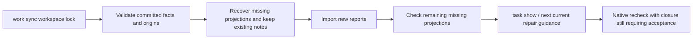

Actual recovery feedback (local synchronization, without delivery approval):

```json
{
  "already_consumed_reports": 1,
  "command_status": "partial",
  "delivery_decision": "not_evaluated",
  "failed_reports": 0,
  "historical_findings": 0,
  "imported_reports": 0,
  "new_blockers": 0,
  "new_findings": 0,
  "next_actions": [
    "inspect_findings_and_tasks",
    "implement_native_reverification_and_full_gate"
  ],
  "operation": "work_sync",
  "report_type": "work_sync_preview",
  "restored_task_projections": 1,
  "schema_version": "0.3.0",
  "workspace_id": "ws-f734e620fead976b3bb5826be2fb3341"
}
```


## Next steps for independent source findings

When the first source finding is waiting for its owner or has exhausted its retry budget, and no prerequisite blocker exists, next can select another actionable or verification-required finding on a proven independent physical source. next_actions and human output retain read-only task show references for deferred findings. Their facts, budgets, leases and gate effects remain unchanged. Overlapping targets, aliases, unknown scope, invalid facts and failed reports retain conservative handling. The complete module dependency graph remains incomplete; non-Unix keeps the original selection. See the [actual acceptance evidence and full report example](../tests/acceptance/next-independent-source-work.md).

### Scoped Swift syntax task lifecycle (development source)

A protected host can call `verify_swift_task_resolution` to compare the original counterexample and current source with Apple Swift 6.4. Policy 1.2.0 and evidence 0.3.0 remain separate from Zig/Erlang protocols; native-first tasks retain a null grammar identity. An original parse diagnostic, changed source, and a complete clean recheck with the same tool permit a scoped `code_fixed` event. Repeated verification is idempotent; an ordinary `task verify --swift-tool` recheck reopens the same parent chain on recurrence. A valid original sample requires false-positive review; tool failures or identity changes cannot close the task. The host supplies independent trust and signatures. Default plugin integration and public distribution remain incomplete, as do SwiftLint, type checking, project builds, and full delivery acceptance. See [lifecycle acceptance](../tests/acceptance/swift-task-resolution-lifecycle.md).

### Scoped Kotlin resolution and context blockers (development source)

`verify_kotlin_task_resolution` reuses the host SDK with kotlinc-jvm 2.4.10. Policy 1.3.0 and evidence 0.4.0 are language-specific; native-first tasks keep a null grammar identity. The original diagnostic must have coherent UTF-16 and UTF-8 coordinates. Changed source and a complete clean recheck permit a scoped `code_fixed` event. Context-only errors remain pending verification. Mixed syntax and context errors retain the known finding and allow ordinary `task verify --kotlinc-tool` recurrence to reopen the same parent chain even when completion is incomplete. The host supplies independent trust. Tool identity currently covers the launcher, with full JAR/JDK/project identity, default plugin closure, lint/type coverage, and publication still pending. See [acceptance](../tests/acceptance/kotlin-task-resolution-lifecycle.md).


Development-source Zig native routing (2026-10-05): `check all`, `check zig` and selected-file editing now reuse the frozen Zig 0.16.0 AST probe. Explicit/PATH selection runs native first; selected-tool failures retain an incomplete observation without switching to WASM. Missing tools retain candidate fallback. Source or tool-entry changes withdraw old positions; at most 64 files are observed under the shared deadline, with remaining scope visible. Check feedback 0.46, aborted feedback 0.15 and Hook feedback 0.14 are separate protocols; reports without Zig keep previous versions. Claude feedback includes bounded native rule IDs, positions and the original recheck instruction. First-native Zig task creation is now connected as described below: native reports expose only actually synchronized task IDs, and clean AST observations do not close historical tasks or prove complete lint/build. Public npm 0.1.4 and the plugin lock are unchanged.

### Native-first Zig tasks (development source)

In initialized workspaces, `check zig`, `check all`, `lint zig` and edit Hooks synchronize one stable task per workspace/source scope. A newly clean file creates no repair task. Clean rechecks of existing tasks record `candidate_absent_unverified_policy` and retain the open task. `next` and `task show` expose bounded native positions and original-tool arguments; `task verify TASK_ID . [--zig-tool ABS_PATH] --format=json` and repair_ready record native rechecks. Native-first grammar identity is null; native diagnostics must not request grammar edits.

New protocols: observation 0.6, bound scan 0.2, aggregate 0.47, single-file 0.3, brief 0.12, task-show 0.2, recheck inner 0.8/outer 0.19, edit Hook 0.16 and recheck Hook 0.15. Historical schemas remain unchanged. Actual Zig 0.16.0 validated broken and repaired inputs. Trusted SDK closure for native-first Zig tasks is described below. Default installed-host integration, full lint/build and distribution remain incomplete. Public npm 0.1.4 is unchanged. See [acceptance](../tests/acceptance/zig-native-first-workbench.md).

### Trusted native-first Zig resolution (development SDK)

A protected host can call `verify_zig_task_resolution` with independently signed policy 1.4.0 for native-first observation 0.6.0. Grammar must be null; legacy WASM-origin policy 1.0.0 retains its scope. An original same-tool diagnostic, changed source and a complete clean same-tool recheck permit scoped `code_fixed` with evidence 0.5.0. Repeated verification is idempotent; ordinary `task verify --zig-tool` positive recurrence reopens the same parent chain. Valid original samples require false-positive review. Unexpected output, invalid positions, changed tools or missing trusted context cannot close the task. The host independently supplies trust. Default plugin/public npm integration of that provider remains incomplete; local task records do not authorize delivery. See [acceptance](../tests/acceptance/zig-native-first-resolution.md).

## Explicit native differential development replay

The Rust `evaluate_native_grammars` example selects samples for explicitly supplied Zig0.16.0, OTP28, Apple Swift6.4 and kotlinc-jvm2.4.10 from the same frozen 32-language corpus. It reuses native adapters and the existing WASM worker. All 32 languages remain in inventory; unselected tools, missing adapters, incomplete native observations and hidden WASM recovery stay unresolved. TP/FP/FN/TN include only jointly decidable syntax samples. Located Kotlin syntax diagnostics survive mixed context blockers while execution remains incomplete. Changed tools/entries or program bytes withdraw classifications. Reports remain incomplete with zero qualified grammars and create no tasks or whitelist approvals. Reused adapters, regression samples and entry-artifact hashes do not prove independent holdout or full toolchain identity. See [native differential acceptance](../tests/acceptance/native-grammar-differential.md) for commands and actual evidence.


### Isolated Python native syntax comparison

Development replay now accepts explicit Ruff0.16.8 with the Python3.12 target. Frozen stdin, `--isolated --select E9 --ignore-noqa --no-cache` excludes project configuration and ordinary lint. Only consistent located `invalid-syntax` diagnostics classify syntax errors; F401, wrong paths/positions, changed versions or contradictory reports remain incomplete. Report0.2 preserves historical0.1 bytes and does not expand trusted task-closing authority. The18-case actual replay found two WASM false negatives: an empty function suite and incorrect indentation. Python remains unqualified; see [Python native differential acceptance](../tests/acceptance/python-native-grammar-differential.md).

Python development differential 0.3 measures raw grammar separately from the parser-plus-structure candidate. Existing `comparison` and TP/FP/FN/TN stay intact; verified rule identity and source positions, `combined_candidate_comparison` and a separate denominator are added. Truncation, cancellation and program changes never become clean candidates; native identity changes withdraw both comparisons. Candidates still require native confirmation, historical 0.1/0.2 reports remain unchanged, and neither qualification nor delivery authority expands. See [layered acceptance](../tests/acceptance/native-structure-differential.md).

JavaScript development differential now uses fixed Node 24.18.0 with isolated `--check --input-type=module`, a cleared environment, frozen stdin, a shared deadline and entry/artifact checks before and after execution. Report 0.4 records the explicit module goal and only verified source-line locations; unknown output or tool changes remain incomplete. It neither infers project CommonJS/ESM settings nor replaces ESLint. Node has a separate 128 MiB artifact budget; other checker budgets stay at 64 MiB. See [JavaScript native acceptance](../tests/acceptance/javascript-isolated-native-differential.md). The actual 18-case module comparison retains 5 TP / 0 FP / 2 FN / 11 TN: top-level return and duplicate bindings remain missed, with 0/32 qualified grammars.


### Empty-block structural facts (integration pending)

Rust runtime now provides `scan_wasm_empty_blocks`, traversing the full tree for blocks with no non-comment named statement and retaining parent kinds, byte positions and exhausted budgets. These facts are distinct from raw ERROR/MISSING and cannot authorize a language violation: a legal empty Rust function also produces a fact. The fixed candidate Python required_suite rule now reaches the private worker, explicit probe and single-file lint/work sync confirmation task through separate versioned recovery and structure fields. Aggregate check now preserves structure evidence and the same task identity through feedback0.48 and generic confirmation0.7; trusted native closure remains incomplete; the two raw Python grammar false negatives remain open. See [structure task integration](../tests/acceptance/python-structure-lint-task.md). See [structural-fact acceptance](../tests/acceptance/wasm-empty-block-facts.md).

See [aggregate structure acceptance](../tests/acceptance/check-python-structure.md); this does not certify grammar quality or the full delivery gate.

The isolated Python native probe now rechecks the requested entry and frozen bytes after version detection and before syntax execution; changed entries do not trigger a second invocation. It also verifies continuity afterwards. See [native-entry acceptance](../tests/acceptance/python-native-tool-continuity.md). Trusted Python closure still requires stable task identity, original-report and approved target-version integration; the development py312 probe does not authorize project delivery.

Python candidate confirmation shares a frozen-source validator while current import remains bound to the current file. Empty observations cannot bypass UTF-8 validation. This validator does not verify consumption receipts or approvals and cannot resolve tasks. See [acceptance](../tests/acceptance/python-confirmation-source-snapshot.md).

Python candidate confirmation now rechecks only its original single-file scope through the existing project Ruff configuration and native execution chain. Feedback 0.18 and task preview 0.20 bind the consumed first report and current source; neither grants project coverage nor trusted task resolution. Missing or modified original receipts reject execution. See [acceptance](../tests/acceptance/python-confirmation-scoped-recheck.md).


### Python native syntax repair feedback (0.19 / 0.21)

Matching `invalid-syntax` diagnostics in Ruff normal and ignore-noqa runs remain native syntax errors instead of suppression-audit failures. An EOF diagnostic can use the preceding nonempty source as its stable task anchor without changing native coordinates. Single-file confirmation feedback 0.19 and task preview 0.21 distinguish remaining syntax errors as `still_present` and provide source-repair guidance. A complete recheck without syntax errors only yields `candidate_absent_unverified_policy`; it cannot close a task. Historical 0.18 reports retain their event semantics, and source or configuration changes withdraw current conclusions. See [native syntax feedback acceptance](../tests/acceptance/python-native-syntax-audit.md).


### Python resolution prerequisites: original source and target version

The read-only host API `validate_python_task_original_source(root, task_id, source)` checks both first-report families, consumed receipts, frozen bytes and recovery/structure positions. After repair, it still accepts the original bytes and rejects substituting current bytes. The isolated syntax probe can receive an explicit Python target and rejects invalid targets before tool resolution; the existing development differential retains py312. These prerequisites do not provide signed approval, project target provenance or trusted resolution. See [acceptance](../tests/acceptance/python-resolution-prerequisites.md).


### Native Ruff lint target observation

`RuffSettingsObservation::explicit_python_target()` returns only an explicit lint target observed in the pinned Ruff settings. It requires one `linter.unresolved_target_version` and an empty `linter.per_file_target_version`; implicit none, missing/duplicate fields, unknown versions and unresolved per-file targets return specific reasons. Formatter/analyze targets are not substitutes. This internal observation shares the native tool/source/configuration checks, leaves the public settings shape unchanged and does not authorize resolution. See [acceptance](../tests/acceptance/python-native-target-settings.md).


### Shared event commit for scoped tasks

Native syntax services now separate rechecks from `commit_resolution`. Before committing, domain evidence must match the redacted native pair for identity, original/current source, tool, adapter, grammar/approved policy and native-pair digest. Language entry points still verify signatures and execute native rechecks. Shared commit logic retains idempotency, policy-change reconciliation, parent-chain conflicts and recurrence, without granting project delivery. This prepares Python integration; Python trusted resolution is not implemented yet. See [acceptance](../tests/acceptance/task-resolution-commit-boundary.md).


### Scoped Python native syntax resolution (policy 1.5 / evidence 0.6)

The host SDK `verify_python_task_resolution` binds an independently signed policy to the task, consumed first report, original source, grammar, Ruff artifact, adapter, explicit lint target and project configuration digest. Rust invokes native Ruff against original stdin and the current scoped file. The current scan retains normal/ignore-noqa comparison and effective settings. Closure requires native syntax diagnostics on the original source, changed current source with complete zero syntax diagnostics, and stable inputs and policy bindings. Native counterevidence on the original enters false-positive investigation. Missing tools, unresolved targets, changed configuration and incomplete runs cannot close a task; formatter targets and implicit defaults cannot supply the lint target.

Both first-report families retain one task and append-only lifecycle history. Closed evidence 0.6 leaves historical protocols unchanged. Repeated verification is idempotent; recurrence preserves the previous closure. Ordinary verification may reopen but cannot authorize a new closure using a historical policy. Independent signing fixtures do not certify production host trust integration, project delivery or grammar qualification. See the [scoped acceptance record](../tests/acceptance/python-task-resolution-lifecycle.md).


Python3.14 template strings provide real native counterevidence: the pinned WASM reports ERROR while Ruff accepts identical bytes under explicit py314 and rejects them under py313. After scoped SDK false-positive review, next now reads the same Python confirmation task lifecycle and guides grammar/version investigation. Current source/configuration invalidation takes precedence over historical counterevidence. This does not approve a whitelist, close the task or rewrite historical corpus statistics. See the [native counterevidence acceptance](../tests/acceptance/python-template-string-counterevidence.md).


### Syntax confirmation actions and retry budgets

A Python syntax-confirmation task uses `repair-source` when its current native observation is `still_present` and source/configuration bindings remain valid. Missing tools, incomplete observations and stale inputs do not authorize source edits from historical positions. For the same syntax-confirmation task and unchanged input, `restore-checker-environment` and `repair-source` share the existing no-progress budget. Switching actions cannot erase failed attempts. Append-only events retain their original action and fingerprint; other task families keep their existing accounting. New inputs and verified progress follow existing reset rules. Exhaustion requires a concrete diagnosis or decision and grants neither closure nor gate acceptance.


### Unified scope for TypeScript module sources

`detect`, `check all` / `check typescript` and `file_changed` hooks now include `.mts/.cts` and `.d.mts/.d.cts` in the existing TypeScript scope. They use the pinned TypeScript grammar, never TSX. Complete same-file native ESLint observations retain priority; files in another build root without native context keep independent candidate fallback. Repeated suspected results update the same confirmation task; valid declarations create no new syntax blocker. Edit hooks check only confirmed changed files. Extension recognition does not certify module resolution, type checking, grammar qualification or delivery. See [module-extension acceptance](../tests/acceptance/typescript-module-extension-routing.md).


### Historical manifests and current replay

Historical corpora and reports retain their original manifest and corpus digests and are checked against preserved manifest bytes. Current replay still requires the current fixed manifest. Reusing samples requires an explicit newly bound input and its new corpus digest; archived reports are never rewritten. Read-only manifest validation grants neither execution permission nor release qualification. See [boundary acceptance](../tests/acceptance/grammar-manifest-history-binding.md).


### Immutable asset reuse versus source-result caching

Successful verification of bundled grammar bytes and licenses is now reused per language within one process, and immutable metadata is parsed once. Cache entries are bounded by the bundled manifest; unknown languages add no entry. Concurrent selection verifies an asset once and returns independent metadata copies. Caller-supplied WASM, licenses and identities are still checked on every call. Source, configuration, native tools, task history and gates are outside this cache. Restarting or updating the binary rebuilds it. This does not implement cross-command source-result caching or promote a zero-recovery candidate to clean. See [asset-reuse acceptance](../tests/acceptance/selected-grammar-asset-reuse.md).


### Explicit R and C++ source suffixes

Project discovery and WASM candidate routing include `.R`/`.r` and C++ `.C`/`.cp`/`.CPP`/`.c++`/`.cxx`/`.hxx`, retaining existing suffixes. Case remains significant: `.C` uses C++, while shared `.h` gets no speculative C++ grammar route. Missing native tools still produce actual candidate observations and `incomplete` delivery; suffix coverage does not qualify a grammar or grant acceptance. See [suffix acceptance](../tests/acceptance/r-cpp-extension-routing.md).


### Bounded grammar limitation output

Aggregate human output includes at most three limitations per candidate, 512 characters each, for eight candidates. Claude takes the last appended limitation from pinned metadata, at most 180 characters for each of two deduplicated languages. It does not use user source, paths or arbitrary report text, and adds no worker invocation. The 1200-character context budget reserves space for the final unqualified/unevaluated boundary. Report versions, findings, tasks and gates remain unchanged. See [acceptance](../tests/acceptance/grammar-limitation-conversation-feedback.md).

The native development differential now passes the same request cancellation token through version and source phases for Zig, Erlang, Swift, Kotlin, Python and JavaScript. In-flight cancellation retains samples and unknown comparisons without granting grammar qualification; synchronous digest I/O still has no hard interruption guarantee. See [cancellation acceptance](../tests/acceptance/native-differential-shared-cancellation.md).

Zig, Erlang and Swift native observers now revalidate the requested alias, canonical entry and artifact digest after version observation and around the source call. Changes stop subsequent execution and remain incomplete. See [entry-binding acceptance](../tests/acceptance/native-version-entry-binding.md) for six-language alias/replacement counterexamples; complete check-to-spawn TOCTOU and toolchain closure remain open.

Kotlin observers verify the private source copy against frozen input before and after compilation, following version probing. Unexpected Zig version stderr stops the AST call. Both remain tool/input failures without creating source findings; see [phase-input acceptance](../tests/acceptance/native-version-input-continuity.md).
### Go package candidate protocol and repair feedback

The fixed `codeguard.go.required_package` rule uses `source_file` direct named children, not keyword search. Go worker1.2 reports one zero-width file-start structure observation with fixed rule/version/SHA; old worker1.1 remains Python-only. The parent rejects cross-language rules, changed hashes, duplicate Go records, unknown fields and nonzero anchors. Budget exhaustion stays incomplete.

Probe0.3 declares `source_scope=whole_file`; aggregate0.49 permits correctly bound Python/Go structures and independently versioned Go vet preview0.13. Generic Go confirmation0.8 binds the frozen source, fixed grammar/rule, whole-file route and stable task identity. Save feedback0.18/fast0.9 uses the same report and task. Python and historical versions are unchanged. Native differential0.7 measures raw grammar and the combined candidate separately, preserving unknown samples and source identities. See [schemas](../schemas/grammar-probe-v0.3.schema.json) and [acceptance](../tests/acceptance/go-package-structure.md).

The Go preview version corrects an existing mismatch where Go vet argv was labeled as a Python-only0.1 preview. Go native project lint still uses existing Go vet. The follow-up adds explicit Go task syntax rechecks; complete Go lint obligations and trusted closure remain pending, as do independent holdout and release qualification.

Go candidate-task rechecks now accept `--go-tool /absolute/sdk/bin/go` and invoke the pinned SDK companion `gofmt -e /dev/stdin` on frozen whole-file bytes. Recheck0.9 / task feedback0.22 retain native diagnostics, tool and companion identities, first-report receipts and failed attempts. The repaired source can be observed without invalidating the original candidate history. Native zero diagnostics retain an open task pending approved policy and coverage. See [acceptance](../tests/acceptance/go-package-structure.md).

Go-specific repair brief0.14 binds the native observation and `--go-tool`; initial feedback has no fabricated native report. Aggregate0.50 is selected only when it carries that brief. Existing Go vet brief0.13 / aggregate0.49 remain supported.

### Native-first Go lint with missing-tool candidates

Source-built `codeguard lint go . --format json` prefers explicit `--go-tool`, then executable Go from absolute caller PATH entries. Selected tool/version/execution failures remain native failures. When no native tool exists, the built-in WASM produces bounded whole-file recovery and structure candidates. Candidates or incomplete prechecks require a project-appropriate native tool; zero candidates in the completely observed bounded scope only recommend preparation. Native obligations remain incomplete and exit3 is retained. Builds without WASM report that capability gap. Repeated lint/check reuse the confirmation task; adding a package declaration does not close it. Public npm0.1.4 is unchanged. See [limited acceptance](../tests/acceptance/go-lint-fallback.md).

Closed fallback protocol0.7 embeds the unchanged native0.6 report, `syntax_candidates`, `syntax_tasks`, `preliminary_result` and `native_tool_requirement`. Store native reports and candidate receipts independently; the outer conversation report does not prove native execution.


### Limited Go task resolution by a protected host

The Unix SDK exposes `verify_go_task_resolution(&GoTaskResolutionRequest)`. Independently signed [policy1.6.0](../schemas/task-resolution-policy-v1.6.schema.json) binds Go1.23.4, same-SDK gofmt bytes and canonical companion-path digest. Original native diagnostics, current zero diagnostics and stable inputs are all required to close the same task; an ordinary original-tool recheck records recurrence and reopens it. Companion changes, native counterevidence and missing/tampered history cannot close it. [Evidence0.7.0](../schemas/task-resolution-evidence-v0.7.schema.json) never grants project delivery. The real Go pair was locally verified using a test host trust fixture; default production host integration remains open. See [acceptance](../tests/acceptance/go-task-resolution-lifecycle.md).


### Read-only current-source command support catalogue

`codeguard help --format json` queries C01–C36 and additional public entries. `codeguard help task verify --format json` selects an exact command prefix. The command_help0.3 report separates implemented/partial/planned/unavailable_build and executable; executable means an entry exists, not that checking or installation completed. Grammar probe is unavailable without the WASM feature and remains unqualified with it. Unimplemented standalone MCP and other operations are explicitly planned.

```bash
codeguard help --format json
codeguard help lint --format json
codeguard task verify --help
```

Help does not inspect projects or start tools. Exit0 means the query completed, with delivery_decision still not_evaluated. Exact-prefix trailing help is supported; full language/path/tool-argument contextual help and complete parameter generation remain open. See [actual reports and acceptance](../tests/acceptance/command-help-current-support.md). Public npm0.1.4 does not contain this source increment.


### Native-first standalone Rust lint

The current source supports `codeguard lint rust . --cargo-tool /absolute/cargo --format json`. It reuses the aggregate check's locked/offline all-targets Clippy observation, input validation and workbench synchronization, executing only lint. Initialized workspaces retain one stable task per finding and return the next action. Recheck with `codeguard task verify TASK_ID . --cargo-tool /absolute/cargo --format json`; zero diagnostics still require rule/policy review and do not automatically close the task.

When no explicit Cargo is selected and no executable is found on absolute PATH entries, WASM builds provide bounded candidate prechecks. Candidates or incomplete observations require native tool preparation; zero candidates across the complete bounded scope recommend it. Explicit tool errors or native failures do not trigger fallback or installation. The JSON protocol is `rust_lint_feedback` 0.1 with delivery unevaluated; help 0.2 adds Rust while preserving historical 0.1 schemas. Source integration does not imply public npm availability or complete Rust qualification.

## Ruby single-file native syntax and task rechecks

Source builds add `codeguard lint ruby FILE.rb --ruby-tool /absolute/path/to/ruby --format=json`. This only observes fixed Ruby2.6.10p210 `ruby -c` with gems disabled and frozen UTF-8 stdin; user source is never executed. Explicit tool failures and unsupported versions do not trigger WASM fallback. Missing native selection uses candidate prechecks in WASM builds; candidates/incomplete checks require native preparation, while zero candidates recommend it. The `ruby_lint_feedback`0.1 report preserves native line numbers without fabricated columns, leaves project-version compatibility unverified and requires RuboCop, documentation, security and full project checks. Help0.3 adds Ruby without changing historical help0.1/0.2 schemas. Initialized workspaces reuse one stable confirmation task across WASM candidates and native observations. `next` retains native line positions and the verified `--ruby-tool` recheck argument; `task verify` records attempts and leaves zero-diagnostic tasks open pending policy/coverage review. Ruby syntax feedback0.3, native history0.9, recheck0.10, task preview0.23 and repair brief0.15 preserve old protocol versions. `codeguard check ruby ROOT --ruby-tool /absolute/path/to/ruby --format=json` and `check all` now reuse the bounded native syntax scan and stable task connector; selected failures do not switch to WASM. The shared deadline and64-file cap retain incomplete scope; native observations withdraw positions when source/tool identity changes. Aggregate feedback0.51 supports Ruby scan0.1/0.2 and brief0.15 without modifying old schemas. Full RuboCop/project lint and trusted closure remain pending. Public npm0.1.4 is unchanged.


Ruby edit feedback: source builds of `hook execute` / `hook claude post-tool-use` accept `--ruby-tool ABS_PATH` or select Ruby from the caller's absolute PATH entries. Only confirmed edited files are parsed under the event deadline. Selected failures do not fall back; absence retains WASM candidates. Bounded dialogue carries current line positions and real stable tasks without source/tool-message echoes or invented columns, and asks agents to verify project Ruby compatibility first. `repair_ready` rechecks using the selected tool and retains real evidence references; zero diagnostics do not close tasks. New closed protocols are edit feedback 0.19 (inner 0.10) and recheck feedback 0.20 (inner 0.6); old schemas are preserved. Actual installed-host triggering, complete RuboCop coverage, and public npm release remain unverified.

Ruby version declaration guard: source builds read the nearest `.ruby-version` between the source and project root, bounded to 64 ancestor levels and 4096 bytes. Only `2.6.10`, `2.6.10p210` and their `ruby-` forms match the fixed parser. Other explicit versions yield `ruby_project_version_mismatch`; aliases/ambiguity yield `ruby_project_version_unresolved`; unsafe links/read failures yield `ruby_project_version_unreadable`. None starts the old Ruby or falls back to WASM. Declaration bytes and nearer missing declarations are rechecked after parsing; changes withdraw diagnostics. Saved positions are also withdrawn when a new declaration is incompatible. Standalone lint locates a `.codeguard` workspace before a Git root or Gemfile, so nested Gemfiles cannot hide the workspace pin; the nearest module version declaration remains authoritative. Absence retains an unapproved preliminary observation. Gemfile constraints, JRuby/RVM, complete project profiling and release remain pending. See [version guard acceptance](../tests/acceptance/ruby-project-version.md).

The Ruby six-category candidate profile now records runtime dialects, project-lock version selection and conditional tool scopes. Native rules, full project coverage and platform qualification remain unverified. See [profile acceptance](../tests/acceptance/ruby-candidate-baseline.md).

## Native ShellCheck single-file inspection (partial capability)

`codeguard lint shell app.sh --dialect bash --shellcheck-tool /absolute/shellcheck --timeout 30s --format json` invokes ShellCheck 0.11.0 `json1` through Rust, preserving native SC rules, severities and ranges. Explicit sh/bash/dash/ksh/busybox are supported; zsh/fish declarations, shebangs and known filenames remain capability gaps. Missing tools produce setup guidance. No Shell WASM asset is available, so fallback remains explicitly unavailable.

An explicit absolute `--shellcheck-config` or the nearest ancestor rc is frozen in a private run directory (automatic discovery is bounded to 64 ancestors). HOME/XDG global configuration is not loaded. Project configuration status is independent of native execution with built-in rules. Frozen stdin avoids executing the inspected script; source, entry bytes, rc bytes and nearer missing rc witnesses are rechecked across phases. Linked rc, invalid encoding and external-sources enablement are rejected. No fix is applied. Tool dependency closure and full platform isolation remain open.

SC1071/1090/1091/1092/1134/1144/1145 represent environment/dependency blockers and may coexist with retained local SC2086 diagnostics. `json1` columns count Unicode scalar characters, with each tab counting one character. Invalid/partial reports cannot claim completeness. Free-text native messages and replacement payloads are not forwarded into repair instructions.

Without an initialized workbench, version 0.1.0 `shell_lint_feedback` includes seven-part repair guidance, original-tool recheck argv and official rule links. `task_workflow_status=not_integrated` and empty attempt history explicitly identify the missing persistence integration. Incomplete evidence yields investigation guidance without authorized source paths. Even native zero diagnostics leaves the overall command incomplete/exit 3 and delivery not evaluated. Project coverage, Dockerfile/IaC, security, trusted exceptions and task closure require independent implementation and acceptance. See the [partial acceptance record](../tests/acceptance/shellcheck-native-baseline.md).

## Shell native rule groups in the repair workbench

In an initialized `.codeguard` workspace, single-file `lint shell` now saves a separate 0.1.0 `shellcheck_workbench_observation` through existing report consumption, fact, append-only event and Markdown projection mechanisms. Feedback becomes 0.2.0 with actual synchronization status and stable task IDs. Uninitialized workspaces retain 0.1.0 local feedback and are not initialized automatically. Persistence/import failures remain explicit without erasing native results or inventing task references.

The stable unit is a workspace-relative file, explicit dialect and native SC rule group. All locations remain in the report. Different files/dialects stay separate; a group does not claim multiple occurrences are one semantic defect. Moving positions or adding another occurrence does not create another group. Tool, dialect, rc and source-dependency blockers share a per-file/per-dialect environment recovery task, with concrete reasons in each original report. Stale input becomes historical/environment evidence, not fresh actionable source findings.

`next` supplies 0.17.0 Shell guidance and `task show` supplies 0.3.0. Both preserve the Shell tool parameter in task verify argv bound to the task ID and absolute workspace. The initial report binds dialect and explicit rc; the tool entry must be revalidated. Source or original rc changes withdraw direct repair instructions and require a native rescan. Suppression, synchronization and zero diagnostics cannot close existing tasks. Shell-specific `task verify CG-… . --shellcheck-tool /absolute/shellcheck --format json` now provides a 0.24.0 local recheck through existing leases and failed-attempt history, binding the initial dialect, explicit rc and SC rule group. Outcomes distinguish still_present, rule_coverage_requires_review after a configuration change, suppression_requires_review for a possible disable comment, and candidate_absent_unverified_policy after a clean repair. Comment observation does not prove effective suppression. Trusted closure, recurrence and project-wide coverage remain unaccepted under 7.4. Editing or deleting Markdown cannot remove persisted facts.

Shell attempts use task claim, attempt start, attempt finish --outcome ready-to-verify and task verify; verification events bind the attempt ID. Two unchanged attempts that still expose the original SC rule yield needs_decision, and the third same-action attempt is rejected. Findings remain open and no whitelist is automatically approved. Existing Markdown retains its bytes; task show/next provide current guidance. See [acceptance evidence](../tests/acceptance/shellcheck-task-recheck-baseline.md).

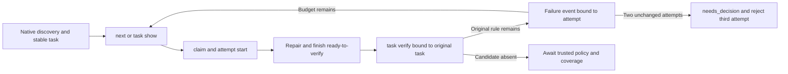

## Native checks over discovered project Shell files

`codeguard check shell . --shellcheck-tool /absolute/shellcheck --format json` and `check all` now run ShellCheck 0.11.0 over discovered Shell files under one deadline. Feedback 0.52.0 exposes `native_results.shell_lint`, a 0.1.0 shell_native_scan with per-file source hashes, dialects, original rc, native SC rules/scalar positions, input stability and workbench status. Human output shows native positions; SARIF projects current observations while keeping locations and native messages private.

Shebangs and explicit filename conventions supply dialect evidence. `--shell-dialect bash` supplies a default for undeclared files and cannot override zsh/fish declarations. Unknown or unsupported dialects stay incomplete; next requests a concrete dialect/checker decision rather than repeating an unsuitable installation. At most 64 files are checked; unobserved_count exposes overflow. local_check_complete describes these isolated native observations and proves no project source-dependency, category or policy coverage.

An initialized scan binds its requested root despite nested workbenches; an uninitialized scan creates no workspace. Repeated file/dialect/SC rule observations update stable tasks. Configuration or environment failures remain blockers. Source, scope, rc or tool changes withdraw current location authority. No Shell WASM fallback is fabricated. check shell still returns 3/not_evaluated, and check all remains incomplete. Security, CVE, sourced dependencies, trusted closure/recurrence, dedicated zsh/fish tools, Dockerfile/IaC and platform acceptance remain open.

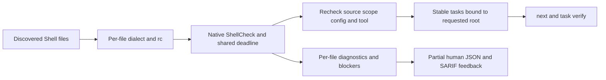

See [project Shell acceptance](../tests/acceptance/shellcheck-project-baseline.md).

### Shell edit and repair events

Rust `hook execute` and the Claude-shaped adapter route confirmed Shell edits to the same per-file ShellCheck path, accepting `--shellcheck-tool /absolute/path`. Only selected files run within the event deadline. Tasks retain their identity across `lint shell`, `check shell`, and edit events; an uninitialized workspace is not created automatically.


Edit feedback uses outer protocol 0.21 and inner 0.11, preserving earlier schemas. Dialogue includes current SC rules, Unicode scalar positions, persisted task IDs, and recheck commands; source and free-form tool messages are excluded. Missing tools, unsupported dialects, selected-tool failures, and persistence failures remain incomplete. No bundled Shell WASM fallback is claimed. Failed writes run no checker; repair-ready events call the existing task verifier, and zero diagnostics never close a task.

The [acceptance record](../tests/acceptance/shellcheck-hook-baseline.md) distinguishes real ShellCheck output, controlled fixtures, offline npm installation, and live host sessions. Claude-shaped replay does not prove acceptance in a real installed host or a complete project delivery gate.

CFQuery SQL comparisons require a database dialect. PostgreSQL accepts an empty SELECT list but rejects its DISTINCT variant; the fixed WASM reports zero recoveries for both. The isolated native evidence does not promote generic pending labels. See [dialect evidence](CFQuery-SQL-Dialect-Evidence.md); project SQL adaptation and grammar repair remain open.

Failed-write routing also accepts registered Go/Cargo/Maven and other checker configuration options, returning `not_run/write_failed` without starting tools or creating a workbench. Ownership/lease, unknown and malformed arguments remain rejected. This exception only applies to failed writes and does not silently enable unwired tools on confirmed edits. See [acceptance](../tests/acceptance/hook-failed-write-options.md).

## Go native syntax feedback after edits (local acceptance)

`hook execute . --go-tool /absolute/path/go --timeout 30s --format=json` prefers the companion gofmt from the fixed Go1.23.4 SDK for selected confirmed edits. It checks frozen stdin and revalidates both artifacts and source bytes without running source, installing dependencies or executing project-wide go vet. Missing tools retain WASM candidates; selected failures, missing companions, unverified versions and `//line` position remapping remain incomplete without switching checkers. Project language versions and all build conditions remain unaccepted.

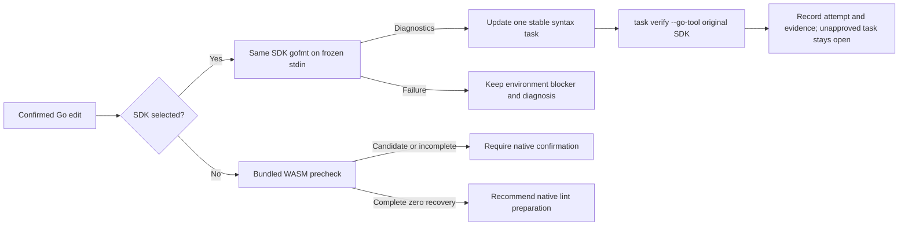

Edit feedback uses outer0.22/inner0.12 and native-first observations0.10; historical schemas remain intact. Native and candidate observations share workspace/path/language task identity. Claude-shaped feedback exposes current Go rules, UTF-8 byte positions and actual task recheck guidance without source or free-text messages. Zero native diagnostics do not authorize closure: project go vet, types, dependencies, security and complete checks still apply. See [Go Hook acceptance](../tests/acceptance/go-native-hook.md).

Go native-first task guidance uses `repair_brief_preview` 0.18 with a `syntax-confirm-` observation reference. Actual task-recheck guidance retains 0.14 with a `syntax-native-` reference; existing schemas are unchanged. Final affected regressions: WASM 78 passed / 5 conditionally ignored, default 15 passed / 0 ignored. The earlier 1,461-pass full default run predates this final protocol correction.

Go's fixed 1.23.4 syntax SDK now statically checks the nearest `go.mod` and nearest `go.work` before editing or original-tool task verification. A newer minimum/suggested toolchain, ambiguous or unreadable declarations produce an environment observation without running that SDK or falling back to WASM. Changes during observation withdraw diagnostics; incompatible current declarations withdraw saved repair positions. This is a bounded compatibility guard, not general project toolchain or language-version acceptance. Evidence: [Go project version](../tests/acceptance/go-project-version.md).

### CFQuery static DISTINCT projection candidate

The fixed CFQuery grammar tokenizes SQL without validating every SQL clause. Codeguard now reports adjacent AST `SELECT DISTINCT FROM` keywords as an independent candidate, preserving raw ERROR/MISSING observations. String/identifier literals and CFML interpolation interrupt the sequence; comments can be ignored. `SELECT FROM users` remains unflagged by this rule because PostgreSQL permits an empty projection without DISTINCT.

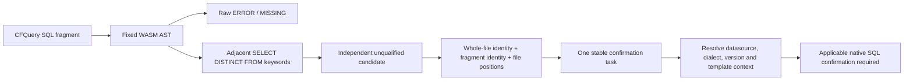

The worker uses 1.3, explicit probe 0.4, project feedback 0.53, editing feedback 0.23/0.13, and saved candidate observation 0.11. Historical schemas and grammar assets remain unchanged. Embedded observations carry whole-file `source_sha256`, separate `fragment_source_sha256`, and restored file positions. Repeat scans share a task; candidate disappearance does not close it. `next` explicitly asks for datasource, dialect/version and dynamic-template/schema context: the CFQuery native task-verification adapter is still unavailable, and no project database is contacted automatically.

```bash
codeguard grammar probe cfquery query.sql --format=json
codeguard check all . --format=json
codeguard next . --format=json
```

Report example (selected fields, not a complete schema):

```json
{"language":"cfquery","recoveries":[],"structural_observations":[{"basis":"codeguard_structure_rule","rule_id":"codeguard.cfquery.distinct_projection","rule_version":"1.0.0","parent_syntax_kind":"program"}],"grammar_qualified":false,"status":"incomplete","delivery_decision":"not_evaluated","next_action":"confirm_candidate_structure_with_applicable_native_tool"}
```

This addresses one fixed native-counterexample at the candidate layer. It does not qualify the grammar, measure an independent holdout, infer every SQL dialect, validate injection safety or prove native adapter/release acceptance. Evidence: [CFQuery candidate acceptance](../tests/acceptance/cfquery-structure.md).


### Rust formatter parser differential (development-only)

The Rust-owned developer replay now supports explicitly selected Rustfmt1.9.0-stable on frozen stdin with private edition2024 configuration, empty environment, shared budgets and artifact/config continuity checks. Valid unformatted source is not a syntax finding; `--check` is not used. Only recognized, bounded stdin diagnostics are retained, including the measured EOF and E0765/exit101 cases; crashes and unlocated output remain incomplete. This fixed edition does not infer project edition, analyze external modules, replace Clippy/build checks, close tasks or implement Rust editing Hook routing. The captured 16-case comparison has 5TP/11TN/0FP/0FN/0unknown on this small non-holdout corpus; language qualification remains0/32. See [scoped acceptance](../tests/acceptance/rustfmt-controlled-native-differential.md) for the actual execution path, protocol and reproduction commands.


Rust selected-file parser preparation now resolves Cargo edition from bounded package/workspace declarations and rechecks declaration/source continuity between native calls. The scoped Unix library service has actual2015/2021/2024 counterexample evidence; selected-file edit Hook, stable confirmation tasks and original-tool rechecks are now connected; complete project and real-host acceptance remain open. See [project edition contract](Rust-Project-Edition-Syntax.md).

Rust edit feedback now reports safe lines, stable tasks and original Rustfmt recheck guidance while retaining Clippy/type/build obligations. See [scoped chain acceptance](../tests/acceptance/rust-native-hook.md).

Rust edit dialogue now provides an executable post-batch Clippy command and explicitly states that project lint did not run during editing. Original-task repair-ready retains current rule/line feedback and withdraws changed-input guidance; this is not a background queue or authoritative closure. See [project lint follow-up](Rust-Project-Lint-Followup.md).

Native-first and WASM-first Rust syntax tasks now share a protected-host SDK confirmation, scoped resolution and same-tool recurrence path. Native-first policy1.7/evidence0.8 retain grammar=null; WASM-first policy1.8/evidence0.9 retain the original grammar digest. Both bind the original counterexample and approved Cargo edition provenance; a native counterexample requests investigation, and incomplete or changed inputs cannot resolve. Production host approval integration remains pending; this does not qualify Clippy or project delivery. See [scoped acceptance](../tests/acceptance/rust-task-resolution.md).

See [WASM-first acceptance](../tests/acceptance/rust-wasm-task-resolution.md) for the actual execution path, protocols and counterexample routing.

Incomplete parser feedback now directs the agent to check the original source with the applicable native tool. If native confirmation accepts the source, investigate grammar version/compatibility or scan budgets; only actual native diagnostics guide source changes. Truncation alone does not establish a grammar error. This applies to project output, edit context, persisted tasks and next/task show; task identity and closure requirements are unchanged. [Acceptance](../tests/acceptance/incomplete-syntax-guidance.md)

A completed local native recheck with no syntax diagnostics now compares its source hash with the initial WASM candidate. If the hashes match and the original grammar reference is valid, next/task show identifies a same-source grammar counterevidence candidate and directs compatibility/budget investigation. Changed inputs and native-first evidence do not use this description. The task remains open and the evidence does not automatically authorize an allowlist or delivery. [Acceptance](../tests/acceptance/native-same-source-counterevidence.md)

Javadoc main-source selection is relative to the nearest observed build root. A `vendor/src/main/java/` directory without its own build root does not inherit the parent's main-source scope. Maven multifile probes exclude sources owned by a closer build root, including one without confirmed Javadoc configuration. Unresolved sources remain visible and keep coverage incomplete. Custom source directories and effective Maven models still require implementation. [Acceptance](../tests/acceptance/javadoc-build-root-source-scope.md)

The runtime provides bounded direct sibling-binding AST facts. A WASM source build now connects them to `grammar probe javascript FILE --format=json`, using pinned rulepack identity, an isolated explicitly selected worker1.5 and probe0.6. The result preserves raw parser recovery and identifies a limited direct simple lexical-binding candidate, requiring native confirmation. Module/CommonJS top-level return semantics are not inferred. Project check/lint, Hook and persisted task contracts have not yet adopted this rule; their existing reports and differential counts remain unchanged. [Runtime acceptance](../tests/acceptance/javascript-direct-binding-facts.md) · [Probe acceptance](../tests/acceptance/javascript-binding-probe.md)

### JavaScript direct-binding candidates in project checks and the workbench

Project checks and confirmed edit hooks now reuse the pinned JavaScript structural rule after native-first selection. Parser recoveries and duplicate direct simple let/const binding candidates remain separate. Check feedback 0.54, confirmation observation 0.13, hook feedback 0.27 and next brief 0.20 preserve closed historical protocols. Repeated checks reuse the ESLint preparation identity; next requires applicable native confirmation with the original dialect and configuration. A later WASM observation without candidates cannot close the task. Nested scopes, var, destructuring and full semantic analysis remain outside this rule; actual hosts and standalone lint integration still require acceptance. See [acceptance evidence](../tests/acceptance/javascript-binding-workbench.md).

### Standalone JavaScript lint and pending confirmation

`lint typescript` is the current unified ESLint entry. For the four JavaScript extensions it discovers native tools within the selected workspace, then reuses bounded project observations and task synchronization when native context is absent. Feedback 0.6 separates structural candidates from recoveries. Joined and separate options share duplicate detection. A candidate-free observation recommends native lint only without a validated open task for that scope; an existing task retains its ID and required native confirmation. Selected native failures never trigger a replacement fallback. Synchronization failures retain the candidate and an actionable reason. Historical schemas remain unchanged; actual hosts, full qualification and release acceptance remain pending. See [acceptance](../tests/acceptance/javascript-lint-candidate.md).

JavaScript fallback must distinguish an absent same-scope confirmation task from unreadable or conflicting history. A damaged fact, missing projection, replaced directory, or locally forged closed state retains required native confirmation and an incomplete workbench result with a bounded recovery reason. It never imports Markdown instructions or treats local task state as closure authority.

The unified standalone lint dispatcher preserves the existing native adapters, then routes other registered IDs to a single-file candidate service. The request permits only a source file, workspace, format, and deadline; foreign tool flags and duplicate options fail before execution. A missing adapter is reported separately from missing tools (`configuration_status=unknown`). Canonical CFML includes CFScript and explicit CFQuery regions; an ambiguous header or ordinary SQL file never forces a grammar. Native confirmation remains required even with zero candidates because adapter readiness is unresolved. Existing task identity and corruption recovery are shared with project checks.

Explicit C11/C++17 requests may select the measured Apple Clang 21 executable with `--clang-tool ABS_PATH --standard c11|c++17`. Rust freezes source bytes, uses stdin and a private cwd, clears inherited environment, disables default config and include search, and invokes `-fsyntax-only`. SARIF must name the pinned driver, same stdin artifact and Unicode code-point columns; all results are validated before safe rule IDs and UTF-8 positions are projected. A changed input/tool, invalid report or execution failure cannot fall back to WASM. Preprocessor inputs remain a context blocker pending the compilation model. This initial native entry does not yet synchronize Clang evidence into tasks or replace clang-tidy/project lint.

The native warning profile explicitly enables Wall/Extra/Pedantic. Exit zero with warnings remains diagnostics_observed; error and warning levels are retained, while notes are validated but not counted as issues.


The explicit Erlang probe adds worker 1.6/probe 0.7 for direct function-form termination. Bounded AST sibling/token visits preserve an unresolved continuation on truncation; punctuation inside literals/comments is excluded. This is a structural candidate requiring OTP confirmation, not parser recovery. Current project/Hook/workbench consumers retain prior protocols pending versioned integration; raw-parser evaluation remains unchanged.


Erlang project/edit integration uses check 0.55, confirmation 0.14 and Hook 0.28/fast 0.16. OTP runs first on the selected files; actual absence permits candidate fallback, whereas selected-tool failure remains native incomplete. Existing native/environment and later structural evidence share task identity. Consumed original reports stay bound to markers across source edits; fresh imports still verify current byte positions. See [workflow acceptance](../tests/acceptance/erlang-form-workbench.md).

Project Rust CVE discovery: the existing rust.cve task selects its explicit override or the first existing entry in an absolute PATH directory. A broken selected entry does not fall through; the offline database remains explicit, and native execution plus tool/lock/manifest identity checks use the existing service. check_feedback0.56 references the dedicated closed Clippy brief schema when that brief is selected, preserving older protocols. Complete database, tool-lock/version and host trust remain open; see [actual acceptance](../tests/acceptance/cargo-audit-path-discovery.md).

## Unified Java comments entry (source increment, not released)

`comments java [path]` reuses the existing native Javadoc probes. A file selects an explicit JDK21 local observation. A project selects recognized Javadoc configuration and its main sources only. Missing configuration does not launch Javadoc or produce comment violations. Explicit Maven context selects original-POM multi-file checking; failure never falls back to a single-file probe.

```bash
codeguard comments java File.java --java-home /absolute/jdk21 --format json
codeguard comments java . --java-home /absolute/jdk21 --maven-tool /absolute/mvn --maven-repo /absolute/repository --repo-sha256 SHA256 --timeout 60s --format json
```

The independent `java_comments_feedback 0.1.0` wrapper preserves the existing report under `native_observation`; the old `lint java --checker javadoc` protocol remains unchanged. Budget precedence is CLI, registered environment, project default, then built-in default. All native child work shares one deadline. Feedback exposes target kind, budget, observations and next actions. Zero local diagnostics still means `coverage_proven=false`, `delivery_decision=not_evaluated`, exit3 (130 on cancellation). No implicit installation or source changes occur.

**Scope limitation:** Standalone-file and Maven multi-file workbench integration remain incomplete; initialized-project JDK integration is described below. Trusted closure remains incomplete. This entry creates no fake tasks and does not close findings from a local probe. Replace the absolute tool paths and offline-repository digest with real current values.

### Javadoc project workbench integration (source increment)

For initialized projects, `comments java .` in JDK single-file mode saves local observations and synchronizes stable tasks using wrapper protocol `java_comments_feedback 0.2.0`. Uninitialized projects, standalone files and unsupported scopes retain the 0.1 local feedback. Rule, relative file, source anchor and occurrence ordinal define identity; line numbers only locate evidence. Repeat scans append observations without duplicate tasks.

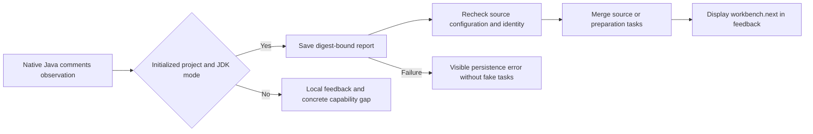

Missing configuration or incomplete execution creates preparation records, not source violations or new mandatory delivery obligations. Feedback exposes `workbench.status/new_findings/new_blockers/next`. Persistence failures return no fake tasks. Briefs and task text include evidence, rule basis, scope, steps, recheck and closure conditions. Local zero diagnostics leave prior tasks open with `task_verify_status=not_integrated`. Maven multi-file and standalone-file workbench integration remain incomplete, as do trusted closure and actual host acceptance.
