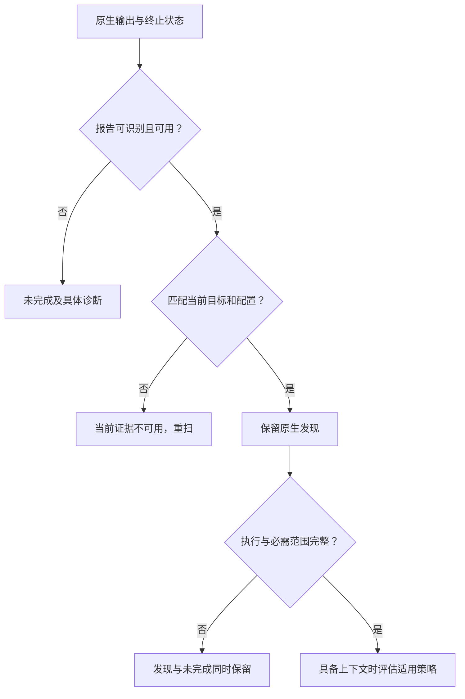
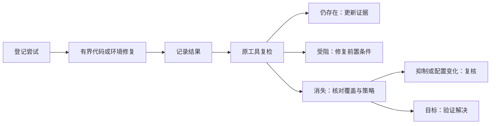
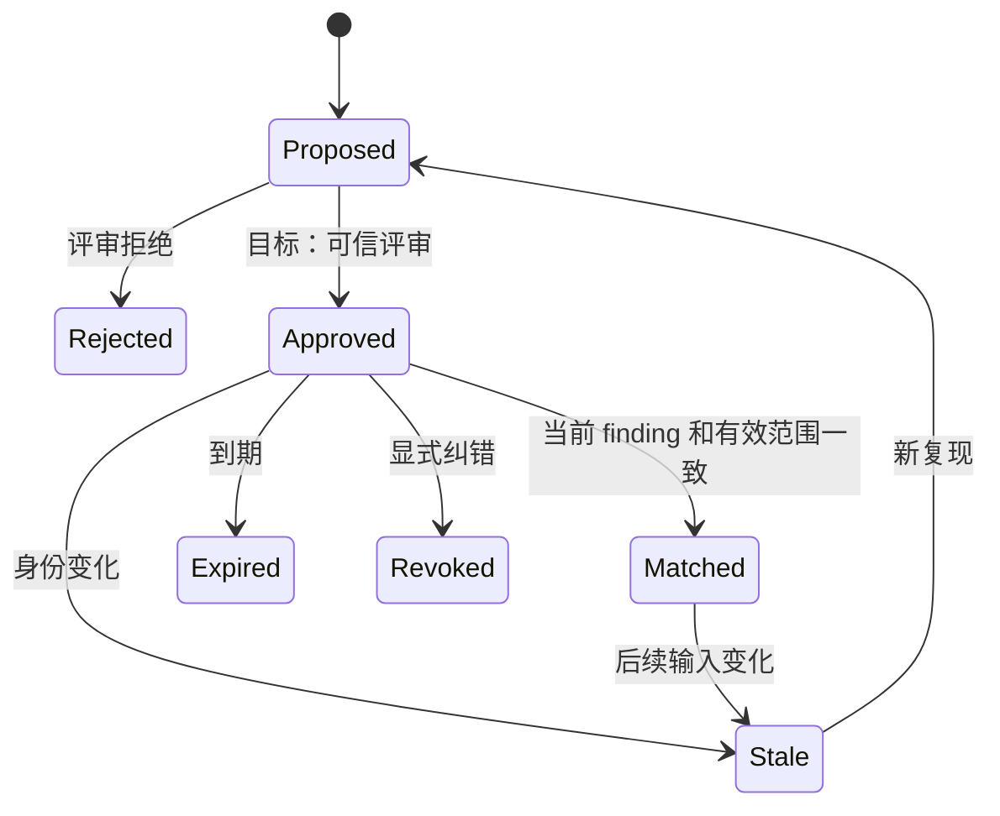
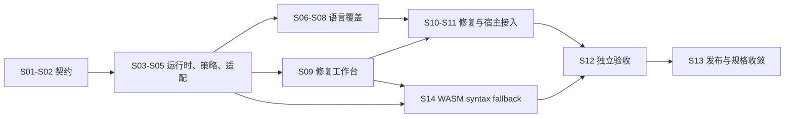

# Codeguard 技术方案与路线

> **文档说明：**将架构落实为实现契约、命令职责、扩展步骤和可观察的验收标准。
>
> **文档版本：**1.2.3 · **最后更新：**2026-10-03 · **源码基线：**当前检出版本与[实施证据](../openspec/changes/introduce-rust-codeguard-cli/implementation-baseline.md)；软件版本 `0.1.3`。

[English](Codeguard-Technical-Design.md) · [架构设计](Codeguard-Architecture.zh_CN.md) · [README](../README.zh-CN.md)

专题入口：[命令](Codeguard-Command-Reference.zh_CN.md)、[初始化](Codeguard-Project-Initialization.zh_CN.md)、[修复](Codeguard-Remediation-Workflow.zh_CN.md)、[误报治理](Codeguard-False-Positive-Governance.zh_CN.md)、[适配器](Codeguard-Adapter-Contracts.zh_CN.md)、[信任与分发](Codeguard-Trust-and-Distribution.zh_CN.md)、[验收](Codeguard-Validation-and-Rollout.zh_CN.md)、[旧协议](Codeguard-Legacy-Compatibility.zh_CN.md)。独立细节由专题维护，规格与任务由 OpenSpec 维护。

## 1. 范围与规格归属

既有 [OpenSpec 规范与任务](../openspec/changes/introduce-rust-codeguard-cli/proposal.md) 已整体迁入本 Rust 仓，是唯一规格与任务事实源。已实现切片和剩余工作分别记录，本文不维护第二份可独立勾选的任务。

可调用行为以当前源码为准，目标契约明确标注。产品优先级是配置发现 → 原生结果 → 有用的修复指引。内部一致性校验为这个体验服务，不要求用户手工构造执行证明。

WASM 的规范与 19 项实施任务已纳入既有 change；可选特性下的 Rust worker 与 Java/TypeScript/TSX 局部单文件候选报告及 Python Ruff 不可用时的候选报告已存在；三十二份候选 grammar 均未验收；ArkTS、C、C++、C#、Go、JavaScript、Lua、Luau、Nix、Rust、Terraform、Zig、Objective-C、Solidity、R、Ruby、PHP、Kotlin、Dart、Erlang、Pascal、CFML、CFQuery、CFScript、COBOL、Scala、Swift、VB.NET 仅有固定字节的 Rust 可加载候选资产，尚无逐语言验收的独立 lint 路由。项目级原生优先调度、grammar 版本范围验收与宿主接线仍未完成。设计示例不是当前命令输出。

源码以 `--features wasm-precheck` 构建后，可通过 `codeguard grammar probe <language> <file> --format=json` 显式调用全部 32 份固定候选资产。命令使用隔离 Rust worker，以退出码 3 报告未经语言验收的观察，不能作为 lint 或交付结论。成功观察与有效语种的输入失败都遵守[0.1.0 封闭 JSON Schema](../schemas/grammar-probe-v0.1.schema.json)，保持未完成。原生优先 `lint/check`、语言/方言验收、任务/宿主反馈及发行仍需独立完成；现有发现清单还把 JavaScript/TSX 归入 TypeScript，并未为 CFQuery/CFScript 建立独立源码映射。

首个局部原生优先入口为 Zig：`lint zig FILE --zig-tool ABS_PATH --format=json` 对选定源码字节先运行版本报告为 Zig 0.16.0 且字节保持一致的 `ast-check`；原生错误只暴露行列位置，不回显源码。未提供显式工具时，固定 Zig grammar 作为未验收候选兜底。两种结果都保持未完成，因为 AST 检查范围小于完整 lint、构建和测试；见 [0.1.0 报告 Schema](../schemas/zig-lint-feedback-v0.1.schema.json)。

固定 Zig worker 现还有真实 Zig 0.16.0 差分测试：7 份合法、4 份破损源码分别送入原生 `ast-check` 和公开隔离 `grammar probe` 路径。本机 11 份分类全部一致；这只是窄范围[精度记录](../tests/acceptance/zig-native-differential.md)，不是误报率估计或语种验收。

## 2. 技术选型与权衡

| 关注点 | 选型 / 当前证据 | 影响与替代方案 |
| :--- | :--- | :--- |
| 实现语言 | Rust workspace，edition 2024，声明 MSRV 1.85 | 统一编排实现；原生检查器保留运行时，不用手写近似规则替代原生分析器 |
| 数据契约 | `serde`、`serde_json`、版本化 JSON Schema | 结构化反馈和持久化可校验，命令专属预览协议仍并存 |
| Maven/Cargo 观察 | `roxmltree`、`toml` | 静态解析避免隐式构建；继承/有效模型须另行受控解析 |
| 输入身份 | SHA-256，其它算法用于特定互操作场景 | 摘要绑定字节，不等于授权或语义等价 |
| 进程与锁 | `std`、Unix `libc` 基础能力 | 显式归属与取消，但未认证通用沙箱或 Windows 等价行为 |
| 并发检查 | 已校验 DAG、作用域线程、资源键 | 独立检查可并行，同资源工作串行 |
| 包管理基础 | `ring`、归档库、`reqwest` 与 Rustls/Tokio | 核验和下载基础能力已存在，公开安装仍未完成 |
| 持久化 | JSON 事实/事件及 Markdown 投影 | 本地状态可审查，事务和跨机器协作需专门实现 |
| 智能体接入 | CLI human/JSON、部分 SARIF | 无模型依赖，宿主插件/MCP 接线独立推进 |

精确依赖版本见 [Cargo.lock](../Cargo.lock)，依赖声明见四个 crate 清单。工作区当前没有公开 feature 选择矩阵、数据库服务、Web UI 或守护进程，这些模板模式不属于产品既定需求。

## 3. 命令职责契约

每条命令必须解释选择对象、读写行为、结果和下一步。只读表示不主动修改项目；原生工具仍可能具有自己的执行副作用，由适配器处理。

| 入口 | 职责与用户价值 | 副作用 / 当前实现 |
| :--- | :--- | :--- |
| `--help`、`--version` | 查询语法、二进制和协议元数据 | 只读，版本输出中的构建身份仍未核验 |
| `detect`、`capabilities` | 区分项目观察与发行能力清单 | 只读，清单条目不是认证适配器 |
| `init --dry-run` | 预览画像、图、受管文件和配置状态 | 不写项目、不执行原生构建 |
| `init --apply` | 创建/刷新自有文件和 AGENTS 上下文 | 受控本地写入，当前状态 partial |
| `config validate`、`config explain` | 解释原生/历史配置和候选策略输入 | 只读，不可信候选仍保持未完成 |
| `rules list` | 展示候选规则来源和配置缺口 | 只读，不激活规则 |
| `tools list`、`tools verify` | 查看库存、选定路径和候选身份 | 静态核对；字节一致不自动获得权威 |
| `doctor` | 定位配置和已选运行时可用性 | 当前为显式 Ruff 版本探针，不通用自动安装 |
| `tools install` | 目标是受控准备工具 | 公开 dry-run 是预览，apply 当前受阻 |
| `plan` | 解释候选义务、范围和前置条件 | 局部只读计划，不是认证执行契约 |
| `lint`、`comments`、`dependencies`、`cve`、`security`、`build` | 分离检测类别 | 仅调度器列出的组合可执行，dependencies/security 通用入口待实现 |
| `check all`、`check java` | 运行已接入路径并说明剩余类别 | 原生执行，保存和同步合格局部报告 |
| `work sync` | 导入全部可消费报告，避免遗漏另一类别 | 本地事实/事件/任务/收据写入，有界锁与重放 |
| `status`、`next`、`task show` | 汇总状态、选择动作、查看单任务 | 只读结构化事实，不自动领取或改源码 |
| `task claim`、`heartbeat`、`release` | 协调单个本地任务的执行者 | 租约文件及 generation/token/过期核对 |
| `task attempt start`、`finish` | 保存动作、输入变化和结果 | 本地事件，失败/无变化尝试也计入 |
| `task verify` | 修复后重复原检查器 | 原生执行和复检事件，不自动正式关闭 |
| `rules whitelist list`、`explain`、`propose` | 查询精确候选及提出纠错 | 默认只读；纠错 `--record` 写提案事件/附件，不批准 |
| `gate pre-commit` | 查看实际 Git index 路径安全 | 局部范围，尚非完整内容/secret 检查 |
| `fix`、`gate pre-push`、`gate ci`、`mcp serve`、`compat legacy-v1` | 目标为原生修复、交付内容和宿主互操作 | 当前不是公开可执行入口 |

真实解析入口是 [main.rs](../crates/codeguard-cli/src/main.rs)，不能按惯例猜命令。例如这里没有公开 `lint rust` 分支，Clippy 当前通过 `check all` 接入。类别登记不会使 `security all` 或 `comments java` 自动成为可调用命令。

## 4. 初始化方案

### 4.1 观察算法

1. 确定显式项目根和发现边界。
2. 枚举可识别源码路径、清单、锁文件及精确配置例外。
3. 不执行项目代码，收集内容身份与直接声明。
4. 分别保存包版本、语言目标、依赖解析版本和本机运行时。
5. 构建分类型模块边，保留继承、表达式、条件和缺目标等未解析项。
6. Dry-run 和 apply 都将同一观察返回对话。
7. Apply 时预检归属，只合并 AGENTS 受管区块，更新文件和工作区元数据，并报告可恢复的局部结果。

[初始化源码](../crates/codeguard-cli/src/init_command.rs)当前生成 project profile `0.3.0`。Maven compiler release/source/target 和 Cargo rust-version/edition 标记为 `declared_only`，不代表有效构建模型。静态图不是源码调用图。未来若接入已有 CodeGraph，必须核对新鲜度，不自动初始化索引。

### 4.2 所有权与刷新

| 情况 | 要求 |
| :--- | :--- |
| 首次预览 | 返回计划路径和观察，不创建文件 |
| 新模块或清单/锁变化 | 重算受影响画像与图，不仅比较旧路径 |
| 已有人工文本 | 保留受管区块外字节 |
| 人工改写受管内容 | 报告冲突，不盲目替换 |
| 未知 MVC/DDD 架构 | 保持未知或明确推断，不强制架构规则 |
| 缺检查配置 | 给出准备/选择指引，不生成代码违规 |
| 文件部分写入 | 报告实际结果和恢复状态，不伪称全成或全败 |

AGENTS 摘要对每类列表设上限，并链接完整结构化观察；它不是策略权威。当前 `architecture.md` 仍是未知状态投影。完整架构确认和初始化前置任务流程尚未完成。

## 5. 原生适配器契约

### 5.1 分离观察与执行

适配器有两个概念阶段：**Observe** 读取配置，识别适用性、规则声明、范围和未知条件；**Execute** 使用显式工具上下文，生成原生调用、解析协议并复核输入身份。这些职责当前分布在 adapters 和 CLI 模块，不是已经标准化的动态插件 trait。

| 契约维度 | 必须描述的内容 |
| :--- | :--- |
| 身份 | checker ID、适配器版本/身份、支持的原生工具版本 |
| 适用性 | 语言、构建根、配置状态、源集、原生前置条件 |
| 选择 | 生效规则或具体未解析原因，不擅自扩展默认规则 |
| 调用 | 绝对工具路径、字面 argv、cwd、选定环境、输入快照、deadline、输出上限 |
| 报告 | 格式/版本、原生退出契约、解析上限、规则 ID 和位置 |
| 归一化 | 问题与执行完整性分离，保留原生严重度 |
| 修复 | 支持的稳定身份、准备情况、简报和复检配方 |
| 一致性验收 | 正例、反例、坏输入、中断、输入变化和真实工具用例 |

### 5.1.1 扩展接口与输出边界——逻辑设计

以下是职责签名，不是现有公共 Rust trait，也不要求创建空实现：

```text
Adapter.descriptor() -> CapabilityDescriptor
Adapter.discover(observations) -> ApplicabilityEvidence
Adapter.resolve(context, policy, toolchain) -> ResolvedCheck
Adapter.plan(resolved_check) -> AdapterPlan
Adapter.parse(raw_artifacts, termination) -> ParsedEvidence
Adapter.verify_coverage(plan, evidence) -> CoverageAssessment
Adapter.plan_fix(finding_set, context) -> FixPlan
ExecutionPort.run(process_spec, cancellation) -> ToolExecution
SnapshotPort.capture(content_request) -> SnapshotLease
EvidenceStore.persist(raw_evidence) -> EvidenceRef
CachePort.lookup(validated_identity) -> VerifiedCacheEntry | Miss
```

自有检测编排、解析与策略逻辑由 Rust 承担，Node 只作发行入口。适配器通过 runtime 请求 I/O，不私下执行进程、联网或修改文件。当前应用编排实际在 CLI，不能把上面的目标接口误写成 core 已经协调全部 I/O。

目标结构化 stdout 仅有一个报告，进度/工具日志进入 stderr 或私有日志；输出文件原子落盘失败须反馈未完成并保留检查结果。SARIF 保留发现及运行失败通知，不能用零 results 隐藏 incomplete。归并只针对同工具或显式映射的等价规则，保留原始记录和次数，不按消息相似度跨工具合并。

### 5.2 本基线原生路径

| 生态 | 适配行为 | 不能宣称 |
| :--- | :--- | :--- |
| Maven/P3C | 发现 Maven 检查声明，用显式 JDK/仓库上下文运行选定探针 | 仅 `mvn verify` 成功就证明全部规则执行 |
| Javadoc/Checkstyle | 在支持配置与范围内解析原生文档诊断 | 缺类路径或不支持 XML 属性就是源码违规 |
| Ruff | 原生 lint、部分设置/规则核对及抑制对照 | 全部 Ruff 规则/配置形态都是完整质量策略 |
| Cargo | Clippy、库目标 Rustdoc、all-targets 类型检查、cargo-audit 观察 | 类型检查运行了测试，或全部 workspace/features 已验证 |
| ESLint | 显式 Node/入口/config/cwd 或配置映射，读取 JSON/settings | 执行配置等同安全的静态发现 |
| npm | 将 audit 观察绑定到支持的 package-lock 输入 | 缺图或旧图能证明依赖干净 |
| pip-audit | 标准 pylock 快照与组件匹配 | uv/Poetry 锁可直接替代 PEP 751 输入 |
| Go vet | 有限范围原生 JSON 观察 | 覆盖全部 Go 分析器和 build tag 组合 |

新增适配器时先定义契约、实现静态观察，再增加解析夹具及显式执行，最后接命令、schema、反馈、稳定任务和复检。通过相关验收后才登记可执行能力，不能只增加清单行。

### 5.3 原生优先与语法兜底选择——目标，尚未发行

拟议路径扩展已有的 `codeguard lint java .`、`codeguard lint typescript .` 和 `codeguard check all .`，不要求调用者选择 WASM。在实现和验收前，仍须使用当前适配器参数/前置条件；公开 `0.1.3` 仅包含有界、未验收的候选路径；`0.1.2` 不含。架构文档 **8.1–8.3** 负责组件边界与执行图，本节定义算法。


1. 逐模块发现源码范围、语言版本/方言、已配置检查器和明确的原生义务。区分“不在 PATH”与“未安装”；先检查选定的项目本地工具及支持的构建集成，再判定工具缺失。
2. 原生工具及配置有效时运行原生检查，保留原生发现。不能在原生违规后降级 WASM。配置/运行失败时保留故障，可附带初检结果。
3. 否则选择经验证的模块/方言 grammar，核对资产身份并运行有界语法工作进程。分别统计已检查、不支持、排除及失败范围。`ERROR`/`MISSING` 观察仍是疑似问题。
4. 范围完整且未发现异常时推荐准备原生工具；发现异常时必须准备工具并进行适用的原生确认。未完成/不支持时要求恢复有效检查能力，不制造源码违规。已有必需原生义务在所有情况下都保持必需。
5. 已有工作区时同步合格观察并返回简报。可选准备保持建议项，不成为阻断任务或被 `next` 反复选择。复用模块/检查器准备任务，关联疑似观察，不为每一行创建安装任务。同步失败返回独立诊断，不编造任务 ID。
6. 准备后，使用原项目配置和当前输入验证。原生零诊断只有在确实覆盖同一语法能力与源码范围时，才能构成反证。安装、切换 grammar 或后续初检正常本身，均不能关闭必需原生确认任务。

语言没有受支持的原生复核适配器时，返回具体能力缺口及可处理的环境/决策任务，不反复推荐不存在的工具。“必须安装”也包括恢复正确运行时、项目依赖或配置；遵循项目声明版本和包管理器，在用户已有授权范围内修改。

当前 core 已实现局部的纯准备动作选择：输入经上游核对的原生阻塞种类、完整初检聚合及既有必需义务；只有非空且全部合格的 clean 才可选推荐，坏配置/执行失败分别要求修复，不建议重复安装。它尚未连接真实工具发现、CLI 报告或工作台任务，因此不表示自动安装建议已经交付。见[局部验收](../tests/acceptance/syntax-setup-guidance-candidate.md)。

| 设计字段 | 含义 |
| :--- | :--- |
| `backend` | `native` 或 `wasm_precheck`，本次观察来源 |
| `precheck.status` | `not_run`、`clean`、`suspected_issue`、`incomplete`、`unsupported` |
| `native.status` | `not_run`、`completed`、`incomplete`，另列 `missing_runtime` 等原因 |
| `scope` | 选中/已检查/未解析文件或区域，附排除与原因计数 |
| `observations` | 源码位置、解析器/规则身份，以及疑似/已确认分类 |
| `setup.requirement` | 需要准备时为 `recommended` 或 `required`，同时给出原因 |
| `task_id` | 真实持久化任务，否则为 null；不声称已取得关闭收据 |
| `delivery` | 独立评估，初检不能制造交付许可 |

部分文件有疑似异常、另有文件未解析时，总体为 `incomplete`，同时保留所有可用疑似观察。`clean` 要求选定范围非空且全部完成检查。

这些是目标语义字段，尚非已发行的项目级 lint/check 报告。局部的[候选初检 schema](../schemas/syntax-precheck-candidate.schema.json) 与 [Rust 严格读者](../crates/codeguard-adapters/src/syntax_precheck_candidate_report.rs)已绑定源码 SHA-256、固定 grammar 身份和文件方言，重新计算状态，并拒绝未知版本及伪造的 `clean`。可选 CLI 的 [TypeScript](../schemas/eslint-local-feedback-v0.3.schema.json)、[TSX](../schemas/eslint-local-feedback-v0.4.schema.json) 与 [Java](../schemas/java-syntax-precheck-feedback-v0.1.schema.json) 单文件生产端已提供恢复位置和准备指引。TypeScript/TSX 在已初始化工作区改用[反馈 0.5.0](../schemas/eslint-local-feedback-v0.5.schema.json)，按源码范围关联一张稳定的原生确认任务；[0.2.0 准备报告](../schemas/eslint-preparation-observation-v0.2.schema.json)以源码和 grammar 身份保存有界疑似位置，并通过报告摘要关联到任务；宿主渲染和能力匹配原生关闭仍未接通。内置 grammar 仍是未验收候选，因此不能返回 `clean`。保持既有退出语义：必需原生执行缺失仍为未完成（`3`）；解析器疑似问题本身不是已确认违规（`1`）。若未来增加独立语法操作，其成功必须限定为语法初检；本文不宣称已有 `syntax` 命令。

源码构建的 `check all` 现另有较窄的真实项目报告：先执行原生适配器，再由[有界源码路由](../crates/codeguard-cli/src/check_syntax_candidates.rs)选择固定 worker 候选。[0.33.0 封闭 Schema](../schemas/check-feedback.schema.json)增加逐文件原生优先计数；[0.32.0](../schemas/check-feedback-v0.32.schema.json) 保留为历史协议。只有 Ruff 对同一 Python 源码摘要返回完整扫描状态时才跳过该文件的重复 WASM；P3C 等规范检查不能冒充语法确认。下面仅摘录字段，不是完整 `check_feedback` 实例：

```json
{
  "schema_version": "0.33.0",
  "command_status": "incomplete",
  "delivery_decision": "incomplete",
  "syntax_candidates": {
    "status": "observed_partial",
    "execution_phase": "after_native",
    "authority": "candidate_unqualified",
    "delivery_decision": "incomplete",
    "native_preferred_count": 1,
    "observations": [
      {"path": "src/view.tsx", "language": "tsx", "status": "candidate_observed", "grammar_qualified": false, "recovery_count": 0}
    ],
    "next_action": "交付前运行适用的原生检查器"
  }
}
```

实际报告还包含原生结果、源码与 grammar 摘要、片段偏移、有界原文件恢复坐标、未执行数量和未解决义务。完整 `<cfquery>` 标签体可作嵌入候选；普通 SQL 和有歧义的 C/C++ 头文件不猜测。自动 `.m` 路由要求 Objective-C 行首标记，`.sc` 与 SuperCollider 共用后缀，缺少项目证据时保持未解析。只读发现现在使用相同的有界 `.m` 证据，把共享后缀的未判定路径记入 `unknown_conditions`；`check all` 仍将其计入未路由数量。项目级方言依据及逐文件结构化歧义报告仍待完善。本机四批 32 份 grammar 的 CLI 样例约 54 秒；Linux 单次 31 文件检查在 90 秒内完成 26/32；语言版本语料、原生差分对照、任务同步、宿主交付和发行包验收仍待完成。

可选特性构建的 CLI 在无显式原生上下文的 TypeScript 单文件请求中，先核对本地 ESLint 10 包及唯一普通 flat config。若从 `PATH` 解析到可执行 Node，就调用既有有界原生版本与报告探针；缺 Node 时报告准备缺口，不让 WASM 抢跑。仅未观察到本地 ESLint 包时，`.ts/.mts/.cts` 输出 [ESLint 反馈 0.3.0](../schemas/eslint-local-feedback-v0.3.schema.json)，`.tsx` 用独立 grammar 输出 [0.4.0](../schemas/eslint-local-feedback-v0.4.schema.json)。候选初检保留 `native=not_run`、`delivery=not_evaluated`，即使零恢复节点也保持未完成。配置选择歧义、本地路径不可信或包身份损坏时保留环境阻塞而不启动 WASM；部分显式上下文也沿用原路径。该增量不证明项目脚本参数等价、逐模块调度或宿主对话交付，见[原生优先局部验收](../tests/acceptance/native-first-eslint-candidate.md)。

### 5.4 Grammar 引入与运行生命周期——目标

只引入固定 WASM 字节及上游许可证、提交/补丁来源、SHA-256、ABI、已验证运行时和语言/方言范围、语料引用与已知缺口。逐个验证 CodeGraph 资产与选定 Rust Tree-sitter 运行时兼容，不能复制 TypeScript 提取逻辑或把 CodeGraph 支持等同语法验收。发行清单属于分发资产，不属于可写的 `.codeguard/` 项目状态。

可用 `codeguard grammar status --format=json` 查询独立的来源覆盖库存。它只读报告 CodeGraph 32 种独立 grammar、CodeGuard 三十二份资产候选（ArkTS、C、C++、C#、Go、Java、JavaScript、Lua、Luau、Objective-C、Python、Rust、Solidity、TypeScript、TSX、Zig、Nix、Terraform、R、Ruby、PHP、Kotlin、Dart、Erlang、Pascal、CFML、CFQuery、CFScript、COBOL、Scala、Swift、VB.NET）和零项已发行能力，不运行解析器；Python 已有源码可选构建中的局部 `lint` 兜底，结果不能视为通过。已绑定工作区的单文件反馈使用 [0.15.0 协议](../schemas/python-lint-feedback-v0.15.schema.json)，并通过现有 work sync 保存 [0.1.0 确认观察](../schemas/python-syntax-confirmation-observation-v0.1.schema.json)。任务身份绑定工作区和源码范围；导入前核对当前源码 SHA-256 与固定 grammar。能力匹配的原生关闭仍未完成。C、C++、C#、Go、JavaScript、Lua、Luau、Rust 的随仓字节和上游许可证已固定，完成窄范围 Rust worker 解析验证，尚无逐语言验收的独立 lint 路由或语言验收。ArkTS、Nix、Terraform 的来源、许可证、字节及 Rust 正反例也已固定，仅为候选，尚无逐语言验收的独立 lint 路由或发行验收；见[局部验收](../tests/acceptance/arkts-nix-terraform-grammar-candidates.md)。依赖提供的 Objective-C 与 Solidity 已固定原始和适配后字节、许可证及依赖包完整性，但仍未验收语言版本或公开 lint 路由；COBOL 现可在 20 MiB 输入限额下加载，但冷启动与内存预算未验收。

R、Ruby、PHP、Kotlin 也已固定 CodeGraph 字节、许可证和 Rust 实测 ABI，并通过隔离 worker 的窄范围正反例；PHP 样例覆盖 HTML/PHP 混合内容，仍仅为未验收候选。CodeGraph 原 Dart WASM 仍不能由 Rust 直接加载；CodeGuard 现以固定上游 C 源码和真实外部 scanner 经 Zig 可重复构建，再做固定 WASI 导入适配。Rust 加载与隔离 worker 的窄范围测试通过，但公开 lint 与发行仍未验收；见[Dart 重建局部验收](../tests/acceptance/dart-grammar-rebuild-candidate.md)。Erlang 也已固定 CodeGraph 字节、上游 0.19 许可证及 ABI 14，Rust 与隔离 worker 的窄范围样例通过；原生对照和公开 lint 路由尚缺，见[Erlang 候选局部验收](../tests/acceptance/erlang-grammar-candidate.md)。Pascal 已固定 CodeGraph 字节、原始 Isopod 依赖提交和许可证，ABI 14 及窄范围 worker 样例通过；原生对照和公开 lint 尚缺，见[Pascal 候选局部验收](../tests/acceptance/pascal-grammar-candidate.md)。其余七份 CFML/CFQuery/CFScript/COBOL/Scala/Swift/VB.NET 来源 WASM 也已固定并由 Rust worker 加载，累计 32/32 份候选、0 项已发行。CFQuery 漏掉 `SELECT FROM`，VB.NET 对合法未缩进方法体误报，COBOL 成本高；都不能发布为 lint，见[七份局部验收](../tests/acceptance/final-seven-grammar-candidates.md)。

CFQuery 源码路由现跳过嵌套 CFML 注释、普通标签属性与明确 CFScript 体中的假标签；HTML 注释中的 CFML 标签仍保留，因为 [Adobe 的 CFML 注释语义](https://helpx.adobe.com/coldfusion/developing-applications/the-cfml-programming-language/elements-of-cfml/comments.html)不把普通 HTML 注释当作服务端屏蔽。真实开标签属性中的 `>` 和开标签内的嵌套 CFML 注释也不再截断查询体。此修复避免一类误路由，同时不隐藏可能执行的 CFML 标签；CFQuery grammar 对 SQL 的漏检仍存在，见[标记边界回归](../tests/acceptance/cfquery-markup-boundary.md)。

Go 1.23.4 原生 `gofmt -e` 差分语料现将 8 份合法、5 份破损源码与隔离 Go WASM worker 逐例比较，本机 13 份语法分类一致。这只是窄范围语法 oracle，不代表类型检查、`go vet`、总体误报率测量或 grammar 已验收；见[Go 差分验收](../tests/acceptance/go-native-differential.md)。

JavaScript 模块语料也用 Node 24.18.0 `--check --input-type=module` 与隔离 JavaScript worker 对照 8 份合法、5 份破损源码，本机 13 份分类一致。固定 worker 语料可进入常规 CI；原生对照因宿主 Node 版本不同而需显式运行。这不验收 JSX、TypeScript、ESLint 规则或整个 JavaScript 生态；见[JavaScript 差分验收](../tests/acceptance/javascript-native-differential.md)。

`check all` 的 Go 路径现仅在 Go 1.23.4 `go vet` 完成、受控 `go list -json ./...` 证明文件进入同一默认构建范围，且源码、模块与工具身份均匹配时，跳过该文件的重复 WASM。构建标签排除的文件仍进入候选 worker；包清单越界或输入变化不能触发跳过。真实 Go 集成与伪造范围回归已覆盖边界，但整体交付仍未完成；见[Go 原生优先验收](../tests/acceptance/check-all-native-preferred-go.md)。

Ruby 2.6.10 `ruby -c` 与隔离 Ruby worker 在 13 例窄范围语料上分类一致，固定 worker 语料进入常规 CI；这不等于 Ruby lint 或其它版本验收。相反，Apple Swift 6.4 `swiftc -frontend -parse` 把 `func f(_ x: ) {}` 判为缺少参数类型，固定 Swift WASM 却没有恢复节点。Swift 13 例差分中 12 例一致、1 例漏检，候选仍不可签发语法通过；见[Ruby](../tests/acceptance/ruby-native-differential.md)与[Swift](../tests/acceptance/swift-native-differential.md)局部记录。

由父进程控制解析工作进程，设置总截止时间、单文件输入上限、内存/进程限制及诊断数量上限。按需加载 grammar，不提供通用网络/文件系统导入；终止卡住的进程时保留其它模块的原生结果。宿主约束执行和 Rust MSRV 兼容性须测试，生产数值预算须经测量后确定，不编造性能承诺。

可选构建特性下，Rust CLI 现在有私有[候选工作进程](../crates/codeguard-cli/src/syntax_worker_command.rs)与[父进程核验器](../crates/codeguard-cli/src/syntax_worker_runner.rs)。Unix 路径复用现有进程组执行内核，源码输入上限 1 MiB、输出上限 64 KiB，沿用调用方截止时间和取消，并重新核对源码/grammar 摘要与恢复位置。这只是已测试的局部契约：经目标平台实测的内存上限、跨平台强制约束、正式 lint/check 路由与发行打包仍缺；候选 grammar 即使无恢复节点也保持 `incomplete`。

缓存键包含源码内容、方言/语言画像、grammar 字节、解析运行时、查询/规则版本及相关范围/配置身份。取消、局部输出和未解析覆盖不能产生可复用的干净结果。资产替换使相关缓存和处置失效。按验证过的清单回滚语言包，保留历史观察，不根据删除缓存推断问题已解决。


## 6. 静态检测能力目录

[28 个检测族](../crates/codeguard-core/src/capability_dimensions.rs)避免将不同检查压成笼统 lint 结果。

| 类别 | 检测族 | 扩展契约 |
| :--- | :--- | :--- |
| `lint` | syntax、style、type、dataflow、complexity、duplication、dead_code、architecture、api_compatibility、schema | 原生规则配置和正确源集 |
| `comments` | api_docs、comment_policy、doc_links | 可确定验证的文档规则，主观写作质量保持建议 |
| `dependencies` | graph、versions、licenses、sbom、provenance | 实际解析组件身份及工具专属依据 |
| `cve` | advisory | 组件/版本/依赖图，以及漏洞公告来源和时效 |
| `security` | sast、secrets、iac、container、config、policy | 每个工具的范围与敏感数据处理 |
| `build` | compile、reproducibility、manifest | 明确构建/测试等级，不在 lint 下隐式升级动作 |

这些是目标覆盖槽位，已有路径仅覆盖 README 标明的子集。Security、IaC、container、SBOM 等不能因已登记而宣传为已实现。语言扩展应调用生态原生工具，无合适适配器时明确能力缺口。

## 7. 结果归一化与对话反馈

### 7.1 映射规则



不根据 `error`、`warning`、`BUILD SUCCESS` 等通用词猜测通过或失败。由工具专属解析器判断退出码和报告的组合语义。原生进程先输出完整且绑定当前输入的报告、随后异常退出时，可保留问题但仍未完成。单体 JSON 截断时不能从前缀猜造 finding。

### 7.2 反馈契约

| 字段组 | 回答读者的问题 |
| :--- | :--- |
| 选择和配置 | 选择哪个语言/类别/构建根，检查器是否配置？ |
| 发现 | 检查器/规则、位置/组件和严重度是什么，语法观察是疑似还是已获原生确认？ |
| 执行/完整性 | 初检/原生执行是否结束，覆盖哪些范围，还有什么未知？ |
| 持久化状态 | 本地报告是否保存/同步，失败能重试什么？ |
| 下一步 | 修源码、推荐/要求准备原生工具并确认、恢复配置、重扫，还是提出具体决策？ |
| 交付 | 只是局部观察，还是完整评估的交付结果？ |

[RunReport 解析](../crates/codeguard-cli/src/run_report.rs)支持通用结构化契约，[检查编排](../crates/codeguard-cli/src/check_command.rs)当前输出 `check_feedback` `0.33.0`，适配器另有专属版本化局部观察。消费者必须按协议身份与版本分派，不能假定统一 JSON 形状。当前 human 输出以中文为主，英文文档不代表运行时消息已有英文国际化。

### 7.3 对话报告示例——目标呈现

以下四例是合成的呈现设计，不是 CLI 实际输出、已确认的产品发现，也不代表运行时已支持英文国际化。源码路径和任务 ID 均为示意。真实反馈须使用实际范围、观察及已持久化任务 ID。优先顺序为：简短结论 → 方式/范围 → 原生状态 → 问题依据 → 下一步 → 任务/覆盖边界。不以内部收据、摘要值或无条件的“通过/失败”开头。

**A. 缺少原生工具且有疑似语法异常：必须复核。**

```text
Codeguard：Java 语法初检发现 1 处疑似异常

检查方式：内置 Tree-sitter WASM
检查范围：选中并检查 18 个 Java 文件；未解析 0 个
原生检查：未执行，项目要求的 JDK 不可用
位置：src/main/java/example/UserService.java:42
观察：解析器在此处恢复了一个缺失语法节点

下一步（必须）：
1. 准备项目声明版本的 JDK 和适用的原生检查器。
2. 执行覆盖此文件及 Java 语法的原生复核。
3. 根据原生诊断修复，再次检查。

关联任务：CG-example-java-setup（示意；仅同步成功后输出真实任务）
复检入口（准备原项目工具/配置上下文后）：
codeguard task verify CG-example-java-setup . --format json
该位置尚未确认为代码违规，交付未评估。
```

**B. 缺少可选原生检查器，范围完整且初检正常：推荐安装。**

```text
Codeguard：已检查范围内未发现语法异常

检查方式：内置 Tree-sitter WASM
检查范围：选中并检查 18 个 Java 文件；未解析 0 个
原生检查：未执行，本例项目尚未配置原生检查
下一步（推荐）：配置并准备项目适用的原生检查器。

本次未检查类型、项目规范和依赖安全。
这是语法观察，不是完整 lint 或交付通过结论。
```

项目已有必需原生 lint 时，应将下一步改为“必须”并列出声明依据，不能沿用 B 例的可选措辞。

**C. 初检无法完成：覆盖缺口，不是源码违规。**

```text
Codeguard：语法初检未完成

检查方式：内置 Tree-sitter WASM
检查范围：选中 18 个 Java 文件；已检查 17 个，未解析 1 个
已完成范围：这 17 个文件未观察到语法异常
未解析：src/main/java/example/PreviewFeature.java，工作进程超时
原生检查：未执行，所需 JDK 不可用
下一步：恢复原生检查能力；另外定位解析器超时原因。

不从超时推断源码违规，也不能报告全部文件正常。
```

Grammar/版本不兼容是另一类原因，不能从超时猜测。嵌入语言区域不支持时，同样须列出未覆盖区域，不能把整个文件标成正常。

**D. 原生 lint 已产生诊断：直接给修复指引。**

```text
Codeguard：原生 lint 发现 1 项问题

检查方式：ESLint，使用项目选定配置
检查范围：选中并检查 12 个 TypeScript 文件
原生执行：已完成
位置：src/example.ts:8
规则：no-unused-vars
观察：局部变量 unused 已声明但未使用
下一步：核对变量用途，删除不必要的声明或补齐实际使用，
然后使用相同项目配置与同一检查器复检。

该结果仅覆盖选定 lint 范围，交付未评估。
```

原生执行后续失败或输出截断时，须改写执行/完整性状态，只保留可独立使用的诊断，不能继续写 D 例的“已完成”。CVE 等其它类别应替换为实际组件/版本/规则及漏洞库覆盖；漏洞库覆盖未知的零 advisory 观察不能写成“安全”。

**E. 提交前暂存区安全预览：只看暂存路径。**

```text
Codeguard：1 个暂存路径需要处理

范围：本轮 Git index；已观察 1 个条目，发现 1 项路径违规
路径：.env
规则：仓库路径安全
对象核验：普通 Git blob 已核对
下一步：从暂存区移除敏感路径，再重新运行预览。

源码 lint、依赖检查和完整提交门禁均未执行。
交付未评估；此预览不能授权提交。
```

本例同样是展示设计，不是捕获的实际输出。真实 Hook JSON 携带 index 摘要、违规总数、最多展示 32 条路径及截断标志。观察的 index 可与工作树不同，也可通过 `GIT_INDEX_FILE` 指定。

**F. Stop 指引：只读修复交接。**

```json
{
  "execution": "read_only_guidance",
  "local_feedback": {
    "report_type": "hook_next_guidance",
    "disposition": "verification_required",
    "reason": "no_tasks_without_fresh_full_gate",
    "task_id": null,
    "checker_id": null,
    "step": null,
    "next_actions": [["codeguard", "check", "all", "."]],
    "source_check": "not_run",
    "authority": "local_unverified",
    "delivery_decision": "not_evaluated"
  }
}
```

这是当前 0.3 外层响应的节选，不是完整 schema 实例。它只建议执行新鲜完整检查，不表示无问题。Stop 不执行 `next_actions`；记录数或字节超预算返回 `not_run/guidance_scope_exceeded`。提示事件仍未执行，须先获得可用意图上下文和宿主侧重复消息限流能力。

**G. 修复就绪：按原检查器复检，仍属本地未验证。**

```json
{
  "execution": "task_verification",
  "local_feedback": {
    "report_type": "hook_task_verification_summary",
    "task_id": "CG-51d2afe0f8e8b55fe53db2ca33214220",
    "checker_id": "python.ruff",
    "observation": "candidate_absent_unverified_policy",
    "event_persisted": true,
    "reason": null,
    "scan_report_available": true,
    "authority": "local_unverified",
    "delivery_decision": "not_evaluated"
  }
}
```

这个示意节选采用真实 Ruff 消除 F401 诊断后的复检分类，并不声称任务已关闭：原任务事实仍保持 open，须完成受策略约束的关闭流程。0.4 外层响应限制子进程输出；任务不存在、超时或报告不可信时只返回未完成原因。

### 7.4 结构化简报与宿主交付——拟议契约

以下 JSON **仅是设计示例**，不是现有 `check_feedback` schema，也不能输入 `work sync`。它示意一个已初始化工作区中的合成任务已经成功持久化，真实资产/run/输入身份保留在完整报告中。实施前须在既有 OpenSpec change 内明确协议名称/版本及 schema。

```json
{
  "example_only": true,
  "backend": "wasm_precheck",
  "precheck": {
    "status": "suspected_issue",
    "scope": {"selected_files": 18, "checked_files": 18, "unresolved_files": 0}
  },
  "native": {"status": "not_run", "reason": "missing_runtime", "tool": "jdk"},
  "observations": [{
    "classification": "suspected_syntax",
    "path": "src/main/java/example/UserService.java",
    "line": 42,
    "recovery_node": "MISSING"
  }],
  "setup": {"requirement": "required", "reason": "native_confirmation_needed"},
  "task_id": "CG-example-java-setup",
  "next_action": "prepare_native_checker_and_recheck",
  "delivery": "not_evaluated"
}
```

插件经宿主支持的 API，将结构化字段渲染为有界工具结果/上下文消息；写入 JSON 或 `.codeguard/` 本身不等于已送达对话。先反馈初次简报，之后仅反馈范围、发现、准备要求或任务状态变化。稳定未变的要求通过 status 可见，不反复打断。只链接实际存在的报告/任务文件；原始日志与源码摘录须限量脱敏，不能执行源码或诊断文本中的指令。

全部维护中的文档统一采用以下报告审查规则：区分已安装/已配置/已执行/已完成；说明局部/空范围；执行失败时保留合格发现；标注示意路径与任务 ID；区分疑似语法与原生诊断；区分建议安装与必须复核；暴露同步失败；保留类别专属覆盖边界。不改写历史验收输出来迎合新的呈现格式。

### 7.5 协议版本与身份闭包

当前通用 `RunReport` 为 `1.4`，聚合 `check_feedback` 为 `0.33.0`，`check_aborted` 为 `0.11.0`；适配器局部观察另有版本。版本属于具体协议，不能因为软件是 `0.1.0` 而统一改写。上面的对话/JSON 简报是目标示例，不是这三个协议的完整实例。

目标证据链关联 workspace/request/run/obligation/finding/task/attempt；源码定位使用可逆路径表示与内容身份，依赖定位使用组件、解析版本、图和 advisory。非 UTF-8 路径不能经有损显示字符串参与匹配。摘要只能绑定字节，不能证明字节来源已批准。报告升级保留旧字段的版本语义，不将旧空 findings 升格为完整通过。

## 8. 持久修复与尝试记录

### 8.1 稳定身份和导入

现有 finding 通常绑定检查器/规则、项目相对目标及源码/内容锚点，行号不是唯一身份。跨工具去重、重命名匹配和全部依赖身份尚未通用实现，歧义匹配不能静默关闭旧任务。

`work sync` 应处理全部可用报告，绑定 workspace/run/content，先写事实、事件和投影，再记录消费。当前已有本地互斥和部分重放场景，完整磁盘故障与任意崩溃点原子性仍待验收。

### 8.2 修复简报

| 必需部分 | 含义示例，不是实际已存任务 |
| :--- | :--- |
| 问题证据 | 当前源码位置上的原生缺文档规则 |
| 规则依据 | 原检查器、启用规则和配置来源 |
| 允许范围 | 受影响符号/文件，或环境前置条件 |
| 修复步骤 | 补充准确 API 文档，或恢复缺失运行时 |
| 复检命令 | 使用原上下文的同一受支持 Codeguard/原生检查路径 |
| 历史尝试 | 修改、失败、无进展和待验证情况 |
| 关闭条件 | 当前原工具结果及未改变的必需覆盖 |

智能体不能执行诊断文本或 Markdown 中的指令，`next` 使用结构化观察和固定指引。无进展应导向更具体的诊断，而非自动放松规则。

### 8.3 关闭目标



当前 `candidate_absent_unverified_policy` 不等于解决。`noqa`、Clippy allow 或 Checkstyle 配置变化可能隐藏规则，部分路径已有对应检测。环境恢复后最终还须重跑原先受阻的质量义务。完整验证关闭、复发与事件协调仍是目标工作。

## 9. 误报白名单与纠错体系

### 9.1 选择正确的纠正方式

| 根因 | 正确动作 | 禁止混淆 |
| :--- | :--- | :--- |
| 原生工具误判某个精确输入 | 复现并提出限定范围的 `false_positive` 决策 | 禁用整个检查器或目录 |
| Rust 适配器误读输出、路径、启用规则 | 修适配器并加入回归夹具 | 用白名单遮盖实现错误 |
| 某类项目不适用规则 | 用正反例评审规则包/策略适用性 | 堆积通配例外 |
| 真实问题被明确接受 | 按独立策略记录 `accepted_risk` | 改称误报 |
| 工具、漏洞库或配置不可用 | 准备任务与未完成状态 | 用例外认证覆盖完整 |

### 9.2 身份与生命周期

当前 [FalsePositiveIdentity](../crates/codeguard-core/src/false_positive_allowlist.rs)匹配：

- `finding_id`、`checker_id`、`native_rule_id`、`category`；
- 源码目标的 `path` + `file_sha256`，或依赖的 `component` + `version` + `graph_sha256` + `advisory_id`；
- `finding_fingerprint`、`tool_sha256`、`adapter_sha256`、`rulepack_sha256`。

批准范围、策略修订、决策/引用身份和有限期限在[交付判定](../crates/codeguard-core/src/delivery_gate.rs)中单独处理。身份匹配成功不等于批准。源码字节、工具或规则包变化使旧精确匹配失效，交互应解释变了哪个字段并提出复核，不要求用户计算摘要。



这是目标生命周期。当前 CLI 提供候选 list/explain/propose 和本地纠错记录，没有暴露完整可信批准转换。第一版匹配排除通配路径、整目录豁免和消息相似匹配。

### 9.3 用户纠正流程

1. 用户选中已有 finding，说明为什么认为是误判。
2. 智能体展示原生规则/配置、当前目标、复现和失配细节。
3. 系统区分适配器错误、策略适用性、精确原生误报和风险接受。
4. 纠错引用同一稳定 finding 和最新相关原工具复检，替代决策作为新版本。
5. 经选定权威完成评审、批准或撤销，项目内 `approved=true` 不足以批准。
6. 下轮仍运行原生工具、保留 finding，反馈例外命中或具体失配原因。

当前 `rules whitelist propose ... --correct-decision ... --record` 可以追加提案事件和可读纠错附件。[纠错证据](../tests/acceptance/whitelist-correction-preview.md)覆盖有限重放与输入变化。修改候选不算源码修复，最终批准例外应显示 `allow_with_exceptions`，不能假装原诊断消失。CVE 例外还需要可信且当前的依赖/漏洞上下文。

## 10. 调度、取消与副作用

所有子任务和重试沿用同一绝对截止时间。当前调度器校验依赖图，并对共享资源键互斥，例如共用构建资源的 Cargo 任务。默认与有效范围见 [check_budget.rs](../crates/codeguard-cli/src/check_budget.rs)。

| 情况 | 要求 |
| :--- | :--- |
| 前置任务失败 | 不启动依赖任务，记录原因 |
| 启动前取消 | 排队任务标记未启动，不算成功 |
| 执行超时/输出超限 | 停止有界执行，保留此前有效观察 |
| 回调 panic | 内部失败，尽可能保留其它已捕获结果 |
| 原生进程创建子进程 | 应用进程组生命周期控制，逐平台验证 |
| 原生检查后持久化失败 | 原生问题与持久化故障同时返回 |

清空环境和字面参数能防止一类意外 Shell 解释，不代表任意原生插件安全。Offline 参数是工具级请求，不是网络隔离证明。Runtime unsafe/FFI 路径和原生执行必须在每个宣传支持的平台单独审查、测试。

### 10.1 快照、缓存与修复事务——完整链路目标

- 工作树、index、pre-push stdin 中的全部 ref、CI 不可变提交分别取证；尊重 `GIT_INDEX_FILE`，不能以工作树代替部分暂存内容。SHA-1/SHA-256、NUL 路径、符号链接、gitlink、LFS 和缺失对象均有明确语义；范围不确定时扩大检查或报告 incomplete，不静默略过。
- 缓存键覆盖输入闭包、工具/运行时、规则、配置、模块图、content_source、平台/locale 及 CVE 数据库来源与新鲜度。修改文件数量阈值只影响调度，不改变义务；局部反馈、未完成报告不能作为完整门禁的 clean 缓存或收据。
- 修复先隔离副本与预览，应用前核对目标内容前置摘要；只回滚本次拥有的改动，保留用户并发修改。部分应用必须可见，不能修改测试、规则阈值或必需检查来制造通过。公开通用 fix 尚未完成。
- 清理策略不得删除活动租约、仍被引用的收据或已跟踪历史事件。运行与任务日志按上述身份关联，并对敏感诊断脱敏；默认不增加后台遥测服务。

以上定义完整交付契约；当前各快照/缓存/安装/修复基础能力的单测不能替代实际门禁接线和平台验收。

## 11. 配置、策略与分发

运行偏好与规则权威分离。[README](../README.zh-CN.md)中的 runtime JSON 是当前可解析示例，只改变时间和并发。原生配置保留在原工具位置。`config` 能检查旧配置、工具锁候选和显式策略候选，不静默迁移成已批准策略。

| 输入 | 所有者 | 变化的影响 |
| :--- | :--- | :--- |
| 原生配置 | 项目维护者 | 规则/范围改变须相关复检 |
| 运行参数 | 项目/调用者 | 有界执行偏好，无例外批准权 |
| 规则包候选 | 规则维护者 | 需要适用性/语义测试及选定批准流程 |
| 工具锁候选 | 工具链维护者 | 字节与版本一致本身不是信任 |
| 例外决策 | 指定批准权威，运行方式待明确 | 版本、范围、理由、期限、撤销与当前身份 |
| 生成画像/任务 | Codeguard 本地流程 | 观察和投影，不是规则批准来源 |

CLI/runtime 部分模块已实现制品签名、包摘要、布局、解压和发布基础能力。当公开 apply 仍受阻时，不能宣传为完整可用的工具安装器。二进制发行须有源码/tag/制品对应、平台冒烟、兼容 schema、许可证声明，以及所声称宿主的真实绑定。

Node 路径支持已发布的 macOS arm64 包和本地打包。本地打包流程为：显式构建 Rust 二进制，核对 `--version --format json` 报告的平台与版本，生成带本机标识的 tarball，通过 npm 安装或一次性执行。包包含 `codeguard.cjs` 和原生程序，声明 npm `os`/`cpu`，不含安装生命周期脚本。本地包默认标记为 private；`--public` 包为公开包。Node 入口不实现检测，也不静默下载工具。[README](../README.zh-CN.md)给出已实测的指令。这条路径与按另一套信任契约准备外部检查器的 `tools install` 分开。

`--public` 打包模式已产出仅适用于 `darwin-arm64` 的 `@partme.ai/codeguard@0.1.3`；npm `os`/`cpu` 限制会拒绝其它宿主。npm 仓库发布、Apple Silicon macOS 上全新缓存运行 `npx --yes @partme.ai/codeguard@0.1.3 --version --format json`、注册表/本地 tarball 及二进制 SHA-256 对比均通过。干净 checkout 构建身份回报候选源码提交，但不证明可复现构建或签名来源，也不代表 S13 发行证据已完成，见[验收记录](../tests/acceptance/npm-0.1.3-wasm-candidate.md)。扩大分发范围可参考 CodeGraph 的精简入口加平台包模式，但须先满足 S13 发行证据：为每个通过验收的平台发布版本一致的包，再提供含精确可选平台依赖的公开命令包。缺对应平台包时应给出清晰错误；如需网络补包，下载前必须遵循 Codeguard 的签名选择与独立宿主授权。

已发布的 0.1.3 WASM 候选包使用 `--require-wasm`，打包前将二进制报告的 32 份身份逐一与固定清单核对，拒绝无 worker 的默认构建，并实际执行 Zig grammar 探针。`--public` 自动启用该门禁，同时保留干净源码和构建身份核对。本地 private tarball 再经离线 `npm exec` 运行；Zig、Dart 探针证明 Node 入口能够调用内置 Rust worker，四个有界项目的包内 `check all` 实际调用全部 32 份候选。这份[本地打包证据](../tests/acceptance/npm-wasm-local-package.md)已由[注册表实装和字节一致性证据](../tests/acceptance/npm-0.1.3-wasm-candidate.md)补充。打包器核对并包含固定上游许可证；公开候选仍不构成逐语言语法验收，其它平台与 S14 剩余验收仍待完成。

## 12. 测试与评估方案

| 层次 | 能证明 | 不能证明 |
| :--- | :--- | :--- |
| 纯核心测试 | 确定性聚合和匹配 | 外部信任、命令可用、原生语义 |
| 解析夹具 | 支持的报告/配置形态与反例 | 真实工具调用 |
| 模拟子进程 | 参数、deadline、异常退出、输出超限 | 工具兼容或真实 CVE |
| 真实原生夹具 | 指定工具/版本/配置/输入路径 | 每个规则、平台、模块或漏洞库时效 |
| CLI/工作台契约 | 可观察命令、持久化、重放与反馈 | 已安装宿主接入 |
| 宿主验收 | 插件调用和对话交接 | 全部语言/类别正确性 |
| 独立标注语料 | 明确分层范围内的误报/漏报测量 | 用单一总百分比证明普遍准确 |

本地 `cd8fb72` 基线通过 990 项测试，101 项忽略未计入通过，同时通过 Clippy 和格式检查。当前没有生产准确率实测或完整验收矩阵。

目标评测必须保留原始发现、人工裁定误报、真阳性、假阴性、例外命中/失效和未完成运行。仅在独立标注分母存在时报告 precision = TP/(TP+FP)、recall = TP/(TP+FN)，否则说明样本不足。按工具、规则、语言、配置、平台分层展示，始终保留未完成覆盖信息。白名单命中不能从误报历史中删除。发布前应冻结阈值、语料所有者和评审政策，不能把编造百分比当作验收事实。

### 12.1 WASM 兜底验收——目标，尚未执行

| 场景 | 必须观察到的结果 |
| :--- | :--- |
| 可用原生检查器返回违规 | 保留原生结果，不被干净的兜底替换 |
| 缺可选原生检查器且初检范围完整正常 | 返回局部语法结论及建议，不声称完整 lint/交付通过 |
| 已要求原生检查但初检正常 | 原生要求仍为必需 |
| 受支持版本合法代码与较新/不支持语法 | 受支持语料保持正常；不支持的 grammar 上下文明确可见，不直接断言源码违规 |
| 刻意语法错误及解析恢复 | 检出 `ERROR` 和 `MISSING`，归并关联诊断，要求原生确认 |
| Grammar 加载/ABI 失败、超时、取消或零已检文件 | 未完成/不支持/空范围，不出现虚假正常结果 |
| 能检查语法的原生工具反证疑似发现 | 记录限定范围的反证与解析器误报候选；仅规范检查器不能提供该证明 |
| 十次相同缺工具扫描 | 一张稳定准备任务，对话通知有界 |
| 已安装但未复检 | 确认任务仍未关闭 |
| 资产/源码/方言变化、白名单命中或到期 | 相关缓存/处置失效，原生义务保留 |
| 混合模块或模板局部覆盖 | 按模块选择，明确列出未解析文件/区域 |
| 每个支持宿主的离线全新安装 | 无需下载 grammar 即可加载并生成报告 |

采用独立标注的合法/非法代码、语言版本/方言案例及有代表性的原生确认。分别统计误报、语法漏报及未支持覆盖。先测量冷/热启动、包体积和资源上限，再固化预算。实施顺序：固定 grammar 加载与语料 → 选择/报告契约 → 工作台与原生确认 → 真实宿主对话。这是依赖顺序，不是重复的勾选账本；编码前须将实现要求纳入既有 OpenSpec change。

## 13. 面向故障的验收标准

| 场景 | 可观察验收 |
| :--- | :--- |
| 缺 JDK | 环境任务明确 JDK 动作，不要求修改无关 Java 源码 |
| 非零原生退出但有有效局部报告 | 保留发现、执行未完成、展示实际原因 |
| 报告截断 | 不从残缺语法制造 finding |
| 扫描期间配置改变 | 不用当前结果关闭任务 |
| 十次相同扫描 | 同一个稳定问题/任务，更新观察，不产生无意义已跟踪文件变化 |
| 发现后增加原生 ignore | 原工具/对照检查识别抑制或未解析覆盖 |
| 手改勾选或删除任务文件 | 不推断质量通过 |
| 精确误报批准到期 | 展示原因、停止命中，不自动扩范围 |
| 一份队列报告损坏 | 处理其它有效报告，错误导入仍可见 |
| 两个本地执行者领取同任务 | 最多一个当前有效租约，旧 token 不能修改 |
| 重复无变化尝试 | 有界停止并给出具体诊断或决策 |
| `codeguard/src` 含用户代码 | 继续发现并在适配范围内检查 |

这些是验收要求，部分已有有界测试，本表不声称完整矩阵已通过。源码/验收链接和 OpenSpec 账本描述实际完成子集。

## 14. 实施路线与责任



| 阶段 | 优先级与责任角色 | 退出条件 |
| :--- | :--- | :--- |
| 契约基线 | P0，core/CLI 维护者 | 支持协议中发现、完整性、配置和交付始终分离 |
| 运行时与准备 | P0，runtime/adapter 维护者 | 工具/配置故障生成可执行任务，有界生命周期和恢复经测试 |
| 一条完整修复链 | P0，adapter/workbench 维护者 | 真实发现 → 有界修复 → 原工具验证 → 有依据关闭和复发处理 |
| 实用误报闭环 | P0，规则/策略维护者 | 精确提案可评审、纠正、过期、撤销，影响可见 |
| 语言/类别扩展 | P1，生态适配维护者 | 每个支持槽位具备配置、原生、反例和反馈证据 |
| 宿主与平台集成 | P1，插件/发布维护者 | 真实宿主对话与平台生命周期验证，不只是进程输出 |
| 发布验收 | 稳定发行前 P0，评审者 | 独立质量语料、全部必需检查、可复现制品和兼容性 |

责任是模块职责，不虚构人员分配；不承诺日历日期，以证据作为阶段退出条件。实践重点是完成可用端到端路径，减少无意义重复准备，同时扩展覆盖但不把缺口标为已支持。

## 15. 兼容、运行与回滚

协议文件保留显式版本。新写入方必须定义旧读取方支持范围、状态含义变化和迁移行为。源码/工具变化可能使严格身份绑定的旧观察失效，应保留历史并重扫，不伪造兼容。

旧 Python 插件和 Rust CLI 的发行职责独立。旧调用和退出语义通过明确兼容边界处理，不能因 CLI 仓库存在就替换宿主已安装运行时。

恢复顺序：查看结构化原因 → 保留源码和工作区 → 仅恢复故障前置 → 重跑原检查 → 同步合格报告 → 查看下一步。回滚前保留新 schema 文件，确认旧读取器是否支持。当前没有可安全丢弃全部状态的清理命令说明。

源码已有 `main` 和 `dev` 分支，分支名称不代表发行验收。macOS arm64 npm 包及其中的 LICENSE/NOTICE 已发布，见第 11 节。签名二进制、不可变源码/tag 绑定、CI 自动化、MSRV/平台矩阵及专门安全披露仍需要明确决策和实现。

## 16. 复现与文档维护

干净检出参照 [README 构建路径](../README.zh-CN.md)。开发核验命令：

```bash
cargo fmt --all --check
cargo clippy --workspace --all-targets --locked -- -D warnings
cargo test --workspace --locked
cargo run --locked -p codeguard-cli --example gen_capability_docs -- --check
```

纯文档变更应校验相对链接、双语命令/标识一致性、JSON 示例、架构文件名以及代表性的只读 CLI。文档校验不能算作新一轮原生工具验收。原生测试需要明确声明的工具，不静默安装。

本文采用 full-stack-doc 的 Rust README、完整架构/运行时/智能体边界剖面及技术方案路线模板。SaaS、移动 UI、RAG/模型路由、商业分层、消息队列和分布式部署示例因不适用而移除。剩余未知是前文明确列出的实现或发行决策，不是隐藏模板占位值。

---

**文档版本：**1.2.0 · **创建日期：**2026-09-28 · **最后更新：**2026-09-29 · **文档状态：**待评审；实现及完整验收仍未完成。
