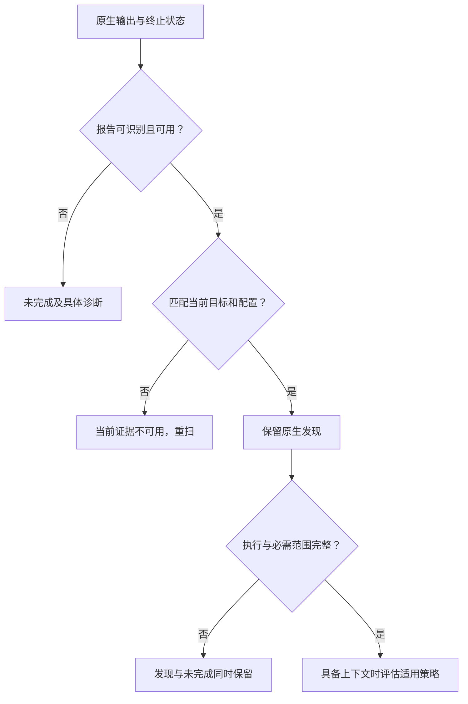
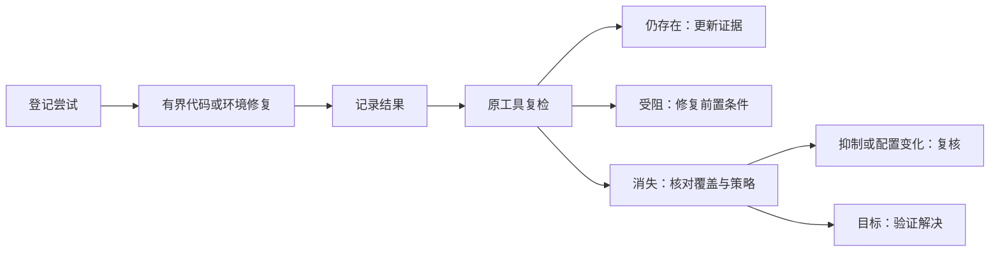
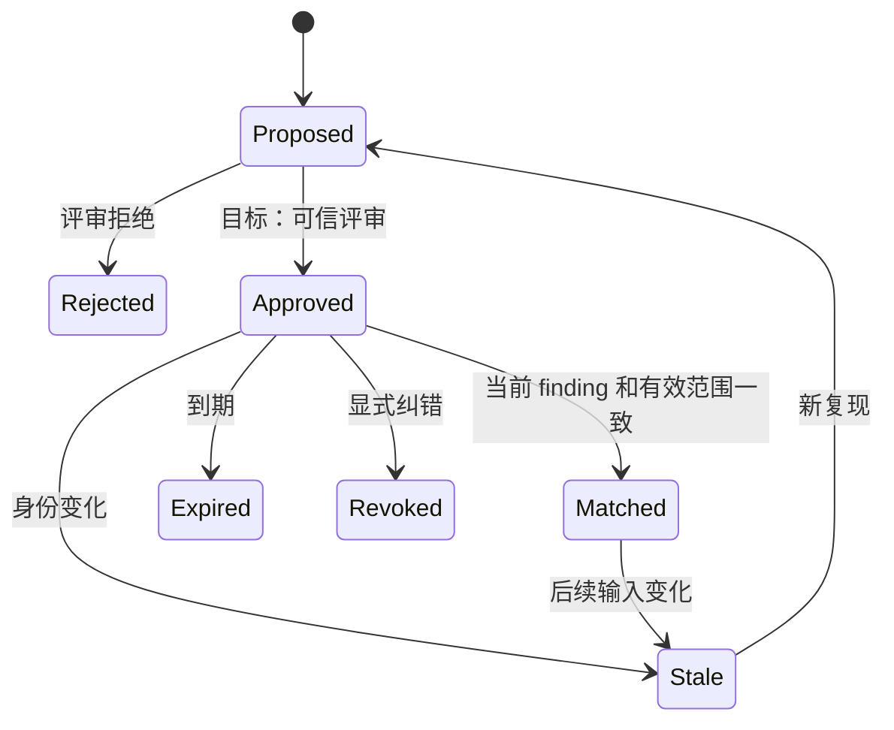
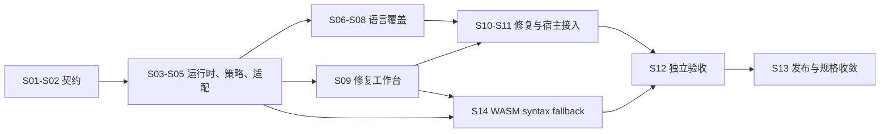
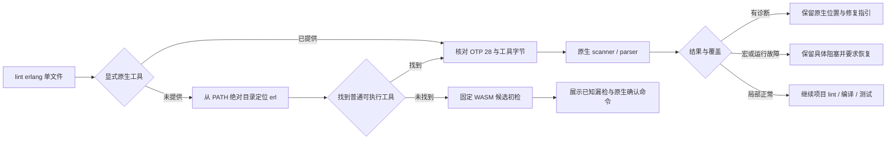
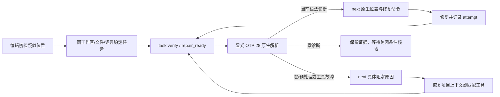
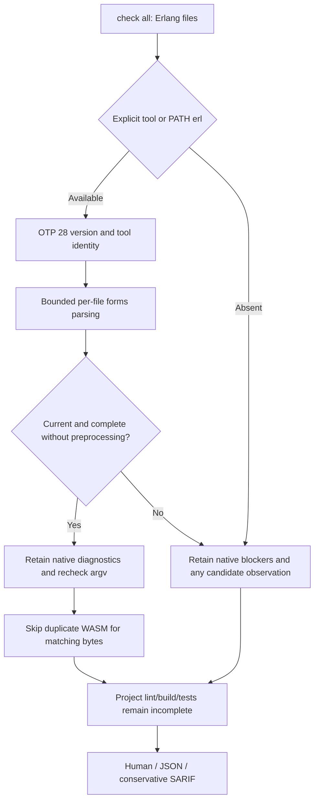

# Codeguard 技术方案与路线

> **文档说明：**将架构落实为实现契约、命令职责、扩展步骤和可观察的验收标准。
>
> **文档版本：**1.2.4 · **最后更新：**2026-10-04 · **源码基线：**当前检出版本与[实施证据](../openspec/changes/introduce-rust-codeguard-cli/implementation-baseline.md)；软件版本 `0.1.4`。

[English](Codeguard-Technical-Design.md) · [架构设计](Codeguard-Architecture.zh_CN.md) · [README](../README.zh-CN.md)

专题入口：[命令](Codeguard-Command-Reference.zh_CN.md)、[初始化](Codeguard-Project-Initialization.zh_CN.md)、[修复](Codeguard-Remediation-Workflow.zh_CN.md)、[误报治理](Codeguard-False-Positive-Governance.zh_CN.md)、[适配器](Codeguard-Adapter-Contracts.zh_CN.md)、[信任与分发](Codeguard-Trust-and-Distribution.zh_CN.md)、[验收](Codeguard-Validation-and-Rollout.zh_CN.md)、[旧协议](Codeguard-Legacy-Compatibility.zh_CN.md)。独立细节由专题维护，规格与任务由 OpenSpec 维护。

源码构建已把 ESLint 接入 `check all` 的 `node.lint` 任务图节点，与其它原生检查共用并发与截止时间。按发现的 JS/TS/TSX 文件选择最近的模块清单、本地 ESLint 10、唯一 flat config 和 Node；搜索不越过受检根。检查阶段收集报告，汇总阶段串行同步工作台，重复发现复用同一任务。每个完整且字节匹配的原生文件可免去重复 WASM；被忽略、配置错误或工具失败的文件仍保留降级与原生原因。协议为当前聚合 `check_feedback` 0.38.0（绑定和未绑定均适用）、`check_aborted` 0.13.0，原协议归档；`native_results.node_lint` 提供逐文件反馈、未执行文件、同步结果及下一步。见[验收范围](../tests/acceptance/check-all-eslint.md)。这不提升 grammar 资质或代替真实宿主验收。

当前 `config_inspection` [0.3 schema](../schemas/config-inspection-v0.3.schema.json) 增加 `project_configuration`：静态发现依据、逐构建根检查器状态、来源 SHA-256、范围阻塞和未解析条件。投影上限为 64 个构建根、256 行检查器、每个摘要表 256 项、每个诊断列表 32 项，保留实际观察总数；截断不得标记观察完整。旧 0.2 schema 保持原字节。旧 JSON 递归拒绝重复键，并由 runtime 有界普通文件读取。生效规则/抑制仍未解析，本命令不执行配置。见[验收](../tests/acceptance/config-native-observation.md)。

## 1. 范围与规格归属

既有 [OpenSpec 规范与任务](../openspec/changes/introduce-rust-codeguard-cli/proposal.md) 已整体迁入本 Rust 仓，是唯一规格与任务事实源。已实现切片和剩余工作分别记录，本文不维护第二份可独立勾选的任务。

可调用行为以当前源码为准，目标契约明确标注。产品优先级是配置发现 → 原生结果 → 有用的修复指引。内部一致性校验为这个体验服务，不要求用户手工构造执行证明。

WASM 的规范与 19 项实施任务已纳入既有 change；可选特性下的 Rust worker 与 Java/TypeScript/TSX 局部单文件候选报告及 Python Ruff 不可用时的候选报告已存在；三十二份候选 grammar 均未验收；ArkTS、C、C++、C#、Go、JavaScript、Lua、Luau、Nix、Rust、Terraform、Zig、Objective-C、Solidity、R、Ruby、PHP、Kotlin、Dart、Erlang、Pascal、CFML、CFQuery、CFScript、COBOL、Scala、Swift、VB.NET 仅有固定字节的 Rust 可加载候选资产，尚无逐语言验收的独立 lint 路由。项目级原生优先调度、grammar 版本范围验收与宿主接线仍未完成。设计示例不是当前命令输出。

源码以 `--features wasm-precheck` 构建后，可通过 `codeguard grammar probe <language> <file> --format=json` 显式调用全部 32 份固定候选资产。命令使用隔离 Rust worker，以退出码 3 报告未经语言验收的观察，不能作为 lint 或交付结论。成功观察与有效语种的输入失败都遵守[0.1.0 封闭 JSON Schema](../schemas/grammar-probe-v0.1.schema.json)，保持未完成。原生优先 `lint/check`、语言/方言验收、任务/宿主反馈及发行仍需独立完成；现有发现清单还把 JavaScript/TSX 归入 TypeScript，并未为 CFQuery/CFScript 建立独立源码映射。

首个局部原生优先入口为 Zig：`lint zig FILE --zig-tool ABS_PATH --format=json` 对选定源码字节先运行版本报告为 Zig 0.16.0 且字节保持一致的 `ast-check`；原生错误只暴露行列位置，不回显源码。未提供显式工具时，固定 Zig grammar 作为未验收候选兜底。两种结果都保持未完成，因为 AST 检查范围小于完整 lint、构建和测试；见 [0.1.0 报告 Schema](../schemas/zig-lint-feedback-v0.1.schema.json)。

固定 Zig worker 现还有真实 Zig 0.16.0 差分测试：7 份合法、4 份破损源码分别送入原生 `ast-check` 和公开隔离 `grammar probe` 路径。本机 11 份分类全部一致；这只是窄范围[精度记录](../tests/acceptance/zig-native-differential.md)，不是误报率估计或语种验收。

## 2. 技术选型与权衡

| 关注点 | 选型 / 当前证据 | 影响与替代方案 |
| :--- | :--- | :--- |
| 实现语言 | Rust workspace，edition 2024，声明 MSRV 1.85 | 统一编排实现；原生检查器保留运行时，不用手写近似规则替代原生分析器 |
| 数据契约 | `serde`、`serde_json`、版本化 JSON Schema | 结构化反馈和持久化可校验，命令专属预览协议仍并存 |
| Maven/Cargo 观察 | `roxmltree`、`toml` | 静态解析避免隐式构建；继承/有效模型须另行受控解析 |
| 输入身份 | SHA-256，其它算法用于特定互操作场景 | 摘要绑定字节，不等于授权或语义等价 |
| 进程与锁 | `std`、Unix `libc` 基础能力 | 显式归属与取消，但未认证通用沙箱或 Windows 等价行为 |
| 并发检查 | 已校验 DAG、作用域线程、资源键 | 独立检查可并行，同资源工作串行 |
| 包管理基础 | `ring`、归档库、`reqwest` 与 Rustls/Tokio | 核验和下载基础能力已存在，公开安装仍未完成 |
| 持久化 | JSON 事实/事件及 Markdown 投影 | 本地状态可审查，事务和跨机器协作需专门实现 |
| 智能体接入 | CLI human/JSON、部分 SARIF | 无模型依赖，宿主插件/MCP 接线独立推进 |

当前源码固定 WASM 伴随依赖 `tree-sitter-language=0.1.7`；0.1.8 声明 Rust 1.90，与工作区基线冲突。新增按目标/特性绑定的锁定 metadata 回归，以及独立真实 Rust 1.85 CI job，分别执行静态与编译检查。无最低版本声明依赖、完整平台/MSRV 运行验收仍未解决，见[证据](../tests/acceptance/rust-msrv-dependency-compatibility.md)。


精确依赖版本见 [Cargo.lock](../Cargo.lock)，依赖声明见四个 crate 清单。工作区当前没有公开 feature 选择矩阵、数据库服务、Web UI 或守护进程，这些模板模式不属于产品既定需求。

## 3. 命令职责契约

每条命令必须解释选择对象、读写行为、结果和下一步。只读表示不主动修改项目；原生工具仍可能具有自己的执行副作用，由适配器处理。

| 入口 | 职责与用户价值 | 副作用 / 当前实现 |
| :--- | :--- | :--- |
| `--help`、`--version` | 查询语法、二进制和协议元数据 | 只读，版本输出中的构建身份仍未核验 |
| `detect`、`capabilities` | 区分项目观察与发行能力清单 | 只读，清单条目不是认证适配器 |
| `init --dry-run` | 预览画像、图、受管文件和配置状态 | 不写项目、不执行原生构建 |
| `init --apply` | 创建/刷新自有文件和 AGENTS 上下文 | 受控本地写入，当前状态 partial |
| `config validate`、`config explain` | 解释原生/历史配置和候选策略输入 | 只读，不可信候选仍保持未完成 |
| `rules list` | 展示候选规则来源和配置缺口 | 只读，不激活规则 |
| `tools list`、`tools verify` | 查看库存、选定路径和候选身份 | 静态核对；字节一致不自动获得权威 |
| `doctor` | 定位配置和已选运行时可用性 | 当前为显式 Ruff 版本探针，不通用自动安装 |
| `tools install` | 目标是受控准备工具 | 公开 dry-run 是预览，apply 当前受阻 |
| `plan` | 解释候选义务、范围和前置条件 | 局部只读计划，不是认证执行契约 |
| `lint`、`comments`、`dependencies`、`cve`、`security`、`build` | 分离检测类别 | 仅调度器列出的组合可执行，dependencies/security 通用入口待实现 |
| `check all`、`check java` | 运行已接入路径并说明剩余类别 | 原生执行，保存和同步合格局部报告 |
| `work sync` | 导入全部可消费报告，避免遗漏另一类别 | 本地事实/事件/任务/收据写入，有界锁与重放 |
| `status`、`next`、`task show` | 汇总状态、选择动作、查看单任务 | 只读结构化事实，不自动领取或改源码 |
| `task claim`、`heartbeat`、`release` | 协调单个本地任务的执行者 | 租约文件及 generation/token/过期核对 |
| `task attempt start`、`finish` | 保存动作、输入变化和结果 | 本地事件，失败/无变化尝试也计入 |
| `task verify` | 修复后重复原检查器 | 原生执行和复检事件，不自动正式关闭 |
| `rules whitelist list`、`explain`、`propose` | 查询精确候选及提出纠错 | 默认只读；纠错 `--record` 写提案事件/附件，不批准 |
| `gate pre-commit` | 查看实际 Git index 路径安全 | 局部范围，尚非完整内容/secret 检查 |
| `fix`、`gate pre-push`、`gate ci`、`mcp serve`、`compat legacy-v1` | 目标为原生修复、交付内容和宿主互操作 | 当前不是公开可执行入口 |

真实解析入口是 [main.rs](../crates/codeguard-cli/src/main.rs)，不能按惯例猜命令。例如这里没有公开 `lint rust` 分支，Clippy 当前通过 `check all` 接入。类别登记不会使 `security all` 或 `comments java` 自动成为可调用命令。

## 4. 初始化方案

### 4.1 观察算法

1. 确定显式项目根和发现边界。
2. 枚举可识别源码路径、清单、锁文件及精确配置例外。
3. 不执行项目代码，收集内容身份与直接声明。
4. 分别保存包版本、语言目标、依赖解析版本和本机运行时。
5. 构建分类型模块边，保留继承、表达式、条件和缺目标等未解析项。
6. Dry-run 和 apply 都将同一观察返回对话。
7. Apply 时预检归属，只合并 AGENTS 受管区块，更新文件和工作区元数据，并报告可恢复的局部结果。

[初始化源码](../crates/codeguard-cli/src/init_command.rs)当前生成 project profile `0.3.0`。Maven compiler release/source/target 和 Cargo rust-version/edition 标记为 `declared_only`，不代表有效构建模型。静态图不是源码调用图。未来若接入已有 CodeGraph，必须核对新鲜度，不自动初始化索引。

### 4.2 所有权与刷新

| 情况 | 要求 |
| :--- | :--- |
| 首次预览 | 返回计划路径和观察，不创建文件 |
| 新模块或清单/锁变化 | 重算受影响画像与图，不仅比较旧路径 |
| 已有人工文本 | 保留受管区块外字节 |
| 人工改写受管内容 | 报告冲突，不盲目替换 |
| 未知 MVC/DDD 架构 | 保持未知或明确推断，不强制架构规则 |
| 缺检查配置 | 给出准备/选择指引，不生成代码违规 |
| 文件部分写入 | 报告实际结果和恢复状态，不伪称全成或全败 |

AGENTS 摘要对每类列表设上限，并链接完整结构化观察；它不是策略权威。当前 `architecture.md` 仍是未知状态投影。完整架构确认和初始化前置任务流程尚未完成。

## 5. 原生适配器契约

### 5.1 分离观察与执行

适配器有两个概念阶段：**Observe** 读取配置，识别适用性、规则声明、范围和未知条件；**Execute** 使用显式工具上下文，生成原生调用、解析协议并复核输入身份。这些职责当前分布在 adapters 和 CLI 模块，不是已经标准化的动态插件 trait。

| 契约维度 | 必须描述的内容 |
| :--- | :--- |
| 身份 | checker ID、适配器版本/身份、支持的原生工具版本 |
| 适用性 | 语言、构建根、配置状态、源集、原生前置条件 |
| 选择 | 生效规则或具体未解析原因，不擅自扩展默认规则 |
| 调用 | 绝对工具路径、字面 argv、cwd、选定环境、输入快照、deadline、输出上限 |
| 报告 | 格式/版本、原生退出契约、解析上限、规则 ID 和位置 |
| 归一化 | 问题与执行完整性分离，保留原生严重度 |
| 修复 | 支持的稳定身份、准备情况、简报和复检配方 |
| 一致性验收 | 正例、反例、坏输入、中断、输入变化和真实工具用例 |

### 5.1.1 扩展接口与输出边界——逻辑设计

以下是职责签名，不是现有公共 Rust trait，也不要求创建空实现：

```text
Adapter.descriptor() -> CapabilityDescriptor
Adapter.discover(observations) -> ApplicabilityEvidence
Adapter.resolve(context, policy, toolchain) -> ResolvedCheck
Adapter.plan(resolved_check) -> AdapterPlan
Adapter.parse(raw_artifacts, termination) -> ParsedEvidence
Adapter.verify_coverage(plan, evidence) -> CoverageAssessment
Adapter.plan_fix(finding_set, context) -> FixPlan
ExecutionPort.run(process_spec, cancellation) -> ToolExecution
SnapshotPort.capture(content_request) -> SnapshotLease
EvidenceStore.persist(raw_evidence) -> EvidenceRef
CachePort.lookup(validated_identity) -> VerifiedCacheEntry | Miss
```

自有检测编排、解析与策略逻辑由 Rust 承担，Node 只作发行入口。适配器通过 runtime 请求 I/O，不私下执行进程、联网或修改文件。当前应用编排实际在 CLI，不能把上面的目标接口误写成 core 已经协调全部 I/O。

目标结构化 stdout 仅有一个报告，进度/工具日志进入 stderr 或私有日志；输出文件原子落盘失败须反馈未完成并保留检查结果。SARIF 保留发现及运行失败通知，不能用零 results 隐藏 incomplete。归并只针对同工具或显式映射的等价规则，保留原始记录和次数，不按消息相似度跨工具合并。

### 5.2 本基线原生路径

| 生态 | 适配行为 | 不能宣称 |
| :--- | :--- | :--- |
| Maven/P3C | 发现 Maven 检查声明，用显式 JDK/仓库上下文运行选定探针 | 仅 `mvn verify` 成功就证明全部规则执行 |
| Javadoc/Checkstyle | 在支持配置与范围内解析原生文档诊断 | 缺类路径或不支持 XML 属性就是源码违规 |
| Ruff | 原生 lint、部分设置/规则核对及抑制对照 | 全部 Ruff 规则/配置形态都是完整质量策略 |
| Cargo | Clippy、库目标 Rustdoc、all-targets 类型检查、cargo-audit 观察 | 类型检查运行了测试，或全部 workspace/features 已验证 |
| ESLint | 显式 Node/入口/config/cwd 或配置映射，读取 JSON/settings | 执行配置等同安全的静态发现 |
| npm | 将 audit 观察绑定到支持的 package-lock 输入 | 缺图或旧图能证明依赖干净 |
| pip-audit | 标准 pylock 快照与组件匹配 | uv/Poetry 锁可直接替代 PEP 751 输入 |
| Go vet | 有限范围原生 JSON 观察 | 覆盖全部 Go 分析器和 build tag 组合 |

新增适配器时先定义契约、实现静态观察，再增加解析夹具及显式执行，最后接命令、schema、反馈、稳定任务和复检。通过相关验收后才登记可执行能力，不能只增加清单行。

### 5.3 原生优先与语法兜底选择——目标，尚未发行

拟议路径扩展已有的 `codeguard lint java .`、`codeguard lint typescript .` 和 `codeguard check all .`，不要求调用者选择 WASM。在实现和验收前，仍须使用当前适配器参数/前置条件；公开 `0.1.3` 仅包含有界、未验收的候选路径；`0.1.2` 不含。架构文档 **8.1–8.3** 负责组件边界与执行图，本节定义算法。


1. 逐模块发现源码范围、语言版本/方言、已配置检查器和明确的原生义务。区分“不在 PATH”与“未安装”；先检查选定的项目本地工具及支持的构建集成，再判定工具缺失。
2. 原生工具及配置有效时运行原生检查，保留原生发现。不能在原生违规后降级 WASM。配置/运行失败时保留故障，可附带初检结果。
3. 否则选择经验证的模块/方言 grammar，核对资产身份并运行有界语法工作进程。分别统计已检查、不支持、排除及失败范围。`ERROR`/`MISSING` 观察仍是疑似问题。
4. 范围完整且未发现异常时推荐准备原生工具；发现异常时必须准备工具并进行适用的原生确认。未完成/不支持时要求恢复有效检查能力，不制造源码违规。已有必需原生义务在所有情况下都保持必需。
5. 已有工作区时同步合格观察并返回简报。可选准备保持建议项，不成为阻断任务或被 `next` 反复选择。复用模块/检查器准备任务，关联疑似观察，不为每一行创建安装任务。同步失败返回独立诊断，不编造任务 ID。
6. 准备后，使用原项目配置和当前输入验证。原生零诊断只有在确实覆盖同一语法能力与源码范围时，才能构成反证。安装、切换 grammar 或后续初检正常本身，均不能关闭必需原生确认任务。

语言没有受支持的原生复核适配器时，返回具体能力缺口及可处理的环境/决策任务，不反复推荐不存在的工具。“必须安装”也包括恢复正确运行时、项目依赖或配置；遵循项目声明版本和包管理器，在用户已有授权范围内修改。

当前 core 已实现局部的纯准备动作选择：输入经上游核对的原生阻塞种类、完整初检聚合及既有必需义务；只有非空且全部合格的 clean 才可选推荐，坏配置/执行失败分别要求修复，不建议重复安装。它尚未连接真实工具发现、CLI 报告或工作台任务，因此不表示自动安装建议已经交付。见[局部验收](../tests/acceptance/syntax-setup-guidance-candidate.md)。

| 设计字段 | 含义 |
| :--- | :--- |
| `backend` | `native` 或 `wasm_precheck`，本次观察来源 |
| `precheck.status` | `not_run`、`clean`、`suspected_issue`、`incomplete`、`unsupported` |
| `native.status` | `not_run`、`completed`、`incomplete`，另列 `missing_runtime` 等原因 |
| `scope` | 选中/已检查/未解析文件或区域，附排除与原因计数 |
| `observations` | 源码位置、解析器/规则身份，以及疑似/已确认分类 |
| `setup.requirement` | 需要准备时为 `recommended` 或 `required`，同时给出原因 |
| `task_id` | 真实持久化任务，否则为 null；不声称已取得关闭收据 |
| `delivery` | 独立评估，初检不能制造交付许可 |

部分文件有疑似异常、另有文件未解析时，总体为 `incomplete`，同时保留所有可用疑似观察。`clean` 要求选定范围非空且全部完成检查。

这些是目标语义字段，尚非已发行的项目级 lint/check 报告。局部的[候选初检 schema](../schemas/syntax-precheck-candidate.schema.json) 与 [Rust 严格读者](../crates/codeguard-adapters/src/syntax_precheck_candidate_report.rs)已绑定源码 SHA-256、固定 grammar 身份和文件方言，重新计算状态，并拒绝未知版本及伪造的 `clean`。可选 CLI 的 [TypeScript](../schemas/eslint-local-feedback-v0.3.schema.json)、[TSX](../schemas/eslint-local-feedback-v0.4.schema.json) 与 [Java](../schemas/java-syntax-precheck-feedback-v0.1.schema.json) 单文件生产端已提供恢复位置和准备指引。TypeScript/TSX 在已初始化工作区改用[反馈 0.5.0](../schemas/eslint-local-feedback-v0.5.schema.json)，按源码范围关联一张稳定的原生确认任务；[0.2.0 准备报告](../schemas/eslint-preparation-observation-v0.2.schema.json)以源码和 grammar 身份保存有界疑似位置，并通过报告摘要关联到任务；宿主渲染和能力匹配原生关闭仍未接通。内置 grammar 仍是未验收候选，因此不能返回 `clean`。保持既有退出语义：必需原生执行缺失仍为未完成（`3`）；解析器疑似问题本身不是已确认违规（`1`）。若未来增加独立语法操作，其成功必须限定为语法初检；本文不宣称已有 `syntax` 命令。

源码构建的 `check all` 现另有较窄的真实项目报告：先执行原生适配器，再由[有界源码路由](../crates/codeguard-cli/src/check_syntax_candidates.rs)选择固定 worker 候选。[当前 0.38.0 封闭 Schema](../schemas/check-feedback-v0.38.schema.json)包含逐文件原生优先计数和所选 grammar 的有界已知限制；[0.33.0](../schemas/check-feedback-v0.33.schema.json) 保留为历史协议。Ruff、已确认包范围的 Go vet 和本地 ESLint 仅在本轮原生检查完整且源码摘要匹配时跳过该文件的重复 WASM；P3C 等规范检查不能冒充语法确认。默认终端输出也最多显示 8 条候选的固定已知限制；宿主自动交付仍待完成。下面仅摘录字段，不是完整 `check_feedback` 实例：

```json
{
  "schema_version": "0.38.0",
  "command_status": "incomplete",
  "delivery_decision": "incomplete",
  "syntax_candidates": {
    "status": "observed_partial",
    "execution_phase": "after_native",
    "authority": "candidate_unqualified",
    "delivery_decision": "incomplete",
    "native_preferred_count": 1,
    "observations": [
      {"path": "src/view.tsx", "language": "tsx", "status": "candidate_observed", "grammar_qualified": false, "recovery_count": 0, "known_limitations": ["Rust loader smoke passed; TSX language versions, JSX dialects, isolation and syntax corpus are not yet validated"]}
    ],
    "next_action": "交付前运行适用的原生检查器"
  }
}
```

实际报告还包含原生结果、源码与 grammar 摘要、片段偏移、有界原文件恢复坐标、未执行数量和未解决义务。完整 `<cfquery>` 标签体可作嵌入候选；普通 SQL 和有歧义的 C/C++ 头文件不猜测。自动 `.m` 路由要求 Objective-C 行首标记，`.sc` 与 SuperCollider 共用后缀，缺少项目证据时保持未解析。只读发现现在使用相同的有界 `.m` 证据，把共享后缀的未判定路径记入 `unknown_conditions`；`check all` 仍将其计入未路由数量。共享判别器现跳过 MATLAB `%{ ... %}` 块注释内看似 Objective-C 的行首标记，未闭合块也不猜测，同时保留块外真实标记。这消除一类误路由，但不是完整 MATLAB 词法器。项目级方言依据及逐文件结构化歧义报告仍待完善。本机四批 32 份 grammar 的 CLI 样例约 54 秒；此前串行实现的 Linux 单次 31 文件检查在 90 秒内完成 26/32；语言版本语料、原生差分对照、任务同步、宿主交付和发行包验收仍待完成。

对于单个混合语言项目，候选阶段最多规划 64 个片段，再按不超过 `--jobs` 且最多两个隔离 worker 的批次执行。所有 worker 共用原 90 秒候选截止时间，成功结果若在出报告前发现源码变化就作废。本机 31 文件样例观察到全部 32 种固定候选且未跳过片段；源码提交 `ff60184` 的 Linux WASM 集成步骤已通过同一单项目测试；完整 CI 已通过，资源画像仍待验收。

Java 的 [javac 21 `--release 17` 对照](../tests/acceptance/java-native-differential.md)接受 8 例合法、拒绝 5 例破损语法源码，与隔离 WASM worker 分类一致。该测试仅固定窄范围分类；项目级原生路由、版本覆盖和误报率仍待验收。

当前 [Kotlin 2.4.10 差分](../tests/acceptance/kotlin-native-differential.md)记录 11 例可判定的一致结果与 2 例隐藏错误导致的未知。`fun f(x: ) = x` 和合法 `object C { val value = 1 }` 都没有可枚举恢复节点，但扫描未完成。`grammar status` 与 `check all` 保留有界限制；未知样例留在语料总分母中并单独报告，不能计作通过、一致或已确认源码违规。

可选特性构建的 CLI 在无显式原生上下文的 TypeScript 单文件请求中，先核对本地 ESLint 10 包及唯一普通 flat config。若从 `PATH` 解析到可执行 Node，就调用既有有界原生版本与报告探针；缺 Node 时报告准备缺口，不让 WASM 抢跑。仅未观察到本地 ESLint 包时，`.ts/.mts/.cts` 输出 [ESLint 反馈 0.3.0](../schemas/eslint-local-feedback-v0.3.schema.json)，`.tsx` 用独立 grammar 输出 [0.4.0](../schemas/eslint-local-feedback-v0.4.schema.json)。候选初检保留 `native=not_run`、`delivery=not_evaluated`，即使零恢复节点也保持未完成。配置选择歧义、本地路径不可信或包身份损坏时保留环境阻塞而不启动 WASM；部分显式上下文也沿用原路径。该增量不证明项目脚本参数等价、逐模块调度或宿主对话交付，见[原生优先局部验收](../tests/acceptance/native-first-eslint-candidate.md)。

### 5.4 Grammar 引入与运行生命周期——目标

只引入固定 WASM 字节及上游许可证、提交/补丁来源、SHA-256、ABI、已验证运行时和语言/方言范围、语料引用与已知缺口。逐个验证 CodeGraph 资产与选定 Rust Tree-sitter 运行时兼容，不能复制 TypeScript 提取逻辑或把 CodeGraph 支持等同语法验收。发行清单属于分发资产，不属于可写的 `.codeguard/` 项目状态。

可用 `codeguard grammar status --format=json` 查询独立的来源覆盖库存。它只读报告 CodeGraph 32 种独立 grammar、CodeGuard 三十二份资产候选（ArkTS、C、C++、C#、Go、Java、JavaScript、Lua、Luau、Objective-C、Python、Rust、Solidity、TypeScript、TSX、Zig、Nix、Terraform、R、Ruby、PHP、Kotlin、Dart、Erlang、Pascal、CFML、CFQuery、CFScript、COBOL、Scala、Swift、VB.NET）和零项已发行能力，不运行解析器；Python 已有源码可选构建中的局部 `lint` 兜底，结果不能视为通过。已绑定工作区的单文件反馈使用 [0.15.0 协议](../schemas/python-lint-feedback-v0.15.schema.json)，并通过现有 work sync 保存 [0.1.0 确认观察](../schemas/python-syntax-confirmation-observation-v0.1.schema.json)。任务身份绑定工作区和源码范围；导入前核对当前源码 SHA-256 与固定 grammar。能力匹配的原生关闭仍未完成。C、C++、C#、Go、JavaScript、Lua、Luau、Rust 的随仓字节和上游许可证已固定，完成窄范围 Rust worker 解析验证，尚无逐语言验收的独立 lint 路由或语言验收。ArkTS、Nix、Terraform 的来源、许可证、字节及 Rust 正反例也已固定，仅为候选，尚无逐语言验收的独立 lint 路由或发行验收；见[局部验收](../tests/acceptance/arkts-nix-terraform-grammar-candidates.md)。依赖提供的 Objective-C 与 Solidity 已固定原始和适配后字节、许可证及依赖包完整性，但仍未验收语言版本或公开 lint 路由；COBOL 现可在 20 MiB 输入限额下加载，但冷启动与内存预算未验收。

R、Ruby、PHP、Kotlin 也已固定 CodeGraph 字节、许可证和 Rust 实测 ABI，并通过隔离 worker 的窄范围正反例；PHP 样例覆盖 HTML/PHP 混合内容，仍仅为未验收候选。CodeGraph 原 Dart WASM 仍不能由 Rust 直接加载；CodeGuard 现以固定上游 C 源码和真实外部 scanner 经 Zig 可重复构建，再做固定 WASI 导入适配。Rust 加载与隔离 worker 的窄范围测试通过，但公开 lint 与发行仍未验收；见[Dart 重建局部验收](../tests/acceptance/dart-grammar-rebuild-candidate.md)。Erlang 也已固定 CodeGraph 字节、上游 0.19 许可证及 ABI 14，Rust 与隔离 worker 的窄范围样例通过；原生对照和公开 lint 路由尚缺，见[Erlang 候选局部验收](../tests/acceptance/erlang-grammar-candidate.md)。Pascal 已固定 CodeGraph 字节、原始 Isopod 依赖提交和许可证，ABI 14 及窄范围 worker 样例通过；原生对照和公开 lint 尚缺，见[Pascal 候选局部验收](../tests/acceptance/pascal-grammar-candidate.md)。其余七份 CFML/CFQuery/CFScript/COBOL/Scala/Swift/VB.NET 来源 WASM 也已固定并由 Rust worker 加载，累计 32/32 份候选、0 项已发行。CFQuery 漏掉 `SELECT FROM`，VB.NET 对合法未缩进方法体误报，COBOL 成本高；都不能发布为 lint，见[七份局部验收](../tests/acceptance/final-seven-grammar-candidates.md)。

当前源码构建的 `grammar status` 报告协议升级为 1.1.0，逐候选投影固定清单中有界的 `known_limitations`，包括[VB.NET 误报复现](../tests/acceptance/vbnet-unindented-method-false-positive.md)。清单校验会在文本进入智能体反馈前拒绝过长、过多或包含控制字符的条目。这仍是只读风险提示，不能把恢复节点升级为源码违规或关闭原生确认任务。见[投影局部验收](../tests/acceptance/grammar-known-limitations-projection.md)。

CFQuery 源码路由现跳过嵌套 CFML 注释、普通标签属性与明确 CFScript 体中的假标签；HTML 注释中的 CFML 标签仍保留，因为 [Adobe 的 CFML 注释语义](https://helpx.adobe.com/coldfusion/developing-applications/the-cfml-programming-language/elements-of-cfml/comments.html)不把普通 HTML 注释当作服务端屏蔽。真实开标签属性中的 `>` 和开标签内的嵌套 CFML 注释也不再截断查询体。此修复避免一类误路由，同时不隐藏可能执行的 CFML 标签；CFQuery grammar 对 SQL 的漏检仍存在，见[标记边界回归](../tests/acceptance/cfquery-markup-boundary.md)。

Go 1.23.4 原生 `gofmt -e` 差分语料现将 8 份合法、5 份破损源码与隔离 Go WASM worker 逐例比较，本机 13 份语法分类一致。这只是窄范围语法 oracle，不代表类型检查、`go vet`、总体误报率测量或 grammar 已验收；见[Go 差分验收](../tests/acceptance/go-native-differential.md)。

JavaScript 模块语料也用 Node 24.18.0 `--check --input-type=module` 与隔离 JavaScript worker 对照 8 份合法、5 份破损源码，本机 13 份分类一致。固定 worker 语料可进入常规 CI；原生对照因宿主 Node 版本不同而需显式运行。这不验收 JSX、TypeScript、ESLint 规则或整个 JavaScript 生态；见[JavaScript 差分验收](../tests/acceptance/javascript-native-differential.md)。

`check all` 的 Go 路径现仅在 Go 1.23.4 `go vet` 完成、受控 `go list -json ./...` 证明文件进入同一默认构建范围，且源码、模块与工具身份均匹配时，跳过该文件的重复 WASM。构建标签排除的文件仍进入候选 worker；包清单越界或输入变化不能触发跳过。真实 Go 集成与伪造范围回归已覆盖边界，但整体交付仍未完成；见[Go 原生优先验收](../tests/acceptance/check-all-native-preferred-go.md)。

Rust 2021 的 `rustfmt 1.9.0 --emit stdout` 与隔离 Rust worker 对 8 份合法和 5 份破损语法样例分类一致；这份有界的[Rust 差分记录](../tests/acceptance/rust-native-differential.md)不等于 Clippy、完整编译或其它 edition 已验收。

C11 的 `Apple clang 21 -fsyntax-only` 与隔离 C worker 对 8 份合法和 5 份语法破损样例分类一致。初版语料曾误把返回类型错误当成语法错误，现已改成缺失初始化表达式；这份有界的[C 差分记录](../tests/acceptance/c-native-differential.md)不等于语义诊断、C lint 或其它语言版本已验收。

Ruby 2.6.10 `ruby -c` 与隔离 Ruby worker 在 13 例窄范围语料上分类一致，固定 worker 语料进入常规 CI；这不等于 Ruby lint 或其它版本验收。相反，Apple Swift 6.4 `swiftc -frontend -parse` 把 `func f(_ x: ) {}` 判为缺少参数类型，固定 Swift WASM 却没有恢复节点。纠正后的 Swift 13 例差分为 12 例可判定的一致结果与 1 例隐藏错误导致的未知；缺类型样例保持未完成，不按空恢复数组分类，候选仍不可签发语法通过；见[Ruby](../tests/acceptance/ruby-native-differential.md)与[Swift](../tests/acceptance/swift-native-differential.md)局部记录。

由父进程控制解析工作进程，设置总截止时间、单文件输入上限、内存/进程限制及诊断数量上限。按需加载 grammar，不提供通用网络/文件系统导入；终止卡住的进程时保留其它模块的原生结果。宿主约束执行和 Rust MSRV 兼容性须测试，生产数值预算须经测量后确定，不编造性能承诺。

可选构建特性下，Rust CLI 现在有私有[候选工作进程](../crates/codeguard-cli/src/syntax_worker_command.rs)与[父进程核验器](../crates/codeguard-cli/src/syntax_worker_runner.rs)。Unix 路径复用现有进程组执行内核，源码输入上限 1 MiB、输出上限 64 KiB，沿用调用方截止时间和取消，并重新核对源码/grammar 摘要与恢复位置。这只是已测试的局部契约：经目标平台实测的内存上限、跨平台强制约束、正式 lint/check 路由与发行打包仍缺；候选 grammar 即使无恢复节点也保持 `incomplete`。

缓存键包含源码内容、方言/语言画像、grammar 字节、解析运行时、查询/规则版本及相关范围/配置身份。取消、局部输出和未解析覆盖不能产生可复用的干净结果。资产替换使相关缓存和处置失效。按验证过的清单回滚语言包，保留历史观察，不根据删除缓存推断问题已解决。


## 6. 静态检测能力目录

[28 个检测族](../crates/codeguard-core/src/capability_dimensions.rs)避免将不同检查压成笼统 lint 结果。

| 类别 | 检测族 | 扩展契约 |
| :--- | :--- | :--- |
| `lint` | syntax、style、type、dataflow、complexity、duplication、dead_code、architecture、api_compatibility、schema | 原生规则配置和正确源集 |
| `comments` | api_docs、comment_policy、doc_links | 可确定验证的文档规则，主观写作质量保持建议 |
| `dependencies` | graph、versions、licenses、sbom、provenance | 实际解析组件身份及工具专属依据 |
| `cve` | advisory | 组件/版本/依赖图，以及漏洞公告来源和时效 |
| `security` | sast、secrets、iac、container、config、policy | 每个工具的范围与敏感数据处理 |
| `build` | compile、reproducibility、manifest | 明确构建/测试等级，不在 lint 下隐式升级动作 |

这些是目标覆盖槽位，已有路径仅覆盖 README 标明的子集。Security、IaC、container、SBOM 等不能因已登记而宣传为已实现。语言扩展应调用生态原生工具，无合适适配器时明确能力缺口。

## 7. 结果归一化与对话反馈

### 7.1 映射规则



不根据 `error`、`warning`、`BUILD SUCCESS` 等通用词猜测通过或失败。由工具专属解析器判断退出码和报告的组合语义。原生进程先输出完整且绑定当前输入的报告、随后异常退出时，可保留问题但仍未完成。单体 JSON 截断时不能从前缀猜造 finding。

### 7.2 反馈契约

| 字段组 | 回答读者的问题 |
| :--- | :--- |
| 选择和配置 | 选择哪个语言/类别/构建根，检查器是否配置？ |
| 发现 | 检查器/规则、位置/组件和严重度是什么，语法观察是疑似还是已获原生确认？ |
| 执行/完整性 | 初检/原生执行是否结束，覆盖哪些范围，还有什么未知？ |
| 持久化状态 | 本地报告是否保存/同步，失败能重试什么？ |
| 下一步 | 修源码、推荐/要求准备原生工具并确认、恢复配置、重扫，还是提出具体决策？ |
| 交付 | 只是局部观察，还是完整评估的交付结果？ |

[RunReport 解析](../crates/codeguard-cli/src/run_report.rs)支持通用结构化契约，[检查编排](../crates/codeguard-cli/src/check_command.rs)当前输出 `check_feedback` `0.38.0`，绑定状态独立表达，适配器另有专属版本化局部观察。消费者必须按协议身份与版本分派，不能假定统一 JSON 形状。当前 human 输出以中文为主，英文文档不代表运行时消息已有英文国际化。

### 7.3 对话报告示例——目标呈现

以下四例是合成的呈现设计，不是 CLI 实际输出、已确认的产品发现，也不代表运行时已支持英文国际化。源码路径和任务 ID 均为示意。真实反馈须使用实际范围、观察及已持久化任务 ID。优先顺序为：简短结论 → 方式/范围 → 原生状态 → 问题依据 → 下一步 → 任务/覆盖边界。不以内部收据、摘要值或无条件的“通过/失败”开头。

**A. 缺少原生工具且有疑似语法异常：必须复核。**

```text
Codeguard：Java 语法初检发现 1 处疑似异常

检查方式：内置 Tree-sitter WASM
检查范围：选中并检查 18 个 Java 文件；未解析 0 个
原生检查：未执行，项目要求的 JDK 不可用
位置：src/main/java/example/UserService.java:42
观察：解析器在此处恢复了一个缺失语法节点

下一步（必须）：
1. 准备项目声明版本的 JDK 和适用的原生检查器。
2. 执行覆盖此文件及 Java 语法的原生复核。
3. 根据原生诊断修复，再次检查。

关联任务：CG-example-java-setup（示意；仅同步成功后输出真实任务）
复检入口（准备原项目工具/配置上下文后）：
codeguard task verify CG-example-java-setup . --format json
该位置尚未确认为代码违规，交付未评估。
```

**B. 缺少可选原生检查器，范围完整且初检正常：推荐安装。**

```text
Codeguard：已检查范围内未发现语法异常

检查方式：内置 Tree-sitter WASM
检查范围：选中并检查 18 个 Java 文件；未解析 0 个
原生检查：未执行，本例项目尚未配置原生检查
下一步（推荐）：配置并准备项目适用的原生检查器。

本次未检查类型、项目规范和依赖安全。
这是语法观察，不是完整 lint 或交付通过结论。
```

项目已有必需原生 lint 时，应将下一步改为“必须”并列出声明依据，不能沿用 B 例的可选措辞。

**C. 初检无法完成：覆盖缺口，不是源码违规。**

```text
Codeguard：语法初检未完成

检查方式：内置 Tree-sitter WASM
检查范围：选中 18 个 Java 文件；已检查 17 个，未解析 1 个
已完成范围：这 17 个文件未观察到语法异常
未解析：src/main/java/example/PreviewFeature.java，工作进程超时
原生检查：未执行，所需 JDK 不可用
下一步：恢复原生检查能力；另外定位解析器超时原因。

不从超时推断源码违规，也不能报告全部文件正常。
```

Grammar/版本不兼容是另一类原因，不能从超时猜测。嵌入语言区域不支持时，同样须列出未覆盖区域，不能把整个文件标成正常。

**D. 原生 lint 已产生诊断：直接给修复指引。**

```text
Codeguard：原生 lint 发现 1 项问题

检查方式：ESLint，使用项目选定配置
检查范围：选中并检查 12 个 TypeScript 文件
原生执行：已完成
位置：src/example.ts:8
规则：no-unused-vars
观察：局部变量 unused 已声明但未使用
下一步：核对变量用途，删除不必要的声明或补齐实际使用，
然后使用相同项目配置与同一检查器复检。

该结果仅覆盖选定 lint 范围，交付未评估。
```

原生执行后续失败或输出截断时，须改写执行/完整性状态，只保留可独立使用的诊断，不能继续写 D 例的“已完成”。CVE 等其它类别应替换为实际组件/版本/规则及漏洞库覆盖；漏洞库覆盖未知的零 advisory 观察不能写成“安全”。

**E. 提交前暂存区安全预览：只看暂存路径。**

```text
Codeguard：1 个暂存路径需要处理

范围：本轮 Git index；已观察 1 个条目，发现 1 项路径违规
路径：.env
规则：仓库路径安全
对象核验：普通 Git blob 已核对
下一步：从暂存区移除敏感路径，再重新运行预览。

源码 lint、依赖检查和完整提交门禁均未执行。
交付未评估；此预览不能授权提交。
```

本例同样是展示设计，不是捕获的实际输出。真实 Hook JSON 携带 index 摘要、违规总数、最多展示 32 条路径及截断标志。观察的 index 可与工作树不同，也可通过 `GIT_INDEX_FILE` 指定。

**F. Stop 指引：只读修复交接。**

```json
{
  "execution": "read_only_guidance",
  "local_feedback": {
    "report_type": "hook_next_guidance",
    "disposition": "verification_required",
    "reason": "no_tasks_without_fresh_full_gate",
    "task_id": null,
    "checker_id": null,
    "step": null,
    "next_actions": [["codeguard", "check", "all", "."]],
    "source_check": "not_run",
    "authority": "local_unverified",
    "delivery_decision": "not_evaluated"
  }
}
```

这是当前 0.3 外层响应的节选，不是完整 schema 实例。它只建议执行新鲜完整检查，不表示无问题。Stop 不执行 `next_actions`；记录数或字节超预算返回 `not_run/guidance_scope_exceeded`。提示事件仍未执行，须先获得可用意图上下文和宿主侧重复消息限流能力。

**G. 修复就绪：按原检查器复检，仍属本地未验证。**

```json
{
  "execution": "task_verification",
  "local_feedback": {
    "report_type": "hook_task_verification_summary",
    "task_id": "CG-51d2afe0f8e8b55fe53db2ca33214220",
    "checker_id": "python.ruff",
    "observation": "candidate_absent_unverified_policy",
    "event_persisted": true,
    "reason": null,
    "scan_report_available": true,
    "authority": "local_unverified",
    "delivery_decision": "not_evaluated"
  }
}
```

这个示意节选采用真实 Ruff 消除 F401 诊断后的复检分类，并不声称任务已关闭：原任务事实仍保持 open，须完成受策略约束的关闭流程。0.4 外层响应限制子进程输出；任务不存在、超时或报告不可信时只返回未完成原因。

### 7.4 结构化简报与宿主交付——拟议契约

以下 JSON **仅是设计示例**，不是现有 `check_feedback` schema，也不能输入 `work sync`。它示意一个已初始化工作区中的合成任务已经成功持久化，真实资产/run/输入身份保留在完整报告中。实施前须在既有 OpenSpec change 内明确协议名称/版本及 schema。

```json
{
  "example_only": true,
  "backend": "wasm_precheck",
  "precheck": {
    "status": "suspected_issue",
    "scope": {"selected_files": 18, "checked_files": 18, "unresolved_files": 0}
  },
  "native": {"status": "not_run", "reason": "missing_runtime", "tool": "jdk"},
  "observations": [{
    "classification": "suspected_syntax",
    "path": "src/main/java/example/UserService.java",
    "line": 42,
    "recovery_node": "MISSING"
  }],
  "setup": {"requirement": "required", "reason": "native_confirmation_needed"},
  "task_id": "CG-example-java-setup",
  "next_action": "prepare_native_checker_and_recheck",
  "delivery": "not_evaluated"
}
```

插件经宿主支持的 API，将结构化字段渲染为有界工具结果/上下文消息；写入 JSON 或 `.codeguard/` 本身不等于已送达对话。先反馈初次简报，之后仅反馈范围、发现、准备要求或任务状态变化。稳定未变的要求通过 status 可见，不反复打断。只链接实际存在的报告/任务文件；原始日志与源码摘录须限量脱敏，不能执行源码或诊断文本中的指令。

全部维护中的文档统一采用以下报告审查规则：区分已安装/已配置/已执行/已完成；说明局部/空范围；执行失败时保留合格发现；标注示意路径与任务 ID；区分疑似语法与原生诊断；区分建议安装与必须复核；暴露同步失败；保留类别专属覆盖边界。不改写历史验收输出来迎合新的呈现格式。

### 7.5 协议版本与身份闭包

当前通用 `RunReport` 为 `1.4`，聚合 `check_feedback` 为 `0.38.0`（绑定状态独立表达），`check_aborted` 为 `0.13.0`；适配器局部观察另有版本。版本属于具体协议，不能因为软件是 `0.1.0` 而统一改写。上面的对话/JSON 简报是目标示例，不是这三个协议的完整实例。

目标证据链关联 workspace/request/run/obligation/finding/task/attempt；源码定位使用可逆路径表示与内容身份，依赖定位使用组件、解析版本、图和 advisory。非 UTF-8 路径不能经有损显示字符串参与匹配。摘要只能绑定字节，不能证明字节来源已批准。报告升级保留旧字段的版本语义，不将旧空 findings 升格为完整通过。

## 8. 持久修复与尝试记录

### 8.1 稳定身份和导入

现有 finding 通常绑定检查器/规则、项目相对目标及源码/内容锚点，行号不是唯一身份。跨工具去重、重命名匹配和全部依赖身份尚未通用实现，歧义匹配不能静默关闭旧任务。

`work sync` 应处理全部可用报告，绑定 workspace/run/content，先写事实、事件和投影，再记录消费。当前已有本地互斥和部分重放场景，完整磁盘故障与任意崩溃点原子性仍待验收。

### 8.2 修复简报

| 必需部分 | 含义示例，不是实际已存任务 |
| :--- | :--- |
| 问题证据 | 当前源码位置上的原生缺文档规则 |
| 规则依据 | 原检查器、启用规则和配置来源 |
| 允许范围 | 受影响符号/文件，或环境前置条件 |
| 修复步骤 | 补充准确 API 文档，或恢复缺失运行时 |
| 复检命令 | 使用原上下文的同一受支持 Codeguard/原生检查路径 |
| 历史尝试 | 修改、失败、无进展和待验证情况 |
| 关闭条件 | 当前原工具结果及未改变的必需覆盖 |

智能体不能执行诊断文本或 Markdown 中的指令，`next` 使用结构化观察和固定指引。无进展应导向更具体的诊断，而非自动放松规则。

### 8.3 关闭目标



当前 `candidate_absent_unverified_policy` 不等于解决。`noqa`、Clippy allow 或 Checkstyle 配置变化可能隐藏规则，部分路径已有对应检测。环境恢复后最终还须重跑原先受阻的质量义务。完整验证关闭、复发与事件协调仍是目标工作。

## 9. 误报白名单与纠错体系

### 9.1 选择正确的纠正方式

| 根因 | 正确动作 | 禁止混淆 |
| :--- | :--- | :--- |
| 原生工具误判某个精确输入 | 复现并提出限定范围的 `false_positive` 决策 | 禁用整个检查器或目录 |
| Rust 适配器误读输出、路径、启用规则 | 修适配器并加入回归夹具 | 用白名单遮盖实现错误 |
| 某类项目不适用规则 | 用正反例评审规则包/策略适用性 | 堆积通配例外 |
| 真实问题被明确接受 | 按独立策略记录 `accepted_risk` | 改称误报 |
| 工具、漏洞库或配置不可用 | 准备任务与未完成状态 | 用例外认证覆盖完整 |

### 9.2 身份与生命周期

当前 [FalsePositiveIdentity](../crates/codeguard-core/src/false_positive_allowlist.rs)匹配：

- `finding_id`、`checker_id`、`native_rule_id`、`category`；
- 源码目标的 `path` + `file_sha256`，或依赖的 `component` + `version` + `graph_sha256` + `advisory_id`；
- `finding_fingerprint`、`tool_sha256`、`adapter_sha256`、`rulepack_sha256`。

批准范围、策略修订、决策/引用身份和有限期限在[交付判定](../crates/codeguard-core/src/delivery_gate.rs)中单独处理。身份匹配成功不等于批准。源码字节、工具或规则包变化使旧精确匹配失效，交互应解释变了哪个字段并提出复核，不要求用户计算摘要。



这是目标生命周期。当前 CLI 提供候选 list/explain/propose 和本地纠错记录，没有暴露完整可信批准转换。第一版匹配排除通配路径、整目录豁免和消息相似匹配。

### 9.3 用户纠正流程

1. 用户选中已有 finding，说明为什么认为是误判。
2. 智能体展示原生规则/配置、当前目标、复现和失配细节。
3. 系统区分适配器错误、策略适用性、精确原生误报和风险接受。
4. 纠错引用同一稳定 finding 和最新相关原工具复检，替代决策作为新版本。
5. 经选定权威完成评审、批准或撤销，项目内 `approved=true` 不足以批准。
6. 下轮仍运行原生工具、保留 finding，反馈例外命中或具体失配原因。

当前 `rules whitelist propose ... --correct-decision ... --record` 可以追加提案事件和可读纠错附件。[纠错证据](../tests/acceptance/whitelist-correction-preview.md)覆盖有限重放与输入变化。修改候选不算源码修复，最终批准例外应显示 `allow_with_exceptions`，不能假装原诊断消失。CVE 例外还需要可信且当前的依赖/漏洞上下文。

## 10. 调度、取消与副作用

所有子任务和重试沿用同一绝对截止时间。当前调度器校验依赖图，并对共享资源键互斥，例如共用构建资源的 Cargo 任务。默认与有效范围见 [check_budget.rs](../crates/codeguard-cli/src/check_budget.rs)。

| 情况 | 要求 |
| :--- | :--- |
| 前置任务失败 | 不启动依赖任务，记录原因 |
| 启动前取消 | 排队任务标记未启动，不算成功 |
| 执行超时/输出超限 | 停止有界执行，保留此前有效观察 |
| 回调 panic | 内部失败，尽可能保留其它已捕获结果 |
| 原生进程创建子进程 | 应用进程组生命周期控制，逐平台验证 |
| 原生检查后持久化失败 | 原生问题与持久化故障同时返回 |

清空环境和字面参数能防止一类意外 Shell 解释，不代表任意原生插件安全。Offline 参数是工具级请求，不是网络隔离证明。Runtime unsafe/FFI 路径和原生执行必须在每个宣传支持的平台单独审查、测试。

### 10.1 快照、缓存与修复事务——完整链路目标

- 工作树、index、pre-push stdin 中的全部 ref、CI 不可变提交分别取证；尊重 `GIT_INDEX_FILE`，不能以工作树代替部分暂存内容。SHA-1/SHA-256、NUL 路径、符号链接、gitlink、LFS 和缺失对象均有明确语义；范围不确定时扩大检查或报告 incomplete，不静默略过。
- 缓存键覆盖输入闭包、工具/运行时、规则、配置、模块图、content_source、平台/locale 及 CVE 数据库来源与新鲜度。修改文件数量阈值只影响调度，不改变义务；局部反馈、未完成报告不能作为完整门禁的 clean 缓存或收据。
- 修复先隔离副本与预览，应用前核对目标内容前置摘要；只回滚本次拥有的改动，保留用户并发修改。部分应用必须可见，不能修改测试、规则阈值或必需检查来制造通过。公开通用 fix 尚未完成。
- 清理策略不得删除活动租约、仍被引用的收据或已跟踪历史事件。运行与任务日志按上述身份关联，并对敏感诊断脱敏；默认不增加后台遥测服务。

以上定义完整交付契约；当前各快照/缓存/安装/修复基础能力的单测不能替代实际门禁接线和平台验收。

## 11. 配置、策略与分发

运行偏好与规则权威分离。[README](../README.zh-CN.md)中的 runtime JSON 是当前可解析示例，只改变时间和并发。原生配置保留在原工具位置。`config` 能检查旧配置、工具锁候选和显式策略候选，不静默迁移成已批准策略。

| 输入 | 所有者 | 变化的影响 |
| :--- | :--- | :--- |
| 原生配置 | 项目维护者 | 规则/范围改变须相关复检 |
| 运行参数 | 项目/调用者 | 有界执行偏好，无例外批准权 |
| 规则包候选 | 规则维护者 | 需要适用性/语义测试及选定批准流程 |
| 工具锁候选 | 工具链维护者 | 字节与版本一致本身不是信任 |
| 例外决策 | 指定批准权威，运行方式待明确 | 版本、范围、理由、期限、撤销与当前身份 |
| 生成画像/任务 | Codeguard 本地流程 | 观察和投影，不是规则批准来源 |

CLI/runtime 部分模块已实现制品签名、包摘要、布局、解压和发布基础能力。当公开 apply 仍受阻时，不能宣传为完整可用的工具安装器。二进制发行须有源码/tag/制品对应、平台冒烟、兼容 schema、许可证声明，以及所声称宿主的真实绑定。

Node 路径支持已发布的 macOS arm64 包和本地打包。本地打包流程为：显式构建 Rust 二进制，核对 `--version --format json` 报告的平台与版本，生成带本机标识的 tarball，通过 npm 安装或一次性执行。包包含 `codeguard.cjs` 和原生程序，声明 npm `os`/`cpu`，不含安装生命周期脚本。本地包默认标记为 private；`--public` 包为公开包。Node 入口不实现检测，也不静默下载工具。[README](../README.zh-CN.md)给出已实测的指令。这条路径与按另一套信任契约准备外部检查器的 `tools install` 分开。

`--public` 打包模式已产出仅适用于 `darwin-arm64` 的 `@partme.ai/codeguard@0.1.3`；npm `os`/`cpu` 限制会拒绝其它宿主。npm 仓库发布、Apple Silicon macOS 上全新缓存运行 `npx --yes @partme.ai/codeguard@0.1.3 --version --format json`、注册表/本地 tarball 及二进制 SHA-256 对比均通过。干净 checkout 构建身份回报候选源码提交，但不证明可复现构建或签名来源，也不代表 S13 发行证据已完成，见[验收记录](../tests/acceptance/npm-0.1.3-wasm-candidate.md)。扩大分发范围可参考 CodeGraph 的精简入口加平台包模式，但须先满足 S13 发行证据：为每个通过验收的平台发布版本一致的包，再提供含精确可选平台依赖的公开命令包。缺对应平台包时应给出清晰错误；如需网络补包，下载前必须遵循 Codeguard 的签名选择与独立宿主授权。

已发布的 0.1.3 WASM 候选包使用 `--require-wasm`，打包前将二进制报告的 32 份身份逐一与固定清单核对，拒绝无 worker 的默认构建，并实际执行 Zig grammar 探针。`--public` 自动启用该门禁，同时保留干净源码和构建身份核对。本地 private tarball 再经离线 `npm exec` 运行；Zig、Dart 探针证明 Node 入口能够调用内置 Rust worker，四个有界项目的包内 `check all` 实际调用全部 32 份候选。这份[本地打包证据](../tests/acceptance/npm-wasm-local-package.md)已由[注册表实装和字节一致性证据](../tests/acceptance/npm-0.1.3-wasm-candidate.md)补充。打包器核对并包含固定上游许可证；公开候选仍不构成逐语言语法验收，其它平台与 S14 剩余验收仍待完成。

## 12. 测试与评估方案

| 层次 | 能证明 | 不能证明 |
| :--- | :--- | :--- |
| 纯核心测试 | 确定性聚合和匹配 | 外部信任、命令可用、原生语义 |
| 解析夹具 | 支持的报告/配置形态与反例 | 真实工具调用 |
| 模拟子进程 | 参数、deadline、异常退出、输出超限 | 工具兼容或真实 CVE |
| 真实原生夹具 | 指定工具/版本/配置/输入路径 | 每个规则、平台、模块或漏洞库时效 |
| CLI/工作台契约 | 可观察命令、持久化、重放与反馈 | 已安装宿主接入 |
| 宿主验收 | 插件调用和对话交接 | 全部语言/类别正确性 |
| 独立标注语料 | 明确分层范围内的误报/漏报测量 | 用单一总百分比证明普遍准确 |

本地 `cd8fb72` 基线通过 990 项测试，101 项忽略未计入通过，同时通过 Clippy 和格式检查。当前没有生产准确率实测或完整验收矩阵。

目标评测必须保留原始发现、人工裁定误报、真阳性、假阴性、例外命中/失效和未完成运行。仅在独立标注分母存在时报告 precision = TP/(TP+FP)、recall = TP/(TP+FN)，否则说明样本不足。按工具、规则、语言、配置、平台分层展示，始终保留未完成覆盖信息。白名单命中不能从误报历史中删除。发布前应冻结阈值、语料所有者和评审政策，不能把编造百分比当作验收事实。

### 12.1 WASM 兜底验收——目标，尚未执行

| 场景 | 必须观察到的结果 |
| :--- | :--- |
| 可用原生检查器返回违规 | 保留原生结果，不被干净的兜底替换 |
| 缺可选原生检查器且初检范围完整正常 | 返回局部语法结论及建议，不声称完整 lint/交付通过 |
| 已要求原生检查但初检正常 | 原生要求仍为必需 |
| 受支持版本合法代码与较新/不支持语法 | 受支持语料保持正常；不支持的 grammar 上下文明确可见，不直接断言源码违规 |
| 刻意语法错误及解析恢复 | 检出 `ERROR` 和 `MISSING`，归并关联诊断，要求原生确认 |
| Grammar 加载/ABI 失败、超时、取消或零已检文件 | 未完成/不支持/空范围，不出现虚假正常结果 |
| 能检查语法的原生工具反证疑似发现 | 记录限定范围的反证与解析器误报候选；仅规范检查器不能提供该证明 |
| 十次相同缺工具扫描 | 一张稳定准备任务，对话通知有界 |
| 已安装但未复检 | 确认任务仍未关闭 |
| 资产/源码/方言变化、白名单命中或到期 | 相关缓存/处置失效，原生义务保留 |
| 混合模块或模板局部覆盖 | 按模块选择，明确列出未解析文件/区域 |
| 每个支持宿主的离线全新安装 | 无需下载 grammar 即可加载并生成报告 |

采用独立标注的合法/非法代码、语言版本/方言案例及有代表性的原生确认。分别统计误报、语法漏报及未支持覆盖。先测量冷/热启动、包体积和资源上限，再固化预算。实施顺序：固定 grammar 加载与语料 → 选择/报告契约 → 工作台与原生确认 → 真实宿主对话。这是依赖顺序，不是重复的勾选账本；编码前须将实现要求纳入既有 OpenSpec change。

## 13. 面向故障的验收标准

| 场景 | 可观察验收 |
| :--- | :--- |
| 缺 JDK | 环境任务明确 JDK 动作，不要求修改无关 Java 源码 |
| 非零原生退出但有有效局部报告 | 保留发现、执行未完成、展示实际原因 |
| 报告截断 | 不从残缺语法制造 finding |
| 扫描期间配置改变 | 不用当前结果关闭任务 |
| 十次相同扫描 | 同一个稳定问题/任务，更新观察，不产生无意义已跟踪文件变化 |
| 发现后增加原生 ignore | 原工具/对照检查识别抑制或未解析覆盖 |
| 手改勾选或删除任务文件 | 不推断质量通过 |
| 精确误报批准到期 | 展示原因、停止命中，不自动扩范围 |
| 一份队列报告损坏 | 处理其它有效报告，错误导入仍可见 |
| 两个本地执行者领取同任务 | 最多一个当前有效租约，旧 token 不能修改 |
| 重复无变化尝试 | 有界停止并给出具体诊断或决策 |
| `codeguard/src` 含用户代码 | 继续发现并在适配范围内检查 |

这些是验收要求，部分已有有界测试，本表不声称完整矩阵已通过。源码/验收链接和 OpenSpec 账本描述实际完成子集。

## 14. 实施路线与责任



| 阶段 | 优先级与责任角色 | 退出条件 |
| :--- | :--- | :--- |
| 契约基线 | P0，core/CLI 维护者 | 支持协议中发现、完整性、配置和交付始终分离 |
| 运行时与准备 | P0，runtime/adapter 维护者 | 工具/配置故障生成可执行任务，有界生命周期和恢复经测试 |
| 一条完整修复链 | P0，adapter/workbench 维护者 | 真实发现 → 有界修复 → 原工具验证 → 有依据关闭和复发处理 |
| 实用误报闭环 | P0，规则/策略维护者 | 精确提案可评审、纠正、过期、撤销，影响可见 |
| 语言/类别扩展 | P1，生态适配维护者 | 每个支持槽位具备配置、原生、反例和反馈证据 |
| 宿主与平台集成 | P1，插件/发布维护者 | 真实宿主对话与平台生命周期验证，不只是进程输出 |
| 发布验收 | 稳定发行前 P0，评审者 | 独立质量语料、全部必需检查、可复现制品和兼容性 |

责任是模块职责，不虚构人员分配；不承诺日历日期，以证据作为阶段退出条件。实践重点是完成可用端到端路径，减少无意义重复准备，同时扩展覆盖但不把缺口标为已支持。

## 15. 兼容、运行与回滚

协议文件保留显式版本。新写入方必须定义旧读取方支持范围、状态含义变化和迁移行为。源码/工具变化可能使严格身份绑定的旧观察失效，应保留历史并重扫，不伪造兼容。

旧 Python 插件和 Rust CLI 的发行职责独立。旧调用和退出语义通过明确兼容边界处理，不能因 CLI 仓库存在就替换宿主已安装运行时。

恢复顺序：查看结构化原因 → 保留源码和工作区 → 仅恢复故障前置 → 重跑原检查 → 同步合格报告 → 查看下一步。回滚前保留新 schema 文件，确认旧读取器是否支持。当前没有可安全丢弃全部状态的清理命令说明。

源码已有 `main` 和 `dev` 分支，分支名称不代表发行验收。macOS arm64 npm 包及其中的 LICENSE/NOTICE 已发布，见第 11 节。签名二进制、不可变源码/tag 绑定、CI 自动化、MSRV/平台矩阵及专门安全披露仍需要明确决策和实现。

## 16. 复现与文档维护

干净检出参照 [README 构建路径](../README.zh-CN.md)。开发核验命令：

```bash
cargo fmt --all --check
cargo clippy --workspace --all-targets --locked -- -D warnings
cargo test --workspace --locked
cargo run --locked -p codeguard-cli --example gen_capability_docs -- --check
```

纯文档变更应校验相对链接、双语命令/标识一致性、JSON 示例、架构文件名以及代表性的只读 CLI。文档校验不能算作新一轮原生工具验收。原生测试需要明确声明的工具，不静默安装。

本文采用 full-stack-doc 的 Rust README、完整架构/运行时/智能体边界剖面及技术方案路线模板。SaaS、移动 UI、RAG/模型路由、商业分层、消息队列和分布式部署示例因不适用而移除。剩余未知是前文明确列出的实现或发行决策，不是隐藏模板占位值。

---

**文档版本：**1.2.0 · **创建日期：**2026-09-28 · **最后更新：**2026-10-04 · **文档状态：**待评审；实现及完整验收仍未完成。

源码新增编辑事件原生优先快检：`hook execute` / `hook claude post-tool-use` 只检查事件明确指定的普通文件，Python 用 Ruff、JS/TS 用模块本地 ESLint 10；同字节完整原生结果不重复解析。未覆盖文件可调用固定 WASM 候选，混合语言仍保留局部结果、原生未接线范围和失败原因。疑似恢复节点要求安装或修复原生工具并确认；完整零恢复候选只建议安装，不代表完整通过。共享事件截止时间，最多 8 文件、2 个 WASM worker；未构建 WASM 明确报告缺口。外层反馈 0.7.0，局部 `hook_fast_feedback` 0.2.0。候选任务已接入现有工作台；默认插件 Hook、能力匹配自动关闭和真实宿主验收未完成。见[编辑快检验收](../tests/acceptance/hook-fast-native-wasm.md)。

Python 所选文件的配置发现只观察源码路径及祖先配置，不枚举目录；最近配置不可用时不静默退回父配置。全部文件系统 I/O 的硬截止时间和大型项目延迟尚未验收。

源码编辑快检现将有恢复节点的固定 WASM 候选同步到既有 `.codeguard/` 工作台：按工作区/文件/语言稳定归并，Python 与 JS/TS 复用原有确认或准备身份。报告保存固定 grammar、源码 SHA-256、已知限制和原字节疑似位置；导入拒绝身份或坐标失配、重复 JSON 键。只有实际同步成功才给出任务 ID；完整零恢复不创建新的必需任务；无定位但恢复扫描未完成时创建检查恢复任务。两者都不能关闭旧任务。对话提供 `task show` / `task verify`，缺原生确认 adapter 明确反馈能力缺口。外层 Hook 协议为 0.7.0，局部为 0.2.0；通用 `next` 简报用 0.3.0，已有检查器仍返回 0.1.0。默认插件 Hook、能力匹配关闭和真实宿主验收仍未完成。

### 当前编辑确认反馈示例

下列为实际 CLI 反馈的字段节选，不是完整报告；完整协议见 `hook-execution-feedback.schema.json`。任务 ID 属于本次临时验收工作区。

```json
{
  "schema_version": "0.2.0",
  "report_type": "hook_fast_feedback",
  "next_action": "require_native_lint_confirmation",
  "syntax_tasks": {
    "failures": [],
    "new_blockers": 1,
    "status": "synced_partial",
    "tasks": [
      {
        "language": "zig",
        "path": "app.zig",
        "task_id": "CG-B-e8b667ce9c1f5d939af37205b976d0a9"
      }
    ]
  }
}
```


### Zig 确认任务的原生复检

源码构建现可执行 `codeguard task verify TASK_ID . --zig-tool /absolute/path/to/zig --format=json`，复检已持久化的 Zig WASM 确认任务。`hook execute` 的 `repair_ready` 事件接受同一显式工具参数，复用现有租约和已结束的尝试关联。`lint zig` 原生路径不依赖可选 WASM 特性；未构建该特性时，回退明确报告缺失。

固定 Zig 0.16.0 探针在共同截止时间内执行 `version` 与 `ast-check --color off`，以 stdin 检查本轮原始源码字节。当前原生诊断使简报指向源码修复；工具缺失、版本不支持和执行失败仍指向环境恢复或具体决策。新鲜的 `next` 简报在复检 argv 中携带未改变的工具路径；源码或工具字节变化使旧诊断指引失效。报告与尝试继续保存在既有工作台，不另建任务系统。

原生观察协议为 `syntax_task_recheck` 0.1.0，外层 `task_verification_preview` 为 0.12.0；通用修复简报为 0.3.0，原 0.2.0 简报与 0.11.0 复检 schema 原件保留。原生 AST 零诊断记录为 `candidate_absent_unverified_policy`：解除本地尝试的待复检状态，但不关闭任务，不认证项目 lint、构建或交付。Erlang 现通过显式 OTP 28 接入同一工作台，独立协议版本见 [Erlang 任务验收](../tests/acceptance/erlang-native-task-verification.md)；Swift 也已有显式 Apple Swift 6.4 的局部 parse 复检，见 [Swift 验收](../tests/acceptance/swift-native-task-confirmation.md)；Zig/Erlang/Swift 之外的通用原生确认 adapter 仍缺。见[验收记录](../tests/acceptance/syntax-native-task-verification.md)。

以下为真实 Zig 复检输出的字段摘录，不是完整协议；任务 ID 属于临时验收工作区。

```json
{
  "schema_version": "0.12.0",
  "report_type": "task_verification_preview",
  "task_id": "CG-B-eb509056a023765826d547a33df030ed",
  "observation": "still_blocked",
  "event_persisted": true,
  "authority": "local_unverified",
  "delivery_decision": "not_evaluated",
  "native_scan": {
    "report_type": "syntax_task_recheck",
    "input_stable": true,
    "native": {
      "diagnostic_count": 1,
      "diagnostics": [
        {
          "column": 19,
          "line": 1,
          "rule_id": "zig.ast_check.error"
        }
      ],
      "reason": "ast_check_diagnostics",
      "status": "diagnostics_observed",
      "tool_sha256": "71cc3995a7586753ebf82c66dfb8bef43df446517550678781834586a960f8c9",
      "version": "0.16.0"
    }
  }
}
```

简报同时提供最新原生报告引用/摘要和当前诊断位置；输入失效后不再投影这些位置。编译入二进制的不可变 grammar 校验结果仅在进程内复用，外部清单、源码和原生工具仍按当前字节复核。


### 限定任务的可信关闭与复发重开（源码 SDK）

当前源码提供 `verify_zig_task_resolution`，面向受保护宿主核验 **Zig 原生语法确认任务**。宿主独立固定验签密钥、工作区、策略修订、代码基线、可信时间和防回滚序号，并提供摘要绑定的原始反例；这些输入不能从项目自选公钥、候选策略或任务 Markdown 中取得。该入口尚未接入默认插件或公开 CLI 的可信策略提供者，也未包含在已发布的 npm 0.1.3 中。

处理器在既有任务租约下使用同一批准的 Zig 0.16.0，先检查原始字节，再检查当前文件；两次检查共享请求截止时间，并受批准到期时间限制。只有原样本有原生诊断、当前源码已改变且零诊断，工具/宿主制品/grammar/任务/策略身份一致时，才追加 `code_fixed` 解决事件。原样本同样零诊断进入误报调查；环境失败或输入变化进入待核验，不记为代码修复。适用能力仅为语法，不代替完整 lint、类型、安全或 CVE 检查。

生命周期事件按明确父关系重放；重复复检不重复追加同一解决事件。普通 `task verify` 再次取得匹配原工具的当前原生诊断时追加 `reopened`，保留首次事实与解决历史，并重新提供当前原生修复指引。父节点缺失、分叉、重复身份、证据丢失或摘要变化须核对，不能按时间最新覆盖。关闭处理器复用既有原生观察/尝试收据，解除对应 `awaiting_verification`，借用租约不被释放。

`.codeguard/findings/<id>/events/lifecycle-*.json` 是脱敏追加记录；对照证据位于默认忽略的 `.codeguard/state/resolution_evidence/`。首次 `finding.json` 不改写。本地 `next/task show/status` 不持有可信策略，因此不把历史声明升级为当前关闭或交付许可；关闭历史给出复核步骤，复发则沿用当前原生诊断。每份宿主收据的 `delivery_decision` 均为 `not_evaluated`。

完整范围仍缺其它检查器的可信关闭、环境/依赖/删除目标/政策处置、实际宿主策略来源、跨机器证据恢复及正式交付门禁。见[限定任务验收](../tests/acceptance/task-resolution-lifecycle.md)。


源码 SDK 示例；所有 `host_*` 值由宿主独立核验，不是新增 CLI 参数：

```rust
let receipt = codeguard_cli::verify_zig_task_resolution(
    &codeguard_cli::ZigTaskResolutionRequest {
        root: host_workspace,
        task_id: host_task_id,
        tool: host_zig,
        original_source: host_original_bytes,
        policy_bytes: host_policy_bytes,
        envelope_bytes: host_signed_envelope,
        trust: host_trust_key,
        context: host_approval_context,
        deadline: host_request_deadline,
        borrowed_lease: None,
    },
)?;
```

以下是本地受控集成测试的完整收据示例；签名密钥来源为测试夹具，不是生产宿主批准证明。策略、记录、证据和收据分别使用独立封闭 schema；记录/收据文件本身不能证明来源。

```json
{
  "authority": "host_context_verified",
  "delivery_decision": "not_evaluated",
  "event_ref": ".codeguard/findings/CG-B-1a46d41b4d912927dd646df9c79dd779/events/lifecycle-event-503da1b5644bac1bbf5d82625e0668d5a26a4aa426fb572402dc5dd3145add6d.json",
  "evidence_ref": ".codeguard/state/resolution_evidence/f79f40ee3ebaf383c3dad1804999cd05ee50bf14a863bc6f6ec33a9d911241e9.json",
  "evidence_sha256": "f79f40ee3ebaf383c3dad1804999cd05ee50bf14a863bc6f6ec33a9d911241e9",
  "identity": {
    "checker_id": "syntax.native_confirmation",
    "scope": "app.zig",
    "task_id": "CG-B-1a46d41b4d912927dd646df9c79dd779",
    "workspace_id": "ws-34904a4fec61187f6fef2a8157ea8617"
  },
  "outcome": "code_fixed",
  "policy_revision": "p1",
  "policy_sha256": "1128cecb4d352cbb412a75c89c6baedece580651b24090b257f57775a841b866",
  "report_type": "task_resolution_receipt",
  "schema_version": "0.1.0",
  "state": "resolved"
}
```

- [Policy 1.0](../schemas/task-resolution-policy-v1.0.schema.json)
- [Lifecycle record 0.1](../schemas/task-lifecycle-record-v0.1.schema.json)
- [Comparison evidence 0.1](../schemas/task-resolution-evidence-v0.1.schema.json)
- [Host receipt 0.1](../schemas/task-resolution-receipt-v0.1.schema.json)


### 当前公开候选：0.1.4

`@partme.ai/codeguard@0.1.4` 已从干净源码 `1cd458f6e01a44a74388243e964e3f45290ac18e` 发布，限 Apple Silicon macOS。包含全部 32 份可执行但未验收的 grammar、指定编辑文件检查、稳定原生确认任务、原生复检与 next 指引。注册表摘要、新缓存 npx、公开包真实 Zig 0.16.0 修复链路及相同源码 Linux CI 已通过。普通 CLI 的零诊断不能在缺可信策略时关闭任务；限定 Zig SDK 是源码集成 API，npm 不暴露自批命令。插件启用、真实宿主、完整精度、多平台与完整门禁仍未完成。此前 0.1.3 证据保留为历史快照。见 [0.1.4 验收](../tests/acceptance/npm-0.1.4-candidate.md)。


### Erlang 单文件原生 forms 观察（当前源码）

统一入口 `codeguard lint erlang sample.erl --timeout 10s --format=json` 优先调用 OTP 28 原生扫描/解析；`--erl-tool /absolute/path/to/erl` 可显式覆盖自动发现。该阶段使用原字节、固定 cwd、禁用项目启动文件和清空的环境，不展开宏或执行 compile/parse_transform。宏与预处理保持未知，显式原生故障不被 WASM 覆盖。未提供显式工具时从 PATH 的绝对目录定位首个可执行 erl，并核对其规范路径、版本和字节；首个工具失败不换工具。只有未找到工具时展示固定候选初检和原生确认指引；原生结果也不能替代完整项目 lint、编译与测试。



以下为实际 PATH 自动选择工具时的缺句点报告，路径改为相对示例名，预算来源采用对应的显式 CLI 参数；字段由[0.2.0 Schema](../schemas/erlang-lint-feedback-v0.2.schema.json)校验；历史 0.1.0 Schema 原件保留。该命令尚未包含于公开 npm 0.1.4。

```json
{
  "authority": "local_unverified",
  "coverage_proven": false,
  "delivery_decision": "not_evaluated",
  "execution_budget": {
    "enforcement": "native_execution_only",
    "source": "cli",
    "timeout_ms": 10000
  },
  "known_limitations": [
    "OTP 28 erlc rejects a missing final function period in `f() -> ok`, but this pinned WASM returns zero recoveries; 12/13 narrow native syntax cases agree. Other Erlang versions, systematic precision, public native-first lint route and release remain unqualified"
  ],
  "language": "erlang",
  "native": {
    "diagnostics": [
      {
        "column": 8,
        "line": 2,
        "rule_id": "erlang.syntax.error"
      }
    ],
    "diagnostics_truncated": false,
    "preprocessing_unresolved": false,
    "reason": "erlang_native_syntax_diagnostics",
    "status": "diagnostics_observed",
    "tool_sha256": "cd03d938d7547ef608076a58a49f5284931b43f39090087baf35efc1665dd5d6",
    "version": "OTP 28"
  },
  "next_action": "核对并修复原生 Erlang 语法诊断，复用 tool_selection.executable 作为 --erl-tool 再检查；还需项目完整 lint、编译和测试",
  "operation": "lint",
  "path": "sample.erl",
  "report_type": "erlang_lint_feedback",
  "schema_version": "0.2.0",
  "scope": "single_file_forms_without_preprocessing",
  "source_sha256": "d66c937c29e3eba8063b468f2744f995cd24cee2399b5f63018935876f5fc9a3",
  "status": "incomplete",
  "syntax_precheck": null,
  "tool_selection": {
    "executable": "/opt/homebrew/Cellar/erlang/28.5/lib/erlang/bin/erl",
    "source": "path"
  }
}
```

工具摘要只绑定显式 launcher，并非整个 OTP runtime/标准库的供应链证明；本轮不授予可信关闭。原生 13 例分类与独立 erlc 标签一致，额外宏与启动文件用例也通过；全版本精度和多模块/任务/宿主仍未验收。见[局部验收](../tests/acceptance/erlang-native-first.md)。


### Erlang 确认任务与原生修复指引（当前源码）

`codeguard task verify TASK_ID . --erl-tool /absolute/path/to/erl --format=json` 和 `hook execute . --erl-tool /absolute/path/to/erl` 的 `repair_ready` 事件现复用已有 `.codeguard/` 任务、租约、尝试记录与共享截止时间，执行与 `lint erlang` 相同的 OTP 28 原生 forms 解析。工具和任务语言在租约或启动进程前核对，不启动项目源码、宏展开或 parse_transform。



Erlang 原生观察使用 `syntax_task_recheck` 0.2.0，复检反馈为 `task_verification_preview` 0.13.0，复检后的 `next` 简报为 0.4.0；Zig 和历史 schema 原件不变。简报新增 `native_confirmation_reason`，缺工具给出明确 OTP 28 准备动作；宏/条件编译给出项目原生预处理/编译需求。源码变化会清空当前诊断并要求复检；工具改变会移除旧工具 argv。只有版本已观察为 OTP 28 且摘要仍一致的工具可复用，过旧工具不能被建议为已就绪工具。

原生零诊断记录为 `candidate_absent_unverified_policy`，解除关联尝试的待复检状态，但不关闭任务或签发交付许可；两次无进展沿用既有预算，转为具体决策而不是重复修复。当前限定可信关闭 API 已扩展到 Erlang 源码 SDK，默认宿主仍缺受保护策略接线；Erlang 项目完整 lint/预处理、原生发现的完整生命周期、自动工具发现及实际宿主发行尚未完成。公开 npm 0.1.4 不含此扩展。[验收与协议](../tests/acceptance/erlang-native-task-verification.md)。


### Erlang repair_ready 的实际完整反馈

下列 JSON 来自本机 OTP 28 原生复检；任务/运行 ID 与报告引用属于临时验收工作区，不是用户项目现存文件。它直接给出原生位置、字符列单位和报告引用，而非仅返回“仍存在”。协议为 Hook 0.8.0 / 内层摘要 0.2.0；实际安装宿主对话验收仍待完成。

```json
{
  "delivery_decision": "not_evaluated",
  "execution": "task_verification",
  "host_blocking_verified": false,
  "local_feedback": {
    "authority": "local_unverified",
    "checker_id": "syntax.native_confirmation",
    "delivery_decision": "not_evaluated",
    "event_persisted": true,
    "native_column_unit": "unicode_scalar",
    "native_confirmation_reason": "erlang_native_syntax_diagnostics",
    "native_confirmation_ref": {
      "report_ref": ".codeguard/reports/syntax-native-88734-1791066158885814000.json",
      "report_sha256": "f529b3d472381a5d7cdf2d655d1d18a0000264d1e71ecb45856c17a01fd9ec45",
      "run_id": "syntax-native-88734-1791066158885814000"
    },
    "native_confirmation_status": "diagnostics_observed",
    "native_diagnostic_positions": [
      {
        "column": 4,
        "line": 2,
        "rule_id": "erlang.syntax.error"
      }
    ],
    "observation": "still_blocked",
    "reason": null,
    "report_type": "hook_task_verification_summary",
    "scan_report_available": true,
    "schema_version": "0.2.0",
    "task_id": "CG-B-b2b940bb04fde9437c1c303ca785c1ca"
  },
  "plan": {
    "action": "verify_task",
    "host_blocking_claimed": false,
    "may_claim_delivery": false,
    "requires_git_snapshot": false,
    "scope_resolution_reason": null,
    "soft_result_reuse_candidate": false,
    "target_paths": [],
    "task_id": "CG-B-b2b940bb04fde9437c1c303ca785c1ca"
  },
  "reason": null,
  "report_type": "hook_execution_feedback",
  "schema_version": "0.8.0",
  "soft_result_reused": false
}
```

### 统一入口的 Erlang 原生优先检查（当前源码）

```bash
codeguard check all . --format=json
codeguard check all . --erl-tool /absolute/path/to/erl --timeout 30s --jobs 2 --format=json
```

`erlang.lint` 节点选择显式工具或 PATH 绝对目录中的首个可执行 `erl`，复用已有受控 OTP 28 scanner/parser。每轮最多观察 64 个普通 UTF-8 文件，每文件不超过 1 MiB，沿用请求总截止时间和任务图并发预算。`native_results.erlang_lint` 提供当前源码摘要、诊断位置、工具选择、逐文件下一步及采用绝对源码路径的原工具复检 argv，可从项目外直接重放；超出原生预算的范围明确计入未观察数。

只有完整、非预处理、源码与工具字节都匹配的 forms 观察才跳过重复 WASM。工具缺失保留候选初检；所选工具失败仍可伴随补充候选观察，但原生阻塞不会被洗成成功。宏/条件编译继续未完成。源码或工具变化会撤回受影响文件的当前定位和可复用 argv。项目范围变化设置 `scope_stable: false` 并保留仍与当前字节匹配的单文件诊断，同时撤回整体范围完整性。SIGINT 保持退出 130；JSON、human 和保守 SARIF 保留原生发现，不签发项目通过。

已初始化工作区的原生发现现在直接进入稳定任务，不要求先有 WASM 错误：聚合反馈现为 `check_feedback` **0.38.0**，内嵌 scan **0.2.0**，逐文件返回真实 `task_id` 或 `task_sync_reason`；`lint erlang FILE` 自动绑定最近已有工作台，反馈为 **0.3.0**。重复扫描和历史 WASM 来源复用同一任务，缺工具与预处理进入环境任务。未初始化聚合检查同为 0.38.0，历史协议保留；`check_aborted` 仍为 **0.13.0**，历史 schema 字节不改。可信关闭、复发重开和完整项目检查仍缺；公开 npm 0.1.4 不含本批实现。见[原生发现到修复指引](Codeguard-Native-Repair-Workflow.zh_CN.md)及[实际验收](../tests/acceptance/erlang-native-first-workbench.md)。



以下是实际 OTP 28 执行取得的完整内嵌 `erlang_forms_scan` 示例，不是完整聚合报告；逐文件任务引用经实际保存和同步取得。根级 task_id 为 null，因为一个批次可有多张任务。工具摘要只绑定所选启动程序，不证明整个 OTP runtime 供应链。

```json
{
  "authority": "local_unverified",
  "coverage_proven": false,
  "delivery_decision": "not_evaluated",
  "files": [
    {
      "current": true,
      "findings": [
        {
          "column": 4,
          "line": 2,
          "rule_id": "erlang.syntax.error"
        }
      ],
      "native": {
        "diagnostics": [
          {
            "column": 4,
            "line": 2,
            "rule_id": "erlang.syntax.error"
          }
        ],
        "diagnostics_truncated": false,
        "preprocessing_unresolved": false,
        "reason": "erlang_native_syntax_diagnostics",
        "status": "diagnostics_observed",
        "tool_sha256": "cd03d938d7547ef608076a58a49f5284931b43f39090087baf35efc1665dd5d6",
        "version": "OTP 28"
      },
      "next_action": "按当前原生语法位置修复并执行 recheck_argv；仍需项目完整 lint、预处理、编译和测试",
      "path": "app.erl",
      "recheck_argv": [
        "codeguard",
        "lint",
        "erlang",
        "/private/var/folders/_s/9_xnnkz141920t1yv5zhvd1r0000gn/T/cg-native-work-evidence-sriqn9fb/project/app.erl",
        "--erl-tool",
        "/opt/homebrew/Cellar/erlang/28.5/lib/erlang/bin/erl",
        "--format=json"
      ],
      "source_sha256": "22b202c1303137676dc8dbf46be3c26771f4faa453a223f1b607aecd2087c9e0",
      "task_id": "CG-B-8a1ca1e0c61f9964d131d876588ba6d9",
      "task_sync_reason": null
    }
  ],
  "local_forms_complete": true,
  "reason": "erlang_forms_observed_unverified_project_coverage",
  "report_type": "erlang_forms_scan",
  "schema_version": "0.2.0",
  "scope": "single_file_forms_without_preprocessing",
  "scope_stable": true,
  "source_file_count": 1,
  "task_id": null,
  "task_status": "synced_partial",
  "tool_selection": {
    "executable": "/opt/homebrew/Cellar/erlang/28.5/lib/erlang/bin/erl",
    "source": "explicit"
  },
  "unobserved_count": 0
}
```

### 全 grammar 回放协议（2026-10-04）

开发协议 `grammar_regression` / `grammar_regression_evaluation` 现支持历史 0.1 和显式 cohort 的 0.2；重复键、缺语言、来源组版本冲突和摘要失配在启动前拒绝。当前固定 358 例，Rust corpus 导入器保留 Dart 150 例的源字节与预期 ERROR/MISSING，拒绝空树和吞样例的缺分隔符。报告保留 32 语言、35 来源组、已选合法/非法预期、TP/FP/FN/TN、Wilson 区间、未知及冷 worker 墙钟时间；混合来源汇总设置 `metric_aggregation=not_pooled`、precision/recall=null。pending 不入指标，资格为零、交付未评估；旧 schema/报告不改写。运行方式、字段边界及实际报告见 [评测技术专题](Codeguard-Grammar-Evaluation.zh_CN.md)。

## 已绑定 P3C 单文件反馈协议

`java_p3c_file_feedback` 0.1 包装既有项目观察 0.2 和实际工作台/next 结果。[Schema](../schemas/java-p3c-file-feedback-0.1.schema.json) 限制所选源码、原生权威和失败/任务组合；显式 `--checker p3c` 保留原生阻塞，不静默切换 WASM。未绑定原生反馈 0.2 保持兼容。见[验收记录](../tests/acceptance/java-p3c-file-workbench.md)；受控协议测试不证明真实规则精度。

项目观察 0.2 在局部状态 `incomplete`、原因 `native_execution_failed` 时，保留非空且已核对的原生诊断。源码/规则/位置投影沿用成功诊断的当前字节和配置检查；同步同时导入源码 finding 与执行阻塞，`observed_file_count` 不增加。原工具复检再次匹配问题为 `still_present`；部分零诊断为 `incomplete`，阻塞复检仍为 `still_blocked`。没有平铺投影的历史 0.2 报告保持只导入阻塞的解释；不增加 schema 字段或批准语义。见[验收](../tests/acceptance/java-p3c-partial-execution.md)。


### Erlang 限定任务关闭与复发（当前源码 SDK）

`verify_erlang_task_resolution` 复用 Zig 的签名核验、共享截止时间、租约、尝试交接和追加父链服务。受保护宿主独立固定信任根、工作区、策略修订、基线和可信时钟；项目文件不提供批准权威。OTP 28 对首次反例和当前字节分别执行 scanner/parser：首次有原生诊断、当前字节改变且完整无诊断，才能记录 `code_fixed`。宏/include、空 forms、截断或执行失败保留待核验；原样本合法进入误报调查。

支持 WASM 首次和原生首次两种任务来源。Erlang 策略 1.1.0、证据 0.2.0 与旧 Zig 1.0.0/0.1.0 独立；原生首次的 `grammar_sha256` 必须为 null，首次工具身份也须一致。内部规则身份使用实际批准策略字节摘要，不伪造 grammar 摘要。历史读取核对首次报告语言、源码和 grammar，重算本地摘要不能跨语言套用。普通 `task verify --erl-tool` 可在同一工具下追加复发重开；没有可信策略仍不能关闭。

这仍是源码 SDK，尚未接入默认插件的可信策略提供者，公开 npm 0.1.4 不含本批扩展；限定语法任务收据不是完整 lint、安全或项目门禁许可。原生工具摘要绑定 launcher，宿主仍须独立保护 OTP 运行环境。执行路径与实际测试见 [Erlang 生命周期验收](../tests/acceptance/erlang-task-resolution-lifecycle.md)。

### Cargo 输入与代理入口边界（当前源码）

Clippy 的普通扫描及同规则 `--force-warn` 对照使用 `cargo clippy --locked --offline --all-targets --message-format=json`。缺少根 Cargo.lock 时，在原生启动前返回 `cargo_lock_unavailable`，不生成锁文件。源码指纹取自启动前的有界快照；已观察源码、清单、锁、根 Clippy/Cargo/工具链配置或原工具改变时撤回本轮 Clippy finding，保留准备/重扫任务。稳定输入下的部分有效诊断仍保留，不能把损坏报告称完整。

Cargo 为 rustup 等按入口名称分派的代理时，Clippy、rustdoc 与构建检查保留所选 Cargo 路径执行，同时核验解析目标的字节及运行后身份。私有 Clippy 输出目录以独立序号防止同时间戳碰撞。该边界只覆盖已观察输入，不证明完整 Cargo 生效配置、所有构建组合或进程沙箱；局部零诊断仍不能自动关闭任务。测试、失败记录和真实输出见 [Cargo 输入验收](../tests/acceptance/rust-clippy-input-stability.md)。公开 npm 0.1.4 尚不包含本批修改。


聚合原生阶段完成后，当前源码会用 Clippy 的非缓存 `compiler-artifact`、原根清单身份和启动前源码摘要，免除同字节 Rust 目标入口的重复 WASM。覆盖只在本次进程内传递，不从可编辑报告恢复；失败、输入/工具变化、重复 JSON 键或结束记录后的事件不授予覆盖。`all-targets` 不能证明整个目录已解析，未证明的模块和条件排除文件继续初检；原生告警、稳定任务及完整交付义务均保留。同一文件/规则/行/列在库和测试目标中重复报告时只投影一项 finding，级别以 error 优先；不同位置分别保留，历史重复任务不自动关闭。见 [Rust 原生优先验收](../tests/acceptance/check-all-native-preferred-rust.md)。公开 npm 0.1.4 尚不包含本批修改。


### 已安装 Cargo 自动发现（当前源码）

`check all`、`comments rust`、`build rust` 及其 Cargo 任务复检接受可选 `--cargo-tool`。未指定时，从调用方 PATH 的绝对目录中选择首个普通可执行 `cargo`；空目录、相对目录和不可执行入口不作为候选。显式无效工具或已选工具执行失败保留具体阻塞，不换用下一个 Cargo。聚合 Rust 检查共用本轮已选入口。

最终 `cargo` 入口名保留，以兼容 rustup 按名称分派；既有解析后字节和运行后目标身份校验继续执行。子进程保留 `RUSTUP_TOOLCHAIN`，并固定 `RUSTUP_AUTO_INSTALL=0`，即使调用方设置为 `1`。Cargo 的 `--locked --offline` 不独立约束 rustup 安装工具链；[rustup 官方说明提供单独控制](https://rust-lang.github.io/rustup/environment-variables.html)。缺工具链仍是环境故障，不生成源码违规，也不自动安装。本项不证明完整工具链、有效 Cargo 配置、全项目覆盖或可信任务关闭。

受控代理/不换工具反例及实际已安装/缺工具链观察见 [Cargo 自动发现验收](../tests/acceptance/cargo-native-discovery.md)。公开 npm 0.1.4 不包含本次源码变更。


### 项目根 Ruff 工具发现（当前源码）

已配置Python扫描的 `lint python`、`check all`、指定编辑Hook执行及同根任务复检，依次选择显式 `--ruff-tool`、受检根 `.venv/bin/ruff`、调用方绝对PATH目录中的可执行入口。不激活Shell环境、不枚举安装包、不安装Ruff；本地入口沿既有原生链路探测版本、固定并复核字节。普通本地目录/入口不存在时可继续PATH；父目录链接/非目录、损坏或不可执行入口返回 `ruff_local_tool_invalid`，不静默换用全局Ruff。所选工具版本/执行失败不尝试其它工具。

损坏本地环境生成一张稳定准备任务，包含 `.venv/bin/ruff` 证据、限定环境修复范围、原Codeguard复检、历史及关闭条件。没有适用Ruff配置不启动工具。普通本地父目录中可使用可执行文件链接：解析后的工具字节在本轮固定并复核。局部成功或源码修复后零诊断仍不批准策略、不自动关闭任务。本项面向明确的受检根；逐模块虚拟环境、uv/Poetry/Conda解析、真实宿主及完整覆盖仍是独立待完成范围，见 [根内Ruff验收](../tests/acceptance/ruff-local-discovery.md)。公开npm 0.1.4不包含本次源码变更。


### 无定位语法观察的检查恢复任务（当前源码）

`check all/java` 与确认写入的 Hook 共用语法任务同步：有可定位恢复节点的观察需要原生确认；树已报告错误但恢复扫描未完成且没有可定位节点时，生成检查能力恢复任务。后者保留空恢复数组和 `syntax_recovery_incomplete`，不记为已确认源码违规，也不虚构修改位置。完整零恢复观察只推荐原生检查，不新建这类任务。

同一工作区、文件和语言复用原有稳定任务身份；重复检查、Hook 和后续可定位观察更新同一任务。`next`/任务 Markdown 明确恢复工具、语言版本或 grammar，原生确认前不得修改源码。没有原生确认 adapter 时，`task verify` 记录能力缺口并保持开放；零恢复、安装或勾选均不关闭已有任务。保存失败保留观察、逐文件失败原因且不返回虚假任务 ID。

聚合反馈使用 `check_feedback` 0.38.0 的 `syntax_tasks`；无位置本地确认报告为 0.3.0，可定位历史报告 0.1.0 与 Erlang 原生首次报告 0.2.0 保留。旧 schema 原件不改。Claude Hook 命令上下文分别显示恢复节点数和恢复扫描未完成数；这仍是命令重放，真实宿主与全部语言验收尚缺，公开 npm 0.1.4 未包含本批改动。见[验收与实际报告](../tests/acceptance/unlocated-syntax-recovery-tasks.md)。


反馈字段节选（结构示例，不是完整报告；完整实际报告见上述验收）：

```json
{
  "schema_version": "0.38.0",
  "report_type": "check_feedback",
  "command_status": "incomplete",
  "exit_code": 3,
  "delivery_decision": "incomplete",
  "syntax_candidates": {
    "observations": [{
      "path": "bad.swift",
      "language": "swift",
      "status": "candidate_observed",
      "reason": "syntax_recovery_incomplete",
      "grammar_qualified": false,
      "recovery_count": 0,
      "recoveries": []
    }]
  },
  "syntax_tasks": {
    "status": "synced_partial",
    "new_blockers": 1,
    "tasks": [{
      "task_id": "CG-B-0123456789abcdef0123456789abcdef",
      "path": "bad.swift",
      "language": "swift"
    }],
    "failures": []
  }
}
```

示例任务ID只表示格式；实际身份由工作区、路径和语言生成。报告不能仅凭空 recoveries 被解释为通过；任务记录也不是可信交付结论。


### Erlang 任务复检自动发现原生工具（当前源码）

`codeguard task verify "$TASK_ID" . --format=json`（`TASK_ID` 使用 `next` 返回的真实 `task_id`） 对已有 Erlang 语法任务复用 lint/check 的工具选择：显式 `--erl-tool` 优先，否则从调用方 PATH 的绝对目录固定首个普通可执行 erl。复检核对 OTP 28、当前源码与工具字节，并沿用任务租约、预算、事件和原有报告版本。候选来源及原生首次发现来源均可复检；repair-ready Hook 复用同一入口。

未找到工具才生成 `erlang_tool_not_found_on_path` 的环境观察；相对/空 PATH 与不可执行文件不参与选择。显式坏工具、所选版本或执行失败不改用后续工具，也不自动安装。成功观察后的 `next` 带实际工具的显式复检 argv，后续 PATH 变化不能替换这个入口。局部零诊断依然不自动关闭任务，宏/预处理、可信策略和完整项目能力仍须核验。见[复检自动发现验收](../tests/acceptance/erlang-recheck-discovery.md)。公开 npm 0.1.4 尚未包含本批改动。

### Swift 无定位观察的原生复检（当前源码）

已有 Swift 确认任务现支持 `codeguard task verify "$TASK_ID" . --swift-tool /absolute/path/to/swiftc --format=json`；`TASK_ID` 来自实际 `next`。同参数可传给 `hook execute` 的 `repair_ready`。调用方必须指定已有 Apple Swift 6.4 工具；当前不自动安装或从历史报告启动可编辑路径。缺工具给出定位既有编译器的具体动作，版本不匹配或执行失败保留原任务。

Rust 读取并复核有界源码字节，通过冻结 stdin、固定 `/` cwd、清空环境和共同截止时间执行 `swiftc -frontend -parse -diagnostic-style llvm -no-color-diagnostics -`。只投影原生错误的规则和位置，不把原始诊断文案交给智能体作为指令。Swift 列坐标是 UTF-8 字节，核对字符边界；未知输出、退出码矛盾、超时、位置越界或工具变化均保持未完成。工具摘要绑定启动入口，不独立认证整套 Swift 安装环境。

原生错误使同一任务的 `next` 进入源码修复；源码或工具变化撤回旧位置。修复后零诊断记录 `candidate_absent_unverified_policy`，不自动关闭，也不替代项目 lint、类型检查、宏/条件编译上下文、构建、安全或交付义务。重复无进展仍使用既有尝试预算。本批不提升 Swift grammar 资格或 32 语言精度结论，公开 npm 0.1.4 尚不含此扩展。

新增协议分别为 `syntax_task_recheck` 0.4.0、`task_verification_preview` 0.15.0、`repair_brief_preview` 0.6.0、Hook 反馈 0.9.0（任务摘要 0.3.0）。聚合 `check` 的 `next` 含 Swift 原生简报时用 0.39.0，其他路径保留 0.38.0；旧 schema 原件不改。具体实测和完整报告见 [Swift 原生确认验收](../tests/acceptance/swift-native-task-confirmation.md)。


### Claude 实际生命周期验收与首次任务指引

Claude Code 2.1.273 已有会话内插件源码加载的实际证据，覆盖成功保存、重复保存、执行阶段文件系统写入失败、修复前后实际 Zig 0.16.0 复检、稳定任务以及 Stop 首次继续与重入保护。锁定公开运行时仍是 0.1.4，与当前开发源码区分。原生诊断从一项变为零项，任务保持 open，交付未评估。Edit 参数预检在工具执行前失败，本宿主未调度失败 Hook；另以真实 EACCES 写入验证 PostToolUseFailure。这不代表市场安装、可信关闭、完整原生优先或多宿主验收；见[实际宿主证据](../tests/acceptance/claude-host-prepared-runtime.md)。

实测暴露首次任务指引误称 Zig adapter 未接入，但其原生复检确实可执行。开发源码的 `next` / `task show` 现从已绑定原报告区分已接入的 Zig 0.16.0、OTP 28、Apple Swift 6.4 adapter 与尚未核验的本地工具就绪状态，提供对应显式工具参数。只读指引不执行或安装检查器、不信任可编辑任务记录中的执行路径、不在原生确认前授权源码修复、不关闭任务；未接入语言保留具体能力决策，既有原生历史继续优先。锁定公开 0.1.4 尚不包含这项修正。

首次原生确认指引使用 `repair-brief-preview` 0.7.0，明确绑定语言、受支持工具版本、工具选择参数以及 `tool_readiness: not_evaluated`。聚合检查对应 `check-feedback` 0.40.0；`task show` 外层动作与内层复检参数一致。占位路径必须由智能体核对实际已安装工具后替换，不代表工具已就绪或原生检查已执行。历史协议保持原定义，不放宽旧消费者。

### Kotlin 原生优先单文件检查（开发源码）

`codeguard lint kotlin FILE.kt [--kotlinc-tool ABS_PATH] [--timeout 30s] --format=json` 优先使用显式工具，未指定时选择调用环境绝对 PATH 中首个 `kotlinc`，当前适配 Kotlin/JVM 2.4.10。工具缺失时使用内置 WASM；已选择工具失败时保留原生阻塞，不通过换工具或 WASM 隐藏失败。仅检查冻结的普通 `.kt`，不执行 `.kts`、Gradle/Maven 项目脚本或编译器插件。

`[SYNTAX]` 输出 `kotlin.syntax`，其他诊断进入上下文列表；位置保留 UTF-16 原列并转换为 UTF-8 字节列。未知输出、入口重定向、源码变化和预算中断均不能解释为通过。缺少两个后端或原生检查未完成时要求进一步原生确认；真实 WASM 零恢复且扫描完整时推荐安装原生工具，仍不代表完整项目通过。报告 schema 为 `kotlin-lint-feedback` 0.1.0。

已接通独立 lint、已有稳定任务的 task verify 与 repair_ready；聚合反馈可投影当前任务指引，首次 check/file_changed 已接通 Kotlin 原生优先扫描及稳定任务同步；完整 Kotlin lint/注释检查、JDK 与编译器 JAR 身份、跨版本及发行验收仍未完成。该增量不在公开 npm 0.1.4 中。见 [Kotlin 单文件验收](../tests/acceptance/kotlin-native-single-file.md)。

### Kotlin 稳定任务复检与对话反馈（开发源码）

已有 Kotlin WASM 确认任务可运行 `codeguard task verify TASK_ID . --kotlinc-tool ABS_PATH --format=json`；未显式选择工具时复用独立入口的 PATH 选择规则。`hook execute --kotlinc-tool ABS_PATH` 的 `repair_ready` 路径复用原任务、租约和尝试历史。`next` 与 `task show` 从绑定事实生成工具指引，不从可编辑 Markdown 执行命令。

语法诊断和项目上下文混合出现时，简报保留当前语法位置供修复，同时保留上下文诊断和未完成状态。源码或工具变化立即撤销旧位置；原生零诊断进入后续策略与覆盖核验，不再建议重复改源码或反复安装。复检不自动关闭，Kotlin 的正式可信关闭尚未接入。聚合 `check all` 可携带当前简报，首次扫描也已对普通 `.kt` 调用 Kotlin 原生 compiler。

协议分别为原生复检0.5.0、任务反馈0.16.0、历史简报0.8.0、首次工具准备简报0.9.0、Hook反馈0.10.0、聚合反馈0.41.0。历史协议文件字节保留，未把新 Kotlin 字段放宽进旧消费者。见[Kotlin 任务复检验收](../tests/acceptance/kotlin-native-task-confirmation.md)。

### Kotlin 首次原生观察（开发源码）

`check all . --kotlinc-tool ABS_PATH` 和确认保存的 `file_changed` 接受相同显式工具；省略时发现调用环境 PATH。已选工具失败保留原生阻塞，不改走 WASM；仅缺工具时使用候选初检。最多 64 份普通 `.kt` 共用请求截止时间，不在此路径编译 `.kts`。重复扫描更新同一稳定任务，原生零诊断不自动关闭任务。

新增聚合0.42.0、保存 Hook0.11.0、扫描0.1/0.2、原生首次事实0.4.0、原生来源复检0.6.0/任务反馈0.17.0，以及首次原生简报0.10.0；已有 WASM 来源任务继续沿用旧协议。见[首次原生验收](../tests/acceptance/kotlin-native-first.md)。完整项目 lint、编译器/JDK 身份、可信关闭和公开发行仍待完成。

首次报告属于未完成、无法定位的恢复时，新的缺工具或过期原生历史不能抹掉该限制；`next` / `task show` 保留“原生确认前不得修改源码”，并叠加具体环境恢复动作。当前原生语法诊断可继续用于修复，当前零诊断仍需覆盖与策略核验。见[原生历史指引回归](../tests/acceptance/unlocated-native-history-guidance.md)。

### Swift 原生优先单文件反馈（开发源码）

`codeguard lint swift FILE.swift [--swift-tool ABS_PATH] [--timeout 30s] --format=json` 优先选择显式编译器，否则调用环境绝对 PATH 中首个普通可执行 `swiftc`。当前适配 Apple Swift 6.4，对冻结 stdin 执行 frontend parse；仅缺工具时使用内置 WASM 候选，选定工具失败保留原生阻塞。位置为 UTF-8 字节列；源码或入口目标变化撤回旧诊断，超时/取消不按源码违规解释。

`swift-lint-feedback`0.1.0 区分未完成/隐藏恢复所需的原生确认，与完整零恢复后的推荐准备。它不授予完整 lint 或交付通过：SwiftLint、注释、类型、依赖/安全和项目构建仍有义务。工具身份只覆盖所选入口，不代表整个工具链。Swift 项目原生观察已按下文接线；原生任务连接、完整语言及发行验收仍未完成；公开 npm0.1.4不包含本增量。见[单文件验收](../tests/acceptance/swift-native-single-file.md)。

### Swift 项目原生观察（开发源码）

`check all . [--swift-tool ABS_PATH] --format=json` 对最多 64 份普通 Swift 文件在同一截止时间内执行冻结原生 parse，报告未观察文件；原生选择失败不回退，只有缺工具保留 WASM。`check-feedback`0.43.0 / `swift-parse-scan`0.1.0 保留当前字节位置、工具选择及复检 argv。源码或工具变化撤回位置，零诊断不等于完整 SwiftLint、类型或构建通过。项目原生结果的任务同步明确为 `not_connected`，未伪造任务引用；保存 Hook 的首次原生扫描与该连接仍待完成。见[项目观察验收](../tests/acceptance/swift-native-project.md)。
