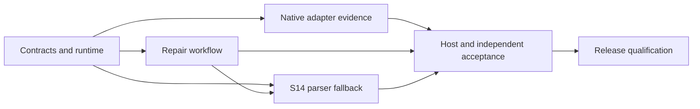

# Codeguard Validation and Rollout

> **Document version:** 1.2.0 · **Updated:** 2026-09-29. Current slices and target contracts are explicitly separated.

[简体中文](Codeguard-Validation-and-Rollout.zh_CN.md) · [Documentation](README.md) · [Architecture](Codeguard-Architecture.md) · [Technical design](Codeguard-Technical-Design.md)

## 1. Evidence granularity

A capability registration, test helper or completed task checkbox does not certify a language/category/platform slot. [CAPABILITIES.md](CAPABILITIES.md) is generated; the current full-slot matrix still marks gaps even where partial native implementations exist. Do not manually turn rows green or claim no native implementation exists solely because full acceptance is absent.

The [Chinese companion](Codeguard-Validation-and-Rollout.zh_CN.md) retains the complete 57-language candidate list and F01–F26 failure acceptance catalog. These are target coverage requirements, not a release support announcement. Current source/test references establish only their documented scope.

## 2. Required evidence per supported slot

| Evidence | Required observation |
|---|---|
| Configuration | Valid, missing, invalid, conditional and unsupported effective model |
| Native execution | Pinned tool and real project input with expected diagnostics |
| Positive/negative corpus | Known violations plus independently adjudicated valid examples |
| Failure handling | Missing runtime, timeout, cancellation, bad report, scope ambiguity and output limits |
| Repair | Actionable brief, failed attempt, bounded no progress and original-tool recheck |
| False-positive governance | Exact match/mismatch, expiration, revocation and invalid authority |
| Host delivery | Actual conversation content and next action, not just stdout |
| Platform lifecycle | Spawn/cancel/reap, locks/paths, snapshot and artifact behavior |
| Distribution | Reproducible source/artifact identity and fresh install on the claimed platform |

Ignored tests are not passes. Mocks demonstrate contracts rather than real native/runtime acceptance. Dated acceptance records must retain the exact command, versions, fixtures, denominator and residual gaps.

## 3. Precision and coverage

Use separate, held-out and independently adjudicated corpora for each advertised checker/rule group. Report false positives, true positives, false negatives, unclassified cases and incomplete scans. Do not increase precision by excluding difficult samples or counting whitelist matches as corrected code.

The retained target for advertised blocking rules is a 95% Wilson lower confidence bound of at least 0.98 for precision; this is a qualification criterion, not a measured result. Report sample sizes and confidence intervals. Zero observed false positives in a tiny corpus is not adequate evidence. Evaluate recall and coverage separately; unsupported scope cannot be a negative sample.

For WASM, stratify by grammar, language version/dialect, templates and generated constructs. Include supported valid syntax, deliberate errors, `ERROR`/`MISSING` recovery, old grammar against new syntax, native contradiction and mixed-module scope. Measure cold/warm latency, peak memory and bounded timeout behavior with pinned assets.

## 4. Integration tracks

| Track | Hosts named in existing tasks | Meaning |
|---|---|---|
| S11 | Codex, ZCode, Kimi | Original Rust CLI/plugin integration acceptance |
| S14 | Claude Code, Codex, Gemini CLI | Added native-first WASM conversation integration |

These are distinct pending task scopes, not proof that all hosts already work. Reconcile expansion through the existing OpenSpec change; do not silently rewrite core requirements during documentation consolidation.

S14 is parallel work that feeds release qualification, not a stage that begins only after the release it must qualify.

## 5. Release and rollback

The recorded npm 0.1.0 scope is Apple Silicon macOS, not five-platform certification. Fresh-cache npx execution establishes that platform entry point, not immutable source/tag binding, host quality gates or complete analyzer support. Source/tag/artifact correspondence, licenses, checksums, platform lifecycle and schema compatibility remain separate release evidence.

Roll out only qualified slots, retain previous executable/grammar manifests and preserve workspace history. A parser rollback invalidates affected cached observations and does not remove native obligations. Never downgrade persisted evidence by rewriting it to look compatible.

The [OpenSpec implementation coverage](../openspec/changes/introduce-rust-codeguard-cli/implementation-coverage.md) is the status ledger. This document defines the evaluation method; it does not mark pending tests complete.
