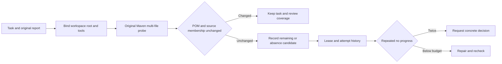

# Codeguard Documentation

[简体中文](README.zh_CN.md) · [Project README](../README.md)

This is the documentation entry for Rust Codeguard. The eleven former `rust-cli/` files have been integrated into the main documents and independent topic guides. There is one architecture and one technical design, each with a Chinese counterpart. Observations refer to HEAD plus the working tree reviewed on 2026-09-28; target designs are not shipped-feature claims.

## Reading order and ownership

1. [README](../README.md): installation, available scope, quick start and troubleshooting.
2. [Architecture](Codeguard-Architecture.md): boundaries, components, domain semantics, execution paths and decisions.
3. [Technical design](Codeguard-Technical-Design.md): shared contracts, detection families, canonical report examples and roadmap.
4. Topic guides below: detailed responsibilities, without a second task ledger.

| Topic | Responsibility |
|---|---|
| [Command contracts](Codeguard-Command-Reference.md) | C01–C36, parameters, budgets, exits and side effects |
| [Project initialization](Codeguard-Project-Initialization.md) | Static observations, module relations, owned files and AGENTS refresh |
| [Persistent remediation](Codeguard-Remediation-Workflow.md) | Stable findings, briefs, leases, attempts, verification and recurrence |
| [False-positive governance](Codeguard-False-Positive-Governance.md) | Triage, exact dispositions, lifecycle and feedback |
| [Native adapter contracts](Codeguard-Adapter-Contracts.md) | Native configuration/reports and Java/CVE/security boundaries |
| [Trust and distribution](Codeguard-Trust-and-Distribution.md) | Signatures, revision chains, tool packages, npm and grammar assets |
| [Validation and rollout](Codeguard-Validation-and-Rollout.md) | Language matrix, F01–F26, precision targets, host/release evidence |
| [Grammar development evaluation](Codeguard-Grammar-Evaluation.md) | Fixed 358-case, 32-language, 35-cohort replay with separate fixture metrics and unknowns |
| [Legacy compatibility](Codeguard-Legacy-Compatibility.md) | Old CLI/MCP/hook mapping and the dated 2026-09-24 audit |

## Current, target and historical evidence

Current slices are grounded in source, tests and scoped acceptance records; dispatch determines callable commands. WASM fallback, complete trusted gates, formal repair closure and automatic host workflows still have pending work. Generated [CAPABILITIES](CAPABILITIES.md) describes full slots; a gap does not negate an implemented partial native path.

C01–C36 are command-design IDs and F01–F26 are failure-acceptance IDs, not completion marks. English and Chinese guides share boundaries and conclusions. Detailed per-item tables, parameters and historical records are retained in the Chinese companions and explicitly linked from the English guides.

## Specification and evidence

The existing [OpenSpec proposal](../openspec/changes/introduce-rust-codeguard-cli/proposal.md), [specs](../openspec/changes/introduce-rust-codeguard-cli/specs), [tasks](../openspec/changes/introduce-rust-codeguard-cli/tasks.md) and [implementation coverage](../openspec/changes/introduce-rust-codeguard-cli/implementation-coverage.md) remain authoritative. See [acceptance records](../tests/acceptance) for bounded observations. Consolidation does not mark implementation tasks complete or archive the change.

The [consolidation record](../openspec/changes/introduce-rust-codeguard-cli/documentation-consolidation.md) maps old ownership and resolved conflicts. Original migration paths/digests remain historical provenance.

### Current public candidate: 0.1.4

`@partme.ai/codeguard@0.1.4` is published for Apple Silicon macOS from clean source `1cd458f6e01a44a74388243e964e3f45290ac18e`. It includes all 32 runnable, unqualified grammars, bounded edited-file checks, stable native-confirmation tasks, native rechecks and `next` guidance. Registry hashes, a fresh-cache npx invocation, the actual public-package repair loop with Zig 0.16.0, and the source commit's Linux CI passed. Ordinary CLI clean output cannot close a task without trusted policy. The protected Zig SDK is a source integration API; npm does not expose a self-approval command. Plugin activation, installed-host acceptance, full precision, other platforms and complete gates remain open. Earlier 0.1.3 evidence is historical. See [0.1.4 acceptance](../tests/acceptance/npm-0.1.4-candidate.md).

Native-first task creation, current evidence and recheck protocols: [Codeguard-Native-Repair-Workflow](Codeguard-Native-Repair-Workflow.md).

## Maven Javadoc original-task verification (source implementation)

Run `codeguard task verify CG-task-id . --maven-tool /absolute/mvn --java-home /absolute/jdk --maven-repo /absolute/offline-repository --repo-sha256 pinned-digest --format json`. Verification binds the original workspace, build root, POM, Maven, JDK and repository identity and reuses the native multi-file probe. Missing or changed tools yield incomplete feedback. POM or source-membership changes yield `rule_coverage_requires_review`. Remaining diagnostics produce `still_present`; local zero diagnostics after repair produce `candidate_absent_unverified_policy`, with the task remaining open. Completing the main-source probe cannot clear an out-of-scope preparation task.

Verification uses existing leases and attempt history; two unchanged attempts lead to `next` returning `needs_decision`. Maven wrapper0.6, inner brief0.5, task container0.1 and public verification0.28 expose `task_verify_status=local_observation_only`; JDK protocols and historical schemas remain available. Aggregate0.57 strictly supports the new Maven brief; this batch's actual aggregate selected a higher-priority P3C preparation task and remained0.38; its historical schema rejected that P3C preparation brief. This historical failure is retained; aggregate0.58 subsequently repairs that configuration-preparation branch, as described below.

See [acceptance](../tests/acceptance/maven-javadoc-task-recheck.md). This increment uses controlled Maven process fixtures. Actual Maven-plugin workbench acceptance, effective models, trusted closure/recurrence, actual hosts and release acceptance remain incomplete.

### Aggregate protocol for P3C configuration preparation

`check_feedback 0.58.0` strictly describes a selected `java.maven.p3c` / `p3c_configuration_not_confirmed` preparation brief while retaining historical schemas. It remains a blocker with the review-project-policy action; missing configuration is not a source violation or an automatically required check. The schema includes the existing Java-selection reason. Actual aggregate output and both embedded briefs validate; forged checker, finding kind, reason, source-repair action, approved authority and delivery allow are rejected. Other P3C findings/tool-blocker branches keep their existing versions; this is not complete P3C protocol acceptance. See [acceptance](../tests/acceptance/p3c-preparation-aggregate-schema.md).

### Gradle native Javadoc application service (partial development capability)

`gradle_javadoc_probe::observe` captures the native model and reruns enabled official Javadoc tasks in one offline Gradle invocation. It preserves project doclint/doclet/access/source-set settings and fixes only the diagnostic JVM language. Rust validates selected source bytes and diagnostic locations; native failures, unknown diagnostics and input changes remain incomplete. Four observations within one real Gradle 8.10.2/JDK21 conditional test produce 3 missing-comment, 2 missing-tag, 2 empty-description, and 0 diagnostics. These are not an independent precision corpus or production acceptance. Empty output remains `empty_output_unverified` with `rule_configuration_complete=false` and `coverage_proven=false`.

The development `check java` / `check all` entry now accepts explicit `--gradle-javadoc` with `--gradle-bundle`, `--java-home`, and repeatable `--gradle-project-file` inputs including root settings/build and Java files. One scheduled `java.gradle.javadoc` job captures the model and executes original documentation tasks in one native invocation. Check feedback 0.65 preserves `native_results.java_gradle_javadoc`; it does not launch a second model invocation. Model-only requests retain 0.62; `lint all` rejects documentation options. SIGINT preserves cancellation observations, and check_aborted 0.17 preserves documentation observations before a sibling failure. Public quality feedback is connected; original-task native recheck/closure, complete rules and JDK/source closure, multi-project/custom-doclet and per-language qualification remain open. See [public Javadoc acceptance](../tests/acceptance/gradle-public-javadoc-check.md).

For explicit Gradle documentation requests, the Java comments category preserves a partial observation or native incompleteness. Native diagnostics and tool failures are not mislabeled as absent Maven configuration; complete rules and coverage remain unverified. See [category attribution fix](../tests/acceptance/gradle-javadoc-category-attribution.md).

An independent `gradle_javadoc_workbench::project` now validates selected paths, source digests and the native snapshot digest before first import, merges identical native locations, and retains execution failures or unqualified coverage as separate preparation observations. Identity survives line movement of the same path/rule/source-line anchor; anchor edits or duplicate-anchor insertion may change it. The initial projection acceptance did not wire persistence; the current integration and separate protocols are described below, while original-native task verification/closure remains open. See [projection acceptance](../tests/acceptance/gradle-javadoc-projection.md).

The development `check java/all --gradle-javadoc` now captures selected inputs before native execution, revalidates digests/locations at first import, and saves local reports with stable findings and preparation tasks. Repeated scans append observations; missing Markdown can be restored from facts. `next` / `task show` provide Gradle recheck arguments for the original selected inputs with tool paths requiring validation. Check feedback 0.65 and repair preview 0.22 are separate closed protocols; ordinary Java checks also retain historical guidance. Counts in `gradle_javadoc_tasks` cover the current workspace sync, not exclusively Gradle records. Three actual public checks verify detection, reuse and empty output after repair while historical findings remain open. `task_verify_status=not_integrated`: original-task verification, trusted closure/reopen and complete rule/scope acceptance remain pending. See [workbench acceptance](../tests/acceptance/gradle-javadoc-workbench.md).

The internal `gradle_javadoc_task_recheck` service binds the consumed original report, task scope/rule and selected inputs. Java bytes may be repaired; changed build configuration or known tool identity prevents native execution. Observations distinguish a present finding, untrusted absence, rule review and incomplete execution; malformed native reports cannot represent zero findings. Public `task verify`, recheck import and attempt-history wiring remain pending, so the public `task_verify_status=not_integrated` stays unchanged. See [internal recheck acceptance](../tests/acceptance/gradle-javadoc-task-recheck-service.md).
