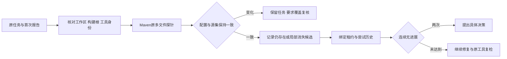

# Codeguard 文档导航

[English](README.md) · [项目 README](../README.zh-CN.md)

本目录是 Rust Codeguard 的统一设计文档入口。原 `rust-cli/` 的 11 份文件已整合到主文档与独立专题；不再维护第二套架构和技术方案。本文及各专题以 2026-09-28 的 HEAD 加工作树为观察范围，目标设计不能当作已发行功能。

## 阅读顺序与唯一职责

1. [README](../README.zh-CN.md)：安装、可用能力、快速开始和故障排查。
2. [架构](Codeguard-Architecture.zh_CN.md)：系统边界、组件、领域语义、执行路径和关键决策。
3. [技术方案](Codeguard-Technical-Design.zh_CN.md)：公共技术契约、检测族目录、统一报告示例及实施路线。
4. 以下专题：保留独立业务与工程细节；不另维护任务勾选状态。

| 专题 | 独立职责 |
|---|---|
| [逐命令契约](Codeguard-Command-Reference.zh_CN.md) | C01–C36、参数、预算、退出语义与副作用 |
| [项目初始化](Codeguard-Project-Initialization.zh_CN.md) | 静态画像、模块关系、受管文件与 AGENTS 刷新 |
| [持久修复工作流](Codeguard-Remediation-Workflow.zh_CN.md) | 稳定问题、任务简报、租约、尝试、复检与复发 |
| [误报治理](Codeguard-False-Positive-Governance.zh_CN.md) | 纠错分流、精确白名单、生命周期与反馈 |
| [原生适配器契约](Codeguard-Adapter-Contracts.zh_CN.md) | 原生配置与报告、Java/CVE/安全边界 |
| [信任与分发](Codeguard-Trust-and-Distribution.zh_CN.md) | 签名、修订链、工具包、npm 与 grammar 资产 |
| [验收与发布](Codeguard-Validation-and-Rollout.zh_CN.md) | 语言矩阵、F01–F26、精度目标、宿主与发布证据 |
| [grammar 开发评测](Codeguard-Grammar-Evaluation.zh_CN.md) | 固定 358 例、32 语言、35 来源组回放，逐组差异与未知 |
| [旧协议兼容](Codeguard-Legacy-Compatibility.zh_CN.md) | 旧 CLI/MCP/Hook 映射与 2026-09-24 审计 |

## 当前、目标和历史

- 当前局部能力以源码、测试和带范围的验收记录为依据；公开命令以实际 dispatcher 为准。
- WASM native-first 兜底、完整可信门禁、正式修复关闭和宿主自动闭环仍含未完成项。
- [CAPABILITIES](CAPABILITIES.md) 是生成的完整能力槽矩阵；槽位 gap 不否定某条局部原生路径已经实现。
- C01–C36 是命令设计编号，F01–F26 是故障验收编号，均不是功能完成标记。
- 中英文专题共享边界与结论。中文保留逐项详细表、参数和历史证据；英文提供对应工程契约并明确链接到同一明细。

## 规格与证据

[OpenSpec proposal](../openspec/changes/introduce-rust-codeguard-cli/proposal.md)、[specs](../openspec/changes/introduce-rust-codeguard-cli/specs)、[唯一任务清单](../openspec/changes/introduce-rust-codeguard-cli/tasks.md)、[实现覆盖](../openspec/changes/introduce-rust-codeguard-cli/implementation-coverage.md)、[验收记录](../tests/acceptance)。文档整合不更改任务完成状态，也不执行规格归档。

[整合对照与冲突处理](../openspec/changes/introduce-rust-codeguard-cli/documentation-consolidation.md)记录旧文件去向及已消除的冲突；迁移清单保留原始路径和摘要作为历史来源。

### 当前公开候选：0.1.4

`@partme.ai/codeguard@0.1.4` 已从干净源码 `1cd458f6e01a44a74388243e964e3f45290ac18e` 发布，限 Apple Silicon macOS。包含全部 32 份可执行但未验收的 grammar、指定编辑文件检查、稳定原生确认任务、原生复检与 next 指引。注册表摘要、新缓存 npx、公开包真实 Zig 0.16.0 修复链路及相同源码 Linux CI 已通过。普通 CLI 的零诊断不能在缺可信策略时关闭任务；限定 Zig SDK 是源码集成 API，npm 不暴露自批命令。插件启用、真实宿主、完整精度、多平台与完整门禁仍未完成。此前 0.1.3 证据保留为历史快照。见 [0.1.4 验收](../tests/acceptance/npm-0.1.4-candidate.md)。

原生发现直接生成任务、当前证据和复检协议见[Codeguard-Native-Repair-Workflow](Codeguard-Native-Repair-Workflow.zh_CN.md)。

### Kotlin 首次原生观察（开发源码）

`check all . --kotlinc-tool ABS_PATH` 和确认保存的 `file_changed` 接受相同显式工具；省略时发现调用环境 PATH。已选工具失败保留原生阻塞，不改走 WASM；仅缺工具时使用候选初检。最多 64 份普通 `.kt` 共用请求截止时间，不在此路径编译 `.kts`。重复扫描更新同一稳定任务，原生零诊断不自动关闭任务。

新增聚合0.42.0、保存 Hook0.11.0、扫描0.1/0.2、原生首次事实0.4.0、原生来源复检0.6.0/任务反馈0.17.0，以及首次原生简报0.10.0；已有 WASM 来源任务继续沿用旧协议。见[首次原生验收](../tests/acceptance/kotlin-native-first.md)。完整项目 lint、编译器/JDK 身份、可信关闭和公开发行仍待完成。

### Swift 原生优先单文件反馈（开发源码）

`codeguard lint swift FILE.swift [--swift-tool ABS_PATH] [--timeout 30s] --format=json` 优先选择显式编译器，否则调用环境绝对 PATH 中首个普通可执行 `swiftc`。当前适配 Apple Swift 6.4，对冻结 stdin 执行 frontend parse；仅缺工具时使用内置 WASM 候选，选定工具失败保留原生阻塞。位置为 UTF-8 字节列；源码或入口目标变化撤回旧诊断，超时/取消不按源码违规解释。

`swift-lint-feedback`0.1.0 区分未完成/隐藏恢复所需的原生确认，与完整零恢复后的推荐准备。它不授予完整 lint 或交付通过：SwiftLint、注释、类型、依赖/安全和项目构建仍有义务。工具身份只覆盖所选入口，不代表整个工具链。Swift 项目原生观察已按下文接线；原生任务连接、完整语言及发行验收仍未完成；公开 npm0.1.4不包含本增量。见[单文件验收](../tests/acceptance/swift-native-single-file.md)。

### Swift 项目原生观察（开发源码）

`check all . [--swift-tool ABS_PATH] --format=json` 对最多 64 份普通 Swift 文件在同一截止时间内执行冻结原生 parse，报告未观察文件；原生选择失败不回退，只有缺工具保留 WASM。`check-feedback`0.43.0 / `swift-parse-scan`0.1.0 保留当前字节位置、工具选择及复检 argv。源码或工具变化撤回位置，零诊断不等于完整 SwiftLint、类型或构建通过。项目原生结果的任务同步明确为 `not_connected`，未伪造任务引用；确认保存 Hook 的首次原生扫描已接通，原生任务连接仍待完成。见[项目观察验收](../tests/acceptance/swift-native-project.md)。

确认保存事件的 `hook execute . --swift-tool ABS_PATH` 复用同一 Swift scanner，只检查选中路径；缺工具保留候选，已选工具失败不切换。`hook-execution-feedback`0.12.0 / `hook_fast_feedback`0.4.0 输出当前原生位置与未接任务状态。CLI Claude 适配器以有界计数/字节位置反馈，不回显工具诊断文本；混合范围候选疑似仍要求原生确认。源码插件实际宿主安装、稳定原生任务及正式闭环仍需验收。见[保存反馈验收](../tests/acceptance/swift-native-hook.md)。

## Maven Javadoc 原任务复检（源码实现）

`codeguard task verify CG-任务身份 . --maven-tool /绝对路径/mvn --java-home /绝对路径/jdk --maven-repo /绝对路径/离线仓库 --repo-sha256 固定摘要 --format json` 复用首次报告的构建根与原生多文件探针。缺工具或工具身份变化反馈未完成；POM或源码集合变化反馈 `rule_coverage_requires_review`。问题仍存在记录 `still_present`；补齐注释后的局部零诊断记录 `candidate_absent_unverified_policy`，任务保持开放。范围外源码的准备任务不能借主源码探针完成而消失。

复检接通原租约与尝试记录；同一动作两次无进展后 `next` 要求具体决策。Maven绑定包装0.6、内部简报0.5、原任务容器0.1、公开任务复检0.28；`task_verify_status=local_observation_only`。JDK入口与历史schema保留。聚合报告0.57为嵌入新Maven简报提供严格协议；本批真实聚合输出选择了更优先的P3C准备任务，仍是0.38；校验暴露其旧schema不接受P3C准备简报，历史失败保留；后续0.58已修复该配置准备简报分支，见下节。

验收见 [Maven原任务复检](../tests/acceptance/maven-javadoc-task-recheck.md)。本批使用受控Maven进程夹具；真实Maven插件新工作台、完整生效模型、可信关闭/复发、真实宿主和发行仍未验收。

### P3C配置准备任务的聚合协议修复

`check_feedback 0.58.0` 为选中的 `java.maven.p3c` / `p3c_configuration_not_confirmed` 准备任务提供明确的封闭简报协议，保留0.38等历史schema。简报仍是blocker及review-project-policy动作；配置是否必需由项目策略确认，不把缺配置转为源码违规。新schema包含CLI现有Java选择原因码，实际聚合及两处内嵌简报通过校验，伪造检查器、finding类型、原因、源码修复动作、批准权威和交付allow均被拒绝。其它P3C finding/工具阻塞分支仍按既有版本处理，本批不声称完整P3C协议验收。见 [局部验收](../tests/acceptance/p3c-preparation-aggregate-schema.md)。

### Gradle 原生 Javadoc 应用服务（开发期局部能力）

新增 `gradle_javadoc_probe::observe` 在一次离线 Gradle 调用中采集模型并重跑已启用的官方 Javadoc 任务，使用原项目 doclint/doclet/访问范围/源集，只固定诊断 JVM 的英语语言。Rust 校验选定源码及诊断位置，原生失败、未知诊断、输入变化等保持未完成。真实 Gradle 8.10.2/JDK21 四组样例得到 3 条缺注释、2 条缺标签、2 条空标签描述、0 条诊断；这是一个原生条件测试中的四次观察，不是独立精度语料或生产验收。无诊断报告仍为 `empty_output_unverified`，`rule_configuration_complete=false`、`coverage_proven=false`。

开发期 `check java` / `check all` 现可显式追加 `--gradle-javadoc`，同时提供 `--gradle-bundle`、`--java-home` 和可重复的 `--gradle-project-file`（含根 settings/build 及 Java 文件）。统一调度只生成一个 `java.gradle.javadoc` 任务，单次原生调用完成模型/注释检查，check_feedback 0.65 在 `native_results.java_gradle_javadoc` 保存诊断；不额外调用配置模型。仅模型请求仍使用 0.62；`lint all` 拒绝文档参数。SIGINT 保留取消观察，check_aborted 0.17 保留兄弟异常之前的文档观察。公开质量反馈已接入，原工具任务复检关闭、完整规则及完整 JDK/源码闭包和跨项目/custom doclet 验收仍待完成。见 [公开 Javadoc 入口验收](../tests/acceptance/gradle-public-javadoc-check.md)。

Java 注释类别在显式 Gradle 文档请求下保留局部观察或原生未完成，不能把实际诊断或工具故障误报为 Maven 未配置；规则/完整范围仍未验收。见 [类别归属修复](../tests/acceptance/gradle-javadoc-category-attribution.md)。

Gradle 文档的工作台基础现在提供独立 `gradle_javadoc_workbench::project`：首次导入前核对选定路径、源码摘要及原生快照摘要，归并相同原生定位，把工具故障/未验收覆盖保留为独立准备观察。同一路径/规则/源码行锚点仅移动行号时保留身份；修改锚点或插入相同锚点可能产生新身份，不承诺完整符号级身份。投影接口的首次基础验收没有持久化接线；当前接线和独立协议见下文，可信关闭仍待完成。见 [投影验收](../tests/acceptance/gradle-javadoc-projection.md)。

Gradle 文档工作台已接入开发期 `check java/all --gradle-javadoc`：原生运行前捕获选定输入，首次导入再次核对摘要/位置，保存局部报告并同步稳定问题与准备任务；重复扫描追加观察，缺失 Markdown 可从事实恢复。`next` / `task show` 使用原任务 `task verify` 参数，原选定输入保留在绑定报告中，工具路径须复核；check_feedback 0.67 与修复指引 0.24 独立消费（历史0.65/0.22、0.66/0.23保持不变），普通 Java 检查也能读取历史指引。`gradle_javadoc_tasks` 的计数范围为本次工作区同步，并非只统计 Gradle。三次真实公开检查验证发现、复用和修复后空诊断；原问题仍开放。`task_verify_status=local_observation_only`，原任务复检已接通，可信关闭/复发重开和完整规则/范围仍待验收。见 [工作台验收](../tests/acceptance/gradle-javadoc-workbench.md)。

内部 `gradle_javadoc_task_recheck` 服务已能绑定原已消费报告、任务范围/规则及选定输入；Java 字节允许修复，构建配置或已知工具身份变化停止原工具运行。局部观察区分仍存在、未受信消失、规则待复核与执行不完整，残缺原生报告不能冒充零问题。公开 `task verify` 已按 `--gradle-bundle` 和 `--java-home` 复用原选定范围；导入重核原事实和当前输入，保存与尝试关联的复检观察，支持首证据来自复检容器的新任务。`next` 撤回源码/配置/工具变化后的旧观察；同文件同规则不同身份进入复核，不误认原问题仍存在。任务复检预览0.30与修复预览0.24仅为局部观察，可信关闭和生产资格仍待验收。初始服务基线见 [内部复检验收](../tests/acceptance/gradle-javadoc-task-recheck-service.md)。

当前公开复检证据、尝试关联和失效处理见 [验收](../tests/acceptance/gradle-javadoc-public-task-recheck.md)。

Gradle文档原生描述检查现补齐空注释、缺主描述和空异常说明，分别保留 `JavadocEmptyComment`、`JavadocMissingMainDescription`、`JavadocEmptyThrowsDescription`；原参数/返回空描述规则继续保留。由原JDK21输出定位，经源码快照核验后进入稳定任务和原工具复检，不把注释文字存在等同于业务契约充分。原生、工作台和复检协议使用独立0.2，历史0.1不扩大；聚合0.67、异常0.18、修复0.24和任务复检0.30封闭消费。真实空类型/构造器/字段/方法注释4条、裸标签3条、缺用途1条；中文完整注释与合法继承文档0条，零诊断仍未受信。独立JDK/Maven旧协议尚未接入这些新增规则，完整详细注释验收继续待完成。见[详细描述验收](../tests/acceptance/gradle-javadoc-detailed-descriptions.md)。

## 编码交接与完整待办

[实施交接手册](handoff/Codeguard-Implementation-Handoff.zh_CN.md) 包含执行顺序、逐语言四能力矩阵、全部OpenSpec未完成任务快照及可运行验证命令。该包不替代正式规格，也不授予生产资格。
