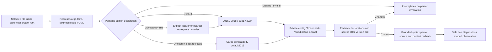

# Rust project edition and native syntax observation

Updated: 2026-10-06. This document describes an implemented Unix Rust library service for preparing selected-file native parser feedback. Selected-file editing Hook and stable tasks are connected; complete project and real-host acceptance remain pending.

The service `codeguard_cli::rust_project_syntax::observe(root, relative, tool, deadline, cancelled)` requires a canonical absolute project root and relative source file. The tool is an explicitly selected already-installed Rustfmt1.9.0-stable. It returns protocol0.1 with source digest, relative manifest references/digests, resolved edition and a safe native parser observation. It does not install tools, choose another tool on failure, run Cargo, execute source, connect remediation tasks or grant delivery permission.

`CargoEditionDeclaration` uses the existing adapters TOML dependency, bounds manifests to256KiB, rejects duplicate/malformed declarations and supports explicit workspace inheritance. The nearest package's explicit edition overrides outer workspace values. A package table with omitted edition has Cargo's2015 compatibility default; standalone source without a manifest does not. Declaration parsing does not validate the entire Cargo manifest or prove source target ownership/workspace membership. Explicit workspace locators may contain parent components, but normalization must remain inside the requested root; symlink inputs and unrecognized edition providers remain unresolved. A nearest virtual workspace cannot be borrowed as a package manifest.

`RustProjectEdition` records both present and absent manifest candidates along the bounded lookup chain. A new nearer manifest, changed provider bytes, changed source or alias paths invalidates context. Source and edition context are checked before startup, between version and parsing, and after execution. A declaration changed by the version subprocess prevents the second invocation and discards current diagnostics. No project formatter config is loaded or written.

Native observation0.2 allows only2015/2018/2021/2024 while historical observation0.1 remains fixed2024. The older differential replay continues to use its explicit2024 fixture condition. Project protocol validation rejects mismatching native/context editions, invented coverage/allow decisions, absent identities for completed results and inconsistent execution states. Neither zero parser diagnostics nor a resolved declaration proves Clippy, type checking, macros, included fragments, external modules or complete build coverage.

The real installed tool was tested on identical `pub async fn f() {}` bytes: default2015 produces located native diagnostics, explicit2021/2024 produces no diagnostics. [Acceptance evidence](../tests/acceptance/rust-project-edition.md) binds this scoped result; it does not establish general precision, language qualification or release readiness.

Cargo declaration semantics: [manifest edition](https://doc.rust-lang.org/cargo/reference/manifest.html#the-edition-field), [workspace package inheritance](https://doc.rust-lang.org/cargo/reference/workspaces.html#the-package-table). Next integration must retain original native lint obligations, task identity, safe conversation feedback and source-context uncertainty. No new CLI option is claimed here.

Selected-file edit Hook and stable tasks now use this service through `--rustfmt-tool`; failures of selected tools do not fall back. See [scoped chain acceptance](../tests/acceptance/rust-native-hook.md).
