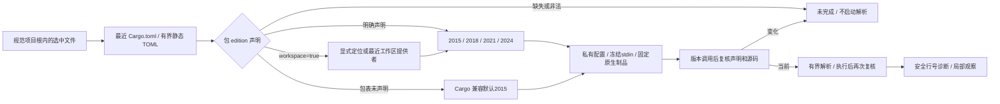

# Rust 项目 edition 与原生语法观察

更新：2026-10-06。本文描述已实现的 Unix Rust 库服务，用于准备选中文件的适用原生解析反馈；选中文件编辑 Hook 与稳定任务现已接线；完整项目与实际宿主验收仍未完成。

`codeguard_cli::rust_project_syntax::observe(root, relative, tool, deadline, cancelled)` 接受规范绝对项目根、相对源码文件和显式已安装 Rustfmt1.9.0-stable。0.1协议返回源码摘要、相对清单引用/摘要、适用edition和安全原生观察。不安装或故障换工具，不运行Cargo/源码，不连接任务或签发交付许可。

`CargoEditionDeclaration` 复用 adapters 已有 TOML 依赖，清单限256KiB，拒绝重复/非法声明，支持显式工作区继承。最近包的明确edition优先于外层工作区；包表缺edition采用Cargo2015兼容默认，独立源码缺清单不套默认。声明解析不证明完整Cargo清单、源码目标归属或成员关系。显式工作区定位允许父路径，但规范化后必须仍在请求根内；链接和未知提供者保持未解决。最近虚拟工作区不当成包清单。

`RustProjectEdition` 同时记录查找链中存在和不存在的清单。新增更近清单、提供者字节、源码或别名路径变化都会失效。原生启动前、版本调用与解析之间、执行后均复核；版本子进程改变声明时不执行第二调用，当前诊断撤回。不读取或写入项目Rustfmt配置。

原生观察0.2仅允许2015/2018/2021/2024，历史0.1仍限定2024；旧开发差分保持显式2024条件。项目协议拒绝原生/context edition不一致、伪造coverage/allow、完整观察缺身份和执行状态不一致。声明解析及零诊断不证明Clippy、类型、宏、嵌入片段、外部模块或完整构建覆盖。

真实安装工具对完全相同 `pub async fn f() {}` 字节：缺省2015给原生定位诊断，明确2021/2024无诊断。[局部验收](../tests/acceptance/rust-project-edition.md)保存范围证据，不代表一般精度、语言资格或发行通过。

语义依据：[Cargo edition](https://doc.rust-lang.org/cargo/reference/manifest.html#the-edition-field)、[工作区包继承](https://doc.rust-lang.org/cargo/reference/workspaces.html#the-package-table)。后续编辑接线必须保留原生lint义务、稳定任务、安全对话反馈及源码上下文不确定性。Hook 和 task verify 已提供 --rustfmt-tool，原生缺失时保留 WASM 候选；已选工具失败不回退。
