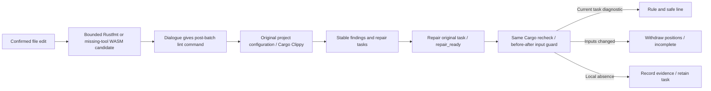

# Rust project lint after editing and repair feedback

Source implementation, 2026-10-06. Successful Rustfmt parsing during an edit does not mean Clippy ran. Dialogue explicitly states that project Clippy was not executed and gives `codeguard lint rust . --format=json` for the agent to run after an editing batch. This is executable follow-up guidance; there is currently no persistent background queue, and a recommendation is not reported as queued or executed work.

Repair-ready uses task-bound `--cargo-tool` under the event deadline. The parent captures the observed Rust source inventory, Cargo manifests/locks and configuration before child verification, checks them afterwards, and checks selected-tool and source digests before projection. The native service's own input checks remain intact. Parent checks cover changes between child completion and conversation projection. `RUSTUP_TOOLCHAIN` is forwarded alongside registered Cargo/Rustup environment so a repair request retains the caller's selected toolchain.

Hook0.26 with inner summary0.8 projects only the original task's `clippy::` rule and line. Column units have not been separately accepted and stay `unavailable`. Source and raw native messages are not echoed. Input changes yield `stale`/`incomplete` with empty positions while the persisted-attempt status remains visible. Local absence remains `candidate_absent_unverified_policy` and leaves the task open; recurrence reuses the stable identity. Historical protocols are unchanged.

[Scoped acceptance](../tests/acceptance/clippy-hook-feedback.md) separates controlled concurrent-lock mutation from actual Cargo/Clippy discovery, repair, recheck and recurrence. Complete dynamic Cargo models, all feature/target combinations, trusted rule/tool sources, authoritative closure, background scheduling, installed hosts and release acceptance remain pending. Post-batch guidance does not reduce mandatory commit/CI checks.
