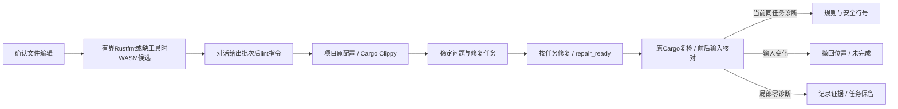

# Rust 编辑后项目 lint 与修复反馈

当前源码实现，2026-10-06。编辑阶段的 Rustfmt 解析成功不等于 Clippy 已执行。对话明确说明“本次未运行项目级 Clippy”，给出 `codeguard lint rust . --format=json`，供智能体在编辑批次完成后调用。当前提供可执行后续指引，没有持久后台队列，不把建议描述成已排队或执行。

`repair_ready` 使用原任务绑定的 `--cargo-tool`，共享事件期限；父请求在复检子进程之前冻结静态 Rust 源码清单、Cargo 清单/锁及配置，之后再次核对，投影前还检查选定工具摘要和当前源码摘要。Clippy 运行后的原生输入检查仍保留；父快照防止子进程完成到对话投影之间的变化留下陈旧指引。`RUSTUP_TOOLCHAIN` 与已登记的 Cargo/Rustup 环境一起转交复检进程，避免同一请求换用不同工具链。

Hook0.26、内部摘要0.8只投影原任务的 `clippy::` 规则与行号；列单位没有单独验收，明确为 `unavailable`，不回显源码或原生消息。输入变化产生 `stale` 和 `incomplete`，位置为空；复检尝试的持久化状态仍可见。局部零诊断为 `candidate_absent_unverified_policy`，任务保持 open，问题再次出现复用稳定身份。历史协议保持原样。

[局部验收](../tests/acceptance/clippy-hook-feedback.md)分别记录受控工具的并发锁变化与真实 Cargo/Clippy 的发现、复检、修复及复发链路。完整 Cargo 动态模型、所有 features/目标组合、可信规则/工具来源、正式关闭、后台调度、真实宿主与发行验收仍待完成。这里的批次后 lint 指引不减少提交/CI 的完整检查义务。
