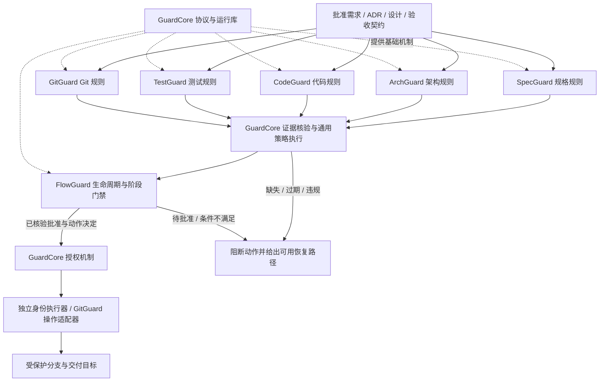

# 七项目边界与现有插件迁移

本文件为当前产品架构决策；原六仓本地实现快照仍见 repository-baseline。规划文档暂存于 CodeGuard 不代表代码归属。

## 1. 依赖和执行关系

代码依赖为六个专业项目 → GuardCore；GuardCore 不编译链接任何具体守卫。运行时使用已批准 provider 描述和协议分派，避免核心反向依赖专业项目。专业守卫之间优先通过证据协议协作，不互相 import 内部 crate。每个守卫可在无 FlowGuard 情况下独立检查并给出本域结论；独立检查不自动授予交付权限。

GuardCore 的 OPA 负责执行策略和验证输入，不内置“测试覆盖率必须多少”“阶段顺序是什么”“哪层能依赖哪层”等业务规则。规则包归专业守卫；组织和项目批准其参数及组合约束。FlowGuard 拥有阶段/动作门禁组合规则。签发机制归 GuardCore，部署授权归受信控制端，Git 写操作语义归 GitGuard。

## 2. 现有仓库的去向

| 现有仓库/关联插件 | 七项目关系 | 兼容与迁移 |
|---|---|---|
| codeguard | 直接保留为 CodeGuard 产品仓 | 不重建扫描器，不把公共内核留在本仓；旧 CLI/语言验收继续 |
| codeguard-plugin | CodeGuard 的现有宿主与分发入口 | 直接演进；共享 Hook 协调能力调用 GuardCore，不能成为六守卫领域规则总仓 |
| gitflow-plugin | GitGuard 的既有 Git 能力来源与兼容宿主入口 | GF 规则先通过固定版本适配器复用；差分对齐后规则 owner 才转给 GitGuard，保留旧名字与 `.gitflow` 布局 |
| flowguard-plugin | FlowGuard 产品的既有流程语义来源和宿主入口 | 十阶段暂由 flowguard_lib 单一判定；Rust 实现对等验证后原子切换 owner，旧命令/文档布局继续 |
| codegraph-plugin | ArchGuard / GitGuard / TestGuard 的事实提供者接入 | 保留上游客户端职责，不成为第八个专业守卫；不自动建索引 |
| codereview-plugin | 各守卫的 REVIEW/ADVISE 提供者 | 不并入 ArchGuard，也不把模型结论升级为确定性放行 |
| architecture-plugin | 架构设计生产侧 | 产生候选 ADR/设计；ArchGuard 验证已批准约束。本轮未审计或修改该插件 |
| spec-workflow-plugin | 规格生成与管理侧 | 产生候选规格；SpecGuard 验证完整性和一致性。本轮未审计或修改该插件 |

“7 个独立项目”是产品边界，不要求现有适配插件仓库全部消失，也不按适配插件数量增加 Guard 产品数量。没有本地核实的新目标仓库不声称已存在。

## 3. 迁移顺序与唯一所有权

1. EG-M01 固定目标仓库、规格事实源及条目迁移清单，不自动执行 init/分支切换。
2. GuardCore 先交付协议/运行机制，CodeGuard/插件保留现有接口，新增显式版本适配。
3. GitGuard/FlowGuard 先调用现有 Python 判定器；此时规则 owner 仍为现有插件，Rust 包只作产品入口与协议边界，不宣称迁移完成。
4. 专用迁移任务以合法、违规、未知、并发、取消和恢复语料逐案差分。验收后切换 owner，插件改为调用产品；不在两边各维护一套规则。
5. 若 Rust 迁移未获接受，固定兼容适配器并披露 Python 依赖，不能声称纯 Rust；回滚恢复已验证组合，不恢复撤销授权，不关闭保护。

所有内部子模块都留在所属产品。每个仓可按复杂度分 `protocol adapter / domain / runtime / cli / transports`，不要求一模块一 crate。GuardCore 自身可用 protocol/core/runtime/cli/transports，但不出现 architecture/domain-policy/workflow-business 模块。

## 4. 第一阶段与完整闭环

第一阶段交付 GuardCore、ArchGuard、CodeGuard、GitGuard、FlowGuard。仍须绑定已批准需求/验收基线并运行实际编译和测试，证据通过受保护的临时 native-test provider 进入 GuardCore；该 provider 只投影执行证据，不实现 TestGuard 的完整充分性规则，也不能把 SpecGuard/TestGuard 标为通过。

第二阶段补全 SpecGuard 与 TestGuard：迁移临时测试投影到 TestGuard，并完成需求—设计—测试—候选闭环。第一阶段没有声明的缺省义务不伪造通过；批准契约已经要求 SpecGuard/TestGuard 时，缺 provider 必须阻断，不得为分期删验收标准。
