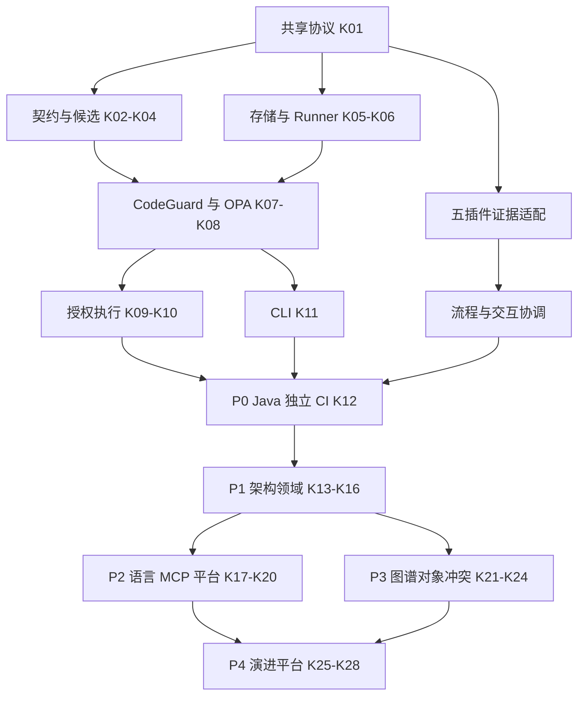

# 六仓交付顺序与任务归属

本表是跨仓依赖视图；勾选只在所属仓库的原生任务账本进行。日期不代表已排定工期。完整需求、任务映射见 [traceability](traceability.md)，验收见 [acceptance](acceptance.md)。

## 1. 唯一任务账本

| 任务前缀 | 仓库 | 仓内任务路径 |
|---|---|---|
| EG-K | codeguard | `openspec/changes/add-engineering-guard-core/tasks.md` |
| EG-F | codegraph-plugin | `openspec/changes/integrate-engineering-guard-facts/tasks.md` |
| EG-H | codeguard-plugin | `openspec/changes/integrate-engineering-guard-host/tasks.md` |
| EG-R | codereview-plugin | `openspec/changes/integrate-engineering-guard-review/tasks.md` |
| EG-W | flowguard-plugin | `docs/superpowers/plans/2026-09-23-flowguard-agent-driven-sdd-governance.md` 第 5 节 |
| EG-G | gitflow-plugin | `openspec/changes/integrate-engineering-guard-git/tasks.md` |

未创建新的技能包或市场仓任务文件：需要修改受管技能时，由对应插件任务明确引用来源仓发行流程。原有未完成的语言/平台/真实宿主任务仍在原账本，不用新计划覆盖或重编号。

## 2. P0—P4 全范围

| 阶段 | 核心输出 | 消费者输出 | 退出条件 |
|---|---|---|---|
| P0 可信最小闭环 | 契约/协议、OPA、SQLite、runner、授权、CLI；Java 真工具验证 | provider 约束、宿主桥接、审查投影、流程事实、Git 范围/候选 | 合规候选能交付；自改规则、缺证据、旧候选、自批和绕 Hook 均不能越权合入 |
| P1 架构与领域 | 分层/依赖/API、不变量与状态机、精确例外 | 架构风险、契约变更审批、阶段失效 | 合法协调不误阻；禁止依赖和非法状态转换被稳定阻断 |
| P2 语言与入口 | Rust/TS 档位、rmcp、制品/平台、互操作 | 各宿主实际触发、GitHub/GitLab 保护、版本组合 | 每个声明单元有独立证据；unknown 单元保留，不能宣称全量完成 |
| P3 对象方法与并行 | 符号事实、精确方法契约、风险与冲突评测 | CodeReview 风险质量、GitFlow 任务影响、FlowGuard 依赖 | 不同文件语义冲突可发现；启发式不冒充 ENFORCE；最终候选仍验证 |
| P4 架构演进 | 基线/ADR 趋势、跨仓、平台存储/身份/可观测性 | 历史追踪、升级回滚、发布治理 | 原始证据可追溯、旧例外不能复活、跨仓失败可恢复 |

P0 提前包含最小代码/架构验证；P2 的“扩展 CodeGuard”不是把质量检查拖到第三阶段。一个试点只证明指定矩阵单元，与现有全语言迁移总目标并行计账。

## 3. 可实施顺序

任务表依赖 ID 是实施顺序权威，图为摘要。符合依赖条件的工作可以由后续执行者并行实现；本轮未启动子 Agent 或代码工作。

## 4. 发布与回滚门禁

1. 先冻结协议包和黄金 fixture，再发布兼容消费者；生产者输出新 major 前保证消费者已具备明确支持。
2. 各仓固定不可变 tag/commit，运行制品摘要、schema/policy/toolchain 和各宿主能力写入 release manifest。
3. 插件按本仓 bump/vendor/manifest/市场生成流程发布；不改受管技能快照充数，不移动已发布 tag。
4. Shadow 对照 → 单项目 cooperative → 实際 CI/权限验收 → 显式 enforced。任何阶段都不弱化既有更严格门禁。
5. 回滚选择最后已验证组合，保留证据与撤销记录；旧版本不能满足新策略就停止交付，不自动关闭保护。

## 5. 执行交接

开始某仓任务时读取其 AGENTS、当前 Git 状态、本仓 proposal/design/spec/tasks 和共享协议，先确认依赖完成证据。新增/修改行为先写可观察失败测试，再最小实现与受影响回归。文档、源码、fixture、实际原生工具、CI、宿主、目标平台和生产证据分开记录。

普通实现选择可以自主推进；新增安装、分支切换、首次初始化、发布或权限配置依已有具体授权执行。本次规划授权不自动授权这些操作。
