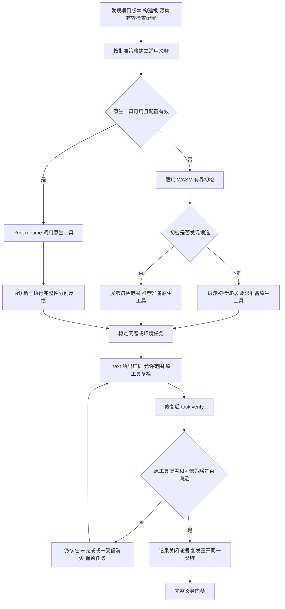

# CodeGuard 编码交接与生产验收执行手册

> 版本：1.0；日期：2026-10-07；基线提交：`a30f3efc32e69bd50d557ff3c7d26836d9a229ca`。
> 用途：让接手模型直接继续现有实现，完成用户要求的四项核心能力。本文是实施索引，不是第二套规格或完成账本。

## 1. 先读这里

唯一规格事实源：[introduce-rust-codeguard-cli](../../openspec/changes/introduce-rust-codeguard-cli/proposal.md)，其 [tasks](../../openspec/changes/introduce-rust-codeguard-cli/tasks.md) 与增量 specs 决定行为。不要新建同名需求，不要重做脚手架，不要把旧 `stable` 标签当作验收。

当前核验：66 项完成、288 项未完成；57 语言 × 四核心 = 228 项义务全部 blocked；364 构建生态路径为 46 partial、26 wasm_candidate_only、292 not_integrated；正式 grammar 资格 0/32。状态来自 [原计划](../../rulepacks/production_acceptance_plan_v1.json) 和 [验收摘要](../../tests/acceptance/production-acceptance-plan.md)。局部通过证据不能升级整项资格。

交接包：

- [逐语言四能力实施矩阵](Codeguard-Language-Work-Matrix.zh_CN.md)：全部 57 语言、228 义务、364 路径的现有入口、证据、缺口和 OpenSpec ID。
- [待办原文快照](Codeguard-OpenSpec-Pending-Snapshot.zh_CN.md)：全部未完成任务的一行原文；执行时回到正式 tasks 读取相邻进展，历史段落可能被后续实现覆盖。
- [逐能力验收记录模板](Codeguard-Acceptance-Record-Template.zh_CN.md)：真实运行、专属证据、闭环、精度和资格裁定的统一填写格式。
- 本手册：核心任务包、实施顺序、验收反例、命令和交付格式。

## 2. 用户要求与不可替代边界

| 核心 | 必须交付 | 不构成完成 |
|---|---|---|
| 语法 | 所有适用语言的内置 WASM 初检与原生 lint/编译器，按项目版本和方言正确路由 | WASM 可以加载、format 成功、裸单文件编译、32 份文件存在 |
| 文档规范 | 用途、参数、返回、异常/错误契约、类型/公共 API 的详细注释，合法继承/生成代码不误报 | 只有注释存在、只查标签、TODO 占位、格式化 |
| 开发规范 | 项目有效规则和语言生态原生工具；Java 真正加载 P3C 规则 | Maven verify 本身、Checkstyle 名称替代 P3C、规则配置文件存在 |
| 漏洞 | 实际依赖图、解析版本、可信且适时漏洞来源、实际扫描、修复复检 | 依赖清单、SBOM、许可证报告、过期缓存、受控空 JSON |

Rust 负责 CLI、计划、运行、适配、归并和任务；调用 P3C/Maven/Gradle 等原生能力。不得把其重写成简单正则检测；不得增加 Python 生产执行层。现有 Python 测试/Schema 辅助脚本不是生产适配器。

不是每种语言都有官方 lint 或独立包生态。不得编造工具或用缺工具解释 not_applicable；按具体构建根映射共享生态，记录适用性依据及批准范围。无法证明时 blocked，不以“支持所有语言”宣传替代实现。

## 3. 接手前检查与保护

```bash
git rev-parse --show-toplevel
git branch --show-current
git status --short
git rev-parse HEAD
```

当前分支 `feat/rust-hook-prompt-guidance`。已有用户未提交修改 `crates/codeguard-cli/tests/erlang_native_differential.rs`，基线 SHA256 `2e3a296072e6a3aa34b561799c18c7d8b621d00f8786301d2612cee8cdab85b6`：不得覆盖、格式化、纳入提交或执行此测试；若摘要变化，保留并重新识别所有权。`tests/acceptance/vbnet-oracle-install-plan.md` 是本轮前已存在的未提交工具准备方案，不是已安装证据。

读取适用 AGENTS/CLAUDE、README、目标 specs；没有 `.codegraph/` 的此子仓库不要擅自索引。本文不授予安装工具、创建分支、发布或合并权限；用户随后明确要求全部提交推送，因此本交接包及既有Erlang修改纳入当前分支提交，Erlang测试已实测失败并单列证据。机器最近磁盘提示剩余约 9GB，实测 `df -h .` 后再决定编译/SDK准备；不要清理用户进程或未知目录。

## 4. 架构与共享流程



原生工具已被选中后，执行失败、超时或坏配置不能被 WASM 通过抵消。WASM 候选不是已确认源码违规；无诊断仅表示限定语法初检没有候选，不表示文档/规范/CVE完整。已有 Rust 隔离 worker 与 WASM 加载链是当前实现，不新建 Node `web-tree-sitter` 生产执行链；更换后端需要正式设计与兼容性验证。

| 模块 | 实施所有权 |
|---|---|
| codeguard-core | 事实/完成度/规则/策略/门禁领域契约，不启动进程 |
| codeguard-runtime | 冻结输入、工具身份、进程组、deadline、取消、日志、缓存 |
| codeguard-adapters | 有效配置与原生报告解析、适用性、范围和来源，不私自启动进程 |
| codeguard-cli | 统一入口与应用服务、工作台同步、human/JSON/SARIF、宿主调用 |
| rulepacks / schemas | 版本化规则与封闭协议；历史 schema 不原地扩容 |

详细架构沿用 [架构](../Codeguard-Architecture.zh_CN.md)、[技术方案](../Codeguard-Technical-Design.zh_CN.md)、[原生适配契约](../Codeguard-Adapter-Contracts.zh_CN.md)。

## 5. 执行顺序与停止扩散条件

1. P0-A：修复并验收全部 32 WASM，保留原生优先与真实未知状态。
2. P0-B：Java Maven/Gradle 四能力完整纵向闭环；现有代码较多，补缺口，不重复实现。
3. P0-C：Rust、Python、JS/TS、Go 的四能力；每次交付一个语言/构建生态完整闭环。
4. P0-D：按语言矩阵补齐其余生态；优先复用 JVM/.NET/Node/共享CVE引擎，不能跨语言借证据授予资格。
5. P0-E：共享可信关闭/白名单/门禁、宿主自动触发与发行实装；共享基础阻塞某一纵向切片时提前实现其最小必需部分。

这些是实现顺序，不删减“全部语言”要求，不宣布缩小版本。只补完成当前能力必需的协议；已有字段能表达时不要为每个小增量创建新协议。不得连续交付外围文档/状态接口而不增加可验收的核心能力。工具缺失应列具体阻塞，切换独立可做项，不把全部进度停在安装等待。

## 6. P0-A：32 WASM 实施任务包

对应 OpenSpec 12.11、14.17、14.19、15.2、15.7，精确范围以正文与矩阵 task_refs 为准。

当前原始358例：73 TP、1 FP、10 FN、269 TN、3 unknown、2 pending；参考 [当前回放](../../tests/acceptance/grammar-current-full-replay-2026-10-07.md)。不是独立 holdout，不能汇总成生产准确率。Erlang组合结构规则另有历史测量，不代表原始 grammar 漏检消失。

| 可独立执行任务 | 源码/测试入口 | 必须达到的可观察结果 |
|---|---|---|
| 隐藏 ERROR/MISSING 诊断原因贯通 | runtime `wasm_recovery_scan.rs`、`syntax_worker_candidate_observation.rs`；CLI `check_syntax_candidates.rs`、`grammar_evaluation.rs`、`grammar_native_differential.rs`；`check_all_grammar_candidates` | Kotlin/Swift不可定位恢复错误保持unknown/incomplete，并明确原因；不编造坐标、不报clean；原生反馈不丢 |
| VB.NET未缩进方法疑似误报裁定/修复 | 资产清单与 `vbnet-oracle-install-plan.md`，新增独立回归与原生对照 | 原样本由固定.NET编译器确认；修复grammar而非排除文件/更改合法标签；派生来源、许可、摘要、ABI、有效/无效样本齐全 |
| Erlang十项原始漏检 | `rulepacks/erlang/form_terminator.json`、原始/组合回放及非受保护新测试 | 分别报告原grammar和组合引擎；真实原生oracle对照全部正反例，合法结构规则不误报；不动受保护测试 |
| CFQuery/COBOL待裁定 | 固定语料中的pending行与具体来源 | 人工或已确认原生oracle裁定，未裁定不入precision分母；记录依据，不靠模型投票 |
| 32 grammar完整资格 | 资产清单、grammar status/probe、原生差分、统一check、发行清单 | 每份许可/ABI/加载/方言版本正反例、原生对照、独立holdout、任务反馈、发行实装全部齐备；JSX共享JS不重复数 |

第一项 TDD已有实测RED（2026-10-07）：临时将 `check_all_grammar_candidates::hidden_kotlin_recovery_is_visible_in_project_feedback` 的reason断言改为 `parser_error_location_unavailable`，运行精确目标，实际0通过/1失败；left=`syntax_recovery_incomplete`、right=`parser_error_location_unavailable`。运行后已恢复原断言，未留下失败测试。此结果证明共享反馈仍合并原因，不证明grammar已修复。

接手时必须先决定兼容表示：`check_command.rs` 当前按旧reason过滤生成指引，不能只替换生产者字符串。优先保留兼容reason并通过版本化字段精确表达隐藏错误；或采用新reason但同步所有消费者、任务导入、schema及旧协议拒绝测试。先读上述源码与公开schema，再补Kotlin/Swift、可定位恢复、普通截断及旧报告兼容测试，先RED后实现。原始分类、未知数与资格保持诚实；报告另存，不覆盖历史证据。

VB.NET安装方案需要用户授权；准备好隔离目录/版本/校验/恢复方案后再申请，不静默下载。其阻塞不能让其他31份停止。

## 7. P0-B：Java四能力任务包

对应6.1–6.8、15.2–15.7；先读逐路径矩阵原始refs。

| 能力 | 当前复用入口 | 剩余实施任务 | 必测场景 |
|---|---|---|---|
| 语法 | `grammar_native_checker.rs`、Java原生差分、`java_syntax_fallback_candidate` | Maven/Gradle有效源集、目标JDK、profile/module/generated/test范围；原生优先路由与完整义务 | 父POM、多模块、Maven+Gradle并存、错误JDK、合法新语法、原生失败不fallback假通过 |
| 文档 | Maven/Gradle Javadoc probes、原任务recheck与已有详细描述测试 | 同一详细规则在JDK/Maven/Gradle一致；有效模型、继承、record/Lombok/生成代码、全源集；可信关闭与复发 | 无注释、空注释、缺用途、空param/return/throws、有效inheritDoc、中文、重载、生成代码与配置变化 |
| 开发规范 | `java_p3c_scan.rs`、`java_p3c_cli`、Checkstyle现有服务 | 锁定真实P3C/PMD兼容组合与有效规则；Gradle未整合路径；项目配置加载证明与范围 | 确定违反P3C正例和合法反例、禁用规则/management-only/profile、坏XML、未知规则、陈旧报告 |
| CVE | `java_cve_scan.rs`、`gradle_dependency_check_probe.rs`、`gradle_cve_task_recheck.rs` | 真OWASP原生有/无漏洞报告、插件缓存闭包、解析图/传递依赖、DB身份/时效、自动配置调度和复检 | 固定漏洞依赖、修复版本、库过期/离线、CPE模糊误判、排除/私服失败、Gradle子项目归属 |

不要新写四个平行扫描框架。基于已存在的deadline/资源锁/快照/报告归属实现。Maven插件缓存准备见 `tests/acceptance/java-native-tool-preparation-plan.md`，当前文档不授予下载授权。

## 8. P0-C/P0-D：其他语言工作包模板

每个语言 × 构建生态 × 能力是一个可独立交付切片；工具候选必须读项目已有目录和官方文档确认后冻结，矩阵的legacy_lint_candidate不是可直接执行的最终命令。

1. 从矩阵选一条路径，读adapter_refs/evidence_refs及任务相邻最新进展；列已实现/未实现，不重写可复用代码。
2. 发现版本、构建器、模块/source-set、规则配置、工具位置。配置状态必须区分configured/missing/invalid/unknown；配置存在不等于生效。
3. 固定官方/权威工具与规则版本，记录许可证、分发来源、支持方言、可选插件和实际启用规则；无官方lint时明确第三方来源。
4. 写合法/违规/坏配置/坏报告/缺工具/超时/取消/输入变化反例，先RED再最小实现。
5. 复用共享runtime真实调用并验证诊断位置、范围、规则和报告新鲜度；错误不能当零诊断。
6. 接入 `check language` / `check all` /类别入口、配置准备、稳定任务、next、task verify、关闭和复发。
7. 用真实工具、独立样本和声明平台运行验收；更新对应OpenSpec及计划摘要，所有条件齐备才授予该单元资格。

文档检查详细规则：类型/公共API用途；每个公开参数说明与代码参数匹配；有返回值的返回语义；错误/异常契约；泛型/可选参数；继承/重载/宏/生成源码归属；占位说明单独处理。仅凭自然语言长短不能证明准确，模糊语义需人工裁定，不能制造高置信源码finding。

漏洞共享映射按实际包生态处理：无独立包生态的语言由宿主/构建依赖图负责；直接、传递、平台条件与锁缺失均不能静默丢弃。SAST/secret/IaC/容器安全不能冒充CVE，原有安全义务也不能被四核心摘要删除。

## 9. P0-E：共享闭环与插件触发

对应S02/S03/S04/S09/S11/S12及15.6/15.7。

- findings和执行completion分开；原生无诊断但范围/规则不完整仍incomplete。
- 同一工具/规则/目标稳定任务；删除Markdown、改勾选、重扫不消除事实；行移动更新位置。
- next提供问题证据、规则、允许修改范围、步骤、原工具命令、历史和关闭条件。缺JDK/插件生成环境任务。
- task verify绑定原输入/规则/工具，复检仍存在、未完成、未经批准消失分开。失败也落事件；同输入重复无进展停止同动作并给具体决策。
- 可信关闭须原工具覆盖与受保护策略满足，CLI/项目本地文件不能自批；复发重开同一父链。
- 白名单仅精确已批准发现，有限期限、工具/规则包/目标/内容身份；原发现保留；过期、撤销、失配重新阻断；不得整目录/规则排除。
- 编辑Hook只检查有界受影响文件，避免每次全仓CVE扫描；初始化/配置锁变化更新计划，提交/交付时完整义务；同输入去重、并发租约、总deadline/取消、失败可见。
- 插件→二进制→报告→智能体对话真实实装验收，原生优先/WASM缺工具提示不能只测CLI。相邻plugin是独立Git仓库，交接任务不能擅自推main。

## 10. 通用验收表：每条路径都要运行

| ID | 输入 | 通过标准 |
|---|---|---|
| A01 | 合法详细注释/合法代码/无漏洞依赖 | 实际原生结果合法，覆盖完整；不靠空输出猜成功 |
| A02 | 已知真问题 | 精确原规则、位置/组件、严重性、修复指引；预置真问题全部检出 |
| A03 | 工具缺失/错误版本/依赖缺失 | 环境阻塞；有适用WASM初检也不授予整体通过 |
| A04 | 配置无效/未启用/无法解析 | 明确invalid/missing/unknown；不伪源码违规，不自行新增必需义务 |
| A05 | 原工具超时/取消/非零/截断/非法报告 | incomplete或相应终止；保留已获得事实；无假clean |
| A06 | 源码/配置/锁/工具/DB在运行前后变化 | 当前资格撤回；旧位置不当本轮证据；重新检查 |
| A07 | 修复→原工具复检→再次引入 | 合格关闭证据、幂等复检、复发重开原任务父链；无可信覆盖不关闭 |
| A08 | 连续无改动尝试/改任务文字/删任务 | 记录失败、预算阻止重复、事实和门禁不变 |
| A09 | 陈旧/伪造报告/越界位置/其他构建根 | 拒绝归属；不得生成可信零发现 |
| A10 | 白名单自批/过期/扩大/撤销/内容变动 | 不放行；精确有效批准才allow_with_exceptions，原始发现保留 |
| A11 | 多语言多构建根/排除/未修改文件 | 各义务独立完整；某根成功不掩盖其他根缺口 |
| A12 | 真实宿主安装与发布包 | 真实命令触发、对话可读、修复后复检；本地测试不替代包体实装 |

精度遵循已批准规格：确定性必备场景零假通过、零工具故障误判；关键安全/CVE回归零漏报；每个adapter/category有足够裁定样本时precision的95% Wilson下界≥0.98。独立holdout与开发回归分开，unknown/pending单列；零发现precision不可估计。不能用白名单后数量改善原始precision。性能绝对门槛尚待同环境基线冻结，不编造毫秒指标。依据 [binary-distribution specs](../../openspec/changes/introduce-rust-codeguard-cli/specs/binary-distribution/spec.md)。

## 11. 验证命令与证据格式

以下是在仓库根执行的测试指令，不表示本次文档工作已运行它们。只运行受影响目标；一次仅一个Cargo，避免磁盘/资源竞争。

```bash
CARGO_PROFILE_TEST_DEBUG=0 cargo test --offline --locked -p codeguard-cli --features wasm-precheck --test check_all_grammar_candidates
CARGO_PROFILE_TEST_DEBUG=0 cargo test --offline --locked -p codeguard-cli --features wasm-precheck --test grammar_evaluation
CARGO_PROFILE_TEST_DEBUG=0 cargo test --offline --locked -p codeguard-cli --features wasm-precheck --test grammar_evaluation replay_expanded_cohorts_and_archive_current_evidence -- --ignored --exact --nocapture
CARGO_PROFILE_TEST_DEBUG=0 cargo test --offline --locked -p codeguard-cli --test production_acceptance_plan
cargo clippy --offline --locked --workspace --all-targets --features codeguard-cli/wasm-precheck -- -D warnings
python3 scripts/check_layering.py
openspec validate introduce-rust-codeguard-cli --strict
git diff --check
```

第三条全358例回放约数分钟，只在相关修改后顺序执行；报告由stdout `GRAMMAR_COHORT_EVALUATION_REPORT=` 抽取并另存新日期/来源摘要，不覆盖历史证据。真实工具条件测试可能ignore，必须记“未运行”而不是PASS。工具版本缺失不要去掉offline偷偷联网。不要执行受保护Erlang测试。全工作区strict Clippy可能编译它，不改变其所有权。

单元/切片报告应保留：基线commit和dirty文件摘要、候选程序SHA、源集/配置/规则/grammar/工具/漏洞库身份、准确命令与退出码、每项passed/failed/ignored、真实/fixture/holdout分类、TP/FP/FN/TN及unknown、失败原因和脱敏证据引用、platform/host范围、关闭/复发事件、资格判定。新schema先验证实际报告与畸形反例；旧消费者不认识新决策必须拒绝，不降级普通allow。

## 12. 接手模型可直接使用的任务提示词

```text
继续当前 CodeGuard 仓库的 introduce-rust-codeguard-cli，先读取 docs/handoff/Codeguard-Implementation-Handoff.zh_CN.md 与逐语言矩阵。
不重建架构或规格，不重写已实现代码。保护未提交 erlang_native_differential.rs，不安装/发布/切分支。
第一切片：P0-A隐藏parser恢复错误精确原因贯通，保持unknown/incomplete，不改变真值或资格。
先读相关spec和测试，写失败断言，再修共享传播；运行受影响目标、schema和layering验证。
完成后报告实际改动、测试通过/忽略、证据与剩余缺口。随后按P0-A→Java四能力→其他语言矩阵推进。
任务只有真实实现和对应验收全部满足才勾选。局部零诊断不关闭问题，不授予项目门禁或整语言生产资格。
遇工具缺失给出固定版本隔离安装方案和需授权的具体操作，同时继续其他独立任务。
```

## 13. 交付节奏与审阅

每个切片完成后给出：OpenSpec ID、语言/生态/能力、真实工具版本、修改文件、RED→GREEN、全部反例结果、实际产物、资格是否增加与为什么、剩余阻塞。未产生核心可验收能力时明示基础工作，不用提交数/协议数替代效果。不要凭估计承诺所有语言完成日期。

交接文档只描述现状与现有验收要求，不授予审批或生产资格。交接包不改任务勾选，不授予发布或生产资格。后续开发评测原因保留增量与全部提交推送记录见 tests/acceptance/grammar-evaluation-hidden-reason.md。
