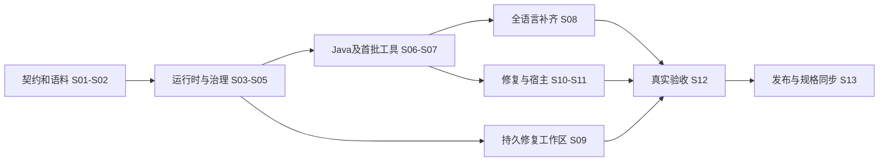
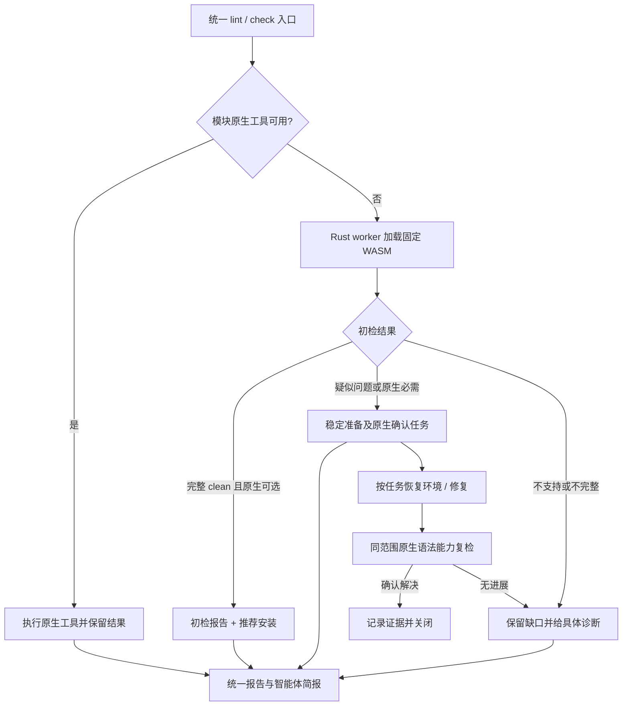

# Design：统一 Rust Codeguard CLI

## Context

动机见 [proposal](proposal.md)。当前运行时是 Bash/Python、57 个语言注册条目、独立技能 vendor 与多宿主 Hook。源码基线 `03ebb24`；现有 OpenSpec 仍描述旧 fail-open、skipGate、基线豁免与旧退出码。本 change 是显式契约升级，不是对旧策略做行为保持的逐行翻译。

完整设计见 [架构文档](../../../docs/Codeguard-Architecture.zh_CN.md)、[技术方案](../../../docs/Codeguard-Technical-Design.zh_CN.md)；覆盖和指标见 [迁移验收](../../../docs/Codeguard-Validation-and-Rollout.zh_CN.md)。这些文档展开设计，本目录 `specs/` 是规范性事实源，`tasks.md` 是唯一任务状态。

## Goals / Non-Goals

**Goals**：单一二进制与领域内核；独立的执行完整性和违规证据；不可由 AI 自行降级的质量 contract；全语言逐类别覆盖；可测试的工具适配与准确内容身份；渐进替换宿主入口。

**Non-Goals**：原设计阶段不建立 Rust 源码仓或发布产物；后续实施阶段以逐任务验收推进，不因四 crate 工程基线存在而宣称发布完成。不重写所有原生分析工具；不采用 LLM 作为最终裁判；不承诺本地同权限环境不可绕过；不把动态 Shell 全解析作为交付正确性的基础。

**Rust 与原生工具边界**：用户已明确 Codeguard 自身的检测编排、运行控制、报告解析、策略/门禁及新工程验收均用 Rust；P3C、Maven 等仍执行官方原生命令，Rust 负责受控调用和解释，不重写官方规则。新 CLI 不以 Python 脚本作底层实现；旧 Python 仅在具名 legacy-v1 入口保留到迁移完成。

## Decisions

| 决策 | 选择及理由 | 考虑过的替代 |
|---|---|---|
| D01 workspace | 使用用户确定的四 crate，core 定义 ports，runtime/adapters 单向依赖 core | 单 crate 易混职责；每工具独立 crate 初期增加发布成本 |
| D02 执行权威 | Rust 统一编排，工具提供 finding，受控策略决定 gate | AI 重判缺可复现证据；通用 rc/文本判定丢语义 |
| D03 结果模型 | findings 与 completion 正交，混合结果全部保留 | 单 PASS/FAIL/UNKNOWN 枚举容易吞掉部分真实发现 |
| D04 完整性门禁 | 必需检查未完成不能交付；基线只分类 | fail-open/默认存量豁免延续用户明确否定的方向 |
| D05 覆盖 | 先建立完整义务，再选择执行/缓存；语言 × 类别 × 工具验收 | 按文件后缀或已注册命令计数无法证明能力 |
| D06 工具管理 | 显式 provision、固定锁、兼容组合测试 | 扫描时自动安装 latest 导致不可复现与运行副作用 |
| D07 配置权威 | 运行参数与质量策略分离；CI 使用可信已批准政策 | CLI/env 覆盖一切使智能体可自行关闭门禁 |
| D08 Git | 真正 Git 事件绑定 index/ref；宿主预测有明确边界 | 继续扩充 Shell 模拟仍不能覆盖任意程序间接调用 |
| D09 发布兼容 | 新协议明确版本，旧入口具名兼容且不作为新认证 | 同一个 rc 静默改义会破坏 CI/宿主 |
| D10 初版扩展 | 编译期适配器，版本化数据规则包 | 动态任意脚本插件会扩大信任和测试边界 |
| D11 测试执行 | 保留静态构建默认等级并明确报告，策略要求时执行测试 | 自动替用户将所有 verify 改为跑测试，超出已确认范围 |
| D12 修复工作区 | `./.codeguard/` 持久存储脱敏问题、事件与任务，本地日志/缓存 Git 忽略，原工具复检关闭 | 仅终端报错缺少恢复上下文；自由 Markdown 勾选会制造无证据完成 |
| D13 项目初始化 | init 生成带证据的项目画像、分类型模块图和 AGENTS 受管摘要；事实、推断、准备状态与政策分开 | 根据目录猜定 DDD 或直接执行构建来推测配置，容易产生错误约束和未预期副作用 |
| D14 命令应用服务 | 36项入口共用应用服务与证据内核；查询/计划/诊断/状态操作与质量认证分开，命令schema统一生成help和接入矩阵 | 给每条命令复制扫描逻辑，或把所有exit 0解释为项目通过，会引入协议漂移 |
| D15 协作与恢复 | 显式lease token/generation和attempt/action ID，受控fix复用或自行领取租约，运行报告与准备证据幂等导入 | 只用owner字符串、隐式最新attempt或单份最新报告无法可靠处理并发和响应丢失 |
| D16 误报白名单 | 只对经复现、独立批准的精确 finding 作有期限处置；保留原始发现、复检与审计，交付显示 allow_with_exceptions | 广泛路径/规则忽略、agent 自批或把工具故障算误报会掩盖真实问题 |

完整指令职责、价值、参数、结果类型、预算初始值、状态变化和调用旅程见 [命令架构](../../../docs/Codeguard-Command-Reference.zh_CN.md)。预算是实现基线，平台能力和性能仍需实测；命令存在不等于已有原生工具验收。

初始化细节见 [项目初始化与 AGENTS.md 接入](../../../docs/Codeguard-Project-Initialization.zh_CN.md)。不直接改写本插件 AGENTS 来冒充被检查项目画像；实现任务沿 S09 展开，整体验收在 S12。

修复工作区详见 [持久修复设计](../../../docs/Codeguard-Remediation-Workflow.zh_CN.md)。状态、任务和历史帮助执行者推进，但最终 gate 独立检查源码与可信政策；任务记录不能成为新的跳过开关。

误报白名单的条目身份、可信审批、失效与门禁转换见 [误报白名单设计](../../../docs/Codeguard-False-Positive-Governance.zh_CN.md)。它是规则处置，不替代原生检测；实现分解到 S02/S04/S09/S12。

## Risks / Trade-offs

- [严格门禁暴露工具环境欠账] → `doctor` 给出具体恢复路径，先完成工具链准备；不能通过 fail-open 消除欠账。
- [官方 P3C、PMD、JDK 版本兼容] → 固定组合并运行真实样本；不把同名 Checkstyle 配置视为替代。
- [跨语言 comments/security 能力差异] → 缺口显式记录；可新增确定性规则，不能把缺能力标成不适用。
- [构建脚本和原生配置可执行/可降级] → 隔离运行、身份核对、可信策略 diff；快照不等于恶意代码沙箱。
- [全量检查较慢] → 基于等价证明缓存和增量，不改变义务；性能预算以实测设定。
- [同一 change 涉及未来多个仓] → 当前规格暂驻插件仓；未来 CLI 仓引用此事实源，迁移事实源须独立批准，禁止双写冲突任务。
- [已有规格很多旧行为要求] → 在 delta 中给旧运行时明确协议范围；迁移后入口受 Rust 契约管辖，并更新宿主协议说明。

## Migration Plan

阶段顺序及当前设计到逐条Requirement/命令/语言/平台/宿主的任务映射见 [实施覆盖索引](implementation-coverage.md)。索引已反向检查每项实施任务的规格依据；任务状态只在tasks.md维护，不以OpenSpec产物齐备作为实现完成。先建立Java真实修复闭环，再补齐全部已承诺能力；第一条闭环通过不能关闭其它语言或宿主任务。

对照运行保留旧/新报告与差异原因，不直接将旧结论作为真值。已确认的历史错误行为需要新规范的正反例替代旧期望，其它兼容性用具名 legacy 测试保留。切换后不因 Rust 未完成自动回落旧 Python 放行。

回滚以满足相同严格契约的上一 Rust release 为目标；没有这种版本时保持交付未认证，反馈入口可恢复旧工具但不得显示新门禁通过。市场、安装和真实运行证据分层记录。

## Open Questions

以下是实施阶段必须验证的技术参数，不改变上述需求与任务范围：P3C/PMD/JDK 兼容版本；各罕见语言可用的只读诊断工具；平台最低 ABI/MSRV；签名发布身份和新仓远程地址；代表性语料的确切项目清单及脱敏方式；逐工具性能基线。对应任务未完成前，不将候选参数写成发布承诺。

## Completion Boundary

原设计阶段完成标准仅为架构、技术方案、覆盖验收设计、OpenSpec proposal/design/specs/tasks 的一致性和校验。后续实施已开始；完成状态以 `tasks.md` 的代码、测试与实测证据为准。真实工具、宿主和发布验收未完成前不执行 sync/archive。

实施前覆盖审计补充：静态查询处理器、事件/游标中断恢复、过期租约恢复顺序、环境任务复检、私有证据保留、关联追踪和分层评测均有明确任务；5个候选平台和3个宿主各有独立验收条目。技术参数未知项绑定任务和所需证据，不能自行假定完成。

## 2026-09-28 当前归属与 D17/D18

开头 Context 为旧插件设计起点；现在已有独立 Rust 实现和 npm macOS arm64 发布。当前状态见 [实现基线](implementation-baseline.md)，规格归属见 [迁移记录](migration.md)。项目数据目录为 `.codeguard/`。

D17：同一 lint/check 入口按模块优先使用可用原生工具。WASM 只给有范围的语法观察；clean 不解除必需原生义务，疑似问题先恢复原生确认，不让智能体凭容错树反复改源码。安装本身和后续初检 clean 都不能关闭确认任务。运行失败、缺配置、grammar 不支持与代码问题分开。

D18：npm 仅作 Node 启动壳，检测与 WASM 运行由 Rust 承担。资产需版本、来源、许可证、散列和 ABI 验收；不在运行时随意下载 CodeGraph 最新包。原生进程失败不得借 WASM 洗成通过。

报告设计示例与四条执行路径详见 [技术方案](../../../docs/Codeguard-Technical-Design.zh_CN.md#73-对话报告示例目标呈现)。示例不等于当前协议；正式新增 schema、缓存、宿主反馈和逐语言质量实测按 S14 执行。完整 S12/S13 收敛需要 S14 对声明支持范围的独立验收。

### Swift 无定位恢复的确认路径

已消费的 Swift 确认任务使用显式既有 Apple Swift 6.4 入口，在统一 runtime 下解析冻结 stdin；原生错误位置可指导同一任务的源码修复，坐标单位明确为 UTF-8 字节。清空环境和非项目 cwd 不构成整套编译器组件的可信认证；只支持局部 frontend parse，不代替 lint、类型检查、项目条件编译与交付。未完成和零诊断均保留任务；覆盖与关闭继续走正式受保护核验。各消费者新增独立协议版本，旧 schema 不改。

### Python接入前的生命周期提交边界

原生语法关闭服务分为验签/范围核对、原样本与当前样本原生对照、限定事件提交三个责任。事件提交复用同一个父链重放和幂等算法，接收已核对的领域ResolutionEvidence及对应脱敏原生证据，不重新从本地决策文件取得批准。现有Zig/Erlang/Swift/Kotlin入口继续负责各自工具、原样本、版本及坐标验证；Python随后在此前两层绑定明确lint目标和配置，不能绕过原样本确认而直接提交关闭。

提取提交逻辑时必须保持既有策略/证据/收据版本和字节序列化、幂等证据摘要、策略变更需核对、重复不同关闭需协调、首次Observed父节点和复发Reopened语义。没有宿主批准的本地历史读取仍不把resolved提升为可信状态。提取本身不代表Python关闭实现，也不完成14.11。

### Python限定任务原生对照与生命周期（2026-10-05）

采用专用宿主SDK而非本地CLI公钥参数。策略1.5绑定明确lint目标、配置原字节、首次报告、原样本及制品；原始stdin使用批准配置与目标，当前扫描复用项目Ruff正常/ignore-noqa以及同轮设置。共同提交仅接受封闭0.6扩展，旧0.1–0.5保持原字段；首次独立/聚合报告读取必须复核消费收据，不能用修复后的当前源码替代原样本。完整原始语法错误与稳定的当前零语法错误才能关闭；合法原反例进入误报调查。普通task verify复发以旧批准摘要作为历史引用，只允许重开，不授予新关闭或交付。详见[局部验收](../../../tests/acceptance/python-task-resolution-lifecycle.md)。生产信任根、全语言闭环与完整门禁仍由未完成父任务约束。
