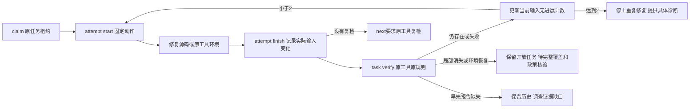

# C/C++文档受控尝试与无进展局部验收

延续introduce-rust-codeguard-cli 的8.2、8.26、8.29、15.3、15.6。专用尝试日志与当前输入预算已接通，详细文档覆盖与完整修复资格未授予，父任务保持未完成。



新协议：repair_brief_preview0.30、已绑定comments反馈0.4、C/C++ task_show_preview0.4。原task verify0.36、内部原生复检0.1和全部历史schema不变。task show的外层next_actions保留原工具绝对路径与实际工作区；其它语言的旧投影不改变。

```bash
codeguard task claim TASK_ID ROOT --owner agent-a --format=json
codeguard task attempt start TASK_ID ROOT --owner agent-a --lease-token TOKEN --action-id repair-source --format=json
# 修复注释；环境任务的固定动作是 restore-checker-environment
codeguard task attempt finish TASK_ID ROOT --owner agent-a --lease-token TOKEN --attempt-id ATTEMPT_ID --outcome ready-to-verify --note-code source_edit --format=json
codeguard task verify TASK_ID ROOT --owner agent-a --lease-token TOKEN --format=json
codeguard task show TASK_ID ROOT --format=json
```

输入身份包含当前有界源码、首次语言/标准/profile、工具选择路径、规范解析路径、工具状态与字节摘要。缺工具的环境任务可记录恢复尝试，源码权限为空；恢复工具不需要改动无关源码。首次已观察制品变化仍由原复检启动前拒绝，不能靠记录尝试重新批准工具。

| 状态 | next | 约束 |
| --- | --- | --- |
| 尝试未结束 | waiting | 不重复启动同一任务 |
| 已ready但尚未原工具复检 | verification_required | 不以再次勾选代替复检 |
| 当前输入两次原规则仍存在 | needs_decision | 空源码修改权限、原规则/原因和最近5次尝试；动作改名、复扫不重置预算 |
| 早先当前输入复检证据缺失 | needs_decision | 保留未核对次数；不删除失败历史或恢复修复预算 |
| 事件自称消失但原报告仍有诊断 | incomplete | 拒绝矛盾观察 |
| 局部消失或环境恢复 | needs_decision | 原任务仍open，完整详细覆盖与政策待核验 |

先有RED：受控attempt测试因not_integrated失败，随后真实CLI接通。测试中两次ready+失败原复检触发预算2；替代合法动作被拒，复扫不重置；删除早先局部报告改为具体调查，恢复字节后计数仍2；伪造消失事件被拒。工具恢复测试保持源码原件不变，记录observed_change且原任务局部复检后仍开放。

真实已安装Apple Clang21：C和C++分别执行claim/start/finish/原工具复检（仍存在、计数1）、第二次start/修改参数说明/finish/原复检（局部消失）。证据绑定测试源码和当次CLI二进制，不是独立holdout或发行制品资格。默认/WASM均需执行；同一专用目标包含原工具变化、输入失稳、超时及取消回归。

```bash
CARGO_PROFILE_TEST_DEBUG=0 CODEGUARD_CLANG_BIN=/usr/bin/clang cargo test --offline --locked -p codeguard-cli --test c_family_comments_workbench -- --include-ignored
CARGO_PROFILE_TEST_DEBUG=0 CODEGUARD_CLANG_BIN=/usr/bin/clang cargo test --offline --locked -p codeguard-cli --features wasm-precheck --test c_family_comments_workbench -- --include-ignored
```

边界：当前无进展预算按当前字节/工具上下文计算；跨输入、配置、源集和语义进展的完整判定未验收。Clang缺失整段注释可零诊断，详细用途/参数/返回/异常/行为的完整性与准确性仍未实现。项目check/Hook、独立精度、可信关闭/复发、五平台及发行验收均未完成。57×4核心全部blocked、正式grammar资格0/32、OpenSpec66完成/288未完成不变。

本批实际验证结果：

- 默认与WASM专用目标各16通过，含真实Apple Clang C/C++修复尝试和原任务复检；证据：[默认原生链路](evidence/c-family-comments-attempt-native.json)、[WASM原生链路](evidence/c-family-comments-attempt-native-wasm.json)。
- 默认共用回归38通过/10忽略，WASM共用回归45通过/10忽略；忽略项要求指定真实Ruff，不计入本批验收。
- 默认和WASM严格Clippy均通过；488份schema有效，485份历史schema字节不变，22项负例均拒绝；证据：[默认协议验证](evidence/c-family-comments-attempt-schema.json)、[WASM协议验证](evidence/c-family-comments-attempt-schema-wasm.json)。
- 映射审计192项源码摘要、1312项任务引用通过；OpenSpec严格验证、crate分层、架构文件命名和diff检查通过。以上均为开发回归证据，qualification仍为not_granted。
