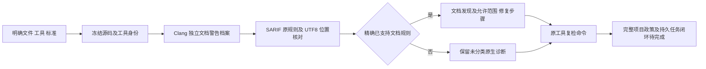

# C11/C++17 原生 Clang 文档观察

对应已有 OpenSpec 8.26、8.29、15.3、15.6 的局部实现，父任务保持未完成；原生观察不是详细文档生产资格。

## 原生规则与执行边界

公开 `comments c/cpp FILE --clang-tool ABS --standard c11|c++17` 使用已有 Apple Clang 21.0.0 (clang-2100.3.34.2)，Rust 负责固定字面参数、冻结 stdin、私有 cwd、清空环境、共享截止时间、取消回收和前后输入/工具复核。文档档案单独启用 `-Wdocumentation -Wdocumentation-pedantic`，不复用 Wall/Extra/Pedantic 语法档案，也不声称这是项目原配置。

依据：[Clang 文档警告](https://clang.llvm.org/docs/DiagnosticsReference.html#wdocumentation)、[文档 pedantic 警告](https://clang.llvm.org/docs/DiagnosticsReference.html#wdocumentation-pedantic)。本地固定版本实际输出决定以下三个适配规则，不以未来版本文案或前缀推断能力：

| 原生规则 | 准确修复范围 |
|---|---|
| clang.warn_doc_block_command_empty_paragraph | 定位处的实际文档命令补充准确非空描述 |
| clang.warn_doc_param_not_found | 注释参数名与实际声明保持一致，不改函数签名迎合注释 |
| clang.warn_doc_returns_attached_to_a_void_function | 移除 void 返回值标签并核对真实副作用/错误契约 |

未知或非文档原生规则保留在 `unclassified_native_diagnostics`，不按 `warn_doc_` 前缀补造文档发现；自由诊断文本不进入反馈。所有原生诊断仍保存在 `native`。语法错误限制文档 AST 观察，局部完成为 false，即使原生已产生合法报告。缺工具、错版本、预处理上下文、坏报告、超时、取消和输入/工具变化不会回退 WASM 或生成无依据的源码发现。



## 实际证据及边界

公开入口测试先因命令未接线返回2而 RED；随后通过独立文档档案、原生身份/位置、三项修复说明、未知规则隔离、无工作区副作用、坏报告/参数/环境、源码/工具变化、语法失败和实际 SIGINT130 子孙进程无延迟写入回归。运输程序只用于这些编排反例，不冒充原生能力。

真实已有 Clang 在 C11、C++17 分别运行空参数说明、错误参数名、空返回说明、void 返回标签、裸参数/返回标签、Unicode注释、完整注释和缺失全部注释，共16个开发样例。前六类出现准确原规则；完整和完全缺失注释均零诊断，后一项是已确认能力缺口而非合规。源码保持原字节，16份实际报告绑定源码、工具和CodeGuard字节身份，证据分别为 [默认构建](evidence/c-family-comments-native.json)、[WASM构建](evidence/c-family-comments-native-wasm.json)。两种构建仍是同一开发语料，不作为32份独立样本或独立holdout。

报告使用独立封闭 `c_family_comments_feedback` 0.1；原 `syntax_lint_feedback` 0.2 及全部历史 schema 保留。`documentation_configuration` 明示 explicit_probe_profile、recognized_documentation_comments_only、limited、project_configuration=unknown。退出3不签发门禁，取消130优先；`coverage_proven=false`、`detailed_contract_qualification=not_granted`、`delivery_decision=not_evaluated`。本阶段不导入工作台或造任务，`workspace_binding=not_bound`、`next=null`；已有未初始化源码不创建 `.codeguard/`，`--workspace` 明确拒绝。

尚缺：项目编译数据库/头文件/宏及原配置发现，全部API文档缺失和用途/参数/返回/错误/内存所有权/生命周期/线程安全等详细契约，其他语言标准/编译器，稳定持久任务/原工具 task verify/可信关闭与复发，独立精度、五平台、真实宿主和发行。不能凭此更新任何语言生产资格或勾选8.26/8.29/15.3/15.6。

真实条件验收（选择已有固定工具，不安装）：

```bash
CODEGUARD_CLANG_BIN=/absolute/existing/clang \
CARGO_PROFILE_TEST_DEBUG=0 cargo test --offline --locked -p codeguard-cli \
  --test c_family_comments_cli --test clang_lint_cli -- --ignored
```

WASM构建再加 `--features wasm-precheck`。原语法入口实际正反例同时重跑，确认新增文档档案没有改变原语法档案。独立报告校验见 `tests/c_family_comments_schema.py`；开发回归不替代上述未完成的生产验收。


最终验证：默认四个CLI目标22通过/3真实条件忽略；WASM四目标25通过/3条件忽略。忽略项另以已有Clang明确运行，两种构建各3个真实目标通过，其中文档各16例、原语法两个目标独立保留。适配器规则/生产映射4通过；默认/WASM全工作区all-targets Clippy严格通过。478份schema元定义有效、477份历史schema逐字节不变；默认/WASM共32份原生报告与26份受控运输报告有效，12类伪造被拒，原语法0.2消费者拒绝新文档协议。首轮新schema相对引用无法解析，改为历史schema的精确URN后重跑，没有改宽断言。分层、OpenSpec strict、两份架构文件命名和diff校验通过。

生产映射仅C和C++的standalone文档路径更新partial，其余CMake/Conan/vcpkg文档路径仍not_integrated；总计52 partial、26 wasm_candidate_only、286 not_integrated构建路径。全部228语言核心义务仍blocked，66项完成/288项未完成，32grammar正式资格仍0。固定插件源可达性CI阻塞保持独立，不删审计或以本机回归冒充CI。
