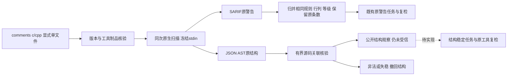

# C/C++原生结构公开反馈 / Public native structural feedback

延续introduce-rust-codeguard-cli的8.26、8.29、15.3、15.6。原生Clang版本核验后，同次冻结stdin扫描输出SARIF警告和JSON AST；共享原工具字节核验、截止时间、取消与输入预算。原语法探针和原警告任务复检仍使用原档案。

After original Clang identity validation, a single frozen-stdin scan produces warnings and a documentation AST. Both share tool continuity, deadline, cancellation and input bounds. Existing syntax checks and original warning-task verification retain their profiles.



```bash
codeguard comments c /absolute/project/api.c --clang-tool /usr/bin/clang --standard c11 --format=json
codeguard comments cpp /absolute/project/api.cpp --clang-tool /usr/bin/clang --standard c++17 --format=json
```

新封闭协议：未绑定feedback0.5、已绑定feedback0.6；原结构0.1及全部489份历史schema不变。native仅原生脱敏警告；documentation_structure独立记录status、reason、native_raw_diagnostic_count和observation。原警告零诊断仍可观察documentation_comment缺失。AST格式不合法保留原警告，但结构状态incomplete；源码/工具失稳、语法失败、截止或取消不保留有效结构。新输出仍exit3（取消130）、coverage_proven=false、detailed_contract_qualification=not_granted。

New closed protocols are feedback0.5 (unbound) and0.6 (bound); structure0.1 and all489 historical schemas remain unchanged. Native warnings and structural observations are separate. Invalid AST preserves valid warnings but leaves structure incomplete; changed inputs, syntax failure or interruption cannot retain valid structure. Exit3/130 and no production qualification remain mandatory.

缺注释样例的字段摘录（不是完整schema实例）：

```json
{
  "schema_version": "0.5.0",
  "command_status": "incomplete",
  "coverage_proven": false,
  "documentation_structure": {
    "status": "observed",
    "reason": "clang_structure_observed",
    "native_raw_diagnostic_count": 0,
    "observation": {
      "authority": "local_unverified",
      "qualification": "not_granted",
      "functions": [{"name": "f", "comment_presence": "absent", "missing_components": ["documentation_comment"]}]
    }
  },
  "structural_task_workflow_status": "not_integrated"
}
```

真实RED：公开命令没有结构对象。接线后原生文档用例又因Clang在AST输出时重复发出原警告而失败；按已有脱敏规则/位置/等级归并，保留raw条数，不放宽原单诊断断言。真实bare_param对C/C++均2原条数/1归并条数。空结构mock保持原文档警告，结构incomplete；失稳、语法、未知规则、超时/取消和原警告任务复检回归保留。

The public test initially failed because structure was absent. Existing native tests then exposed duplicate warning emission during AST output; grouping preserves the original raw count and the original single-diagnostic assertion. The C/C++ bare-param cases each record two raw/one normalized warning. Invalid AST does not erase valid warning evidence.

默认与WASM各35项通过，其中公开真实用例各12份（缺注释、空说明、完整说明、重复警告、已绑定和缺工具），同时覆盖原文档、工作台/复检与语法回归。两种严格Clippy通过；491schema有效，489历史字节不变，130反馈合法，9伪造负例拒绝，旧消费者拒绝新版本。

Both modes pass35 targeted tests, including12 real public cases each, plus existing warning/workbench/verification and syntax regressions. Strict Clippy passes in both modes;491 schemas valid,489 historical schemas unchanged,130 feedback reports valid and nine forged reports rejected.

- [默认公开原生](evidence/c-family-comments-structure-cli.json)
- [WASM构建公开原生](evidence/c-family-comments-structure-cli-wasm.json)
- [公开协议回归](evidence/c-family-comments-structure-schema.json)
- [底层结构边界](clang-documentation-structure.md)

未初始化不写工作台；已绑定缺注释但无警告时不冒充已创建结构任务，structural_task_workflow_status明确not_integrated。完整详细文档准确性、全部对象/项目上下文、结构稳定任务与原工具复检、可信关闭/复发、独立精度、五平台/发行继续待完成；66完成/288未完成、228核心blocked、grammar0/32不变。

Uninitialized projects stay uninitialized. Bound structural absence does not imply a persisted repair task. Structural tasks/verification, full accuracy/context, trusted closure, precision, platform and release acceptance remain pending. Counts remain66/288, all228 cores blocked and grammar qualification0/32.
