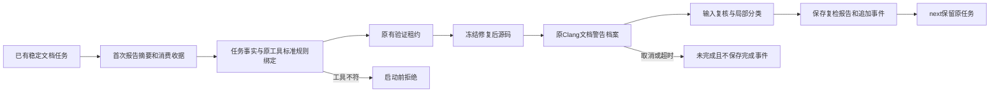

# C/C++文档原任务复检局部验收

对应现有OpenSpec introduce-rust-codeguard-cli 的8.26、8.29、15.3、15.6。完整四核心、详细注释、独立精度和生产资格均未完成；未改变父任务勾选。



公开入口：`codeguard task verify TASK_ID ROOT --clang-tool /absolute/original/clang --format=json`。工具参数可省略，仍使用首次工具路径。仅限既有Apple Clang21的C11/C++17档案；不发现替代工具、不安装、不执行用户源码或项目构建。不同路径和已观察制品变化在租约前拒绝。原生执行复用冻结stdin、版本/制品复核、受控SARIF、输出预算、进程组和同一截止时间。

协议：内部clang_documentation_task_recheck0.1，公开task_verification_preview0.36，repair_brief_preview0.29，已有工作台的comments反馈0.3；未绑定comments仍0.1。历史schema字节保持。复检导入只核验及消费当前任务观察，不导入本次其它规则作为新任务。原始诊断保留，不用可编辑Markdown重建身份。

| 观察 | 结果 | 任务状态 |
| --- | --- | --- |
| 同一原规则仍出现 | still_present | open |
| 原规则局部消失 | candidate_absent_unverified_policy | open，等待完整覆盖和政策核验 |
| 当前源码或执行前后工具不稳定 | incomplete | open，无修复授权 |
| 环境仍不可用/未知规则映射 | still_blocked | open |
| 局部环境恢复 | environment_restored_unverified_policy | open |
| 超时 | incomplete，未持久化事件 | open |
| SIGINT | cancelled，退出130，未持久化事件 | open，无后台延迟写入 |

测试先于实现：专用复检测试首先因旧0.6/not_integrated失败；SIGINT回归首先因退出3失败，再接通0.36和取消130。受控测试覆盖原任务存在/局部消失、不同工具路径/已观察工具字节变化、外来参数、修复后源码、运行期间源码变化、超时、伪造任务绑定、追加导入、取消及子孙进程回收。真实已安装Clang分别对C/C++进行扫描、仍存在复检、添加参数描述后的局部消失复检；默认与WASM构建都实际执行。真实夹具仍非独立holdout，不授予语言资格。

```bash
CARGO_PROFILE_TEST_DEBUG=0 CODEGUARD_CLANG_BIN=/usr/bin/clang cargo test --offline --locked -p codeguard-cli --test c_family_comments_workbench -- --include-ignored
CARGO_PROFILE_TEST_DEBUG=0 CODEGUARD_CLANG_BIN=/usr/bin/clang cargo test --offline --locked -p codeguard-cli --features wasm-precheck --test c_family_comments_workbench -- --include-ignored
```

证据：[默认原生](evidence/c-family-comments-task-recheck-native.json)、[WASM构建原生](evidence/c-family-comments-task-recheck-native-wasm.json)、[封闭协议](evidence/c-family-comments-task-recheck-schema.json)。证据绑定当次二进制和测试源码摘要，不是发行制品资格。

剩余缺口：Clang完全没有注释仍可零诊断，不能证明用途/参数/返回/异常/行为完整准确；项目配置、头文件/宏/编译数据库、专用attempt日志及无进展控制、可信关闭和复发、原生项目check/Hook、独立精度、五平台与发行验收仍未完成。next明确task_verify=partial、attempt_journal=not_integrated，不以新事件冒充完整修复历史。


本轮验证：默认与WASM构建专用工作台目标各14项通过（包含显式启用的真实Clang用例）；此前五个默认相关目标共56通过/12条件忽略。默认/WASM全工作区all-targets严格Clippy通过。封闭协议回放共485份schema，481份历史schema字节未变，18项负例拒绝。验收计划审计核对186份来源摘要及1312处任务引用，228项义务继续blocked；OpenSpec严格验证、层级检查及diff检查通过。

远端8a80420的CI37535353443已确认failure：gate在固定插件审计源dec5f9d不可达处失败。未改低固定来源要求，也未推送待确认的插件main；本轮本地通过不能代替CI或完整生产验收。

当前增量：专用尝试日志与当前输入预算已接通，next0.30、绑定comments0.4、task show0.4。本文0.29/0.3及未接通说明为33aa17b历史检查点；当前范围与缺口见[尝试日志验收](c-family-comments-attempt-history.md)。
