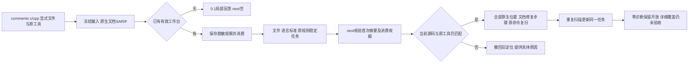

# C/C++文档原生观察的稳定任务接线

对应现有change的native-tool-adapters与8.26/8.29/15.3/15.6，父任务保持未完成。未绑定工作台保留反馈0.1；已有工作台使用封闭反馈0.2、内部观察0.1、next0.28。真实C/C++工具仍限定已测Apple Clang21，标准C11/C++17；不安装或发布。



任务是规则位置组，不声称组内位置为同一语义缺陷；行号与源码摘要不参与任务身份，同一文件不同语言标准/规则不能混合。缺工具、预处理/语法受阻和未适配规则生成稳定环境/覆盖组，不成为源码违规。所有原始规则与脱敏位置保留，不保留工具自由文本。工具字节、源码或首次上下文改变时不推荐按旧位置修改。无初始诊断不会虚构源码任务，详细覆盖仍not_granted。

`codeguard comments c /absolute/project/api.c --workspace /absolute/project --clang-tool /usr/bin/clang --standard c11 --format=json`明确工作区；省略workspace时仅选择最近已存在工作台，最近无效目录不能回退到祖先。显式越界启动前拒绝；未初始化不创建目录。任务Markdown包含七项指引，删除投影后work sync通过原报告摘要和消费收据恢复；删除投影不删除事实。

开发期测试先复现workspace拒绝，再实现稳定组与next。初始化和work sync本来退出3，夹具按实际partial契约修正，没有改宽产品断言。篡改首次报告被共享消费摘要在候选读取前拒绝，测试验证consumed_marker_invalid且repair_brief为空；坏新报告无法创建发现。目标回归覆盖位置移动、清洁复扫、输入/工具变化、投影恢复、C++检查器归属、未知规则阻塞、缺工具/原因变化、显式越界与最近坏工作台。真实已有Clang分别将C和C++两处空参数描述接入各自稳定任务；这是本机原生集成，不是独立精度或跨平台验收。

三份新schema独立回放实际输出，旧协议字节保持；拒绝越权authority/allow、伪造覆盖、错语言标准、伪造局部完成、额外字段、清洁状态夹带修复权限与自由追加argv。Python脚本仅开发期协议回放，生产路径为Rust。

明确缺口：专用task verify和尝试日志仍未接通，命令显式返回not_integrated且不创建任务租约，不误走其他语言。next只绑定原comments复扫指令，不声称正式复检事件。完整项目原配置/头文件/宏、缺失全部API注释、详细用途/错误/行为、项目check/Hook、白名单纠错、可信关闭/复发、性能预算和声明平台/宿主/发行均未完成。next历史当前选择有1000报告边界，不是高并发性能验收。所有228核心资格blocked，grammar资格0/32，未勾选父任务。

证据：[协议回放](evidence/c-family-comments-workbench-schema.json)、[默认本机原生](evidence/c-family-comments-workbench-native.json)、[WASM构建本机原生](evidence/c-family-comments-workbench-native-wasm.json)。native记录绑定当次候选二进制和测试源码摘要，不能用它授予最终发行资格。

相关回归：默认七个目标65通过/14条件用例未执行；WASM九个目标79通过/14条件用例未执行。这些运行早于最后追加的链接跨工作台反例；最终工作台目标默认8通过/1条件用例另显式原生运行通过，WASM使用已有Clang执行include-ignored共9通过，两个语言原生样本各有两处文档位置。公共计划与next/status/help最后五目标30通过/1条件未执行。481份schema有效、478份历史协议字节不变，两种构建的实际报文分别回放，12类反例分别拒绝。未执行条件用例不计为成功，也不将重复回归合计为独立样本。

可复跑命令（使用已经存在且符合版本的工具）：

```bash
CARGO_PROFILE_TEST_DEBUG=0 cargo test --offline --locked -p codeguard-cli --test c_family_comments_workbench
CODEGUARD_CLANG_BIN=/usr/bin/clang CARGO_PROFILE_TEST_DEBUG=0 cargo test --offline --locked -p codeguard-cli --features wasm-precheck --test c_family_comments_workbench -- --include-ignored
python3 tests/c_family_comments_workbench_schema.py /absolute/development-report-directory
```

当前增量：绑定反馈已为0.3、next0.29，原任务复检已接通。上文0.2/0.28和未接通说明为8a80420历史检查点；当前证据见[原任务复检](c-family-comments-task-recheck.md)。
