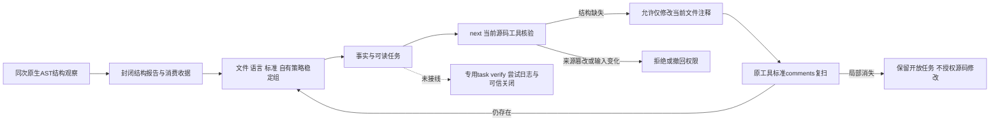
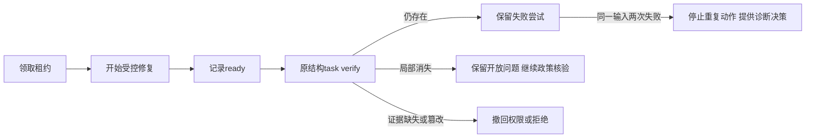

# C/C++函数文档结构稳定任务 / Stable structural documentation tasks

对应introduce-rust-codeguard-cli的8.26、8.29、15.3、15.6。显式comments的原生结构观察现能连接已初始化工作台、导入一个文件策略组、投影任务及读取当前next/task show。

Explicit comments can now persist original native structural observations in an initialized workbench, import a file-policy group, project its task and read current next/task show guidance.



规则为codeguard.documentation.function_structure_required，来源codeguard_structural_policy，不是Clang原警告。归并身份只包含文件、语言、标准和策略；名字、行号、源码摘要不参与单函数身份。重载及同名函数的全部当前字节定位与缺失组件进入structural_positions，不把两处问题绑定到一个错误函数。

The Codeguard-owned policy is distinct from original Clang warnings. Its identity uses file/language/standard/policy, not names, positions or source bytes. Current evidence lists every affected function and component in the file group, including overloads. The legacy finding storage uses the normalized native_rule_id field for this Codeguard-namespaced ID; the brief explicitly exposes structural_rule_id and rule_source rather than claiming a compiler warning.

新报告结构workbench0.1、已绑定comments反馈0.7、结构next0.31、task show0.5。未绑定反馈0.5、原警告工作台/复检/next及全部491历史schema不变。首报告摘要、事实与精确消费收据相互绑定；重复扫描更新同一事实而不关闭。源码变化后先撤回权限，复扫才恢复当前定位；源码行索引复用，避免逐函数重扫整个前缀。

New protocols are structural workbench0.1, bound feedback0.7, brief0.31 and task show0.5. Unbound feedback0.5, original warning protocols and all491 historical schemas remain unchanged. First-report digests, facts and exact consumption receipts are bound. Changed inputs withdraw permissions; a new original scan restores current positions. The validator reuses a line index rather than rescanning each source prefix.

```bash
codeguard comments cpp /absolute/project/api.cpp --clang-tool /usr/bin/clang --standard c++17 --format=json
codeguard next /absolute/project --format=json
codeguard task show CG_TASK_ID /absolute/project --format=json
# 按当前structural_positions补齐准确说明，再执行next.repair_brief.recheck_argv的原comments命令
```

任务包含问题证据、规则依据、允许修改、步骤、复检、历史与关闭条件；删除Markdown可由已消费事实恢复，不删问题。规则组件和源码token/字节行列均核对；错误数组、索引、重复位置、组件与状态矛盾被拒绝。低误报边界仍来自底层结构：重声明、文档引用、复杂类型、未支持声明保持未知，非空不证明详细准确性或行为。

Tasks include evidence, policy basis, scope, steps, re-scan, history and closure conditions. Deleted projections can be recovered from consumed facts. Exact component and source/token-position checks reject contradictions. Redeclarations, references and unsupported types/declarations remain unknown; nonempty content does not prove accuracy or behavior.

真实RED于缺少结构任务。默认/WASM各27目标测试通过，含各一真实C/C++文件组链路：重复身份、移动行号、重载定位、删任务恢复、完整注释后候选消失但事实open、篡改首次报告拒绝、专用verify/attempt拒绝；另七适配器测试通过。WASM共用任务回归38通过/10依赖真实Ruff的条件忽略；两种严格Clippy通过。

The initial native test failed on missing structural tasks. Both modes pass27 targeted tests; native chains cover identity, line movement, overload evidence, projection recovery, correction without closure, changed original-report rejection and unimplemented verify/attempt refusal. Seven adapter tests pass; shared task regression passes38 with10 native-Ruff cases ignored. Strict Clippy passes in both modes.

- [默认原生任务链路](evidence/c-family-structure-workbench-native.json)
- [WASM构建任务链路](evidence/c-family-structure-workbench-native-wasm.json)
- [协议证据](evidence/c-family-structure-workbench-schema.json)

协议验证495有效schema/491历史不变、20反馈与brief对、20原结构报告、4task show、5负例拒绝。以上是开发证据，非独立holdout或发行制品资格。未绑定项目不创建结构工作台；已有环境/原警告任务继续独立存在。

Schema regression validates495 schemas,491 unchanged historical documents,20 feedback/brief pairs,20 native packets and4 task-show reports, rejecting five forged reports. These are development evidence, not independent holdout or release qualification.

专用task verify、受控attempt与无进展预算尚未接线，明确在启动错误检查器或租约动作之前拒绝；指引当前使用首次工具/标准/工作区的comments原命令复扫。本地候选消失不关闭，也不能因勾选自批白名单。全部对象详细准确性、项目配置/宏/源集、统一check/Hook、可信关闭/复发、独立精度、五平台/发行继续待完成；66完成/288未完成、228核心blocked、grammar0/32保持。

Dedicated task verify, controlled attempts and no-progress budgets remain pending and are rejected before wrong-checker execution or lease mutations. Re-scan uses the original selected tool/standard/workspace comments command. Full accuracy/context, check/Hook, trusted closure, precision, platforms and releases are pending;66/288,228 blocked obligations and0/32 grammar qualification remain unchanged.

## 原结构task verify增量 / Original structural task recheck

结构任务现进入专用task verify路径，固定首次报告摘要/消费收据/开放事实/原Clang字节/标准；冻结当前源码，执行同一有界AST档案。报告0.1为结构recheck，公开verification0.37；局部still_present/incomplete/candidate_absent_unverified_policy均不关闭任务。共享租约、持久化前输入核验和取消/截止保持。

Structural task verify binds original report/consumption receipt/open fact/compiler bytes/standard, freezes current source and executes the same bounded AST profile. Local results never close tasks. Shared leases, pre-persistence current-input checks and cancellation/deadline limits remain in force.

本轮发现旧brief给出的comments --workspace不可执行；新brief0.32生成task verify原工具argv，真实测试直接执行该argv。task show0.6、绑定反馈0.8；495历史schema保持字节不变，新增5份schema。专用attempt仍拒绝，受控尝试预算、完整语义/项目/平台/独立精度与可信关闭继续缺失，66/288和228blocked、0/32保持。以上早期“verify未接线”和491历史schema为e77517a之前检查点。

The previous brief included an unsupported comments --workspace argument. Brief0.32 supplies executable original-tool task-verify argv tested directly, with task-show0.6 and feedback0.8. All495 historical schemas remain unchanged. Attempts, complete semantics/project/platform/independent precision and trusted closure remain pending.

本增量验证：默认/WASM各27个公开目标测试通过，另各一个真实原工具内部契约测试覆盖still_present、局部消失、源变化、原规则/工具/首次报告篡改、语法错误和截止耗尽。500份schema有效，495历史字节不变；20反馈/brief对、28结构报告、8公开verification、8内部原生复检、4task show及5伪造负例通过。独立标注精度和生产资格仍未授予。

Current validation: both modes pass27 public target tests and one real internal contract test covering presence/absence/input changes, forged origins/rules/tools, syntax errors and expired deadlines.500 schemas are valid,495 unchanged;20 feedback/brief pairs,28 packets,8 public verifications,8 internal native reports and4 task-show reports validate, with five schema forgeries rejected. These do not grant independent precision or production qualification.

- [原结构复检证据](evidence/c-family-structure-recheck-native.json)
- [WASM构建复检契约证据](evidence/c-family-structure-recheck-native-wasm.json)

## 结构尝试与失败预算 / Structural attempts and failure budget

新结构任务尝试身份绑定当前源码、首次语言/标准/AST profile/自有策略与原工具状态/字节摘要；同一受控repair-source动作使用共享租约与追加事件。ready-to-verify之后先执行原结构task verify；两次仍存在的当前输入复检令next停止源码修复并提供具体诊断决策。缺报告不清除失败，事件结论须匹配实际结构报告与摘要。

Attempt identity includes current source, original language/standard/AST profile/policy and compiler state/bytes. Shared leases and append-only journals control repair-source. Ready attempts require original structural verification; two still-present rechecks withdraw repair permission for unchanged inputs. Missing evidence does not remove failures; event outcomes must match actual report bytes and structure.



新brief0.33/task show0.7/绑定反馈0.9，原verification0.37不变。此前attempt未接入的段落为7866920检查点。跨输入语义进展、完整API详细准确性、项目/平台/独立精度、可信关闭/复发仍缺；66完成/288未完成、228blocked、0/32保持。

本轮真实验收：默认/WASM各27目标测试、各1内部原结构契约测试通过；覆盖C/C++各两次ready/原生仍存在、等待复检、预算耗尽、重命名/重扫/删投影不重置、缺私有报告/消费收据保持未验证及伪造收据/事件拒绝。原语法错误/截止/输入变化边界保留。共享任务回归38通过/10条件忽略，两种严格Clippy通过。503schema有效/500历史字节不变，44结构报告、16公开verification、8内部原生报告、20反馈/brief对、4task show及5协议伪造负例通过。上述是开发验收，未获得独立精度/生产资格。

Native tests cover two ready/present cycles for each C/C++ context, required verification, exhausted budgets, rename/rescan/projection recovery, missing reports/receipts and forged receipt/event rejection. Both modes pass27 target tests and one internal native contract; shared task regression passes38 with10 conditional skips.503 schemas preserve500 historical documents, validating44 packets,16 public verifications,8 internal reports,20 feedback/brief pairs and4 task-show reports with five schema forgeries rejected. Qualification remains not_granted.
