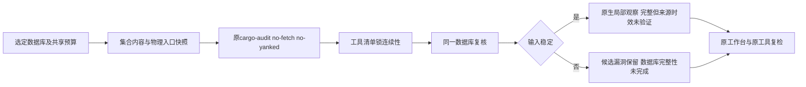

# Rust CVE 本地漏洞库输入稳定性

对应现有OpenSpec 7.1、15.5、15.6的进展，不授予可信来源/时效或生产资格。`cve rust`、`check all`及原任务复检复用同一调用函数，现在局部完成还要求选定漏洞库前后观察稳定。原0.1报告、工作台协议和历史schema不变，新增失败原因由原结构承载。

集合范围依据[RustSec原生Database::open](https://github.com/RustSec/rustsec/blob/main/rustsec/src/database.rs)读取的crates/rust目录。CodeGuard只观察输入，不复制漏洞判定规则。根级.git、db.lock和其它仓库说明不计advisory内容；它们的可信来源、提交和时效仍属于独立义务。缺集合交给原工具解释，不能凭空目录快照授予数据库资格。

快照纳入集合/包目录和文件成员、设备/inode及ctime、文件字节摘要，根目录单独绑定物理身份。增删、改写、同内容根替换或写后恢复字节均不能沿用旧完整状态。文件读取复用runtime目录fd相对的SourceSnapshot，拒绝父路径/文件链接；特殊文件、读取失败、超限为环境阻塞，不是源码漏洞。所有路径保持私有，不把本地库路径或内容原文注入对话。

资源基线：最多16384条目、16级目录、单文件2MiB、总文件字节64MiB；遍历逐条检查同轮截止时间和取消，文件系统读取本身仍为同步操作，完整跨平台/硬IO中断和性能资格未验收。前置快照失败不执行原工具；后置失败保留通过严格原生JSON/退出/锁身份核验的advisory候选，local_scan_complete=false。原工作台接收此局部未完成候选并保持完整性任务开放。不能凭候选立即更改依赖或批准关闭。

测试：初始运输夹具checksum不符，被原锁身份核验正确拒绝；修正后用旧调用模块实际复现数据库改写仍local_scan_complete=true的RED，恢复新增调用后GREEN。六场景覆盖改写/删除/新增/根物理替换/恢复原字节/正常db.lock更新，稳定待处理任务仍存在。集合链接和2MiB超限在执行工具前拒绝且无源码finding。受控JSON只证明运输、输入和工作台边界，不证明真实RustSec规则。

使用已有cargo-audit0.22.2与已有离线RustSec库，原生漏洞锁检出RUSTSEC-2020-0071，只有根包的锁零漏洞，两者稳定观察完整且database_freshness=unverified、delivery_decision=not_evaluated。不fetch、安装或改项目依赖。证据见[默认运输](evidence/cargo-audit-database-stability.json)、[默认真实原生](evidence/cargo-audit-database-native.json)、[WASM构建运输](evidence/cargo-audit-database-stability-wasm.json)、[WASM构建真实原生](evidence/cargo-audit-database-native-wasm.json)。

仍缺可信pin/签名/时效、完整依赖图/目标/平台、安全策略、精确漏洞任务的可信关闭/复发、独立精度、跨平台/宿主和发行验收。0.1协议继续保留not_evaluated，父任务未完成。

最终相关六个CLI目标：默认64通过/16条件忽略，WASM构建64通过/16条件忽略；真实有/无漏洞原生测试两种构建各1项显式通过。477份schema元定义有效，16份当前实际/运输报告有效，4项伪造批准/通过变体被拒，477份历史schema字节不变。schema的类型约束不是稳定性或批准证明，工作台还核对完整性原因与状态对应。
