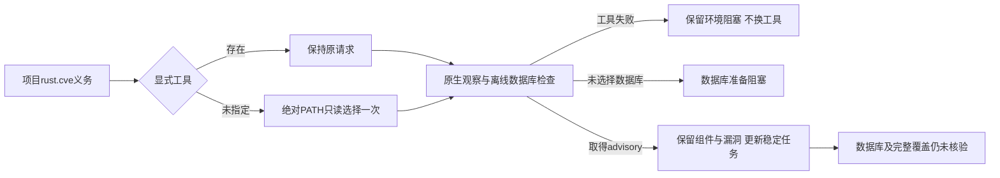

# 项目 Rust CVE 检查发现已安装 cargo-audit

对应同一OpenSpec S05.2/5.6、S07.1、S09和S14.5，完整父任务保持开放。

`check all` 的 rust.cve 节点现在先保留显式工具；未指定时只读调用进程PATH的绝对目录，选定首个存在入口并固定其规范路径。选择过程不启动shell、不安装或下载工具，不推断离线数据库。空/相对PATH不作为安装来源。首个损坏链接、不可用入口或显式坏工具不会被后面的正常工具替换；执行、输入摘要、共同截止时间及取消仍由原Rust原生观察服务处理。

先失败的项目反例显示已安装工具仍返回cargo_audit_tool_not_selected；修复后工具与数据库阻塞分别显示。模拟PATH工具、显式坏路径与首个坏链接后存在好工具的测试均通过，原缺工具夹具使用独立空PATH，不再依赖开发机是否安装工具。独立cve rust和task verify仍要求既有显式原工具/数据库参数，未扩大为自动安装、数据库更新或完整工具锁能力。

实际已安装cargo-audit0.22.2、现有离线RustSec数据库，通过隔离PATH中的既有工具链接执行两轮check all（没有显式cargo-audit参数）。锁定time0.1.40检出RUSTSEC-2020-0071，两轮同一CVE任务open；工具字节摘要与报告tool_sha256相同。数据库提交/时效未获可信核验，输出仍incomplete/not_evaluated，实际本机数据库HEAD为117edb3bed98e9be112f277b7615eea3252e7c43，仅为观察，不提升信任。

实际整份报告校验揭露旧check0.38没有引用既有专用Clippy修复简报schema。Clippy简报自身符合rust-clippy-repair-brief-preview0.1；新增check0.56引用该封闭类型，并补齐该版本的语言可空字段，旧schema不修改，也不丢弃兄弟任务或放宽为任意next对象。普通版本反例先RED为0.38，修正后GREEN；两份实际聚合报告和两份嵌入CVE报告验证通过，374份schema元定义通过，三种版本/放行/任意checker篡改及旧消费者拒绝。

证据：[实际输出与稳定任务](evidence/cargo-audit-path-discovery-2026-10-06.json)，包含实际执行程序和工具摘要。默认及WASM四目标各40 passed / 0 failed / 7条件忽略，两个配置计数重叠不相加；实际原生专用目标显式执行1 passed / 0 failed / 0 ignored，最终2.33秒。目标为cargo_audit_cli、check_all_cargo_audit、check_all_partial_contract和check_all_rust_native；未执行用户Erlang草稿。

本轮不包含32语言精度修复、实际宿主、完整CVE覆盖或发布。CI994d4af对应37412101222的MSRV成功；gate在固定插件提交dec5f9d尚未发布的来源检查处失败，与本轮新代码需独立核验。没有替换固定审计来源或删除失败门禁。

最终默认与WASM全目标Clippy -D warnings、分层、所改Rust文件格式、OpenSpec strict与diff检查通过。新CI须按本轮提交独立验收；完整父任务保持开放。
