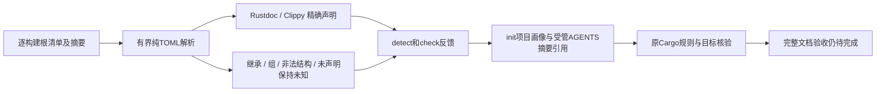

# Cargo 文档规则声明及未解析范围

对应已有OpenSpec 7.1/15.3/15.6，不授予文档生产资格。

逐Cargo构建根从同次已观察清单字节及SHA-256读取五项精确规则：Rust missing_docs、Rustdoc broken_intra_doc_links，Clippy missing_errors_doc/missing_panics_doc/missing_safety_doc。纯Rust调用已有TOML解析器，不运行Cargo或注入规则；256KiB/UTF-8/普通文件由现有观察端口保护。二次读取与本次摘要不一致时撤回声明并保持发现不完整，不能把旧身份绑定新规则。

原生依据：[Cargo清单lint配置](https://doc.rust-lang.org/cargo/reference/manifest.html#the-lints-section)、[workspace继承](https://doc.rust-lang.org/cargo/reference/workspaces.html#the-lints-table)。四种等级和可解析priority仅记录清单声明，不计算生效覆盖。没有声明、只有lint组、workspace继承及虚拟根均为unknown；源码属性、组优先级及本机版本仍须原生核验，未知结构不会变成源码违规。

新CLI配置测试先RED：之前没有Cargo文档配置记录；接通后保留等级与来源。初始init测试误期待受管AGENTS复制详细指引，现核验既有设计：AGENTS保留检查器摘要和画像引用，具体声明在.codeguard/project.json，清单不改写。适配器边界覆盖未知等级、非法结构/priority/继承混用、超限和非UTF8；发现端口反例确认扫描中清单变化不能消费新等级。

[真实原生默认证据](evidence/cargo-documentation-manifest-native.json)和[WASM证据](evidence/cargo-documentation-manifest-native-wasm.json)使用已有Clippy：清单warn得到三诊断、allow消失、源码属性启用但清单未声明仍得到三诊断；静态状态全unknown，真实无诊断不授予修复/覆盖/交付。两配置重叠不计独立精度语料；工具版本和CLI制品摘要随证据保存。历史证据不覆盖。

原项目的workspace生效继承、group/priority真正覆盖、cfg及私有/宏/全目标、详细正文与参数/返回准确性、配置准备稳定任务和可信闭环、独立精度及平台/宿主/发布仍未验收；父任务不勾选，66完成/288待完成、正式grammar资格0/32。

本批默认和WASM六个受影响CLI目标各120通过/6条件忽略，新已有原生工具条件两配置各显式1通过；默认适配器畸形/超限与来源变化单元各1通过。初始化画像和受管引用保持原清单字节；初版测试期望直接复制指引的失败保留并核对既有摘要契约。12实际报告经原schema验证，474历史schema原字节保持；双配置全工作区全目标严格Clippy、定向格式、分层和OpenSpec strict通过。
